# LetX LaTeX Template Library

  

**Free, elegant, open-source LaTeX templates** — research papers, CVs, grants, lab reports, posters, letters and more. Every template is compile-tested and designed to look genuinely good, not plain.

> ⚡ **Edit any template online in seconds — no LaTeX install.** Open it at **[letx.app/templates](https://letx.app/templates)**: real-time collaboration, one-second compiles, right in your browser.

## How to use

- **Online (recommended):** click *Open in LetX* on any template — it opens ready to edit and compile.
- **Locally:** `git clone` this repo, `cd <template>`, then `latexmk -pdf main.tex` (check each template's `metadata.json` for its compiler).

## Templates

### Journal Articles & Papers

<table>
<tr>
<td width="33%" valign="top" align="center"><a href="https://letx.app/templates/journal-articles/aastex-apj-paper">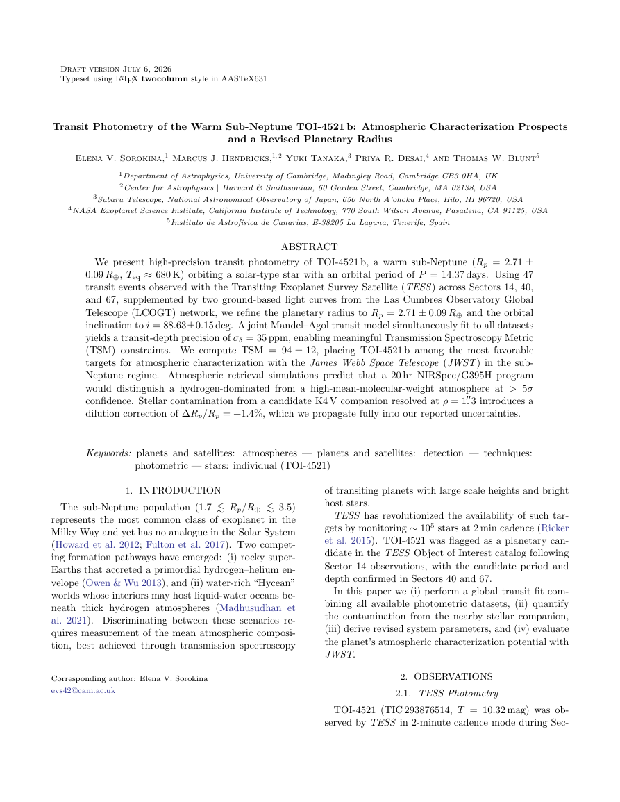</a> <b>AASTeX Astronomy Paper</b> <a href="https://letx.app/templates/journal-articles/aastex-apj-paper">Open in LetX</a> · <a href="./aastex-apj-paper">Source</a></td>
<td width="33%" valign="top" align="center"><a href="https://letx.app/templates/journal-articles/arxiv-preprint">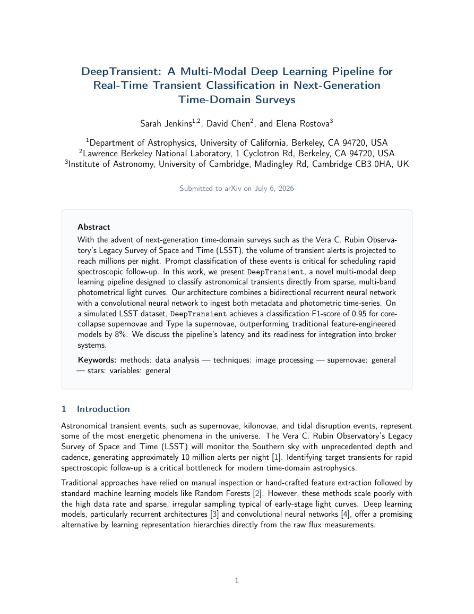</a> <b>arXiv Preprint</b> <a href="https://letx.app/templates/journal-articles/arxiv-preprint">Open in LetX</a> · <a href="./arxiv-preprint">Source</a></td>
<td width="33%" valign="top" align="center"><a href="https://letx.app/templates/journal-articles/clinical-case-report">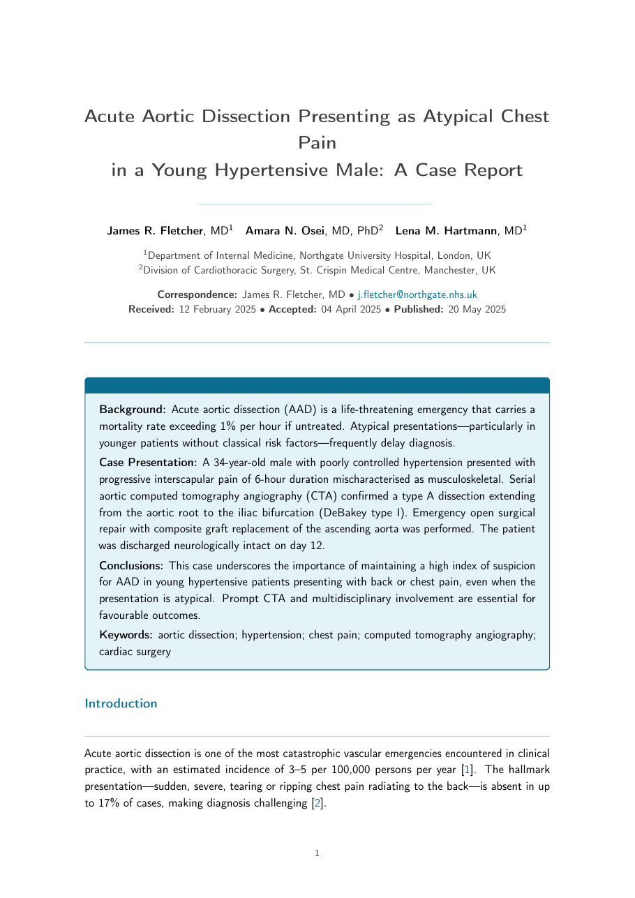</a> <b>Clinical Case Report</b> <a href="https://letx.app/templates/journal-articles/clinical-case-report">Open in LetX</a> · <a href="./clinical-case-report">Source</a></td>
</tr>
<tr>
<td width="33%" valign="top" align="center"><a href="https://letx.app/templates/journal-articles/journal-cover-letter">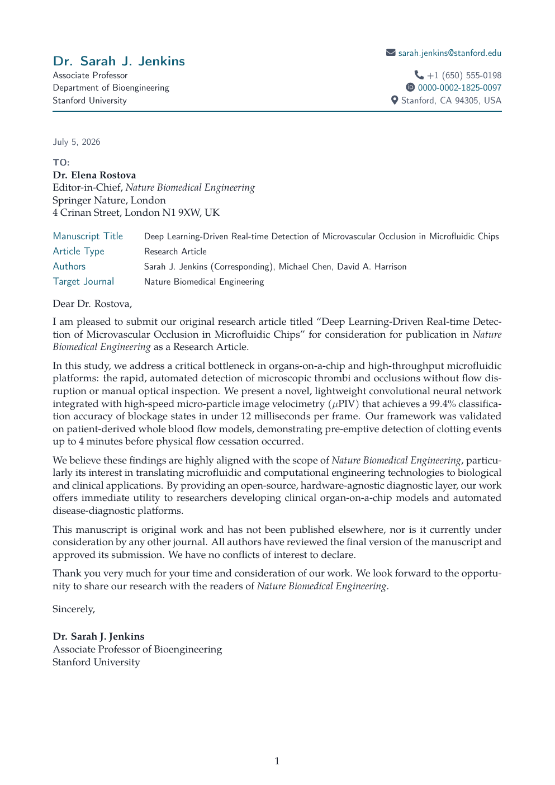</a> <b>Journal Cover Letter</b> <a href="https://letx.app/templates/journal-articles/journal-cover-letter">Open in LetX</a> · <a href="./journal-cover-letter">Source</a></td>
<td width="33%" valign="top" align="center"><a href="https://letx.app/templates/journal-articles/mnras-paper">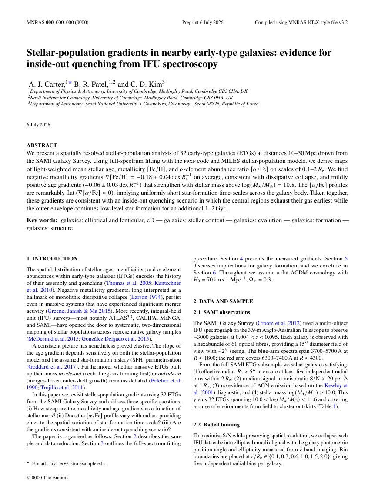</a> <b>MNRAS Journal Paper</b> <a href="https://letx.app/templates/journal-articles/mnras-paper">Open in LetX</a> · <a href="./mnras-paper">Source</a></td>
<td width="33%" valign="top" align="center"><a href="https://letx.app/templates/journal-articles/prisma-systematic-review">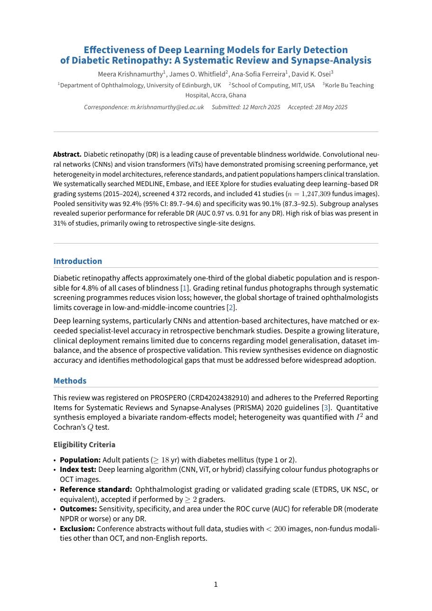</a> <b>PRISMA Systematic Review</b> <a href="https://letx.app/templates/journal-articles/prisma-systematic-review">Open in LetX</a> · <a href="./prisma-systematic-review">Source</a></td>
</tr>
<tr>
<td width="33%" valign="top" align="center"><a href="https://letx.app/templates/journal-articles/response-to-reviewers">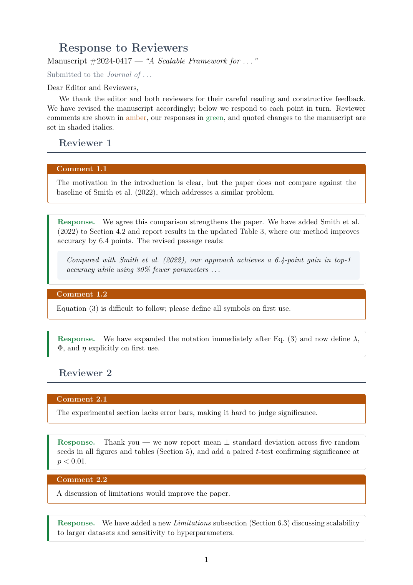</a> <b>Response to Reviewers</b> <a href="https://letx.app/templates/journal-articles/response-to-reviewers">Open in LetX</a> · <a href="./response-to-reviewers">Source</a></td>
<td width="33%" valign="top" align="center"><a href="https://letx.app/templates/journal-articles/revtex-aps-paper">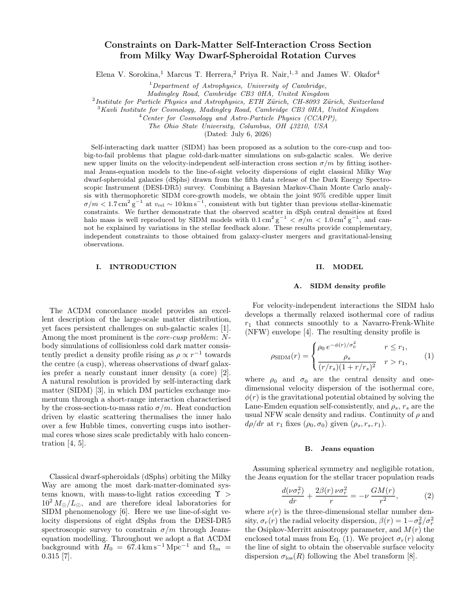</a> <b>REVTeX 4.2 Physics Paper</b> <a href="https://letx.app/templates/journal-articles/revtex-aps-paper">Open in LetX</a> · <a href="./revtex-aps-paper">Source</a></td>
</tr>
</table>

### Conference Papers & Abstracts

<table>
<tr>
<td width="33%" valign="top" align="center"><a href="https://letx.app/templates/conferences/aiaa-conference-paper">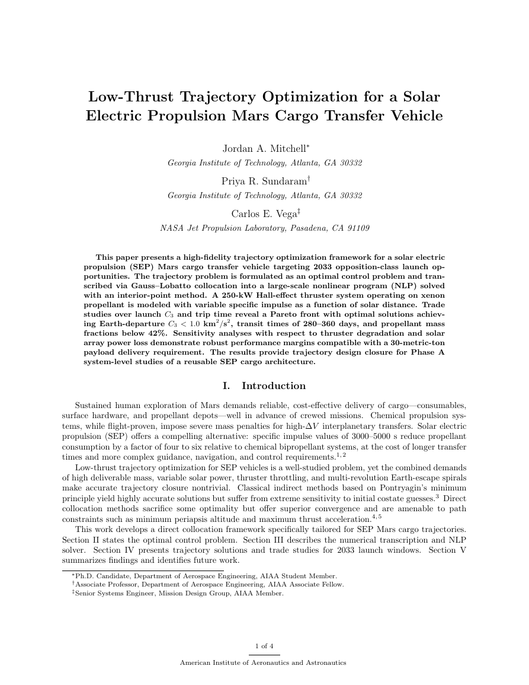</a> <b>AIAA Conference Paper</b> <a href="https://letx.app/templates/conferences/aiaa-conference-paper">Open in LetX</a> · <a href="./aiaa-conference-paper">Source</a></td>
<td width="33%" valign="top" align="center"><a href="https://letx.app/templates/conferences/conference-abstract">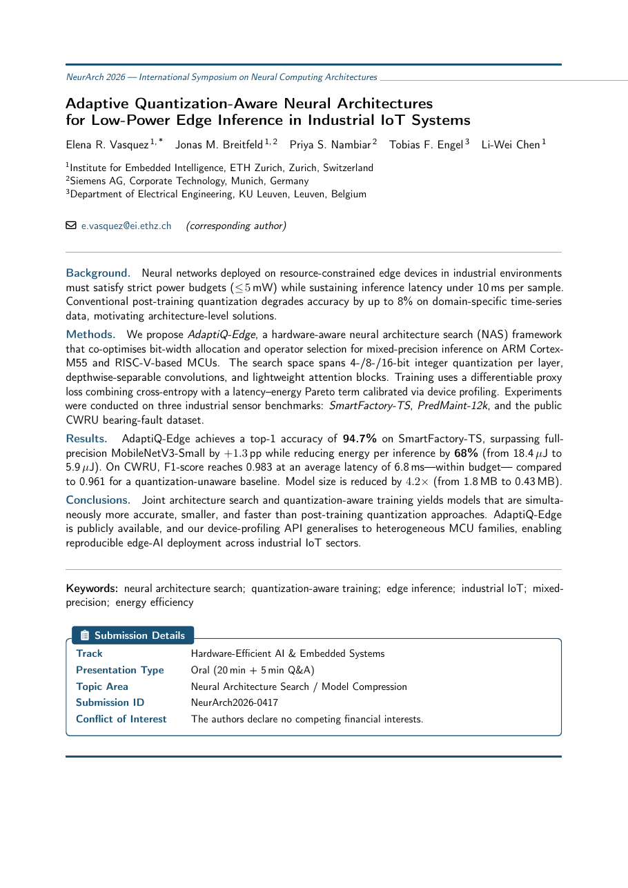</a> <b>Conference Abstract</b> <a href="https://letx.app/templates/conferences/conference-abstract">Open in LetX</a> · <a href="./conference-abstract">Source</a></td>
<td width="33%" valign="top" align="center"><a href="https://letx.app/templates/conferences/extended-abstract">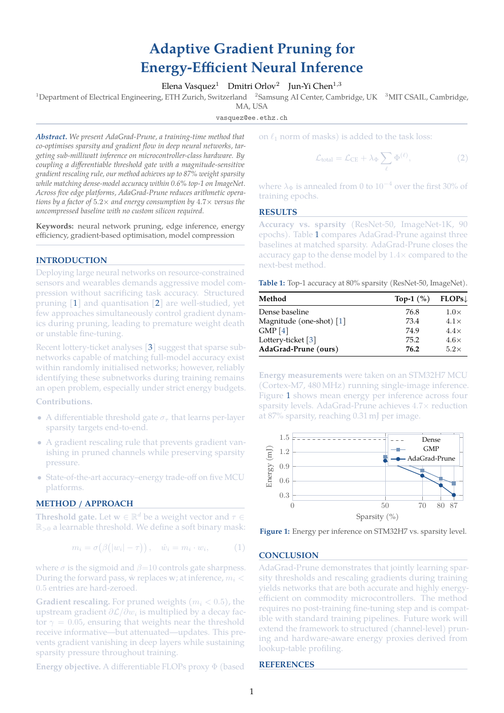</a> <b>Extended Abstract</b> <a href="https://letx.app/templates/conferences/extended-abstract">Open in LetX</a> · <a href="./extended-abstract">Source</a></td>
</tr>
<tr>
<td width="33%" valign="top" align="center"><a href="https://letx.app/templates/conferences/physics-colloquium-talk">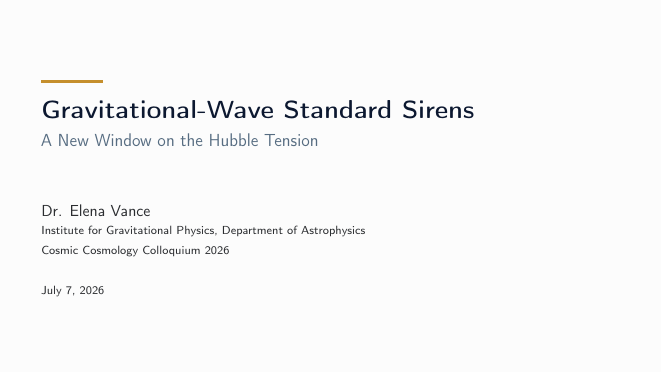</a> <b>Astrophysics Beamer Talk</b> <a href="https://letx.app/templates/conferences/physics-colloquium-talk">Open in LetX</a> · <a href="./physics-colloquium-talk">Source</a></td>
</tr>
</table>

### Lab Documents & Reports

<table>
<tr>
<td width="33%" valign="top" align="center"><a href="https://letx.app/templates/lab-documents/bioinformatics-report">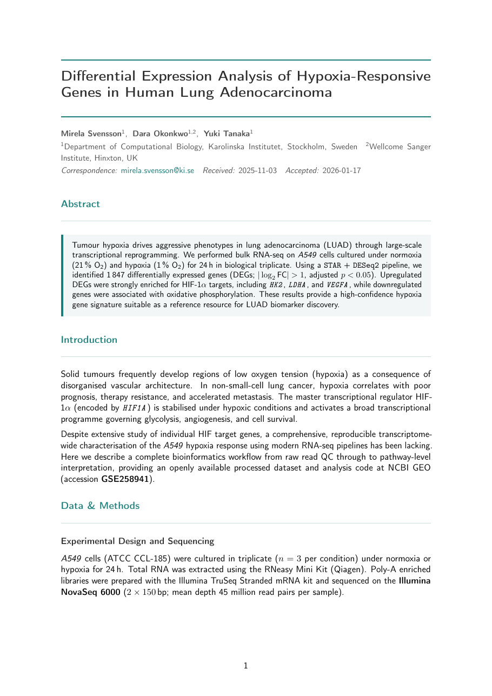</a> <b>Bioinformatics Report</b> <a href="https://letx.app/templates/lab-documents/bioinformatics-report">Open in LetX</a> · <a href="./bioinformatics-report">Source</a></td>
<td width="33%" valign="top" align="center"><a href="https://letx.app/templates/lab-documents/chemistry-lab-report">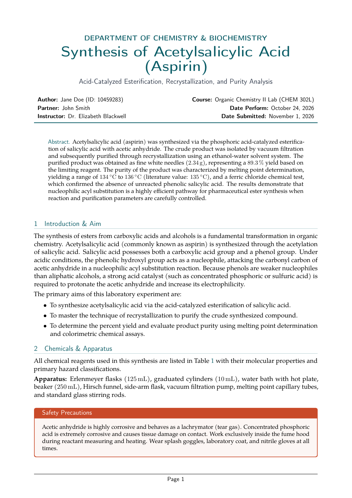</a> <b>Chemistry Lab Report</b> <a href="https://letx.app/templates/lab-documents/chemistry-lab-report">Open in LetX</a> · <a href="./chemistry-lab-report">Source</a></td>
<td width="33%" valign="top" align="center"><a href="https://letx.app/templates/lab-documents/geology-field-report">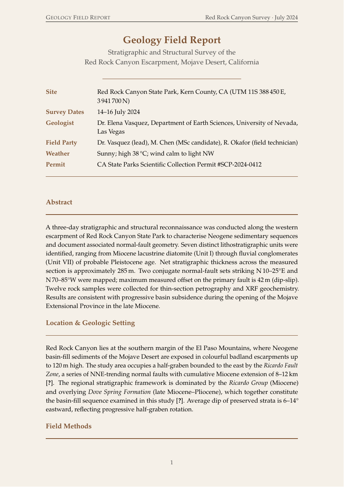</a> <b>Geology Field Report</b> <a href="https://letx.app/templates/lab-documents/geology-field-report">Open in LetX</a> · <a href="./geology-field-report">Source</a></td>
</tr>
<tr>
<td width="33%" valign="top" align="center"><a href="https://letx.app/templates/lab-documents/lab-notebook">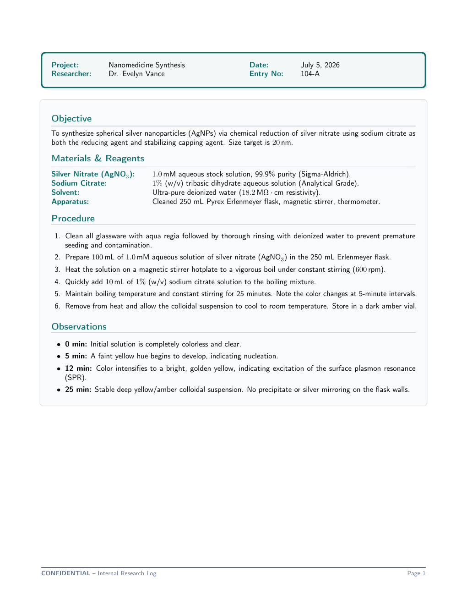</a> <b>Lab Notebook</b> <a href="https://letx.app/templates/lab-documents/lab-notebook">Open in LetX</a> · <a href="./lab-notebook">Source</a></td>
<td width="33%" valign="top" align="center"><a href="https://letx.app/templates/lab-documents/lab-protocol-sop">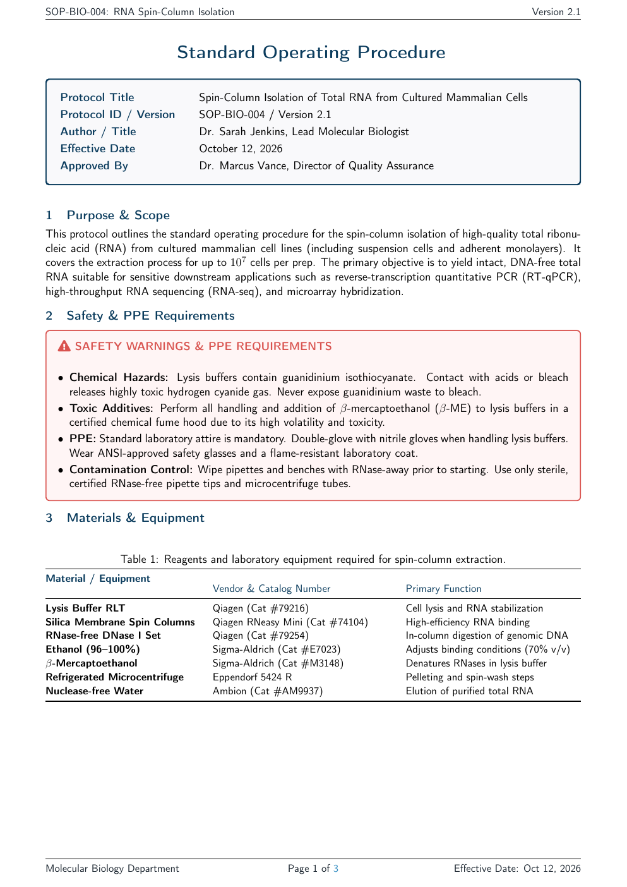</a> <b>Lab Protocol / SOP</b> <a href="https://letx.app/templates/lab-documents/lab-protocol-sop">Open in LetX</a> · <a href="./lab-protocol-sop">Source</a></td>
<td width="33%" valign="top" align="center"><a href="https://letx.app/templates/lab-documents/lab-safety-manual">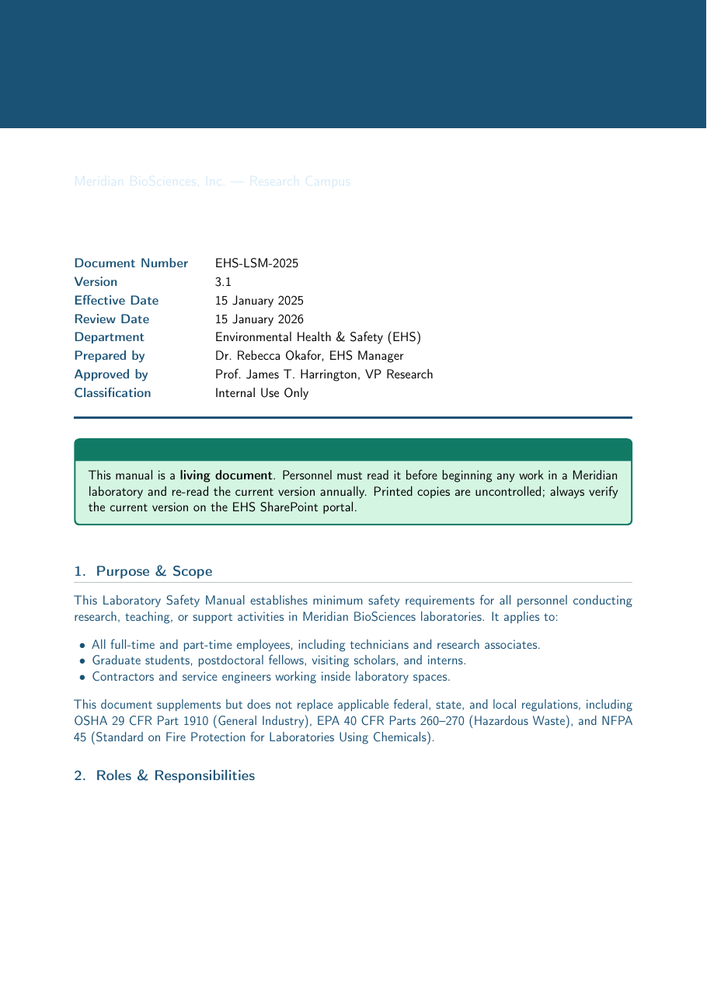</a> <b>Lab Safety Manual</b> <a href="https://letx.app/templates/lab-documents/lab-safety-manual">Open in LetX</a> · <a href="./lab-safety-manual">Source</a></td>
</tr>
<tr>
<td width="33%" valign="top" align="center"> <b>Physics Lab Report</b> <a href="https://letx.app/templates/lab-documents/physics-lab-report">Open in LetX</a> · <a href="./physics-lab-report">Source</a></td>
</tr>
</table>

### Grants & Research Proposals

<table>
<tr>
<td width="33%" valign="top" align="center"><a href="https://letx.app/templates/grants/data-management-plan">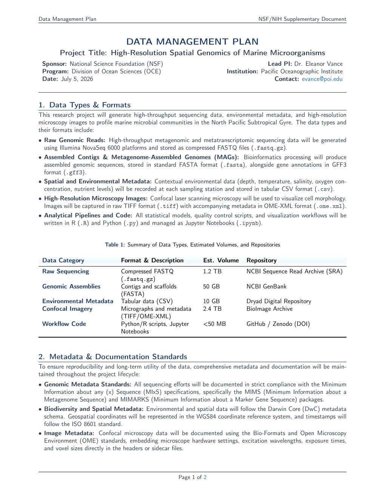</a> <b>Data Management Plan</b> <a href="https://letx.app/templates/grants/data-management-plan">Open in LetX</a> · <a href="./data-management-plan">Source</a></td>
<td width="33%" valign="top" align="center"><a href="https://letx.app/templates/grants/erc-grant-proposal">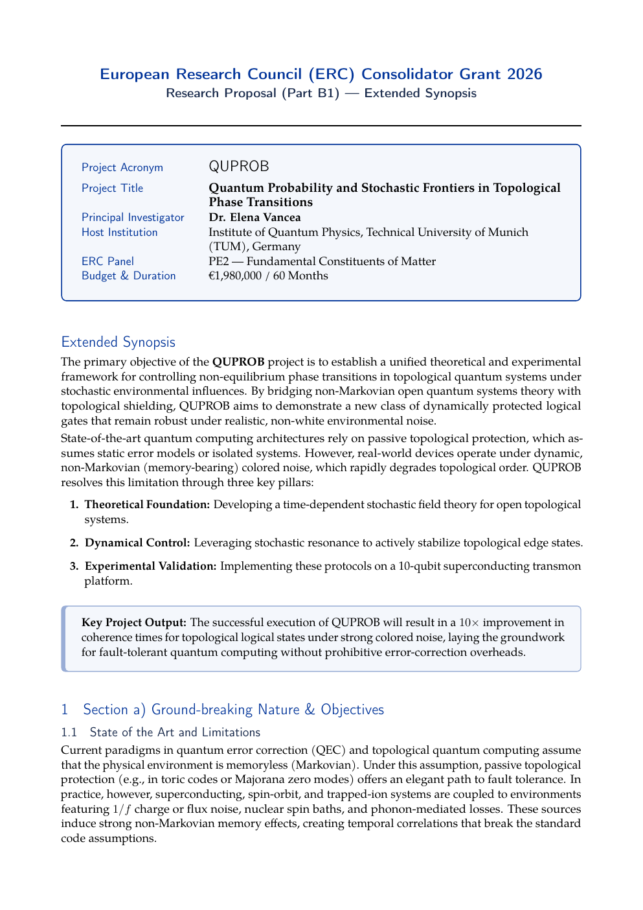</a> <b>ERC Grant Proposal</b> <a href="https://letx.app/templates/grants/erc-grant-proposal">Open in LetX</a> · <a href="./erc-grant-proposal">Source</a></td>
<td width="33%" valign="top" align="center"><a href="https://letx.app/templates/grants/nasa-roses-proposal">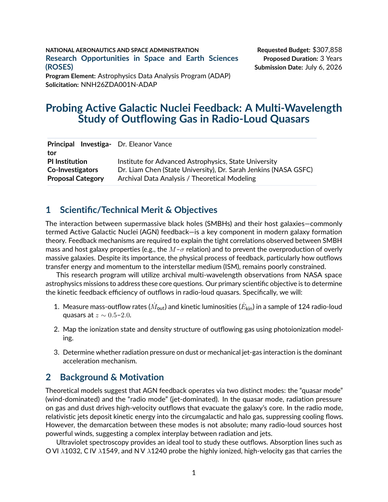</a> <b>NASA ROSES Grant Proposal</b> <a href="https://letx.app/templates/grants/nasa-roses-proposal">Open in LetX</a> · <a href="./nasa-roses-proposal">Source</a></td>
</tr>
<tr>
<td width="33%" valign="top" align="center"><a href="https://letx.app/templates/grants/nih-grant-proposal">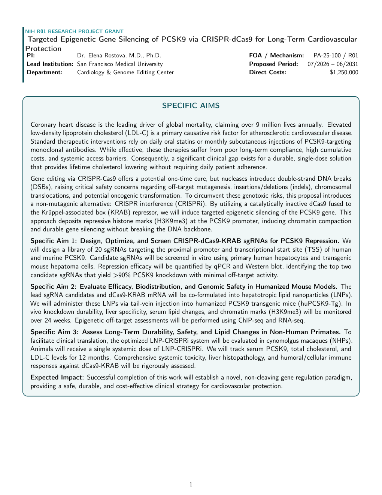</a> <b>NIH Grant Proposal</b> <a href="https://letx.app/templates/grants/nih-grant-proposal">Open in LetX</a> · <a href="./nih-grant-proposal">Source</a></td>
<td width="33%" valign="top" align="center"><a href="https://letx.app/templates/grants/nsf-grant-proposal">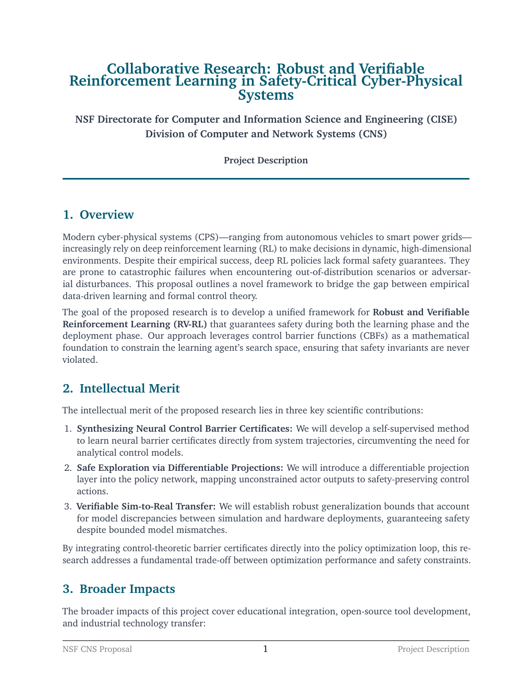</a> <b>NSF Grant Proposal</b> <a href="https://letx.app/templates/grants/nsf-grant-proposal">Open in LetX</a> · <a href="./nsf-grant-proposal">Source</a></td>
<td width="33%" valign="top" align="center"><a href="https://letx.app/templates/grants/nsf-grfp-fellowship">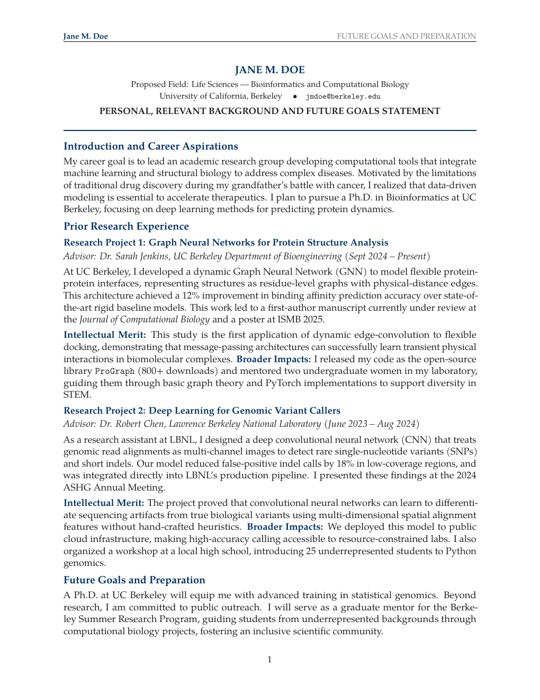</a> <b>NSF GRFP Fellowship Statements</b> <a href="https://letx.app/templates/grants/nsf-grfp-fellowship">Open in LetX</a> · <a href="./nsf-grfp-fellowship">Source</a></td>
</tr>
<tr>
<td width="33%" valign="top" align="center"><a href="https://letx.app/templates/grants/observing-time-proposal">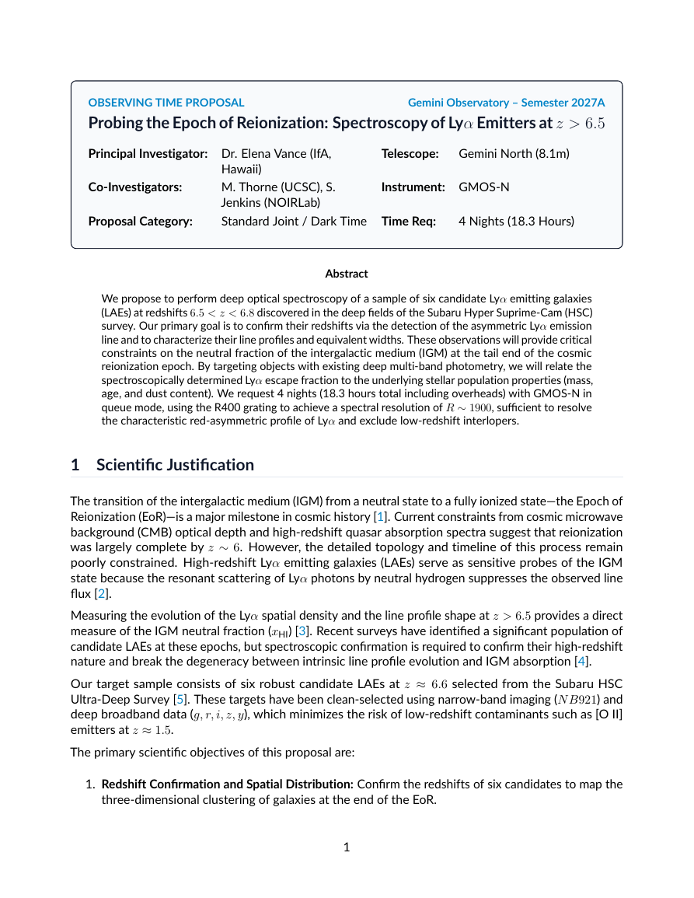</a> <b>Telescope Observing Proposal</b> <a href="https://letx.app/templates/grants/observing-time-proposal">Open in LetX</a> · <a href="./observing-time-proposal">Source</a></td>
</tr>
</table>

### Posters

<table>
<tr>
<td width="33%" valign="top" align="center"><a href="https://letx.app/templates/posters/poster-a1-modern">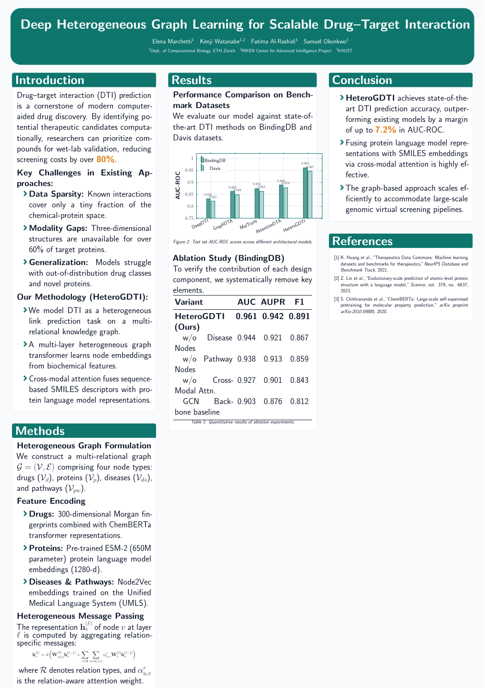</a> <b>Modern Conference Poster (A1)</b> <a href="https://letx.app/templates/posters/poster-a1-modern">Open in LetX</a> · <a href="./poster-a1-modern">Source</a></td>
<td width="33%" valign="top" align="center"><a href="https://letx.app/templates/posters/real-estate-flyer">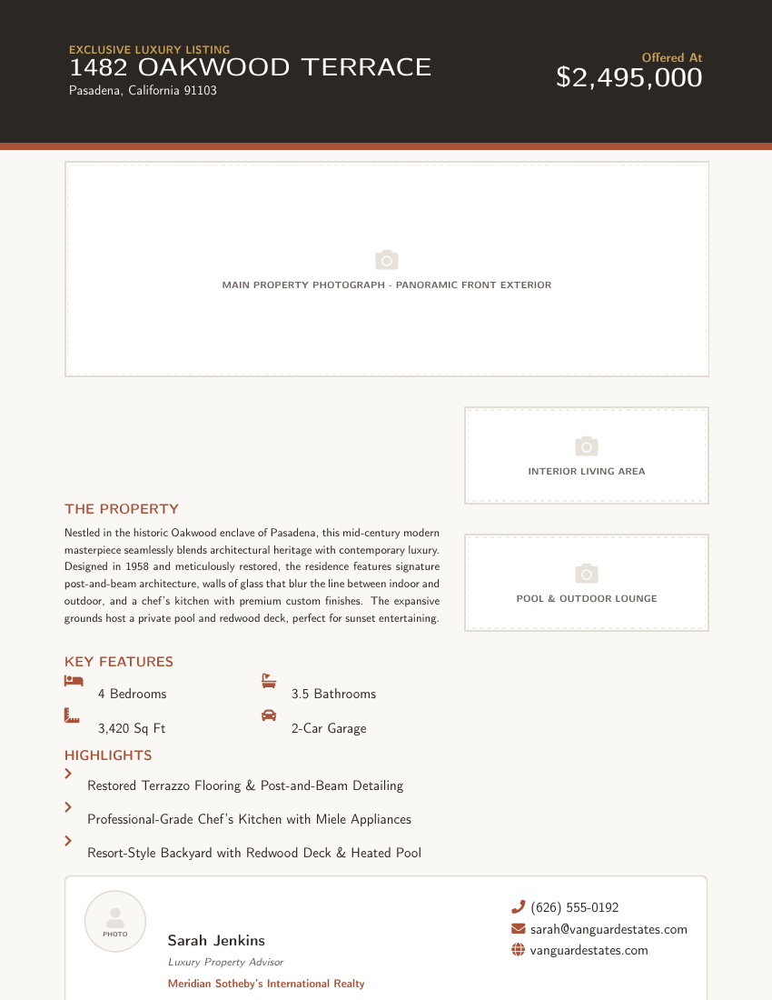</a> <b>Real Estate Flyer</b> <a href="https://letx.app/templates/posters/real-estate-flyer">Open in LetX</a> · <a href="./real-estate-flyer">Source</a></td>
</tr>
</table>

### Academic Career (CVs, Statements, Applications)

<table>
<tr>
<td width="33%" valign="top" align="center"><a href="https://letx.app/templates/academic-career/diversity-statement">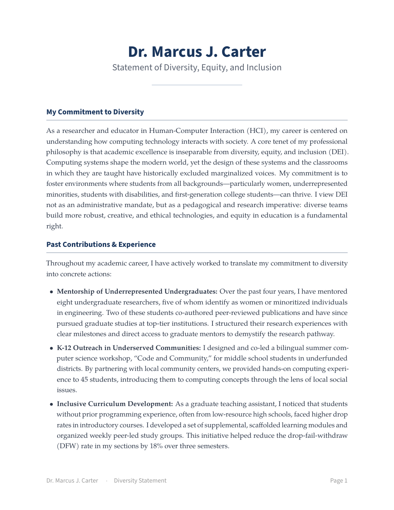</a> <b>Diversity Statement</b> <a href="https://letx.app/templates/academic-career/diversity-statement">Open in LetX</a> · <a href="./diversity-statement">Source</a></td>
<td width="33%" valign="top" align="center"><a href="https://letx.app/templates/academic-career/phd-progress-report">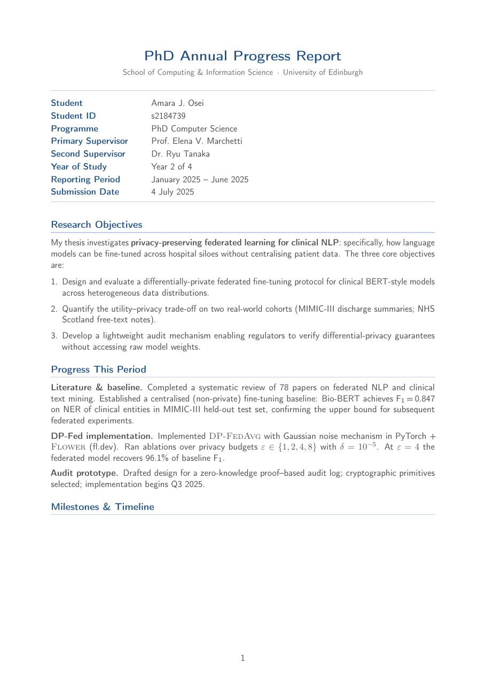</a> <b>PhD Progress Report</b> <a href="https://letx.app/templates/academic-career/phd-progress-report">Open in LetX</a> · <a href="./phd-progress-report">Source</a></td>
<td width="33%" valign="top" align="center"><a href="https://letx.app/templates/academic-career/postdoc-application">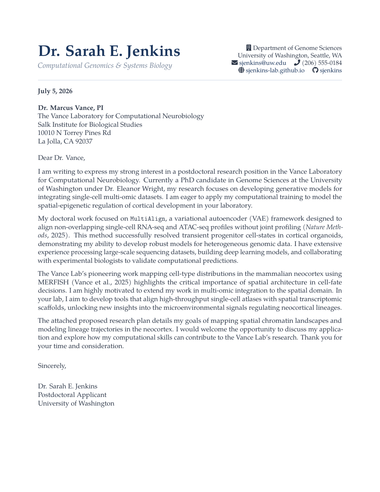</a> <b>Postdoc Application</b> <a href="https://letx.app/templates/academic-career/postdoc-application">Open in LetX</a> · <a href="./postdoc-application">Source</a></td>
</tr>
<tr>
<td width="33%" valign="top" align="center"><a href="https://letx.app/templates/academic-career/research-statement">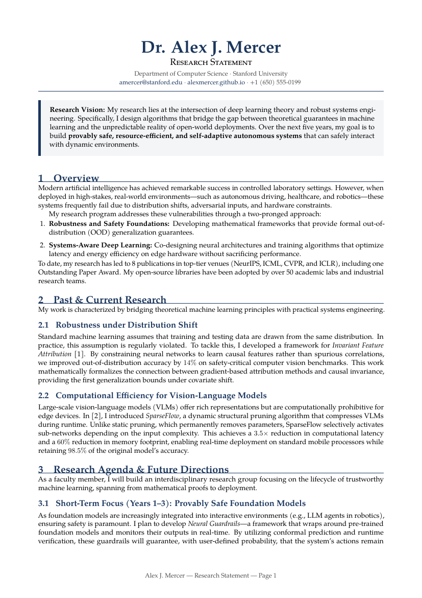</a> <b>Research Statement</b> <a href="https://letx.app/templates/academic-career/research-statement">Open in LetX</a> · <a href="./research-statement">Source</a></td>
<td width="33%" valign="top" align="center"><a href="https://letx.app/templates/academic-career/teaching-statement">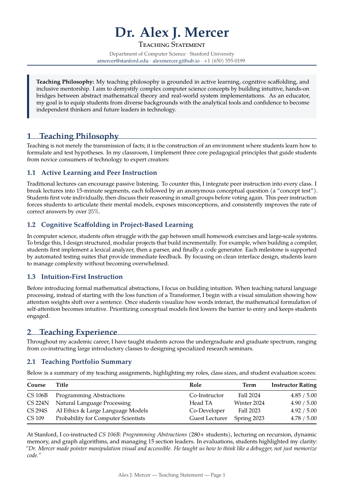</a> <b>Teaching Statement</b> <a href="https://letx.app/templates/academic-career/teaching-statement">Open in LetX</a> · <a href="./teaching-statement">Source</a></td>
<td width="33%" valign="top" align="center"><a href="https://letx.app/templates/academic-career/thesis-proposal">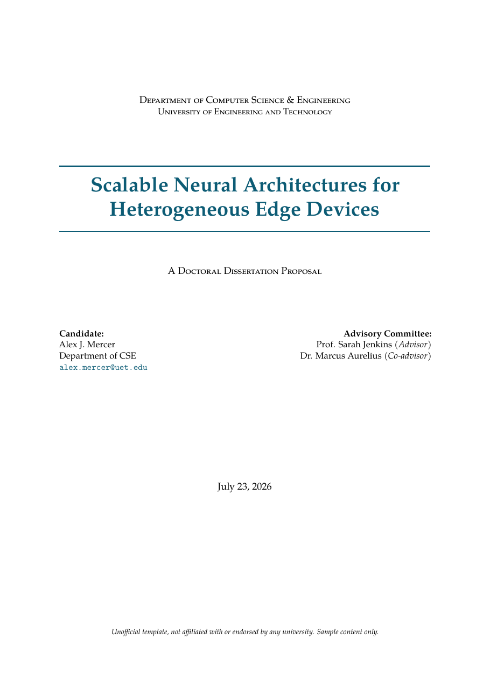</a> <b>Thesis Proposal</b> <a href="https://letx.app/templates/academic-career/thesis-proposal">Open in LetX</a> · <a href="./thesis-proposal">Source</a></td>
</tr>
</table>

### Assignments & Course Work

<table>
<tr>
<td width="33%" valign="top" align="center"><a href="https://letx.app/templates/assignments/algorithm-cheatsheet">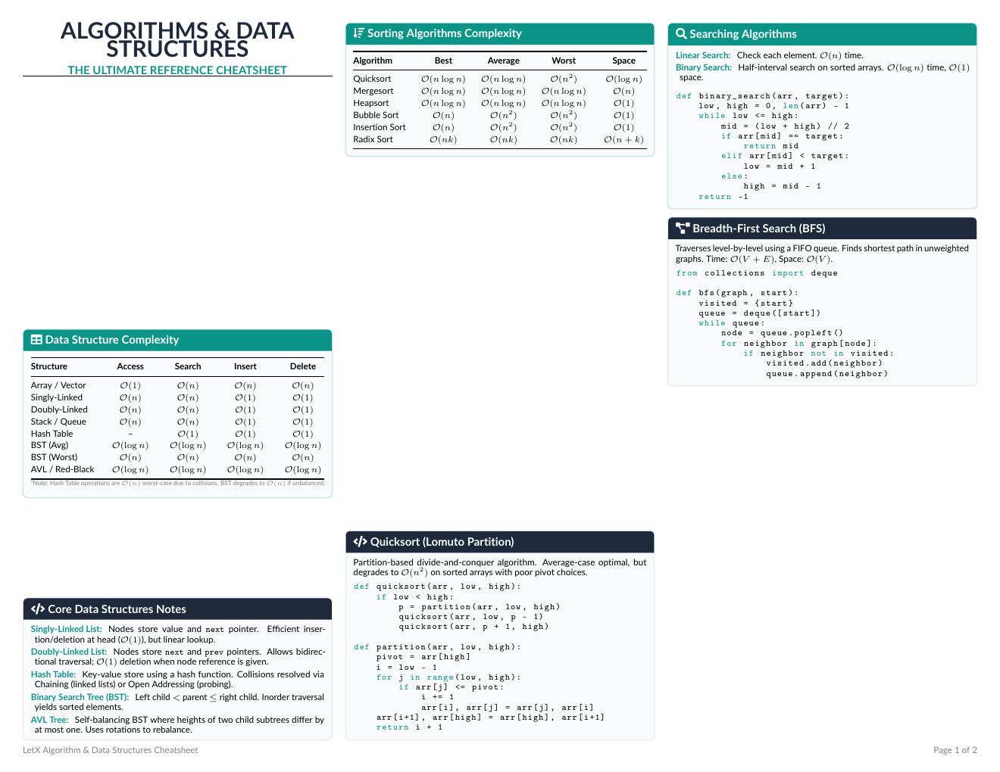</a> <b>Algorithm Cheatsheet</b> <a href="https://letx.app/templates/assignments/algorithm-cheatsheet">Open in LetX</a> · <a href="./algorithm-cheatsheet">Source</a></td>
<td width="33%" valign="top" align="center"><a href="https://letx.app/templates/assignments/annotated-bibliography">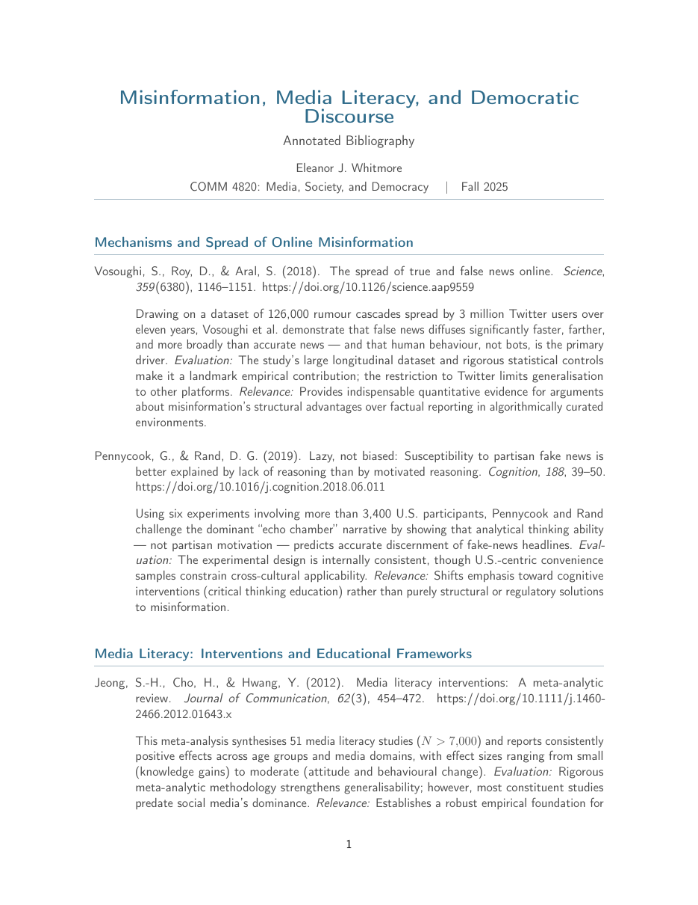</a> <b>Annotated Bibliography</b> <a href="https://letx.app/templates/assignments/annotated-bibliography">Open in LetX</a> · <a href="./annotated-bibliography">Source</a></td>
<td width="33%" valign="top" align="center"><a href="https://letx.app/templates/assignments/candidacy-exam-notes">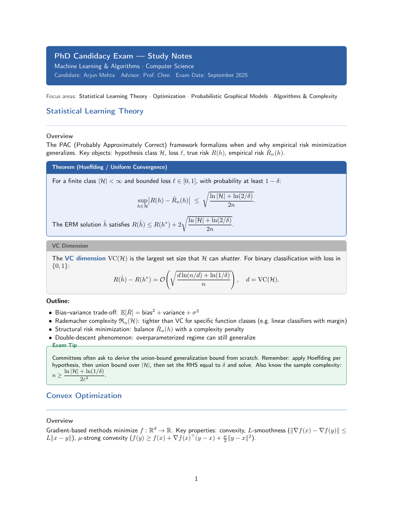</a> <b>Candidacy Exam Notes</b> <a href="https://letx.app/templates/assignments/candidacy-exam-notes">Open in LetX</a> · <a href="./candidacy-exam-notes">Source</a></td>
</tr>
<tr>
<td width="33%" valign="top" align="center"><a href="https://letx.app/templates/assignments/data-science-report">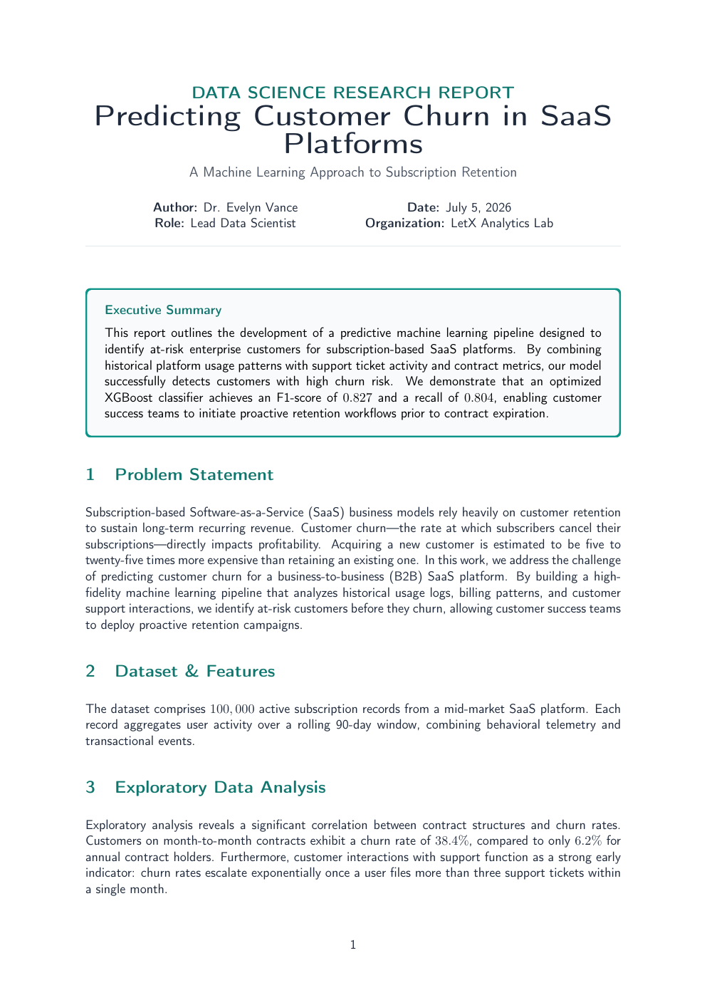</a> <b>Data Science Report</b> <a href="https://letx.app/templates/assignments/data-science-report">Open in LetX</a> · <a href="./data-science-report">Source</a></td>
<td width="33%" valign="top" align="center"><a href="https://letx.app/templates/assignments/engineering-design-document">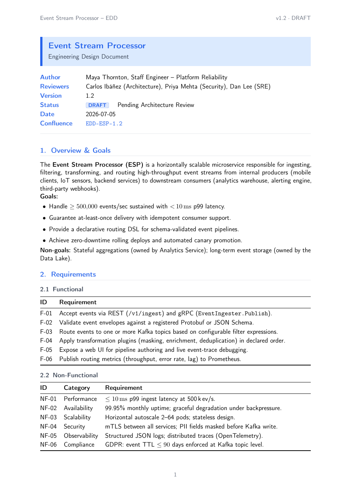</a> <b>Engineering Design Document</b> <a href="https://letx.app/templates/assignments/engineering-design-document">Open in LetX</a> · <a href="./engineering-design-document">Source</a></td>
<td width="33%" valign="top" align="center"> <b>Math Lecture Notes</b> <a href="https://letx.app/templates/assignments/math-lecture-notes">Open in LetX</a> · <a href="./math-lecture-notes">Source</a></td>
</tr>
<tr>
<td width="33%" valign="top" align="center"><a href="https://letx.app/templates/assignments/math-proof-portfolio">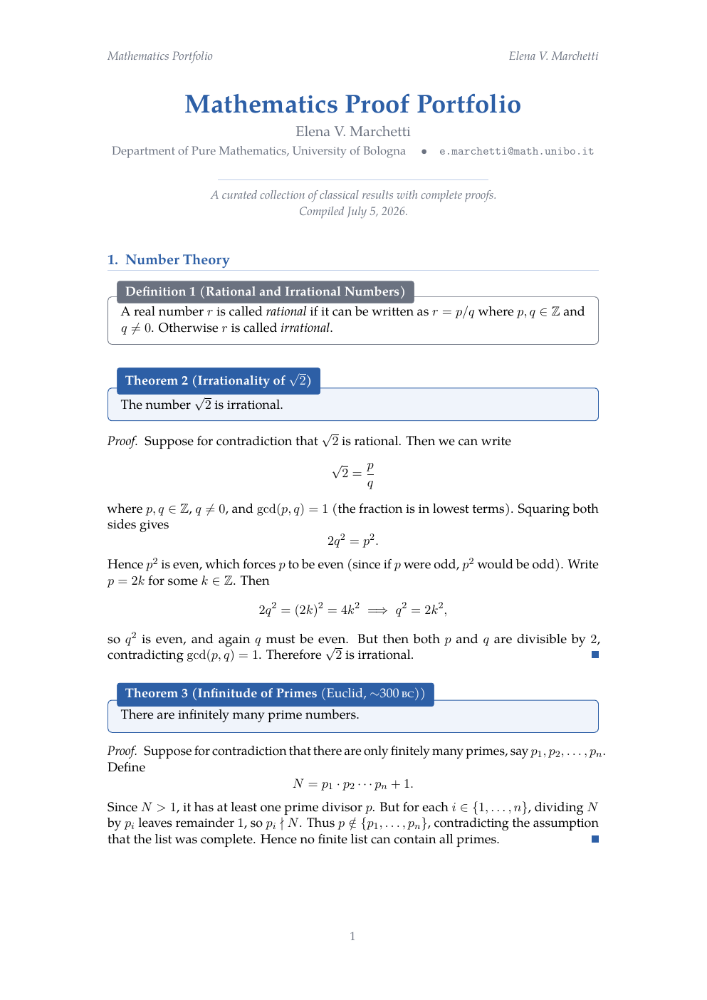</a> <b>Math Proof Portfolio</b> <a href="https://letx.app/templates/assignments/math-proof-portfolio">Open in LetX</a> · <a href="./math-proof-portfolio">Source</a></td>
<td width="33%" valign="top" align="center"> <b>Course Syllabus</b> <a href="https://letx.app/templates/assignments/reading-list-syllabus">Open in LetX</a> · <a href="./reading-list-syllabus">Source</a></td>
<td width="33%" valign="top" align="center"><a href="https://letx.app/templates/assignments/seminar-handout">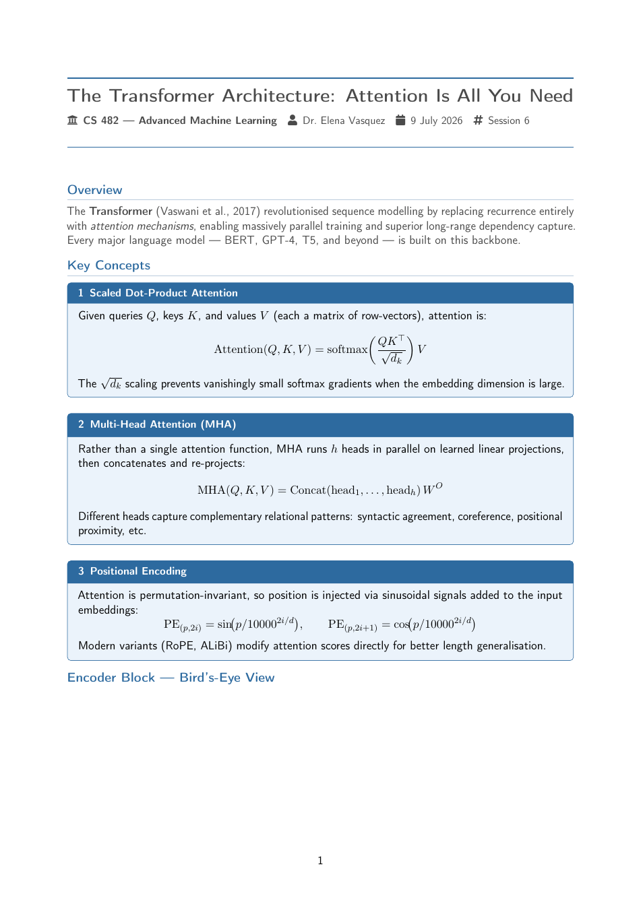</a> <b>Seminar Handout</b> <a href="https://letx.app/templates/assignments/seminar-handout">Open in LetX</a> · <a href="./seminar-handout">Source</a></td>
</tr>
<tr>
<td width="33%" valign="top" align="center"><a href="https://letx.app/templates/assignments/statistics-report">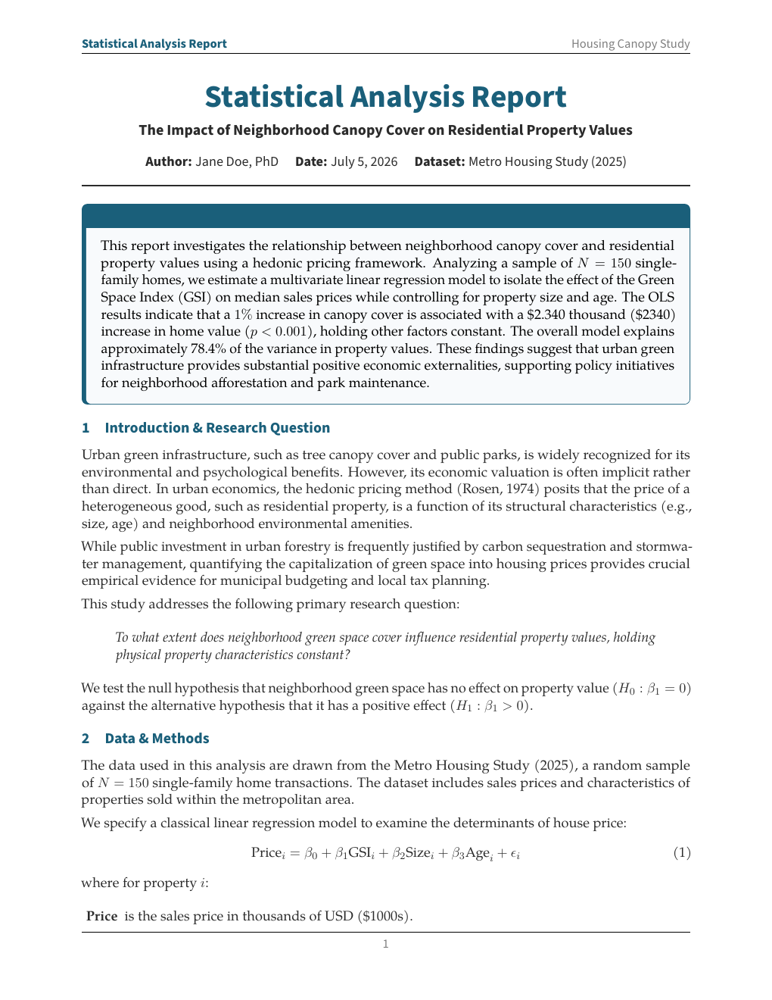</a> <b>Statistics Report</b> <a href="https://letx.app/templates/assignments/statistics-report">Open in LetX</a> · <a href="./statistics-report">Source</a></td>
</tr>
</table>

### CVs & Resumes

<table>
<tr>
<td width="33%" valign="top" align="center"><a href="https://letx.app/templates/cvs-resumes/college-student-resume">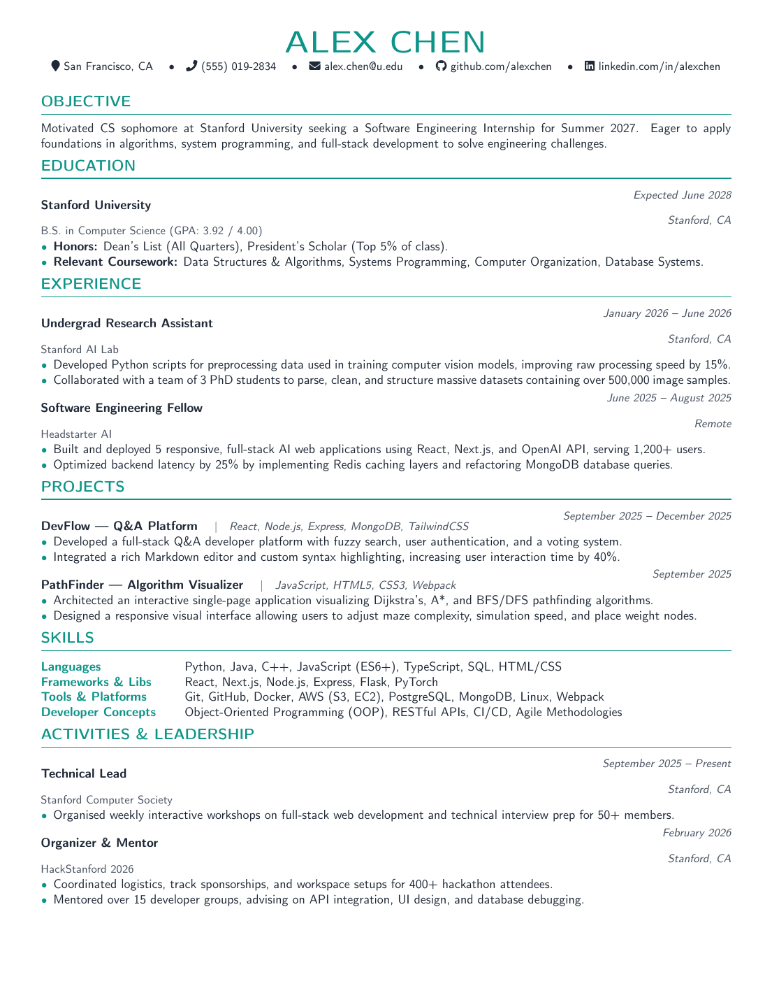</a> <b>College Student Resume</b> <a href="https://letx.app/templates/cvs-resumes/college-student-resume">Open in LetX</a> · <a href="./college-student-resume">Source</a></td>
<td width="33%" valign="top" align="center"><a href="https://letx.app/templates/cvs-resumes/consultant-resume">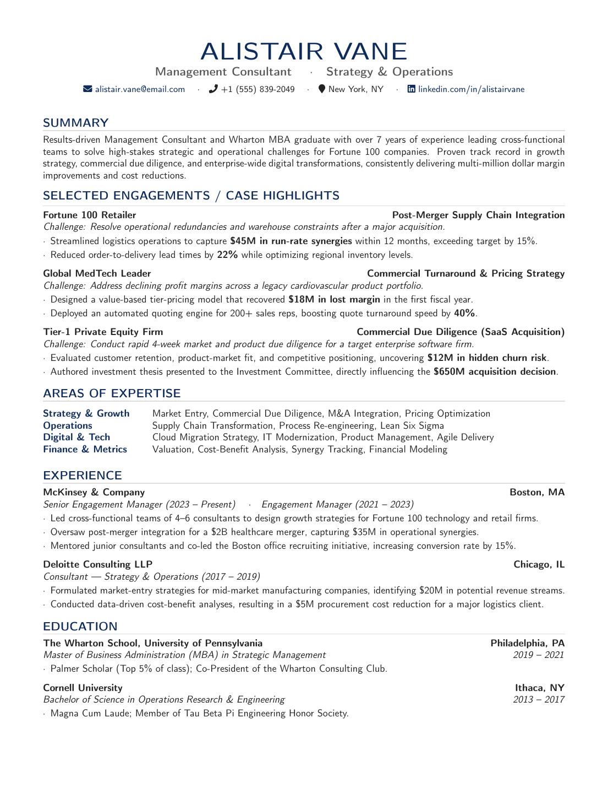</a> <b>Management Consultant Resume</b> <a href="https://letx.app/templates/cvs-resumes/consultant-resume">Open in LetX</a> · <a href="./consultant-resume">Source</a></td>
<td width="33%" valign="top" align="center"><a href="https://letx.app/templates/cvs-resumes/creative-designer-resume">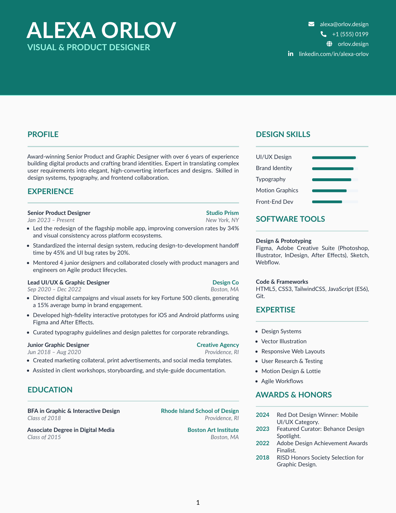</a> <b>Creative Designer Resume</b> <a href="https://letx.app/templates/cvs-resumes/creative-designer-resume">Open in LetX</a> · <a href="./creative-designer-resume">Source</a></td>
</tr>
<tr>
<td width="33%" valign="top" align="center"><a href="https://letx.app/templates/cvs-resumes/executive-director-cv">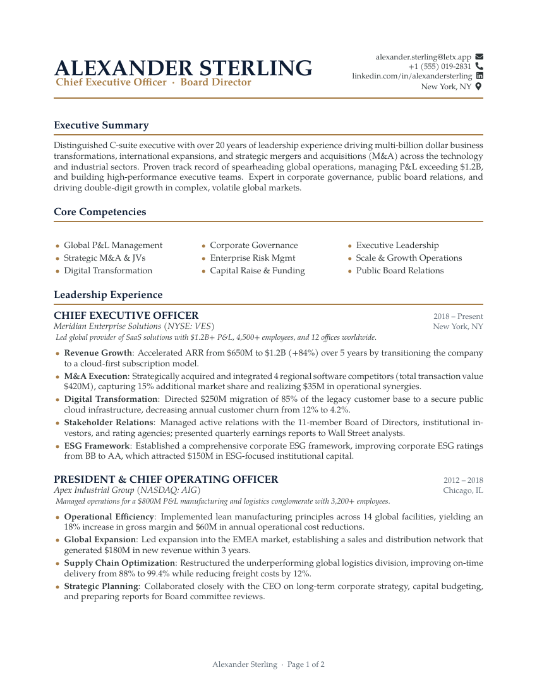</a> <b>Executive Director CV</b> <a href="https://letx.app/templates/cvs-resumes/executive-director-cv">Open in LetX</a> · <a href="./executive-director-cv">Source</a></td>
<td width="33%" valign="top" align="center"><a href="https://letx.app/templates/cvs-resumes/modern-minimalist-resume">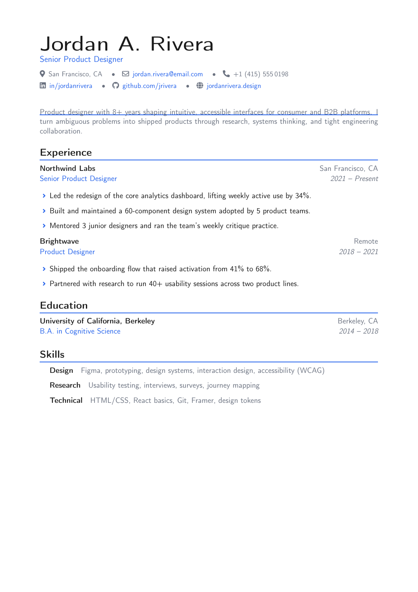</a> <b>Modern Minimalist Resume</b> <a href="https://letx.app/templates/cvs-resumes/modern-minimalist-resume">Open in LetX</a> · <a href="./modern-minimalist-resume">Source</a></td>
<td width="33%" valign="top" align="center"><a href="https://letx.app/templates/cvs-resumes/nurse-medical-resume">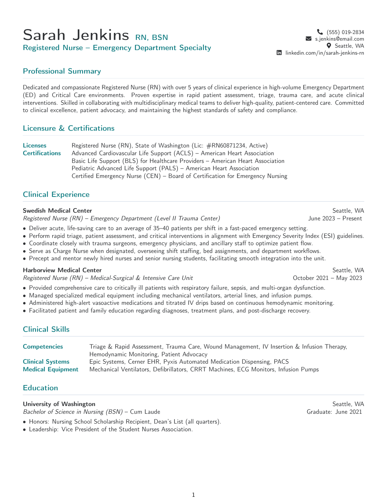</a> <b>Nurse / Medical Resume</b> <a href="https://letx.app/templates/cvs-resumes/nurse-medical-resume">Open in LetX</a> · <a href="./nurse-medical-resume">Source</a></td>
</tr>
<tr>
<td width="33%" valign="top" align="center"><a href="https://letx.app/templates/cvs-resumes/teacher-educator-resume">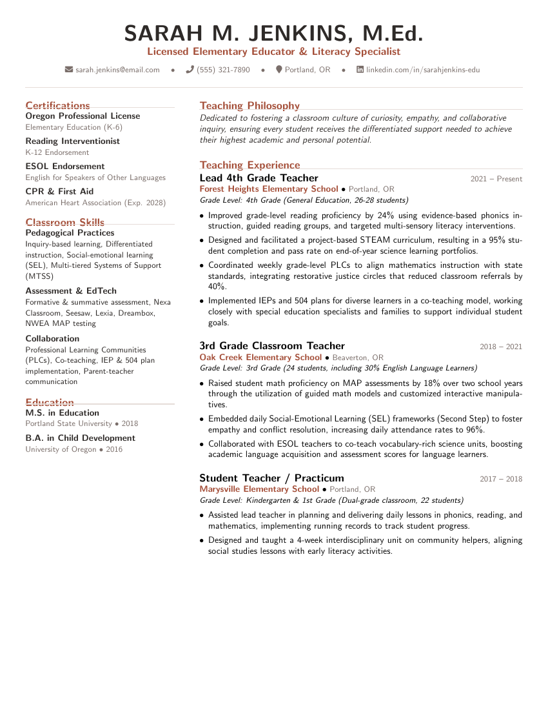</a> <b>Teacher / Educator Resume</b> <a href="https://letx.app/templates/cvs-resumes/teacher-educator-resume">Open in LetX</a> · <a href="./teacher-educator-resume">Source</a></td>
<td width="33%" valign="top" align="center"><a href="https://letx.app/templates/cvs-resumes/two-column-resume">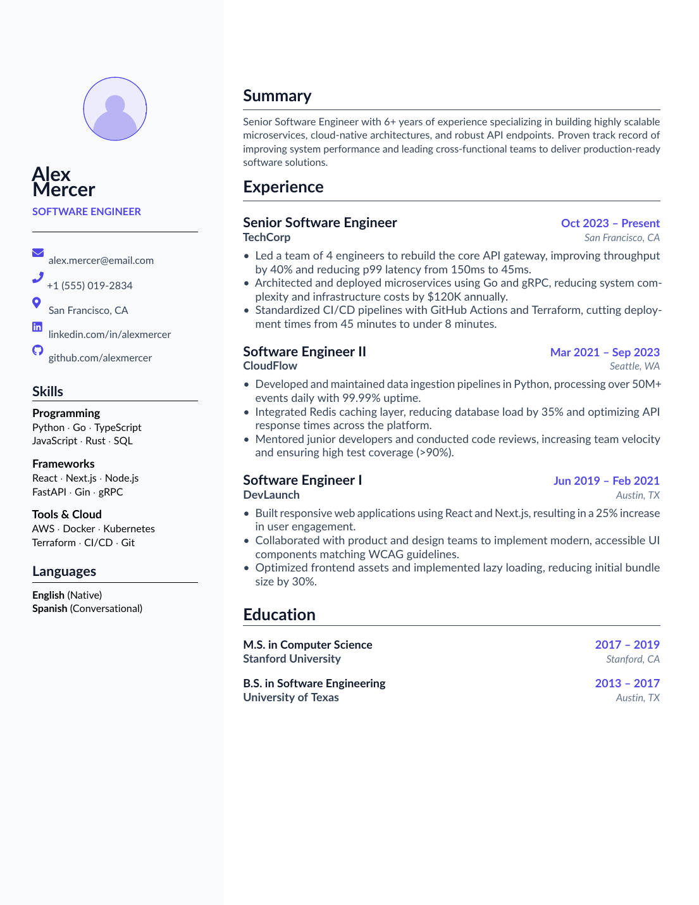</a> <b>Two-Column Resume</b> <a href="https://letx.app/templates/cvs-resumes/two-column-resume">Open in LetX</a> · <a href="./two-column-resume">Source</a></td>
</tr>
</table>

### Books & Theses

<table>
<tr>
<td width="33%" valign="top" align="center"><a href="https://letx.app/templates/books/academic-book-proposal">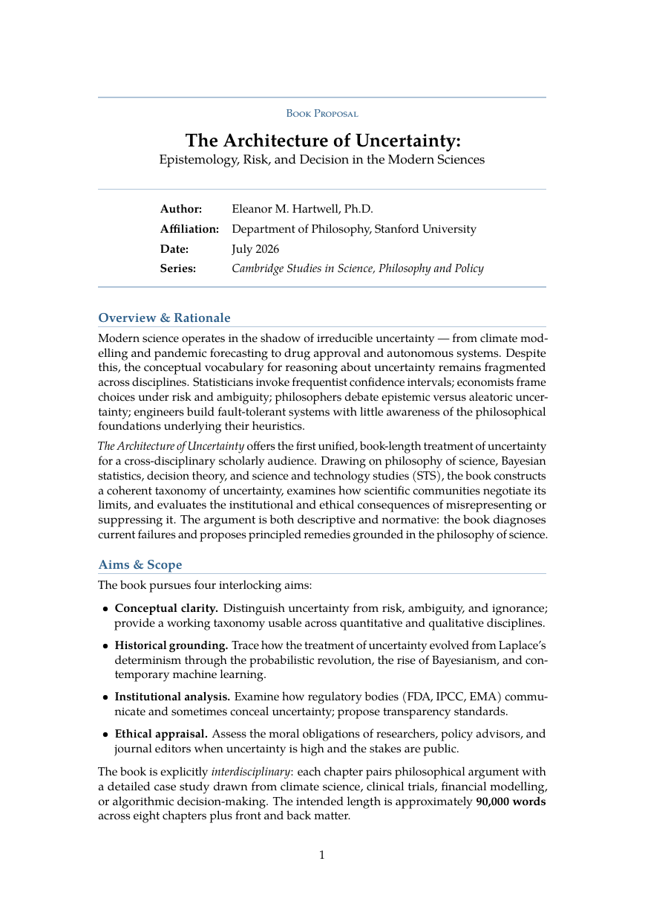</a> <b>Academic Book Proposal</b> <a href="https://letx.app/templates/books/academic-book-proposal">Open in LetX</a> · <a href="./academic-book-proposal">Source</a></td>
<td width="33%" valign="top" align="center"><a href="https://letx.app/templates/books/product-user-manual">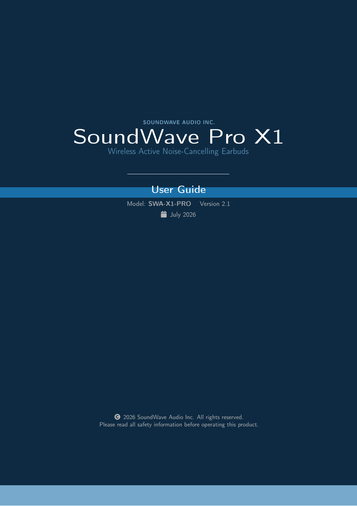</a> <b>Product User Manual</b> <a href="https://letx.app/templates/books/product-user-manual">Open in LetX</a> · <a href="./product-user-manual">Source</a></td>
</tr>
</table>

### Formal Letters & Letterheads

<table>
<tr>
<td width="33%" valign="top" align="center"> <b>Academic Letterhead</b> <a href="https://letx.app/templates/formal-letters/academic-letterhead">Open in LetX</a> · <a href="./academic-letterhead">Source</a></td>
<td width="33%" valign="top" align="center"><a href="https://letx.app/templates/formal-letters/creative-letterhead">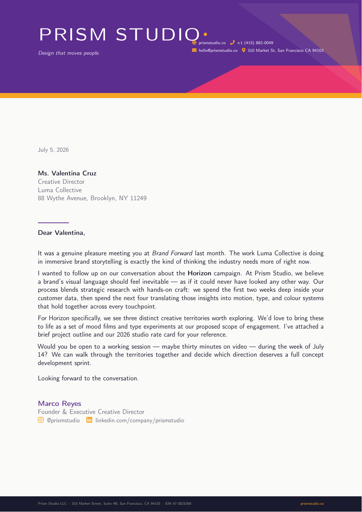</a> <b>Creative Studio Letterhead</b> <a href="https://letx.app/templates/formal-letters/creative-letterhead">Open in LetX</a> · <a href="./creative-letterhead">Source</a></td>
<td width="33%" valign="top" align="center"><a href="https://letx.app/templates/formal-letters/law-firm-letterhead">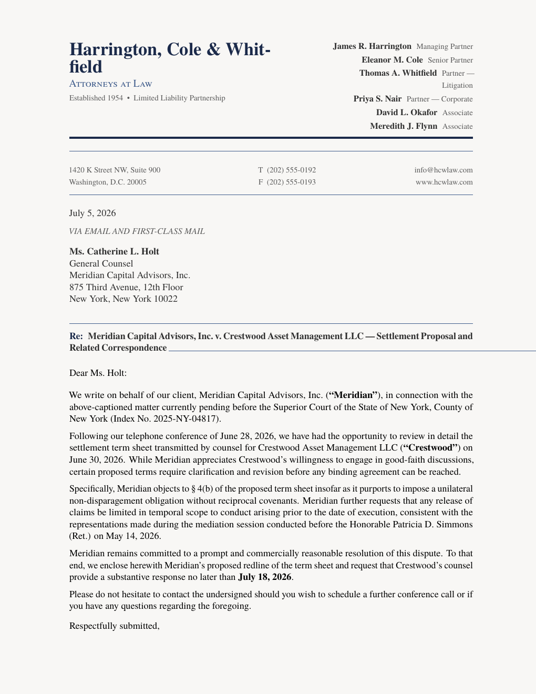</a> <b>Law Firm Letterhead</b> <a href="https://letx.app/templates/formal-letters/law-firm-letterhead">Open in LetX</a> · <a href="./law-firm-letterhead">Source</a></td>
</tr>
<tr>
<td width="33%" valign="top" align="center"><a href="https://letx.app/templates/formal-letters/letter-of-intent">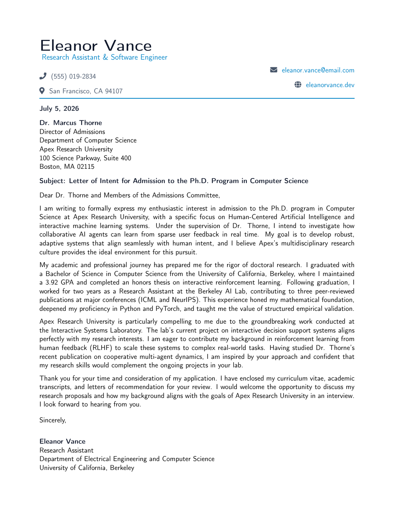</a> <b>Letter of Intent</b> <a href="https://letx.app/templates/formal-letters/letter-of-intent">Open in LetX</a> · <a href="./letter-of-intent">Source</a></td>
<td width="33%" valign="top" align="center"><a href="https://letx.app/templates/formal-letters/modern-business-letterhead">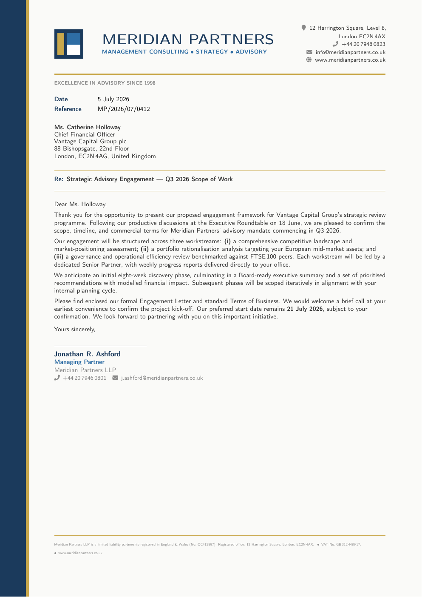</a> <b>Modern Business Letterhead</b> <a href="https://letx.app/templates/formal-letters/modern-business-letterhead">Open in LetX</a> · <a href="./modern-business-letterhead">Source</a></td>
</tr>
</table>

### Calendars & Planners

<table>
<tr>
<td width="33%" valign="top" align="center"><a href="https://letx.app/templates/calendars/monthly-calendar">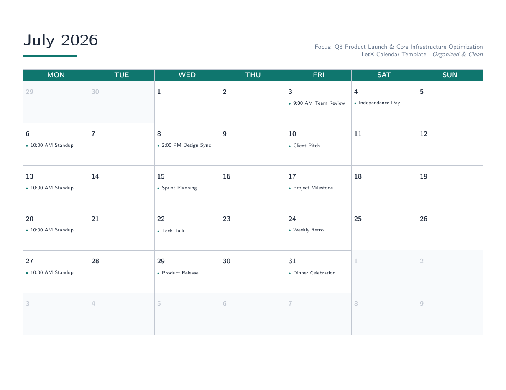</a> <b>Monthly Calendar</b> <a href="https://letx.app/templates/calendars/monthly-calendar">Open in LetX</a> · <a href="./monthly-calendar">Source</a></td>
</tr>
</table>

### Everything Else

<table>
<tr>
<td width="33%" valign="top" align="center"><a href="https://letx.app/templates/miscellaneous/business-card">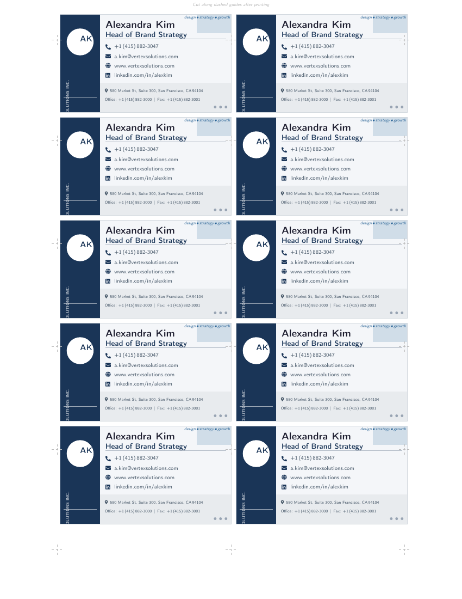</a> <b>Business Card Sheet</b> <a href="https://letx.app/templates/miscellaneous/business-card">Open in LetX</a> · <a href="./business-card">Source</a></td>
<td width="33%" valign="top" align="center"><a href="https://letx.app/templates/miscellaneous/certificate-of-achievement">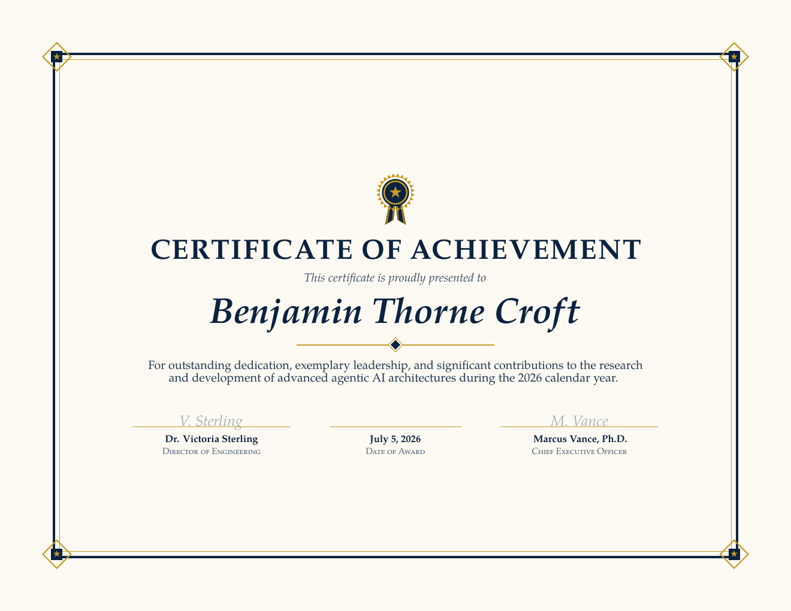</a> <b>Certificate of Achievement</b> <a href="https://letx.app/templates/miscellaneous/certificate-of-achievement">Open in LetX</a> · <a href="./certificate-of-achievement">Source</a></td>
<td width="33%" valign="top" align="center"><a href="https://letx.app/templates/miscellaneous/chemistry-reaction-scheme">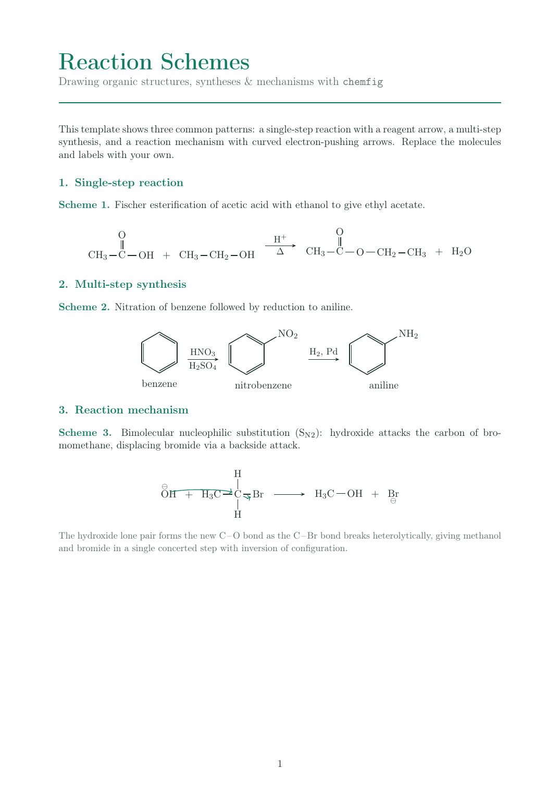</a> <b>Chemistry Reaction Scheme</b> <a href="https://letx.app/templates/miscellaneous/chemistry-reaction-scheme">Open in LetX</a> · <a href="./chemistry-reaction-scheme">Source</a></td>
</tr>
<tr>
<td width="33%" valign="top" align="center"> <b>Christian Marriage Biodata</b> <a href="https://letx.app/templates/miscellaneous/christian-marriage-biodata">Open in LetX</a> · <a href="./christian-marriage-biodata">Source</a></td>
<td width="33%" valign="top" align="center"><a href="https://letx.app/templates/miscellaneous/event-program-brochure">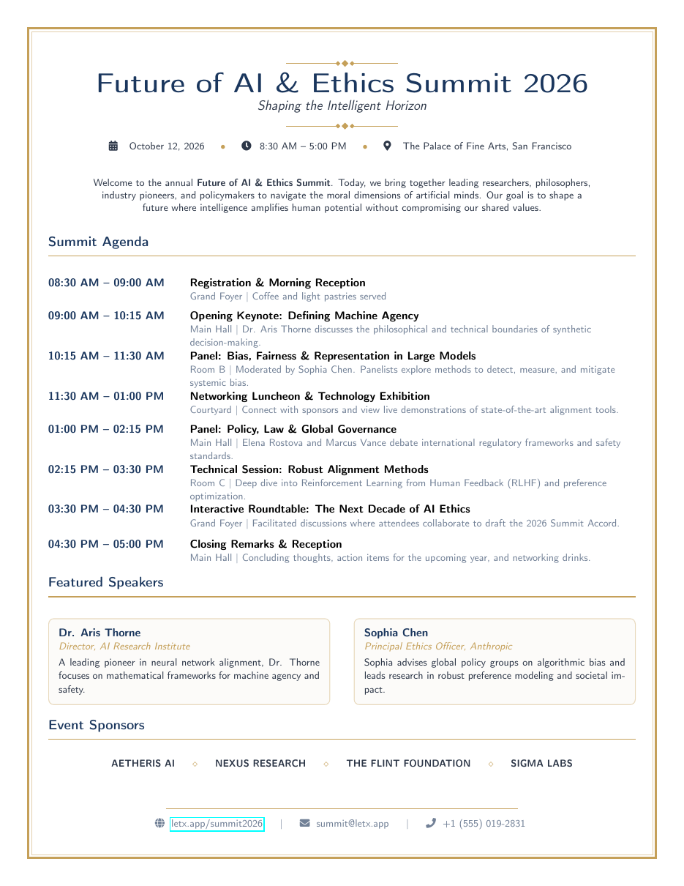</a> <b>Event Program Brochure</b> <a href="https://letx.app/templates/miscellaneous/event-program-brochure">Open in LetX</a> · <a href="./event-program-brochure">Source</a></td>
<td width="33%" valign="top" align="center"><a href="https://letx.app/templates/miscellaneous/foldable-card">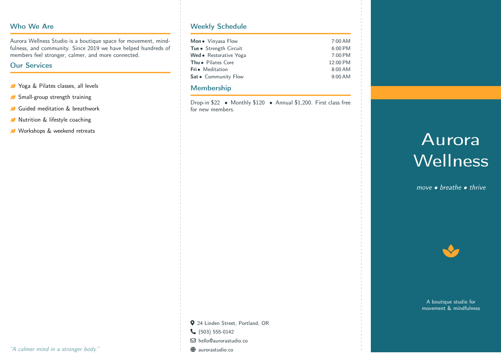</a> <b>Tri-Fold Brochure</b> <a href="https://letx.app/templates/miscellaneous/foldable-card">Open in LetX</a> · <a href="./foldable-card">Source</a></td>
</tr>
<tr>
<td width="33%" valign="top" align="center"><a href="https://letx.app/templates/miscellaneous/freelance-invoice">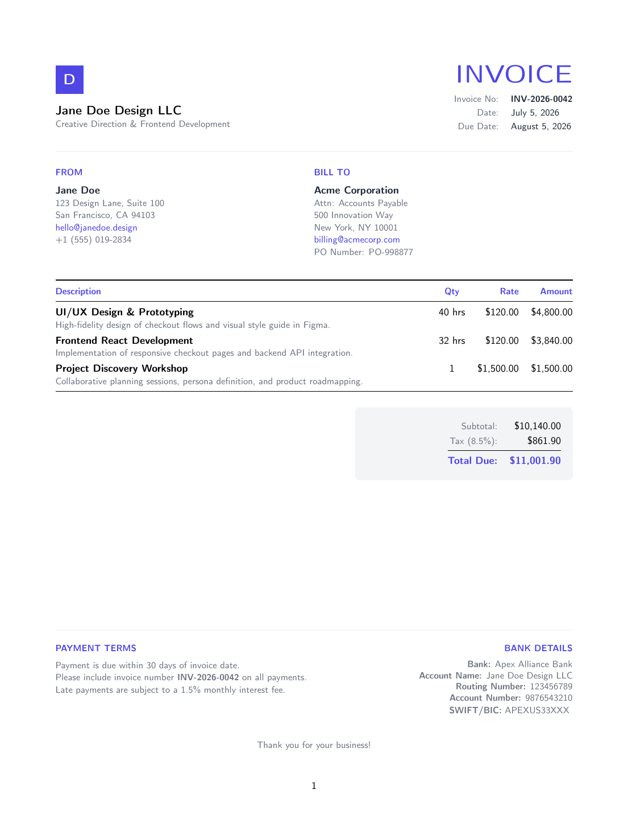</a> <b>Freelance Invoice</b> <a href="https://letx.app/templates/miscellaneous/freelance-invoice">Open in LetX</a> · <a href="./freelance-invoice">Source</a></td>
<td width="33%" valign="top" align="center"><a href="https://letx.app/templates/miscellaneous/freelance-project-proposal">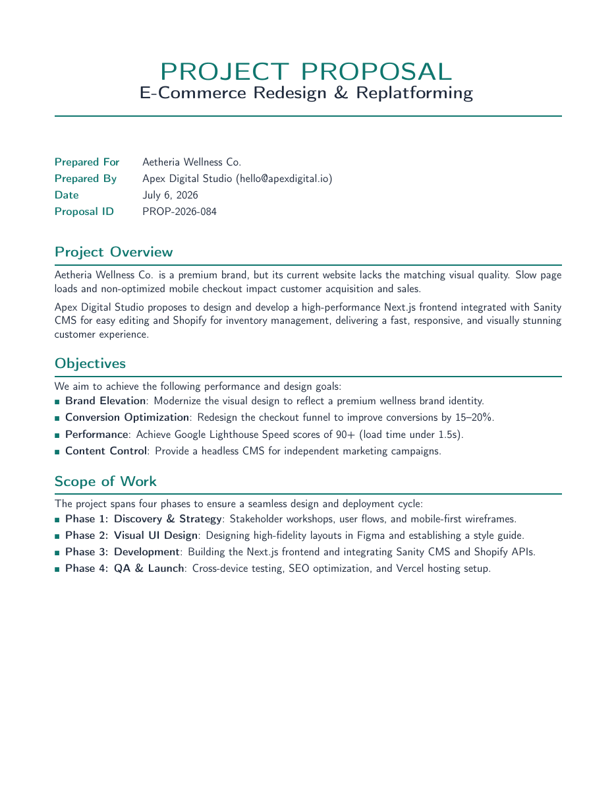</a> <b>Freelance Project Proposal</b> <a href="https://letx.app/templates/miscellaneous/freelance-project-proposal">Open in LetX</a> · <a href="./freelance-project-proposal">Source</a></td>
<td width="33%" valign="top" align="center"><a href="https://letx.app/templates/miscellaneous/gantt-project-plan">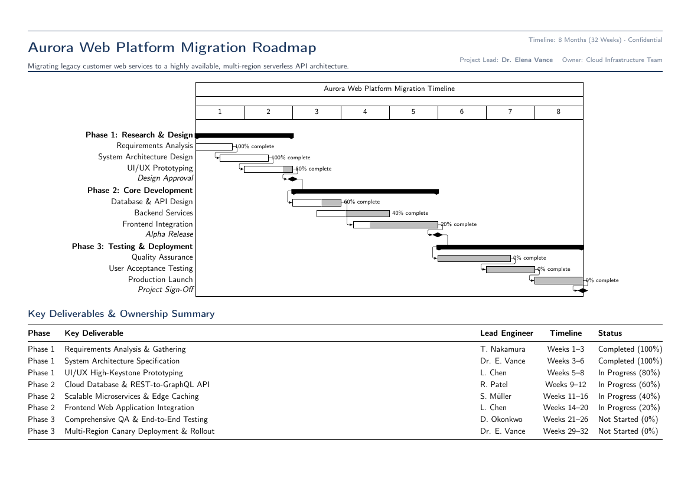</a> <b>Gantt Project Plan</b> <a href="https://letx.app/templates/miscellaneous/gantt-project-plan">Open in LetX</a> · <a href="./gantt-project-plan">Source</a></td>
</tr>
<tr>
<td width="33%" valign="top" align="center"><a href="https://letx.app/templates/miscellaneous/greeting-card">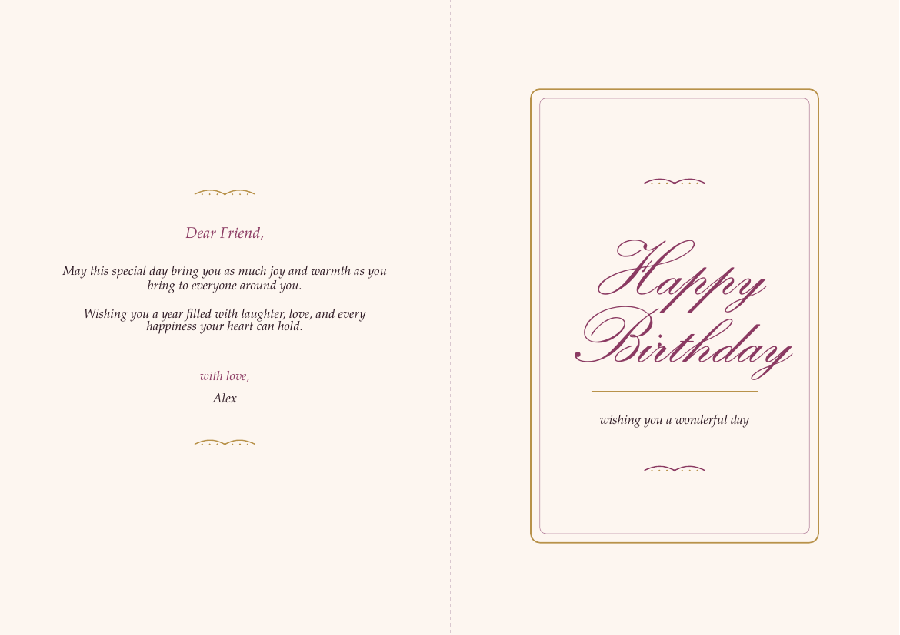</a> <b>Greeting Card</b> <a href="https://letx.app/templates/miscellaneous/greeting-card">Open in LetX</a> · <a href="./greeting-card">Source</a></td>
<td width="33%" valign="top" align="center"><a href="https://letx.app/templates/miscellaneous/hindu-marriage-biodata">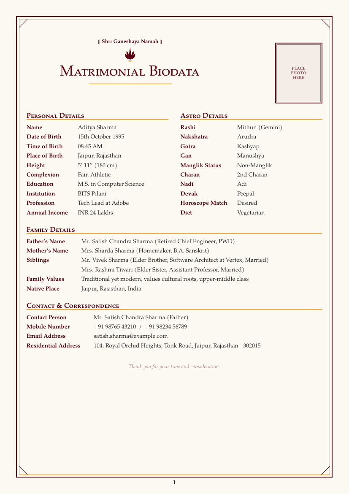</a> <b>Hindu Marriage Biodata</b> <a href="https://letx.app/templates/miscellaneous/hindu-marriage-biodata">Open in LetX</a> · <a href="./hindu-marriage-biodata">Source</a></td>
<td width="33%" valign="top" align="center"><a href="https://letx.app/templates/miscellaneous/meal-planner">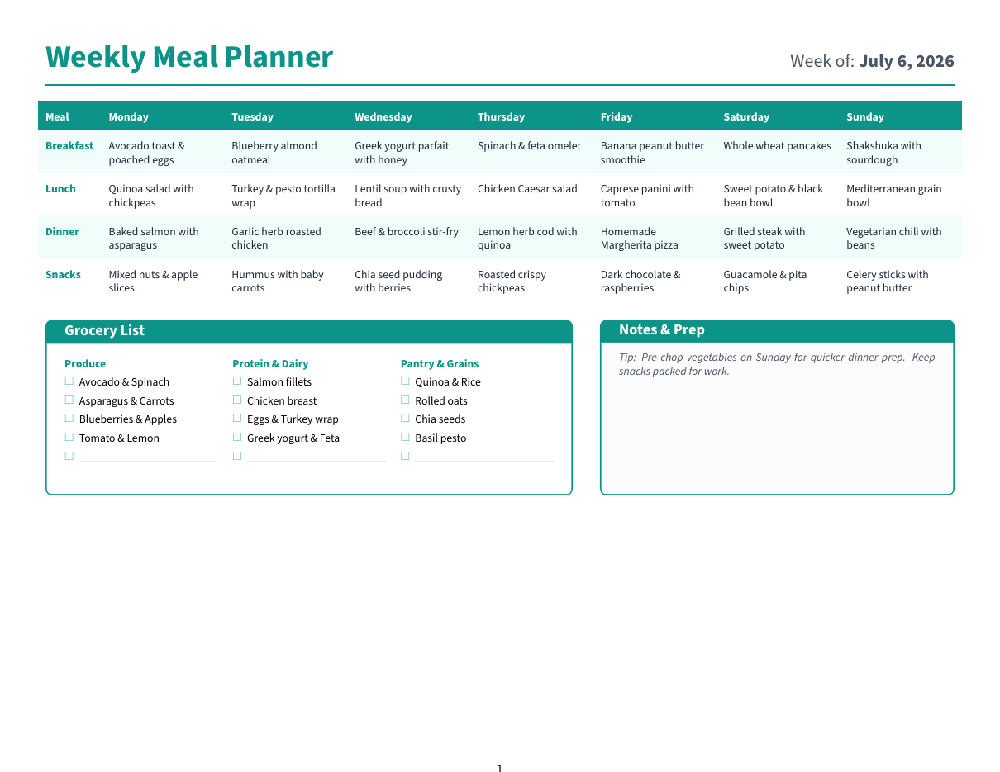</a> <b>Weekly Meal Planner</b> <a href="https://letx.app/templates/miscellaneous/meal-planner">Open in LetX</a> · <a href="./meal-planner">Source</a></td>
</tr>
<tr>
<td width="33%" valign="top" align="center"><a href="https://letx.app/templates/miscellaneous/modern-marriage-biodata">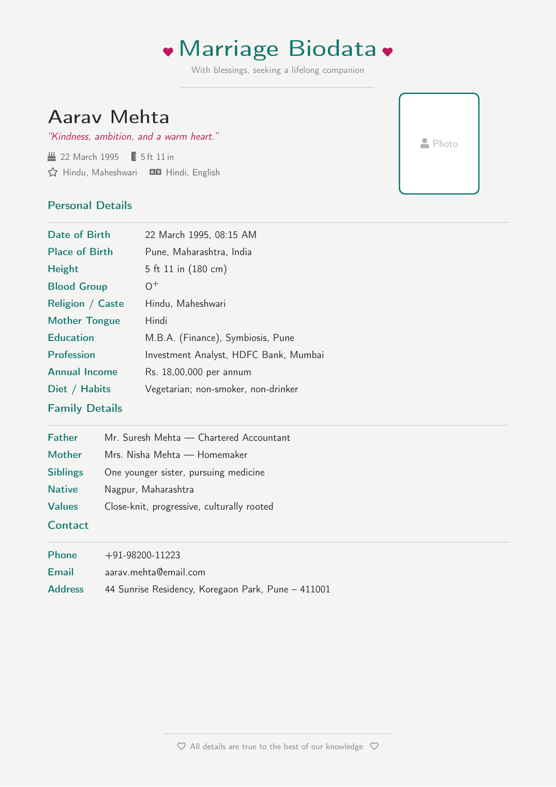</a> <b>Modern Marriage Biodata</b> <a href="https://letx.app/templates/miscellaneous/modern-marriage-biodata">Open in LetX</a> · <a href="./modern-marriage-biodata">Source</a></td>
<td width="33%" valign="top" align="center"><a href="https://letx.app/templates/miscellaneous/muslim-marriage-biodata">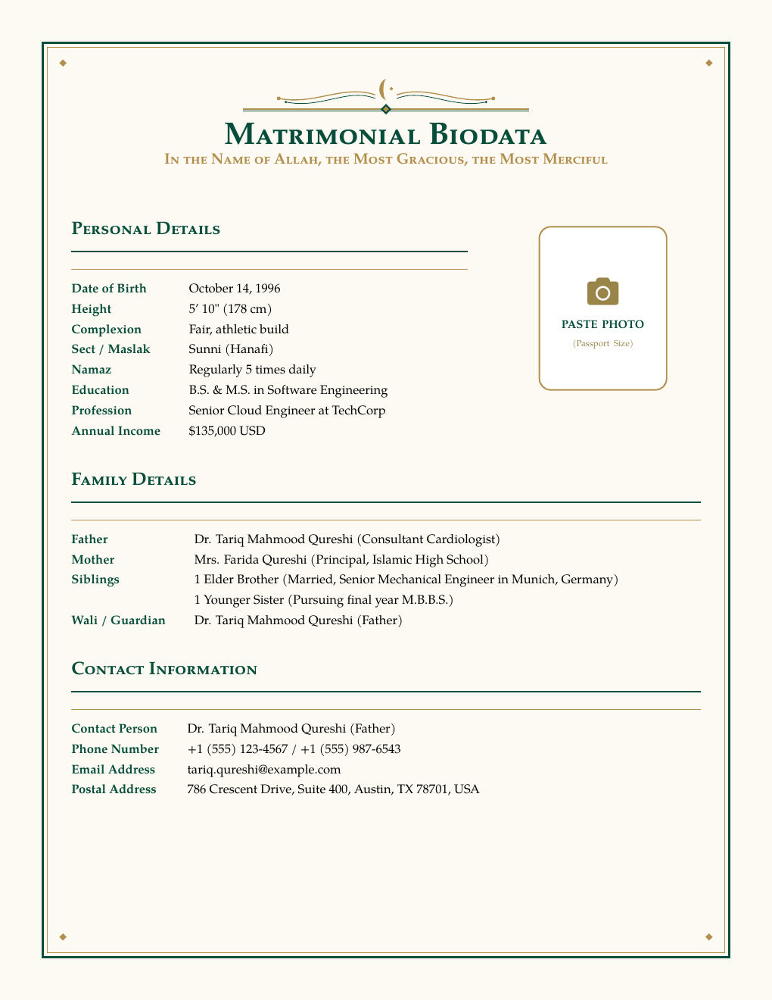</a> <b>Muslim Marriage Biodata</b> <a href="https://letx.app/templates/miscellaneous/muslim-marriage-biodata">Open in LetX</a> · <a href="./muslim-marriage-biodata">Source</a></td>
<td width="33%" valign="top" align="center"><a href="https://letx.app/templates/miscellaneous/nda-template">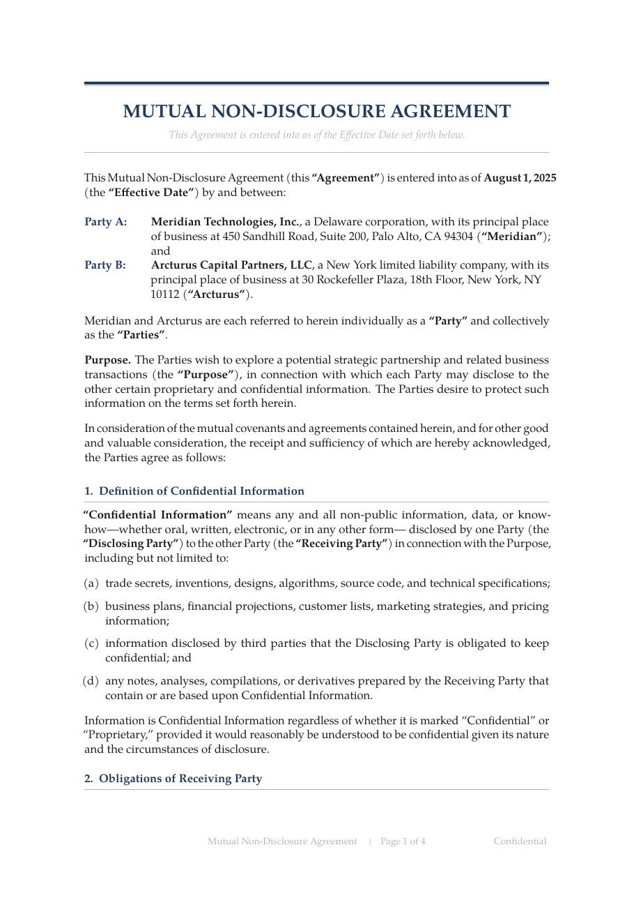</a> <b>Non-Disclosure Agreement</b> <a href="https://letx.app/templates/miscellaneous/nda-template">Open in LetX</a> · <a href="./nda-template">Source</a></td>
</tr>
<tr>
<td width="33%" valign="top" align="center"><a href="https://letx.app/templates/miscellaneous/patent-application">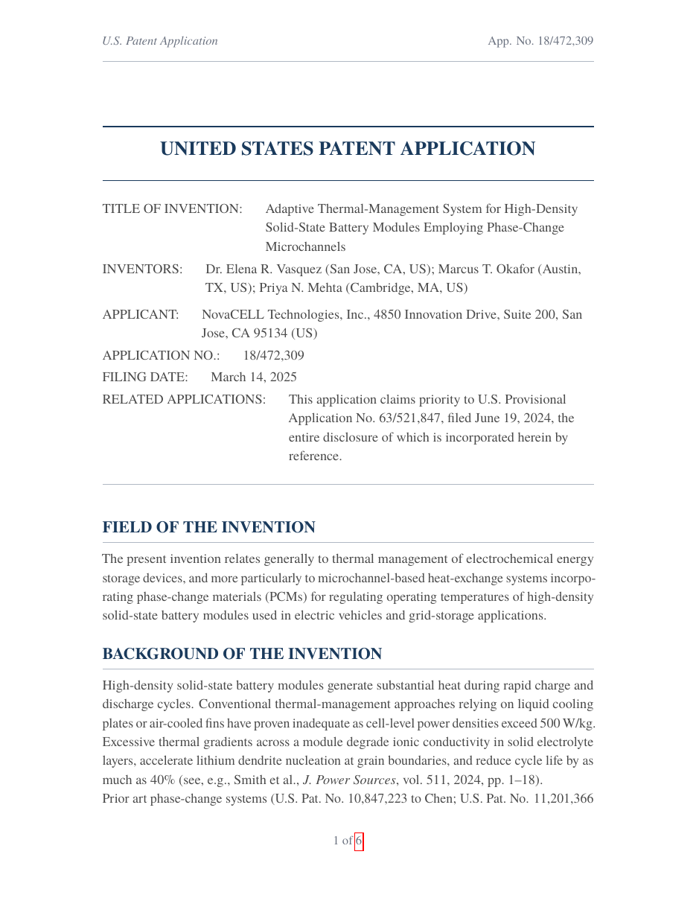</a> <b>Patent Application</b> <a href="https://letx.app/templates/miscellaneous/patent-application">Open in LetX</a> · <a href="./patent-application">Source</a></td>
<td width="33%" valign="top" align="center"><a href="https://letx.app/templates/miscellaneous/personal-budget-planner">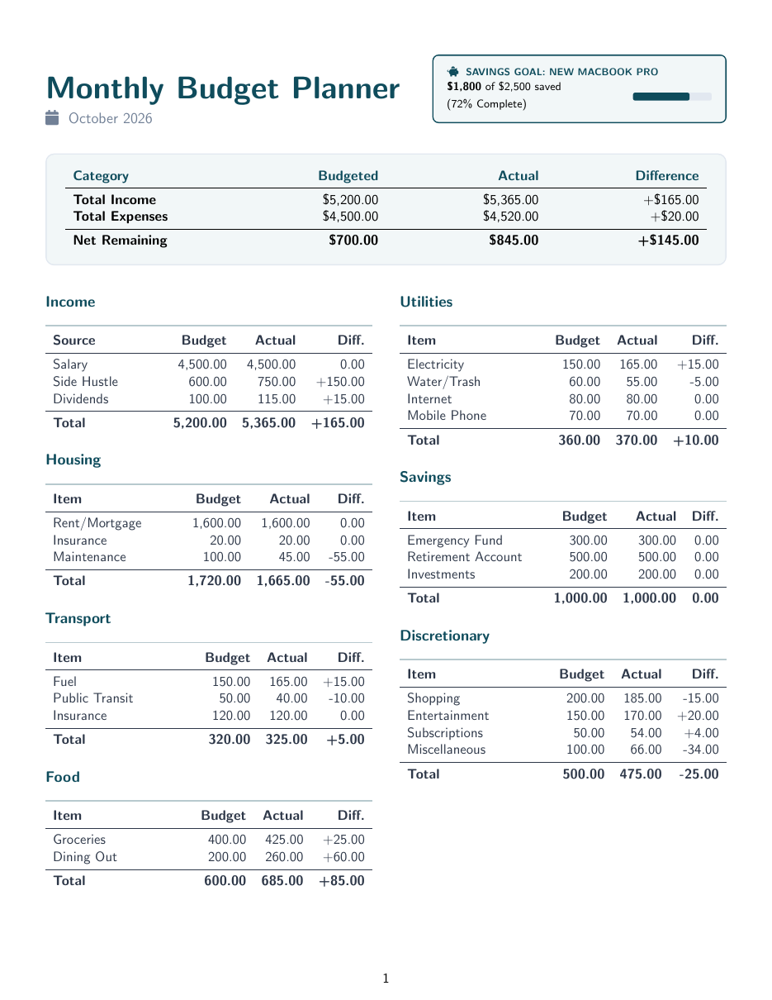</a> <b>Personal Budget Planner</b> <a href="https://letx.app/templates/miscellaneous/personal-budget-planner">Open in LetX</a> · <a href="./personal-budget-planner">Source</a></td>
<td width="33%" valign="top" align="center"><a href="https://letx.app/templates/miscellaneous/press-release">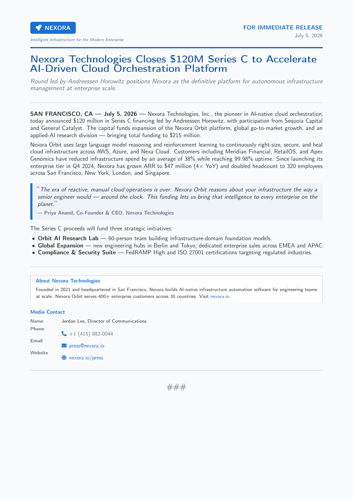</a> <b>Press Release</b> <a href="https://letx.app/templates/miscellaneous/press-release">Open in LetX</a> · <a href="./press-release">Source</a></td>
</tr>
<tr>
<td width="33%" valign="top" align="center"><a href="https://letx.app/templates/miscellaneous/restaurant-menu">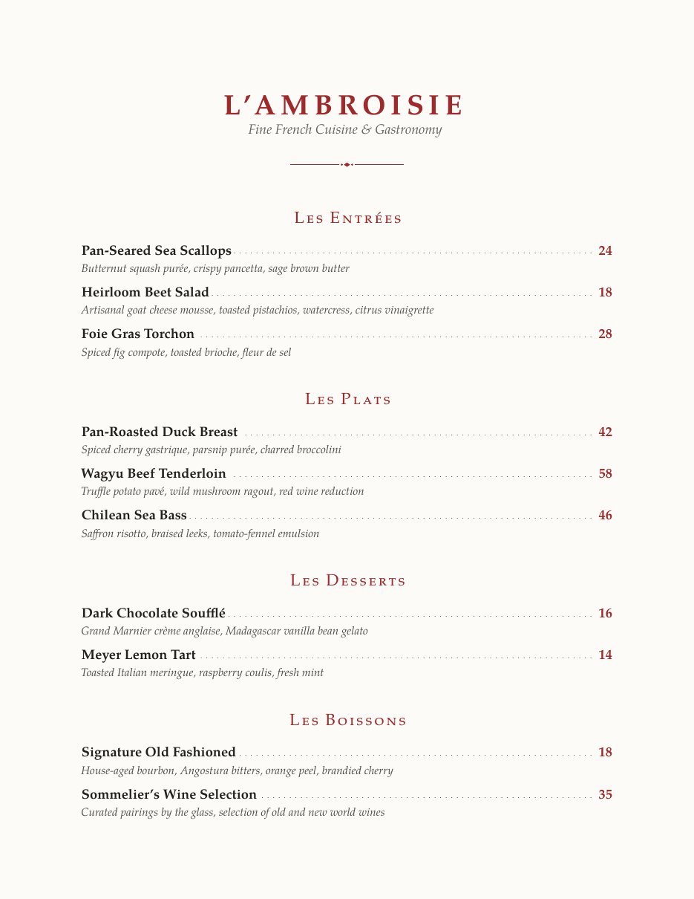</a> <b>Restaurant Menu</b> <a href="https://letx.app/templates/miscellaneous/restaurant-menu">Open in LetX</a> · <a href="./restaurant-menu">Source</a></td>
<td width="33%" valign="top" align="center"><a href="https://letx.app/templates/miscellaneous/scientific-figure-panel">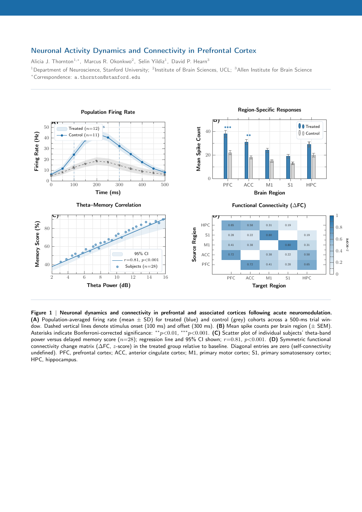</a> <b>Scientific Figure Panel</b> <a href="https://letx.app/templates/miscellaneous/scientific-figure-panel">Open in LetX</a> · <a href="./scientific-figure-panel">Source</a></td>
<td width="33%" valign="top" align="center"><a href="https://letx.app/templates/miscellaneous/south-indian-marriage-biodata">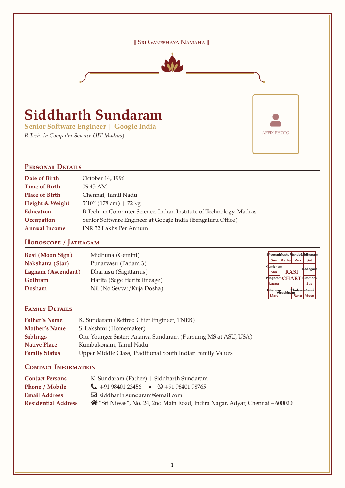</a> <b>South Indian Marriage Biodata</b> <a href="https://letx.app/templates/miscellaneous/south-indian-marriage-biodata">Open in LetX</a> · <a href="./south-indian-marriage-biodata">Source</a></td>
</tr>
<tr>
<td width="33%" valign="top" align="center"><a href="https://letx.app/templates/miscellaneous/traditional-marriage-biodata">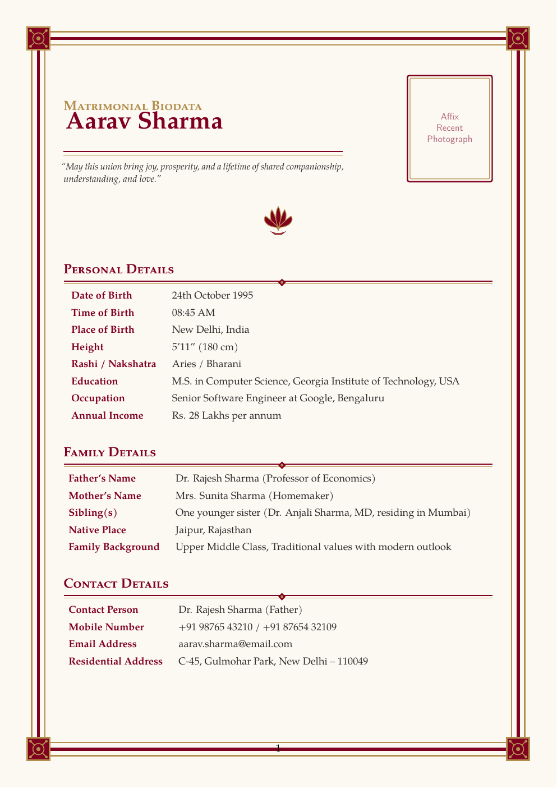</a> <b>Traditional Marriage Biodata</b> <a href="https://letx.app/templates/miscellaneous/traditional-marriage-biodata">Open in LetX</a> · <a href="./traditional-marriage-biodata">Source</a></td>
<td width="33%" valign="top" align="center"><a href="https://letx.app/templates/miscellaneous/travel-itinerary">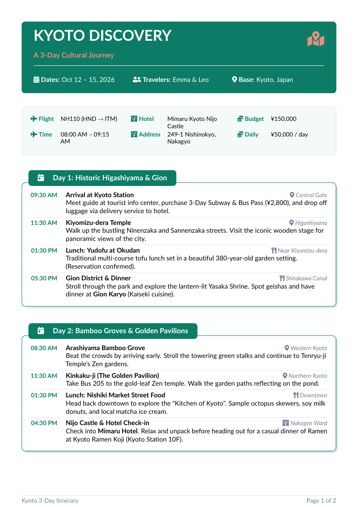</a> <b>Travel Itinerary</b> <a href="https://letx.app/templates/miscellaneous/travel-itinerary">Open in LetX</a> · <a href="./travel-itinerary">Source</a></td>
<td width="33%" valign="top" align="center"><a href="https://letx.app/templates/miscellaneous/wedding-invitation">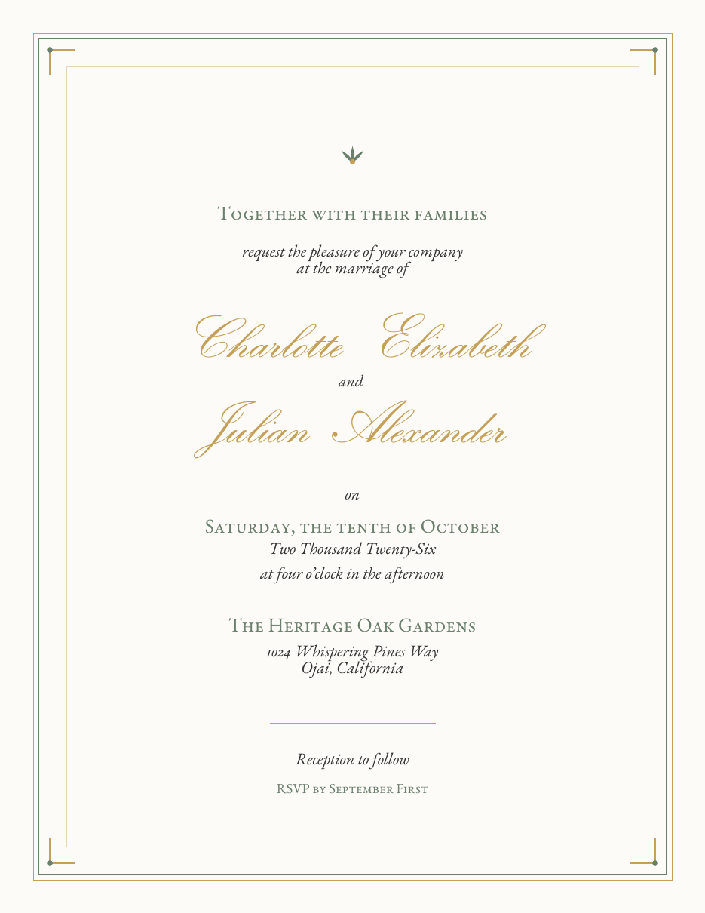</a> <b>Wedding Invitation</b> <a href="https://letx.app/templates/miscellaneous/wedding-invitation">Open in LetX</a> · <a href="./wedding-invitation">Source</a></td>
</tr>
<tr>
<td width="33%" valign="top" align="center"><a href="https://letx.app/templates/miscellaneous/wedding-program">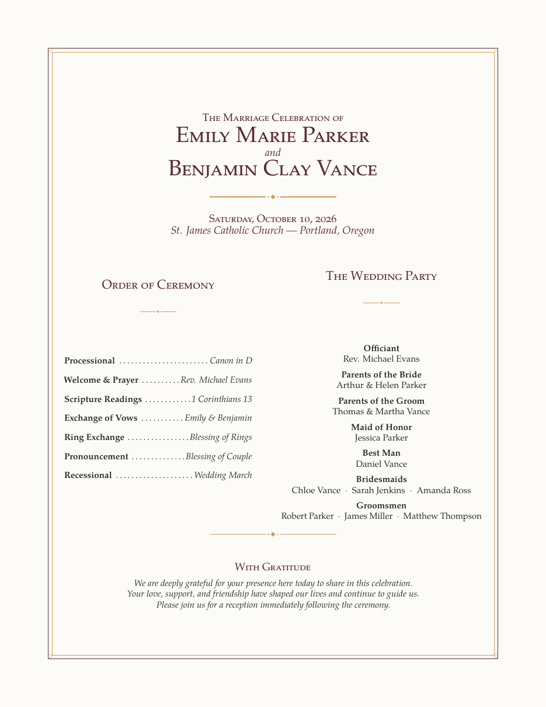</a> <b>Wedding Program</b> <a href="https://letx.app/templates/miscellaneous/wedding-program">Open in LetX</a> · <a href="./wedding-program">Source</a></td>
<td width="33%" valign="top" align="center"><a href="https://letx.app/templates/miscellaneous/workout-log">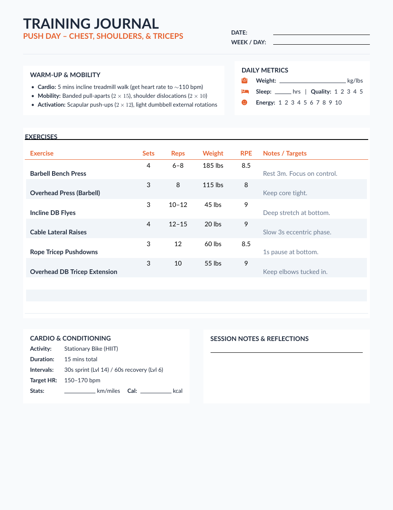</a> <b>Workout Log</b> <a href="https://letx.app/templates/miscellaneous/workout-log">Open in LetX</a> · <a href="./workout-log">Source</a></td>
</tr>
</table>

## About

Built by **[Shahriar Labs](https://shahriarlabs.com)** — makers of **[LetX](https://letx.app)**, the real-time collaborative LaTeX editor (a modern Overleaf alternative). Templates are MIT-licensed — free for personal and commercial use.

## License

[MIT](LICENSE) © Shahriar Labs
