# Free LaTeX Templates — Theses, Papers, CVs, Posters & Slides

[](https://letx.app/templates) [](LICENSE) [](https://letx.app/templates)

**768 free, open-source LaTeX templates**, organised into 20 categories: university theses, journal articles, conference papers, CVs and résumés, grant proposals, academic posters, Beamer presentations, lab reports and formal letters.

Every template is compile-tested, MIT-licensed, and free to use — no account, no signup, no paywall. Open one in the browser to edit and compile it without installing LaTeX, or clone the repo and run `latexmk` locally. The full library of 600+ templates lives at [letx.app/templates](https://letx.app/templates).

## Categories

| Category | Templates | Browse online |
|---|---:|---|
| [University & Thesis Templates](#university--thesis-templates) | 61 | [universities](https://letx.app/templates/universities) |
| [Journal Articles & Papers](#journal-articles--papers) | 33 | [journal-articles](https://letx.app/templates/journal-articles) |
| [Conference Papers & Abstracts](#conference-papers--abstracts) | 68 | [conferences](https://letx.app/templates/conferences) |
| [CVs & Résumés](#cvs--résumés) | 161 | [cvs-resumes](https://letx.app/templates/cvs-resumes) |
| [Academic Career (Statements, Applications)](#academic-career-statements-applications) | 22 | [academic-career](https://letx.app/templates/academic-career) |
| [Assignments & Course Work](#assignments--course-work) | 19 | [assignments](https://letx.app/templates/assignments) |
| [Lab Reports & Documentation](#lab-reports--documentation) | 61 | [lab-documents](https://letx.app/templates/lab-documents) |
| [Grants & Research Proposals](#grants--research-proposals) | 17 | [grants](https://letx.app/templates/grants) |
| [Academic Posters](#academic-posters) | 10 | [posters](https://letx.app/templates/posters) |
| [Presentations & Beamer Slides](#presentations--beamer-slides) | 64 | [presentations](https://letx.app/templates/presentations) |
| [Books & Long-Form Documents](#books--long-form-documents) | 9 | [books](https://letx.app/templates/books) |
| [Formal Letters & Letterheads](#formal-letters--letterheads) | 5 | [formal-letters](https://letx.app/templates/formal-letters) |
| [Technical Documentation](#technical-documentation) | 31 | [tech-docs](https://letx.app/templates/tech-docs) |
| [Engineering Reports](#engineering-reports) | 28 | [engineering](https://letx.app/templates/engineering) |
| [Medical & Clinical](#medical--clinical) | 21 | [medical](https://letx.app/templates/medical) |
| [Legal Documents](#legal-documents) | 21 | [legal](https://letx.app/templates/legal) |
| [Finance & Business](#finance--business) | 40 | [finance](https://letx.app/templates/finance) |
| [Teaching & Education](#teaching--education) | 21 | [education](https://letx.app/templates/education) |
| [Calendars & Planners](#calendars--planners) | 6 | [calendars](https://letx.app/templates/calendars) |
| [Everything Else](#everything-else) | 70 | [miscellaneous](https://letx.app/templates/miscellaneous) |

## How to use a template

**Online (no install):** click *Open in LetX* on any template below. It opens ready to edit, compiles to PDF in the browser, and supports real-time collaboration with co-authors.

**Locally:**

```bash
git clone https://github.com/Shahriar-Labs/latex-templates.git
cd latex-templates/<category>/<template>
latexmk -pdf main.tex     # check metadata.json for the right compiler
```

Each template directory contains `main.tex`, a compiled `main.pdf`, a `preview.png`, and a `metadata.json` naming its compiler (`pdflatex`, `xelatex` or `lualatex`).

## Templates

### University & Thesis Templates

61 templates. [Browse this category on LetX](https://letx.app/templates/universities)

<table>
<tr>
<td width="33%" valign="top" align="center"><a href="https://letx.app/templates/universities/anu-thesis"></a><br><b>ANU Thesis</b><br><a href="https://letx.app/templates/universities/anu-thesis">Open in LetX</a> · <a href="./universities/anu-thesis">Source</a></td>
<td width="33%" valign="top" align="center"><a href="https://letx.app/templates/universities/bits-pilani-thesis"></a><br><b>BITS Pilani Thesis</b><br><a href="https://letx.app/templates/universities/bits-pilani-thesis">Open in LetX</a> · <a href="./universities/bits-pilani-thesis">Source</a></td>
<td width="33%" valign="top" align="center"><a href="https://letx.app/templates/universities/brown-thesis"></a><br><b>Brown University Thesis</b><br><a href="https://letx.app/templates/universities/brown-thesis">Open in LetX</a> · <a href="./universities/brown-thesis">Source</a></td>
</tr>
<tr>
<td width="33%" valign="top" align="center"><a href="https://letx.app/templates/universities/cairo-university-thesis"></a><br><b>Cairo University Thesis</b><br><a href="https://letx.app/templates/universities/cairo-university-thesis">Open in LetX</a> · <a href="./universities/cairo-university-thesis">Source</a></td>
<td width="33%" valign="top" align="center"><a href="https://letx.app/templates/universities/caltech-thesis"></a><br><b>Caltech Thesis</b><br><a href="https://letx.app/templates/universities/caltech-thesis">Open in LetX</a> · <a href="./universities/caltech-thesis">Source</a></td>
<td width="33%" valign="top" align="center"><a href="https://letx.app/templates/universities/chulalongkorn-thesis"></a><br><b>Chulalongkorn Thesis</b><br><a href="https://letx.app/templates/universities/chulalongkorn-thesis">Open in LetX</a> · <a href="./universities/chulalongkorn-thesis">Source</a></td>
</tr>
<tr>
<td width="33%" valign="top" align="center"><a href="https://letx.app/templates/universities/cmu-thesis"></a><br><b>CMU Thesis</b><br><a href="https://letx.app/templates/universities/cmu-thesis">Open in LetX</a> · <a href="./universities/cmu-thesis">Source</a></td>
<td width="33%" valign="top" align="center"><a href="https://letx.app/templates/universities/columbia-thesis"></a><br><b>Columbia Thesis</b><br><a href="https://letx.app/templates/universities/columbia-thesis">Open in LetX</a> · <a href="./universities/columbia-thesis">Source</a></td>
<td width="33%" valign="top" align="center"><a href="https://letx.app/templates/universities/cornell-thesis"></a><br><b>Cornell Thesis</b><br><a href="https://letx.app/templates/universities/cornell-thesis">Open in LetX</a> · <a href="./universities/cornell-thesis">Source</a></td>
</tr>
<tr>
<td width="33%" valign="top" align="center"><a href="https://letx.app/templates/universities/delhi-university-thesis"></a><br><b>Delhi University Thesis</b><br><a href="https://letx.app/templates/universities/delhi-university-thesis">Open in LetX</a> · <a href="./universities/delhi-university-thesis">Source</a></td>
<td width="33%" valign="top" align="center"><a href="https://letx.app/templates/universities/dtu-delhi-thesis"></a><br><b>DTU Delhi Thesis</b><br><a href="https://letx.app/templates/universities/dtu-delhi-thesis">Open in LetX</a> · <a href="./universities/dtu-delhi-thesis">Source</a></td>
<td width="33%" valign="top" align="center"><a href="https://letx.app/templates/universities/duke-thesis"></a><br><b>Duke University Thesis</b><br><a href="https://letx.app/templates/universities/duke-thesis">Open in LetX</a> · <a href="./universities/duke-thesis">Source</a></td>
</tr>
<tr>
<td width="33%" valign="top" align="center"><a href="https://letx.app/templates/universities/edinburgh-thesis"></a><br><b>Edinburgh Thesis</b><br><a href="https://letx.app/templates/universities/edinburgh-thesis">Open in LetX</a> · <a href="./universities/edinburgh-thesis">Source</a></td>
<td width="33%" valign="top" align="center"><a href="https://letx.app/templates/universities/epfl-thesis"></a><br><b>EPFL Thesis</b><br><a href="https://letx.app/templates/universities/epfl-thesis">Open in LetX</a> · <a href="./universities/epfl-thesis">Source</a></td>
<td width="33%" valign="top" align="center"><a href="https://letx.app/templates/universities/gatech-thesis"></a><br><b>Georgia Tech Thesis</b><br><a href="https://letx.app/templates/universities/gatech-thesis">Open in LetX</a> · <a href="./universities/gatech-thesis">Source</a></td>
</tr>
<tr>
<td width="33%" valign="top" align="center"><a href="https://letx.app/templates/universities/hku-thesis"></a><br><b>HKU Thesis</b><br><a href="https://letx.app/templates/universities/hku-thesis">Open in LetX</a> · <a href="./universities/hku-thesis">Source</a></td>
<td width="33%" valign="top" align="center"><a href="https://letx.app/templates/universities/iiit-hyderabad-thesis"></a><br><b>IIIT Hyderabad Thesis</b><br><a href="https://letx.app/templates/universities/iiit-hyderabad-thesis">Open in LetX</a> · <a href="./universities/iiit-hyderabad-thesis">Source</a></td>
<td width="33%" valign="top" align="center"><a href="https://letx.app/templates/universities/iit-guwahati-thesis"></a><br><b>IIT Guwahati Thesis</b><br><a href="https://letx.app/templates/universities/iit-guwahati-thesis">Open in LetX</a> · <a href="./universities/iit-guwahati-thesis">Source</a></td>
</tr>
<tr>
<td width="33%" valign="top" align="center"><a href="https://letx.app/templates/universities/iit-kharagpur-thesis"></a><br><b>IIT Kharagpur Thesis</b><br><a href="https://letx.app/templates/universities/iit-kharagpur-thesis">Open in LetX</a> · <a href="./universities/iit-kharagpur-thesis">Source</a></td>
<td width="33%" valign="top" align="center"><a href="https://letx.app/templates/universities/iit-roorkee-thesis"></a><br><b>IIT Roorkee Thesis</b><br><a href="https://letx.app/templates/universities/iit-roorkee-thesis">Open in LetX</a> · <a href="./universities/iit-roorkee-thesis">Source</a></td>
<td width="33%" valign="top" align="center"><a href="https://letx.app/templates/universities/imperial-college-thesis"></a><br><b>Imperial College London Thesis</b><br><a href="https://letx.app/templates/universities/imperial-college-thesis">Open in LetX</a> · <a href="./universities/imperial-college-thesis">Source</a></td>
</tr>
<tr>
<td width="33%" valign="top" align="center"><a href="https://letx.app/templates/universities/johns-hopkins-thesis"></a><br><b>Johns Hopkins Thesis</b><br><a href="https://letx.app/templates/universities/johns-hopkins-thesis">Open in LetX</a> · <a href="./universities/johns-hopkins-thesis">Source</a></td>
<td width="33%" valign="top" align="center"><a href="https://letx.app/templates/universities/kaust-thesis"></a><br><b>KAUST Thesis</b><br><a href="https://letx.app/templates/universities/kaust-thesis">Open in LetX</a> · <a href="./universities/kaust-thesis">Source</a></td>
<td width="33%" valign="top" align="center"><a href="https://letx.app/templates/universities/kfupm-thesis"></a><br><b>KFUPM Thesis</b><br><a href="https://letx.app/templates/universities/kfupm-thesis">Open in LetX</a> · <a href="./universities/kfupm-thesis">Source</a></td>
</tr>
<tr>
<td width="33%" valign="top" align="center"><a href="https://letx.app/templates/universities/king-saud-university-thesis"></a><br><b>King Saud University Thesis</b><br><a href="https://letx.app/templates/universities/king-saud-university-thesis">Open in LetX</a> · <a href="./universities/king-saud-university-thesis">Source</a></td>
<td width="33%" valign="top" align="center"><a href="https://letx.app/templates/universities/korea-university-thesis"></a><br><b>Korea University Thesis</b><br><a href="https://letx.app/templates/universities/korea-university-thesis">Open in LetX</a> · <a href="./universities/korea-university-thesis">Source</a></td>
<td width="33%" valign="top" align="center"><a href="https://letx.app/templates/universities/kuleuven-thesis"></a><br><b>KU Leuven Thesis</b><br><a href="https://letx.app/templates/universities/kuleuven-thesis">Open in LetX</a> · <a href="./universities/kuleuven-thesis">Source</a></td>
</tr>
<tr>
<td width="33%" valign="top" align="center"><a href="https://letx.app/templates/universities/kyoto-university-thesis"></a><br><b>Kyoto University Thesis</b><br><a href="https://letx.app/templates/universities/kyoto-university-thesis">Open in LetX</a> · <a href="./universities/kyoto-university-thesis">Source</a></td>
<td width="33%" valign="top" align="center"><a href="https://letx.app/templates/universities/lmu-munich-thesis"></a><br><b>LMU Munich Thesis</b><br><a href="https://letx.app/templates/universities/lmu-munich-thesis">Open in LetX</a> · <a href="./universities/lmu-munich-thesis">Source</a></td>
<td width="33%" valign="top" align="center"><a href="https://letx.app/templates/universities/mcgill-thesis"></a><br><b>McGill University Thesis</b><br><a href="https://letx.app/templates/universities/mcgill-thesis">Open in LetX</a> · <a href="./universities/mcgill-thesis">Source</a></td>
</tr>
<tr>
<td width="33%" valign="top" align="center"><a href="https://letx.app/templates/universities/monash-thesis"></a><br><b>Monash University Thesis</b><br><a href="https://letx.app/templates/universities/monash-thesis">Open in LetX</a> · <a href="./universities/monash-thesis">Source</a></td>
<td width="33%" valign="top" align="center"><a href="https://letx.app/templates/universities/nit-thesis"></a><br><b>NIT Thesis</b><br><a href="https://letx.app/templates/universities/nit-thesis">Open in LetX</a> · <a href="./universities/nit-thesis">Source</a></td>
<td width="33%" valign="top" align="center"><a href="https://letx.app/templates/universities/northwestern-thesis"></a><br><b>Northwestern Thesis</b><br><a href="https://letx.app/templates/universities/northwestern-thesis">Open in LetX</a> · <a href="./universities/northwestern-thesis">Source</a></td>
</tr>
<tr>
<td width="33%" valign="top" align="center"><a href="https://letx.app/templates/universities/nust-pakistan-thesis"></a><br><b>NUST Pakistan Thesis</b><br><a href="https://letx.app/templates/universities/nust-pakistan-thesis">Open in LetX</a> · <a href="./universities/nust-pakistan-thesis">Source</a></td>
<td width="33%" valign="top" align="center"><a href="https://letx.app/templates/universities/nyu-thesis"></a><br><b>NYU Thesis</b><br><a href="https://letx.app/templates/universities/nyu-thesis">Open in LetX</a> · <a href="./universities/nyu-thesis">Source</a></td>
<td width="33%" valign="top" align="center"><a href="https://letx.app/templates/universities/peking-thesis"></a><br><b>Peking Thesis</b><br><a href="https://letx.app/templates/universities/peking-thesis">Open in LetX</a> · <a href="./universities/peking-thesis">Source</a></td>
</tr>
<tr>
<td width="33%" valign="top" align="center"><a href="https://letx.app/templates/universities/princeton-thesis"></a><br><b>Princeton Thesis</b><br><a href="https://letx.app/templates/universities/princeton-thesis">Open in LetX</a> · <a href="./universities/princeton-thesis">Source</a></td>
<td width="33%" valign="top" align="center"><a href="https://letx.app/templates/universities/rwth-aachen-thesis"></a><br><b>RWTH Aachen Thesis</b><br><a href="https://letx.app/templates/universities/rwth-aachen-thesis">Open in LetX</a> · <a href="./universities/rwth-aachen-thesis">Source</a></td>
<td width="33%" valign="top" align="center"><a href="https://letx.app/templates/universities/snu-thesis"></a><br><b>SNU Thesis</b><br><a href="https://letx.app/templates/universities/snu-thesis">Open in LetX</a> · <a href="./universities/snu-thesis">Source</a></td>
</tr>
<tr>
<td width="33%" valign="top" align="center"><a href="https://letx.app/templates/universities/tsinghua-thesis"></a><br><b>Tsinghua Thesis</b><br><a href="https://letx.app/templates/universities/tsinghua-thesis">Open in LetX</a> · <a href="./universities/tsinghua-thesis">Source</a></td>
<td width="33%" valign="top" align="center"><a href="https://letx.app/templates/universities/tudelft-thesis"></a><br><b>TU Delft Thesis</b><br><a href="https://letx.app/templates/universities/tudelft-thesis">Open in LetX</a> · <a href="./universities/tudelft-thesis">Source</a></td>
<td width="33%" valign="top" align="center"><a href="https://letx.app/templates/universities/tum-thesis"></a><br><b>TUM Thesis</b><br><a href="https://letx.app/templates/universities/tum-thesis">Open in LetX</a> · <a href="./universities/tum-thesis">Source</a></td>
</tr>
<tr>
<td width="33%" valign="top" align="center"><a href="https://letx.app/templates/universities/ubc-thesis"></a><br><b>UBC Thesis</b><br><a href="https://letx.app/templates/universities/ubc-thesis">Open in LetX</a> · <a href="./universities/ubc-thesis">Source</a></td>
<td width="33%" valign="top" align="center"><a href="https://letx.app/templates/universities/uchicago-thesis"></a><br><b>UChicago Dissertation</b><br><a href="https://letx.app/templates/universities/uchicago-thesis">Open in LetX</a> · <a href="./universities/uchicago-thesis">Source</a></td>
<td width="33%" valign="top" align="center"><a href="https://letx.app/templates/universities/ucl-thesis"></a><br><b>UCL Thesis</b><br><a href="https://letx.app/templates/universities/ucl-thesis">Open in LetX</a> · <a href="./universities/ucl-thesis">Source</a></td>
</tr>
<tr>
<td width="33%" valign="top" align="center"><a href="https://letx.app/templates/universities/ucla-thesis"></a><br><b>UCLA Thesis & Dissertation</b><br><a href="https://letx.app/templates/universities/ucla-thesis">Open in LetX</a> · <a href="./universities/ucla-thesis">Source</a></td>
<td width="33%" valign="top" align="center"><a href="https://letx.app/templates/universities/cape-town-university-thesis"></a><br><b>UCT Thesis</b><br><a href="https://letx.app/templates/universities/cape-town-university-thesis">Open in LetX</a> · <a href="./universities/cape-town-university-thesis">Source</a></td>
<td width="33%" valign="top" align="center"><a href="https://letx.app/templates/universities/umich-thesis"></a><br><b>UMich Thesis</b><br><a href="https://letx.app/templates/universities/umich-thesis">Open in LetX</a> · <a href="./universities/umich-thesis">Source</a></td>
</tr>
<tr>
<td width="33%" valign="top" align="center"><a href="https://letx.app/templates/universities/unimelb-thesis"></a><br><b>UniMelb Thesis</b><br><a href="https://letx.app/templates/universities/unimelb-thesis">Open in LetX</a> · <a href="./universities/unimelb-thesis">Source</a></td>
<td width="33%" valign="top" align="center"><a href="https://letx.app/templates/universities/ui-indonesia-thesis"></a><br><b>Universitas Indonesia Thesis</b><br><a href="https://letx.app/templates/universities/ui-indonesia-thesis">Open in LetX</a> · <a href="./universities/ui-indonesia-thesis">Source</a></td>
<td width="33%" valign="top" align="center"><a href="https://letx.app/templates/universities/malaya-university-thesis"></a><br><b>University of Malaya Thesis</b><br><a href="https://letx.app/templates/universities/malaya-university-thesis">Open in LetX</a> · <a href="./universities/malaya-university-thesis">Source</a></td>
</tr>
<tr>
<td width="33%" valign="top" align="center"><a href="https://letx.app/templates/universities/sydney-university-thesis"></a><br><b>University of Sydney Thesis</b><br><a href="https://letx.app/templates/universities/sydney-university-thesis">Open in LetX</a> · <a href="./universities/sydney-university-thesis">Source</a></td>
<td width="33%" valign="top" align="center"><a href="https://letx.app/templates/universities/waterloo-thesis"></a><br><b>University of Waterloo Thesis</b><br><a href="https://letx.app/templates/universities/waterloo-thesis">Open in LetX</a> · <a href="./universities/waterloo-thesis">Source</a></td>
<td width="33%" valign="top" align="center"><a href="https://letx.app/templates/universities/unsw-thesis"></a><br><b>UNSW Thesis</b><br><a href="https://letx.app/templates/universities/unsw-thesis">Open in LetX</a> · <a href="./universities/unsw-thesis">Source</a></td>
</tr>
<tr>
<td width="33%" valign="top" align="center"><a href="https://letx.app/templates/universities/uoft-thesis"></a><br><b>UofT Thesis</b><br><a href="https://letx.app/templates/universities/uoft-thesis">Open in LetX</a> · <a href="./universities/uoft-thesis">Source</a></td>
<td width="33%" valign="top" align="center"><a href="https://letx.app/templates/universities/upenn-thesis"></a><br><b>UPenn Thesis</b><br><a href="https://letx.app/templates/universities/upenn-thesis">Open in LetX</a> · <a href="./universities/upenn-thesis">Source</a></td>
<td width="33%" valign="top" align="center"><a href="https://letx.app/templates/universities/utokyo-thesis"></a><br><b>UTokyo Thesis</b><br><a href="https://letx.app/templates/universities/utokyo-thesis">Open in LetX</a> · <a href="./universities/utokyo-thesis">Source</a></td>
</tr>
<tr>
<td width="33%" valign="top" align="center"><a href="https://letx.app/templates/universities/vit-vellore-thesis"></a><br><b>VIT Vellore Thesis</b><br><a href="https://letx.app/templates/universities/vit-vellore-thesis">Open in LetX</a> · <a href="./universities/vit-vellore-thesis">Source</a></td>
<td width="33%" valign="top" align="center"><a href="https://letx.app/templates/universities/wits-university-thesis"></a><br><b>Wits University Thesis</b><br><a href="https://letx.app/templates/universities/wits-university-thesis">Open in LetX</a> · <a href="./universities/wits-university-thesis">Source</a></td>
<td width="33%" valign="top" align="center"><a href="https://letx.app/templates/universities/yale-thesis"></a><br><b>Yale Thesis</b><br><a href="https://letx.app/templates/universities/yale-thesis">Open in LetX</a> · <a href="./universities/yale-thesis">Source</a></td>
</tr>
<tr>
<td width="33%" valign="top" align="center"><a href="https://letx.app/templates/universities/yonsei-thesis"></a><br><b>Yonsei University Thesis</b><br><a href="https://letx.app/templates/universities/yonsei-thesis">Open in LetX</a> · <a href="./universities/yonsei-thesis">Source</a></td>
</tr>
</table>

### Journal Articles & Papers

33 templates. [Browse this category on LetX](https://letx.app/templates/journal-articles)

<table>
<tr>
<td width="33%" valign="top" align="center"><a href="https://letx.app/templates/journal-articles/aastex-apj-paper"></a><br><b>AASTeX Astronomy Paper</b><br><a href="https://letx.app/templates/journal-articles/aastex-apj-paper">Open in LetX</a> · <a href="./journal-articles/aastex-apj-paper">Source</a></td>
<td width="33%" valign="top" align="center"><a href="https://letx.app/templates/journal-articles/biomed-central-bioinformatics-template"></a><br><b>BioMed Central (BMC) Bioinformatics Template</b><br><a href="https://letx.app/templates/journal-articles/biomed-central-bioinformatics-template">Open in LetX</a> · <a href="./journal-articles/biomed-central-bioinformatics-template">Source</a></td>
<td width="33%" valign="top" align="center"><a href="https://letx.app/templates/journal-articles/cell-reports-template">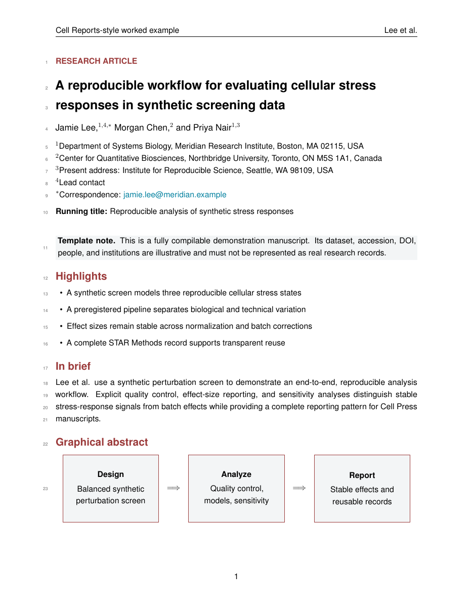</a><br><b>Cell Reports Template</b><br><a href="https://letx.app/templates/journal-articles/cell-reports-template">Open in LetX</a> · <a href="./journal-articles/cell-reports-template">Source</a></td>
</tr>
<tr>
<td width="33%" valign="top" align="center"><a href="https://letx.app/templates/journal-articles/clinical-case-report"></a><br><b>Clinical Case Report</b><br><a href="https://letx.app/templates/journal-articles/clinical-case-report">Open in LetX</a> · <a href="./journal-articles/clinical-case-report">Source</a></td>
<td width="33%" valign="top" align="center"><a href="https://letx.app/templates/journal-articles/cvpr-stylized-paper"></a><br><b>CVPR Paper (Stylized)</b><br><a href="https://letx.app/templates/journal-articles/cvpr-stylized-paper">Open in LetX</a> · <a href="./journal-articles/cvpr-stylized-paper">Source</a></td>
<td width="33%" valign="top" align="center"><a href="https://letx.app/templates/journal-articles/elegant-arxiv-preprint"></a><br><b>Elegant arXiv Preprint</b><br><a href="https://letx.app/templates/journal-articles/elegant-arxiv-preprint">Open in LetX</a> · <a href="./journal-articles/elegant-arxiv-preprint">Source</a></td>
</tr>
<tr>
<td width="33%" valign="top" align="center"><a href="https://letx.app/templates/journal-articles/frontiers-in-immunology-template"></a><br><b>Frontiers in Immunology Template</b><br><a href="https://letx.app/templates/journal-articles/frontiers-in-immunology-template">Open in LetX</a> · <a href="./journal-articles/frontiers-in-immunology-template">Source</a></td>
<td width="33%" valign="top" align="center"><a href="https://letx.app/templates/journal-articles/frontiers-in-neuroscience-template"></a><br><b>Frontiers in Neuroscience Template</b><br><a href="https://letx.app/templates/journal-articles/frontiers-in-neuroscience-template">Open in LetX</a> · <a href="./journal-articles/frontiers-in-neuroscience-template">Source</a></td>
<td width="33%" valign="top" align="center"><a href="https://letx.app/templates/journal-articles/icml-stylized-paper"></a><br><b>ICML Paper (Stylized)</b><br><a href="https://letx.app/templates/journal-articles/icml-stylized-paper">Open in LetX</a> · <a href="./journal-articles/icml-stylized-paper">Source</a></td>
</tr>
<tr>
<td width="33%" valign="top" align="center"><a href="https://letx.app/templates/journal-articles/ieee-access-journal-template"></a><br><b>IEEE Access Journal Template</b><br><a href="https://letx.app/templates/journal-articles/ieee-access-journal-template">Open in LetX</a> · <a href="./journal-articles/ieee-access-journal-template">Source</a></td>
<td width="33%" valign="top" align="center"><a href="https://letx.app/templates/journal-articles/iop-publishing-journal-of-physics-template">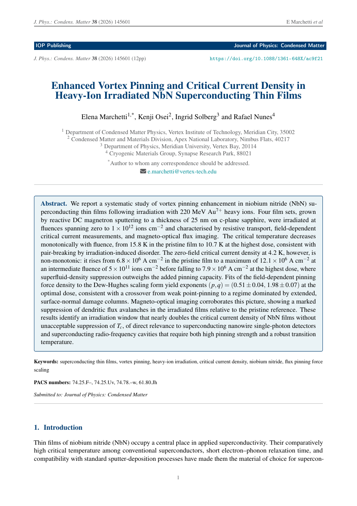</a><br><b>IOP Publishing Journal of Physics Template</b><br><a href="https://letx.app/templates/journal-articles/iop-publishing-journal-of-physics-template">Open in LetX</a> · <a href="./journal-articles/iop-publishing-journal-of-physics-template">Source</a></td>
<td width="33%" valign="top" align="center"><a href="https://letx.app/templates/journal-articles/journal-cover-letter"></a><br><b>Journal Cover Letter</b><br><a href="https://letx.app/templates/journal-articles/journal-cover-letter">Open in LetX</a> · <a href="./journal-articles/journal-cover-letter">Source</a></td>
</tr>
<tr>
<td width="33%" valign="top" align="center"><a href="https://letx.app/templates/journal-articles/literature-review-article"></a><br><b>Literature Review Article</b><br><a href="https://letx.app/templates/journal-articles/literature-review-article">Open in LetX</a> · <a href="./journal-articles/literature-review-article">Source</a></td>
<td width="33%" valign="top" align="center"><a href="https://letx.app/templates/journal-articles/mdpi-applied-sciences-journal-template"></a><br><b>MDPI Applied Sciences Journal Template</b><br><a href="https://letx.app/templates/journal-articles/mdpi-applied-sciences-journal-template">Open in LetX</a> · <a href="./journal-articles/mdpi-applied-sciences-journal-template">Source</a></td>
<td width="33%" valign="top" align="center"><a href="https://letx.app/templates/journal-articles/mdpi-sensors-journal-paper"></a><br><b>MDPI Sensors Journal Paper</b><br><a href="https://letx.app/templates/journal-articles/mdpi-sensors-journal-paper">Open in LetX</a> · <a href="./journal-articles/mdpi-sensors-journal-paper">Source</a></td>
</tr>
<tr>
<td width="33%" valign="top" align="center"><a href="https://letx.app/templates/journal-articles/meta-analysis-report">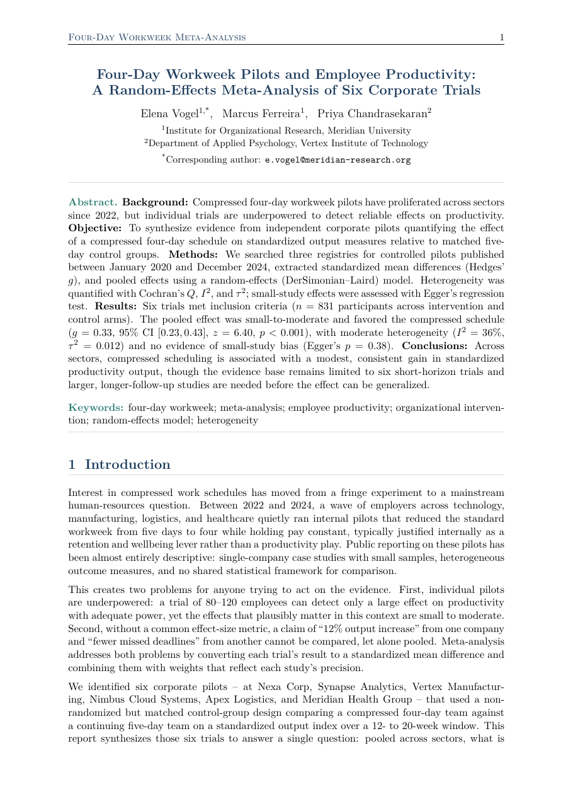</a><br><b>Meta-Analysis Report</b><br><a href="https://letx.app/templates/journal-articles/meta-analysis-report">Open in LetX</a> · <a href="./journal-articles/meta-analysis-report">Source</a></td>
<td width="33%" valign="top" align="center"><a href="https://letx.app/templates/journal-articles/mnras-paper"></a><br><b>MNRAS Journal Paper</b><br><a href="https://letx.app/templates/journal-articles/mnras-paper">Open in LetX</a> · <a href="./journal-articles/mnras-paper">Source</a></td>
<td width="33%" valign="top" align="center"><a href="https://letx.app/templates/journal-articles/neurips-stylized-paper"></a><br><b>NeurIPS Paper (Stylized)</b><br><a href="https://letx.app/templates/journal-articles/neurips-stylized-paper">Open in LetX</a> · <a href="./journal-articles/neurips-stylized-paper">Source</a></td>
</tr>
<tr>
<td width="33%" valign="top" align="center"><a href="https://letx.app/templates/journal-articles/oxford-bioinformatics-journal-template">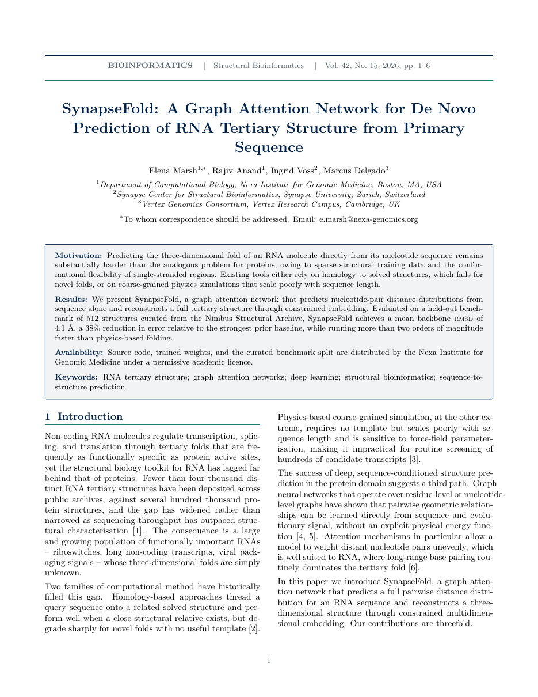</a><br><b>Oxford Bioinformatics Journal Template</b><br><a href="https://letx.app/templates/journal-articles/oxford-bioinformatics-journal-template">Open in LetX</a> · <a href="./journal-articles/oxford-bioinformatics-journal-template">Source</a></td>
<td width="33%" valign="top" align="center"><a href="https://letx.app/templates/journal-articles/plos-computational-biology-template"></a><br><b>PLOS Computational Biology Template</b><br><a href="https://letx.app/templates/journal-articles/plos-computational-biology-template">Open in LetX</a> · <a href="./journal-articles/plos-computational-biology-template">Source</a></td>
<td width="33%" valign="top" align="center"><a href="https://letx.app/templates/journal-articles/plos-one-research-article"></a><br><b>PLOS One Research Article</b><br><a href="https://letx.app/templates/journal-articles/plos-one-research-article">Open in LetX</a> · <a href="./journal-articles/plos-one-research-article">Source</a></td>
</tr>
<tr>
<td width="33%" valign="top" align="center"><a href="https://letx.app/templates/journal-articles/prisma-systematic-review"></a><br><b>PRISMA Systematic Review</b><br><a href="https://letx.app/templates/journal-articles/prisma-systematic-review">Open in LetX</a> · <a href="./journal-articles/prisma-systematic-review">Source</a></td>
<td width="33%" valign="top" align="center"><a href="https://letx.app/templates/journal-articles/registered-report-stage-one">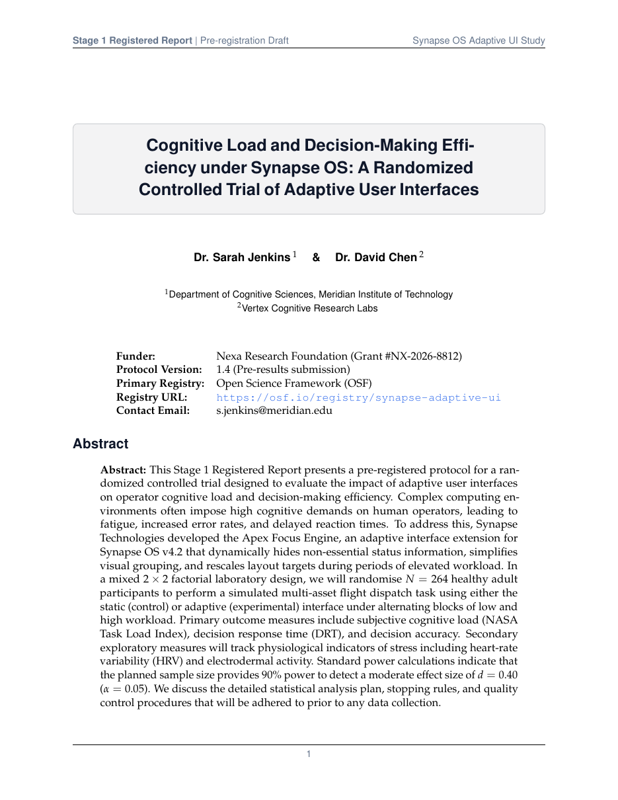</a><br><b>Registered Report (Stage 1)</b><br><a href="https://letx.app/templates/journal-articles/registered-report-stage-one">Open in LetX</a> · <a href="./journal-articles/registered-report-stage-one">Source</a></td>
<td width="33%" valign="top" align="center"><a href="https://letx.app/templates/journal-articles/replication-study-report">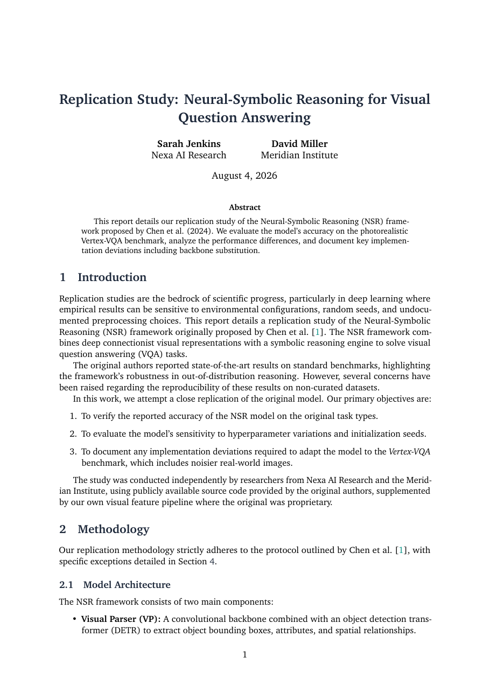</a><br><b>Replication Study Report</b><br><a href="https://letx.app/templates/journal-articles/replication-study-report">Open in LetX</a> · <a href="./journal-articles/replication-study-report">Source</a></td>
</tr>
<tr>
<td width="33%" valign="top" align="center"><a href="https://letx.app/templates/journal-articles/response-to-reviewers"></a><br><b>Response to Reviewers</b><br><a href="https://letx.app/templates/journal-articles/response-to-reviewers">Open in LetX</a> · <a href="./journal-articles/response-to-reviewers">Source</a></td>
<td width="33%" valign="top" align="center"><a href="https://letx.app/templates/journal-articles/revtex-aps-paper"></a><br><b>REVTeX 4.2 Physics Paper</b><br><a href="https://letx.app/templates/journal-articles/revtex-aps-paper">Open in LetX</a> · <a href="./journal-articles/revtex-aps-paper">Source</a></td>
<td width="33%" valign="top" align="center"><a href="https://letx.app/templates/journal-articles/rsc-physical-chemistry-chemical-physics-template"></a><br><b>RSC Physical Chemistry Chemical Physics (PCCP) Template</b><br><a href="https://letx.app/templates/journal-articles/rsc-physical-chemistry-chemical-physics-template">Open in LetX</a> · <a href="./journal-articles/rsc-physical-chemistry-chemical-physics-template">Source</a></td>
</tr>
<tr>
<td width="33%" valign="top" align="center"><a href="https://letx.app/templates/journal-articles/scoping-review-protocol"></a><br><b>Scoping Review Protocol</b><br><a href="https://letx.app/templates/journal-articles/scoping-review-protocol">Open in LetX</a> · <a href="./journal-articles/scoping-review-protocol">Source</a></td>
<td width="33%" valign="top" align="center"><a href="https://letx.app/templates/journal-articles/short-communication-manuscript"></a><br><b>Short Communication Manuscript</b><br><a href="https://letx.app/templates/journal-articles/short-communication-manuscript">Open in LetX</a> · <a href="./journal-articles/short-communication-manuscript">Source</a></td>
<td width="33%" valign="top" align="center"><a href="https://letx.app/templates/journal-articles/springer-nature-scientific-reports-template">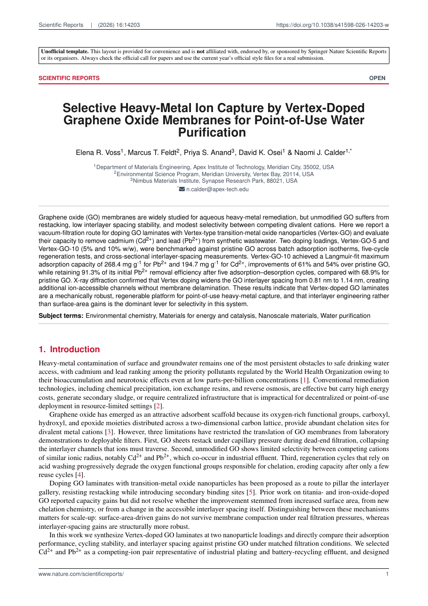</a><br><b>Springer Nature Scientific Reports Template</b><br><a href="https://letx.app/templates/journal-articles/springer-nature-scientific-reports-template">Open in LetX</a> · <a href="./journal-articles/springer-nature-scientific-reports-template">Source</a></td>
</tr>
<tr>
<td width="33%" valign="top" align="center"><a href="https://letx.app/templates/journal-articles/systematic-review-manuscript"></a><br><b>Systematic Review Manuscript</b><br><a href="https://letx.app/templates/journal-articles/systematic-review-manuscript">Open in LetX</a> · <a href="./journal-articles/systematic-review-manuscript">Source</a></td>
<td width="33%" valign="top" align="center"><a href="https://letx.app/templates/journal-articles/taylor-francis-journal-article-template"></a><br><b>Taylor & Francis Journal Article Template</b><br><a href="https://letx.app/templates/journal-articles/taylor-francis-journal-article-template">Open in LetX</a> · <a href="./journal-articles/taylor-francis-journal-article-template">Source</a></td>
<td width="33%" valign="top" align="center"><a href="https://letx.app/templates/journal-articles/wiley-ecology-letters-template">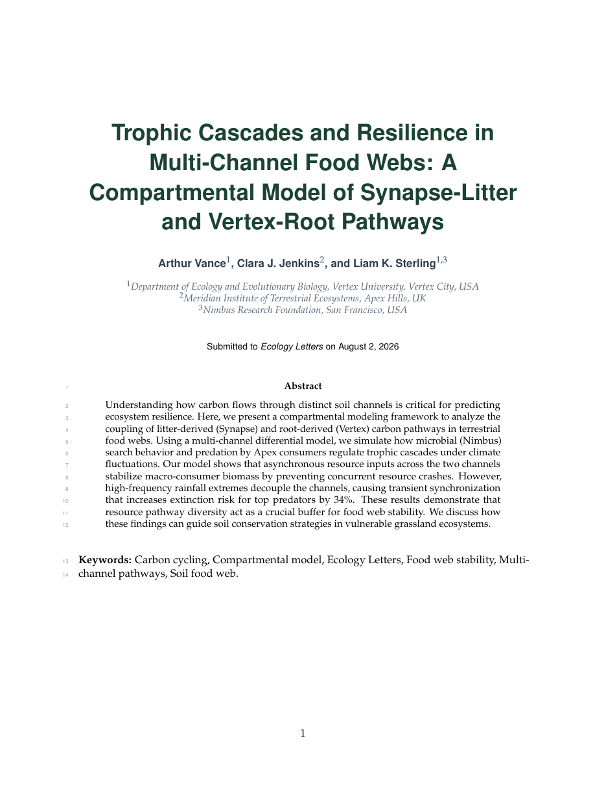</a><br><b>Wiley Ecology Letters Template</b><br><a href="https://letx.app/templates/journal-articles/wiley-ecology-letters-template">Open in LetX</a> · <a href="./journal-articles/wiley-ecology-letters-template">Source</a></td>
</tr>
</table>

### Conference Papers & Abstracts

68 templates. [Browse this category on LetX](https://letx.app/templates/conferences)

<table>
<tr>
<td width="33%" valign="top" align="center"><a href="https://letx.app/templates/conferences/aaai-2026-submission-paper"></a><br><b>AAAI 2026 Submission Paper</b><br><a href="https://letx.app/templates/conferences/aaai-2026-submission-paper">Open in LetX</a> · <a href="./conferences/aaai-2026-submission-paper">Source</a></td>
<td width="33%" valign="top" align="center"><a href="https://letx.app/templates/conferences/acl-2026-submission-paper">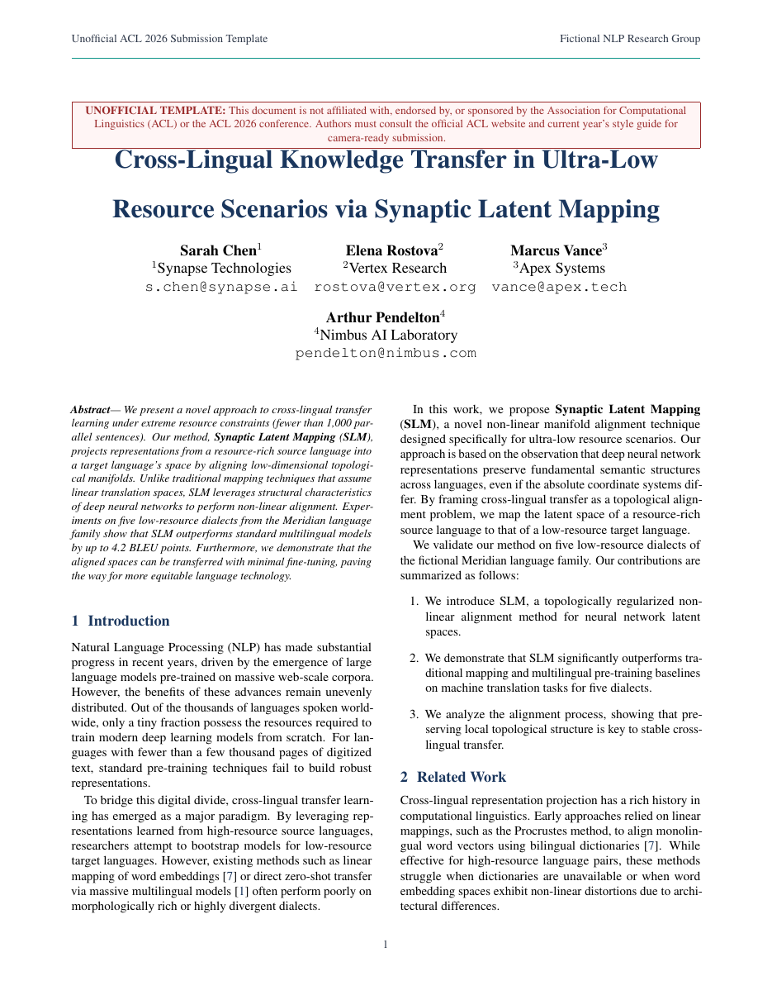</a><br><b>ACL 2026 Submission Paper</b><br><a href="https://letx.app/templates/conferences/acl-2026-submission-paper">Open in LetX</a> · <a href="./conferences/acl-2026-submission-paper">Source</a></td>
<td width="33%" valign="top" align="center"><a href="https://letx.app/templates/conferences/acl-workshop-short-paper">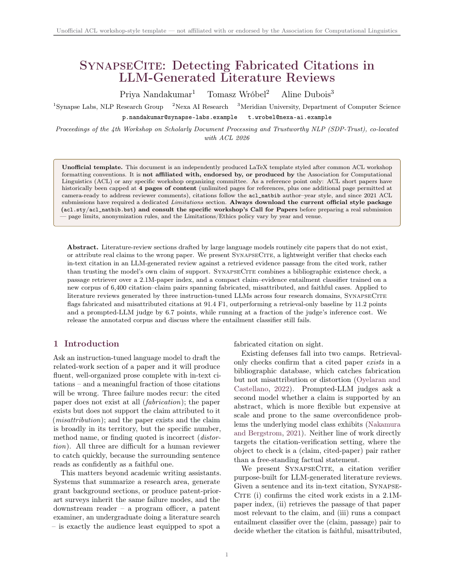</a><br><b>ACL Workshop Short Paper</b><br><a href="https://letx.app/templates/conferences/acl-workshop-short-paper">Open in LetX</a> · <a href="./conferences/acl-workshop-short-paper">Source</a></td>
</tr>
<tr>
<td width="33%" valign="top" align="center"><a href="https://letx.app/templates/conferences/acm-ccs-submission-template">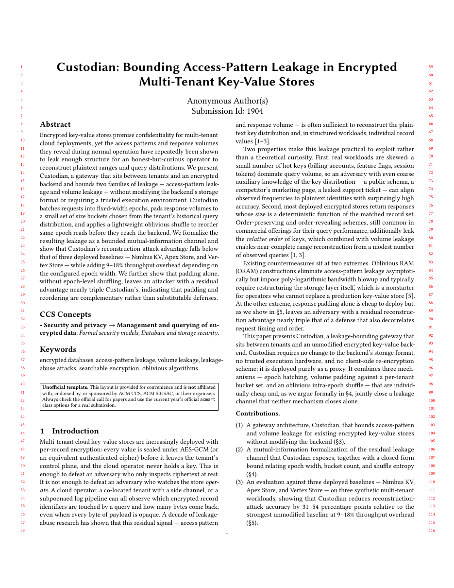</a><br><b>ACM CCS Submission Template</b><br><a href="https://letx.app/templates/conferences/acm-ccs-submission-template">Open in LetX</a> · <a href="./conferences/acm-ccs-submission-template">Source</a></td>
<td width="33%" valign="top" align="center"><a href="https://letx.app/templates/conferences/aiaa-conference-paper"></a><br><b>AIAA Conference Paper</b><br><a href="https://letx.app/templates/conferences/aiaa-conference-paper">Open in LetX</a> · <a href="./conferences/aiaa-conference-paper">Source</a></td>
<td width="33%" valign="top" align="center"><a href="https://letx.app/templates/conferences/aistats-submission-paper"></a><br><b>AISTATS Submission Paper</b><br><a href="https://letx.app/templates/conferences/aistats-submission-paper">Open in LetX</a> · <a href="./conferences/aistats-submission-paper">Source</a></td>
</tr>
<tr>
<td width="33%" valign="top" align="center"><a href="https://letx.app/templates/conferences/ase-technical-paper"></a><br><b>ASE Technical Paper</b><br><a href="https://letx.app/templates/conferences/ase-technical-paper">Open in LetX</a> · <a href="./conferences/ase-technical-paper">Source</a></td>
<td width="33%" valign="top" align="center"><a href="https://letx.app/templates/conferences/asiacrypt-iacr-submission-template">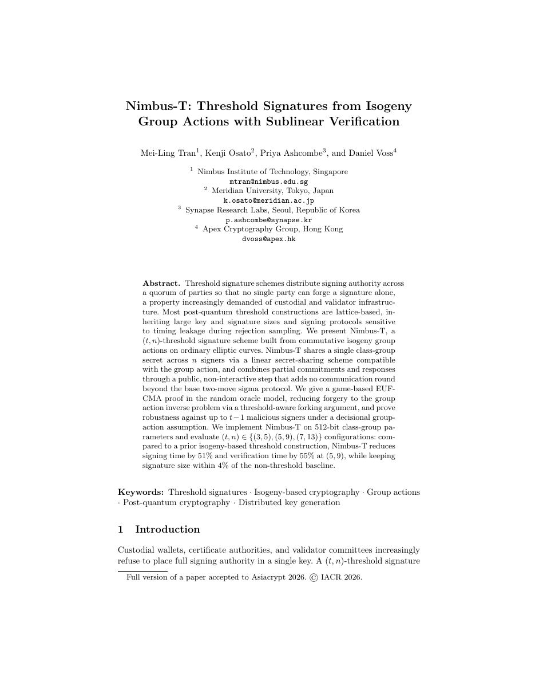</a><br><b>Asiacrypt / IACR Submission Template</b><br><a href="https://letx.app/templates/conferences/asiacrypt-iacr-submission-template">Open in LetX</a> · <a href="./conferences/asiacrypt-iacr-submission-template">Source</a></td>
<td width="33%" valign="top" align="center"><a href="https://letx.app/templates/conferences/asplos-research-paper"></a><br><b>ASPLOS Research Paper</b><br><a href="https://letx.app/templates/conferences/asplos-research-paper">Open in LetX</a> · <a href="./conferences/asplos-research-paper">Source</a></td>
</tr>
<tr>
<td width="33%" valign="top" align="center"><a href="https://letx.app/templates/conferences/physics-colloquium-talk"></a><br><b>Astrophysics Beamer Talk</b><br><a href="https://letx.app/templates/conferences/physics-colloquium-talk">Open in LetX</a> · <a href="./conferences/physics-colloquium-talk">Source</a></td>
<td width="33%" valign="top" align="center"><a href="https://letx.app/templates/conferences/bmvc-submission-paper"></a><br><b>BMVC Submission Paper</b><br><a href="https://letx.app/templates/conferences/bmvc-submission-paper">Open in LetX</a> · <a href="./conferences/bmvc-submission-paper">Source</a></td>
<td width="33%" valign="top" align="center"><a href="https://letx.app/templates/conferences/chi-submission-paper"></a><br><b>CHI Submission Paper</b><br><a href="https://letx.app/templates/conferences/chi-submission-paper">Open in LetX</a> · <a href="./conferences/chi-submission-paper">Source</a></td>
</tr>
<tr>
<td width="33%" valign="top" align="center"><a href="https://letx.app/templates/conferences/cikm-submission-paper">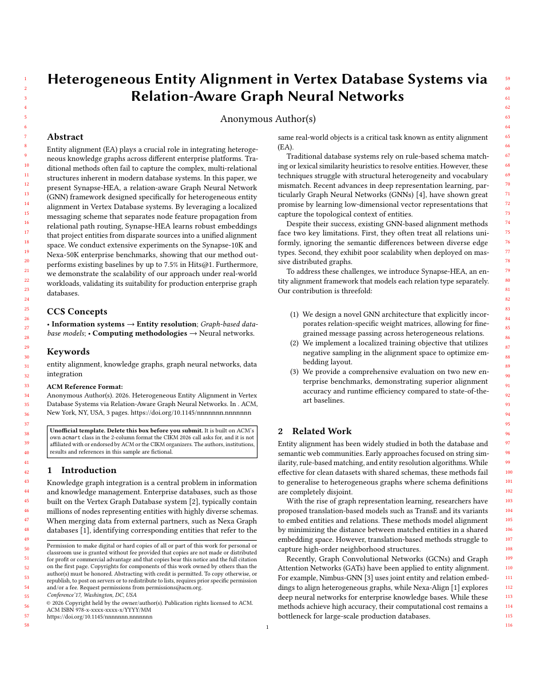</a><br><b>CIKM Submission Paper</b><br><a href="https://letx.app/templates/conferences/cikm-submission-paper">Open in LetX</a> · <a href="./conferences/cikm-submission-paper">Source</a></td>
<td width="33%" valign="top" align="center"><a href="https://letx.app/templates/conferences/coling-submission-paper">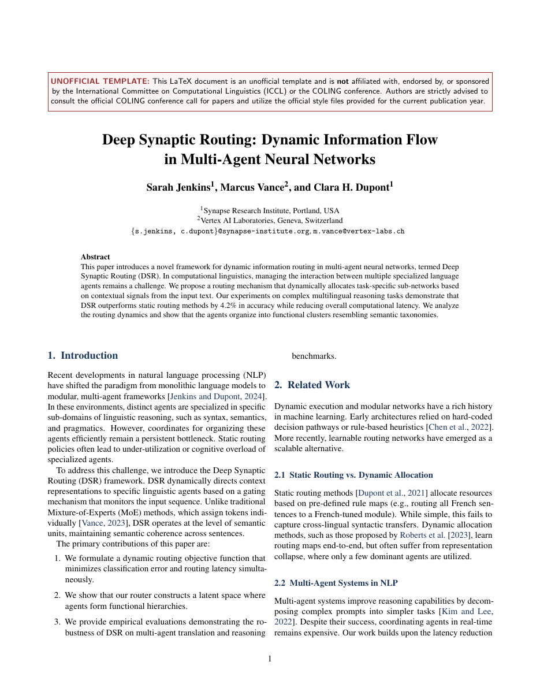</a><br><b>COLING Submission Paper</b><br><a href="https://letx.app/templates/conferences/coling-submission-paper">Open in LetX</a> · <a href="./conferences/coling-submission-paper">Source</a></td>
<td width="33%" valign="top" align="center"><a href="https://letx.app/templates/conferences/colm-submission-paper">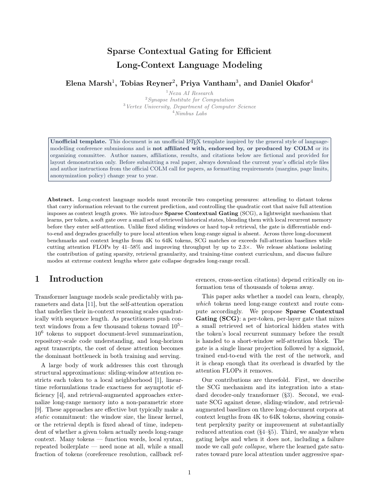</a><br><b>COLM Submission Paper</b><br><a href="https://letx.app/templates/conferences/colm-submission-paper">Open in LetX</a> · <a href="./conferences/colm-submission-paper">Source</a></td>
</tr>
<tr>
<td width="33%" valign="top" align="center"><a href="https://letx.app/templates/conferences/conference-abstract"></a><br><b>Conference Abstract</b><br><a href="https://letx.app/templates/conferences/conference-abstract">Open in LetX</a> · <a href="./conferences/conference-abstract">Source</a></td>
<td width="33%" valign="top" align="center"><a href="https://letx.app/templates/conferences/crypto-iacr-submission-template"></a><br><b>Crypto / IACR Submission Template</b><br><a href="https://letx.app/templates/conferences/crypto-iacr-submission-template">Open in LetX</a> · <a href="./conferences/crypto-iacr-submission-template">Source</a></td>
<td width="33%" valign="top" align="center"><a href="https://letx.app/templates/conferences/cvpr-workshop-camera-ready-template"></a><br><b>CVPR Workshop Camera-Ready Template</b><br><a href="https://letx.app/templates/conferences/cvpr-workshop-camera-ready-template">Open in LetX</a> · <a href="./conferences/cvpr-workshop-camera-ready-template">Source</a></td>
</tr>
<tr>
<td width="33%" valign="top" align="center"><a href="https://letx.app/templates/conferences/dac-design-automation-paper"></a><br><b>DAC Design Automation Paper</b><br><a href="https://letx.app/templates/conferences/dac-design-automation-paper">Open in LetX</a> · <a href="./conferences/dac-design-automation-paper">Source</a></td>
<td width="33%" valign="top" align="center"><a href="https://letx.app/templates/conferences/eccv-2026-submission-paper"></a><br><b>ECCV 2026 Submission Paper</b><br><a href="https://letx.app/templates/conferences/eccv-2026-submission-paper">Open in LetX</a> · <a href="./conferences/eccv-2026-submission-paper">Source</a></td>
<td width="33%" valign="top" align="center"><a href="https://letx.app/templates/conferences/emnlp-2026-submission-paper">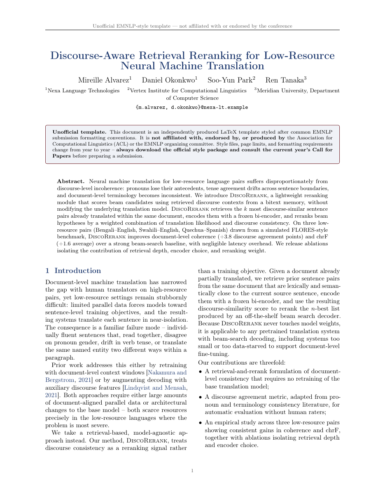</a><br><b>EMNLP 2026 Submission Paper</b><br><a href="https://letx.app/templates/conferences/emnlp-2026-submission-paper">Open in LetX</a> · <a href="./conferences/emnlp-2026-submission-paper">Source</a></td>
</tr>
<tr>
<td width="33%" valign="top" align="center"><a href="https://letx.app/templates/conferences/emnlp-workshop-research-paper"></a><br><b>EMNLP Workshop Research Paper</b><br><a href="https://letx.app/templates/conferences/emnlp-workshop-research-paper">Open in LetX</a> · <a href="./conferences/emnlp-workshop-research-paper">Source</a></td>
<td width="33%" valign="top" align="center"><a href="https://letx.app/templates/conferences/eurocrypt-iacr-cryptology-conference-paper"></a><br><b>Eurocrypt / IACR Cryptology Conference Paper</b><br><a href="https://letx.app/templates/conferences/eurocrypt-iacr-cryptology-conference-paper">Open in LetX</a> · <a href="./conferences/eurocrypt-iacr-cryptology-conference-paper">Source</a></td>
<td width="33%" valign="top" align="center"><a href="https://letx.app/templates/conferences/extended-abstract"></a><br><b>Extended Abstract</b><br><a href="https://letx.app/templates/conferences/extended-abstract">Open in LetX</a> · <a href="./conferences/extended-abstract">Source</a></td>
</tr>
<tr>
<td width="33%" valign="top" align="center"><a href="https://letx.app/templates/conferences/fse-research-paper"></a><br><b>FSE Research Paper</b><br><a href="https://letx.app/templates/conferences/fse-research-paper">Open in LetX</a> · <a href="./conferences/fse-research-paper">Source</a></td>
<td width="33%" valign="top" align="center"><a href="https://letx.app/templates/conferences/hpca-architecture-paper"></a><br><b>HPCA Architecture Paper</b><br><a href="https://letx.app/templates/conferences/hpca-architecture-paper">Open in LetX</a> · <a href="./conferences/hpca-architecture-paper">Source</a></td>
<td width="33%" valign="top" align="center"><a href="https://letx.app/templates/conferences/icassp-submission-paper">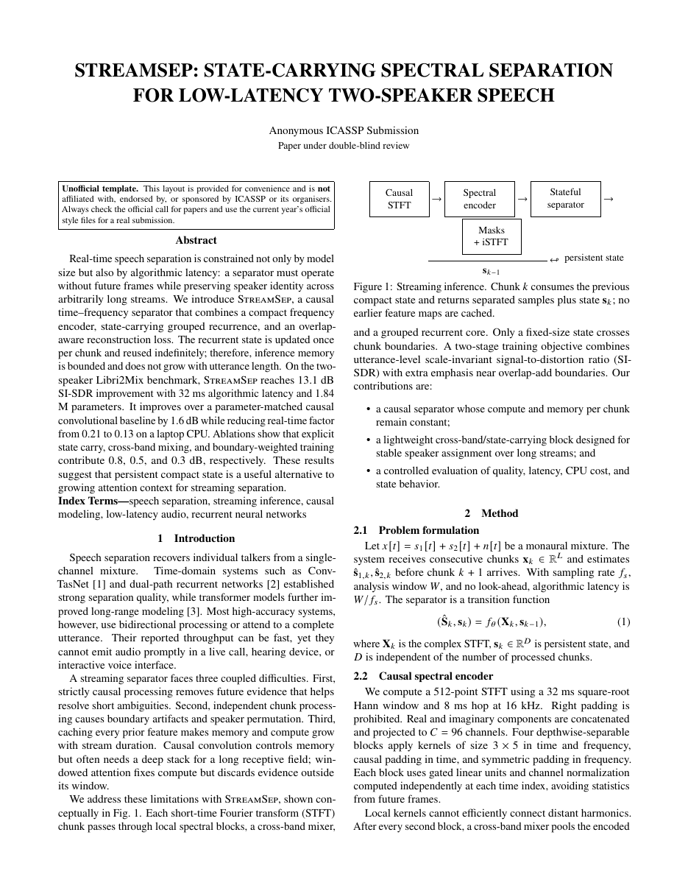</a><br><b>ICASSP Submission Paper</b><br><a href="https://letx.app/templates/conferences/icassp-submission-paper">Open in LetX</a> · <a href="./conferences/icassp-submission-paper">Source</a></td>
</tr>
<tr>
<td width="33%" valign="top" align="center"><a href="https://letx.app/templates/conferences/iccv-2026-submission-paper">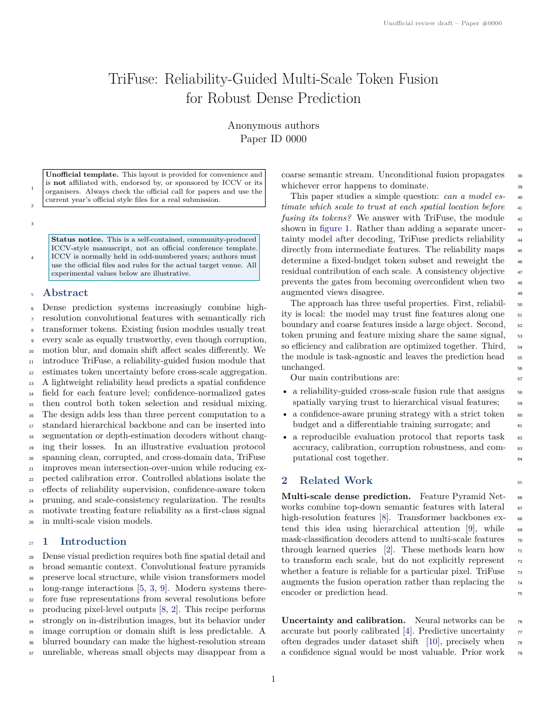</a><br><b>ICCV 2026 Submission Paper</b><br><a href="https://letx.app/templates/conferences/iccv-2026-submission-paper">Open in LetX</a> · <a href="./conferences/iccv-2026-submission-paper">Source</a></td>
<td width="33%" valign="top" align="center"><a href="https://letx.app/templates/conferences/iclr-2026-submission-paper">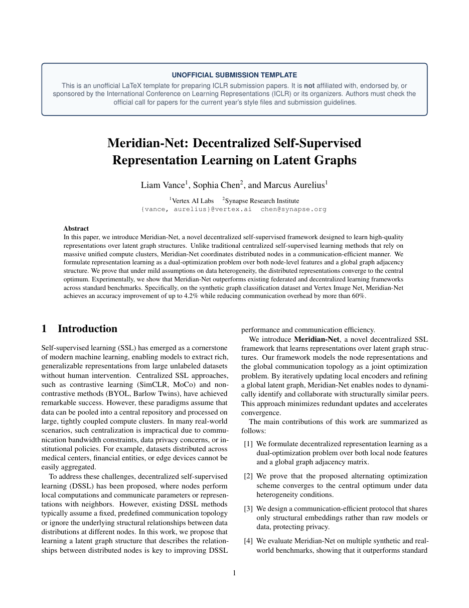</a><br><b>ICLR 2026 Submission Paper</b><br><a href="https://letx.app/templates/conferences/iclr-2026-submission-paper">Open in LetX</a> · <a href="./conferences/iclr-2026-submission-paper">Source</a></td>
<td width="33%" valign="top" align="center"><a href="https://letx.app/templates/conferences/iclr-workshop-poster-abstract">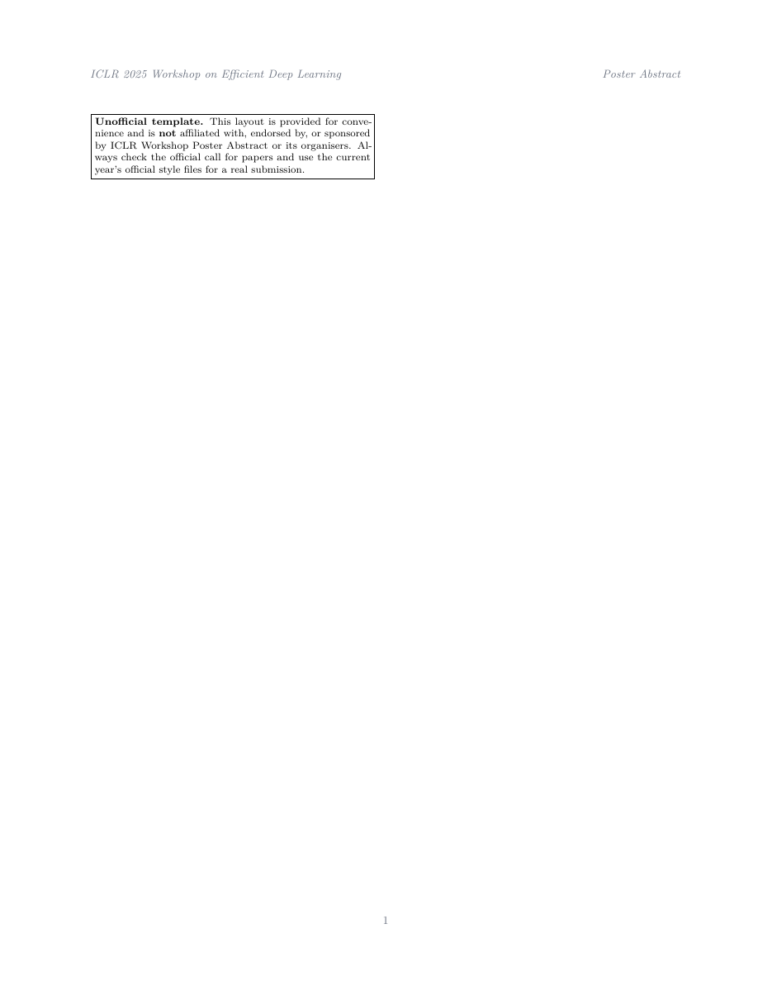</a><br><b>ICLR Workshop Poster Abstract</b><br><a href="https://letx.app/templates/conferences/iclr-workshop-poster-abstract">Open in LetX</a> · <a href="./conferences/iclr-workshop-poster-abstract">Source</a></td>
</tr>
<tr>
<td width="33%" valign="top" align="center"><a href="https://letx.app/templates/conferences/icml-workshop-submission-template"></a><br><b>ICML Workshop Submission Template</b><br><a href="https://letx.app/templates/conferences/icml-workshop-submission-template">Open in LetX</a> · <a href="./conferences/icml-workshop-submission-template">Source</a></td>
<td width="33%" valign="top" align="center"><a href="https://letx.app/templates/conferences/icra-submission-paper"></a><br><b>ICRA Submission Paper</b><br><a href="https://letx.app/templates/conferences/icra-submission-paper">Open in LetX</a> · <a href="./conferences/icra-submission-paper">Source</a></td>
<td width="33%" valign="top" align="center"><a href="https://letx.app/templates/conferences/icse-technical-paper"></a><br><b>ICSE Technical Paper</b><br><a href="https://letx.app/templates/conferences/icse-technical-paper">Open in LetX</a> · <a href="./conferences/icse-technical-paper">Source</a></td>
</tr>
<tr>
<td width="33%" valign="top" align="center"><a href="https://letx.app/templates/conferences/ieee-s-p-submission-template"></a><br><b>IEEE S&P (Oakland) Submission Template</b><br><a href="https://letx.app/templates/conferences/ieee-s-p-submission-template">Open in LetX</a> · <a href="./conferences/ieee-s-p-submission-template">Source</a></td>
<td width="33%" valign="top" align="center"><a href="https://letx.app/templates/conferences/ijcai-2026-submission-paper">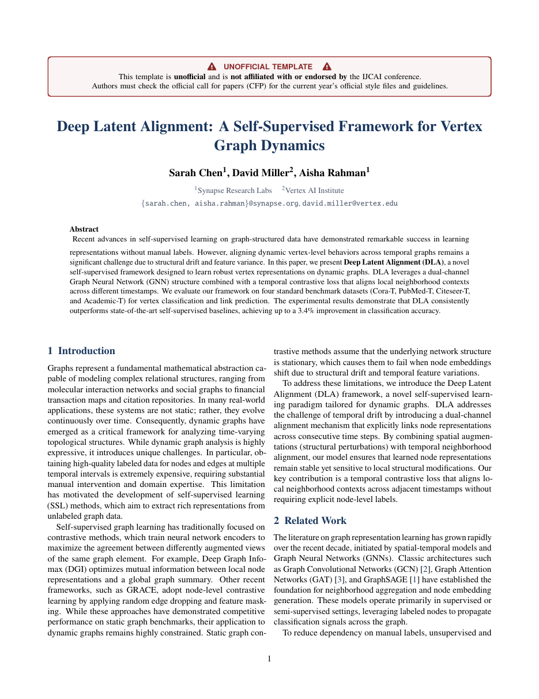</a><br><b>IJCAI 2026 Submission Paper</b><br><a href="https://letx.app/templates/conferences/ijcai-2026-submission-paper">Open in LetX</a> · <a href="./conferences/ijcai-2026-submission-paper">Source</a></td>
<td width="33%" valign="top" align="center"><a href="https://letx.app/templates/conferences/internet-measurement-conference-paper"></a><br><b>Internet Measurement Conference Paper</b><br><a href="https://letx.app/templates/conferences/internet-measurement-conference-paper">Open in LetX</a> · <a href="./conferences/internet-measurement-conference-paper">Source</a></td>
</tr>
<tr>
<td width="33%" valign="top" align="center"><a href="https://letx.app/templates/conferences/interspeech-submission-paper">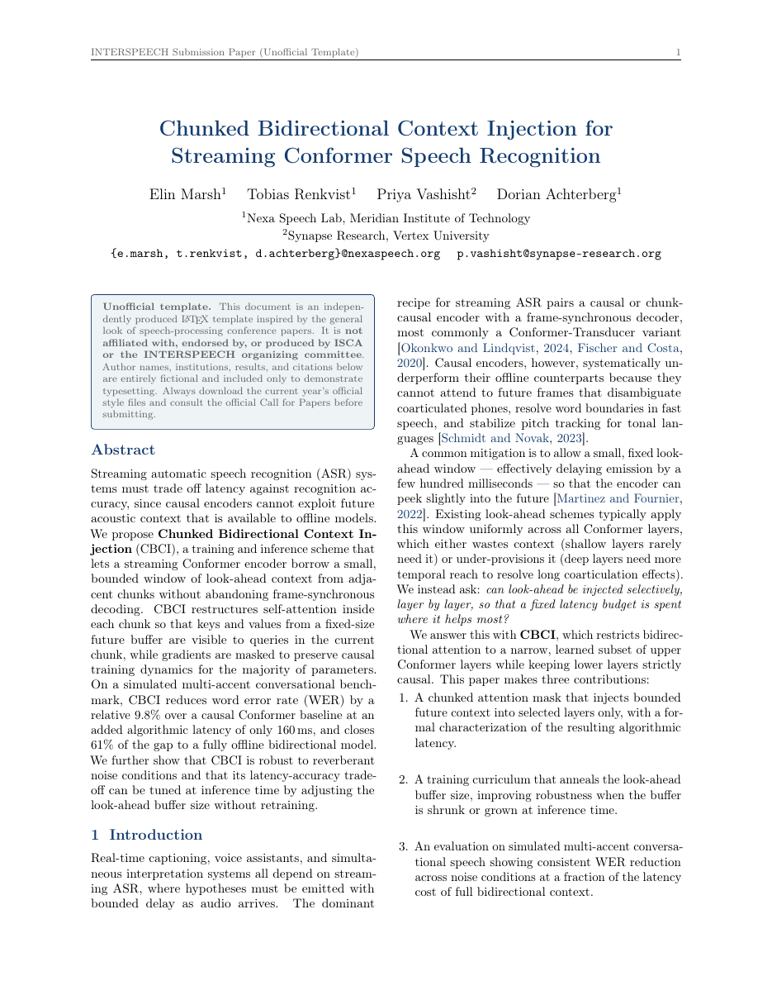</a><br><b>INTERSPEECH Submission Paper</b><br><a href="https://letx.app/templates/conferences/interspeech-submission-paper">Open in LetX</a> · <a href="./conferences/interspeech-submission-paper">Source</a></td>
<td width="33%" valign="top" align="center"><a href="https://letx.app/templates/conferences/iros-submission-paper"></a><br><b>IROS Submission Paper</b><br><a href="https://letx.app/templates/conferences/iros-submission-paper">Open in LetX</a> · <a href="./conferences/iros-submission-paper">Source</a></td>
<td width="33%" valign="top" align="center"><a href="https://letx.app/templates/conferences/isca-architecture-paper">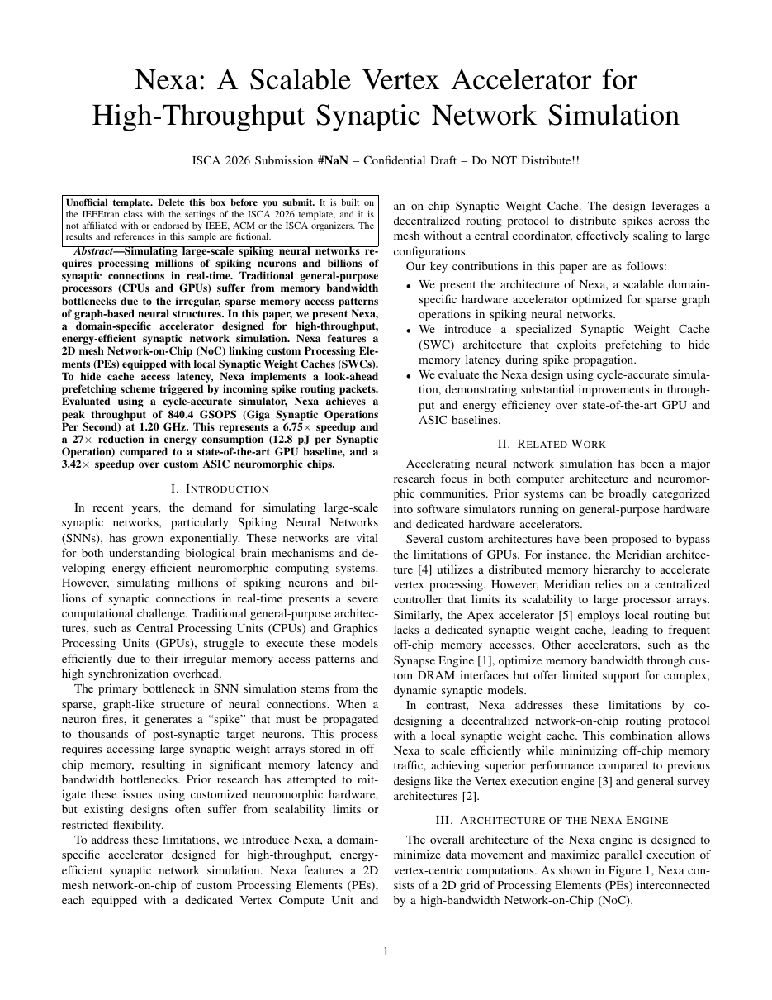</a><br><b>ISCA Architecture Paper</b><br><a href="https://letx.app/templates/conferences/isca-architecture-paper">Open in LetX</a> · <a href="./conferences/isca-architecture-paper">Source</a></td>
</tr>
<tr>
<td width="33%" valign="top" align="center"><a href="https://letx.app/templates/conferences/kdd-research-track-paper">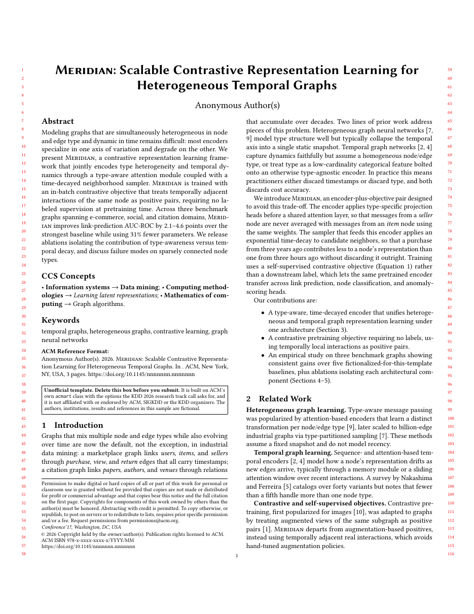</a><br><b>KDD Research Track Paper</b><br><a href="https://letx.app/templates/conferences/kdd-research-track-paper">Open in LetX</a> · <a href="./conferences/kdd-research-track-paper">Source</a></td>
<td width="33%" valign="top" align="center"><a href="https://letx.app/templates/conferences/miccai-submission-paper"></a><br><b>MICCAI Submission Paper</b><br><a href="https://letx.app/templates/conferences/miccai-submission-paper">Open in LetX</a> · <a href="./conferences/miccai-submission-paper">Source</a></td>
<td width="33%" valign="top" align="center"><a href="https://letx.app/templates/conferences/micro-architecture-paper">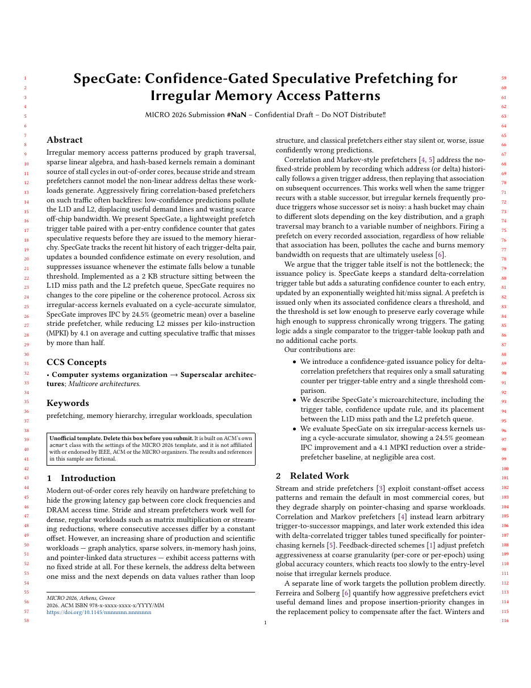</a><br><b>MICRO Architecture Paper</b><br><a href="https://letx.app/templates/conferences/micro-architecture-paper">Open in LetX</a> · <a href="./conferences/micro-architecture-paper">Source</a></td>
</tr>
<tr>
<td width="33%" valign="top" align="center"><a href="https://letx.app/templates/conferences/mobicom-research-paper"></a><br><b>MobiCom Research Paper</b><br><a href="https://letx.app/templates/conferences/mobicom-research-paper">Open in LetX</a> · <a href="./conferences/mobicom-research-paper">Source</a></td>
<td width="33%" valign="top" align="center"><a href="https://letx.app/templates/conferences/naacl-2026-submission-paper"></a><br><b>NAACL 2026 Submission Paper</b><br><a href="https://letx.app/templates/conferences/naacl-2026-submission-paper">Open in LetX</a> · <a href="./conferences/naacl-2026-submission-paper">Source</a></td>
<td width="33%" valign="top" align="center"><a href="https://letx.app/templates/conferences/ndss-symposium-submission-template"></a><br><b>NDSS Symposium Submission Template</b><br><a href="https://letx.app/templates/conferences/ndss-symposium-submission-template">Open in LetX</a> · <a href="./conferences/ndss-symposium-submission-template">Source</a></td>
</tr>
<tr>
<td width="33%" valign="top" align="center"><a href="https://letx.app/templates/conferences/neurips-workshop-extended-abstract">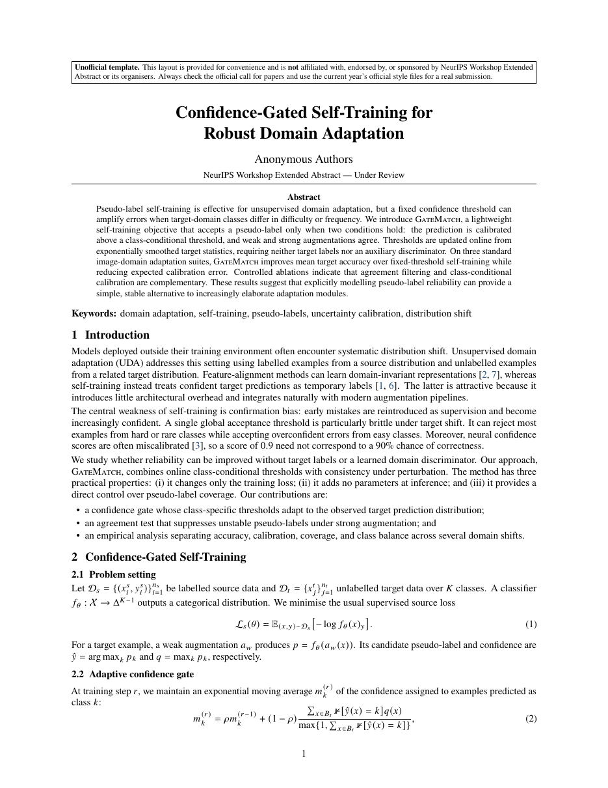</a><br><b>NeurIPS Workshop Extended Abstract</b><br><a href="https://letx.app/templates/conferences/neurips-workshop-extended-abstract">Open in LetX</a> · <a href="./conferences/neurips-workshop-extended-abstract">Source</a></td>
<td width="33%" valign="top" align="center"><a href="https://letx.app/templates/conferences/nsdi-technical-paper"></a><br><b>NSDI Technical Paper</b><br><a href="https://letx.app/templates/conferences/nsdi-technical-paper">Open in LetX</a> · <a href="./conferences/nsdi-technical-paper">Source</a></td>
<td width="33%" valign="top" align="center"><a href="https://letx.app/templates/conferences/oopsla-research-paper">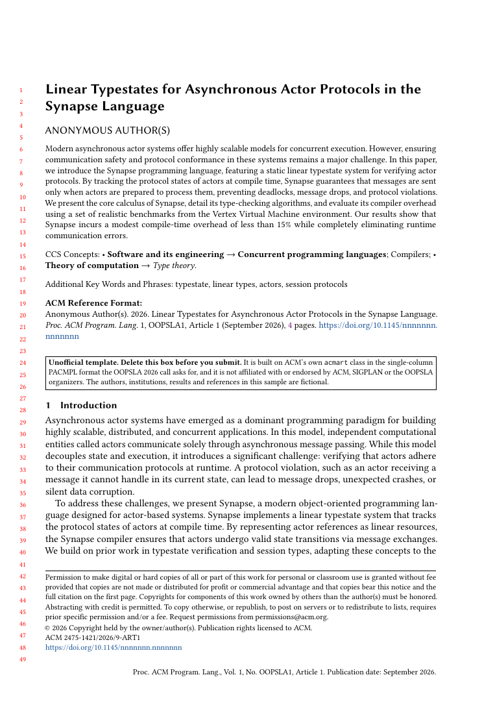</a><br><b>OOPSLA Research Paper</b><br><a href="https://letx.app/templates/conferences/oopsla-research-paper">Open in LetX</a> · <a href="./conferences/oopsla-research-paper">Source</a></td>
</tr>
<tr>
<td width="33%" valign="top" align="center"><a href="https://letx.app/templates/conferences/osdi-technical-paper">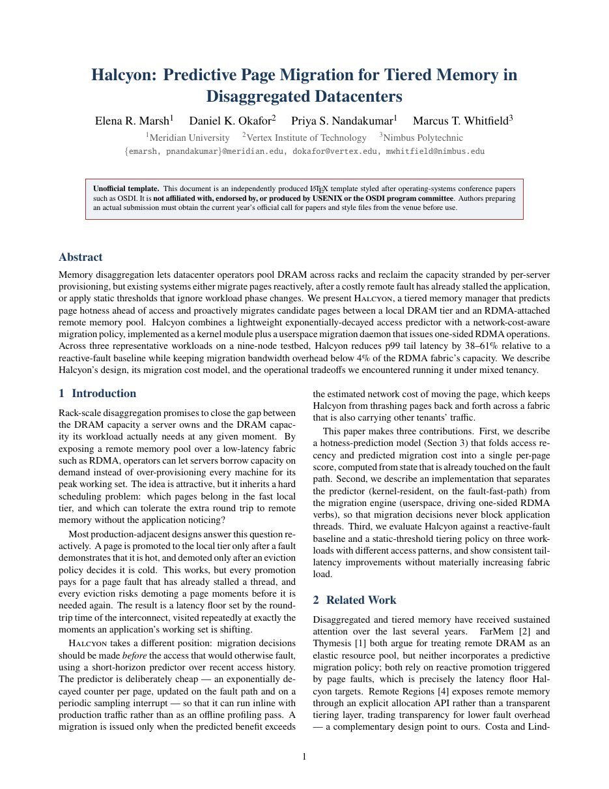</a><br><b>OSDI Technical Paper</b><br><a href="https://letx.app/templates/conferences/osdi-technical-paper">Open in LetX</a> · <a href="./conferences/osdi-technical-paper">Source</a></td>
<td width="33%" valign="top" align="center"><a href="https://letx.app/templates/conferences/pldi-research-paper">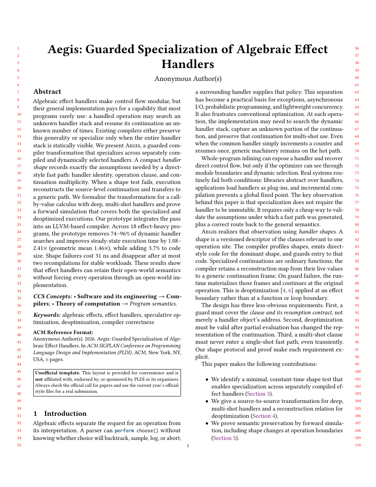</a><br><b>PLDI Research Paper</b><br><a href="https://letx.app/templates/conferences/pldi-research-paper">Open in LetX</a> · <a href="./conferences/pldi-research-paper">Source</a></td>
<td width="33%" valign="top" align="center"><a href="https://letx.app/templates/conferences/popl-research-paper">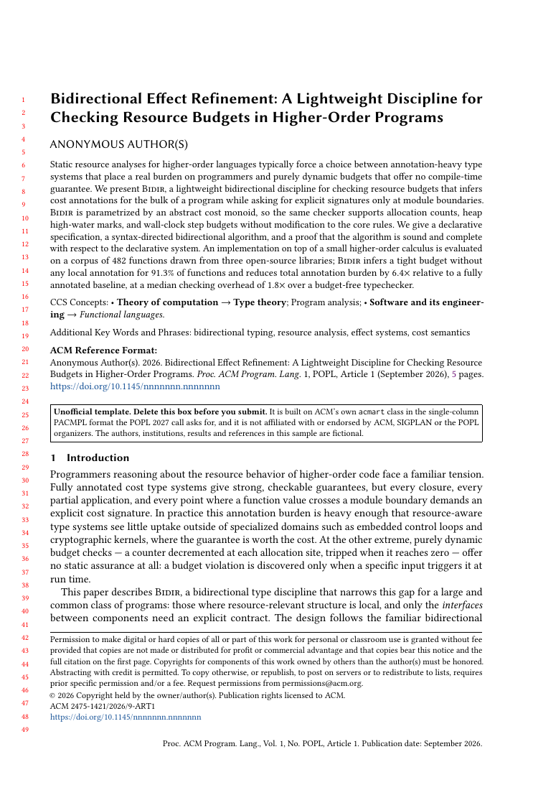</a><br><b>POPL Research Paper</b><br><a href="https://letx.app/templates/conferences/popl-research-paper">Open in LetX</a> · <a href="./conferences/popl-research-paper">Source</a></td>
</tr>
<tr>
<td width="33%" valign="top" align="center"><a href="https://letx.app/templates/conferences/recsys-submission-paper"></a><br><b>RecSys Submission Paper</b><br><a href="https://letx.app/templates/conferences/recsys-submission-paper">Open in LetX</a> · <a href="./conferences/recsys-submission-paper">Source</a></td>
<td width="33%" valign="top" align="center"><a href="https://letx.app/templates/conferences/robotics-science-and-systems-paper"></a><br><b>Robotics Science and Systems Paper</b><br><a href="https://letx.app/templates/conferences/robotics-science-and-systems-paper">Open in LetX</a> · <a href="./conferences/robotics-science-and-systems-paper">Source</a></td>
<td width="33%" valign="top" align="center"><a href="https://letx.app/templates/conferences/sensys-research-paper">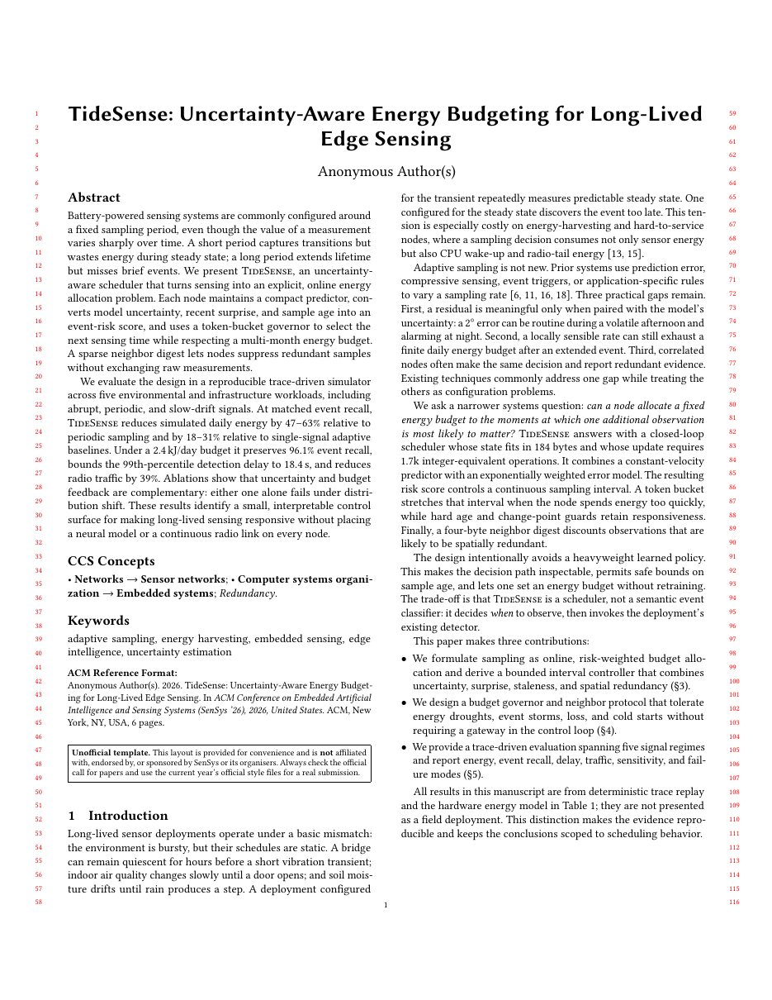</a><br><b>SenSys Research Paper</b><br><a href="https://letx.app/templates/conferences/sensys-research-paper">Open in LetX</a> · <a href="./conferences/sensys-research-paper">Source</a></td>
</tr>
<tr>
<td width="33%" valign="top" align="center"><a href="https://letx.app/templates/conferences/siggraph-poster-abstract-template"></a><br><b>SIGGRAPH Poster Abstract Template</b><br><a href="https://letx.app/templates/conferences/siggraph-poster-abstract-template">Open in LetX</a> · <a href="./conferences/siggraph-poster-abstract-template">Source</a></td>
<td width="33%" valign="top" align="center"><a href="https://letx.app/templates/conferences/siggraph-technical-paper"></a><br><b>SIGGRAPH Technical Paper</b><br><a href="https://letx.app/templates/conferences/siggraph-technical-paper">Open in LetX</a> · <a href="./conferences/siggraph-technical-paper">Source</a></td>
<td width="33%" valign="top" align="center"><a href="https://letx.app/templates/conferences/sigir-submission-paper"></a><br><b>SIGIR Submission Paper</b><br><a href="https://letx.app/templates/conferences/sigir-submission-paper">Open in LetX</a> · <a href="./conferences/sigir-submission-paper">Source</a></td>
</tr>
<tr>
<td width="33%" valign="top" align="center"><a href="https://letx.app/templates/conferences/sigmod-research-paper">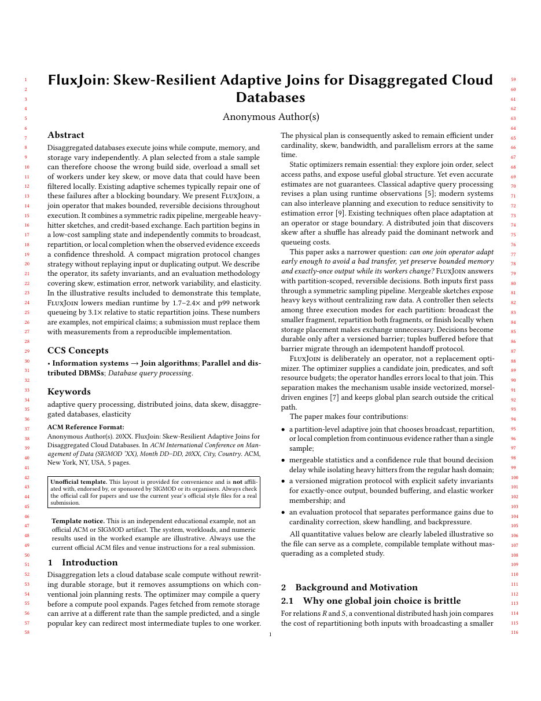</a><br><b>SIGMOD Research Paper</b><br><a href="https://letx.app/templates/conferences/sigmod-research-paper">Open in LetX</a> · <a href="./conferences/sigmod-research-paper">Source</a></td>
<td width="33%" valign="top" align="center"><a href="https://letx.app/templates/conferences/sosp-technical-paper"></a><br><b>SOSP Technical Paper</b><br><a href="https://letx.app/templates/conferences/sosp-technical-paper">Open in LetX</a> · <a href="./conferences/sosp-technical-paper">Source</a></td>
<td width="33%" valign="top" align="center"><a href="https://letx.app/templates/conferences/tcc-paper"></a><br><b>TCC (Theory of Cryptography Conference) Paper</b><br><a href="https://letx.app/templates/conferences/tcc-paper">Open in LetX</a> · <a href="./conferences/tcc-paper">Source</a></td>
</tr>
<tr>
<td width="33%" valign="top" align="center"><a href="https://letx.app/templates/conferences/uai-submission-paper">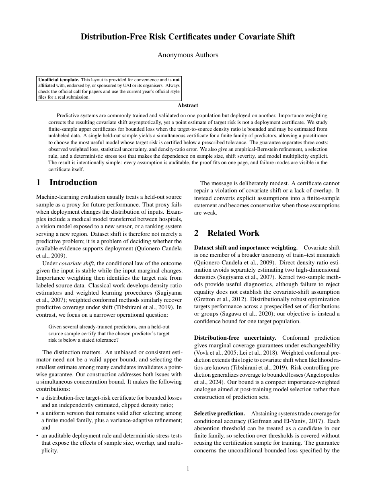</a><br><b>UAI Submission Paper</b><br><a href="https://letx.app/templates/conferences/uai-submission-paper">Open in LetX</a> · <a href="./conferences/uai-submission-paper">Source</a></td>
<td width="33%" valign="top" align="center"><a href="https://letx.app/templates/conferences/usenix-atc-paper">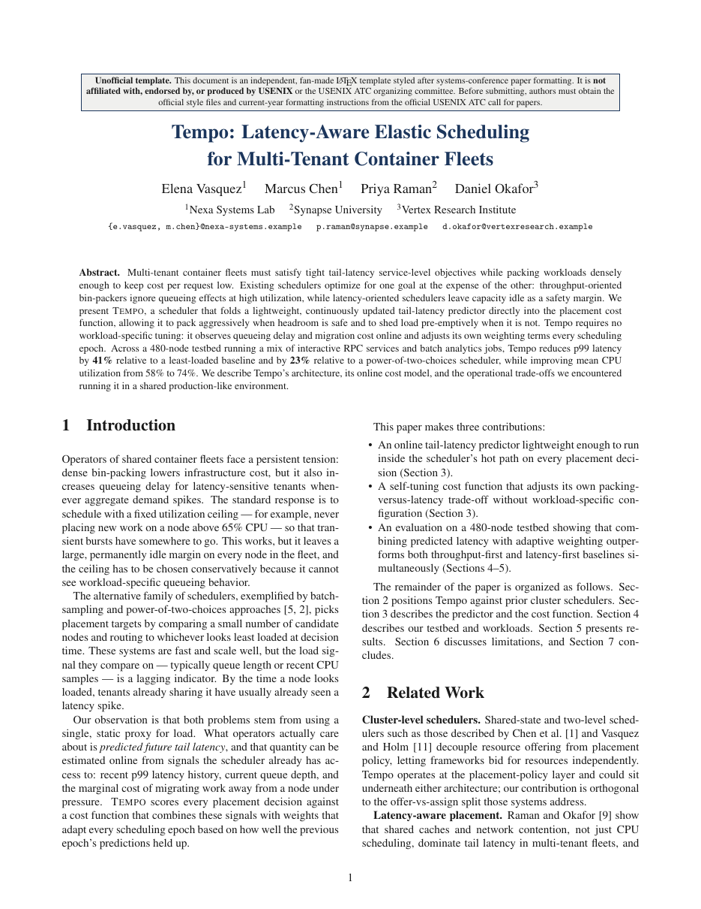</a><br><b>USENIX ATC Paper</b><br><a href="https://letx.app/templates/conferences/usenix-atc-paper">Open in LetX</a> · <a href="./conferences/usenix-atc-paper">Source</a></td>
<td width="33%" valign="top" align="center"><a href="https://letx.app/templates/conferences/usenix-security-paper"></a><br><b>USENIX Security Paper</b><br><a href="https://letx.app/templates/conferences/usenix-security-paper">Open in LetX</a> · <a href="./conferences/usenix-security-paper">Source</a></td>
</tr>
<tr>
<td width="33%" valign="top" align="center"><a href="https://letx.app/templates/conferences/usenix-security-workshop-extended-abstract">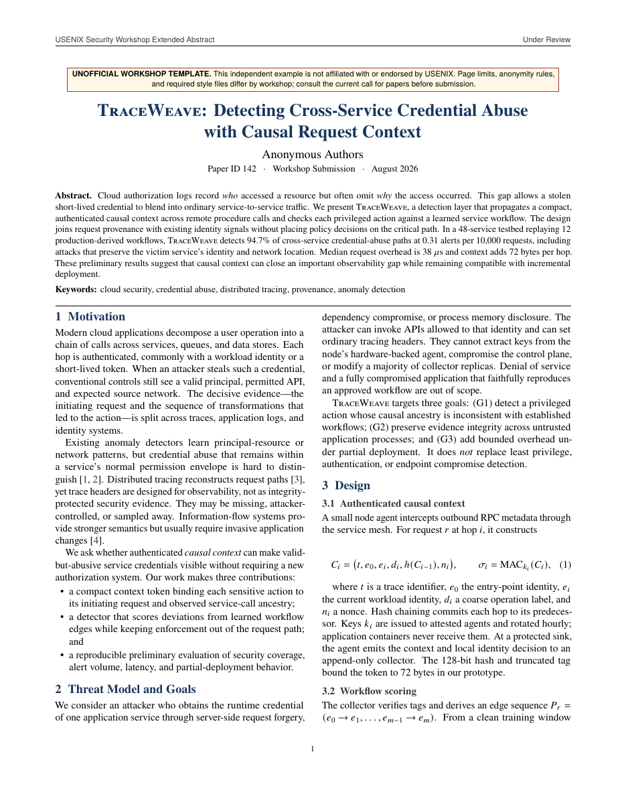</a><br><b>USENIX Security Workshop Extended Abstract</b><br><a href="https://letx.app/templates/conferences/usenix-security-workshop-extended-abstract">Open in LetX</a> · <a href="./conferences/usenix-security-workshop-extended-abstract">Source</a></td>
<td width="33%" valign="top" align="center"><a href="https://letx.app/templates/conferences/vldb-research-paper"></a><br><b>VLDB Research Paper</b><br><a href="https://letx.app/templates/conferences/vldb-research-paper">Open in LetX</a> · <a href="./conferences/vldb-research-paper">Source</a></td>
<td width="33%" valign="top" align="center"><a href="https://letx.app/templates/conferences/wacv-2026-submission-paper">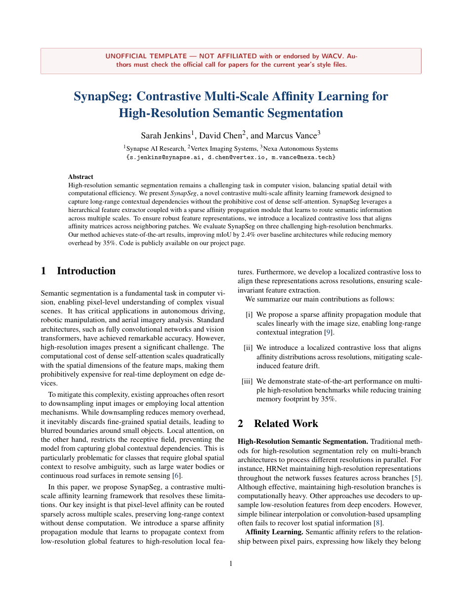</a><br><b>WACV 2026 Submission Paper</b><br><a href="https://letx.app/templates/conferences/wacv-2026-submission-paper">Open in LetX</a> · <a href="./conferences/wacv-2026-submission-paper">Source</a></td>
</tr>
<tr>
<td width="33%" valign="top" align="center"><a href="https://letx.app/templates/conferences/wsdm-submission-paper"></a><br><b>WSDM Submission Paper</b><br><a href="https://letx.app/templates/conferences/wsdm-submission-paper">Open in LetX</a> · <a href="./conferences/wsdm-submission-paper">Source</a></td>
<td width="33%" valign="top" align="center"><a href="https://letx.app/templates/conferences/www-conference-paper"></a><br><b>WWW Conference Paper</b><br><a href="https://letx.app/templates/conferences/www-conference-paper">Open in LetX</a> · <a href="./conferences/www-conference-paper">Source</a></td>
</tr>
</table>

### CVs & Résumés

161 templates. [Browse this category on LetX](https://letx.app/templates/cvs-resumes)

<table>
<tr>
<td width="33%" valign="top" align="center"><a href="https://letx.app/templates/cvs-resumes/academic-adjunct-professor-cv">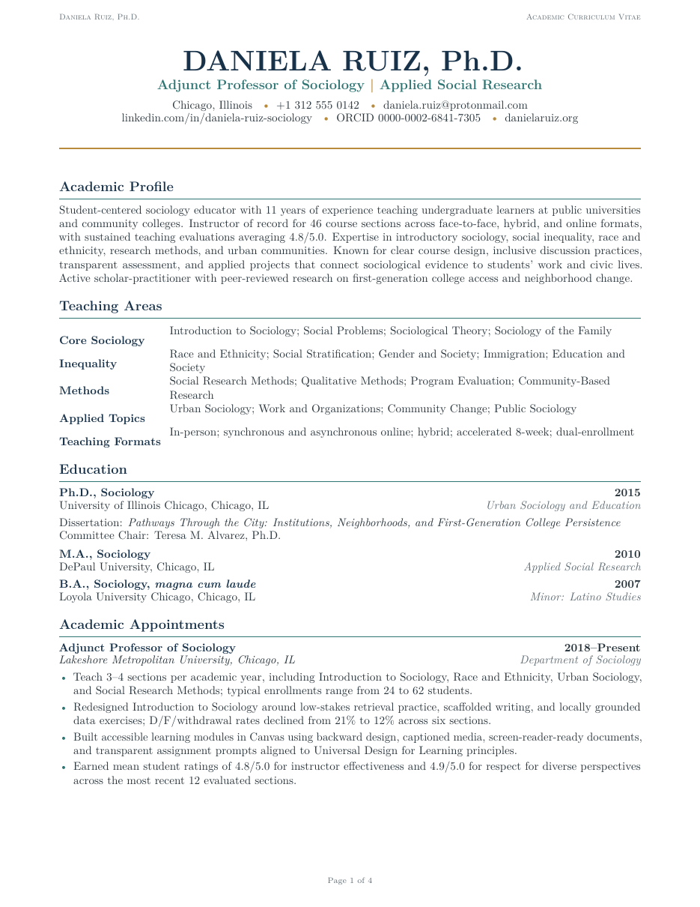</a><br><b>Academic Adjunct Professor CV</b><br><a href="https://letx.app/templates/cvs-resumes/academic-adjunct-professor-cv">Open in LetX</a> · <a href="./cvs-resumes/academic-adjunct-professor-cv">Source</a></td>
<td width="33%" valign="top" align="center"><a href="https://letx.app/templates/cvs-resumes/accountant-cpa-resume"></a><br><b>Accountant & CPA Resume</b><br><a href="https://letx.app/templates/cvs-resumes/accountant-cpa-resume">Open in LetX</a> · <a href="./cvs-resumes/accountant-cpa-resume">Source</a></td>
<td width="33%" valign="top" align="center"><a href="https://letx.app/templates/cvs-resumes/actor-performer-resume"></a><br><b>Actor / Performer Resume</b><br><a href="https://letx.app/templates/cvs-resumes/actor-performer-resume">Open in LetX</a> · <a href="./cvs-resumes/actor-performer-resume">Source</a></td>
</tr>
<tr>
<td width="33%" valign="top" align="center"><a href="https://letx.app/templates/cvs-resumes/agricultural-scientist-resume">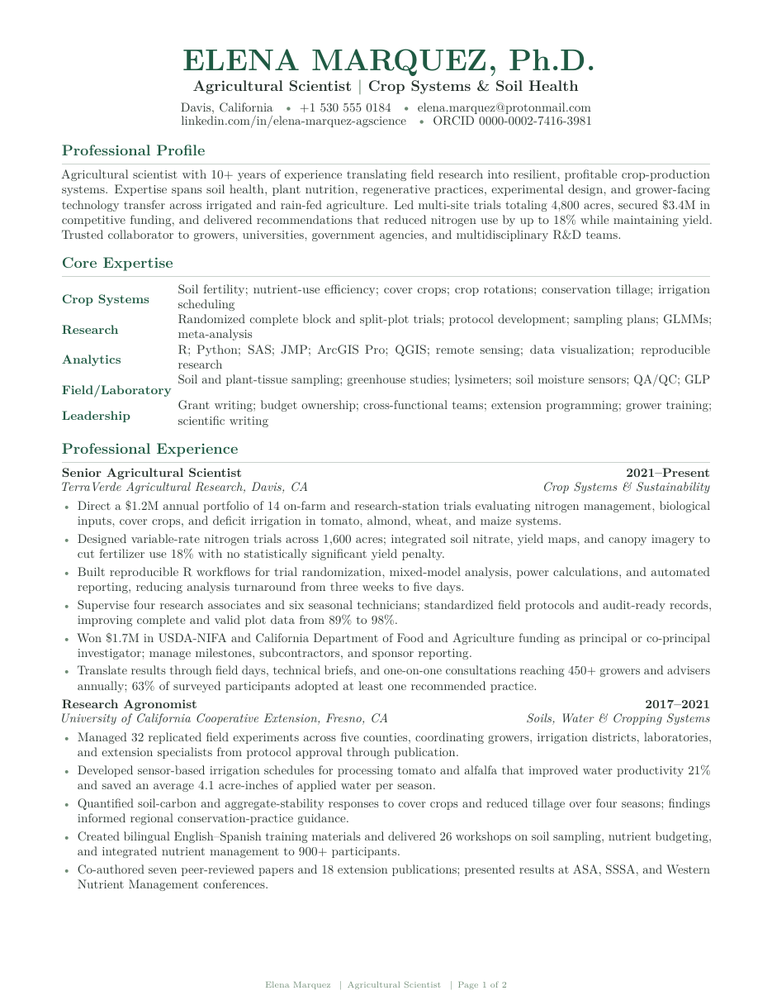</a><br><b>Agricultural Scientist Resume</b><br><a href="https://letx.app/templates/cvs-resumes/agricultural-scientist-resume">Open in LetX</a> · <a href="./cvs-resumes/agricultural-scientist-resume">Source</a></td>
<td width="33%" valign="top" align="center"><a href="https://letx.app/templates/cvs-resumes/ai-research-scientist-resume">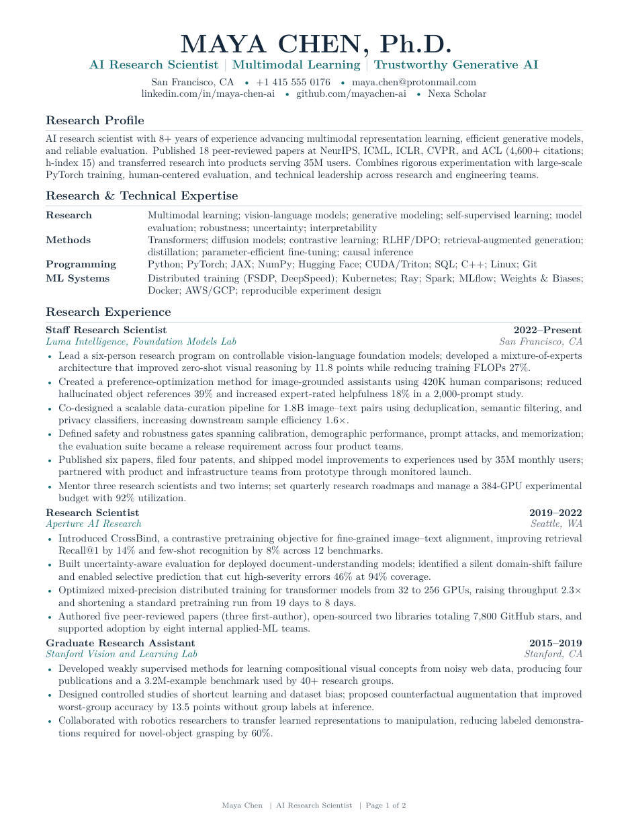</a><br><b>AI Research Scientist Resume</b><br><a href="https://letx.app/templates/cvs-resumes/ai-research-scientist-resume">Open in LetX</a> · <a href="./cvs-resumes/ai-research-scientist-resume">Source</a></td>
<td width="33%" valign="top" align="center"><a href="https://letx.app/templates/cvs-resumes/architect-portfolio-resume"></a><br><b>Architect Resume & Portfolio</b><br><a href="https://letx.app/templates/cvs-resumes/architect-portfolio-resume">Open in LetX</a> · <a href="./cvs-resumes/architect-portfolio-resume">Source</a></td>
</tr>
<tr>
<td width="33%" valign="top" align="center"><a href="https://letx.app/templates/cvs-resumes/ats-optimized-resume"></a><br><b>ATS Optimized Resume</b><br><a href="https://letx.app/templates/cvs-resumes/ats-optimized-resume">Open in LetX</a> · <a href="./cvs-resumes/ats-optimized-resume">Source</a></td>
<td width="33%" valign="top" align="center"><a href="https://letx.app/templates/cvs-resumes/attorney-lawyer-resume"></a><br><b>Attorney & Legal Resume</b><br><a href="https://letx.app/templates/cvs-resumes/attorney-lawyer-resume">Open in LetX</a> · <a href="./cvs-resumes/attorney-lawyer-resume">Source</a></td>
<td width="33%" valign="top" align="center"><a href="https://letx.app/templates/cvs-resumes/australian-resume"></a><br><b>Australian Style Resume</b><br><a href="https://letx.app/templates/cvs-resumes/australian-resume">Open in LetX</a> · <a href="./cvs-resumes/australian-resume">Source</a></td>
</tr>
<tr>
<td width="33%" valign="top" align="center"><a href="https://letx.app/templates/cvs-resumes/austrian-standard-cv">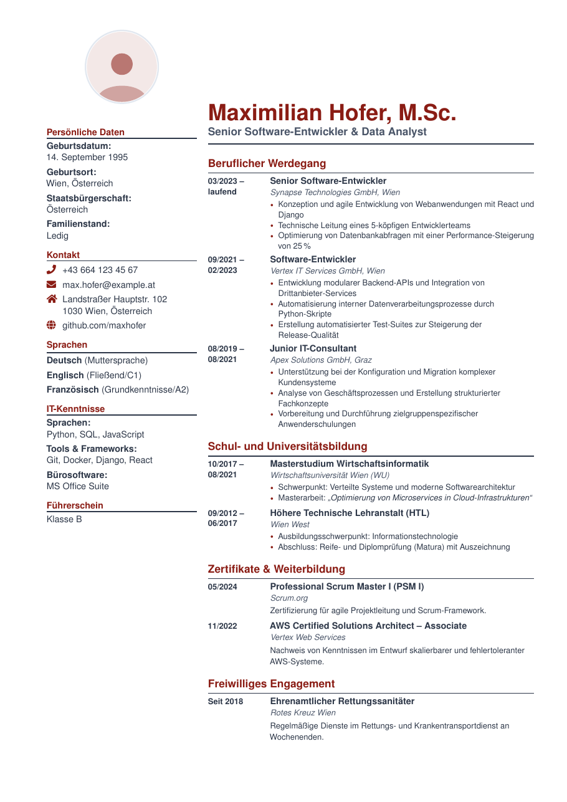</a><br><b>Austrian Standard CV</b><br><a href="https://letx.app/templates/cvs-resumes/austrian-standard-cv">Open in LetX</a> · <a href="./cvs-resumes/austrian-standard-cv">Source</a></td>
<td width="33%" valign="top" align="center"><a href="https://letx.app/templates/cvs-resumes/automotive-technician-resume">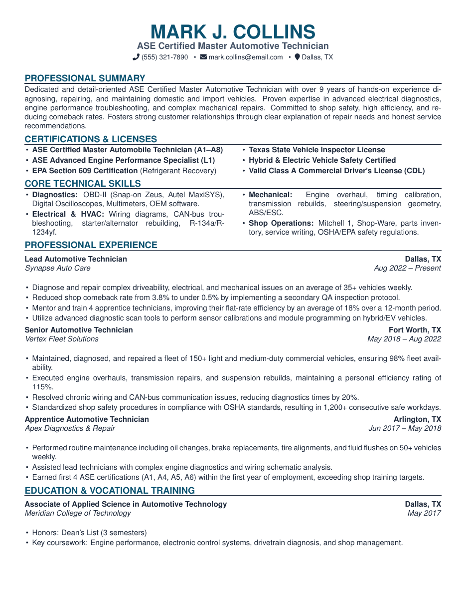</a><br><b>Automotive Technician Resume</b><br><a href="https://letx.app/templates/cvs-resumes/automotive-technician-resume">Open in LetX</a> · <a href="./cvs-resumes/automotive-technician-resume">Source</a></td>
<td width="33%" valign="top" align="center"><a href="https://letx.app/templates/cvs-resumes/backend-developer-resume"></a><br><b>Backend Developer Resume</b><br><a href="https://letx.app/templates/cvs-resumes/backend-developer-resume">Open in LetX</a> · <a href="./cvs-resumes/backend-developer-resume">Source</a></td>
</tr>
<tr>
<td width="33%" valign="top" align="center"><a href="https://letx.app/templates/cvs-resumes/bangladeshi-standard-cv">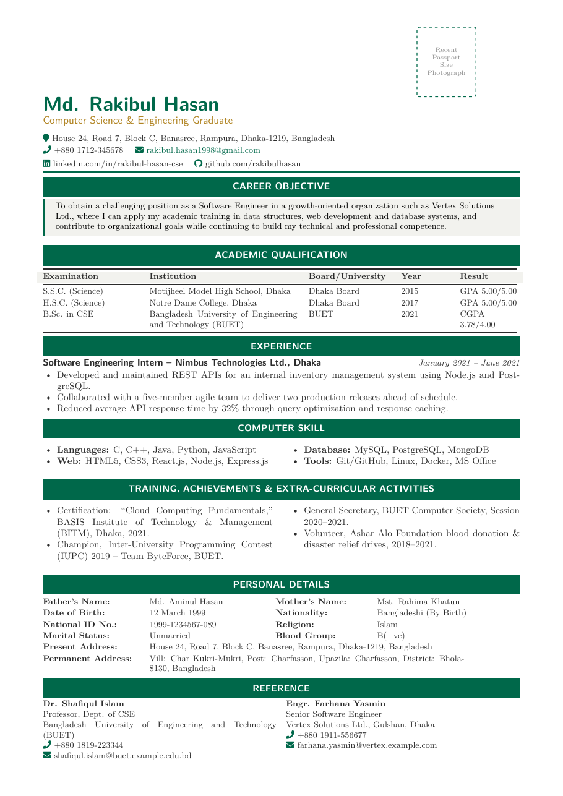</a><br><b>Bangladeshi Standard CV</b><br><a href="https://letx.app/templates/cvs-resumes/bangladeshi-standard-cv">Open in LetX</a> · <a href="./cvs-resumes/bangladeshi-standard-cv">Source</a></td>
<td width="33%" valign="top" align="center"><a href="https://letx.app/templates/cvs-resumes/bartender-and-server-resume"></a><br><b>Bartender and Server Resume</b><br><a href="https://letx.app/templates/cvs-resumes/bartender-and-server-resume">Open in LetX</a> · <a href="./cvs-resumes/bartender-and-server-resume">Source</a></td>
<td width="33%" valign="top" align="center"><a href="https://letx.app/templates/cvs-resumes/biomedical-engineer-resume">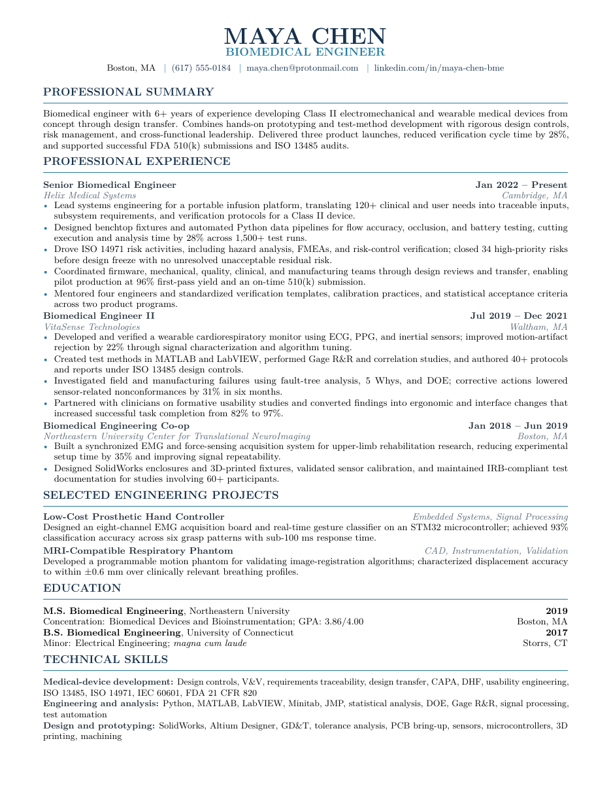</a><br><b>Biomedical Engineer Resume</b><br><a href="https://letx.app/templates/cvs-resumes/biomedical-engineer-resume">Open in LetX</a> · <a href="./cvs-resumes/biomedical-engineer-resume">Source</a></td>
</tr>
<tr>
<td width="33%" valign="top" align="center"><a href="https://letx.app/templates/cvs-resumes/biostatistician-resume">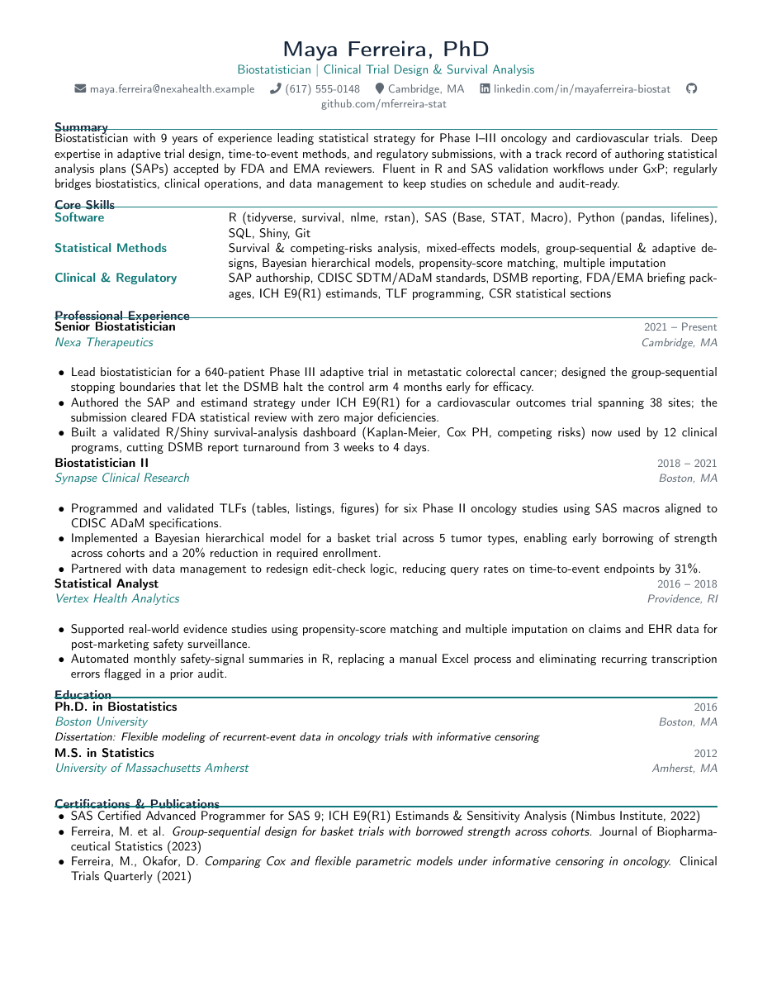</a><br><b>Biostatistician Resume</b><br><a href="https://letx.app/templates/cvs-resumes/biostatistician-resume">Open in LetX</a> · <a href="./cvs-resumes/biostatistician-resume">Source</a></td>
<td width="33%" valign="top" align="center"><a href="https://letx.app/templates/cvs-resumes/brazilian-curriculo-resume"></a><br><b>Brazilian Curriculo Resume</b><br><a href="https://letx.app/templates/cvs-resumes/brazilian-curriculo-resume">Open in LetX</a> · <a href="./cvs-resumes/brazilian-curriculo-resume">Source</a></td>
<td width="33%" valign="top" align="center"><a href="https://letx.app/templates/cvs-resumes/business-analyst-resume">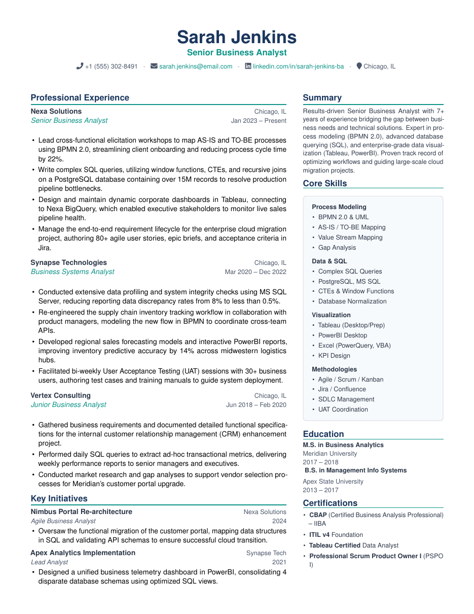</a><br><b>Business Analyst Resume</b><br><a href="https://letx.app/templates/cvs-resumes/business-analyst-resume">Open in LetX</a> · <a href="./cvs-resumes/business-analyst-resume">Source</a></td>
</tr>
<tr>
<td width="33%" valign="top" align="center"><a href="https://letx.app/templates/cvs-resumes/call-center-agent-resume">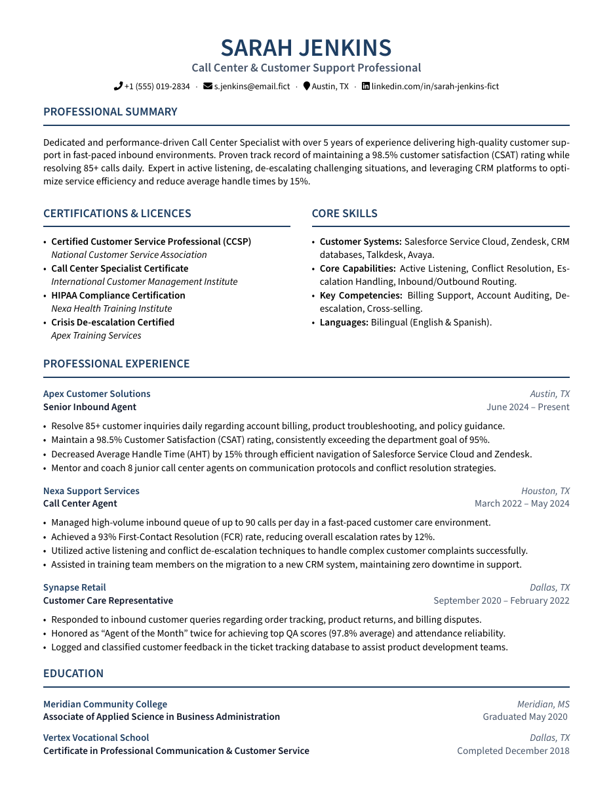</a><br><b>Call Center Agent Resume</b><br><a href="https://letx.app/templates/cvs-resumes/call-center-agent-resume">Open in LetX</a> · <a href="./cvs-resumes/call-center-agent-resume">Source</a></td>
<td width="33%" valign="top" align="center"><a href="https://letx.app/templates/cvs-resumes/canadian-resume"></a><br><b>Canadian Resume</b><br><a href="https://letx.app/templates/cvs-resumes/canadian-resume">Open in LetX</a> · <a href="./cvs-resumes/canadian-resume">Source</a></td>
<td width="33%" valign="top" align="center"><a href="https://letx.app/templates/cvs-resumes/carpenter-trade-resume">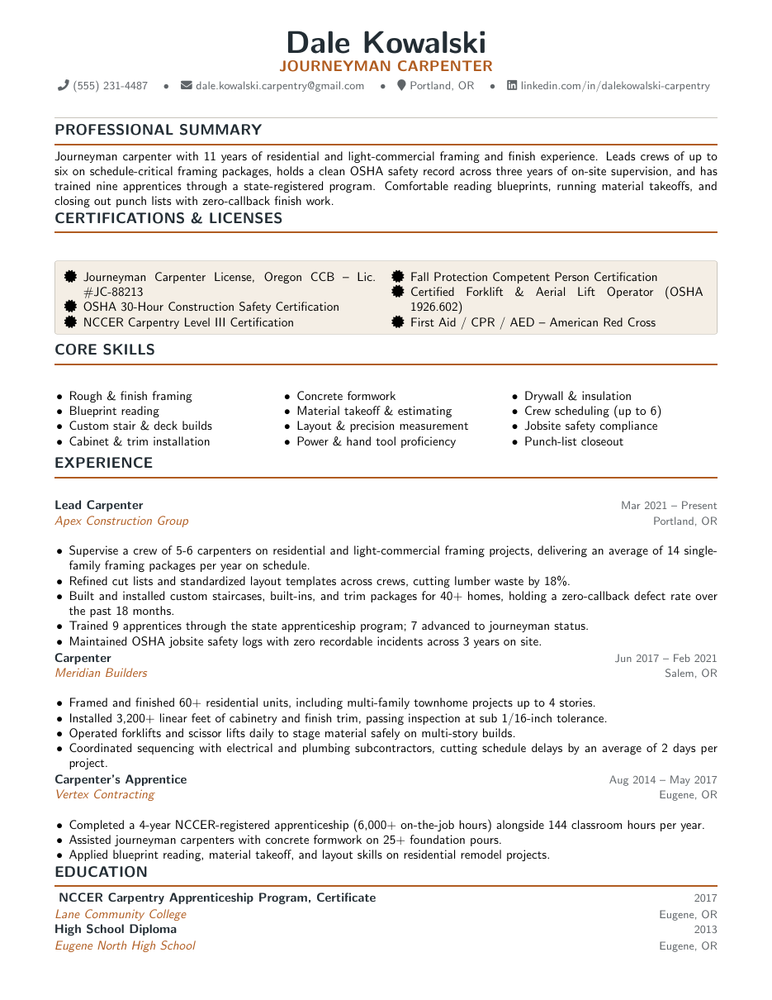</a><br><b>Carpenter Trade Resume</b><br><a href="https://letx.app/templates/cvs-resumes/carpenter-trade-resume">Open in LetX</a> · <a href="./cvs-resumes/carpenter-trade-resume">Source</a></td>
</tr>
<tr>
<td width="33%" valign="top" align="center"><a href="https://letx.app/templates/cvs-resumes/chartered-financial-analyst-resume">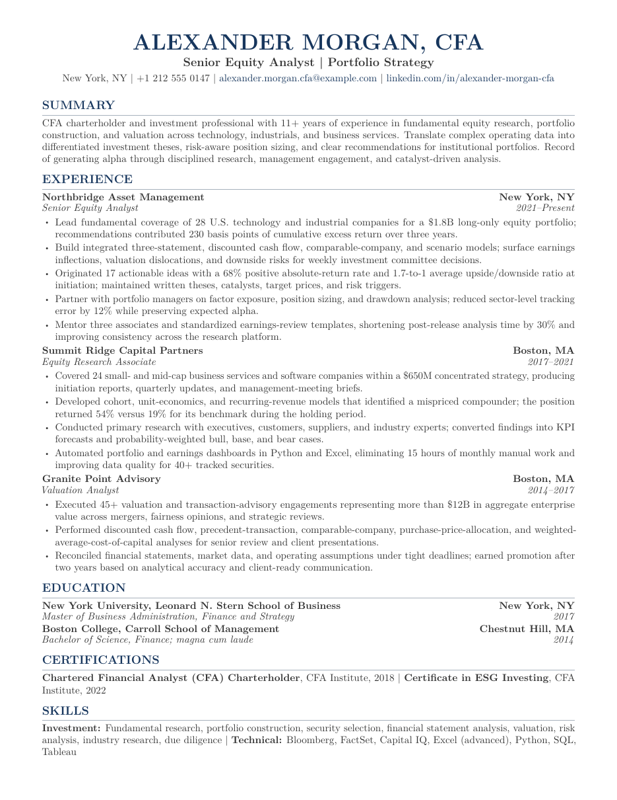</a><br><b>Chartered Financial Analyst (CFA) Resume</b><br><a href="https://letx.app/templates/cvs-resumes/chartered-financial-analyst-resume">Open in LetX</a> · <a href="./cvs-resumes/chartered-financial-analyst-resume">Source</a></td>
<td width="33%" valign="top" align="center"><a href="https://letx.app/templates/cvs-resumes/chef-and-culinary-resume">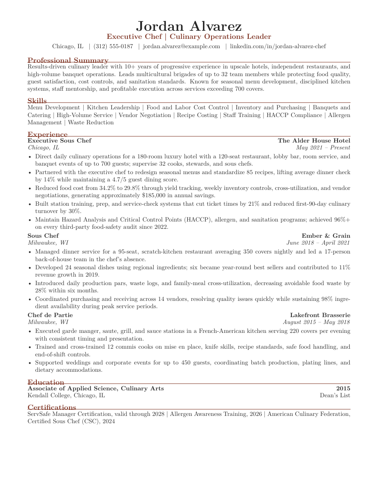</a><br><b>Chef and Culinary Resume</b><br><a href="https://letx.app/templates/cvs-resumes/chef-and-culinary-resume">Open in LetX</a> · <a href="./cvs-resumes/chef-and-culinary-resume">Source</a></td>
<td width="33%" valign="top" align="center"><a href="https://letx.app/templates/cvs-resumes/chemical-engineer-resume">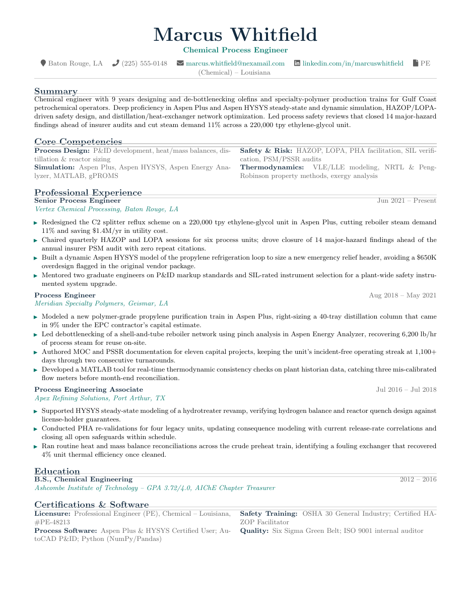</a><br><b>Chemical Engineer Resume</b><br><a href="https://letx.app/templates/cvs-resumes/chemical-engineer-resume">Open in LetX</a> · <a href="./cvs-resumes/chemical-engineer-resume">Source</a></td>
</tr>
<tr>
<td width="33%" valign="top" align="center"><a href="https://letx.app/templates/cvs-resumes/chinese-standard-resume"></a><br><b>Chinese Standard Resume</b><br><a href="https://letx.app/templates/cvs-resumes/chinese-standard-resume">Open in LetX</a> · <a href="./cvs-resumes/chinese-standard-resume">Source</a></td>
<td width="33%" valign="top" align="center"><a href="https://letx.app/templates/cvs-resumes/civil-engineer-resume"></a><br><b>Civil Engineer Resume</b><br><a href="https://letx.app/templates/cvs-resumes/civil-engineer-resume">Open in LetX</a> · <a href="./cvs-resumes/civil-engineer-resume">Source</a></td>
<td width="33%" valign="top" align="center"><a href="https://letx.app/templates/cvs-resumes/clinical-research-coordinator-resume">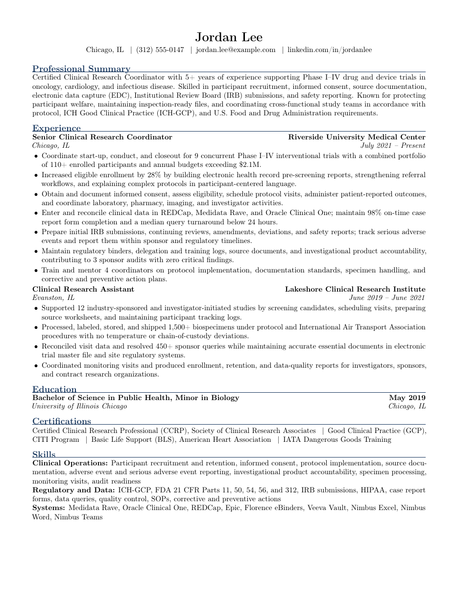</a><br><b>Clinical Research Coordinator Resume</b><br><a href="https://letx.app/templates/cvs-resumes/clinical-research-coordinator-resume">Open in LetX</a> · <a href="./cvs-resumes/clinical-research-coordinator-resume">Source</a></td>
</tr>
<tr>
<td width="33%" valign="top" align="center"><a href="https://letx.app/templates/cvs-resumes/cloud-security-engineer-resume">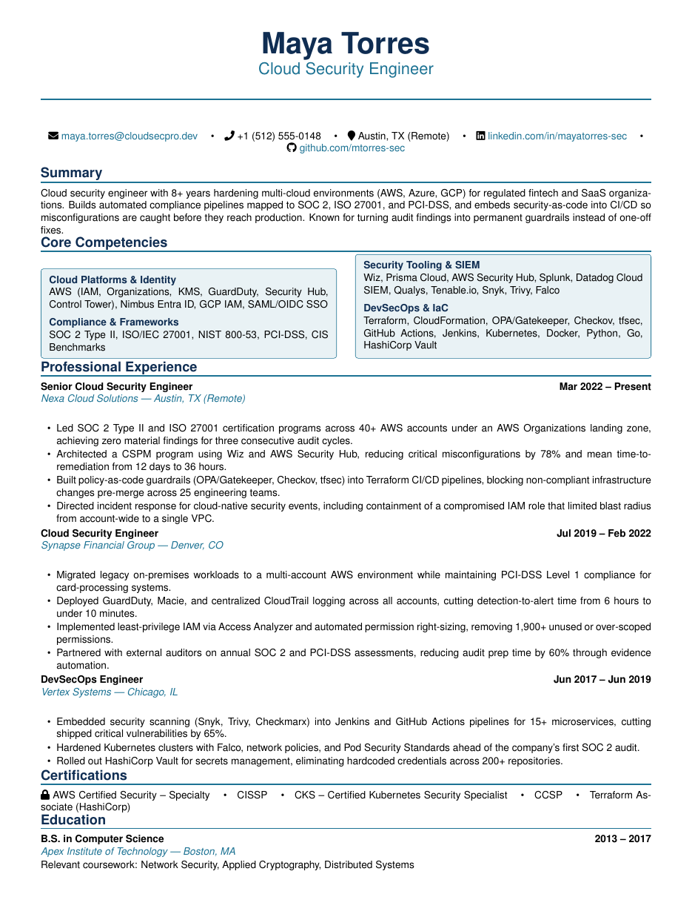</a><br><b>Cloud Security Engineer Resume</b><br><a href="https://letx.app/templates/cvs-resumes/cloud-security-engineer-resume">Open in LetX</a> · <a href="./cvs-resumes/cloud-security-engineer-resume">Source</a></td>
<td width="33%" valign="top" align="center"><a href="https://letx.app/templates/cvs-resumes/cloud-solutions-architect-resume">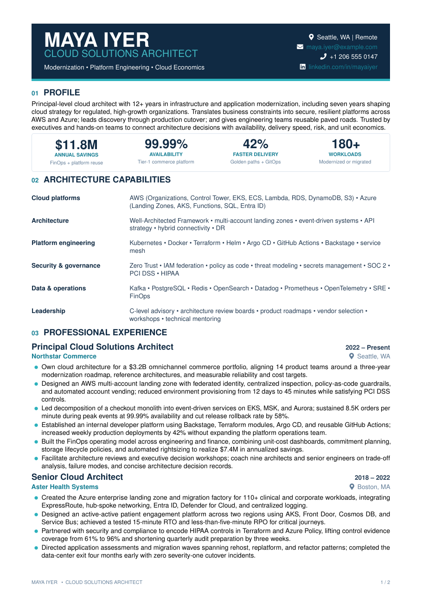</a><br><b>Cloud Solutions Architect Resume</b><br><a href="https://letx.app/templates/cvs-resumes/cloud-solutions-architect-resume">Open in LetX</a> · <a href="./cvs-resumes/cloud-solutions-architect-resume">Source</a></td>
<td width="33%" valign="top" align="center"><a href="https://letx.app/templates/cvs-resumes/cnc-machinist-resume">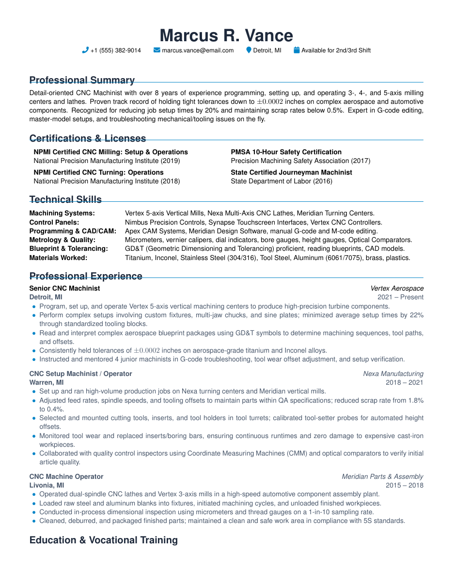</a><br><b>CNC Machinist Resume</b><br><a href="https://letx.app/templates/cvs-resumes/cnc-machinist-resume">Open in LetX</a> · <a href="./cvs-resumes/cnc-machinist-resume">Source</a></td>
</tr>
<tr>
<td width="33%" valign="top" align="center"><a href="https://letx.app/templates/cvs-resumes/college-student-resume"></a><br><b>College Student Resume</b><br><a href="https://letx.app/templates/cvs-resumes/college-student-resume">Open in LetX</a> · <a href="./cvs-resumes/college-student-resume">Source</a></td>
<td width="33%" valign="top" align="center"><a href="https://letx.app/templates/cvs-resumes/construction-project-manager-resume">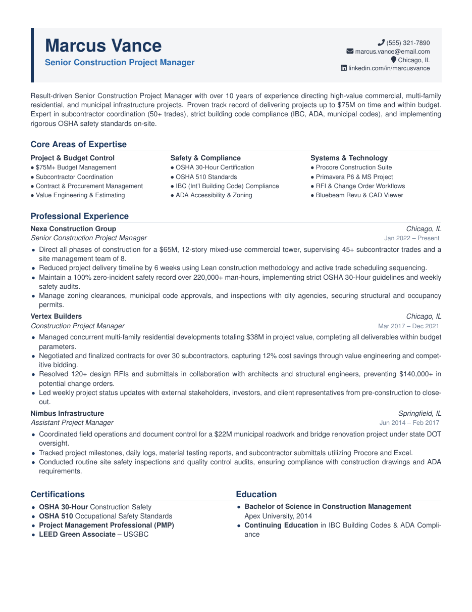</a><br><b>Construction Project Manager Resume</b><br><a href="https://letx.app/templates/cvs-resumes/construction-project-manager-resume">Open in LetX</a> · <a href="./cvs-resumes/construction-project-manager-resume">Source</a></td>
<td width="33%" valign="top" align="center"><a href="https://letx.app/templates/cvs-resumes/content-writer-copywriter-resume"></a><br><b>Content Writer & Copywriter Resume</b><br><a href="https://letx.app/templates/cvs-resumes/content-writer-copywriter-resume">Open in LetX</a> · <a href="./cvs-resumes/content-writer-copywriter-resume">Source</a></td>
</tr>
<tr>
<td width="33%" valign="top" align="center"><a href="https://letx.app/templates/cvs-resumes/creative-designer-resume"></a><br><b>Creative Designer Resume</b><br><a href="https://letx.app/templates/cvs-resumes/creative-designer-resume">Open in LetX</a> · <a href="./cvs-resumes/creative-designer-resume">Source</a></td>
<td width="33%" valign="top" align="center"><a href="https://letx.app/templates/cvs-resumes/creative-director-cv">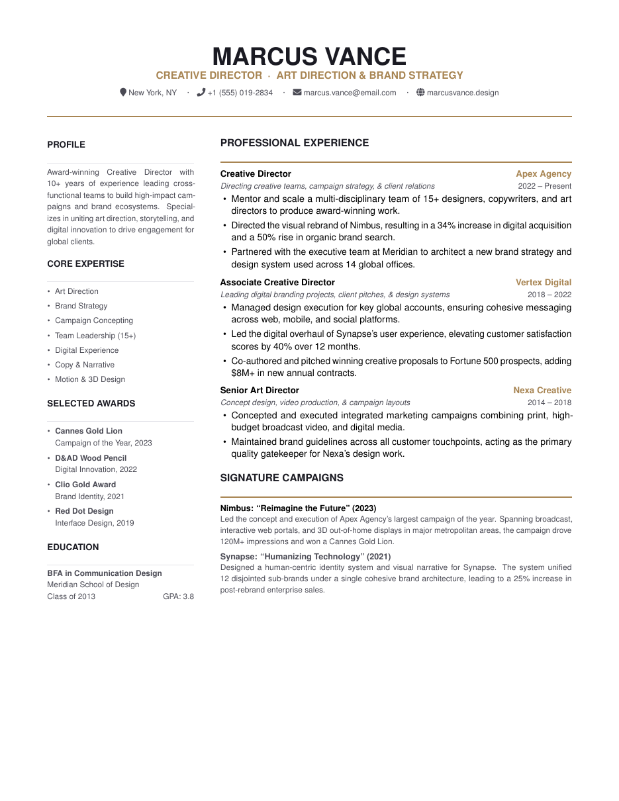</a><br><b>Creative Director CV</b><br><a href="https://letx.app/templates/cvs-resumes/creative-director-cv">Open in LetX</a> · <a href="./cvs-resumes/creative-director-cv">Source</a></td>
<td width="33%" valign="top" align="center"><a href="https://letx.app/templates/cvs-resumes/customer-success-manager-resume">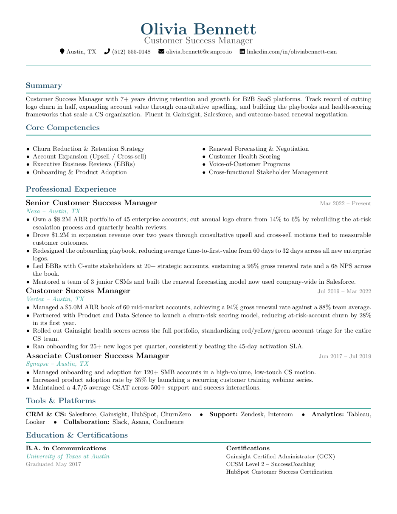</a><br><b>Customer Success Manager (CSM) Resume</b><br><a href="https://letx.app/templates/cvs-resumes/customer-success-manager-resume">Open in LetX</a> · <a href="./cvs-resumes/customer-success-manager-resume">Source</a></td>
</tr>
<tr>
<td width="33%" valign="top" align="center"><a href="https://letx.app/templates/cvs-resumes/cybersecurity-analyst-resume"></a><br><b>Cybersecurity Analyst CV</b><br><a href="https://letx.app/templates/cvs-resumes/cybersecurity-analyst-resume">Open in LetX</a> · <a href="./cvs-resumes/cybersecurity-analyst-resume">Source</a></td>
<td width="33%" valign="top" align="center"><a href="https://letx.app/templates/cvs-resumes/danish-cv"></a><br><b>Danish CV</b><br><a href="https://letx.app/templates/cvs-resumes/danish-cv">Open in LetX</a> · <a href="./cvs-resumes/danish-cv">Source</a></td>
<td width="33%" valign="top" align="center"><a href="https://letx.app/templates/cvs-resumes/data-analyst-resume"></a><br><b>Data Analyst Resume</b><br><a href="https://letx.app/templates/cvs-resumes/data-analyst-resume">Open in LetX</a> · <a href="./cvs-resumes/data-analyst-resume">Source</a></td>
</tr>
<tr>
<td width="33%" valign="top" align="center"><a href="https://letx.app/templates/cvs-resumes/data-engineer-resume"></a><br><b>Data Engineer Resume</b><br><a href="https://letx.app/templates/cvs-resumes/data-engineer-resume">Open in LetX</a> · <a href="./cvs-resumes/data-engineer-resume">Source</a></td>
<td width="33%" valign="top" align="center"><a href="https://letx.app/templates/cvs-resumes/database-administrator-resume">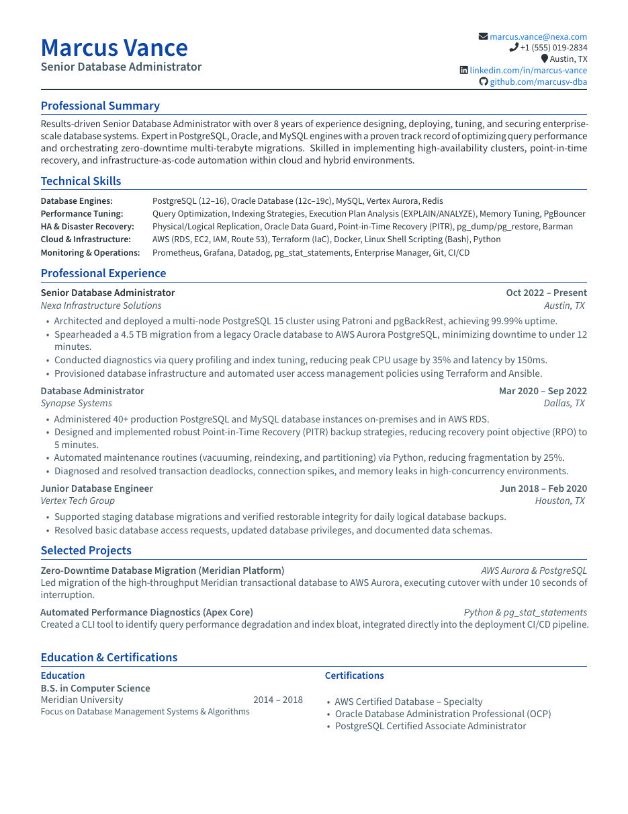</a><br><b>Database Administrator (DBA) Resume</b><br><a href="https://letx.app/templates/cvs-resumes/database-administrator-resume">Open in LetX</a> · <a href="./cvs-resumes/database-administrator-resume">Source</a></td>
<td width="33%" valign="top" align="center"><a href="https://letx.app/templates/cvs-resumes/dental-hygienist-resume">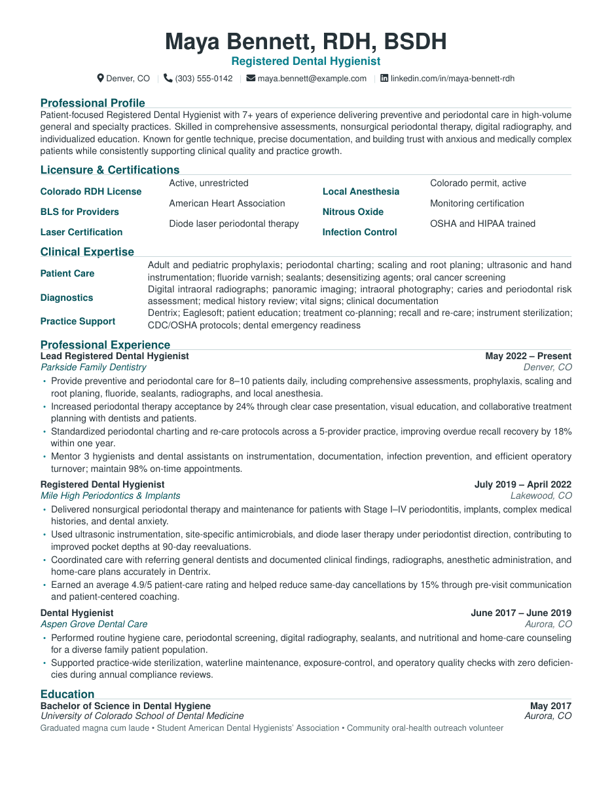</a><br><b>Dental Hygienist Resume</b><br><a href="https://letx.app/templates/cvs-resumes/dental-hygienist-resume">Open in LetX</a> · <a href="./cvs-resumes/dental-hygienist-resume">Source</a></td>
</tr>
<tr>
<td width="33%" valign="top" align="center"><a href="https://letx.app/templates/cvs-resumes/devops-engineer-resume"></a><br><b>DevOps Engineer Resume</b><br><a href="https://letx.app/templates/cvs-resumes/devops-engineer-resume">Open in LetX</a> · <a href="./cvs-resumes/devops-engineer-resume">Source</a></td>
<td width="33%" valign="top" align="center"><a href="https://letx.app/templates/cvs-resumes/dutch-cv">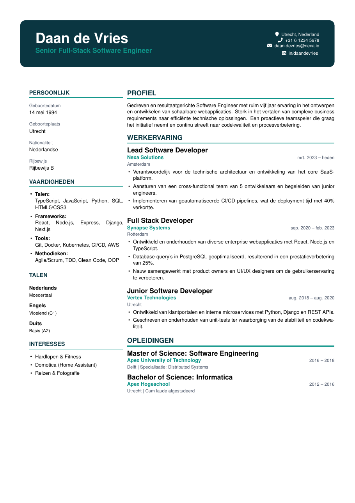</a><br><b>Dutch CV</b><br><a href="https://letx.app/templates/cvs-resumes/dutch-cv">Open in LetX</a> · <a href="./cvs-resumes/dutch-cv">Source</a></td>
<td width="33%" valign="top" align="center"><a href="https://letx.app/templates/cvs-resumes/egyptian-gulf-standard-cv">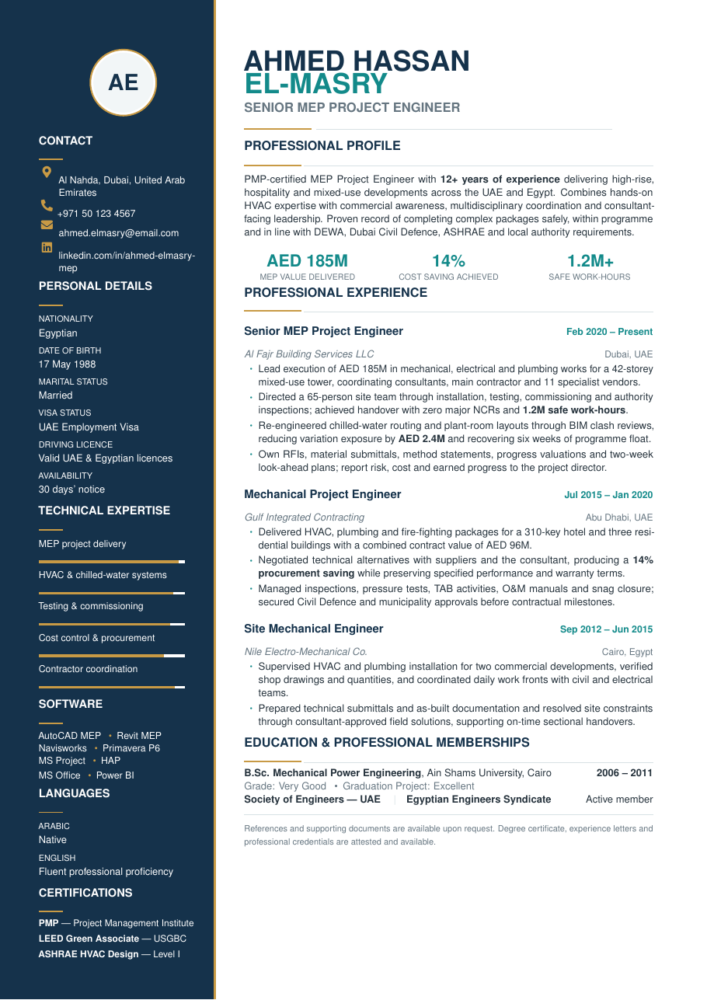</a><br><b>Egyptian Gulf Standard CV</b><br><a href="https://letx.app/templates/cvs-resumes/egyptian-gulf-standard-cv">Open in LetX</a> · <a href="./cvs-resumes/egyptian-gulf-standard-cv">Source</a></td>
</tr>
<tr>
<td width="33%" valign="top" align="center"><a href="https://letx.app/templates/cvs-resumes/electrical-engineer-resume"></a><br><b>Electrical Engineer CV</b><br><a href="https://letx.app/templates/cvs-resumes/electrical-engineer-resume">Open in LetX</a> · <a href="./cvs-resumes/electrical-engineer-resume">Source</a></td>
<td width="33%" valign="top" align="center"><a href="https://letx.app/templates/cvs-resumes/electrician-trade-resume"></a><br><b>Electrician Trade Resume</b><br><a href="https://letx.app/templates/cvs-resumes/electrician-trade-resume">Open in LetX</a> · <a href="./cvs-resumes/electrician-trade-resume">Source</a></td>
<td width="33%" valign="top" align="center"><a href="https://letx.app/templates/cvs-resumes/embedded-systems-engineer-resume">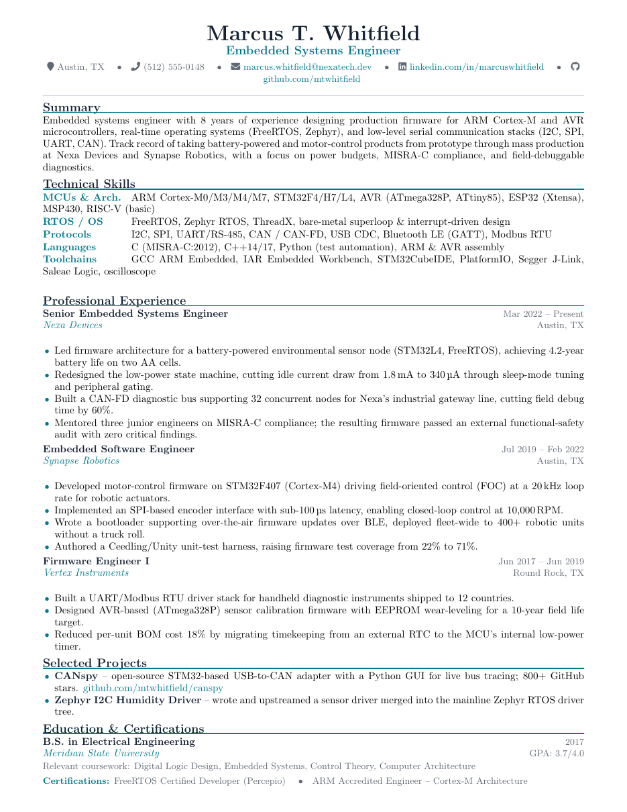</a><br><b>Embedded Systems Engineer Resume</b><br><a href="https://letx.app/templates/cvs-resumes/embedded-systems-engineer-resume">Open in LetX</a> · <a href="./cvs-resumes/embedded-systems-engineer-resume">Source</a></td>
</tr>
<tr>
<td width="33%" valign="top" align="center"><a href="https://letx.app/templates/cvs-resumes/environmental-consultant-resume">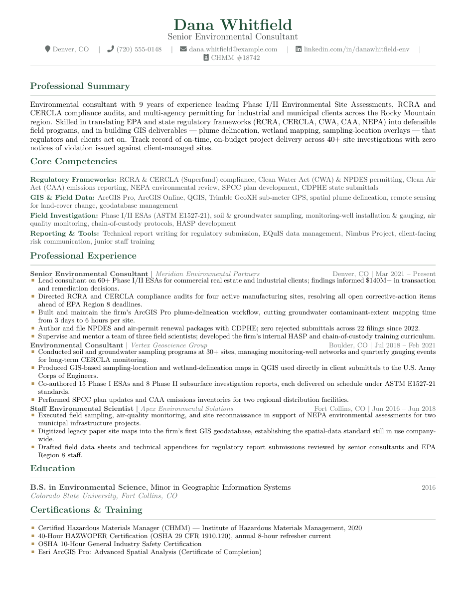</a><br><b>Environmental Consultant Resume</b><br><a href="https://letx.app/templates/cvs-resumes/environmental-consultant-resume">Open in LetX</a> · <a href="./cvs-resumes/environmental-consultant-resume">Source</a></td>
<td width="33%" valign="top" align="center"><a href="https://letx.app/templates/cvs-resumes/europass-cv"></a><br><b>Europass CV Template</b><br><a href="https://letx.app/templates/cvs-resumes/europass-cv">Open in LetX</a> · <a href="./cvs-resumes/europass-cv">Source</a></td>
<td width="33%" valign="top" align="center"><a href="https://letx.app/templates/cvs-resumes/event-planner-resume">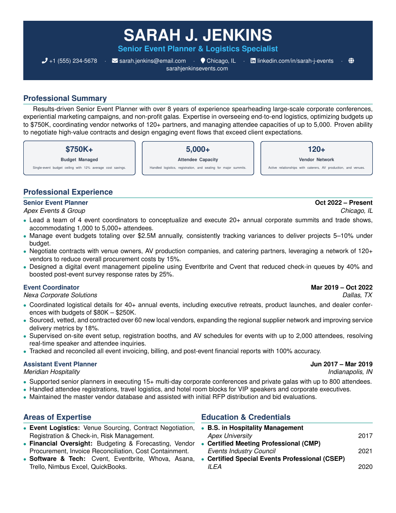</a><br><b>Event Planner Resume</b><br><a href="https://letx.app/templates/cvs-resumes/event-planner-resume">Open in LetX</a> · <a href="./cvs-resumes/event-planner-resume">Source</a></td>
</tr>
<tr>
<td width="33%" valign="top" align="center"><a href="https://letx.app/templates/cvs-resumes/executive-assistant-resume">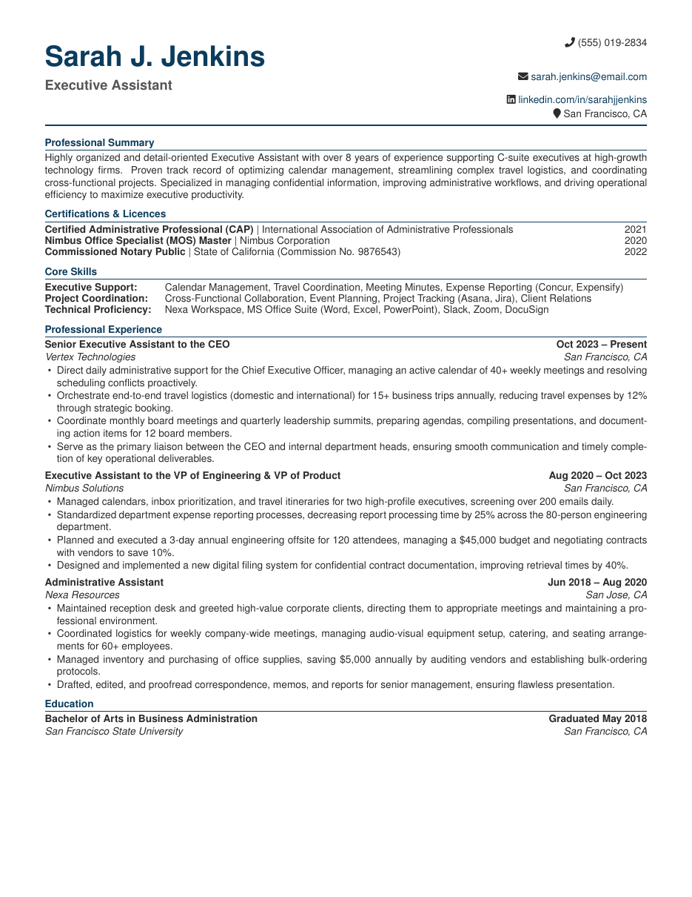</a><br><b>Executive Assistant Resume</b><br><a href="https://letx.app/templates/cvs-resumes/executive-assistant-resume">Open in LetX</a> · <a href="./cvs-resumes/executive-assistant-resume">Source</a></td>
<td width="33%" valign="top" align="center"><a href="https://letx.app/templates/cvs-resumes/executive-director-cv"></a><br><b>Executive Director CV</b><br><a href="https://letx.app/templates/cvs-resumes/executive-director-cv">Open in LetX</a> · <a href="./cvs-resumes/executive-director-cv">Source</a></td>
<td width="33%" valign="top" align="center"><a href="https://letx.app/templates/cvs-resumes/executive-mba-cv">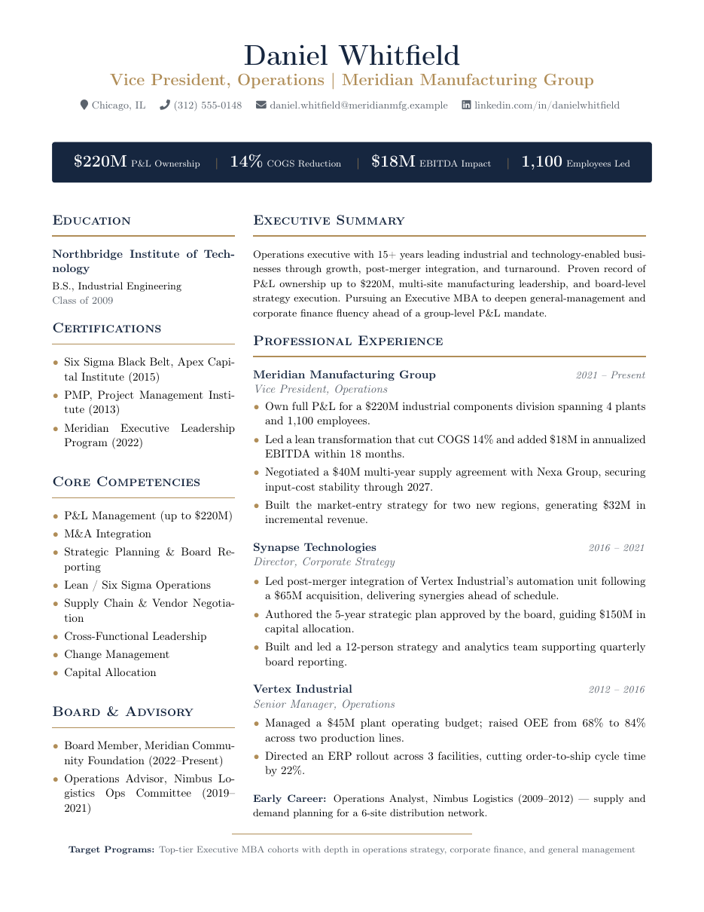</a><br><b>Executive MBA CV</b><br><a href="https://letx.app/templates/cvs-resumes/executive-mba-cv">Open in LetX</a> · <a href="./cvs-resumes/executive-mba-cv">Source</a></td>
</tr>
<tr>
<td width="33%" valign="top" align="center"><a href="https://letx.app/templates/cvs-resumes/federal-government-resume"></a><br><b>Federal Government Resume</b><br><a href="https://letx.app/templates/cvs-resumes/federal-government-resume">Open in LetX</a> · <a href="./cvs-resumes/federal-government-resume">Source</a></td>
<td width="33%" valign="top" align="center"><a href="https://letx.app/templates/cvs-resumes/accounts-finance-resume"></a><br><b>Finance Accounting Resume</b><br><a href="https://letx.app/templates/cvs-resumes/accounts-finance-resume">Open in LetX</a> · <a href="./cvs-resumes/accounts-finance-resume">Source</a></td>
<td width="33%" valign="top" align="center"><a href="https://letx.app/templates/cvs-resumes/financial-risk-manager-resume">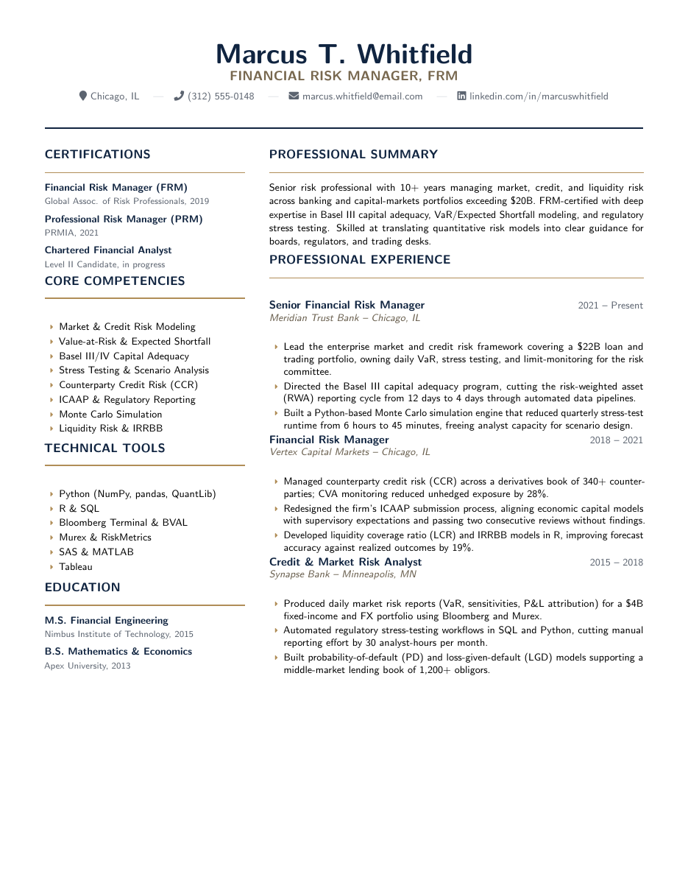</a><br><b>Financial Risk Manager (FRM) Resume</b><br><a href="https://letx.app/templates/cvs-resumes/financial-risk-manager-resume">Open in LetX</a> · <a href="./cvs-resumes/financial-risk-manager-resume">Source</a></td>
</tr>
<tr>
<td width="33%" valign="top" align="center"><a href="https://letx.app/templates/cvs-resumes/firefighter-resume">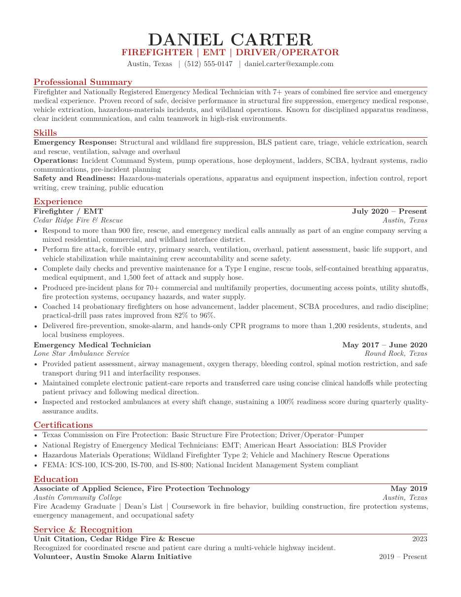</a><br><b>Firefighter Resume</b><br><a href="https://letx.app/templates/cvs-resumes/firefighter-resume">Open in LetX</a> · <a href="./cvs-resumes/firefighter-resume">Source</a></td>
<td width="33%" valign="top" align="center"><a href="https://letx.app/templates/cvs-resumes/flight-attendant-resume">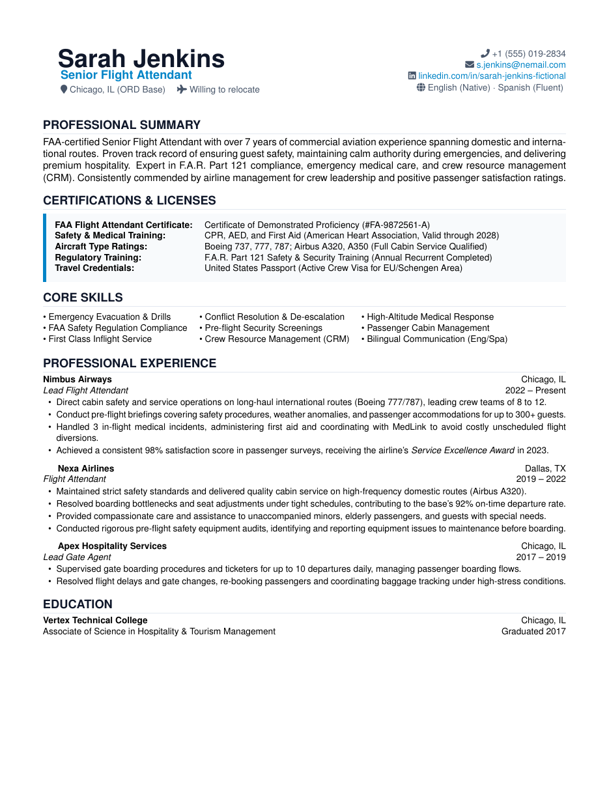</a><br><b>Flight Attendant Resume</b><br><a href="https://letx.app/templates/cvs-resumes/flight-attendant-resume">Open in LetX</a> · <a href="./cvs-resumes/flight-attendant-resume">Source</a></td>
<td width="33%" valign="top" align="center"><a href="https://letx.app/templates/cvs-resumes/flight-instructor-resume">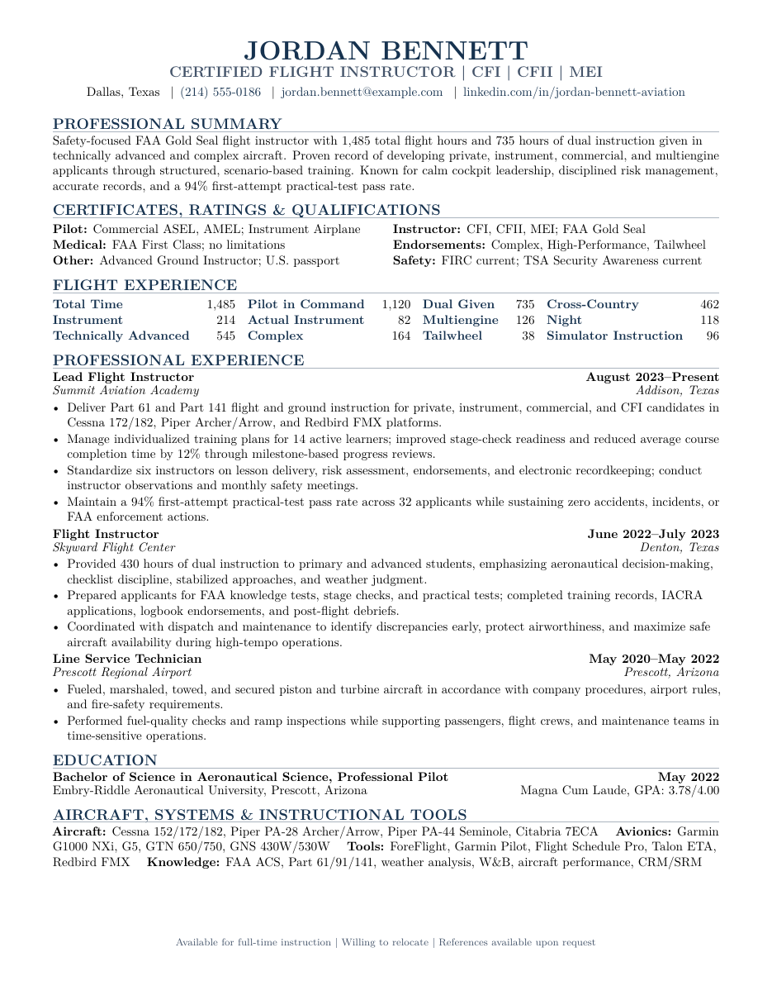</a><br><b>Flight Instructor Resume</b><br><a href="https://letx.app/templates/cvs-resumes/flight-instructor-resume">Open in LetX</a> · <a href="./cvs-resumes/flight-instructor-resume">Source</a></td>
</tr>
<tr>
<td width="33%" valign="top" align="center"><a href="https://letx.app/templates/cvs-resumes/french-cv-francais">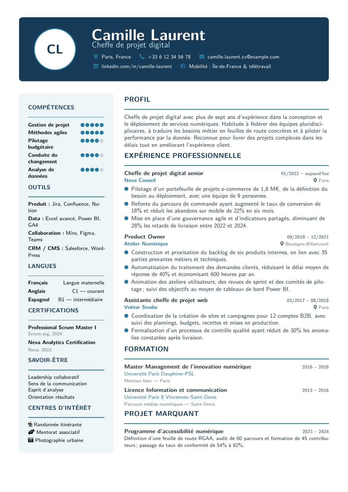</a><br><b>French CV Francais</b><br><a href="https://letx.app/templates/cvs-resumes/french-cv-francais">Open in LetX</a> · <a href="./cvs-resumes/french-cv-francais">Source</a></td>
<td width="33%" valign="top" align="center"><a href="https://letx.app/templates/cvs-resumes/frontend-developer-resume"></a><br><b>Frontend Developer Resume</b><br><a href="https://letx.app/templates/cvs-resumes/frontend-developer-resume">Open in LetX</a> · <a href="./cvs-resumes/frontend-developer-resume">Source</a></td>
<td width="33%" valign="top" align="center"><a href="https://letx.app/templates/cvs-resumes/game-developer-resume"></a><br><b>Game Developer Resume</b><br><a href="https://letx.app/templates/cvs-resumes/game-developer-resume">Open in LetX</a> · <a href="./cvs-resumes/game-developer-resume">Source</a></td>
</tr>
<tr>
<td width="33%" valign="top" align="center"><a href="https://letx.app/templates/cvs-resumes/geotechnical-engineer-resume">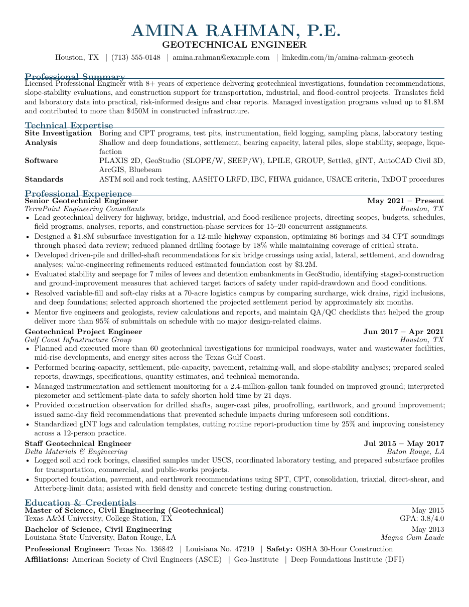</a><br><b>Geotechnical Engineer Resume</b><br><a href="https://letx.app/templates/cvs-resumes/geotechnical-engineer-resume">Open in LetX</a> · <a href="./cvs-resumes/geotechnical-engineer-resume">Source</a></td>
<td width="33%" valign="top" align="center"><a href="https://letx.app/templates/cvs-resumes/german-lebenslauf"></a><br><b>German Lebenslauf CV</b><br><a href="https://letx.app/templates/cvs-resumes/german-lebenslauf">Open in LetX</a> · <a href="./cvs-resumes/german-lebenslauf">Source</a></td>
<td width="33%" valign="top" align="center"><a href="https://letx.app/templates/cvs-resumes/gis-analyst-resume">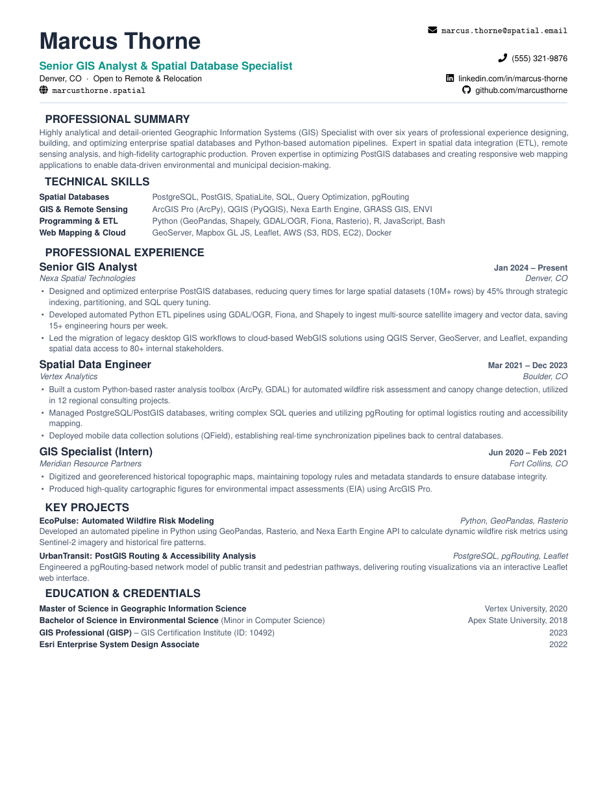</a><br><b>GIS Analyst Resume</b><br><a href="https://letx.app/templates/cvs-resumes/gis-analyst-resume">Open in LetX</a> · <a href="./cvs-resumes/gis-analyst-resume">Source</a></td>
</tr>
<tr>
<td width="33%" valign="top" align="center"><a href="https://letx.app/templates/cvs-resumes/graphic-designer-resume"></a><br><b>Graphic Designer Resume</b><br><a href="https://letx.app/templates/cvs-resumes/graphic-designer-resume">Open in LetX</a> · <a href="./cvs-resumes/graphic-designer-resume">Source</a></td>
<td width="33%" valign="top" align="center"><a href="https://letx.app/templates/cvs-resumes/healthcare-assistant-resume"></a><br><b>Healthcare Assistant Resume</b><br><a href="https://letx.app/templates/cvs-resumes/healthcare-assistant-resume">Open in LetX</a> · <a href="./cvs-resumes/healthcare-assistant-resume">Source</a></td>
<td width="33%" valign="top" align="center"><a href="https://letx.app/templates/cvs-resumes/high-school-student-college-application-resume">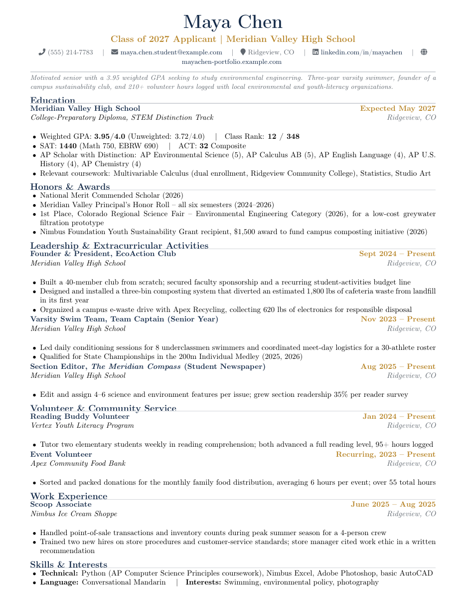</a><br><b>High School Student College Application Resume</b><br><a href="https://letx.app/templates/cvs-resumes/high-school-student-college-application-resume">Open in LetX</a> · <a href="./cvs-resumes/high-school-student-college-application-resume">Source</a></td>
</tr>
<tr>
<td width="33%" valign="top" align="center"><a href="https://letx.app/templates/cvs-resumes/hong-kong-standard-resume">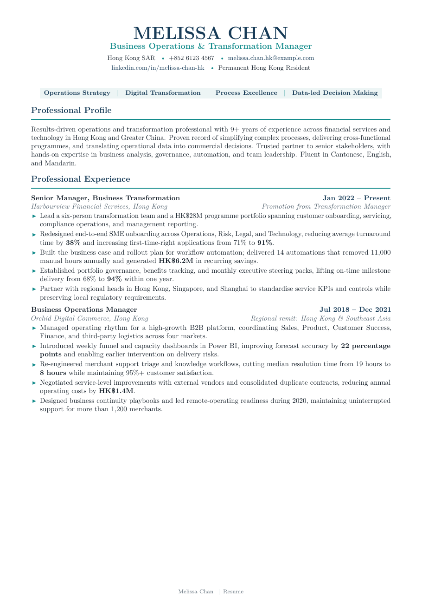</a><br><b>Hong Kong Standard Resume</b><br><a href="https://letx.app/templates/cvs-resumes/hong-kong-standard-resume">Open in LetX</a> · <a href="./cvs-resumes/hong-kong-standard-resume">Source</a></td>
<td width="33%" valign="top" align="center"><a href="https://letx.app/templates/cvs-resumes/hotel-and-hospitality-resume">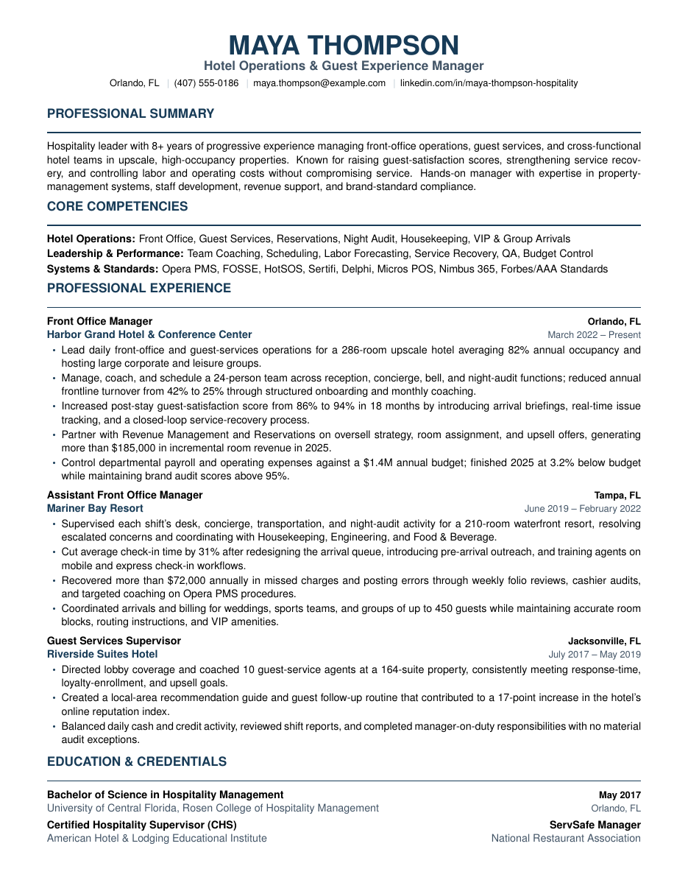</a><br><b>Hotel and Hospitality Resume</b><br><a href="https://letx.app/templates/cvs-resumes/hotel-and-hospitality-resume">Open in LetX</a> · <a href="./cvs-resumes/hotel-and-hospitality-resume">Source</a></td>
<td width="33%" valign="top" align="center"><a href="https://letx.app/templates/cvs-resumes/human-resources-generalist-resume">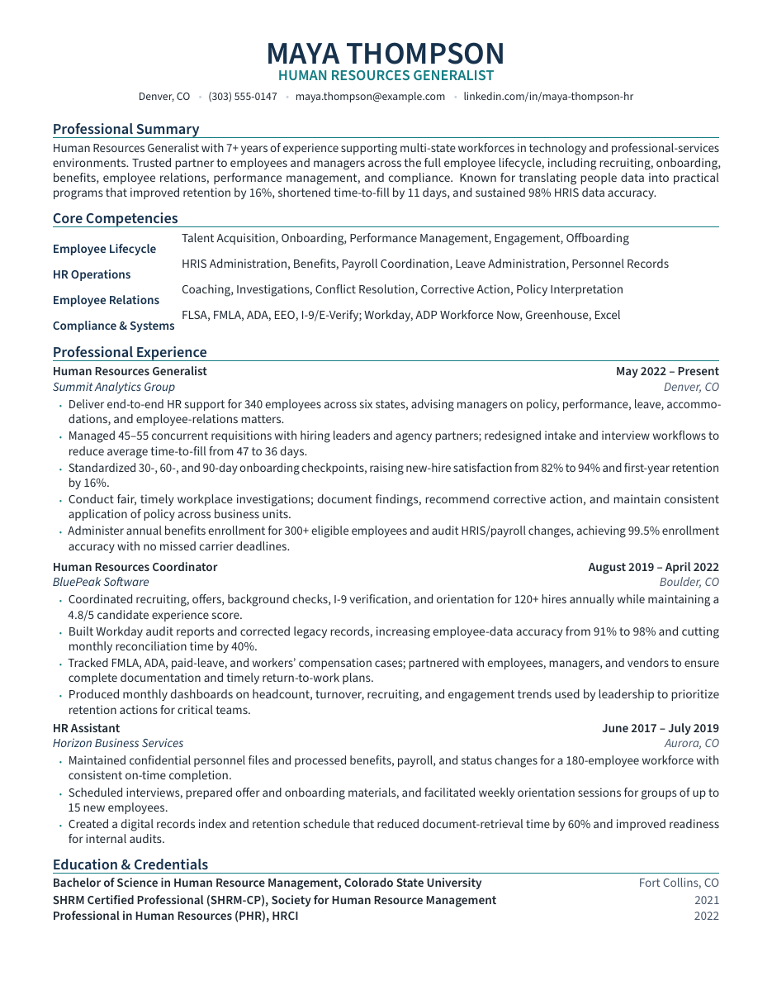</a><br><b>Human Resources Generalist Resume</b><br><a href="https://letx.app/templates/cvs-resumes/human-resources-generalist-resume">Open in LetX</a> · <a href="./cvs-resumes/human-resources-generalist-resume">Source</a></td>
</tr>
<tr>
<td width="33%" valign="top" align="center"><a href="https://letx.app/templates/cvs-resumes/hvac-technician-resume">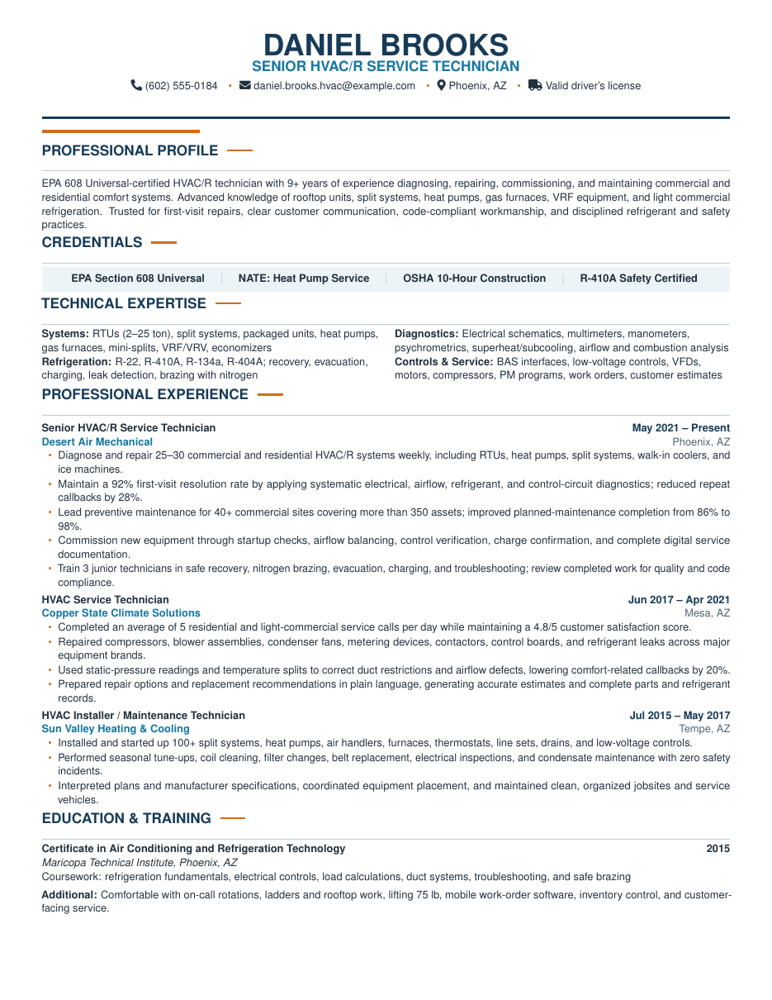</a><br><b>HVAC Technician Resume</b><br><a href="https://letx.app/templates/cvs-resumes/hvac-technician-resume">Open in LetX</a> · <a href="./cvs-resumes/hvac-technician-resume">Source</a></td>
<td width="33%" valign="top" align="center"><a href="https://letx.app/templates/cvs-resumes/indian-standard-resume"></a><br><b>Indian Standard Resume</b><br><a href="https://letx.app/templates/cvs-resumes/indian-standard-resume">Open in LetX</a> · <a href="./cvs-resumes/indian-standard-resume">Source</a></td>
<td width="33%" valign="top" align="center"><a href="https://letx.app/templates/cvs-resumes/instructional-designer-resume">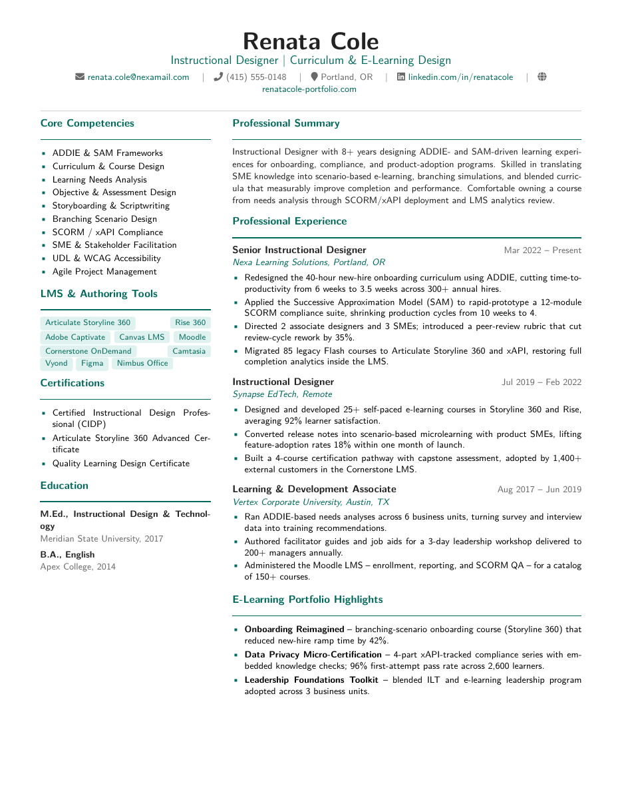</a><br><b>Instructional Designer Resume</b><br><a href="https://letx.app/templates/cvs-resumes/instructional-designer-resume">Open in LetX</a> · <a href="./cvs-resumes/instructional-designer-resume">Source</a></td>
</tr>
<tr>
<td width="33%" valign="top" align="center"><a href="https://letx.app/templates/cvs-resumes/insurance-underwriter-resume">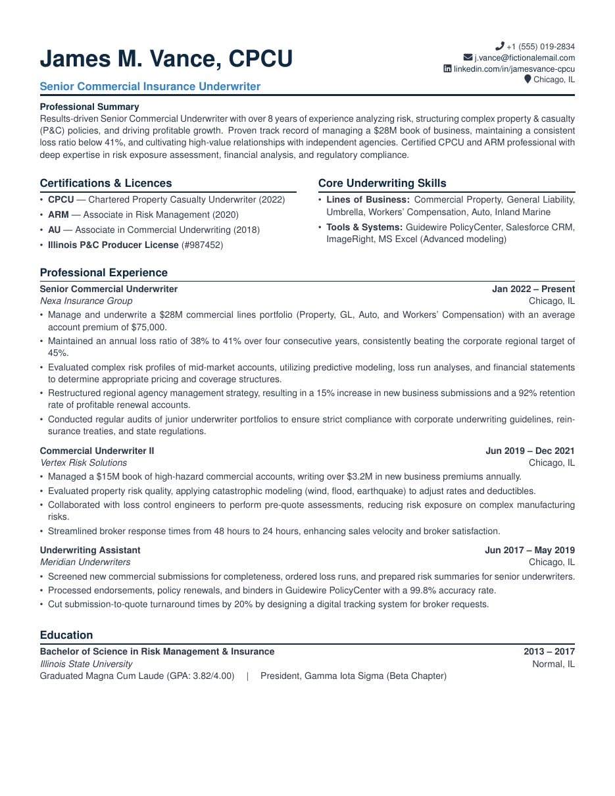</a><br><b>Insurance Underwriter Resume</b><br><a href="https://letx.app/templates/cvs-resumes/insurance-underwriter-resume">Open in LetX</a> · <a href="./cvs-resumes/insurance-underwriter-resume">Source</a></td>
<td width="33%" valign="top" align="center"><a href="https://letx.app/templates/cvs-resumes/investment-banker-resume"></a><br><b>Investment Banking Resume</b><br><a href="https://letx.app/templates/cvs-resumes/investment-banker-resume">Open in LetX</a> · <a href="./cvs-resumes/investment-banker-resume">Source</a></td>
<td width="33%" valign="top" align="center"><a href="https://letx.app/templates/cvs-resumes/irish-standard-cv">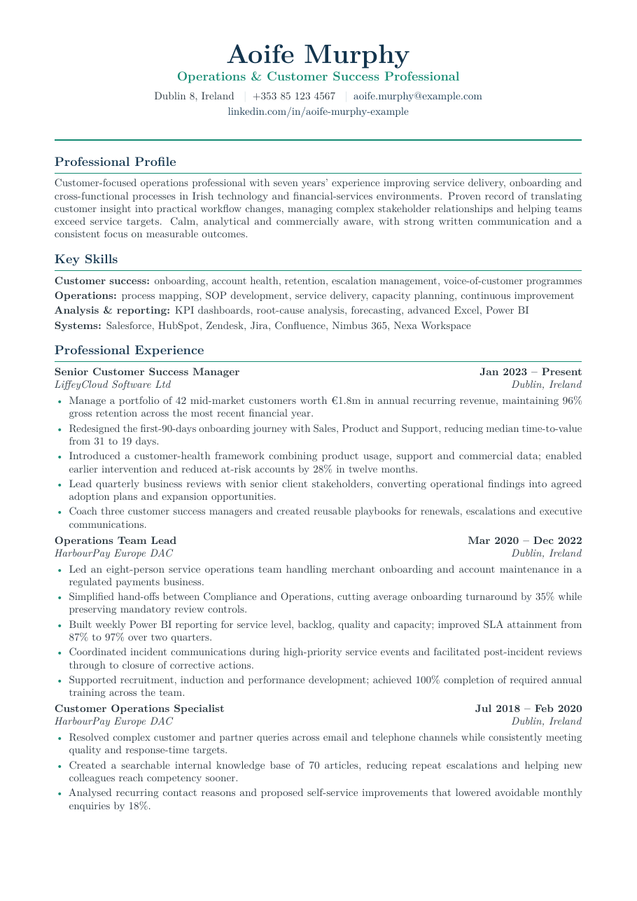</a><br><b>Irish Standard CV</b><br><a href="https://letx.app/templates/cvs-resumes/irish-standard-cv">Open in LetX</a> · <a href="./cvs-resumes/irish-standard-cv">Source</a></td>
</tr>
<tr>
<td width="33%" valign="top" align="center"><a href="https://letx.app/templates/cvs-resumes/israeli-standard-cv"></a><br><b>Israeli Standard CV</b><br><a href="https://letx.app/templates/cvs-resumes/israeli-standard-cv">Open in LetX</a> · <a href="./cvs-resumes/israeli-standard-cv">Source</a></td>
<td width="33%" valign="top" align="center"><a href="https://letx.app/templates/cvs-resumes/italian-curriculum-vitae"></a><br><b>Italian Curriculum Vitae</b><br><a href="https://letx.app/templates/cvs-resumes/italian-curriculum-vitae">Open in LetX</a> · <a href="./cvs-resumes/italian-curriculum-vitae">Source</a></td>
<td width="33%" valign="top" align="center"><a href="https://letx.app/templates/cvs-resumes/japanese-rirekisho-cv"></a><br><b>Japanese Rirekisho CV</b><br><a href="https://letx.app/templates/cvs-resumes/japanese-rirekisho-cv">Open in LetX</a> · <a href="./cvs-resumes/japanese-rirekisho-cv">Source</a></td>
</tr>
<tr>
<td width="33%" valign="top" align="center"><a href="https://letx.app/templates/cvs-resumes/japanese-shokumu-keirekisho-cv">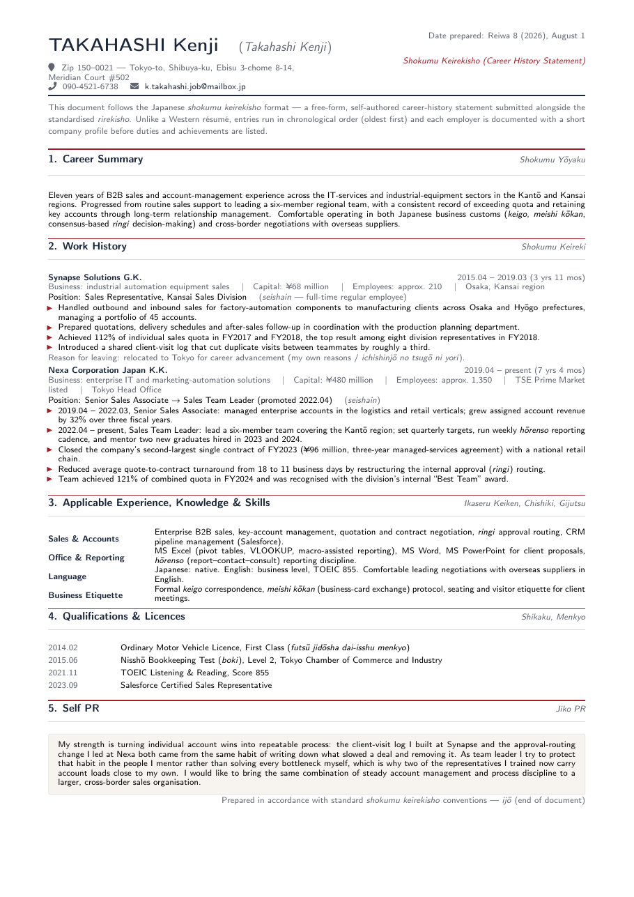</a><br><b>Japanese Shokumu Keirekisho CV</b><br><a href="https://letx.app/templates/cvs-resumes/japanese-shokumu-keirekisho-cv">Open in LetX</a> · <a href="./cvs-resumes/japanese-shokumu-keirekisho-cv">Source</a></td>
<td width="33%" valign="top" align="center"><a href="https://letx.app/templates/cvs-resumes/journalist-and-reporter-resume">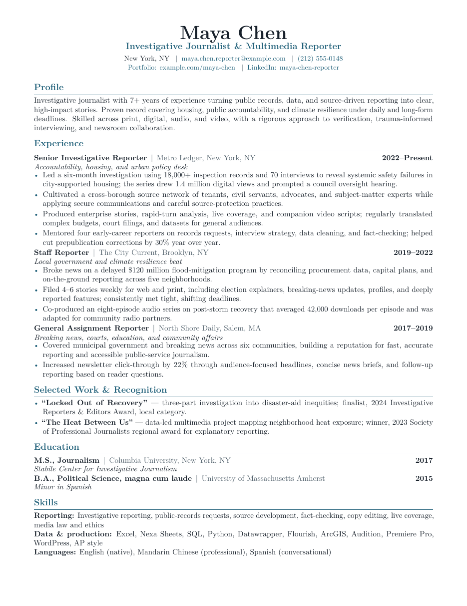</a><br><b>Journalist and Reporter Resume</b><br><a href="https://letx.app/templates/cvs-resumes/journalist-and-reporter-resume">Open in LetX</a> · <a href="./cvs-resumes/journalist-and-reporter-resume">Source</a></td>
<td width="33%" valign="top" align="center"><a href="https://letx.app/templates/cvs-resumes/kenyan-standard-cv">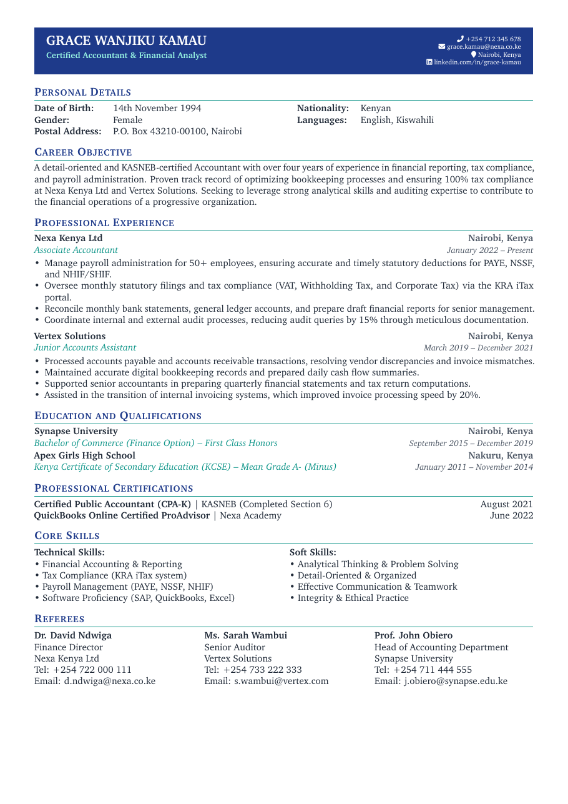</a><br><b>Kenyan Standard CV</b><br><a href="https://letx.app/templates/cvs-resumes/kenyan-standard-cv">Open in LetX</a> · <a href="./cvs-resumes/kenyan-standard-cv">Source</a></td>
</tr>
<tr>
<td width="33%" valign="top" align="center"><a href="https://letx.app/templates/cvs-resumes/korean-standard-resume">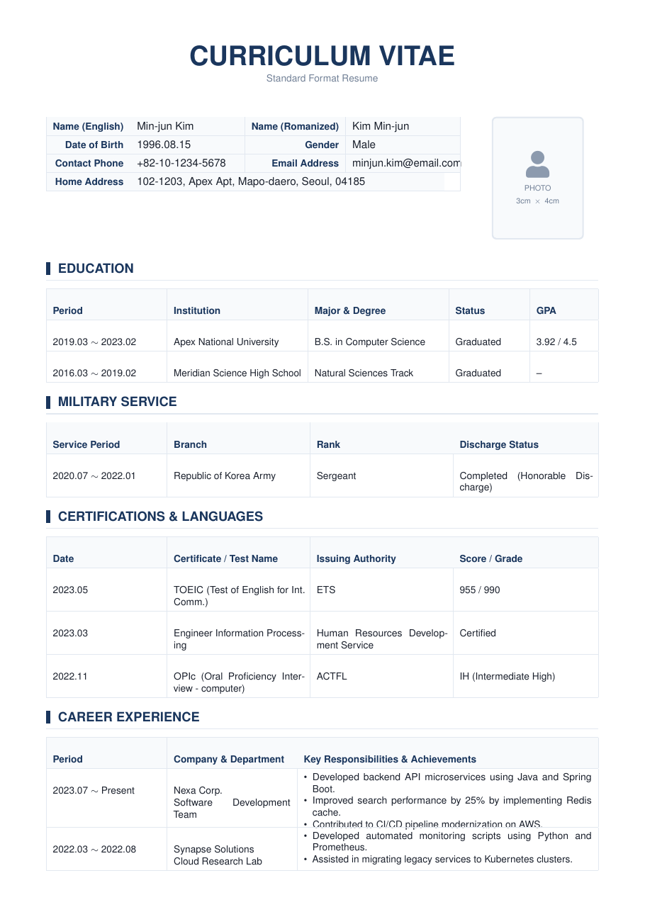</a><br><b>Korean Standard Resume</b><br><a href="https://letx.app/templates/cvs-resumes/korean-standard-resume">Open in LetX</a> · <a href="./cvs-resumes/korean-standard-resume">Source</a></td>
<td width="33%" valign="top" align="center"><a href="https://letx.app/templates/cvs-resumes/lab-technician-resume">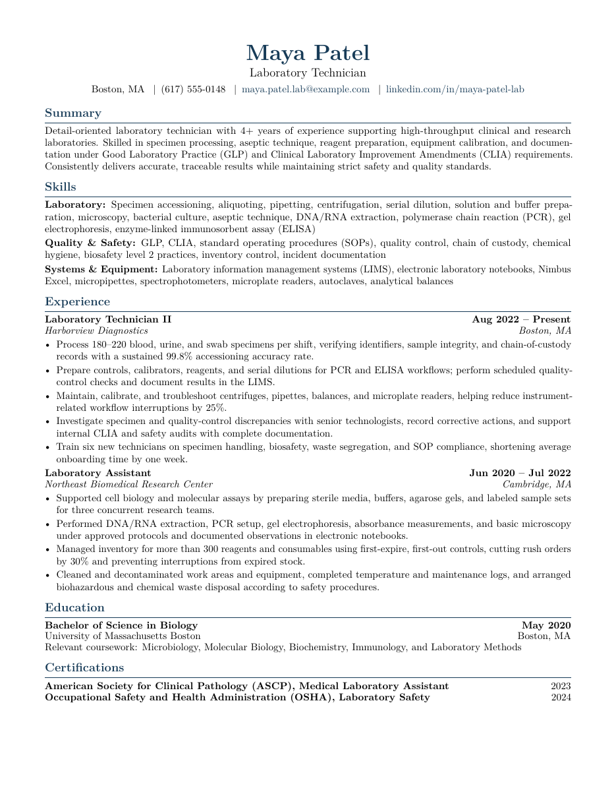</a><br><b>Lab Technician Resume</b><br><a href="https://letx.app/templates/cvs-resumes/lab-technician-resume">Open in LetX</a> · <a href="./cvs-resumes/lab-technician-resume">Source</a></td>
<td width="33%" valign="top" align="center"><a href="https://letx.app/templates/cvs-resumes/librarian-resume"></a><br><b>Librarian Resume</b><br><a href="https://letx.app/templates/cvs-resumes/librarian-resume">Open in LetX</a> · <a href="./cvs-resumes/librarian-resume">Source</a></td>
</tr>
<tr>
<td width="33%" valign="top" align="center"><a href="https://letx.app/templates/cvs-resumes/consultant-resume"></a><br><b>Management Consultant Resume</b><br><a href="https://letx.app/templates/cvs-resumes/consultant-resume">Open in LetX</a> · <a href="./cvs-resumes/consultant-resume">Source</a></td>
<td width="33%" valign="top" align="center"><a href="https://letx.app/templates/cvs-resumes/marketing-specialist-resume"></a><br><b>Marketing Specialist Resume</b><br><a href="https://letx.app/templates/cvs-resumes/marketing-specialist-resume">Open in LetX</a> · <a href="./cvs-resumes/marketing-specialist-resume">Source</a></td>
<td width="33%" valign="top" align="center"><a href="https://letx.app/templates/cvs-resumes/masters-program-application-cv"></a><br><b>Master's Program Application CV</b><br><a href="https://letx.app/templates/cvs-resumes/masters-program-application-cv">Open in LetX</a> · <a href="./cvs-resumes/masters-program-application-cv">Source</a></td>
</tr>
<tr>
<td width="33%" valign="top" align="center"><a href="https://letx.app/templates/cvs-resumes/mechanical-engineer-resume"></a><br><b>Mechanical Engineer CV</b><br><a href="https://letx.app/templates/cvs-resumes/mechanical-engineer-resume">Open in LetX</a> · <a href="./cvs-resumes/mechanical-engineer-resume">Source</a></td>
<td width="33%" valign="top" align="center"><a href="https://letx.app/templates/cvs-resumes/medical-doctor-cv"></a><br><b>Medical Doctor CV</b><br><a href="https://letx.app/templates/cvs-resumes/medical-doctor-cv">Open in LetX</a> · <a href="./cvs-resumes/medical-doctor-cv">Source</a></td>
<td width="33%" valign="top" align="center"><a href="https://letx.app/templates/cvs-resumes/medical-resident-cv">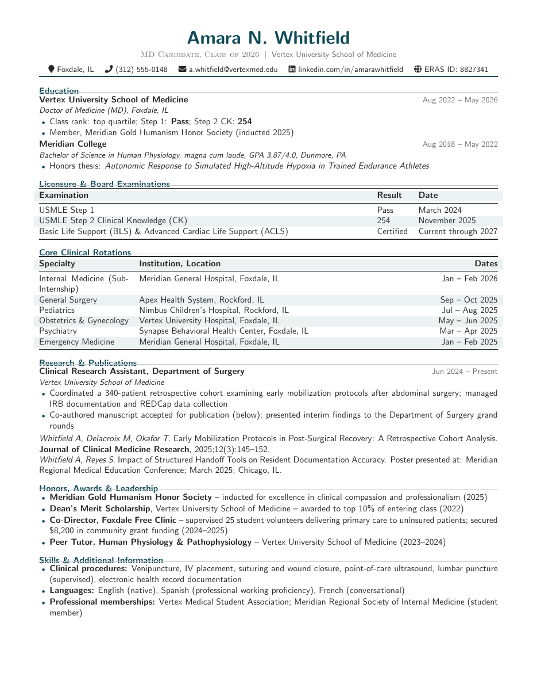</a><br><b>Medical Resident CV</b><br><a href="https://letx.app/templates/cvs-resumes/medical-resident-cv">Open in LetX</a> · <a href="./cvs-resumes/medical-resident-cv">Source</a></td>
</tr>
<tr>
<td width="33%" valign="top" align="center"><a href="https://letx.app/templates/cvs-resumes/mexican-curriculum-vitae"></a><br><b>Mexican Curriculum Vitae</b><br><a href="https://letx.app/templates/cvs-resumes/mexican-curriculum-vitae">Open in LetX</a> · <a href="./cvs-resumes/mexican-curriculum-vitae">Source</a></td>
<td width="33%" valign="top" align="center"><a href="https://letx.app/templates/cvs-resumes/military-to-civilian-resume">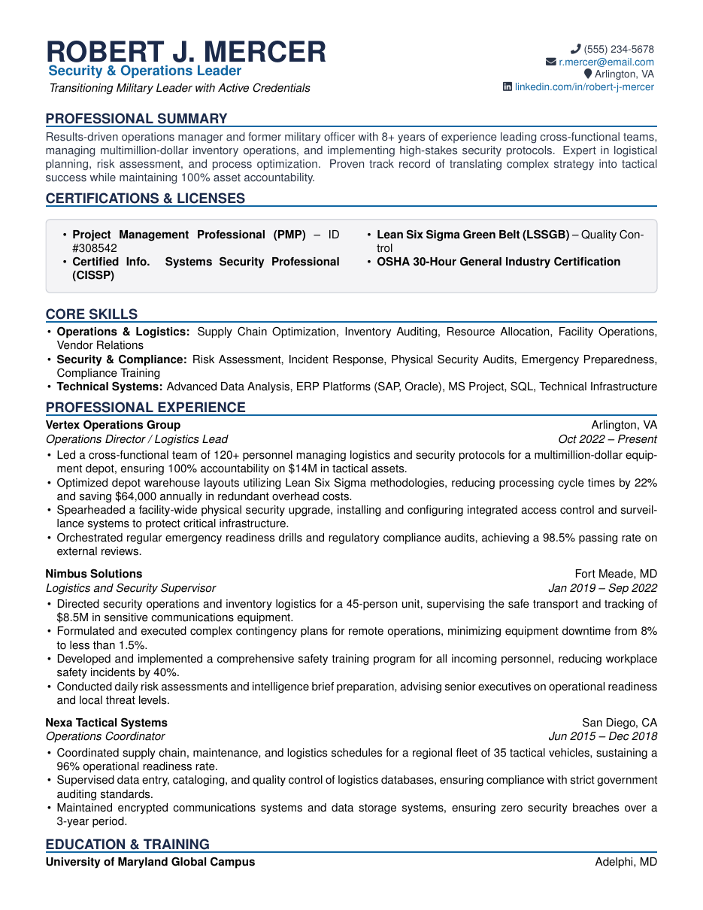</a><br><b>Military to Civilian Resume</b><br><a href="https://letx.app/templates/cvs-resumes/military-to-civilian-resume">Open in LetX</a> · <a href="./cvs-resumes/military-to-civilian-resume">Source</a></td>
<td width="33%" valign="top" align="center"><a href="https://letx.app/templates/cvs-resumes/modern-minimalist-resume"></a><br><b>Modern Minimalist Resume</b><br><a href="https://letx.app/templates/cvs-resumes/modern-minimalist-resume">Open in LetX</a> · <a href="./cvs-resumes/modern-minimalist-resume">Source</a></td>
</tr>
<tr>
<td width="33%" valign="top" align="center"><a href="https://letx.app/templates/cvs-resumes/musician-performance-resume">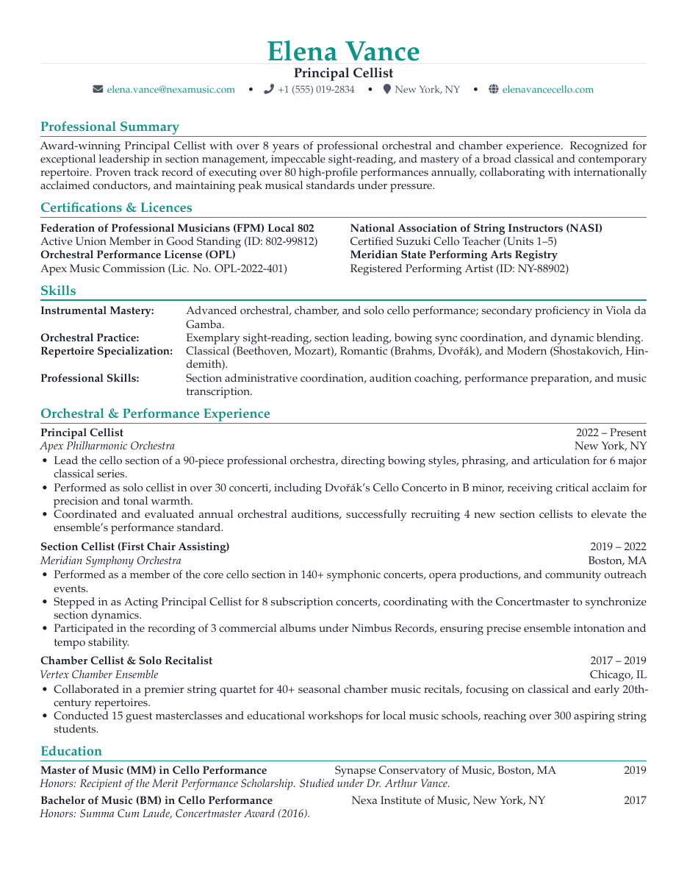</a><br><b>Musician Performance Resume</b><br><a href="https://letx.app/templates/cvs-resumes/musician-performance-resume">Open in LetX</a> · <a href="./cvs-resumes/musician-performance-resume">Source</a></td>
<td width="33%" valign="top" align="center"><a href="https://letx.app/templates/cvs-resumes/new-zealand-standard-cv">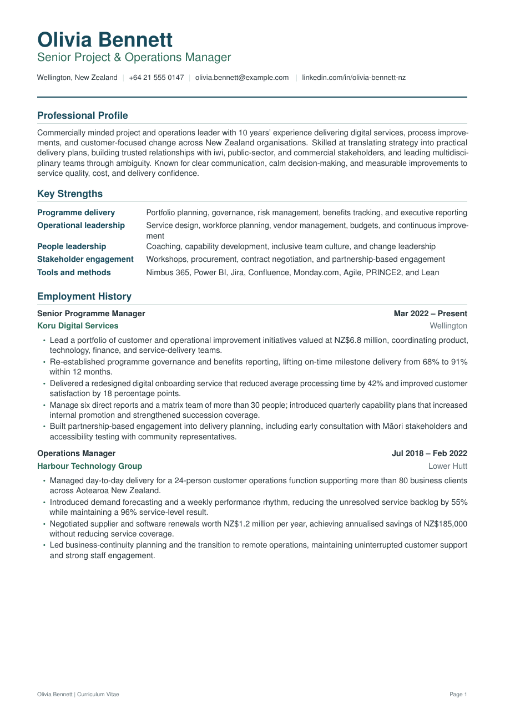</a><br><b>New Zealand Standard CV</b><br><a href="https://letx.app/templates/cvs-resumes/new-zealand-standard-cv">Open in LetX</a> · <a href="./cvs-resumes/new-zealand-standard-cv">Source</a></td>
<td width="33%" valign="top" align="center"><a href="https://letx.app/templates/cvs-resumes/nigerian-standard-cv"></a><br><b>Nigerian Standard CV</b><br><a href="https://letx.app/templates/cvs-resumes/nigerian-standard-cv">Open in LetX</a> · <a href="./cvs-resumes/nigerian-standard-cv">Source</a></td>
</tr>
<tr>
<td width="33%" valign="top" align="center"><a href="https://letx.app/templates/cvs-resumes/nonprofit-program-officer-resume">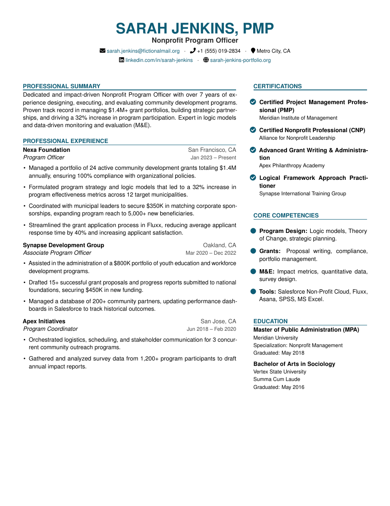</a><br><b>Nonprofit Program Officer Resume</b><br><a href="https://letx.app/templates/cvs-resumes/nonprofit-program-officer-resume">Open in LetX</a> · <a href="./cvs-resumes/nonprofit-program-officer-resume">Source</a></td>
<td width="33%" valign="top" align="center"><a href="https://letx.app/templates/cvs-resumes/norwegian-cv">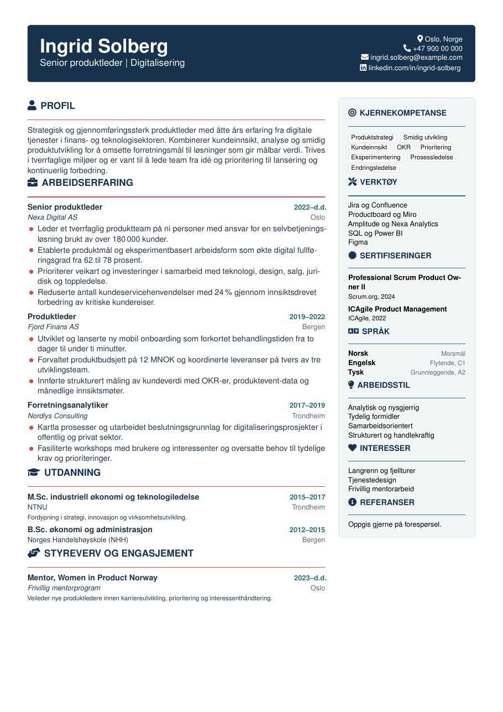</a><br><b>Norwegian CV</b><br><a href="https://letx.app/templates/cvs-resumes/norwegian-cv">Open in LetX</a> · <a href="./cvs-resumes/norwegian-cv">Source</a></td>
<td width="33%" valign="top" align="center"><a href="https://letx.app/templates/cvs-resumes/nurse-medical-resume"></a><br><b>Nurse / Medical Resume</b><br><a href="https://letx.app/templates/cvs-resumes/nurse-medical-resume">Open in LetX</a> · <a href="./cvs-resumes/nurse-medical-resume">Source</a></td>
</tr>
<tr>
<td width="33%" valign="top" align="center"><a href="https://letx.app/templates/cvs-resumes/occupational-therapist-resume">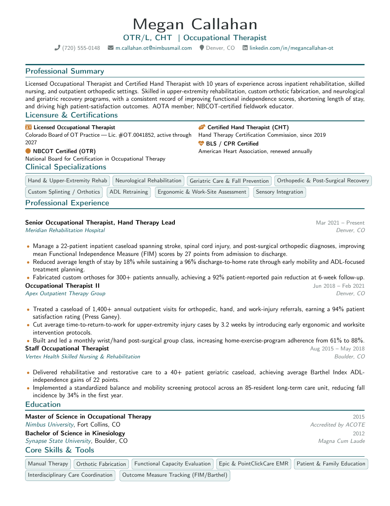</a><br><b>Occupational Therapist Resume</b><br><a href="https://letx.app/templates/cvs-resumes/occupational-therapist-resume">Open in LetX</a> · <a href="./cvs-resumes/occupational-therapist-resume">Source</a></td>
<td width="33%" valign="top" align="center"><a href="https://letx.app/templates/cvs-resumes/pakistani-standard-cv">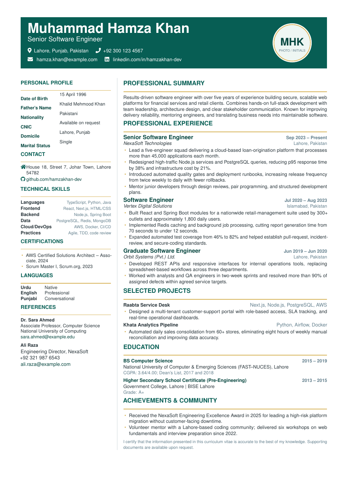</a><br><b>Pakistani Standard CV</b><br><a href="https://letx.app/templates/cvs-resumes/pakistani-standard-cv">Open in LetX</a> · <a href="./cvs-resumes/pakistani-standard-cv">Source</a></td>
<td width="33%" valign="top" align="center"><a href="https://letx.app/templates/cvs-resumes/paramedic-and-emt-resume">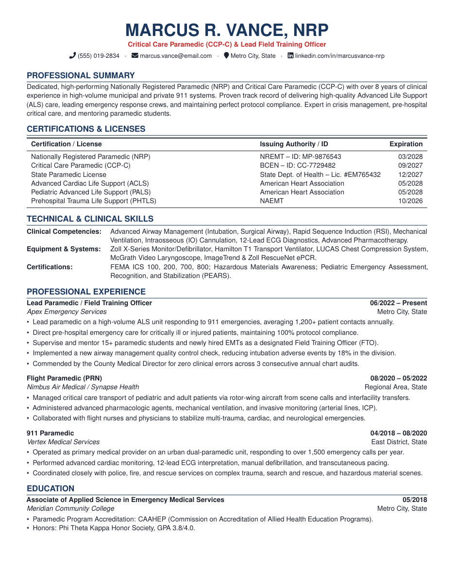</a><br><b>Paramedic and EMT Resume</b><br><a href="https://letx.app/templates/cvs-resumes/paramedic-and-emt-resume">Open in LetX</a> · <a href="./cvs-resumes/paramedic-and-emt-resume">Source</a></td>
</tr>
<tr>
<td width="33%" valign="top" align="center"><a href="https://letx.app/templates/cvs-resumes/personal-trainer-resume">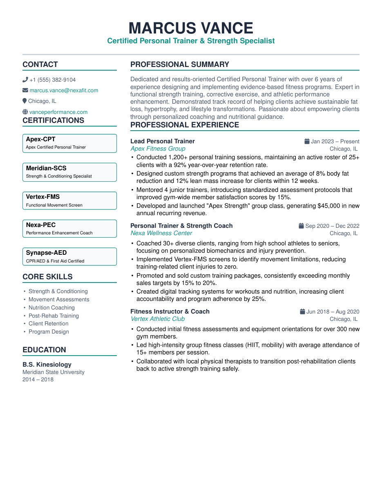</a><br><b>Personal Trainer Resume</b><br><a href="https://letx.app/templates/cvs-resumes/personal-trainer-resume">Open in LetX</a> · <a href="./cvs-resumes/personal-trainer-resume">Source</a></td>
<td width="33%" valign="top" align="center"><a href="https://letx.app/templates/cvs-resumes/pharmacist-resume"></a><br><b>Pharmacist Resume</b><br><a href="https://letx.app/templates/cvs-resumes/pharmacist-resume">Open in LetX</a> · <a href="./cvs-resumes/pharmacist-resume">Source</a></td>
<td width="33%" valign="top" align="center"><a href="https://letx.app/templates/cvs-resumes/pharmacovigilance-specialist-resume">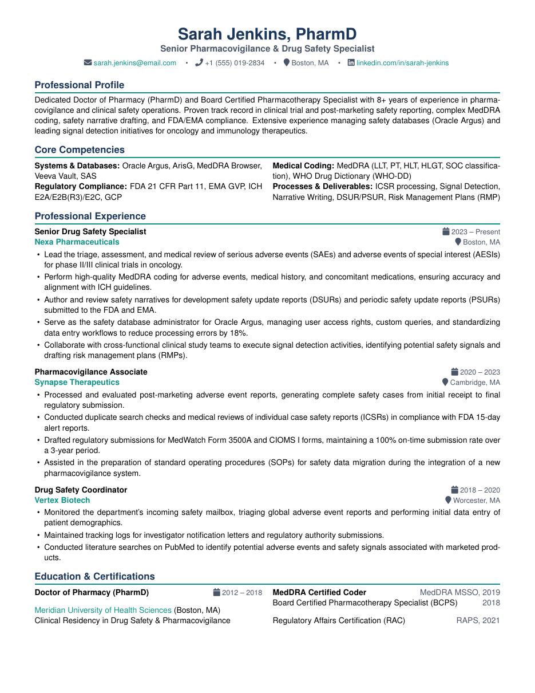</a><br><b>Pharmacovigilance Specialist Resume</b><br><a href="https://letx.app/templates/cvs-resumes/pharmacovigilance-specialist-resume">Open in LetX</a> · <a href="./cvs-resumes/pharmacovigilance-specialist-resume">Source</a></td>
</tr>
<tr>
<td width="33%" valign="top" align="center"><a href="https://letx.app/templates/cvs-resumes/phd-candidate-cv">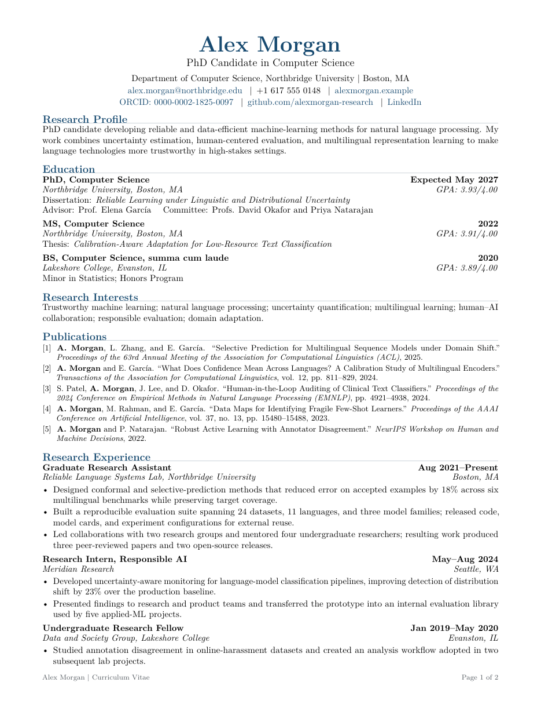</a><br><b>PhD Candidate CV</b><br><a href="https://letx.app/templates/cvs-resumes/phd-candidate-cv">Open in LetX</a> · <a href="./cvs-resumes/phd-candidate-cv">Source</a></td>
<td width="33%" valign="top" align="center"><a href="https://letx.app/templates/cvs-resumes/photographer-portfolio-resume"></a><br><b>Photographer Portfolio Resume</b><br><a href="https://letx.app/templates/cvs-resumes/photographer-portfolio-resume">Open in LetX</a> · <a href="./cvs-resumes/photographer-portfolio-resume">Source</a></td>
<td width="33%" valign="top" align="center"><a href="https://letx.app/templates/cvs-resumes/physical-therapist-resume">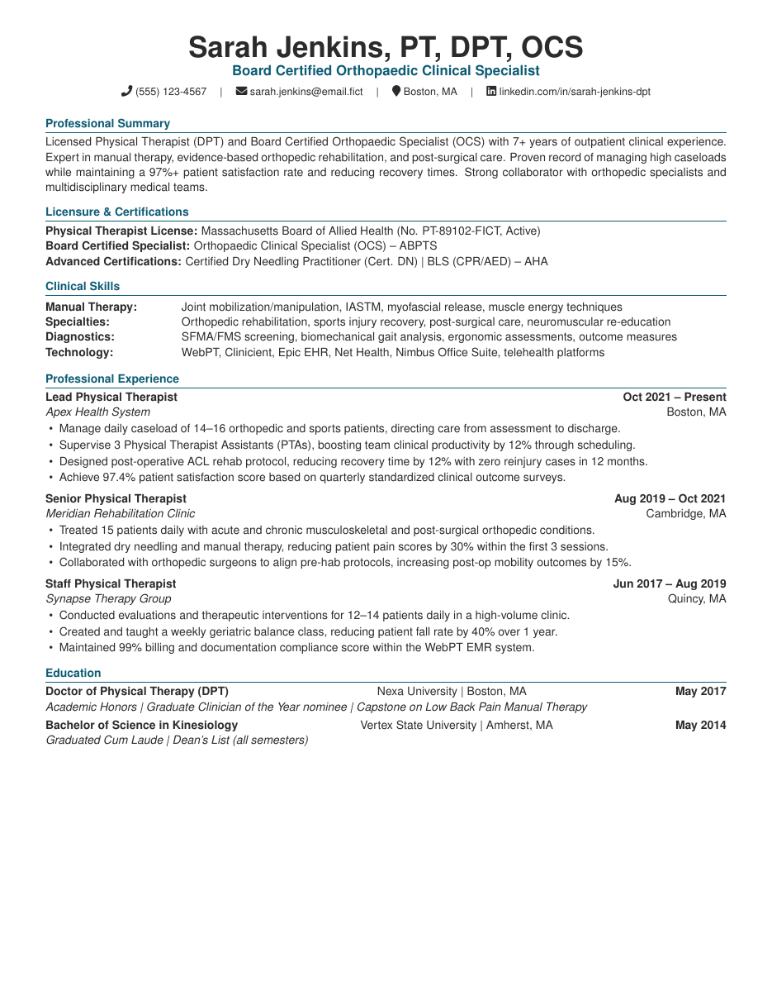</a><br><b>Physical Therapist Resume</b><br><a href="https://letx.app/templates/cvs-resumes/physical-therapist-resume">Open in LetX</a> · <a href="./cvs-resumes/physical-therapist-resume">Source</a></td>
</tr>
<tr>
<td width="33%" valign="top" align="center"><a href="https://letx.app/templates/cvs-resumes/pilot-aviation-resume"></a><br><b>Pilot / Aviation Resume</b><br><a href="https://letx.app/templates/cvs-resumes/pilot-aviation-resume">Open in LetX</a> · <a href="./cvs-resumes/pilot-aviation-resume">Source</a></td>
<td width="33%" valign="top" align="center"><a href="https://letx.app/templates/cvs-resumes/plumber-trade-resume">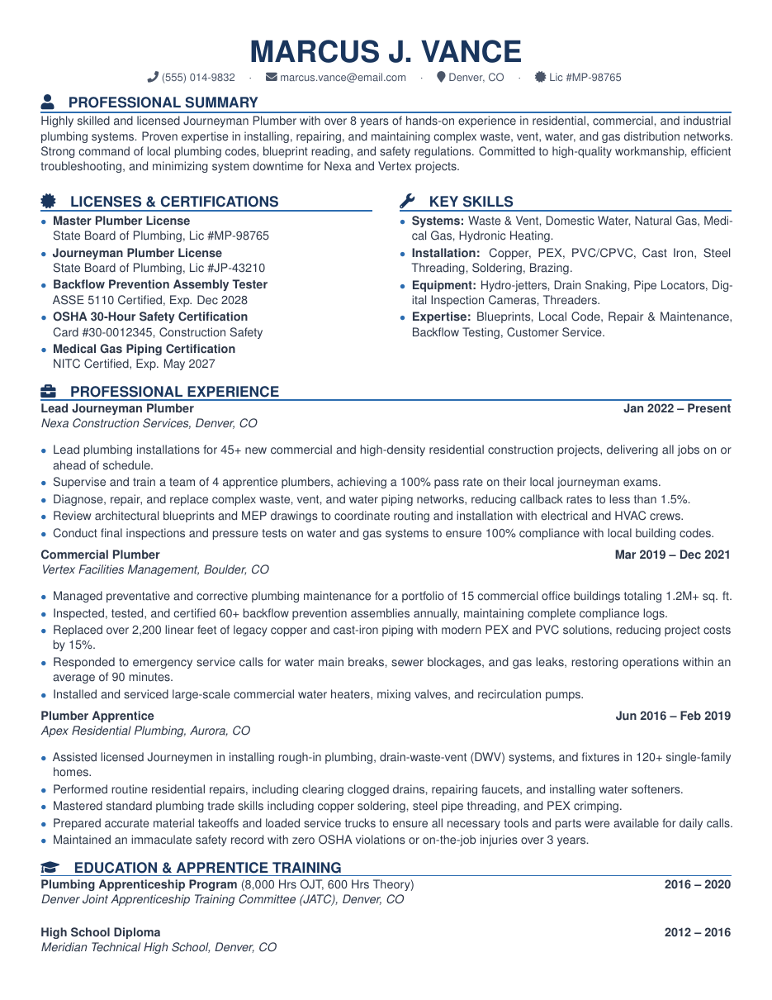</a><br><b>Plumber Trade Resume</b><br><a href="https://letx.app/templates/cvs-resumes/plumber-trade-resume">Open in LetX</a> · <a href="./cvs-resumes/plumber-trade-resume">Source</a></td>
<td width="33%" valign="top" align="center"><a href="https://letx.app/templates/cvs-resumes/police-officer-resume">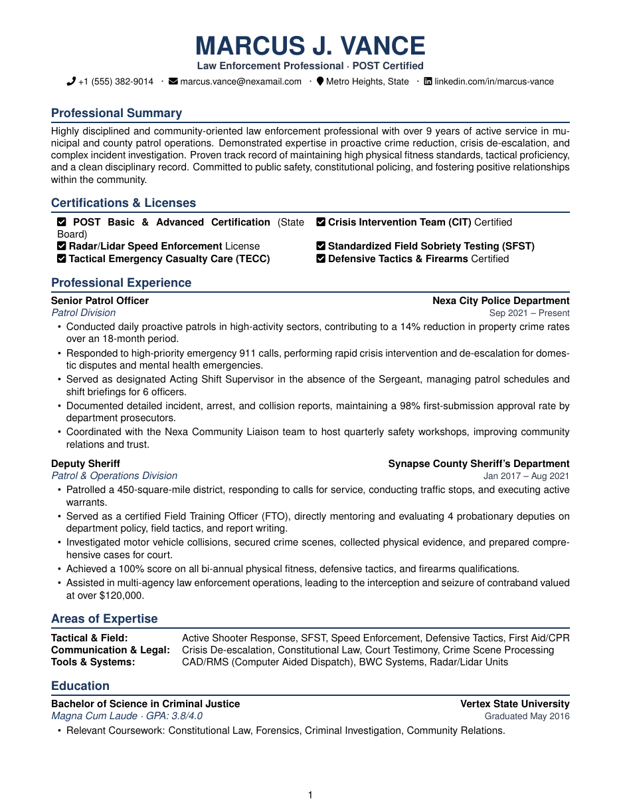</a><br><b>Police Officer Resume</b><br><a href="https://letx.app/templates/cvs-resumes/police-officer-resume">Open in LetX</a> · <a href="./cvs-resumes/police-officer-resume">Source</a></td>
</tr>
<tr>
<td width="33%" valign="top" align="center"><a href="https://letx.app/templates/cvs-resumes/polish-zyciorys-cv">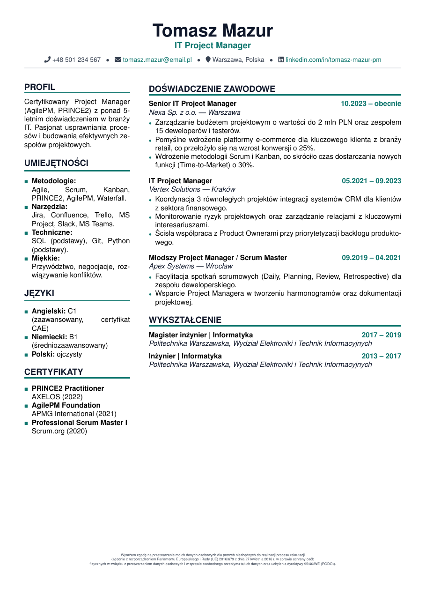</a><br><b>Polish Zyciorys CV</b><br><a href="https://letx.app/templates/cvs-resumes/polish-zyciorys-cv">Open in LetX</a> · <a href="./cvs-resumes/polish-zyciorys-cv">Source</a></td>
<td width="33%" valign="top" align="center"><a href="https://letx.app/templates/cvs-resumes/postdoc-academic-cv"></a><br><b>Postdoctoral Researcher CV</b><br><a href="https://letx.app/templates/cvs-resumes/postdoc-academic-cv">Open in LetX</a> · <a href="./cvs-resumes/postdoc-academic-cv">Source</a></td>
<td width="33%" valign="top" align="center"><a href="https://letx.app/templates/cvs-resumes/procurement-specialist-resume">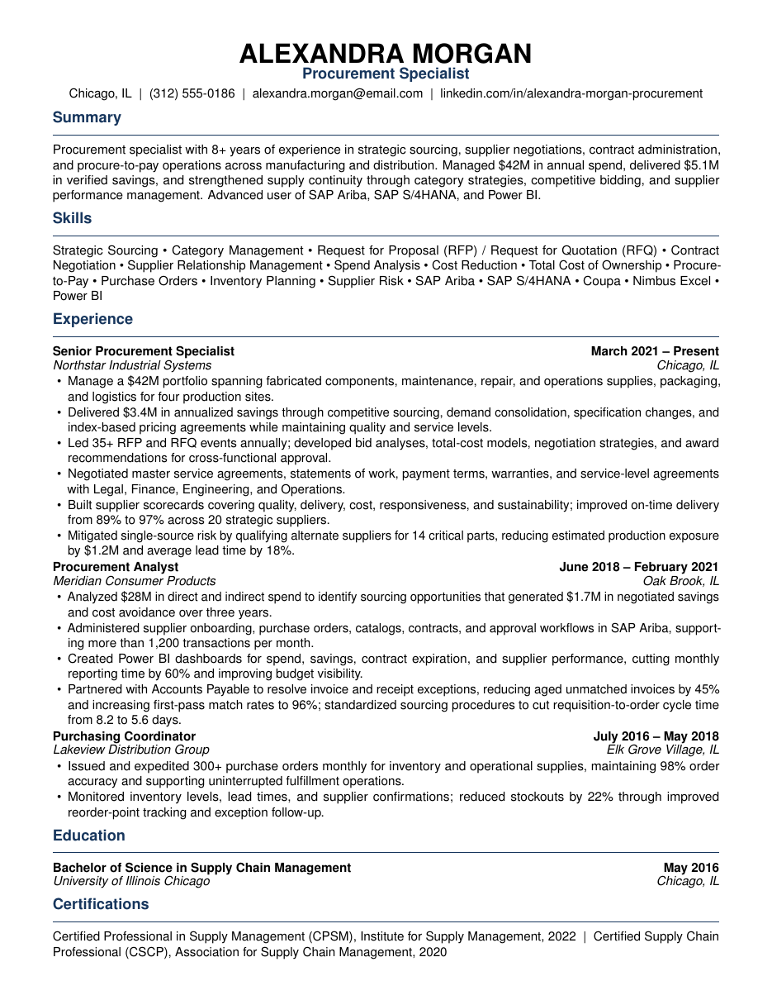</a><br><b>Procurement Specialist Resume</b><br><a href="https://letx.app/templates/cvs-resumes/procurement-specialist-resume">Open in LetX</a> · <a href="./cvs-resumes/procurement-specialist-resume">Source</a></td>
</tr>
<tr>
<td width="33%" valign="top" align="center"><a href="https://letx.app/templates/cvs-resumes/product-designer-resume">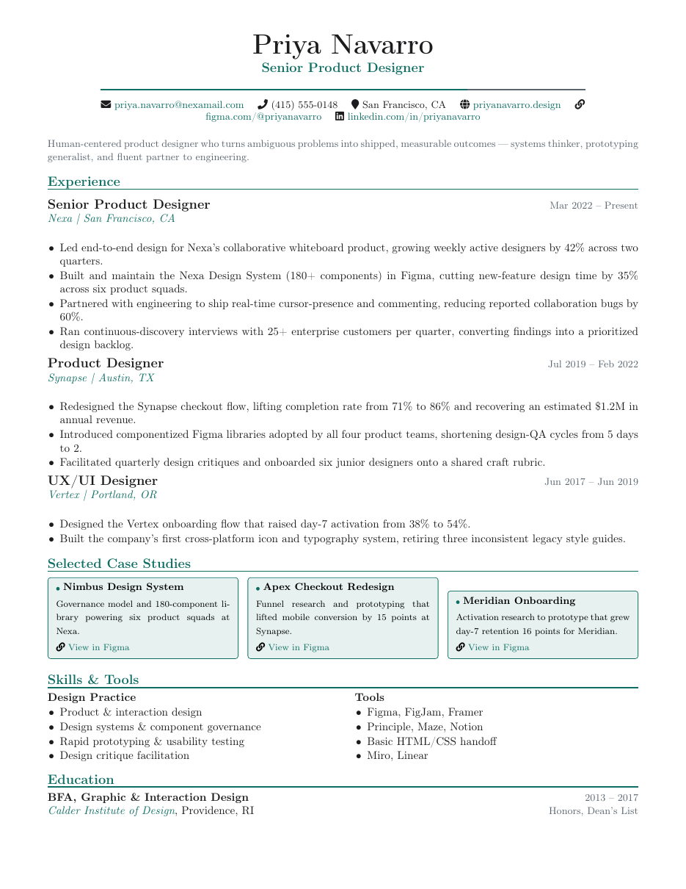</a><br><b>Product Designer Resume</b><br><a href="https://letx.app/templates/cvs-resumes/product-designer-resume">Open in LetX</a> · <a href="./cvs-resumes/product-designer-resume">Source</a></td>
<td width="33%" valign="top" align="center"><a href="https://letx.app/templates/cvs-resumes/product-manager-resume"></a><br><b>Product Manager Resume</b><br><a href="https://letx.app/templates/cvs-resumes/product-manager-resume">Open in LetX</a> · <a href="./cvs-resumes/product-manager-resume">Source</a></td>
<td width="33%" valign="top" align="center"><a href="https://letx.app/templates/cvs-resumes/project-manager-resume"></a><br><b>Project Manager Resume</b><br><a href="https://letx.app/templates/cvs-resumes/project-manager-resume">Open in LetX</a> · <a href="./cvs-resumes/project-manager-resume">Source</a></td>
</tr>
<tr>
<td width="33%" valign="top" align="center"><a href="https://letx.app/templates/cvs-resumes/public-relations-specialist-resume">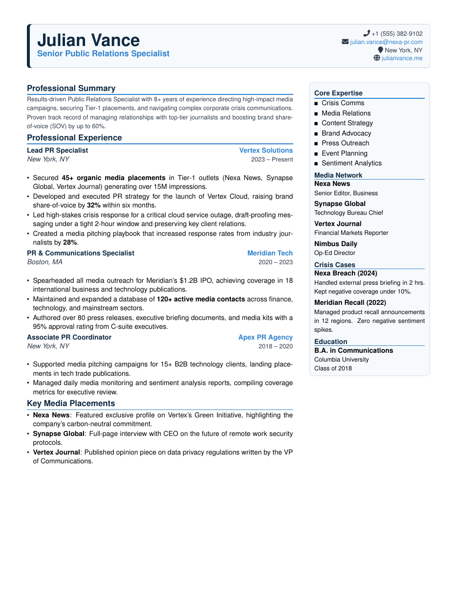</a><br><b>Public Relations (PR) Specialist Resume</b><br><a href="https://letx.app/templates/cvs-resumes/public-relations-specialist-resume">Open in LetX</a> · <a href="./cvs-resumes/public-relations-specialist-resume">Source</a></td>
<td width="33%" valign="top" align="center"><a href="https://letx.app/templates/cvs-resumes/quantitative-developer-resume">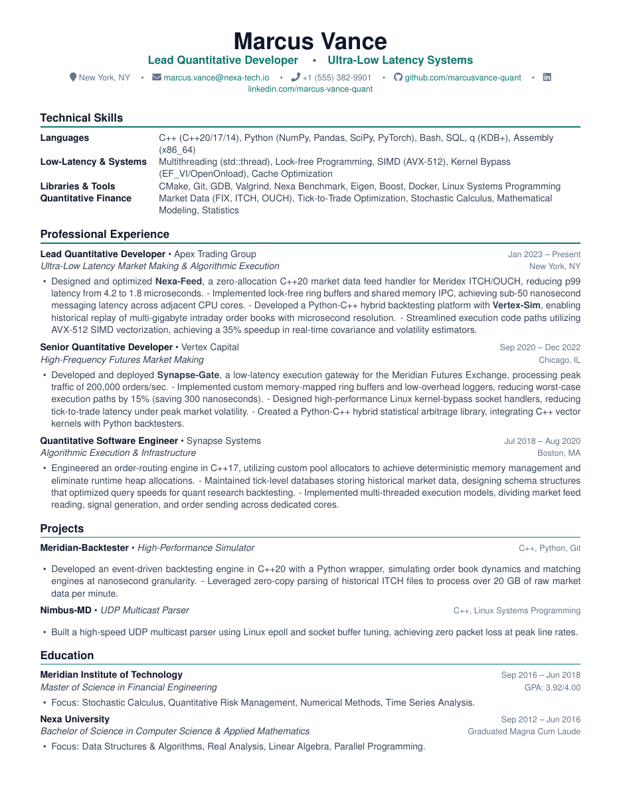</a><br><b>Quantitative Developer Resume</b><br><a href="https://letx.app/templates/cvs-resumes/quantitative-developer-resume">Open in LetX</a> · <a href="./cvs-resumes/quantitative-developer-resume">Source</a></td>
<td width="33%" valign="top" align="center"><a href="https://letx.app/templates/cvs-resumes/radiologic-technologist-resume"></a><br><b>Radiologic Technologist Resume</b><br><a href="https://letx.app/templates/cvs-resumes/radiologic-technologist-resume">Open in LetX</a> · <a href="./cvs-resumes/radiologic-technologist-resume">Source</a></td>
</tr>
<tr>
<td width="33%" valign="top" align="center"><a href="https://letx.app/templates/cvs-resumes/real-estate-agent-resume"></a><br><b>Real Estate Agent Resume</b><br><a href="https://letx.app/templates/cvs-resumes/real-estate-agent-resume">Open in LetX</a> · <a href="./cvs-resumes/real-estate-agent-resume">Source</a></td>
<td width="33%" valign="top" align="center"><a href="https://letx.app/templates/cvs-resumes/retail-manager-resume">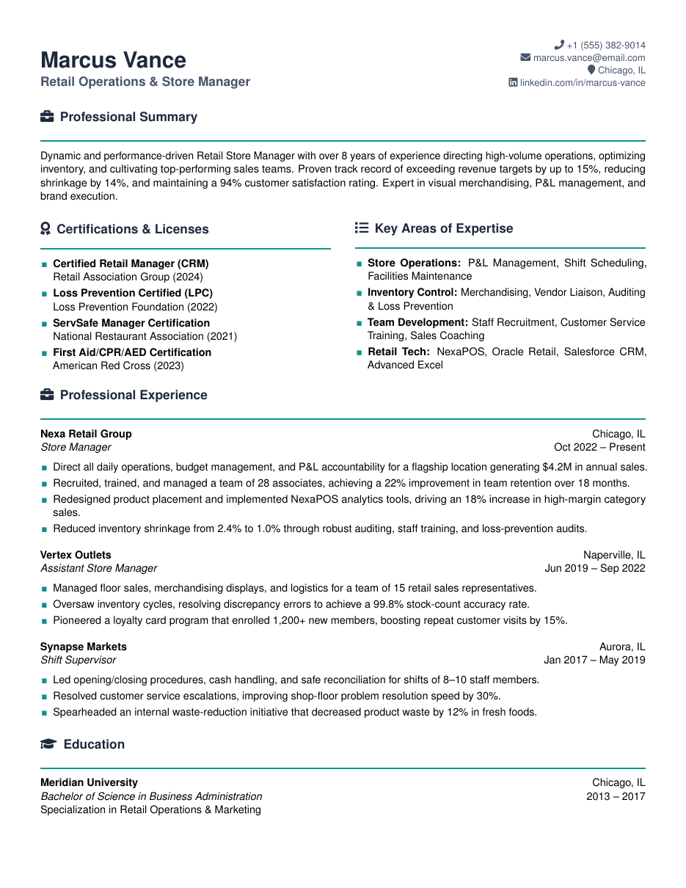</a><br><b>Retail Manager Resume</b><br><a href="https://letx.app/templates/cvs-resumes/retail-manager-resume">Open in LetX</a> · <a href="./cvs-resumes/retail-manager-resume">Source</a></td>
<td width="33%" valign="top" align="center"><a href="https://letx.app/templates/cvs-resumes/robotics-engineer-resume">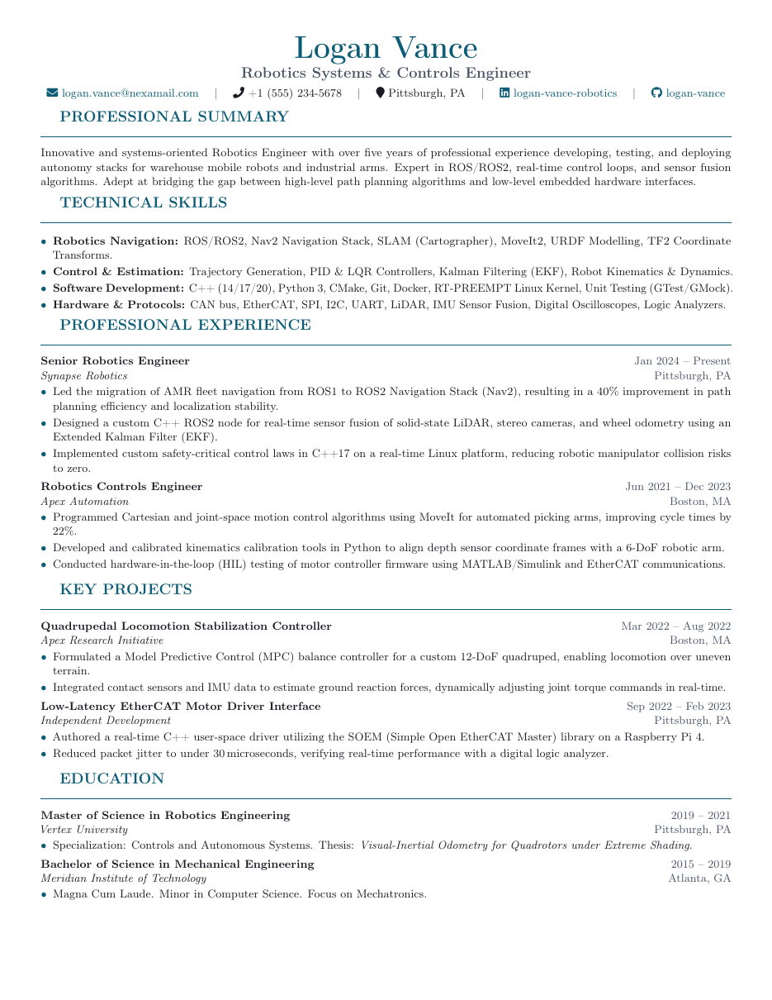</a><br><b>Robotics Engineer Resume</b><br><a href="https://letx.app/templates/cvs-resumes/robotics-engineer-resume">Open in LetX</a> · <a href="./cvs-resumes/robotics-engineer-resume">Source</a></td>
</tr>
<tr>
<td width="33%" valign="top" align="center"><a href="https://letx.app/templates/cvs-resumes/russian-resume">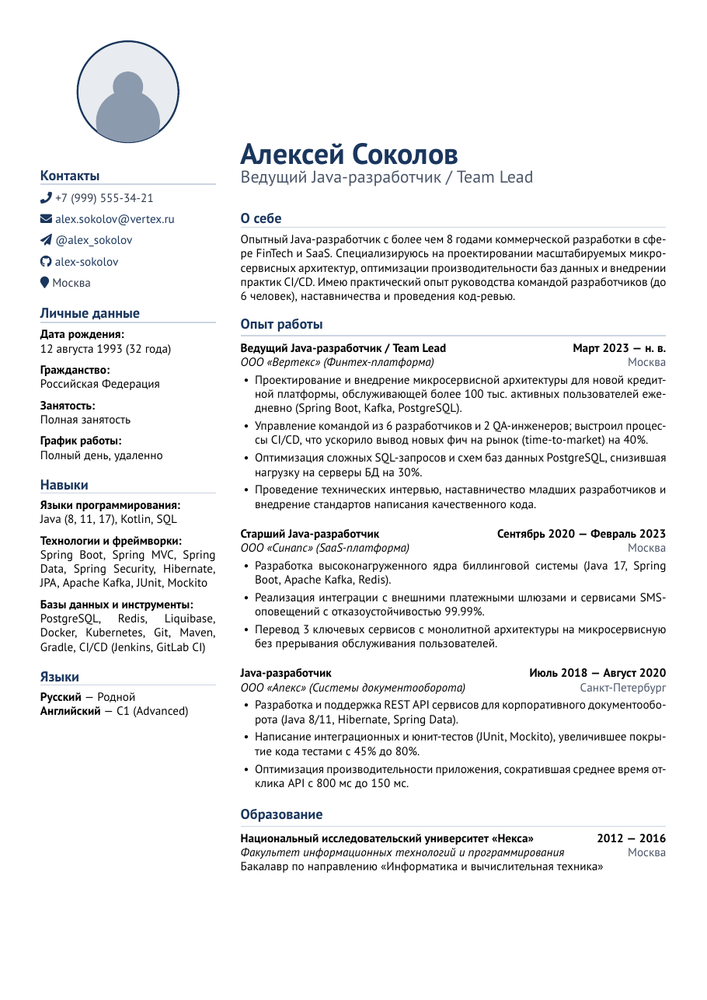</a><br><b>Russian Resume</b><br><a href="https://letx.app/templates/cvs-resumes/russian-resume">Open in LetX</a> · <a href="./cvs-resumes/russian-resume">Source</a></td>
<td width="33%" valign="top" align="center"><a href="https://letx.app/templates/cvs-resumes/sales-engineer-resume">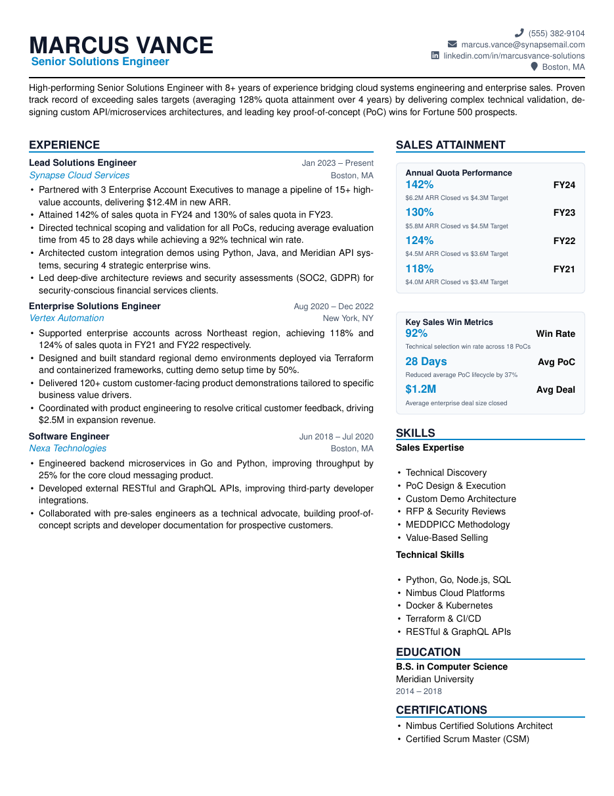</a><br><b>Sales Engineer Resume</b><br><a href="https://letx.app/templates/cvs-resumes/sales-engineer-resume">Open in LetX</a> · <a href="./cvs-resumes/sales-engineer-resume">Source</a></td>
<td width="33%" valign="top" align="center"><a href="https://letx.app/templates/cvs-resumes/saudi-gulf-standard-cv">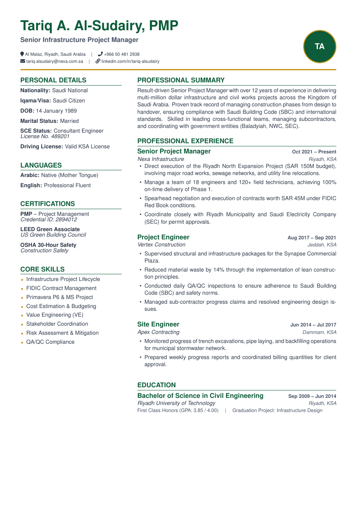</a><br><b>Saudi Gulf Standard CV</b><br><a href="https://letx.app/templates/cvs-resumes/saudi-gulf-standard-cv">Open in LetX</a> · <a href="./cvs-resumes/saudi-gulf-standard-cv">Source</a></td>
</tr>
<tr>
<td width="33%" valign="top" align="center"><a href="https://letx.app/templates/cvs-resumes/school-counselor-resume">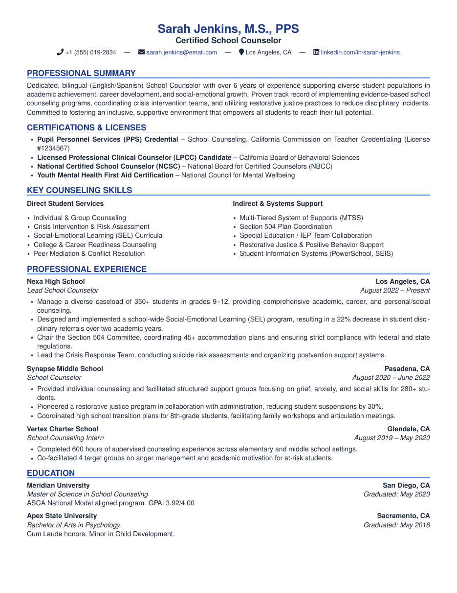</a><br><b>School Counselor Resume</b><br><a href="https://letx.app/templates/cvs-resumes/school-counselor-resume">Open in LetX</a> · <a href="./cvs-resumes/school-counselor-resume">Source</a></td>
<td width="33%" valign="top" align="center"><a href="https://letx.app/templates/cvs-resumes/school-principal-resume">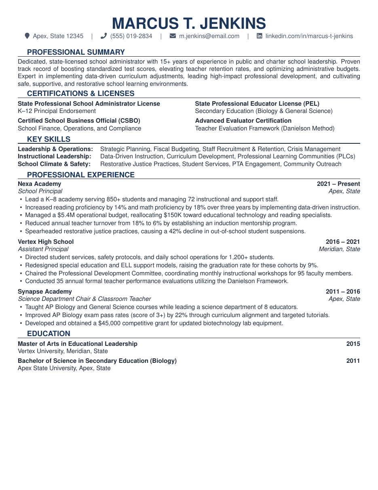</a><br><b>School Principal Resume</b><br><a href="https://letx.app/templates/cvs-resumes/school-principal-resume">Open in LetX</a> · <a href="./cvs-resumes/school-principal-resume">Source</a></td>
<td width="33%" valign="top" align="center"><a href="https://letx.app/templates/cvs-resumes/scrum-master-agile-coach-resume">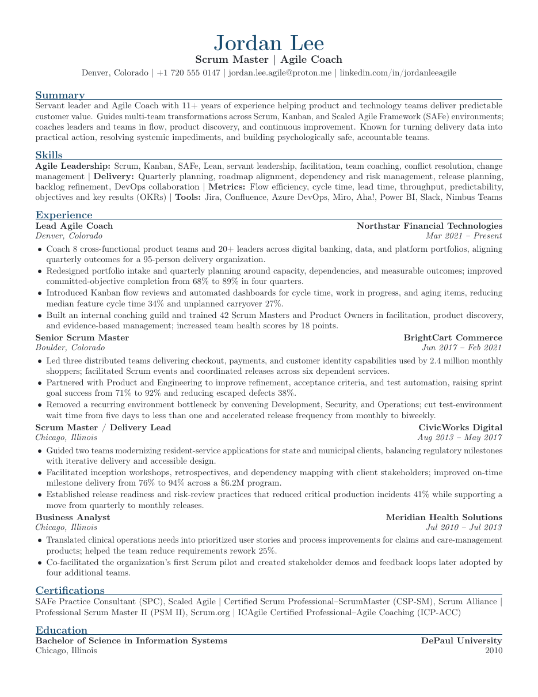</a><br><b>Scrum Master & Agile Coach Resume</b><br><a href="https://letx.app/templates/cvs-resumes/scrum-master-agile-coach-resume">Open in LetX</a> · <a href="./cvs-resumes/scrum-master-agile-coach-resume">Source</a></td>
</tr>
<tr>
<td width="33%" valign="top" align="center"><a href="https://letx.app/templates/cvs-resumes/seo-specialist-resume">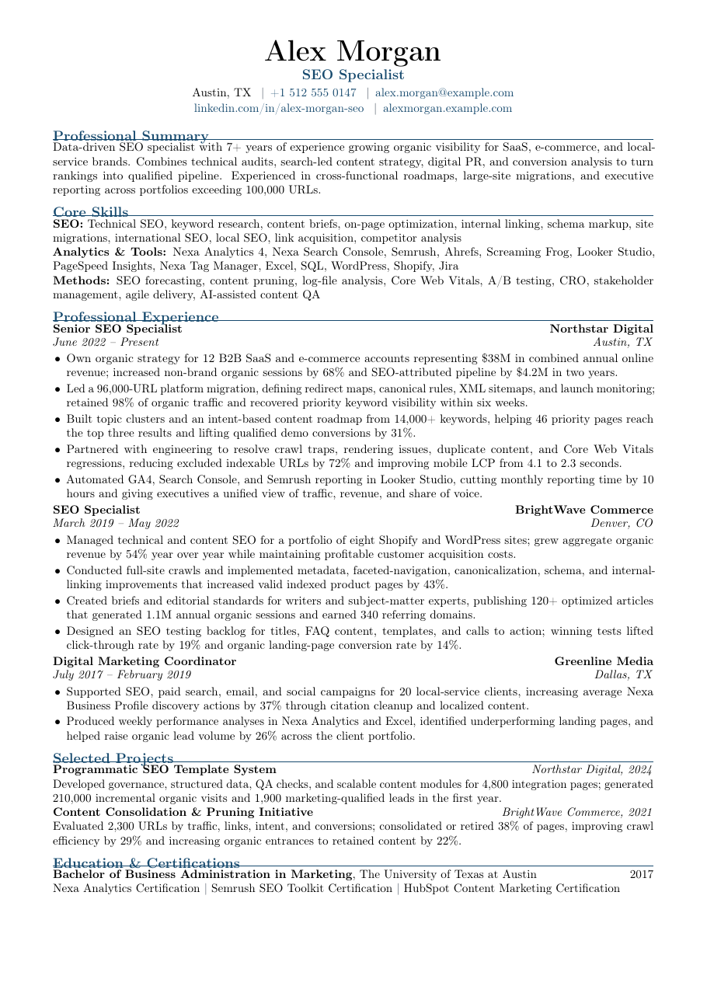</a><br><b>SEO Specialist Resume</b><br><a href="https://letx.app/templates/cvs-resumes/seo-specialist-resume">Open in LetX</a> · <a href="./cvs-resumes/seo-specialist-resume">Source</a></td>
<td width="33%" valign="top" align="center"><a href="https://letx.app/templates/cvs-resumes/singapore-standard-resume"></a><br><b>Singapore Standard Resume</b><br><a href="https://letx.app/templates/cvs-resumes/singapore-standard-resume">Open in LetX</a> · <a href="./cvs-resumes/singapore-standard-resume">Source</a></td>
<td width="33%" valign="top" align="center"><a href="https://letx.app/templates/cvs-resumes/site-reliability-engineer-resume">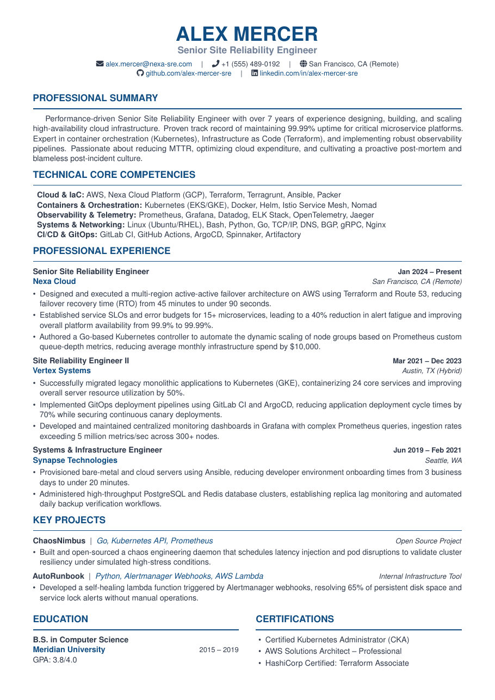</a><br><b>Site Reliability Engineer (SRE) Resume</b><br><a href="https://letx.app/templates/cvs-resumes/site-reliability-engineer-resume">Open in LetX</a> · <a href="./cvs-resumes/site-reliability-engineer-resume">Source</a></td>
</tr>
<tr>
<td width="33%" valign="top" align="center"><a href="https://letx.app/templates/cvs-resumes/social-worker-resume">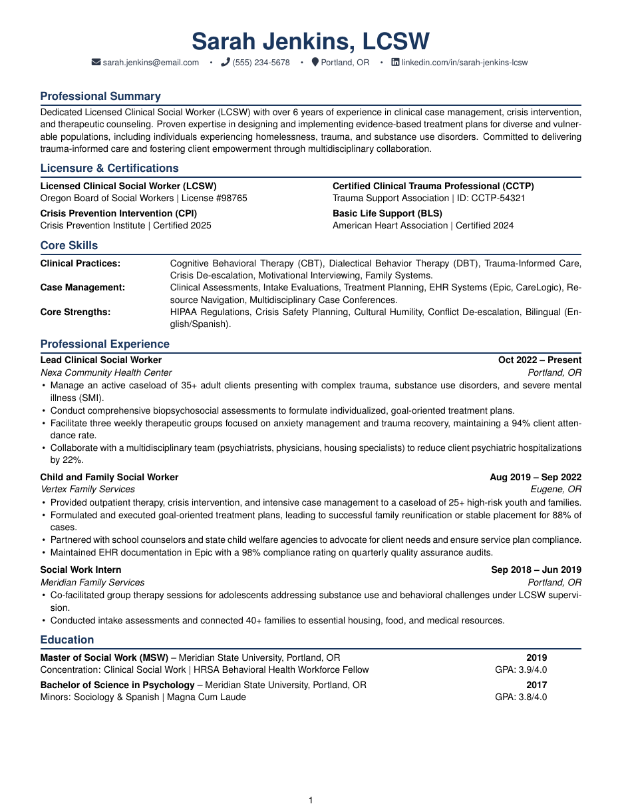</a><br><b>Social Worker Resume</b><br><a href="https://letx.app/templates/cvs-resumes/social-worker-resume">Open in LetX</a> · <a href="./cvs-resumes/social-worker-resume">Source</a></td>
<td width="33%" valign="top" align="center"><a href="https://letx.app/templates/cvs-resumes/south-african-cv"></a><br><b>South African CV</b><br><a href="https://letx.app/templates/cvs-resumes/south-african-cv">Open in LetX</a> · <a href="./cvs-resumes/south-african-cv">Source</a></td>
<td width="33%" valign="top" align="center"><a href="https://letx.app/templates/cvs-resumes/spanish-curriculum-vitae">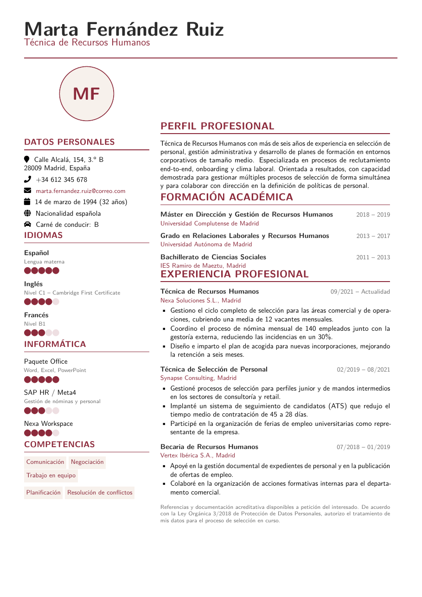</a><br><b>Spanish Curriculum Vitae</b><br><a href="https://letx.app/templates/cvs-resumes/spanish-curriculum-vitae">Open in LetX</a> · <a href="./cvs-resumes/spanish-curriculum-vitae">Source</a></td>
</tr>
<tr>
<td width="33%" valign="top" align="center"><a href="https://letx.app/templates/cvs-resumes/speech-language-pathologist-resume">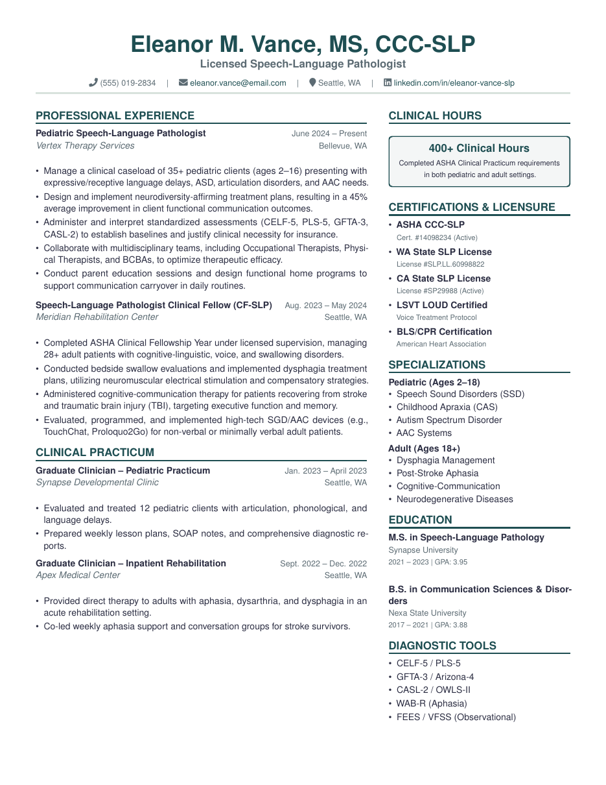</a><br><b>Speech-Language Pathologist Resume</b><br><a href="https://letx.app/templates/cvs-resumes/speech-language-pathologist-resume">Open in LetX</a> · <a href="./cvs-resumes/speech-language-pathologist-resume">Source</a></td>
<td width="33%" valign="top" align="center"><a href="https://letx.app/templates/cvs-resumes/structural-engineer-resume">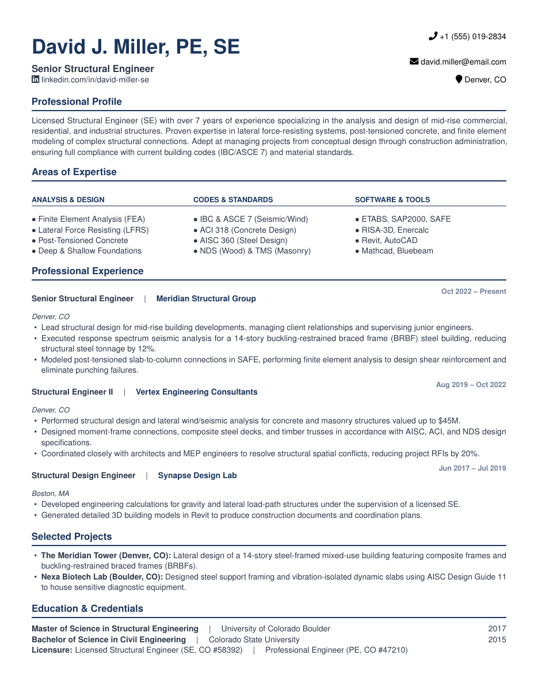</a><br><b>Structural Engineer Resume</b><br><a href="https://letx.app/templates/cvs-resumes/structural-engineer-resume">Open in LetX</a> · <a href="./cvs-resumes/structural-engineer-resume">Source</a></td>
<td width="33%" valign="top" align="center"><a href="https://letx.app/templates/cvs-resumes/student-resume-no-work-experience">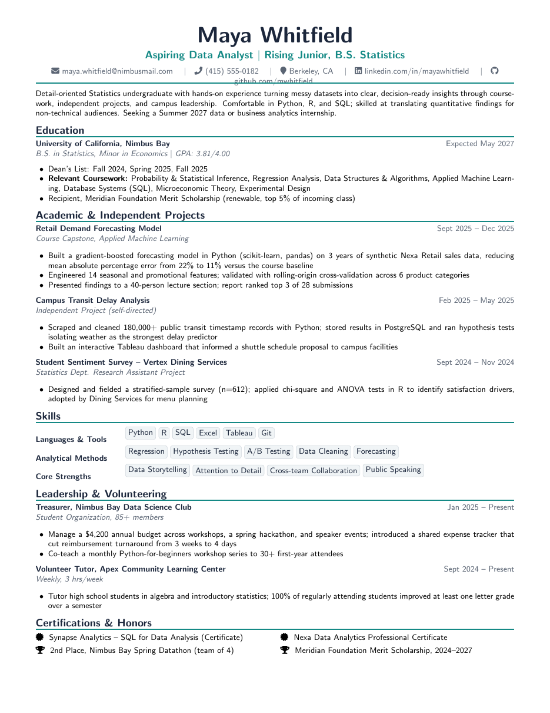</a><br><b>Student Resume with No Work Experience</b><br><a href="https://letx.app/templates/cvs-resumes/student-resume-no-work-experience">Open in LetX</a> · <a href="./cvs-resumes/student-resume-no-work-experience">Source</a></td>
</tr>
<tr>
<td width="33%" valign="top" align="center"><a href="https://letx.app/templates/cvs-resumes/supply-chain-analyst-resume"></a><br><b>Supply Chain Analyst Resume</b><br><a href="https://letx.app/templates/cvs-resumes/supply-chain-analyst-resume">Open in LetX</a> · <a href="./cvs-resumes/supply-chain-analyst-resume">Source</a></td>
<td width="33%" valign="top" align="center"><a href="https://letx.app/templates/cvs-resumes/supply-chain-planner-resume">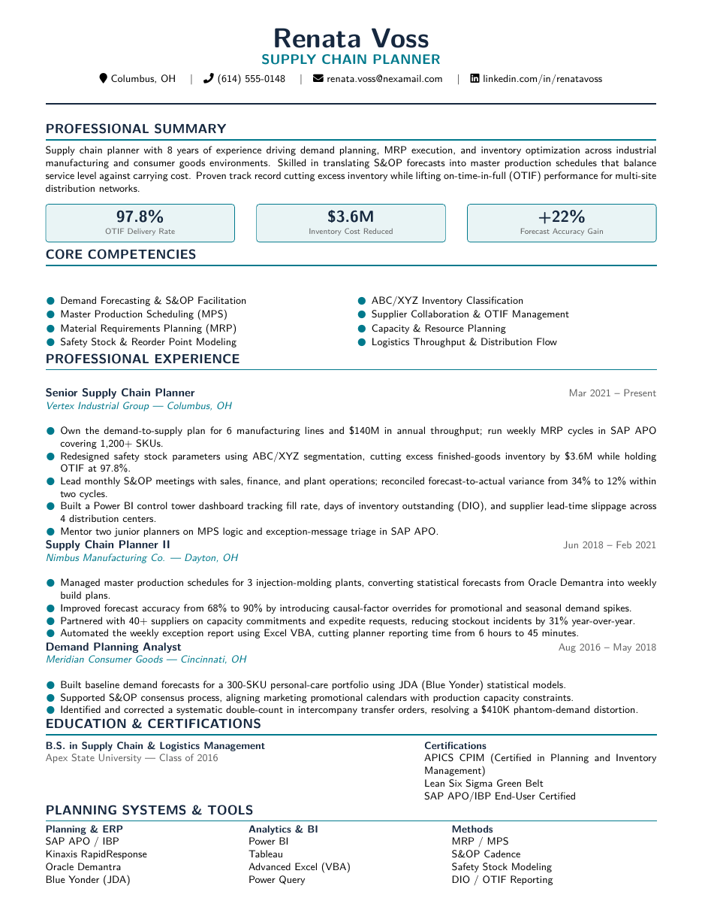</a><br><b>Supply Chain Planner Resume</b><br><a href="https://letx.app/templates/cvs-resumes/supply-chain-planner-resume">Open in LetX</a> · <a href="./cvs-resumes/supply-chain-planner-resume">Source</a></td>
<td width="33%" valign="top" align="center"><a href="https://letx.app/templates/cvs-resumes/swedish-meritforteckning-cv"></a><br><b>Swedish Meritforteckning CV</b><br><a href="https://letx.app/templates/cvs-resumes/swedish-meritforteckning-cv">Open in LetX</a> · <a href="./cvs-resumes/swedish-meritforteckning-cv">Source</a></td>
</tr>
<tr>
<td width="33%" valign="top" align="center"><a href="https://letx.app/templates/cvs-resumes/swiss-standard-cv"></a><br><b>Swiss Standard CV</b><br><a href="https://letx.app/templates/cvs-resumes/swiss-standard-cv">Open in LetX</a> · <a href="./cvs-resumes/swiss-standard-cv">Source</a></td>
<td width="33%" valign="top" align="center"><a href="https://letx.app/templates/cvs-resumes/teacher-educator-resume"></a><br><b>Teacher / Educator Resume</b><br><a href="https://letx.app/templates/cvs-resumes/teacher-educator-resume">Open in LetX</a> · <a href="./cvs-resumes/teacher-educator-resume">Source</a></td>
<td width="33%" valign="top" align="center"><a href="https://letx.app/templates/cvs-resumes/technical-recruiter-resume">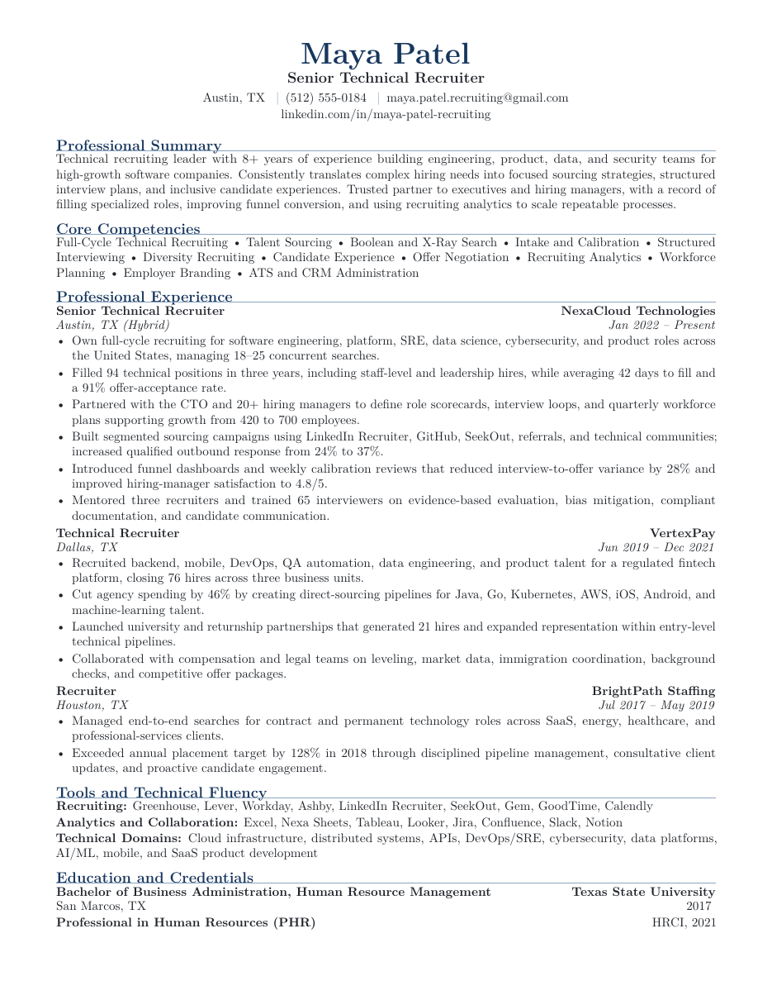</a><br><b>Technical Recruiter Resume</b><br><a href="https://letx.app/templates/cvs-resumes/technical-recruiter-resume">Open in LetX</a> · <a href="./cvs-resumes/technical-recruiter-resume">Source</a></td>
</tr>
<tr>
<td width="33%" valign="top" align="center"><a href="https://letx.app/templates/cvs-resumes/technical-writer-resume">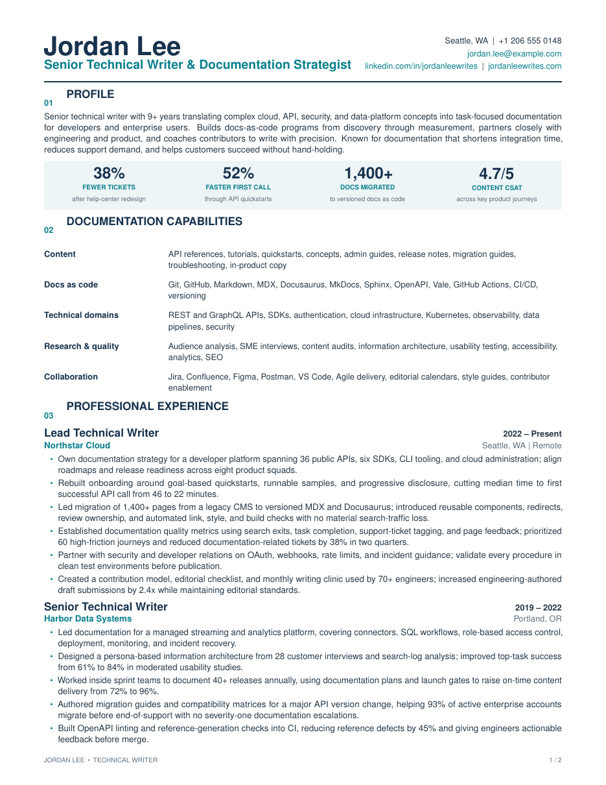</a><br><b>Technical Writer Resume</b><br><a href="https://letx.app/templates/cvs-resumes/technical-writer-resume">Open in LetX</a> · <a href="./cvs-resumes/technical-writer-resume">Source</a></td>
<td width="33%" valign="top" align="center"><a href="https://letx.app/templates/cvs-resumes/translator-and-interpreter-resume">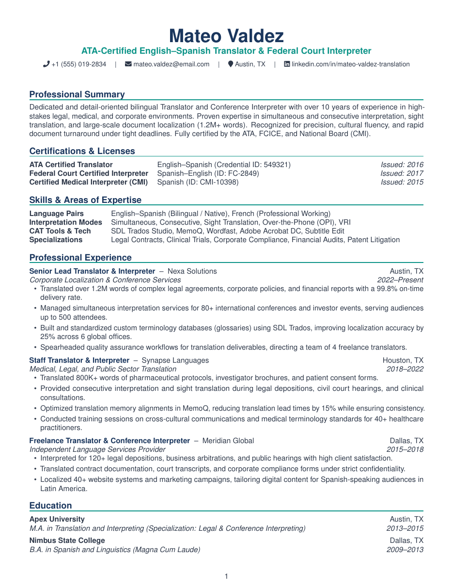</a><br><b>Translator and Interpreter Resume</b><br><a href="https://letx.app/templates/cvs-resumes/translator-and-interpreter-resume">Open in LetX</a> · <a href="./cvs-resumes/translator-and-interpreter-resume">Source</a></td>
<td width="33%" valign="top" align="center"><a href="https://letx.app/templates/cvs-resumes/truck-driver-cdl-resume">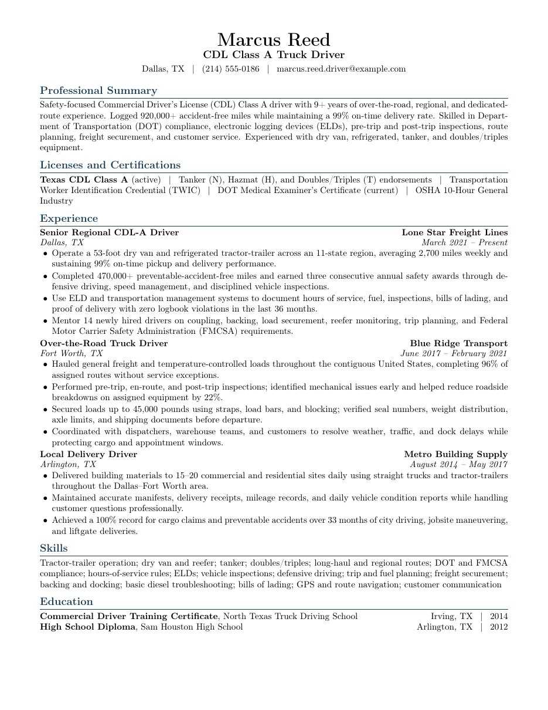</a><br><b>Truck Driver CDL Resume</b><br><a href="https://letx.app/templates/cvs-resumes/truck-driver-cdl-resume">Open in LetX</a> · <a href="./cvs-resumes/truck-driver-cdl-resume">Source</a></td>
</tr>
<tr>
<td width="33%" valign="top" align="center"><a href="https://letx.app/templates/cvs-resumes/turkish-ozgecmis-cv"></a><br><b>Turkish Ozgecmis CV</b><br><a href="https://letx.app/templates/cvs-resumes/turkish-ozgecmis-cv">Open in LetX</a> · <a href="./cvs-resumes/turkish-ozgecmis-cv">Source</a></td>
<td width="33%" valign="top" align="center"><a href="https://letx.app/templates/cvs-resumes/two-column-resume"></a><br><b>Two-Column Resume</b><br><a href="https://letx.app/templates/cvs-resumes/two-column-resume">Open in LetX</a> · <a href="./cvs-resumes/two-column-resume">Source</a></td>
<td width="33%" valign="top" align="center"><a href="https://letx.app/templates/cvs-resumes/ui-ux-researcher-resume">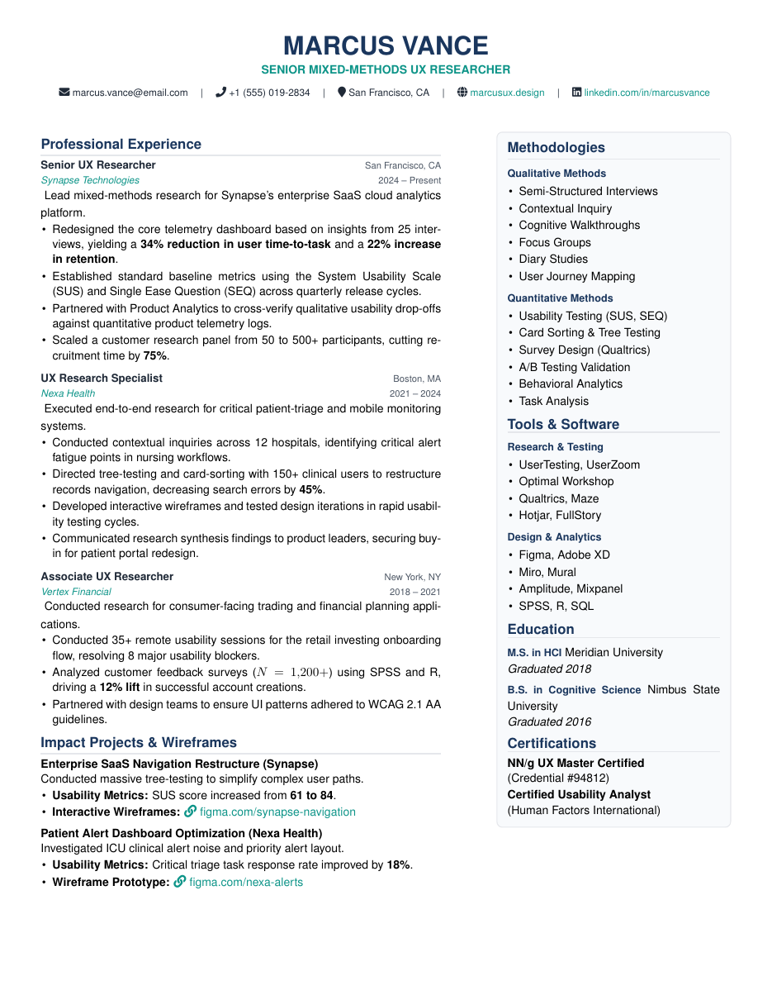</a><br><b>UI/UX Researcher Resume</b><br><a href="https://letx.app/templates/cvs-resumes/ui-ux-researcher-resume">Open in LetX</a> · <a href="./cvs-resumes/ui-ux-researcher-resume">Source</a></td>
</tr>
<tr>
<td width="33%" valign="top" align="center"><a href="https://letx.app/templates/cvs-resumes/uk-standard-cv"></a><br><b>UK Standard CV</b><br><a href="https://letx.app/templates/cvs-resumes/uk-standard-cv">Open in LetX</a> · <a href="./cvs-resumes/uk-standard-cv">Source</a></td>
<td width="33%" valign="top" align="center"><a href="https://letx.app/templates/cvs-resumes/undergraduate-research-assistant-cv">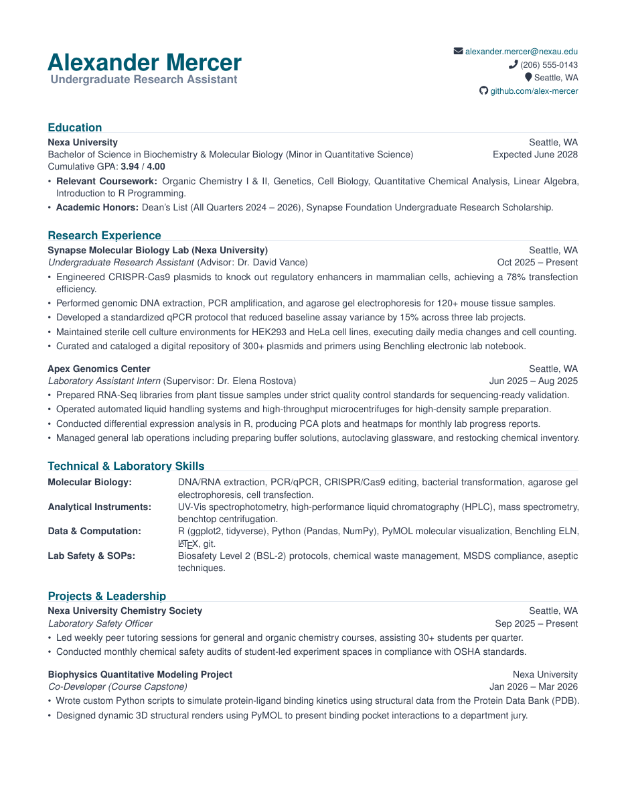</a><br><b>Undergraduate Research Assistant CV</b><br><a href="https://letx.app/templates/cvs-resumes/undergraduate-research-assistant-cv">Open in LetX</a> · <a href="./cvs-resumes/undergraduate-research-assistant-cv">Source</a></td>
<td width="33%" valign="top" align="center"><a href="https://letx.app/templates/cvs-resumes/ux-designer-resume"></a><br><b>UX Designer Resume</b><br><a href="https://letx.app/templates/cvs-resumes/ux-designer-resume">Open in LetX</a> · <a href="./cvs-resumes/ux-designer-resume">Source</a></td>
</tr>
<tr>
<td width="33%" valign="top" align="center"><a href="https://letx.app/templates/cvs-resumes/veterinary-technician-resume">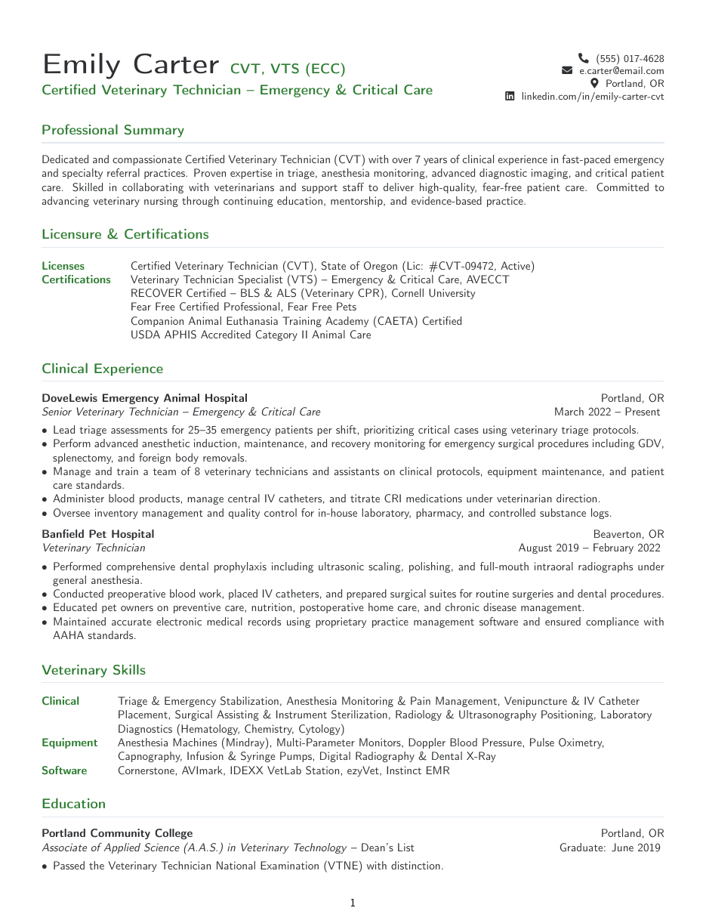</a><br><b>Veterinary Technician Resume</b><br><a href="https://letx.app/templates/cvs-resumes/veterinary-technician-resume">Open in LetX</a> · <a href="./cvs-resumes/veterinary-technician-resume">Source</a></td>
<td width="33%" valign="top" align="center"><a href="https://letx.app/templates/cvs-resumes/video-editor-motion-designer-resume">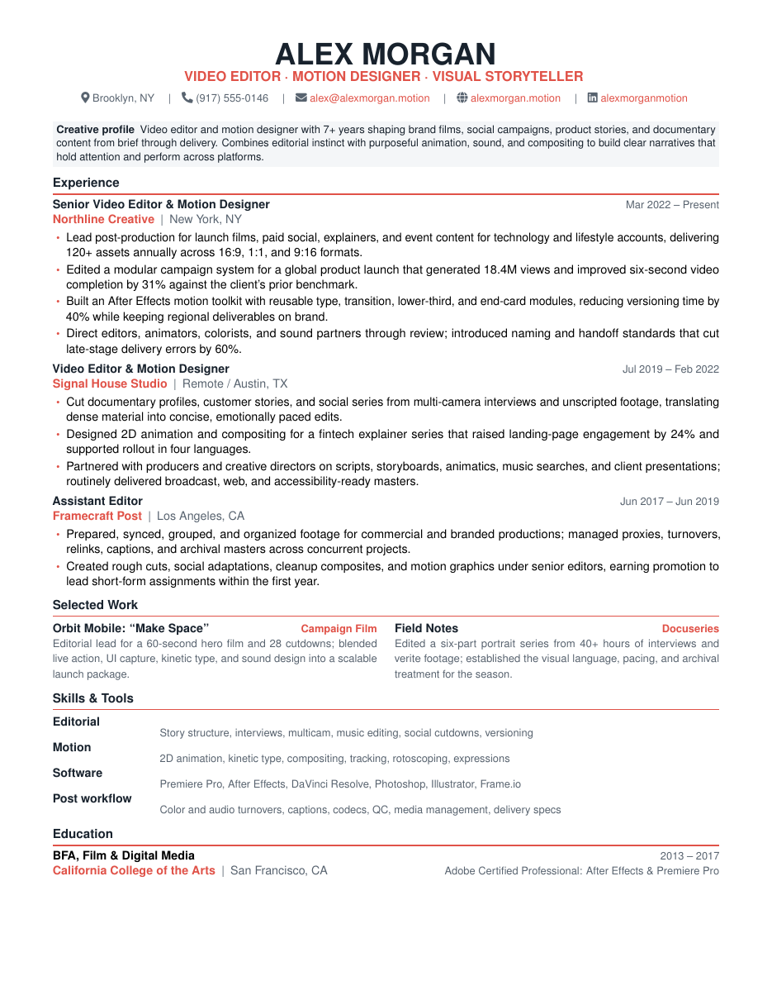</a><br><b>Video Editor & Motion Designer Resume</b><br><a href="https://letx.app/templates/cvs-resumes/video-editor-motion-designer-resume">Open in LetX</a> · <a href="./cvs-resumes/video-editor-motion-designer-resume">Source</a></td>
<td width="33%" valign="top" align="center"><a href="https://letx.app/templates/cvs-resumes/vlsi-design-engineer-resume">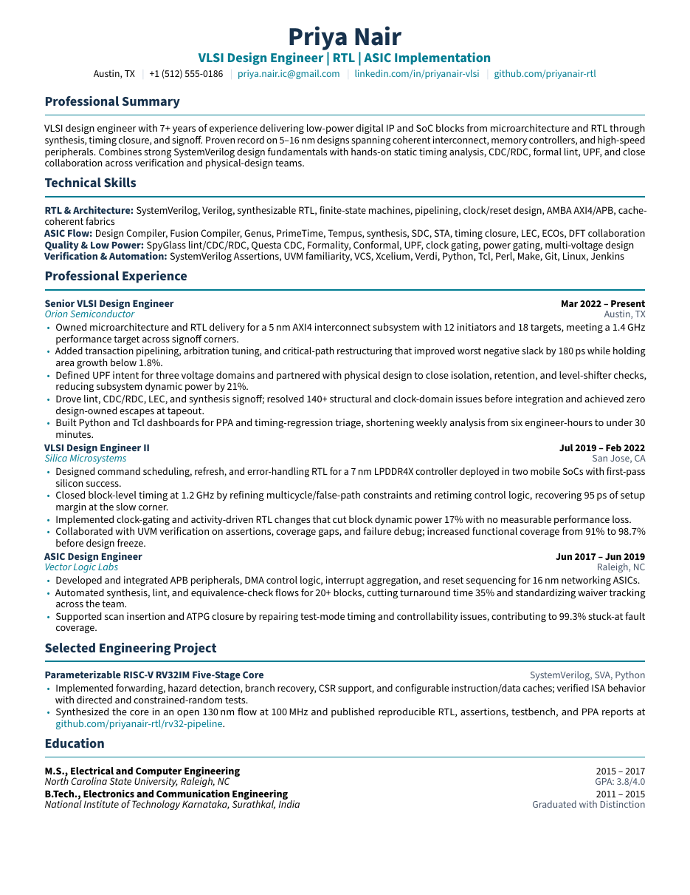</a><br><b>VLSI Design Engineer Resume</b><br><a href="https://letx.app/templates/cvs-resumes/vlsi-design-engineer-resume">Open in LetX</a> · <a href="./cvs-resumes/vlsi-design-engineer-resume">Source</a></td>
</tr>
<tr>
<td width="33%" valign="top" align="center"><a href="https://letx.app/templates/cvs-resumes/warehouse-and-logistics-resume"></a><br><b>Warehouse and Logistics Resume</b><br><a href="https://letx.app/templates/cvs-resumes/warehouse-and-logistics-resume">Open in LetX</a> · <a href="./cvs-resumes/warehouse-and-logistics-resume">Source</a></td>
<td width="33%" valign="top" align="center"><a href="https://letx.app/templates/cvs-resumes/welder-trade-resume">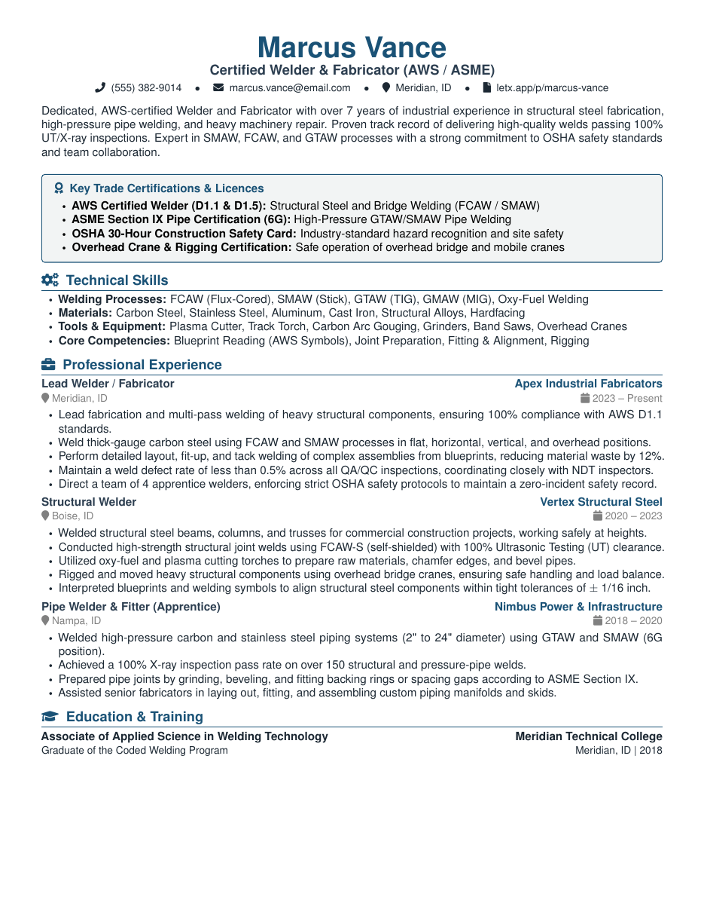</a><br><b>Welder Trade Resume</b><br><a href="https://letx.app/templates/cvs-resumes/welder-trade-resume">Open in LetX</a> · <a href="./cvs-resumes/welder-trade-resume">Source</a></td>
</tr>
</table>

### Academic Career (Statements, Applications)

22 templates. [Browse this category on LetX](https://letx.app/templates/academic-career)

<table>
<tr>
<td width="33%" valign="top" align="center"><a href="https://letx.app/templates/academic-career/co-op-work-term-report">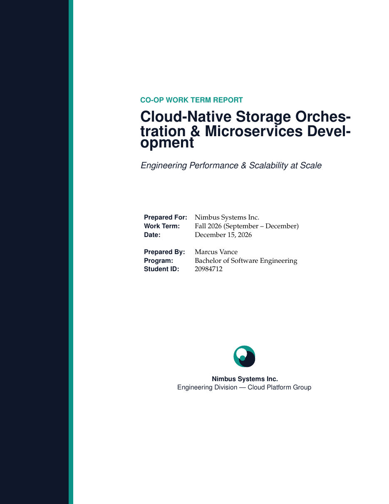</a><br><b>Co-op Work Term Report</b><br><a href="https://letx.app/templates/academic-career/co-op-work-term-report">Open in LetX</a> · <a href="./academic-career/co-op-work-term-report">Source</a></td>
<td width="33%" valign="top" align="center"><a href="https://letx.app/templates/academic-career/comprehensive-exam-answer-booklet">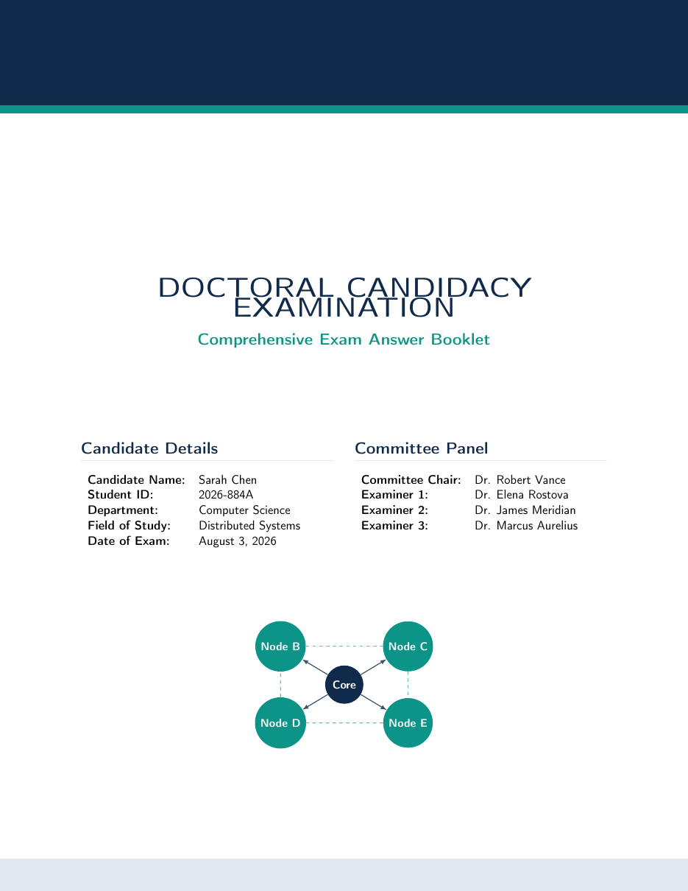</a><br><b>Comprehensive Exam Answer Booklet</b><br><a href="https://letx.app/templates/academic-career/comprehensive-exam-answer-booklet">Open in LetX</a> · <a href="./academic-career/comprehensive-exam-answer-booklet">Source</a></td>
<td width="33%" valign="top" align="center"><a href="https://letx.app/templates/academic-career/conference-travel-grant"></a><br><b>Conference Travel Grant</b><br><a href="https://letx.app/templates/academic-career/conference-travel-grant">Open in LetX</a> · <a href="./academic-career/conference-travel-grant">Source</a></td>
</tr>
<tr>
<td width="33%" valign="top" align="center"><a href="https://letx.app/templates/academic-career/diversity-statement"></a><br><b>Diversity Statement</b><br><a href="https://letx.app/templates/academic-career/diversity-statement">Open in LetX</a> · <a href="./academic-career/diversity-statement">Source</a></td>
<td width="33%" valign="top" align="center"><a href="https://letx.app/templates/academic-career/faculty-interview-chalk-talk-outline"></a><br><b>Faculty Interview Chalk Talk Outline</b><br><a href="https://letx.app/templates/academic-career/faculty-interview-chalk-talk-outline">Open in LetX</a> · <a href="./academic-career/faculty-interview-chalk-talk-outline">Source</a></td>
<td width="33%" valign="top" align="center"><a href="https://letx.app/templates/academic-career/phd-annual-progress-review">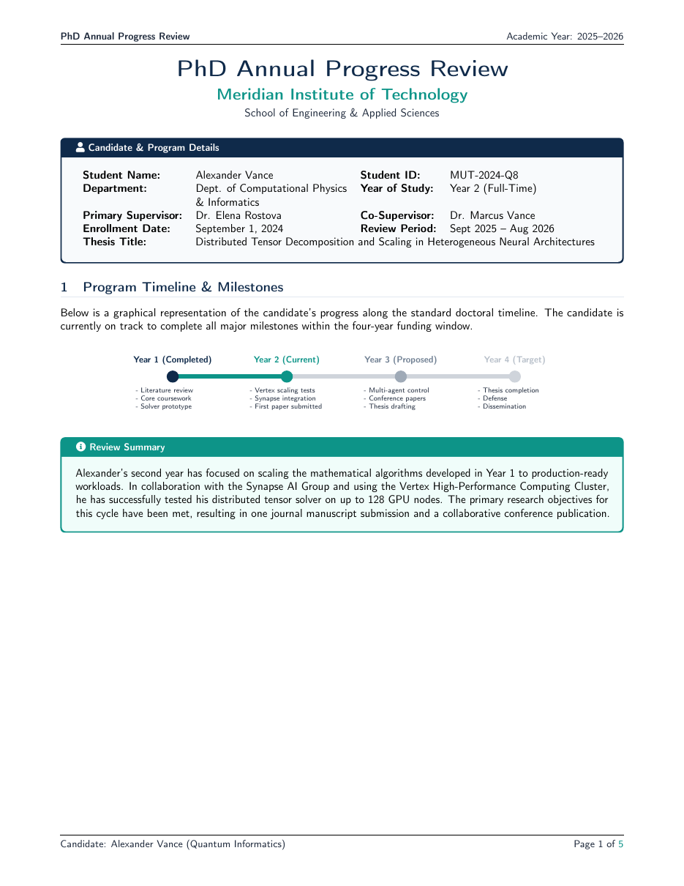</a><br><b>PhD Annual Progress Review</b><br><a href="https://letx.app/templates/academic-career/phd-annual-progress-review">Open in LetX</a> · <a href="./academic-career/phd-annual-progress-review">Source</a></td>
</tr>
<tr>
<td width="33%" valign="top" align="center"><a href="https://letx.app/templates/academic-career/phd-progress-report"></a><br><b>PhD Progress Report</b><br><a href="https://letx.app/templates/academic-career/phd-progress-report">Open in LetX</a> · <a href="./academic-career/phd-progress-report">Source</a></td>
<td width="33%" valign="top" align="center"><a href="https://letx.app/templates/academic-career/postdoc-application"></a><br><b>Postdoc Application</b><br><a href="https://letx.app/templates/academic-career/postdoc-application">Open in LetX</a> · <a href="./academic-career/postdoc-application">Source</a></td>
<td width="33%" valign="top" align="center"><a href="https://letx.app/templates/academic-career/postdoc-application-cover-letter"></a><br><b>Postdoc Application Cover Letter</b><br><a href="https://letx.app/templates/academic-career/postdoc-application-cover-letter">Open in LetX</a> · <a href="./academic-career/postdoc-application-cover-letter">Source</a></td>
</tr>
<tr>
<td width="33%" valign="top" align="center"><a href="https://letx.app/templates/academic-career/recommendation-request-packet"></a><br><b>Recommendation Letter Request Packet</b><br><a href="https://letx.app/templates/academic-career/recommendation-request-packet">Open in LetX</a> · <a href="./academic-career/recommendation-request-packet">Source</a></td>
<td width="33%" valign="top" align="center"><a href="https://letx.app/templates/academic-career/research-proposal-template"></a><br><b>Research Proposal Template</b><br><a href="https://letx.app/templates/academic-career/research-proposal-template">Open in LetX</a> · <a href="./academic-career/research-proposal-template">Source</a></td>
<td width="33%" valign="top" align="center"><a href="https://letx.app/templates/academic-career/research-statement"></a><br><b>Research Statement</b><br><a href="https://letx.app/templates/academic-career/research-statement">Open in LetX</a> · <a href="./academic-career/research-statement">Source</a></td>
</tr>
<tr>
<td width="33%" valign="top" align="center"><a href="https://letx.app/templates/academic-career/research-statement-faculty-application"></a><br><b>Research Statement for Faculty Applications</b><br><a href="https://letx.app/templates/academic-career/research-statement-faculty-application">Open in LetX</a> · <a href="./academic-career/research-statement-faculty-application">Source</a></td>
<td width="33%" valign="top" align="center"><a href="https://letx.app/templates/academic-career/sabbatical-leave-proposal"></a><br><b>Sabbatical Leave Proposal</b><br><a href="https://letx.app/templates/academic-career/sabbatical-leave-proposal">Open in LetX</a> · <a href="./academic-career/sabbatical-leave-proposal">Source</a></td>
<td width="33%" valign="top" align="center"><a href="https://letx.app/templates/academic-career/scholarship-application"></a><br><b>Scholarship Application</b><br><a href="https://letx.app/templates/academic-career/scholarship-application">Open in LetX</a> · <a href="./academic-career/scholarship-application">Source</a></td>
</tr>
<tr>
<td width="33%" valign="top" align="center"><a href="https://letx.app/templates/academic-career/statement-of-purpose"></a><br><b>Statement of Purpose</b><br><a href="https://letx.app/templates/academic-career/statement-of-purpose">Open in LetX</a> · <a href="./academic-career/statement-of-purpose">Source</a></td>
<td width="33%" valign="top" align="center"><a href="https://letx.app/templates/academic-career/student-research-symposium-abstract"></a><br><b>Student Research Symposium Abstract</b><br><a href="https://letx.app/templates/academic-career/student-research-symposium-abstract">Open in LetX</a> · <a href="./academic-career/student-research-symposium-abstract">Source</a></td>
<td width="33%" valign="top" align="center"><a href="https://letx.app/templates/academic-career/study-abroad-exchange-report">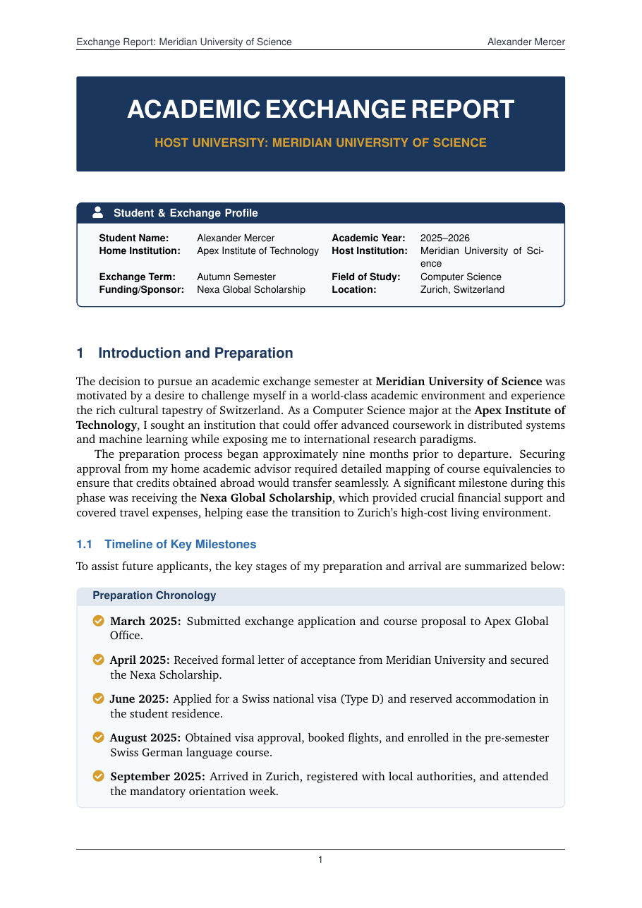</a><br><b>Study Abroad Exchange Report</b><br><a href="https://letx.app/templates/academic-career/study-abroad-exchange-report">Open in LetX</a> · <a href="./academic-career/study-abroad-exchange-report">Source</a></td>
</tr>
<tr>
<td width="33%" valign="top" align="center"><a href="https://letx.app/templates/academic-career/summer-internship-report"></a><br><b>Summer Internship Report</b><br><a href="https://letx.app/templates/academic-career/summer-internship-report">Open in LetX</a> · <a href="./academic-career/summer-internship-report">Source</a></td>
<td width="33%" valign="top" align="center"><a href="https://letx.app/templates/academic-career/teaching-statement"></a><br><b>Teaching Statement</b><br><a href="https://letx.app/templates/academic-career/teaching-statement">Open in LetX</a> · <a href="./academic-career/teaching-statement">Source</a></td>
<td width="33%" valign="top" align="center"><a href="https://letx.app/templates/academic-career/tenure-and-promotion-dossier"></a><br><b>Tenure and Promotion Dossier</b><br><a href="https://letx.app/templates/academic-career/tenure-and-promotion-dossier">Open in LetX</a> · <a href="./academic-career/tenure-and-promotion-dossier">Source</a></td>
</tr>
<tr>
<td width="33%" valign="top" align="center"><a href="https://letx.app/templates/academic-career/thesis-proposal"></a><br><b>Thesis Proposal</b><br><a href="https://letx.app/templates/academic-career/thesis-proposal">Open in LetX</a> · <a href="./academic-career/thesis-proposal">Source</a></td>
</tr>
</table>

### Assignments & Course Work

19 templates. [Browse this category on LetX](https://letx.app/templates/assignments)

<table>
<tr>
<td width="33%" valign="top" align="center"><a href="https://letx.app/templates/assignments/algorithm-cheatsheet"></a><br><b>Algorithm Cheatsheet</b><br><a href="https://letx.app/templates/assignments/algorithm-cheatsheet">Open in LetX</a> · <a href="./assignments/algorithm-cheatsheet">Source</a></td>
<td width="33%" valign="top" align="center"><a href="https://letx.app/templates/assignments/annotated-bibliography"></a><br><b>Annotated Bibliography</b><br><a href="https://letx.app/templates/assignments/annotated-bibliography">Open in LetX</a> · <a href="./assignments/annotated-bibliography">Source</a></td>
<td width="33%" valign="top" align="center"><a href="https://letx.app/templates/assignments/assignment-cover-sheet"></a><br><b>Assignment Cover Sheet</b><br><a href="https://letx.app/templates/assignments/assignment-cover-sheet">Open in LetX</a> · <a href="./assignments/assignment-cover-sheet">Source</a></td>
</tr>
<tr>
<td width="33%" valign="top" align="center"><a href="https://letx.app/templates/assignments/book-report"></a><br><b>Book Report Template</b><br><a href="https://letx.app/templates/assignments/book-report">Open in LetX</a> · <a href="./assignments/book-report">Source</a></td>
<td width="33%" valign="top" align="center"><a href="https://letx.app/templates/assignments/candidacy-exam-notes"></a><br><b>Candidacy Exam Notes</b><br><a href="https://letx.app/templates/assignments/candidacy-exam-notes">Open in LetX</a> · <a href="./assignments/candidacy-exam-notes">Source</a></td>
<td width="33%" valign="top" align="center"><a href="https://letx.app/templates/assignments/capstone-project-report"></a><br><b>Capstone Project Report</b><br><a href="https://letx.app/templates/assignments/capstone-project-report">Open in LetX</a> · <a href="./assignments/capstone-project-report">Source</a></td>
</tr>
<tr>
<td width="33%" valign="top" align="center"><a href="https://letx.app/templates/assignments/reading-list-syllabus"></a><br><b>Course Syllabus</b><br><a href="https://letx.app/templates/assignments/reading-list-syllabus">Open in LetX</a> · <a href="./assignments/reading-list-syllabus">Source</a></td>
<td width="33%" valign="top" align="center"><a href="https://letx.app/templates/assignments/cs-assignment-template"></a><br><b>CS Assignment Template</b><br><a href="https://letx.app/templates/assignments/cs-assignment-template">Open in LetX</a> · <a href="./assignments/cs-assignment-template">Source</a></td>
<td width="33%" valign="top" align="center"><a href="https://letx.app/templates/assignments/data-science-report"></a><br><b>Data Science Report</b><br><a href="https://letx.app/templates/assignments/data-science-report">Open in LetX</a> · <a href="./assignments/data-science-report">Source</a></td>
</tr>
<tr>
<td width="33%" valign="top" align="center"><a href="https://letx.app/templates/assignments/engineering-design-document"></a><br><b>Engineering Design Document</b><br><a href="https://letx.app/templates/assignments/engineering-design-document">Open in LetX</a> · <a href="./assignments/engineering-design-document">Source</a></td>
<td width="33%" valign="top" align="center"><a href="https://letx.app/templates/assignments/engineering-lab-report"></a><br><b>Engineering Lab Report</b><br><a href="https://letx.app/templates/assignments/engineering-lab-report">Open in LetX</a> · <a href="./assignments/engineering-lab-report">Source</a></td>
<td width="33%" valign="top" align="center"><a href="https://letx.app/templates/assignments/final-year-project-report"></a><br><b>Final Year Project Report</b><br><a href="https://letx.app/templates/assignments/final-year-project-report">Open in LetX</a> · <a href="./assignments/final-year-project-report">Source</a></td>
</tr>
<tr>
<td width="33%" valign="top" align="center"><a href="https://letx.app/templates/assignments/math-lecture-notes"></a><br><b>Math Lecture Notes</b><br><a href="https://letx.app/templates/assignments/math-lecture-notes">Open in LetX</a> · <a href="./assignments/math-lecture-notes">Source</a></td>
<td width="33%" valign="top" align="center"><a href="https://letx.app/templates/assignments/math-worksheet"></a><br><b>Math Practice Worksheet</b><br><a href="https://letx.app/templates/assignments/math-worksheet">Open in LetX</a> · <a href="./assignments/math-worksheet">Source</a></td>
<td width="33%" valign="top" align="center"><a href="https://letx.app/templates/assignments/math-proof-portfolio"></a><br><b>Math Proof Portfolio</b><br><a href="https://letx.app/templates/assignments/math-proof-portfolio">Open in LetX</a> · <a href="./assignments/math-proof-portfolio">Source</a></td>
</tr>
<tr>
<td width="33%" valign="top" align="center"><a href="https://letx.app/templates/assignments/seminar-handout"></a><br><b>Seminar Handout</b><br><a href="https://letx.app/templates/assignments/seminar-handout">Open in LetX</a> · <a href="./assignments/seminar-handout">Source</a></td>
<td width="33%" valign="top" align="center"><a href="https://letx.app/templates/assignments/seminar-report"></a><br><b>Seminar Report</b><br><a href="https://letx.app/templates/assignments/seminar-report">Open in LetX</a> · <a href="./assignments/seminar-report">Source</a></td>
<td width="33%" valign="top" align="center"><a href="https://letx.app/templates/assignments/spelling-test"></a><br><b>Spelling Test Template</b><br><a href="https://letx.app/templates/assignments/spelling-test">Open in LetX</a> · <a href="./assignments/spelling-test">Source</a></td>
</tr>
<tr>
<td width="33%" valign="top" align="center"><a href="https://letx.app/templates/assignments/statistics-report"></a><br><b>Statistics Report</b><br><a href="https://letx.app/templates/assignments/statistics-report">Open in LetX</a> · <a href="./assignments/statistics-report">Source</a></td>
</tr>
</table>

### Lab Reports & Documentation

61 templates. [Browse this category on LetX](https://letx.app/templates/lab-documents)

<table>
<tr>
<td width="33%" valign="top" align="center"><a href="https://letx.app/templates/lab-documents/analytical-method-validation-report"></a><br><b>Analytical Method Validation Report</b><br><a href="https://letx.app/templates/lab-documents/analytical-method-validation-report">Open in LetX</a> · <a href="./lab-documents/analytical-method-validation-report">Source</a></td>
<td width="33%" valign="top" align="center"><a href="https://letx.app/templates/lab-documents/autoclave-sterilisation-cycle-log"></a><br><b>Autoclave Sterilisation Cycle Log</b><br><a href="https://letx.app/templates/lab-documents/autoclave-sterilisation-cycle-log">Open in LetX</a> · <a href="./lab-documents/autoclave-sterilisation-cycle-log">Source</a></td>
<td width="33%" valign="top" align="center"><a href="https://letx.app/templates/lab-documents/balance-and-pipette-verification-record"></a><br><b>Balance and Pipette Verification Record</b><br><a href="https://letx.app/templates/lab-documents/balance-and-pipette-verification-record">Open in LetX</a> · <a href="./lab-documents/balance-and-pipette-verification-record">Source</a></td>
</tr>
<tr>
<td width="33%" valign="top" align="center"><a href="https://letx.app/templates/lab-documents/biobank-sample-tracking-record"></a><br><b>Biobank Sample Tracking Record</b><br><a href="https://letx.app/templates/lab-documents/biobank-sample-tracking-record">Open in LetX</a> · <a href="./lab-documents/biobank-sample-tracking-record">Source</a></td>
<td width="33%" valign="top" align="center"><a href="https://letx.app/templates/lab-documents/bioinformatics-report"></a><br><b>Bioinformatics Report</b><br><a href="https://letx.app/templates/lab-documents/bioinformatics-report">Open in LetX</a> · <a href="./lab-documents/bioinformatics-report">Source</a></td>
<td width="33%" valign="top" align="center"><a href="https://letx.app/templates/lab-documents/biosafety-level-2-manual">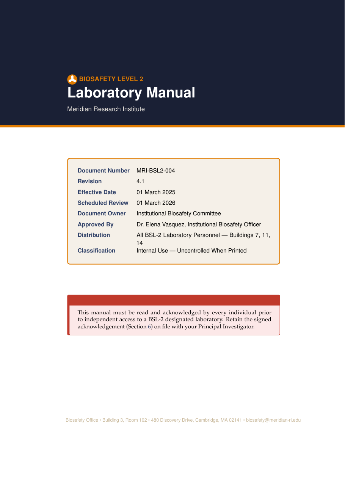</a><br><b>Biosafety Level 2 Manual</b><br><a href="https://letx.app/templates/lab-documents/biosafety-level-2-manual">Open in LetX</a> · <a href="./lab-documents/biosafety-level-2-manual">Source</a></td>
</tr>
<tr>
<td width="33%" valign="top" align="center"><a href="https://letx.app/templates/lab-documents/buffer-recipe-card"></a><br><b>Buffer Recipe Card</b><br><a href="https://letx.app/templates/lab-documents/buffer-recipe-card">Open in LetX</a> · <a href="./lab-documents/buffer-recipe-card">Source</a></td>
<td width="33%" valign="top" align="center"><a href="https://letx.app/templates/lab-documents/calibration-certificate"></a><br><b>Calibration Certificate</b><br><a href="https://letx.app/templates/lab-documents/calibration-certificate">Open in LetX</a> · <a href="./lab-documents/calibration-certificate">Source</a></td>
<td width="33%" valign="top" align="center"><a href="https://letx.app/templates/lab-documents/cell-culture-protocol"></a><br><b>Cell Culture Protocol</b><br><a href="https://letx.app/templates/lab-documents/cell-culture-protocol">Open in LetX</a> · <a href="./lab-documents/cell-culture-protocol">Source</a></td>
</tr>
<tr>
<td width="33%" valign="top" align="center"><a href="https://letx.app/templates/lab-documents/cell-line-authentication-record">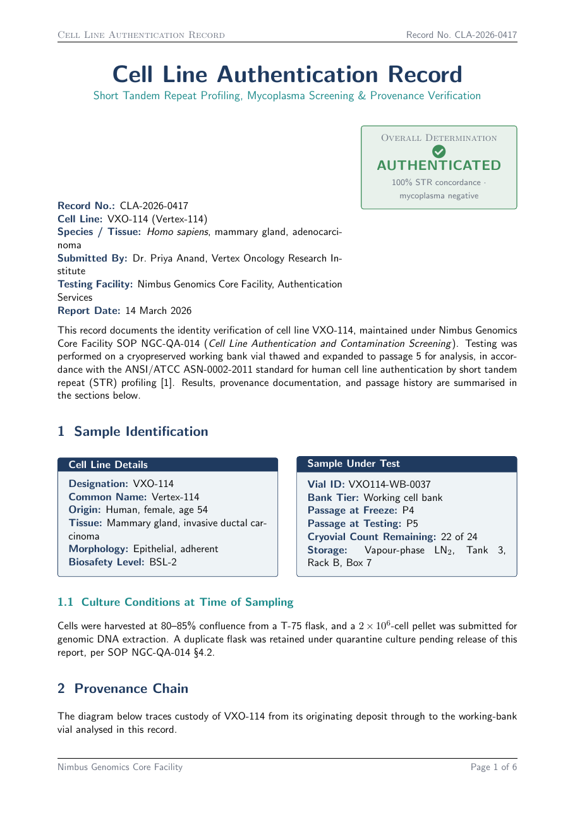</a><br><b>Cell Line Authentication Record</b><br><a href="https://letx.app/templates/lab-documents/cell-line-authentication-record">Open in LetX</a> · <a href="./lab-documents/cell-line-authentication-record">Source</a></td>
<td width="33%" valign="top" align="center"><a href="https://letx.app/templates/lab-documents/chemical-inventory-register"></a><br><b>Chemical Inventory Register</b><br><a href="https://letx.app/templates/lab-documents/chemical-inventory-register">Open in LetX</a> · <a href="./lab-documents/chemical-inventory-register">Source</a></td>
<td width="33%" valign="top" align="center"><a href="https://letx.app/templates/lab-documents/chemistry-lab-report"></a><br><b>Chemistry Lab Report</b><br><a href="https://letx.app/templates/lab-documents/chemistry-lab-report">Open in LetX</a> · <a href="./lab-documents/chemistry-lab-report">Source</a></td>
</tr>
<tr>
<td width="33%" valign="top" align="center"><a href="https://letx.app/templates/lab-documents/cleanroom-entry-and-gowning-log"></a><br><b>Cleanroom Entry and Gowning Log</b><br><a href="https://letx.app/templates/lab-documents/cleanroom-entry-and-gowning-log">Open in LetX</a> · <a href="./lab-documents/cleanroom-entry-and-gowning-log">Source</a></td>
<td width="33%" valign="top" align="center"><a href="https://letx.app/templates/lab-documents/cleanroom-environmental-monitoring-report"></a><br><b>Cleanroom Environmental Monitoring Report</b><br><a href="https://letx.app/templates/lab-documents/cleanroom-environmental-monitoring-report">Open in LetX</a> · <a href="./lab-documents/cleanroom-environmental-monitoring-report">Source</a></td>
<td width="33%" valign="top" align="center"><a href="https://letx.app/templates/lab-documents/specimen-processing-log">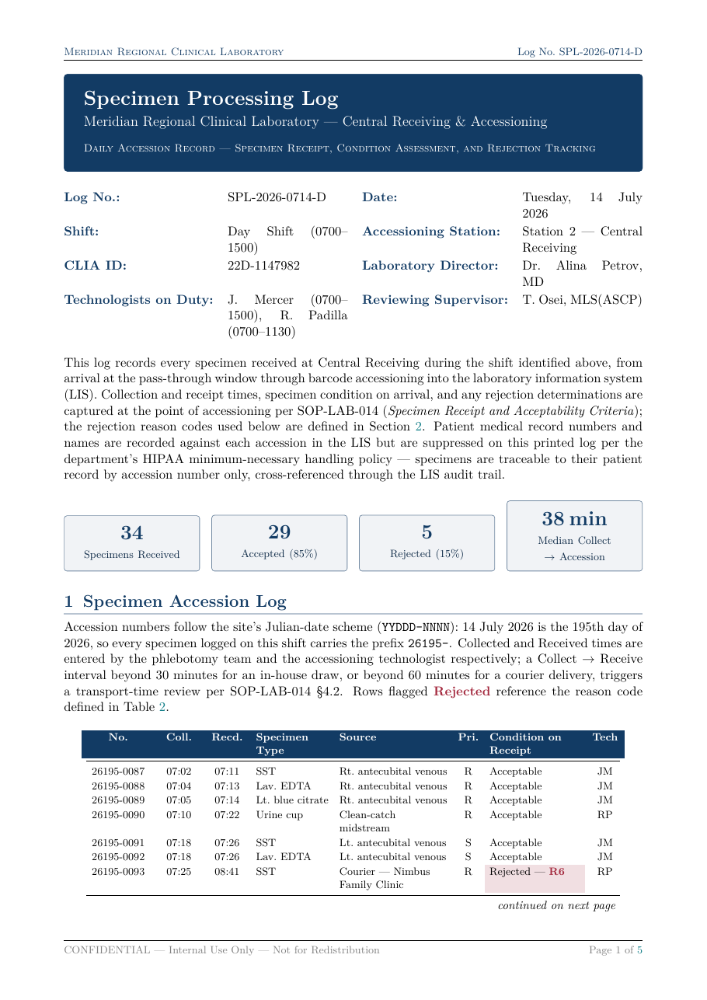</a><br><b>Clinical Specimen Processing Log</b><br><a href="https://letx.app/templates/lab-documents/specimen-processing-log">Open in LetX</a> · <a href="./lab-documents/specimen-processing-log">Source</a></td>
</tr>
<tr>
<td width="33%" valign="top" align="center"><a href="https://letx.app/templates/lab-documents/controlled-substance-usage-log">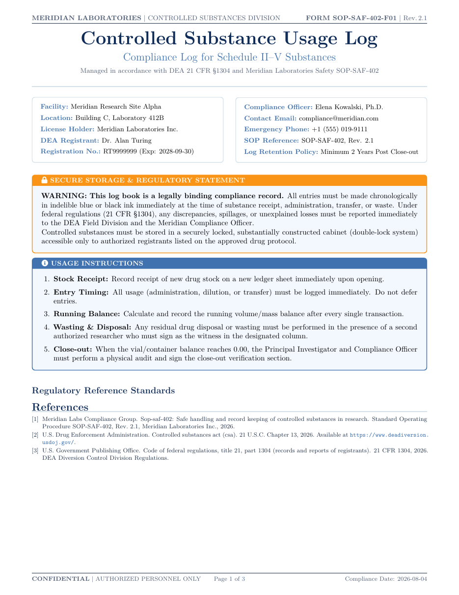</a><br><b>Controlled Substance Usage Log</b><br><a href="https://letx.app/templates/lab-documents/controlled-substance-usage-log">Open in LetX</a> · <a href="./lab-documents/controlled-substance-usage-log">Source</a></td>
<td width="33%" valign="top" align="center"><a href="https://letx.app/templates/lab-documents/core-facility-service-request"></a><br><b>Core Facility Service Request</b><br><a href="https://letx.app/templates/lab-documents/core-facility-service-request">Open in LetX</a> · <a href="./lab-documents/core-facility-service-request">Source</a></td>
<td width="33%" valign="top" align="center"><a href="https://letx.app/templates/lab-documents/coshh-chemical-risk-assessment"></a><br><b>COSHH Chemical Risk Assessment</b><br><a href="https://letx.app/templates/lab-documents/coshh-chemical-risk-assessment">Open in LetX</a> · <a href="./lab-documents/coshh-chemical-risk-assessment">Source</a></td>
</tr>
<tr>
<td width="33%" valign="top" align="center"><a href="https://letx.app/templates/lab-documents/design-of-experiments-worksheet"></a><br><b>Design of Experiments (DOE) Worksheet</b><br><a href="https://letx.app/templates/lab-documents/design-of-experiments-worksheet">Open in LetX</a> · <a href="./lab-documents/design-of-experiments-worksheet">Source</a></td>
<td width="33%" valign="top" align="center"><a href="https://letx.app/templates/lab-documents/deviation-and-capa-report"></a><br><b>Deviation and CAPA Report</b><br><a href="https://letx.app/templates/lab-documents/deviation-and-capa-report">Open in LetX</a> · <a href="./lab-documents/deviation-and-capa-report">Source</a></td>
<td width="33%" valign="top" align="center"><a href="https://letx.app/templates/lab-documents/dna-sequencing-run-sheet"></a><br><b>DNA Sequencing Run Sheet</b><br><a href="https://letx.app/templates/lab-documents/dna-sequencing-run-sheet">Open in LetX</a> · <a href="./lab-documents/dna-sequencing-run-sheet">Source</a></td>
</tr>
<tr>
<td width="33%" valign="top" align="center"><a href="https://letx.app/templates/lab-documents/equipment-calibration-log"></a><br><b>Equipment Calibration Log</b><br><a href="https://letx.app/templates/lab-documents/equipment-calibration-log">Open in LetX</a> · <a href="./lab-documents/equipment-calibration-log">Source</a></td>
<td width="33%" valign="top" align="center"><a href="https://letx.app/templates/lab-documents/equipment-qualification-iq-oq-pq"></a><br><b>Equipment Qualification (IQ/OQ/PQ) Protocol</b><br><a href="https://letx.app/templates/lab-documents/equipment-qualification-iq-oq-pq">Open in LetX</a> · <a href="./lab-documents/equipment-qualification-iq-oq-pq">Source</a></td>
<td width="33%" valign="top" align="center"><a href="https://letx.app/templates/lab-documents/flow-cytometry-panel-design-sheet">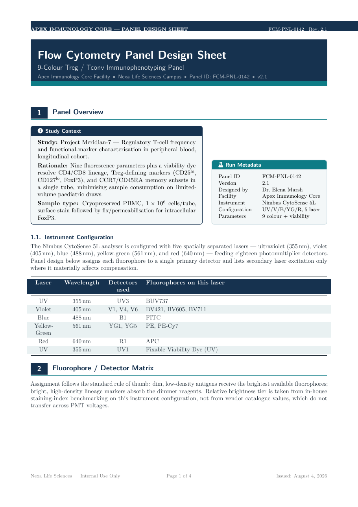</a><br><b>Flow Cytometry Panel Design Sheet</b><br><a href="https://letx.app/templates/lab-documents/flow-cytometry-panel-design-sheet">Open in LetX</a> · <a href="./lab-documents/flow-cytometry-panel-design-sheet">Source</a></td>
</tr>
<tr>
<td width="33%" valign="top" align="center"><a href="https://letx.app/templates/lab-documents/gel-electrophoresis-result-sheet">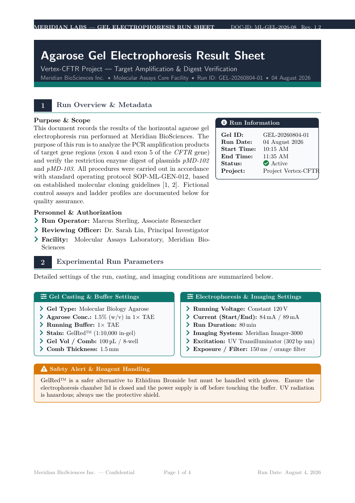</a><br><b>Gel Electrophoresis Result Sheet</b><br><a href="https://letx.app/templates/lab-documents/gel-electrophoresis-result-sheet">Open in LetX</a> · <a href="./lab-documents/gel-electrophoresis-result-sheet">Source</a></td>
<td width="33%" valign="top" align="center"><a href="https://letx.app/templates/lab-documents/geology-field-report"></a><br><b>Geology Field Report</b><br><a href="https://letx.app/templates/lab-documents/geology-field-report">Open in LetX</a> · <a href="./lab-documents/geology-field-report">Source</a></td>
<td width="33%" valign="top" align="center"><a href="https://letx.app/templates/lab-documents/gmp-batch-manufacturing-record">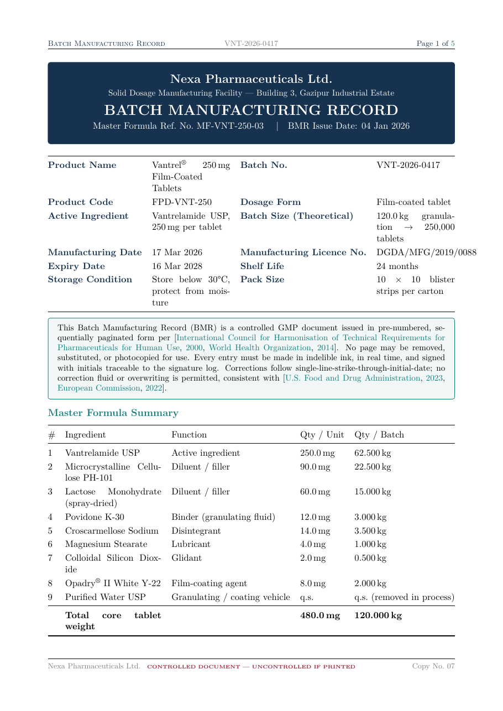</a><br><b>GMP Batch Manufacturing Record</b><br><a href="https://letx.app/templates/lab-documents/gmp-batch-manufacturing-record">Open in LetX</a> · <a href="./lab-documents/gmp-batch-manufacturing-record">Source</a></td>
</tr>
<tr>
<td width="33%" valign="top" align="center"><a href="https://letx.app/templates/lab-documents/lab-rotation-report">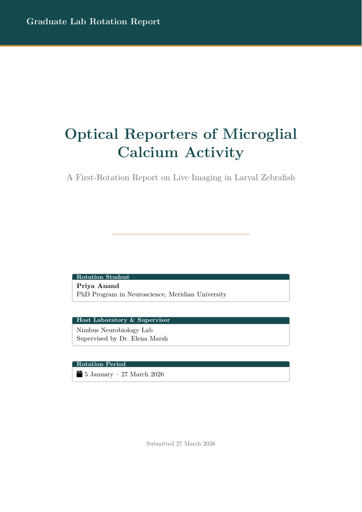</a><br><b>Graduate Lab Rotation Report</b><br><a href="https://letx.app/templates/lab-documents/lab-rotation-report">Open in LetX</a> · <a href="./lab-documents/lab-rotation-report">Source</a></td>
<td width="33%" valign="top" align="center"><a href="https://letx.app/templates/lab-documents/hazardous-waste-disposal-record"></a><br><b>Hazardous Waste Disposal Record</b><br><a href="https://letx.app/templates/lab-documents/hazardous-waste-disposal-record">Open in LetX</a> · <a href="./lab-documents/hazardous-waste-disposal-record">Source</a></td>
<td width="33%" valign="top" align="center"><a href="https://letx.app/templates/lab-documents/hplc-system-suitability-report"></a><br><b>HPLC System Suitability Report</b><br><a href="https://letx.app/templates/lab-documents/hplc-system-suitability-report">Open in LetX</a> · <a href="./lab-documents/hplc-system-suitability-report">Source</a></td>
</tr>
<tr>
<td width="33%" valign="top" align="center"><a href="https://letx.app/templates/lab-documents/iacuc-animal-use-protocol"></a><br><b>IACUC Animal Use Protocol</b><br><a href="https://letx.app/templates/lab-documents/iacuc-animal-use-protocol">Open in LetX</a> · <a href="./lab-documents/iacuc-animal-use-protocol">Source</a></td>
<td width="33%" valign="top" align="center"><a href="https://letx.app/templates/lab-documents/instrument-maintenance-record">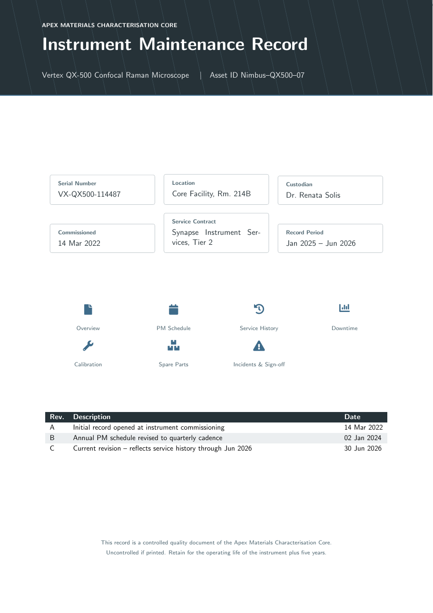</a><br><b>Instrument Maintenance Record</b><br><a href="https://letx.app/templates/lab-documents/instrument-maintenance-record">Open in LetX</a> · <a href="./lab-documents/instrument-maintenance-record">Source</a></td>
<td width="33%" valign="top" align="center"><a href="https://letx.app/templates/lab-documents/iso-17025-test-report">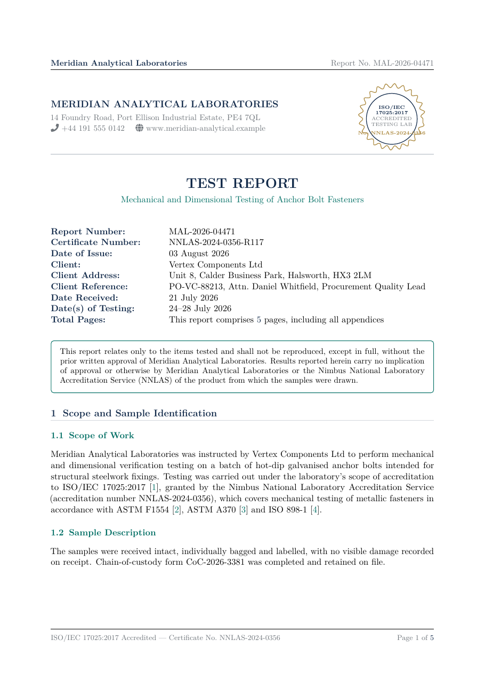</a><br><b>ISO/IEC 17025 Test Report</b><br><a href="https://letx.app/templates/lab-documents/iso-17025-test-report">Open in LetX</a> · <a href="./lab-documents/iso-17025-test-report">Source</a></td>
</tr>
<tr>
<td width="33%" valign="top" align="center"><a href="https://letx.app/templates/lab-documents/lab-notebook"></a><br><b>Lab Notebook</b><br><a href="https://letx.app/templates/lab-documents/lab-notebook">Open in LetX</a> · <a href="./lab-documents/lab-notebook">Source</a></td>
<td width="33%" valign="top" align="center"><a href="https://letx.app/templates/lab-documents/lab-protocol-sop"></a><br><b>Lab Protocol / SOP</b><br><a href="https://letx.app/templates/lab-documents/lab-protocol-sop">Open in LetX</a> · <a href="./lab-documents/lab-protocol-sop">Source</a></td>
<td width="33%" valign="top" align="center"><a href="https://letx.app/templates/lab-documents/lab-safety-manual"></a><br><b>Lab Safety Manual</b><br><a href="https://letx.app/templates/lab-documents/lab-safety-manual">Open in LetX</a> · <a href="./lab-documents/lab-safety-manual">Source</a></td>
</tr>
<tr>
<td width="33%" valign="top" align="center"><a href="https://letx.app/templates/lab-documents/chemical-spill-response-plan"></a><br><b>Laboratory Chemical Spill Response Plan</b><br><a href="https://letx.app/templates/lab-documents/chemical-spill-response-plan">Open in LetX</a> · <a href="./lab-documents/chemical-spill-response-plan">Source</a></td>
<td width="33%" valign="top" align="center"><a href="https://letx.app/templates/lab-documents/incident-and-near-miss-report"></a><br><b>Laboratory Incident and Near-Miss Report</b><br><a href="https://letx.app/templates/lab-documents/incident-and-near-miss-report">Open in LetX</a> · <a href="./lab-documents/incident-and-near-miss-report">Source</a></td>
<td width="33%" valign="top" align="center"><a href="https://letx.app/templates/lab-documents/laboratory-audit-checklist">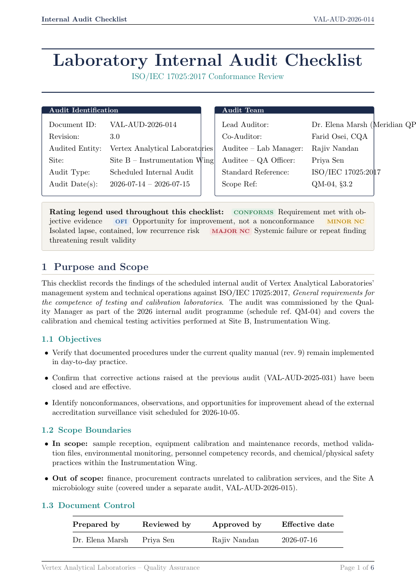</a><br><b>Laboratory Internal Audit Checklist</b><br><a href="https://letx.app/templates/lab-documents/laboratory-audit-checklist">Open in LetX</a> · <a href="./lab-documents/laboratory-audit-checklist">Source</a></td>
</tr>
<tr>
<td width="33%" valign="top" align="center"><a href="https://letx.app/templates/lab-documents/lab-notebook-daily-entry">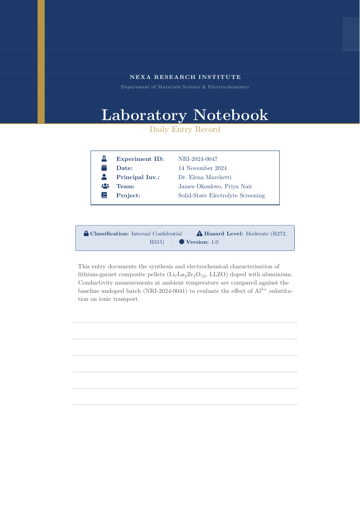</a><br><b>Laboratory Notebook Daily Entry</b><br><a href="https://letx.app/templates/lab-documents/lab-notebook-daily-entry">Open in LetX</a> · <a href="./lab-documents/lab-notebook-daily-entry">Source</a></td>
<td width="33%" valign="top" align="center"><a href="https://letx.app/templates/lab-documents/laboratory-quality-manual"></a><br><b>Laboratory Quality Manual</b><br><a href="https://letx.app/templates/lab-documents/laboratory-quality-manual">Open in LetX</a> · <a href="./lab-documents/laboratory-quality-manual">Source</a></td>
<td width="33%" valign="top" align="center"><a href="https://letx.app/templates/lab-documents/laboratory-safety-induction-checklist"></a><br><b>Laboratory Safety Induction Checklist</b><br><a href="https://letx.app/templates/lab-documents/laboratory-safety-induction-checklist">Open in LetX</a> · <a href="./lab-documents/laboratory-safety-induction-checklist">Source</a></td>
</tr>
<tr>
<td width="33%" valign="top" align="center"><a href="https://letx.app/templates/lab-documents/limit-of-detection-quantitation-report">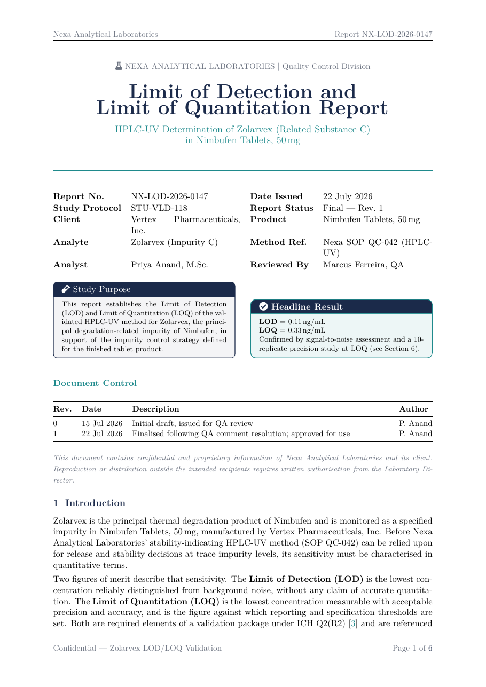</a><br><b>Limit of Detection and Quantitation Report</b><br><a href="https://letx.app/templates/lab-documents/limit-of-detection-quantitation-report">Open in LetX</a> · <a href="./lab-documents/limit-of-detection-quantitation-report">Source</a></td>
<td width="33%" valign="top" align="center"><a href="https://letx.app/templates/lab-documents/mass-spectrometry-method-parameters"></a><br><b>Mass Spectrometry Method Parameters Sheet</b><br><a href="https://letx.app/templates/lab-documents/mass-spectrometry-method-parameters">Open in LetX</a> · <a href="./lab-documents/mass-spectrometry-method-parameters">Source</a></td>
<td width="33%" valign="top" align="center"><a href="https://letx.app/templates/lab-documents/measurement-uncertainty-budget"></a><br><b>Measurement Uncertainty Budget</b><br><a href="https://letx.app/templates/lab-documents/measurement-uncertainty-budget">Open in LetX</a> · <a href="./lab-documents/measurement-uncertainty-budget">Source</a></td>
</tr>
<tr>
<td width="33%" valign="top" align="center"><a href="https://letx.app/templates/lab-documents/microscopy-imaging-session-log"></a><br><b>Microscopy Imaging Session Log</b><br><a href="https://letx.app/templates/lab-documents/microscopy-imaging-session-log">Open in LetX</a> · <a href="./lab-documents/microscopy-imaging-session-log">Source</a></td>
<td width="33%" valign="top" align="center"><a href="https://letx.app/templates/lab-documents/pcr-amplification-protocol-record">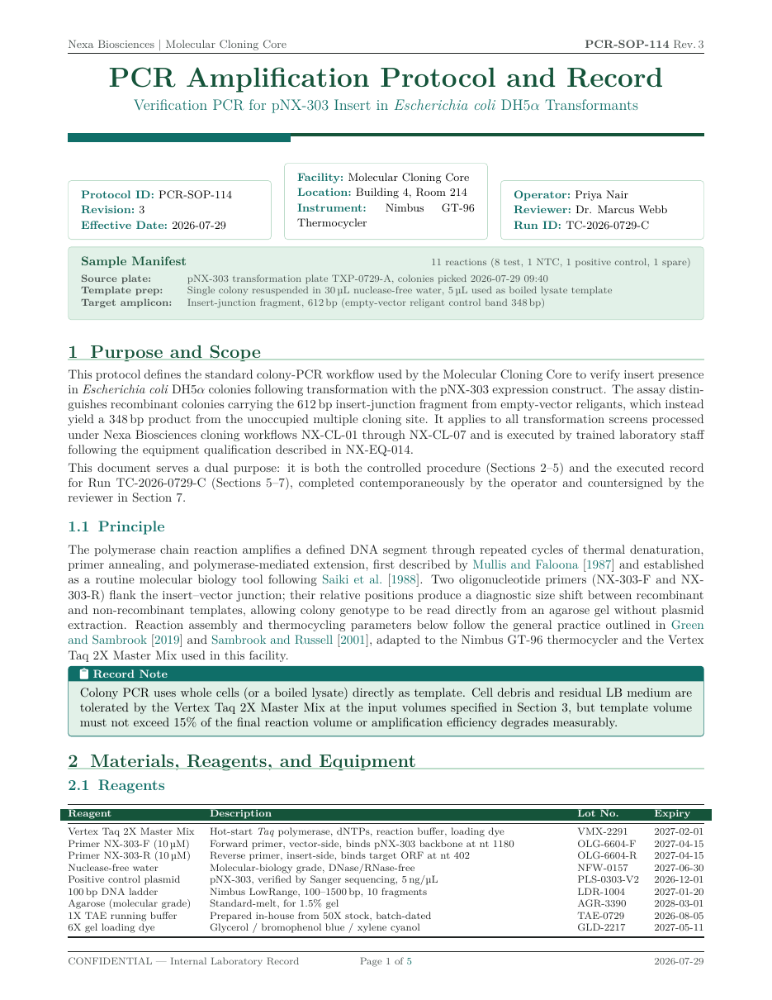</a><br><b>PCR Amplification Protocol and Record</b><br><a href="https://letx.app/templates/lab-documents/pcr-amplification-protocol-record">Open in LetX</a> · <a href="./lab-documents/pcr-amplification-protocol-record">Source</a></td>
<td width="33%" valign="top" align="center"><a href="https://letx.app/templates/lab-documents/physics-lab-report"></a><br><b>Physics Lab Report</b><br><a href="https://letx.app/templates/lab-documents/physics-lab-report">Open in LetX</a> · <a href="./lab-documents/physics-lab-report">Source</a></td>
</tr>
<tr>
<td width="33%" valign="top" align="center"><a href="https://letx.app/templates/lab-documents/proficiency-testing-report"></a><br><b>Proficiency Testing Report</b><br><a href="https://letx.app/templates/lab-documents/proficiency-testing-report">Open in LetX</a> · <a href="./lab-documents/proficiency-testing-report">Source</a></td>
<td width="33%" valign="top" align="center"><a href="https://letx.app/templates/lab-documents/radiation-safety-work-permit"></a><br><b>Radiation Safety Work Permit</b><br><a href="https://letx.app/templates/lab-documents/radiation-safety-work-permit">Open in LetX</a> · <a href="./lab-documents/radiation-safety-work-permit">Source</a></td>
<td width="33%" valign="top" align="center"><a href="https://letx.app/templates/lab-documents/reagent-certificate-of-analysis"></a><br><b>Reagent Certificate of Analysis</b><br><a href="https://letx.app/templates/lab-documents/reagent-certificate-of-analysis">Open in LetX</a> · <a href="./lab-documents/reagent-certificate-of-analysis">Source</a></td>
</tr>
<tr>
<td width="33%" valign="top" align="center"><a href="https://letx.app/templates/lab-documents/reagent-preparation-worksheet"></a><br><b>Reagent Preparation Worksheet</b><br><a href="https://letx.app/templates/lab-documents/reagent-preparation-worksheet">Open in LetX</a> · <a href="./lab-documents/reagent-preparation-worksheet">Source</a></td>
<td width="33%" valign="top" align="center"><a href="https://letx.app/templates/lab-documents/lab-onboarding-handbook"></a><br><b>Research Lab Onboarding Handbook</b><br><a href="https://letx.app/templates/lab-documents/lab-onboarding-handbook">Open in LetX</a> · <a href="./lab-documents/lab-onboarding-handbook">Source</a></td>
<td width="33%" valign="top" align="center"><a href="https://letx.app/templates/lab-documents/sample-chain-of-custody-form"></a><br><b>Sample Chain of Custody Form</b><br><a href="https://letx.app/templates/lab-documents/sample-chain-of-custody-form">Open in LetX</a> · <a href="./lab-documents/sample-chain-of-custody-form">Source</a></td>
</tr>
<tr>
<td width="33%" valign="top" align="center"><a href="https://letx.app/templates/lab-documents/sample-retention-and-disposal-schedule"></a><br><b>Sample Retention and Disposal Schedule</b><br><a href="https://letx.app/templates/lab-documents/sample-retention-and-disposal-schedule">Open in LetX</a> · <a href="./lab-documents/sample-retention-and-disposal-schedule">Source</a></td>
<td width="33%" valign="top" align="center"><a href="https://letx.app/templates/lab-documents/stability-study-report">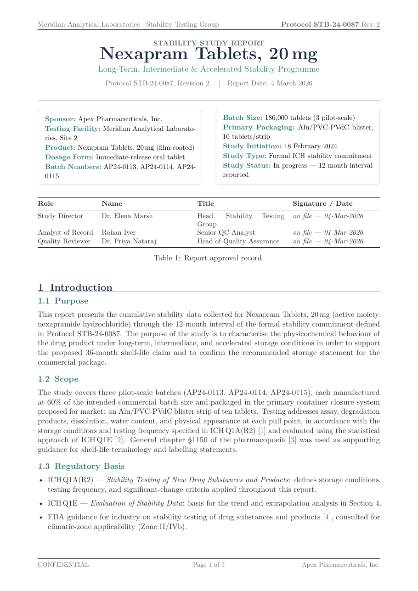</a><br><b>Stability Study Report</b><br><a href="https://letx.app/templates/lab-documents/stability-study-report">Open in LetX</a> · <a href="./lab-documents/stability-study-report">Source</a></td>
<td width="33%" valign="top" align="center"><a href="https://letx.app/templates/lab-documents/standard-operating-procedure-sop">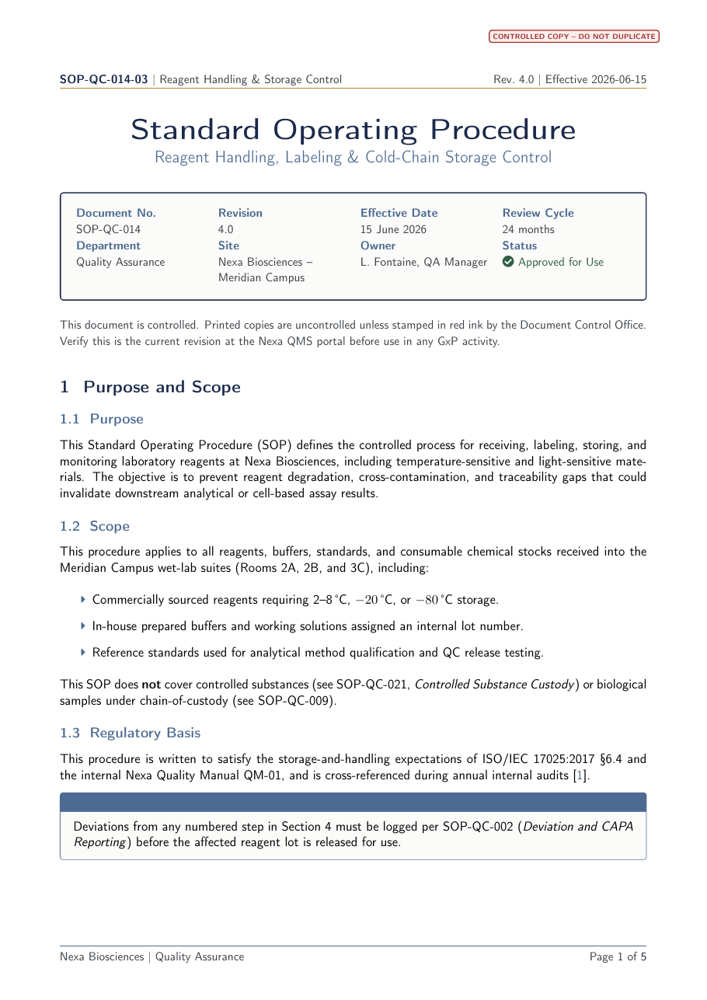</a><br><b>Standard Operating Procedure (SOP)</b><br><a href="https://letx.app/templates/lab-documents/standard-operating-procedure-sop">Open in LetX</a> · <a href="./lab-documents/standard-operating-procedure-sop">Source</a></td>
</tr>
<tr>
<td width="33%" valign="top" align="center"><a href="https://letx.app/templates/lab-documents/tissue-histology-processing-record"></a><br><b>Tissue Histology Processing Record</b><br><a href="https://letx.app/templates/lab-documents/tissue-histology-processing-record">Open in LetX</a> · <a href="./lab-documents/tissue-histology-processing-record">Source</a></td>
<td width="33%" valign="top" align="center"><a href="https://letx.app/templates/lab-documents/titration-assay-worksheet"></a><br><b>Titration and Assay Worksheet</b><br><a href="https://letx.app/templates/lab-documents/titration-assay-worksheet">Open in LetX</a> · <a href="./lab-documents/titration-assay-worksheet">Source</a></td>
<td width="33%" valign="top" align="center"><a href="https://letx.app/templates/lab-documents/freezer-inventory-log"></a><br><b>Ultra-Low Freezer Inventory Log</b><br><a href="https://letx.app/templates/lab-documents/freezer-inventory-log">Open in LetX</a> · <a href="./lab-documents/freezer-inventory-log">Source</a></td>
</tr>
<tr>
<td width="33%" valign="top" align="center"><a href="https://letx.app/templates/lab-documents/western-blot-protocol">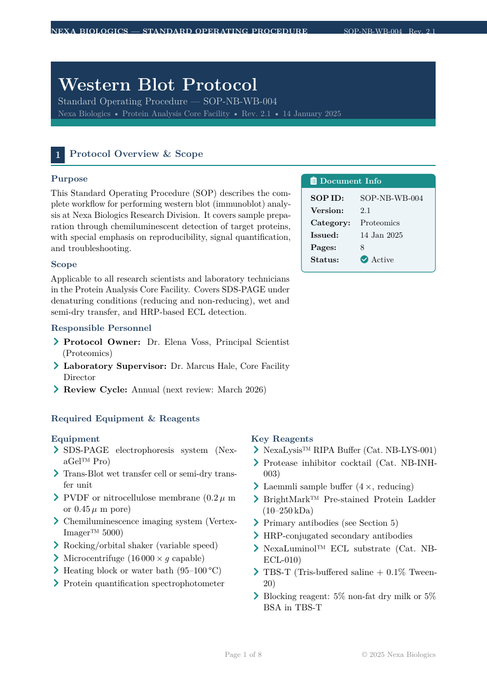</a><br><b>Western Blot Protocol</b><br><a href="https://letx.app/templates/lab-documents/western-blot-protocol">Open in LetX</a> · <a href="./lab-documents/western-blot-protocol">Source</a></td>
</tr>
</table>

### Grants & Research Proposals

17 templates. [Browse this category on LetX](https://letx.app/templates/grants)

<table>
<tr>
<td width="33%" valign="top" align="center"><a href="https://letx.app/templates/grants/arc-grant-proposal"></a><br><b>ARC Grant Proposal</b><br><a href="https://letx.app/templates/grants/arc-grant-proposal">Open in LetX</a> · <a href="./grants/arc-grant-proposal">Source</a></td>
<td width="33%" valign="top" align="center"><a href="https://letx.app/templates/grants/cihr-grant-proposal"></a><br><b>CIHR Grant Proposal</b><br><a href="https://letx.app/templates/grants/cihr-grant-proposal">Open in LetX</a> · <a href="./grants/cihr-grant-proposal">Source</a></td>
<td width="33%" valign="top" align="center"><a href="https://letx.app/templates/grants/data-management-plan"></a><br><b>Data Management Plan</b><br><a href="https://letx.app/templates/grants/data-management-plan">Open in LetX</a> · <a href="./grants/data-management-plan">Source</a></td>
</tr>
<tr>
<td width="33%" valign="top" align="center"><a href="https://letx.app/templates/grants/dfg-grant-proposal"></a><br><b>DFG Grant Proposal</b><br><a href="https://letx.app/templates/grants/dfg-grant-proposal">Open in LetX</a> · <a href="./grants/dfg-grant-proposal">Source</a></td>
<td width="33%" valign="top" align="center"><a href="https://letx.app/templates/grants/erc-grant-proposal"></a><br><b>ERC Grant Proposal</b><br><a href="https://letx.app/templates/grants/erc-grant-proposal">Open in LetX</a> · <a href="./grants/erc-grant-proposal">Source</a></td>
<td width="33%" valign="top" align="center"><a href="https://letx.app/templates/grants/horizon-europe-grant"></a><br><b>Horizon Europe Grant</b><br><a href="https://letx.app/templates/grants/horizon-europe-grant">Open in LetX</a> · <a href="./grants/horizon-europe-grant">Source</a></td>
</tr>
<tr>
<td width="33%" valign="top" align="center"><a href="https://letx.app/templates/grants/jsps-grant-proposal"></a><br><b>JSPS Grant Proposal</b><br><a href="https://letx.app/templates/grants/jsps-grant-proposal">Open in LetX</a> · <a href="./grants/jsps-grant-proposal">Source</a></td>
<td width="33%" valign="top" align="center"><a href="https://letx.app/templates/grants/marie-curie-fellowship"></a><br><b>Marie Curie Fellowship</b><br><a href="https://letx.app/templates/grants/marie-curie-fellowship">Open in LetX</a> · <a href="./grants/marie-curie-fellowship">Source</a></td>
<td width="33%" valign="top" align="center"><a href="https://letx.app/templates/grants/nasa-roses-proposal"></a><br><b>NASA ROSES Grant Proposal</b><br><a href="https://letx.app/templates/grants/nasa-roses-proposal">Open in LetX</a> · <a href="./grants/nasa-roses-proposal">Source</a></td>
</tr>
<tr>
<td width="33%" valign="top" align="center"><a href="https://letx.app/templates/grants/nih-grant-proposal"></a><br><b>NIH Grant Proposal</b><br><a href="https://letx.app/templates/grants/nih-grant-proposal">Open in LetX</a> · <a href="./grants/nih-grant-proposal">Source</a></td>
<td width="33%" valign="top" align="center"><a href="https://letx.app/templates/grants/nserc-grant-proposal"></a><br><b>NSERC Grant Proposal</b><br><a href="https://letx.app/templates/grants/nserc-grant-proposal">Open in LetX</a> · <a href="./grants/nserc-grant-proposal">Source</a></td>
<td width="33%" valign="top" align="center"><a href="https://letx.app/templates/grants/nsf-grant-proposal"></a><br><b>NSF Grant Proposal</b><br><a href="https://letx.app/templates/grants/nsf-grant-proposal">Open in LetX</a> · <a href="./grants/nsf-grant-proposal">Source</a></td>
</tr>
<tr>
<td width="33%" valign="top" align="center"><a href="https://letx.app/templates/grants/nsf-grfp-fellowship"></a><br><b>NSF GRFP Fellowship Statements</b><br><a href="https://letx.app/templates/grants/nsf-grfp-fellowship">Open in LetX</a> · <a href="./grants/nsf-grfp-fellowship">Source</a></td>
<td width="33%" valign="top" align="center"><a href="https://letx.app/templates/grants/snsf-grant-proposal"></a><br><b>SNSF Grant Proposal</b><br><a href="https://letx.app/templates/grants/snsf-grant-proposal">Open in LetX</a> · <a href="./grants/snsf-grant-proposal">Source</a></td>
<td width="33%" valign="top" align="center"><a href="https://letx.app/templates/grants/observing-time-proposal"></a><br><b>Telescope Observing Proposal</b><br><a href="https://letx.app/templates/grants/observing-time-proposal">Open in LetX</a> · <a href="./grants/observing-time-proposal">Source</a></td>
</tr>
<tr>
<td width="33%" valign="top" align="center"><a href="https://letx.app/templates/grants/ukri-grant-proposal"></a><br><b>UKRI Grant Proposal</b><br><a href="https://letx.app/templates/grants/ukri-grant-proposal">Open in LetX</a> · <a href="./grants/ukri-grant-proposal">Source</a></td>
<td width="33%" valign="top" align="center"><a href="https://letx.app/templates/grants/wellcome-trust-grant"></a><br><b>Wellcome Trust Grant</b><br><a href="https://letx.app/templates/grants/wellcome-trust-grant">Open in LetX</a> · <a href="./grants/wellcome-trust-grant">Source</a></td>
</tr>
</table>

### Academic Posters

10 templates. [Browse this category on LetX](https://letx.app/templates/posters)

<table>
<tr>
<td width="33%" valign="top" align="center"><a href="https://letx.app/templates/posters/scientific-poster-a2"></a><br><b>A2 Academic Poster</b><br><a href="https://letx.app/templates/posters/scientific-poster-a2">Open in LetX</a> · <a href="./posters/scientific-poster-a2">Source</a></td>
<td width="33%" valign="top" align="center"><a href="https://letx.app/templates/posters/zine-template"></a><br><b>DIY Zine</b><br><a href="https://letx.app/templates/posters/zine-template">Open in LetX</a> · <a href="./posters/zine-template">Source</a></td>
<td width="33%" valign="top" align="center"><a href="https://letx.app/templates/posters/event-flyer"></a><br><b>Event Flyer</b><br><a href="https://letx.app/templates/posters/event-flyer">Open in LetX</a> · <a href="./posters/event-flyer">Source</a></td>
</tr>
<tr>
<td width="33%" valign="top" align="center"><a href="https://letx.app/templates/posters/poster-a1-modern"></a><br><b>Modern Conference Poster (A1)</b><br><a href="https://letx.app/templates/posters/poster-a1-modern">Open in LetX</a> · <a href="./posters/poster-a1-modern">Source</a></td>
<td width="33%" valign="top" align="center"><a href="https://letx.app/templates/posters/motivational-poster"></a><br><b>Motivational Poster</b><br><a href="https://letx.app/templates/posters/motivational-poster">Open in LetX</a> · <a href="./posters/motivational-poster">Source</a></td>
<td width="33%" valign="top" align="center"><a href="https://letx.app/templates/posters/real-estate-flyer"></a><br><b>Real Estate Flyer</b><br><a href="https://letx.app/templates/posters/real-estate-flyer">Open in LetX</a> · <a href="./posters/real-estate-flyer">Source</a></td>
</tr>
<tr>
<td width="33%" valign="top" align="center"><a href="https://letx.app/templates/posters/scientific-poster-36x48"></a><br><b>Scientific Poster (36x48)</b><br><a href="https://letx.app/templates/posters/scientific-poster-36x48">Open in LetX</a> · <a href="./posters/scientific-poster-36x48">Source</a></td>
<td width="33%" valign="top" align="center"><a href="https://letx.app/templates/posters/scientific-poster-48x36"></a><br><b>Scientific Poster (48x36 Portrait)</b><br><a href="https://letx.app/templates/posters/scientific-poster-48x36">Open in LetX</a> · <a href="./posters/scientific-poster-48x36">Source</a></td>
<td width="33%" valign="top" align="center"><a href="https://letx.app/templates/posters/trifold-academic-poster"></a><br><b>Tri-Fold Academic Poster</b><br><a href="https://letx.app/templates/posters/trifold-academic-poster">Open in LetX</a> · <a href="./posters/trifold-academic-poster">Source</a></td>
</tr>
<tr>
<td width="33%" valign="top" align="center"><a href="https://letx.app/templates/posters/tri-fold-brochure"></a><br><b>Tri-Fold Brochure</b><br><a href="https://letx.app/templates/posters/tri-fold-brochure">Open in LetX</a> · <a href="./posters/tri-fold-brochure">Source</a></td>
</tr>
</table>

### Presentations & Beamer Slides

64 templates. [Browse this category on LetX](https://letx.app/templates/presentations)

<table>
<tr>
<td width="33%" valign="top" align="center"><a href="https://letx.app/templates/presentations/academic-job-talk-slide-deck"></a><br><b>Academic Job Talk Slide Deck</b><br><a href="https://letx.app/templates/presentations/academic-job-talk-slide-deck">Open in LetX</a> · <a href="./presentations/academic-job-talk-slide-deck">Source</a></td>
<td width="33%" valign="top" align="center"><a href="https://letx.app/templates/presentations/annarbor-beamer-theme">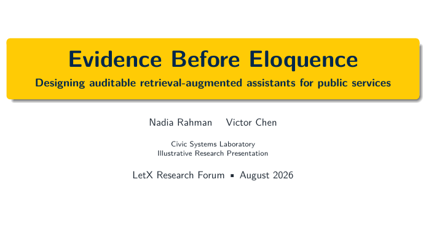</a><br><b>AnnArbor Beamer Theme</b><br><a href="https://letx.app/templates/presentations/annarbor-beamer-theme">Open in LetX</a> · <a href="./presentations/annarbor-beamer-theme">Source</a></td>
<td width="33%" valign="top" align="center"><a href="https://letx.app/templates/presentations/antibes-beamer-theme">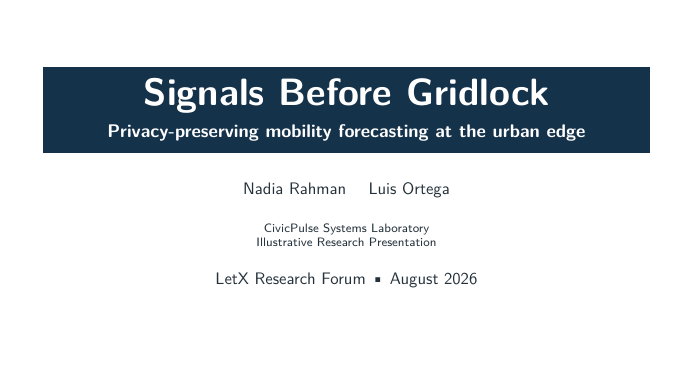</a><br><b>Antibes Beamer Theme</b><br><a href="https://letx.app/templates/presentations/antibes-beamer-theme">Open in LetX</a> · <a href="./presentations/antibes-beamer-theme">Source</a></td>
</tr>
<tr>
<td width="33%" valign="top" align="center"><a href="https://letx.app/templates/presentations/auriga-beamer-theme"></a><br><b>Auriga Beamer Theme</b><br><a href="https://letx.app/templates/presentations/auriga-beamer-theme">Open in LetX</a> · <a href="./presentations/auriga-beamer-theme">Source</a></td>
<td width="33%" valign="top" align="center"><a href="https://letx.app/templates/presentations/berlin-beamer-theme"></a><br><b>Berlin Beamer Theme</b><br><a href="https://letx.app/templates/presentations/berlin-beamer-theme">Open in LetX</a> · <a href="./presentations/berlin-beamer-theme">Source</a></td>
<td width="33%" valign="top" align="center"><a href="https://letx.app/templates/presentations/cambridgeus-beamer-theme">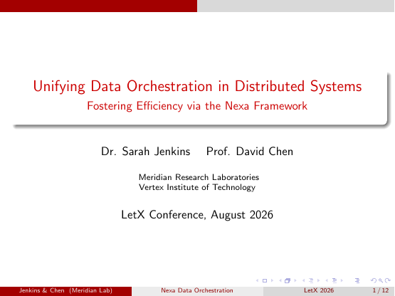</a><br><b>CambridgeUS Beamer Theme</b><br><a href="https://letx.app/templates/presentations/cambridgeus-beamer-theme">Open in LetX</a> · <a href="./presentations/cambridgeus-beamer-theme">Source</a></td>
</tr>
<tr>
<td width="33%" valign="top" align="center"><a href="https://letx.app/templates/presentations/beamer-code-walkthrough"></a><br><b>Code Walkthrough Presentation</b><br><a href="https://letx.app/templates/presentations/beamer-code-walkthrough">Open in LetX</a> · <a href="./presentations/beamer-code-walkthrough">Source</a></td>
<td width="33%" valign="top" align="center"><a href="https://letx.app/templates/presentations/consulting-pitch-deck"></a><br><b>Consulting Pitch Deck</b><br><a href="https://letx.app/templates/presentations/consulting-pitch-deck">Open in LetX</a> · <a href="./presentations/consulting-pitch-deck">Source</a></td>
<td width="33%" valign="top" align="center"><a href="https://letx.app/templates/presentations/copenhagen-beamer-theme">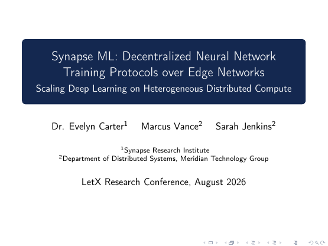</a><br><b>Copenhagen Beamer Theme</b><br><a href="https://letx.app/templates/presentations/copenhagen-beamer-theme">Open in LetX</a> · <a href="./presentations/copenhagen-beamer-theme">Source</a></td>
</tr>
<tr>
<td width="33%" valign="top" align="center"><a href="https://letx.app/templates/presentations/data-science-portfolio-pitch-deck"></a><br><b>Data Science Portfolio Pitch Deck</b><br><a href="https://letx.app/templates/presentations/data-science-portfolio-pitch-deck">Open in LetX</a> · <a href="./presentations/data-science-portfolio-pitch-deck">Source</a></td>
<td width="33%" valign="top" align="center"><a href="https://letx.app/templates/presentations/design-system-review-presentation"></a><br><b>Design System Review Presentation</b><br><a href="https://letx.app/templates/presentations/design-system-review-presentation">Open in LetX</a> · <a href="./presentations/design-system-review-presentation">Source</a></td>
<td width="33%" valign="top" align="center"><a href="https://letx.app/templates/presentations/developer-workshop-hands-on-tutorial-deck"></a><br><b>Developer Workshop Hands-on Tutorial Deck</b><br><a href="https://letx.app/templates/presentations/developer-workshop-hands-on-tutorial-deck">Open in LetX</a> · <a href="./presentations/developer-workshop-hands-on-tutorial-deck">Source</a></td>
</tr>
<tr>
<td width="33%" valign="top" align="center"><a href="https://letx.app/templates/presentations/editorial-annual-review-deck">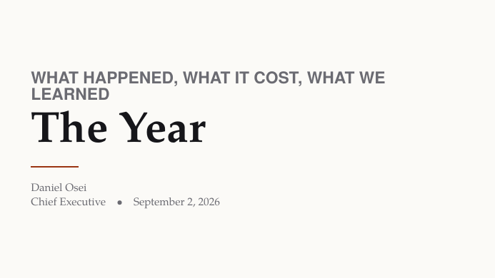</a><br><b>Editorial Annual Review Deck</b><br><a href="https://letx.app/templates/presentations/editorial-annual-review-deck">Open in LetX</a> · <a href="./presentations/editorial-annual-review-deck">Source</a></td>
<td width="33%" valign="top" align="center"><a href="https://letx.app/templates/presentations/editorial-brand-strategy-deck">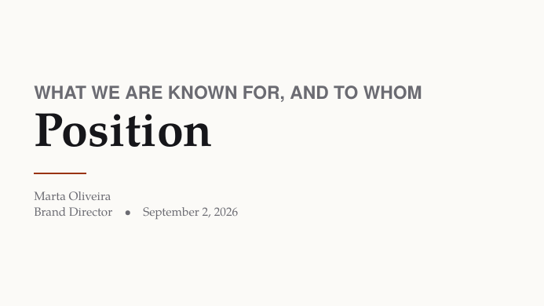</a><br><b>Editorial Brand Strategy Deck</b><br><a href="https://letx.app/templates/presentations/editorial-brand-strategy-deck">Open in LetX</a> · <a href="./presentations/editorial-brand-strategy-deck">Source</a></td>
<td width="33%" valign="top" align="center"><a href="https://letx.app/templates/presentations/editorial-keynote-narrative-deck">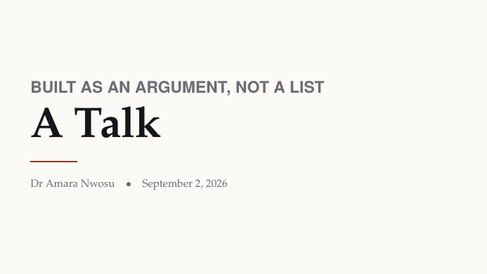</a><br><b>Editorial Keynote Narrative Deck</b><br><a href="https://letx.app/templates/presentations/editorial-keynote-narrative-deck">Open in LetX</a> · <a href="./presentations/editorial-keynote-narrative-deck">Source</a></td>
</tr>
<tr>
<td width="33%" valign="top" align="center"><a href="https://letx.app/templates/presentations/editorial-research-story-deck">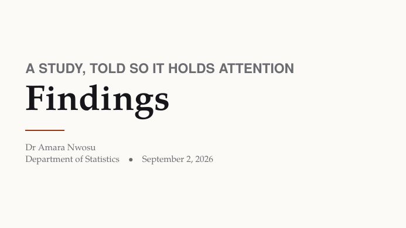</a><br><b>Editorial Research Story Deck</b><br><a href="https://letx.app/templates/presentations/editorial-research-story-deck">Open in LetX</a> · <a href="./presentations/editorial-research-story-deck">Source</a></td>
<td width="33%" valign="top" align="center"><a href="https://letx.app/templates/presentations/focus-beamer-theme">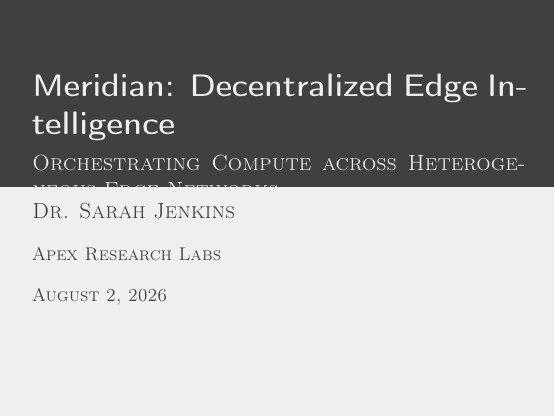</a><br><b>Focus Beamer Theme</b><br><a href="https://letx.app/templates/presentations/focus-beamer-theme">Open in LetX</a> · <a href="./presentations/focus-beamer-theme">Source</a></td>
<td width="33%" valign="top" align="center"><a href="https://letx.app/templates/presentations/frankfurt-beamer-theme"></a><br><b>Frankfurt Beamer Theme</b><br><a href="https://letx.app/templates/presentations/frankfurt-beamer-theme">Open in LetX</a> · <a href="./presentations/frankfurt-beamer-theme">Source</a></td>
</tr>
<tr>
<td width="33%" valign="top" align="center"><a href="https://letx.app/templates/presentations/glass-investor-update-deck">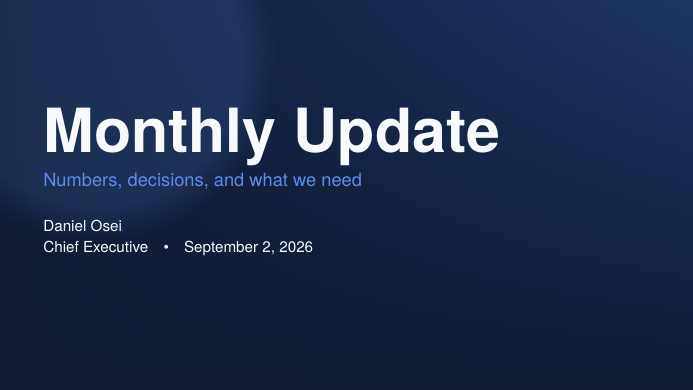</a><br><b>Glass Investor Update Deck</b><br><a href="https://letx.app/templates/presentations/glass-investor-update-deck">Open in LetX</a> · <a href="./presentations/glass-investor-update-deck">Source</a></td>
<td width="33%" valign="top" align="center"><a href="https://letx.app/templates/presentations/glass-partnership-proposal-deck">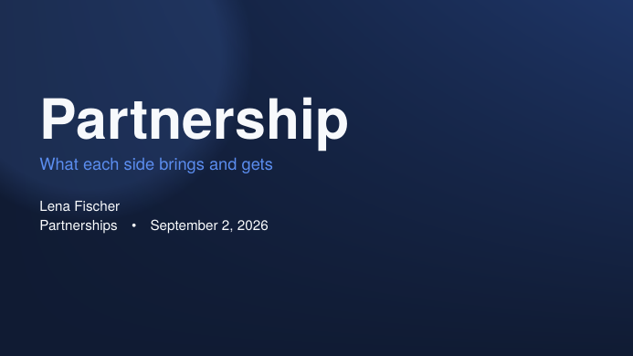</a><br><b>Glass Partnership Proposal Deck</b><br><a href="https://letx.app/templates/presentations/glass-partnership-proposal-deck">Open in LetX</a> · <a href="./presentations/glass-partnership-proposal-deck">Source</a></td>
<td width="33%" valign="top" align="center"><a href="https://letx.app/templates/presentations/glass-product-launch-deck"></a><br><b>Glass Product Launch Deck</b><br><a href="https://letx.app/templates/presentations/glass-product-launch-deck">Open in LetX</a> · <a href="./presentations/glass-product-launch-deck">Source</a></td>
</tr>
<tr>
<td width="33%" valign="top" align="center"><a href="https://letx.app/templates/presentations/glass-quarterly-roadmap-deck">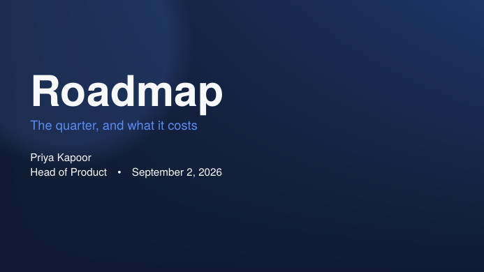</a><br><b>Glass Quarterly Roadmap Deck</b><br><a href="https://letx.app/templates/presentations/glass-quarterly-roadmap-deck">Open in LetX</a> · <a href="./presentations/glass-quarterly-roadmap-deck">Source</a></td>
<td width="33%" valign="top" align="center"><a href="https://letx.app/templates/presentations/grant-renewal-progress-slides"></a><br><b>Grant Renewal Progress Slides</b><br><a href="https://letx.app/templates/presentations/grant-renewal-progress-slides">Open in LetX</a> · <a href="./presentations/grant-renewal-progress-slides">Source</a></td>
<td width="33%" valign="top" align="center"><a href="https://letx.app/templates/presentations/hannover-beamer-theme">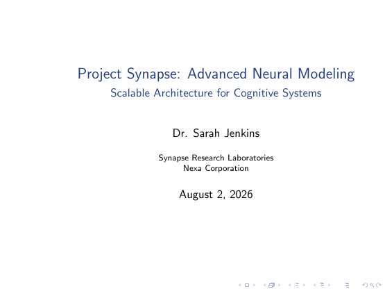</a><br><b>Hannover Beamer Theme</b><br><a href="https://letx.app/templates/presentations/hannover-beamer-theme">Open in LetX</a> · <a href="./presentations/hannover-beamer-theme">Source</a></td>
</tr>
<tr>
<td width="33%" valign="top" align="center"><a href="https://letx.app/templates/presentations/hologram-beamer-theme"></a><br><b>Hologram Beamer Theme</b><br><a href="https://letx.app/templates/presentations/hologram-beamer-theme">Open in LetX</a> · <a href="./presentations/hologram-beamer-theme">Source</a></td>
<td width="33%" valign="top" align="center"><a href="https://letx.app/templates/presentations/investor-pitch-deck"></a><br><b>Investor Pitch Deck (Minimalist Dark)</b><br><a href="https://letx.app/templates/presentations/investor-pitch-deck">Open in LetX</a> · <a href="./presentations/investor-pitch-deck">Source</a></td>
<td width="33%" valign="top" align="center"><a href="https://letx.app/templates/presentations/journal-club-presentation"></a><br><b>Journal Club Presentation</b><br><a href="https://letx.app/templates/presentations/journal-club-presentation">Open in LetX</a> · <a href="./presentations/journal-club-presentation">Source</a></td>
</tr>
<tr>
<td width="33%" valign="top" align="center"><a href="https://letx.app/templates/presentations/lab-meeting-progress-slides"></a><br><b>Lab Meeting Progress Slides</b><br><a href="https://letx.app/templates/presentations/lab-meeting-progress-slides">Open in LetX</a> · <a href="./presentations/lab-meeting-progress-slides">Source</a></td>
<td width="33%" valign="top" align="center"><a href="https://letx.app/templates/presentations/lightning-talk-poster-teaser">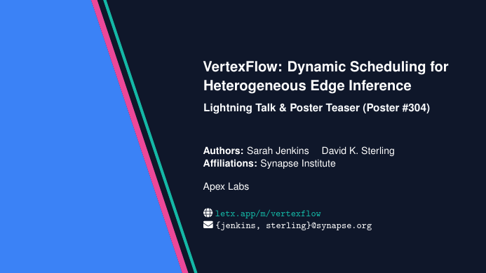</a><br><b>Lightning Talk Poster Teaser</b><br><a href="https://letx.app/templates/presentations/lightning-talk-poster-teaser">Open in LetX</a> · <a href="./presentations/lightning-talk-poster-teaser">Source</a></td>
<td width="33%" valign="top" align="center"><a href="https://letx.app/templates/presentations/machine-learning-model-review-presentation"></a><br><b>Machine Learning Model Review Presentation</b><br><a href="https://letx.app/templates/presentations/machine-learning-model-review-presentation">Open in LetX</a> · <a href="./presentations/machine-learning-model-review-presentation">Source</a></td>
</tr>
<tr>
<td width="33%" valign="top" align="center"><a href="https://letx.app/templates/presentations/masters-defense-beamer"></a><br><b>Master's Defense Beamer</b><br><a href="https://letx.app/templates/presentations/masters-defense-beamer">Open in LetX</a> · <a href="./presentations/masters-defense-beamer">Source</a></td>
<td width="33%" valign="top" align="center"><a href="https://letx.app/templates/presentations/masters-thesis-defense-slides">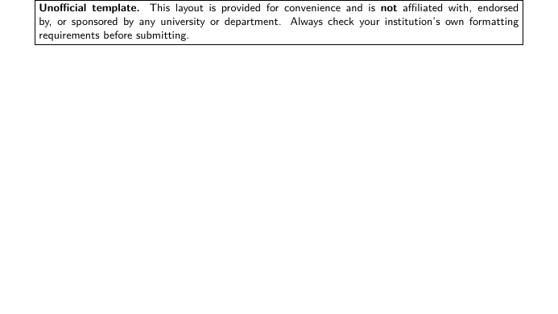</a><br><b>Master's Thesis Defense Slides</b><br><a href="https://letx.app/templates/presentations/masters-thesis-defense-slides">Open in LetX</a> · <a href="./presentations/masters-thesis-defense-slides">Source</a></td>
<td width="33%" valign="top" align="center"><a href="https://letx.app/templates/presentations/beamer-medical-case"></a><br><b>Medical Case Presentation</b><br><a href="https://letx.app/templates/presentations/beamer-medical-case">Open in LetX</a> · <a href="./presentations/beamer-medical-case">Source</a></td>
</tr>
<tr>
<td width="33%" valign="top" align="center"><a href="https://letx.app/templates/presentations/investor-update-deck">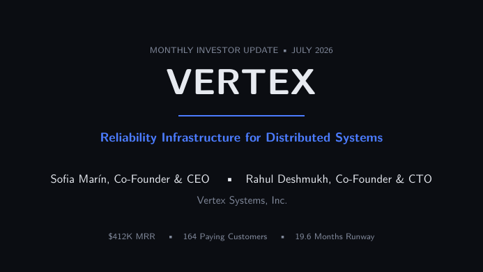</a><br><b>Monthly Investor Update Deck</b><br><a href="https://letx.app/templates/presentations/investor-update-deck">Open in LetX</a> · <a href="./presentations/investor-update-deck">Source</a></td>
<td width="33%" valign="top" align="center"><a href="https://letx.app/templates/presentations/ph-d-candidacy-proposal-slides"></a><br><b>Ph.D. Candidacy Proposal Slides</b><br><a href="https://letx.app/templates/presentations/ph-d-candidacy-proposal-slides">Open in LetX</a> · <a href="./presentations/ph-d-candidacy-proposal-slides">Source</a></td>
<td width="33%" valign="top" align="center"><a href="https://letx.app/templates/presentations/phd-defense-beamer"></a><br><b>PhD Defense Beamer</b><br><a href="https://letx.app/templates/presentations/phd-defense-beamer">Open in LetX</a> · <a href="./presentations/phd-defense-beamer">Source</a></td>
</tr>
<tr>
<td width="33%" valign="top" align="center"><a href="https://letx.app/templates/presentations/phd-proposal-defense-slides"></a><br><b>PhD Proposal Defense Slides</b><br><a href="https://letx.app/templates/presentations/phd-proposal-defense-slides">Open in LetX</a> · <a href="./presentations/phd-proposal-defense-slides">Source</a></td>
<td width="33%" valign="top" align="center"><a href="https://letx.app/templates/presentations/postdoctoral-fellowship-interview-presentation">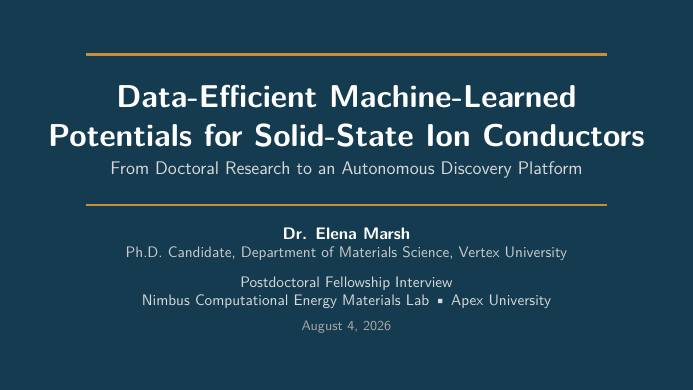</a><br><b>Postdoctoral Fellowship Interview Presentation</b><br><a href="https://letx.app/templates/presentations/postdoctoral-fellowship-interview-presentation">Open in LetX</a> · <a href="./presentations/postdoctoral-fellowship-interview-presentation">Source</a></td>
<td width="33%" valign="top" align="center"><a href="https://letx.app/templates/presentations/qualifying-exam-presentation"></a><br><b>Qualifying Exam Presentation</b><br><a href="https://letx.app/templates/presentations/qualifying-exam-presentation">Open in LetX</a> · <a href="./presentations/qualifying-exam-presentation">Source</a></td>
</tr>
<tr>
<td width="33%" valign="top" align="center"><a href="https://letx.app/templates/presentations/beamer-business-review"></a><br><b>Quarterly Business Review (QBR)</b><br><a href="https://letx.app/templates/presentations/beamer-business-review">Open in LetX</a> · <a href="./presentations/beamer-business-review">Source</a></td>
<td width="33%" valign="top" align="center"><a href="https://letx.app/templates/presentations/research-group-onboarding-slides"></a><br><b>Research Group Onboarding Slides</b><br><a href="https://letx.app/templates/presentations/research-group-onboarding-slides">Open in LetX</a> · <a href="./presentations/research-group-onboarding-slides">Source</a></td>
<td width="33%" valign="top" align="center"><a href="https://letx.app/templates/presentations/research-lab-group-meeting-slides">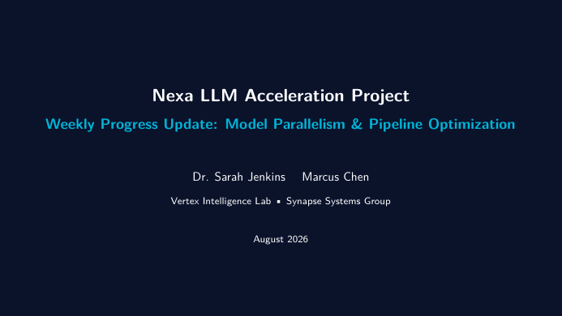</a><br><b>Research Lab Group Meeting Slides</b><br><a href="https://letx.app/templates/presentations/research-lab-group-meeting-slides">Open in LetX</a> · <a href="./presentations/research-lab-group-meeting-slides">Source</a></td>
</tr>
<tr>
<td width="33%" valign="top" align="center"><a href="https://letx.app/templates/presentations/rochester-beamer-theme">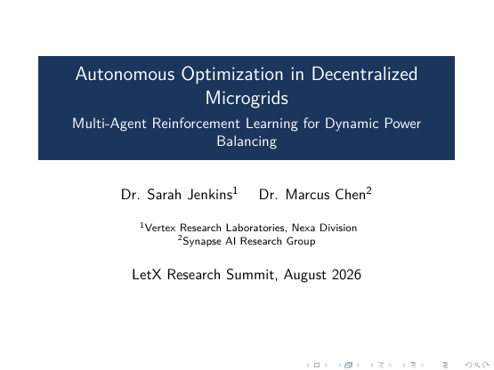</a><br><b>Rochester Beamer Theme</b><br><a href="https://letx.app/templates/presentations/rochester-beamer-theme">Open in LetX</a> · <a href="./presentations/rochester-beamer-theme">Source</a></td>
<td width="33%" valign="top" align="center"><a href="https://letx.app/templates/presentations/saas-product-demo-slides"></a><br><b>SaaS Product Demo Slides</b><br><a href="https://letx.app/templates/presentations/saas-product-demo-slides">Open in LetX</a> · <a href="./presentations/saas-product-demo-slides">Source</a></td>
<td width="33%" valign="top" align="center"><a href="https://letx.app/templates/presentations/singapore-beamer-theme">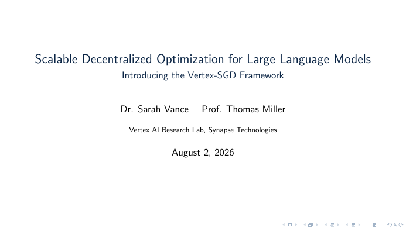</a><br><b>Singapore Beamer Theme</b><br><a href="https://letx.app/templates/presentations/singapore-beamer-theme">Open in LetX</a> · <a href="./presentations/singapore-beamer-theme">Source</a></td>
</tr>
<tr>
<td width="33%" valign="top" align="center"><a href="https://letx.app/templates/presentations/sintef-beamer-theme"></a><br><b>SINTEF Beamer Theme</b><br><a href="https://letx.app/templates/presentations/sintef-beamer-theme">Open in LetX</a> · <a href="./presentations/sintef-beamer-theme">Source</a></td>
<td width="33%" valign="top" align="center"><a href="https://letx.app/templates/presentations/software-architecture-review-slides"></a><br><b>Software Architecture Review Slides</b><br><a href="https://letx.app/templates/presentations/software-architecture-review-slides">Open in LetX</a> · <a href="./presentations/software-architecture-review-slides">Source</a></td>
<td width="33%" valign="top" align="center"><a href="https://letx.app/templates/presentations/beamer-pitch-deck"></a><br><b>Startup Pitch Deck (Beamer)</b><br><a href="https://letx.app/templates/presentations/beamer-pitch-deck">Open in LetX</a> · <a href="./presentations/beamer-pitch-deck">Source</a></td>
</tr>
<tr>
<td width="33%" valign="top" align="center"><a href="https://letx.app/templates/presentations/student-conference-talk-slides"></a><br><b>Student Conference Talk Slides</b><br><a href="https://letx.app/templates/presentations/student-conference-talk-slides">Open in LetX</a> · <a href="./presentations/student-conference-talk-slides">Source</a></td>
<td width="33%" valign="top" align="center"><a href="https://letx.app/templates/presentations/swiss-methods-briefing-deck">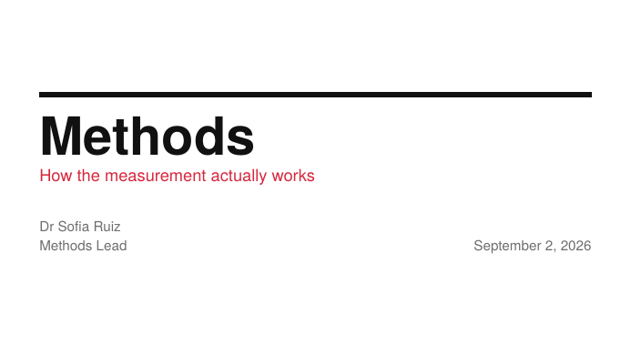</a><br><b>Swiss Methods Briefing Deck</b><br><a href="https://letx.app/templates/presentations/swiss-methods-briefing-deck">Open in LetX</a> · <a href="./presentations/swiss-methods-briefing-deck">Source</a></td>
<td width="33%" valign="top" align="center"><a href="https://letx.app/templates/presentations/swiss-portfolio-review-deck">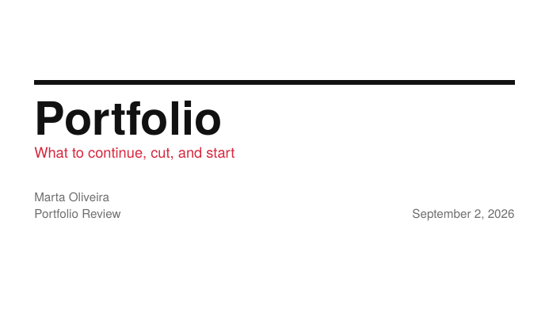</a><br><b>Swiss Portfolio Review Deck</b><br><a href="https://letx.app/templates/presentations/swiss-portfolio-review-deck">Open in LetX</a> · <a href="./presentations/swiss-portfolio-review-deck">Source</a></td>
</tr>
<tr>
<td width="33%" valign="top" align="center"><a href="https://letx.app/templates/presentations/swiss-research-group-update">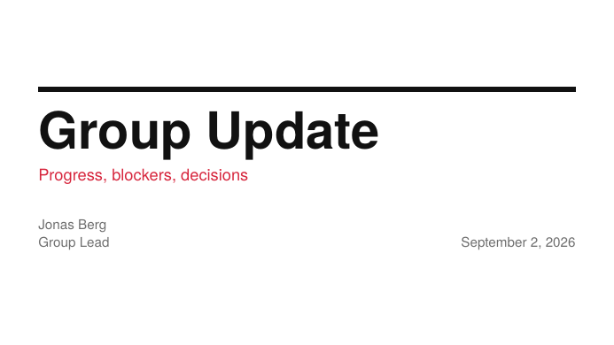</a><br><b>Swiss Research Group Update</b><br><a href="https://letx.app/templates/presentations/swiss-research-group-update">Open in LetX</a> · <a href="./presentations/swiss-research-group-update">Source</a></td>
<td width="33%" valign="top" align="center"><a href="https://letx.app/templates/presentations/swiss-standards-proposal-deck">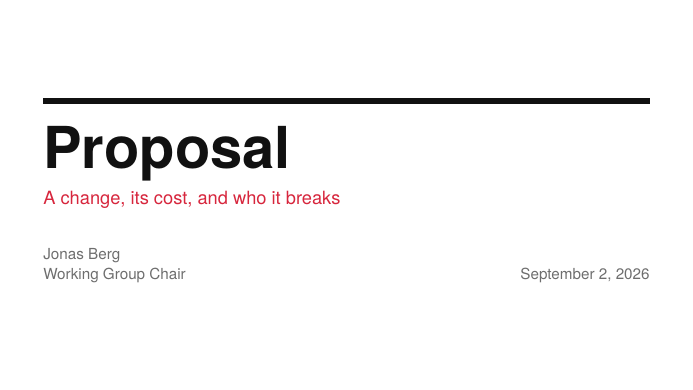</a><br><b>Swiss Standards Proposal Deck</b><br><a href="https://letx.app/templates/presentations/swiss-standards-proposal-deck">Open in LetX</a> · <a href="./presentations/swiss-standards-proposal-deck">Source</a></td>
<td width="33%" valign="top" align="center"><a href="https://letx.app/templates/presentations/szeged-beamer-theme"></a><br><b>Szeged Beamer Theme</b><br><a href="https://letx.app/templates/presentations/szeged-beamer-theme">Open in LetX</a> · <a href="./presentations/szeged-beamer-theme">Source</a></td>
</tr>
<tr>
<td width="33%" valign="top" align="center"><a href="https://letx.app/templates/presentations/tech-conference-keynote-slide-deck"></a><br><b>Tech Conference Keynote Slide Deck</b><br><a href="https://letx.app/templates/presentations/tech-conference-keynote-slide-deck">Open in LetX</a> · <a href="./presentations/tech-conference-keynote-slide-deck">Source</a></td>
<td width="33%" valign="top" align="center"><a href="https://letx.app/templates/presentations/technical-design-review-slides"></a><br><b>Technical Design Review Slides</b><br><a href="https://letx.app/templates/presentations/technical-design-review-slides">Open in LetX</a> · <a href="./presentations/technical-design-review-slides">Source</a></td>
<td width="33%" valign="top" align="center"><a href="https://letx.app/templates/presentations/terminal-api-launch-deck">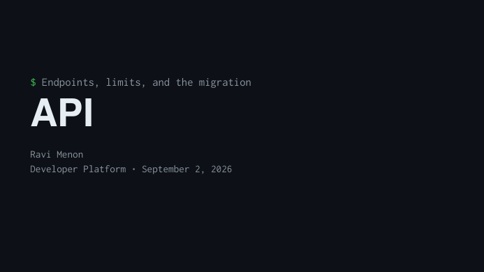</a><br><b>Terminal API Launch Deck</b><br><a href="https://letx.app/templates/presentations/terminal-api-launch-deck">Open in LetX</a> · <a href="./presentations/terminal-api-launch-deck">Source</a></td>
</tr>
<tr>
<td width="33%" valign="top" align="center"><a href="https://letx.app/templates/presentations/terminal-incident-postmortem-deck">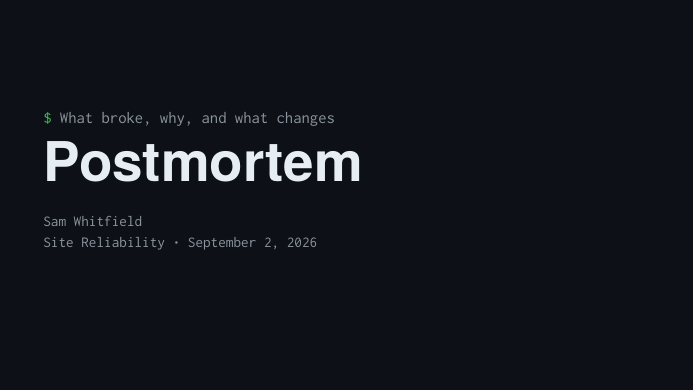</a><br><b>Terminal Incident Postmortem Deck</b><br><a href="https://letx.app/templates/presentations/terminal-incident-postmortem-deck">Open in LetX</a> · <a href="./presentations/terminal-incident-postmortem-deck">Source</a></td>
<td width="33%" valign="top" align="center"><a href="https://letx.app/templates/presentations/terminal-migration-plan-deck">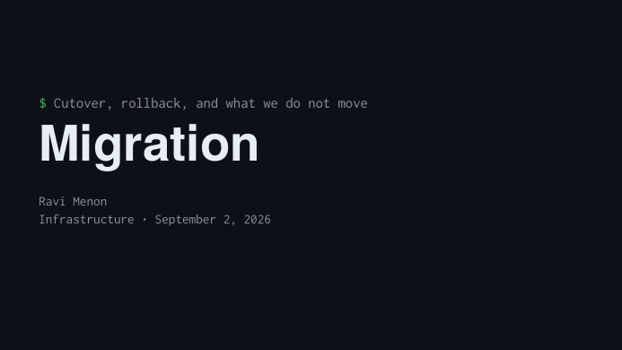</a><br><b>Terminal Migration Plan Deck</b><br><a href="https://letx.app/templates/presentations/terminal-migration-plan-deck">Open in LetX</a> · <a href="./presentations/terminal-migration-plan-deck">Source</a></td>
<td width="33%" valign="top" align="center"><a href="https://letx.app/templates/presentations/terminal-security-review-deck">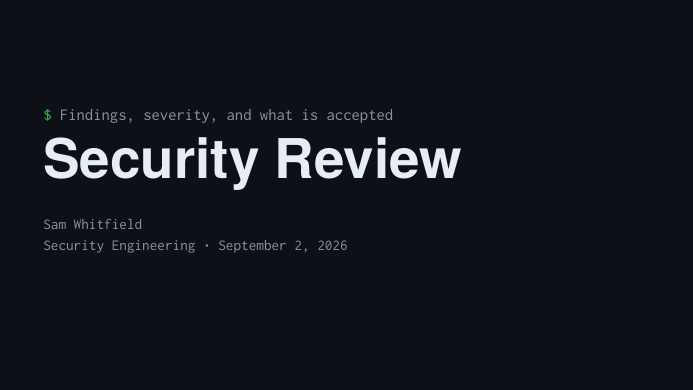</a><br><b>Terminal Security Review Deck</b><br><a href="https://letx.app/templates/presentations/terminal-security-review-deck">Open in LetX</a> · <a href="./presentations/terminal-security-review-deck">Source</a></td>
</tr>
<tr>
<td width="33%" valign="top" align="center"><a href="https://letx.app/templates/presentations/three-minute-thesis-slides"></a><br><b>Three Minute Thesis (3MT) Slide</b><br><a href="https://letx.app/templates/presentations/three-minute-thesis-slides">Open in LetX</a> · <a href="./presentations/three-minute-thesis-slides">Source</a></td>
<td width="33%" valign="top" align="center"><a href="https://letx.app/templates/presentations/trigon-beamer-theme"></a><br><b>Trigon Beamer Theme</b><br><a href="https://letx.app/templates/presentations/trigon-beamer-theme">Open in LetX</a> · <a href="./presentations/trigon-beamer-theme">Source</a></td>
<td width="33%" valign="top" align="center"><a href="https://letx.app/templates/presentations/beamer-lecture-slides"></a><br><b>University Lecture Slides</b><br><a href="https://letx.app/templates/presentations/beamer-lecture-slides">Open in LetX</a> · <a href="./presentations/beamer-lecture-slides">Source</a></td>
</tr>
<tr>
<td width="33%" valign="top" align="center"><a href="https://letx.app/templates/presentations/warsaw-beamer-theme">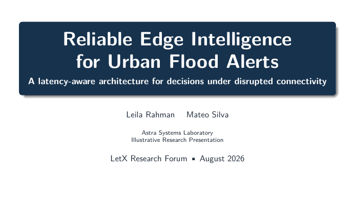</a><br><b>Warsaw Beamer Theme</b><br><a href="https://letx.app/templates/presentations/warsaw-beamer-theme">Open in LetX</a> · <a href="./presentations/warsaw-beamer-theme">Source</a></td>
</tr>
</table>

### Books & Long-Form Documents

9 templates. [Browse this category on LetX](https://letx.app/templates/books)

<table>
<tr>
<td width="33%" valign="top" align="center"><a href="https://letx.app/templates/books/academic-book-proposal"></a><br><b>Academic Book Proposal</b><br><a href="https://letx.app/templates/books/academic-book-proposal">Open in LetX</a> · <a href="./books/academic-book-proposal">Source</a></td>
<td width="33%" valign="top" align="center"><a href="https://letx.app/templates/books/dissertation-chapter"></a><br><b>Dissertation Chapter</b><br><a href="https://letx.app/templates/books/dissertation-chapter">Open in LetX</a> · <a href="./books/dissertation-chapter">Source</a></td>
<td width="33%" valign="top" align="center"><a href="https://letx.app/templates/books/edited-volume-chapter"></a><br><b>Edited Volume Chapter</b><br><a href="https://letx.app/templates/books/edited-volume-chapter">Open in LetX</a> · <a href="./books/edited-volume-chapter">Source</a></td>
</tr>
<tr>
<td width="33%" valign="top" align="center"><a href="https://letx.app/templates/books/monograph-manuscript-for-peer-review"></a><br><b>Monograph Manuscript for Peer Review</b><br><a href="https://letx.app/templates/books/monograph-manuscript-for-peer-review">Open in LetX</a> · <a href="./books/monograph-manuscript-for-peer-review">Source</a></td>
<td width="33%" valign="top" align="center"><a href="https://letx.app/templates/books/product-user-manual"></a><br><b>Product User Manual</b><br><a href="https://letx.app/templates/books/product-user-manual">Open in LetX</a> · <a href="./books/product-user-manual">Source</a></td>
<td width="33%" valign="top" align="center"><a href="https://letx.app/templates/books/scientific-magazine-quarterly"></a><br><b>Scientific Magazine (Quarterly)</b><br><a href="https://letx.app/templates/books/scientific-magazine-quarterly">Open in LetX</a> · <a href="./books/scientific-magazine-quarterly">Source</a></td>
</tr>
<tr>
<td width="33%" valign="top" align="center"><a href="https://letx.app/templates/books/scientific-monograph"></a><br><b>Scientific Monograph (Book)</b><br><a href="https://letx.app/templates/books/scientific-monograph">Open in LetX</a> · <a href="./books/scientific-monograph">Source</a></td>
<td width="33%" valign="top" align="center"><a href="https://letx.app/templates/books/undergraduate-honours-thesis"></a><br><b>Undergraduate Honours Thesis</b><br><a href="https://letx.app/templates/books/undergraduate-honours-thesis">Open in LetX</a> · <a href="./books/undergraduate-honours-thesis">Source</a></td>
<td width="33%" valign="top" align="center"><a href="https://letx.app/templates/books/viva-preparation-document"></a><br><b>Viva Preparation Document</b><br><a href="https://letx.app/templates/books/viva-preparation-document">Open in LetX</a> · <a href="./books/viva-preparation-document">Source</a></td>
</tr>
</table>

### Formal Letters & Letterheads

5 templates. [Browse this category on LetX](https://letx.app/templates/formal-letters)

<table>
<tr>
<td width="33%" valign="top" align="center"><a href="https://letx.app/templates/formal-letters/academic-letterhead"></a><br><b>Academic Letterhead</b><br><a href="https://letx.app/templates/formal-letters/academic-letterhead">Open in LetX</a> · <a href="./formal-letters/academic-letterhead">Source</a></td>
<td width="33%" valign="top" align="center"><a href="https://letx.app/templates/formal-letters/creative-letterhead"></a><br><b>Creative Studio Letterhead</b><br><a href="https://letx.app/templates/formal-letters/creative-letterhead">Open in LetX</a> · <a href="./formal-letters/creative-letterhead">Source</a></td>
<td width="33%" valign="top" align="center"><a href="https://letx.app/templates/formal-letters/law-firm-letterhead"></a><br><b>Law Firm Letterhead</b><br><a href="https://letx.app/templates/formal-letters/law-firm-letterhead">Open in LetX</a> · <a href="./formal-letters/law-firm-letterhead">Source</a></td>
</tr>
<tr>
<td width="33%" valign="top" align="center"><a href="https://letx.app/templates/formal-letters/letter-of-intent"></a><br><b>Letter of Intent</b><br><a href="https://letx.app/templates/formal-letters/letter-of-intent">Open in LetX</a> · <a href="./formal-letters/letter-of-intent">Source</a></td>
<td width="33%" valign="top" align="center"><a href="https://letx.app/templates/formal-letters/modern-business-letterhead"></a><br><b>Modern Business Letterhead</b><br><a href="https://letx.app/templates/formal-letters/modern-business-letterhead">Open in LetX</a> · <a href="./formal-letters/modern-business-letterhead">Source</a></td>
</tr>
</table>

### Technical Documentation

31 templates. [Browse this category on LetX](https://letx.app/templates/tech-docs)

<table>
<tr>
<td width="33%" valign="top" align="center"><a href="https://letx.app/templates/tech-docs/ablation-study-report"></a><br><b>Ablation Study Report</b><br><a href="https://letx.app/templates/tech-docs/ablation-study-report">Open in LetX</a> · <a href="./tech-docs/ablation-study-report">Source</a></td>
<td width="33%" valign="top" align="center"><a href="https://letx.app/templates/tech-docs/api-documentation-swagger"></a><br><b>API Documentation (Swagger Style)</b><br><a href="https://letx.app/templates/tech-docs/api-documentation-swagger">Open in LetX</a> · <a href="./tech-docs/api-documentation-swagger">Source</a></td>
<td width="33%" valign="top" align="center"><a href="https://letx.app/templates/tech-docs/api-gateway-security-and-configuration-specification"></a><br><b>API Gateway Security and Configuration Specification</b><br><a href="https://letx.app/templates/tech-docs/api-gateway-security-and-configuration-specification">Open in LetX</a> · <a href="./tech-docs/api-gateway-security-and-configuration-specification">Source</a></td>
</tr>
<tr>
<td width="33%" valign="top" align="center"><a href="https://letx.app/templates/tech-docs/api-reference-documentation">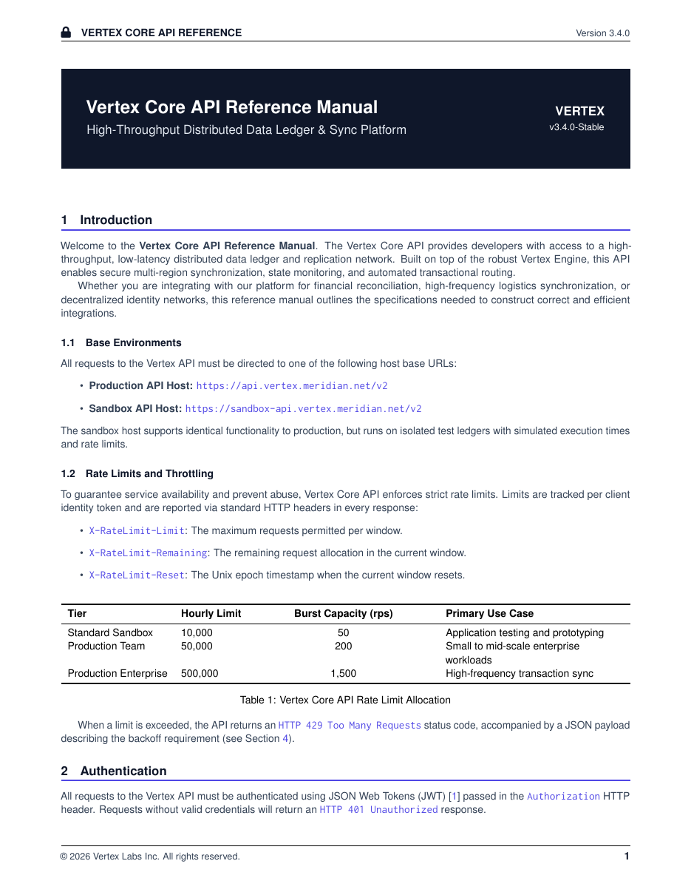</a><br><b>API Reference Documentation</b><br><a href="https://letx.app/templates/tech-docs/api-reference-documentation">Open in LetX</a> · <a href="./tech-docs/api-reference-documentation">Source</a></td>
<td width="33%" valign="top" align="center"><a href="https://letx.app/templates/tech-docs/capacity-planning-and-performance-report"></a><br><b>Capacity Planning and Performance Report</b><br><a href="https://letx.app/templates/tech-docs/capacity-planning-and-performance-report">Open in LetX</a> · <a href="./tech-docs/capacity-planning-and-performance-report">Source</a></td>
<td width="33%" valign="top" align="center"><a href="https://letx.app/templates/tech-docs/cloud-infrastructure-architecture-design-document"></a><br><b>Cloud Infrastructure Architecture Design Document</b><br><a href="https://letx.app/templates/tech-docs/cloud-infrastructure-architecture-design-document">Open in LetX</a> · <a href="./tech-docs/cloud-infrastructure-architecture-design-document">Source</a></td>
</tr>
<tr>
<td width="33%" valign="top" align="center"><a href="https://letx.app/templates/tech-docs/database-migration-schema-evolution-plan"></a><br><b>Database Migration & Schema Evolution Plan</b><br><a href="https://letx.app/templates/tech-docs/database-migration-schema-evolution-plan">Open in LetX</a> · <a href="./tech-docs/database-migration-schema-evolution-plan">Source</a></td>
<td width="33%" valign="top" align="center"><a href="https://letx.app/templates/tech-docs/database-schema-doc"></a><br><b>Database Schema Documentation</b><br><a href="https://letx.app/templates/tech-docs/database-schema-doc">Open in LetX</a> · <a href="./tech-docs/database-schema-doc">Source</a></td>
<td width="33%" valign="top" align="center"><a href="https://letx.app/templates/tech-docs/dataset-datasheet"></a><br><b>Dataset Datasheet</b><br><a href="https://letx.app/templates/tech-docs/dataset-datasheet">Open in LetX</a> · <a href="./tech-docs/dataset-datasheet">Source</a></td>
</tr>
<tr>
<td width="33%" valign="top" align="center"><a href="https://letx.app/templates/tech-docs/devops-ci-cd-deployment-pipeline-runner-spec"></a><br><b>DevOps CI/CD Deployment Pipeline Runner Spec</b><br><a href="https://letx.app/templates/tech-docs/devops-ci-cd-deployment-pipeline-runner-spec">Open in LetX</a> · <a href="./tech-docs/devops-ci-cd-deployment-pipeline-runner-spec">Source</a></td>
<td width="33%" valign="top" align="center"><a href="https://letx.app/templates/tech-docs/disaster-recovery-plan"></a><br><b>Disaster Recovery Plan</b><br><a href="https://letx.app/templates/tech-docs/disaster-recovery-plan">Open in LetX</a> · <a href="./tech-docs/disaster-recovery-plan">Source</a></td>
<td width="33%" valign="top" align="center"><a href="https://letx.app/templates/tech-docs/engineering-design-doc"></a><br><b>Engineering Design Doc</b><br><a href="https://letx.app/templates/tech-docs/engineering-design-doc">Open in LetX</a> · <a href="./tech-docs/engineering-design-doc">Source</a></td>
</tr>
<tr>
<td width="33%" valign="top" align="center"><a href="https://letx.app/templates/tech-docs/graphql-api-reference"></a><br><b>GraphQL API Reference</b><br><a href="https://letx.app/templates/tech-docs/graphql-api-reference">Open in LetX</a> · <a href="./tech-docs/graphql-api-reference">Source</a></td>
<td width="33%" valign="top" align="center"><a href="https://letx.app/templates/tech-docs/hardware-verification-validation-test-plan"></a><br><b>Hardware Verification & Validation Test Plan</b><br><a href="https://letx.app/templates/tech-docs/hardware-verification-validation-test-plan">Open in LetX</a> · <a href="./tech-docs/hardware-verification-validation-test-plan">Source</a></td>
<td width="33%" valign="top" align="center"><a href="https://letx.app/templates/tech-docs/incident-postmortem"></a><br><b>Incident Postmortem</b><br><a href="https://letx.app/templates/tech-docs/incident-postmortem">Open in LetX</a> · <a href="./tech-docs/incident-postmortem">Source</a></td>
</tr>
<tr>
<td width="33%" valign="top" align="center"><a href="https://letx.app/templates/tech-docs/security-policy-document">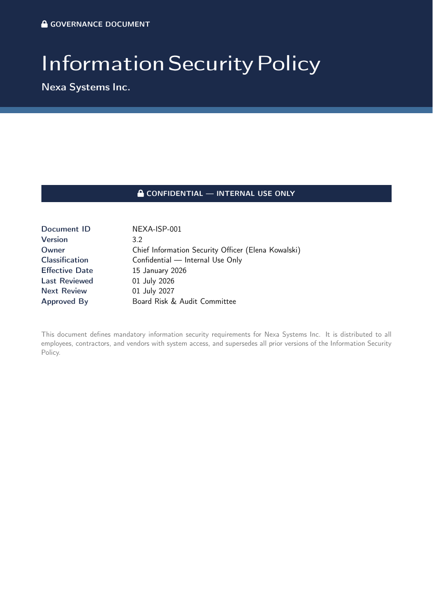</a><br><b>Information Security Policy</b><br><a href="https://letx.app/templates/tech-docs/security-policy-document">Open in LetX</a> · <a href="./tech-docs/security-policy-document">Source</a></td>
<td width="33%" valign="top" align="center"><a href="https://letx.app/templates/tech-docs/iot-edge-device-firmware-update-protocol"></a><br><b>IoT Edge Device Firmware Update Protocol</b><br><a href="https://letx.app/templates/tech-docs/iot-edge-device-firmware-update-protocol">Open in LetX</a> · <a href="./tech-docs/iot-edge-device-firmware-update-protocol">Source</a></td>
<td width="33%" valign="top" align="center"><a href="https://letx.app/templates/tech-docs/kubernetes-cluster-architecture-specification"></a><br><b>Kubernetes Cluster Architecture Specification</b><br><a href="https://letx.app/templates/tech-docs/kubernetes-cluster-architecture-specification">Open in LetX</a> · <a href="./tech-docs/kubernetes-cluster-architecture-specification">Source</a></td>
</tr>
<tr>
<td width="33%" valign="top" align="center"><a href="https://letx.app/templates/tech-docs/microservices-integration-interface-design-document"></a><br><b>Microservices Integration Interface Design Document</b><br><a href="https://letx.app/templates/tech-docs/microservices-integration-interface-design-document">Open in LetX</a> · <a href="./tech-docs/microservices-integration-interface-design-document">Source</a></td>
<td width="33%" valign="top" align="center"><a href="https://letx.app/templates/tech-docs/model-card-ml"></a><br><b>Model Card (ML)</b><br><a href="https://letx.app/templates/tech-docs/model-card-ml">Open in LetX</a> · <a href="./tech-docs/model-card-ml">Source</a></td>
<td width="33%" valign="top" align="center"><a href="https://letx.app/templates/tech-docs/runbook-operational-procedure"></a><br><b>Operational Runbook</b><br><a href="https://letx.app/templates/tech-docs/runbook-operational-procedure">Open in LetX</a> · <a href="./tech-docs/runbook-operational-procedure">Source</a></td>
</tr>
<tr>
<td width="33%" valign="top" align="center"><a href="https://letx.app/templates/tech-docs/product-requirements-document">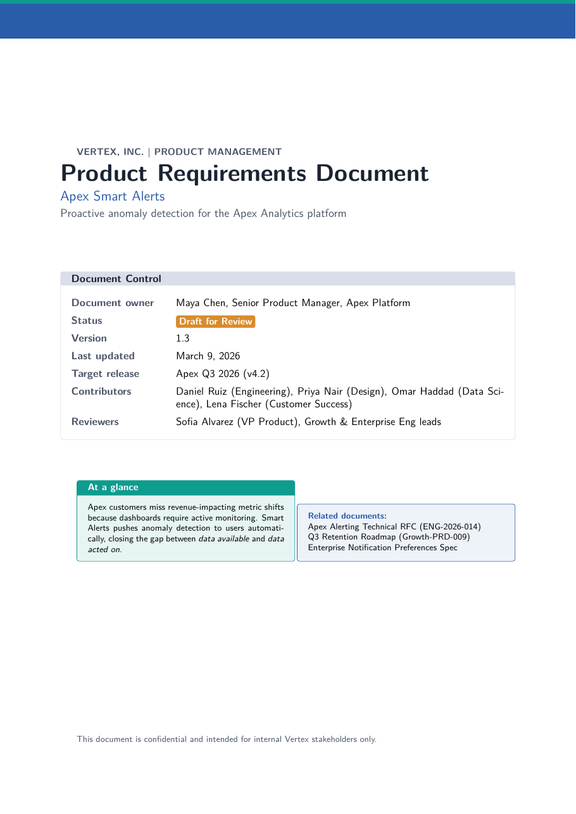</a><br><b>Product Requirements Document</b><br><a href="https://letx.app/templates/tech-docs/product-requirements-document">Open in LetX</a> · <a href="./tech-docs/product-requirements-document">Source</a></td>
<td width="33%" valign="top" align="center"><a href="https://letx.app/templates/tech-docs/rest-api-reference"></a><br><b>REST API Reference</b><br><a href="https://letx.app/templates/tech-docs/rest-api-reference">Open in LetX</a> · <a href="./tech-docs/rest-api-reference">Source</a></td>
<td width="33%" valign="top" align="center"><a href="https://letx.app/templates/tech-docs/release-notes-template"></a><br><b>Software Release Notes</b><br><a href="https://letx.app/templates/tech-docs/release-notes-template">Open in LetX</a> · <a href="./tech-docs/release-notes-template">Source</a></td>
</tr>
<tr>
<td width="33%" valign="top" align="center"><a href="https://letx.app/templates/tech-docs/software-requirements-specification">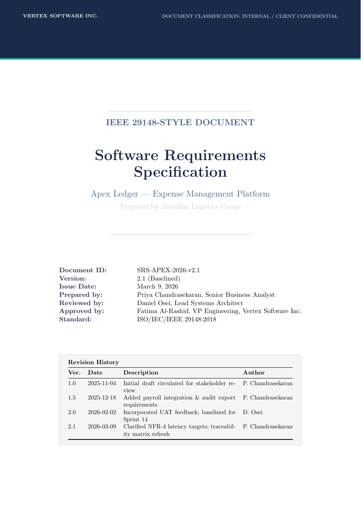</a><br><b>Software Requirements Specification</b><br><a href="https://letx.app/templates/tech-docs/software-requirements-specification">Open in LetX</a> · <a href="./tech-docs/software-requirements-specification">Source</a></td>
<td width="33%" valign="top" align="center"><a href="https://letx.app/templates/tech-docs/system-admin-runbook"></a><br><b>System Administration Runbook</b><br><a href="https://letx.app/templates/tech-docs/system-admin-runbook">Open in LetX</a> · <a href="./tech-docs/system-admin-runbook">Source</a></td>
<td width="33%" valign="top" align="center"><a href="https://letx.app/templates/tech-docs/systems-integration-and-testing-runbook"></a><br><b>Systems Integration and Testing Runbook</b><br><a href="https://letx.app/templates/tech-docs/systems-integration-and-testing-runbook">Open in LetX</a> · <a href="./tech-docs/systems-integration-and-testing-runbook">Source</a></td>
</tr>
<tr>
<td width="33%" valign="top" align="center"><a href="https://letx.app/templates/tech-docs/technical-design-document"></a><br><b>Technical Design Document</b><br><a href="https://letx.app/templates/tech-docs/technical-design-document">Open in LetX</a> · <a href="./tech-docs/technical-design-document">Source</a></td>
<td width="33%" valign="top" align="center"><a href="https://letx.app/templates/tech-docs/technical-rfc"></a><br><b>Technical RFC</b><br><a href="https://letx.app/templates/tech-docs/technical-rfc">Open in LetX</a> · <a href="./tech-docs/technical-rfc">Source</a></td>
<td width="33%" valign="top" align="center"><a href="https://letx.app/templates/tech-docs/threat-modeling-and-risk-assessment-report"></a><br><b>Threat Modeling and Risk Assessment Report</b><br><a href="https://letx.app/templates/tech-docs/threat-modeling-and-risk-assessment-report">Open in LetX</a> · <a href="./tech-docs/threat-modeling-and-risk-assessment-report">Source</a></td>
</tr>
<tr>
<td width="33%" valign="top" align="center"><a href="https://letx.app/templates/tech-docs/uat-test-plan"></a><br><b>User Acceptance Testing (UAT) Plan</b><br><a href="https://letx.app/templates/tech-docs/uat-test-plan">Open in LetX</a> · <a href="./tech-docs/uat-test-plan">Source</a></td>
</tr>
</table>

### Engineering Reports

28 templates. [Browse this category on LetX](https://letx.app/templates/engineering)

<table>
<tr>
<td width="33%" valign="top" align="center"><a href="https://letx.app/templates/engineering/acoustic-analysis-noise-control-engineering-report"></a><br><b>Acoustic Analysis & Noise Control Engineering Report</b><br><a href="https://letx.app/templates/engineering/acoustic-analysis-noise-control-engineering-report">Open in LetX</a> · <a href="./engineering/acoustic-analysis-noise-control-engineering-report">Source</a></td>
<td width="33%" valign="top" align="center"><a href="https://letx.app/templates/engineering/aerospace-propulsion-subsystem-design-doc"></a><br><b>Aerospace Propulsion Subsystem Design Doc</b><br><a href="https://letx.app/templates/engineering/aerospace-propulsion-subsystem-design-doc">Open in LetX</a> · <a href="./engineering/aerospace-propulsion-subsystem-design-doc">Source</a></td>
<td width="33%" valign="top" align="center"><a href="https://letx.app/templates/engineering/aerospace-technical-report"></a><br><b>Aerospace Technical Report</b><br><a href="https://letx.app/templates/engineering/aerospace-technical-report">Open in LetX</a> · <a href="./engineering/aerospace-technical-report">Source</a></td>
</tr>
<tr>
<td width="33%" valign="top" align="center"><a href="https://letx.app/templates/engineering/application-note-electronics"></a><br><b>Application Note (Electronics)</b><br><a href="https://letx.app/templates/engineering/application-note-electronics">Open in LetX</a> · <a href="./engineering/application-note-electronics">Source</a></td>
<td width="33%" valign="top" align="center"><a href="https://letx.app/templates/engineering/automotive-control-system-safety-spec">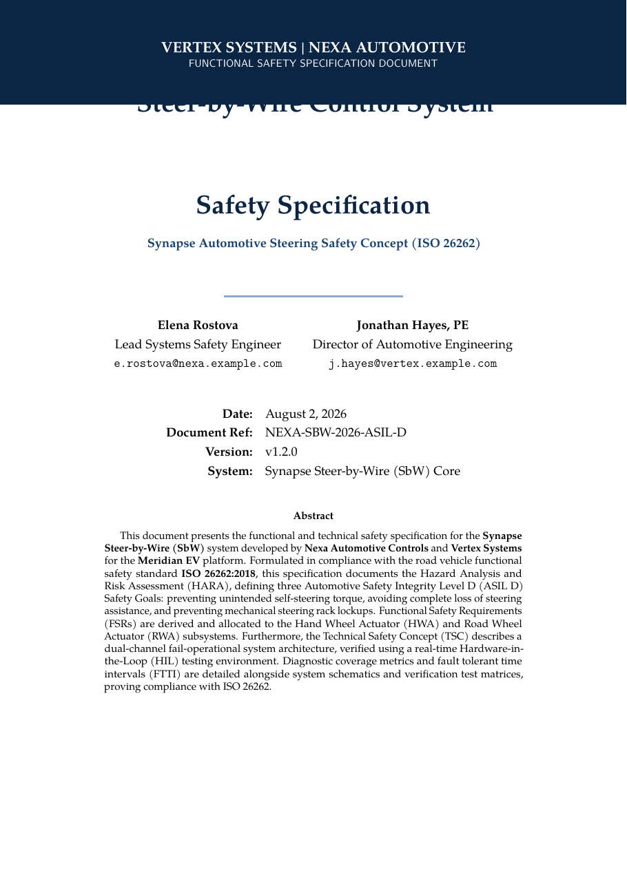</a><br><b>Automotive Control System Safety Spec (ISO 26262)</b><br><a href="https://letx.app/templates/engineering/automotive-control-system-safety-spec">Open in LetX</a> · <a href="./engineering/automotive-control-system-safety-spec">Source</a></td>
<td width="33%" valign="top" align="center"><a href="https://letx.app/templates/engineering/bill-of-materials-bom"></a><br><b>Bill of Materials (BOM)</b><br><a href="https://letx.app/templates/engineering/bill-of-materials-bom">Open in LetX</a> · <a href="./engineering/bill-of-materials-bom">Source</a></td>
</tr>
<tr>
<td width="33%" valign="top" align="center"><a href="https://letx.app/templates/engineering/cad-drawing-title-block"></a><br><b>CAD Drawing Title Block</b><br><a href="https://letx.app/templates/engineering/cad-drawing-title-block">Open in LetX</a> · <a href="./engineering/cad-drawing-title-block">Source</a></td>
<td width="33%" valign="top" align="center"><a href="https://letx.app/templates/engineering/chemical-process-safety-flowsheet-design-spec"></a><br><b>Chemical Process Safety & Flowsheet Design Spec</b><br><a href="https://letx.app/templates/engineering/chemical-process-safety-flowsheet-design-spec">Open in LetX</a> · <a href="./engineering/chemical-process-safety-flowsheet-design-spec">Source</a></td>
<td width="33%" valign="top" align="center"><a href="https://letx.app/templates/engineering/civil-engineering-foundation-soil-analysis-report">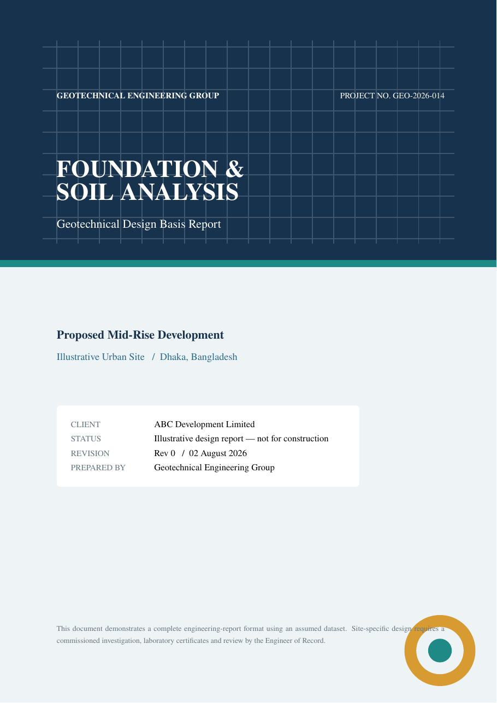</a><br><b>Civil Engineering Foundation Soil Analysis Report</b><br><a href="https://letx.app/templates/engineering/civil-engineering-foundation-soil-analysis-report">Open in LetX</a> · <a href="./engineering/civil-engineering-foundation-soil-analysis-report">Source</a></td>
</tr>
<tr>
<td width="33%" valign="top" align="center"><a href="https://letx.app/templates/engineering/semiconductor-datasheet"></a><br><b>Datasheet (Semiconductor)</b><br><a href="https://letx.app/templates/engineering/semiconductor-datasheet">Open in LetX</a> · <a href="./engineering/semiconductor-datasheet">Source</a></td>
<td width="33%" valign="top" align="center"><a href="https://letx.app/templates/engineering/defense-proposal-white-paper"></a><br><b>Defense Proposal White Paper</b><br><a href="https://letx.app/templates/engineering/defense-proposal-white-paper">Open in LetX</a> · <a href="./engineering/defense-proposal-white-paper">Source</a></td>
<td width="33%" valign="top" align="center"><a href="https://letx.app/templates/engineering/engineering-calculation-sheet"></a><br><b>Engineering Calculation Sheet</b><br><a href="https://letx.app/templates/engineering/engineering-calculation-sheet">Open in LetX</a> · <a href="./engineering/engineering-calculation-sheet">Source</a></td>
</tr>
<tr>
<td width="33%" valign="top" align="center"><a href="https://letx.app/templates/engineering/engineering-specification"></a><br><b>Engineering Specification Document</b><br><a href="https://letx.app/templates/engineering/engineering-specification">Open in LetX</a> · <a href="./engineering/engineering-specification">Source</a></td>
<td width="33%" valign="top" align="center"><a href="https://letx.app/templates/engineering/environmental-impact-assessment"></a><br><b>Environmental Impact Assessment</b><br><a href="https://letx.app/templates/engineering/environmental-impact-assessment">Open in LetX</a> · <a href="./engineering/environmental-impact-assessment">Source</a></td>
<td width="33%" valign="top" align="center"><a href="https://letx.app/templates/engineering/environmental-site-assessment-report"></a><br><b>Environmental Site Assessment (Phase I ESA) Report</b><br><a href="https://letx.app/templates/engineering/environmental-site-assessment-report">Open in LetX</a> · <a href="./engineering/environmental-site-assessment-report">Source</a></td>
</tr>
<tr>
<td width="33%" valign="top" align="center"><a href="https://letx.app/templates/engineering/fpga-design-spec"></a><br><b>FPGA Design Specification</b><br><a href="https://letx.app/templates/engineering/fpga-design-spec">Open in LetX</a> · <a href="./engineering/fpga-design-spec">Source</a></td>
<td width="33%" valign="top" align="center"><a href="https://letx.app/templates/engineering/hvac-system-design-thermal-load-calculation"></a><br><b>HVAC System Design & Thermal Load Calculation</b><br><a href="https://letx.app/templates/engineering/hvac-system-design-thermal-load-calculation">Open in LetX</a> · <a href="./engineering/hvac-system-design-thermal-load-calculation">Source</a></td>
<td width="33%" valign="top" align="center"><a href="https://letx.app/templates/engineering/ndt-inspection-report"></a><br><b>Inspection Report (Nondestructive Testing)</b><br><a href="https://letx.app/templates/engineering/ndt-inspection-report">Open in LetX</a> · <a href="./engineering/ndt-inspection-report">Source</a></td>
</tr>
<tr>
<td width="33%" valign="top" align="center"><a href="https://letx.app/templates/engineering/pcb-design-document"></a><br><b>PCB Design Document</b><br><a href="https://letx.app/templates/engineering/pcb-design-document">Open in LetX</a> · <a href="./engineering/pcb-design-document">Source</a></td>
<td width="33%" valign="top" align="center"><a href="https://letx.app/templates/engineering/qsys-tech-memo"></a><br><b>Q-Sys Technical Memo</b><br><a href="https://letx.app/templates/engineering/qsys-tech-memo">Open in LetX</a> · <a href="./engineering/qsys-tech-memo">Source</a></td>
<td width="33%" valign="top" align="center"><a href="https://letx.app/templates/engineering/root-cause-analysis-report"></a><br><b>Root Cause Analysis Report</b><br><a href="https://letx.app/templates/engineering/root-cause-analysis-report">Open in LetX</a> · <a href="./engineering/root-cause-analysis-report">Source</a></td>
</tr>
<tr>
<td width="33%" valign="top" align="center"><a href="https://letx.app/templates/engineering/senior-design-capstone-report"></a><br><b>Senior Design Capstone Report</b><br><a href="https://letx.app/templates/engineering/senior-design-capstone-report">Open in LetX</a> · <a href="./engineering/senior-design-capstone-report">Source</a></td>
<td width="33%" valign="top" align="center"><a href="https://letx.app/templates/engineering/software-architecture-doc"></a><br><b>Software Architecture Document</b><br><a href="https://letx.app/templates/engineering/software-architecture-doc">Open in LetX</a> · <a href="./engineering/software-architecture-doc">Source</a></td>
<td width="33%" valign="top" align="center"><a href="https://letx.app/templates/engineering/solar-pv-power-plant-performance-specification"></a><br><b>Solar PV Power Plant Performance Specification</b><br><a href="https://letx.app/templates/engineering/solar-pv-power-plant-performance-specification">Open in LetX</a> · <a href="./engineering/solar-pv-power-plant-performance-specification">Source</a></td>
</tr>
<tr>
<td width="33%" valign="top" align="center"><a href="https://letx.app/templates/engineering/structural-load-calculation-analysis-report"></a><br><b>Structural Load Calculation & Analysis Report</b><br><a href="https://letx.app/templates/engineering/structural-load-calculation-analysis-report">Open in LetX</a> · <a href="./engineering/structural-load-calculation-analysis-report">Source</a></td>
<td width="33%" valign="top" align="center"><a href="https://letx.app/templates/engineering/systems-engineering-plan"></a><br><b>Systems Engineering Plan</b><br><a href="https://letx.app/templates/engineering/systems-engineering-plan">Open in LetX</a> · <a href="./engineering/systems-engineering-plan">Source</a></td>
<td width="33%" valign="top" align="center"><a href="https://letx.app/templates/engineering/telecommunications-network-link-budget-calculator"></a><br><b>Telecommunications Network Link Budget Calculator</b><br><a href="https://letx.app/templates/engineering/telecommunications-network-link-budget-calculator">Open in LetX</a> · <a href="./engineering/telecommunications-network-link-budget-calculator">Source</a></td>
</tr>
<tr>
<td width="33%" valign="top" align="center"><a href="https://letx.app/templates/engineering/test-report-ee-compliance"></a><br><b>Test Report (EE Compliance)</b><br><a href="https://letx.app/templates/engineering/test-report-ee-compliance">Open in LetX</a> · <a href="./engineering/test-report-ee-compliance">Source</a></td>
</tr>
</table>

### Medical & Clinical

21 templates. [Browse this category on LetX](https://letx.app/templates/medical)

<table>
<tr>
<td width="33%" valign="top" align="center"><a href="https://letx.app/templates/medical/cardiology-diagnostic-report"></a><br><b>Cardiology Diagnostic Report</b><br><a href="https://letx.app/templates/medical/cardiology-diagnostic-report">Open in LetX</a> · <a href="./medical/cardiology-diagnostic-report">Source</a></td>
<td width="33%" valign="top" align="center"><a href="https://letx.app/templates/medical/clinical-study-report-ich-e3"></a><br><b>Clinical Study Report (ICH E3)</b><br><a href="https://letx.app/templates/medical/clinical-study-report-ich-e3">Open in LetX</a> · <a href="./medical/clinical-study-report-ich-e3">Source</a></td>
<td width="33%" valign="top" align="center"><a href="https://letx.app/templates/medical/clinical-trial-protocol"></a><br><b>Clinical Trial Protocol</b><br><a href="https://letx.app/templates/medical/clinical-trial-protocol">Open in LetX</a> · <a href="./medical/clinical-trial-protocol">Source</a></td>
</tr>
<tr>
<td width="33%" valign="top" align="center"><a href="https://letx.app/templates/medical/dental-implant-surgery-plan"></a><br><b>Dental Implant Surgery Plan</b><br><a href="https://letx.app/templates/medical/dental-implant-surgery-plan">Open in LetX</a> · <a href="./medical/dental-implant-surgery-plan">Source</a></td>
<td width="33%" valign="top" align="center"><a href="https://letx.app/templates/medical/dental-treatment-plan"></a><br><b>Dental Treatment Plan</b><br><a href="https://letx.app/templates/medical/dental-treatment-plan">Open in LetX</a> · <a href="./medical/dental-treatment-plan">Source</a></td>
<td width="33%" valign="top" align="center"><a href="https://letx.app/templates/medical/ectd-module-2-summary"></a><br><b>eCTD Module 2 Summary</b><br><a href="https://letx.app/templates/medical/ectd-module-2-summary">Open in LetX</a> · <a href="./medical/ectd-module-2-summary">Source</a></td>
</tr>
<tr>
<td width="33%" valign="top" align="center"><a href="https://letx.app/templates/medical/discharge-summary-report"></a><br><b>Hospital Discharge Summary</b><br><a href="https://letx.app/templates/medical/discharge-summary-report">Open in LetX</a> · <a href="./medical/discharge-summary-report">Source</a></td>
<td width="33%" valign="top" align="center"><a href="https://letx.app/templates/medical/icu-critical-care-flowsheet">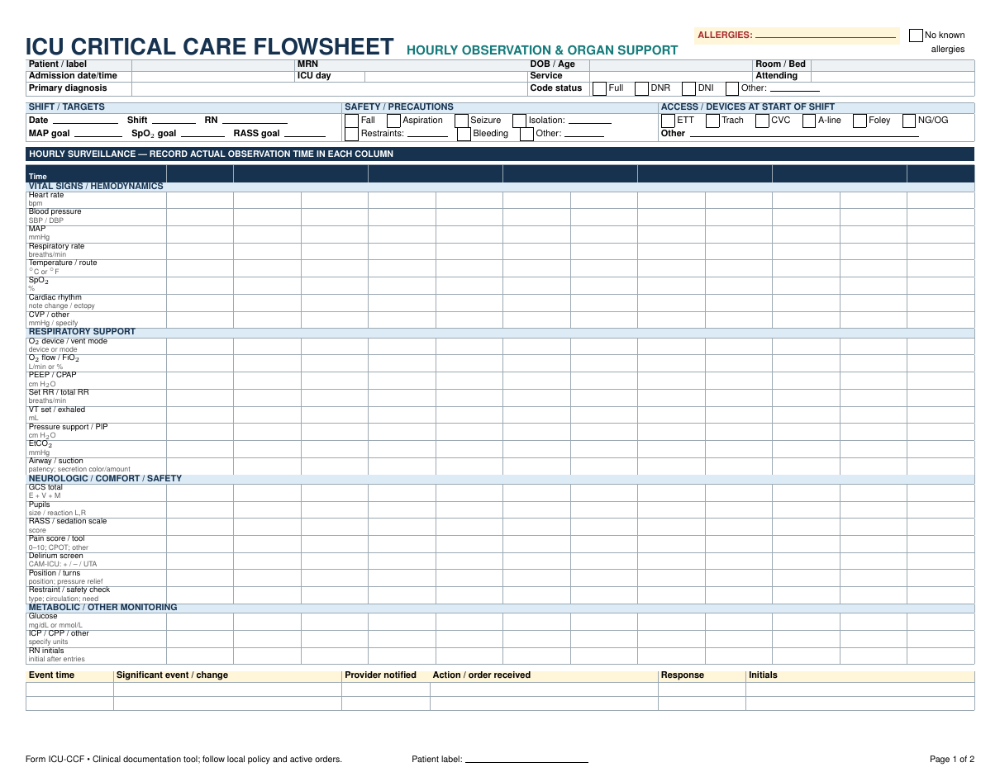</a><br><b>ICU Critical Care Flowsheet</b><br><a href="https://letx.app/templates/medical/icu-critical-care-flowsheet">Open in LetX</a> · <a href="./medical/icu-critical-care-flowsheet">Source</a></td>
<td width="33%" valign="top" align="center"><a href="https://letx.app/templates/medical/informed-consent-form-for-medical-trials"></a><br><b>Informed Consent Form for Medical Trials</b><br><a href="https://letx.app/templates/medical/informed-consent-form-for-medical-trials">Open in LetX</a> · <a href="./medical/informed-consent-form-for-medical-trials">Source</a></td>
</tr>
<tr>
<td width="33%" valign="top" align="center"><a href="https://letx.app/templates/medical/irb-research-proposal-application"></a><br><b>IRB Research Proposal Application</b><br><a href="https://letx.app/templates/medical/irb-research-proposal-application">Open in LetX</a> · <a href="./medical/irb-research-proposal-application">Source</a></td>
<td width="33%" valign="top" align="center"><a href="https://letx.app/templates/medical/medical-device-regulatory-submission"></a><br><b>Medical Device Regulatory Submission (FDA 510k)</b><br><a href="https://letx.app/templates/medical/medical-device-regulatory-submission">Open in LetX</a> · <a href="./medical/medical-device-regulatory-submission">Source</a></td>
<td width="33%" valign="top" align="center"><a href="https://letx.app/templates/medical/medical-history-questionnaire"></a><br><b>Medical History Questionnaire</b><br><a href="https://letx.app/templates/medical/medical-history-questionnaire">Open in LetX</a> · <a href="./medical/medical-history-questionnaire">Source</a></td>
</tr>
<tr>
<td width="33%" valign="top" align="center"><a href="https://letx.app/templates/medical/orthopedic-diagnostic-summary"></a><br><b>Orthopedic Diagnostic Summary</b><br><a href="https://letx.app/templates/medical/orthopedic-diagnostic-summary">Open in LetX</a> · <a href="./medical/orthopedic-diagnostic-summary">Source</a></td>
<td width="33%" valign="top" align="center"><a href="https://letx.app/templates/medical/patient-intake-form"></a><br><b>Patient Intake Form</b><br><a href="https://letx.app/templates/medical/patient-intake-form">Open in LetX</a> · <a href="./medical/patient-intake-form">Source</a></td>
<td width="33%" valign="top" align="center"><a href="https://letx.app/templates/medical/pharmacokinetics-study-protocol"></a><br><b>Pharmacokinetics Study Protocol</b><br><a href="https://letx.app/templates/medical/pharmacokinetics-study-protocol">Open in LetX</a> · <a href="./medical/pharmacokinetics-study-protocol">Source</a></td>
</tr>
<tr>
<td width="33%" valign="top" align="center"><a href="https://letx.app/templates/medical/physical-therapy-progress-evaluation">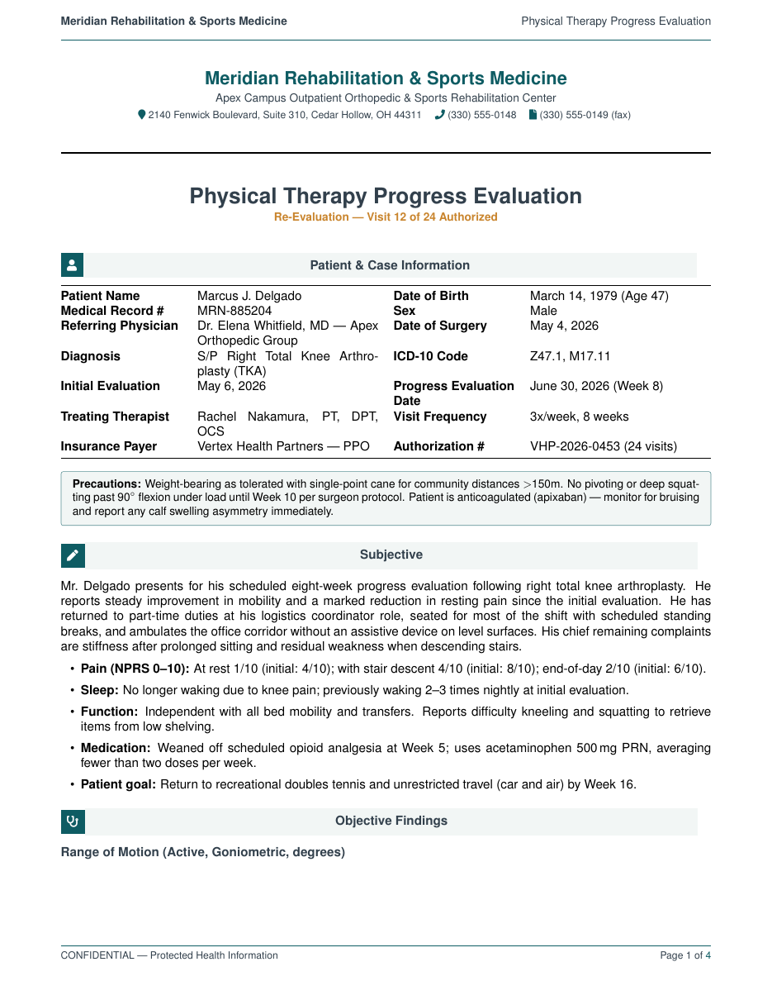</a><br><b>Physical Therapy Progress Evaluation</b><br><a href="https://letx.app/templates/medical/physical-therapy-progress-evaluation">Open in LetX</a> · <a href="./medical/physical-therapy-progress-evaluation">Source</a></td>
<td width="33%" valign="top" align="center"><a href="https://letx.app/templates/medical/prescription-pad-template"></a><br><b>Prescription Pad</b><br><a href="https://letx.app/templates/medical/prescription-pad-template">Open in LetX</a> · <a href="./medical/prescription-pad-template">Source</a></td>
<td width="33%" valign="top" align="center"><a href="https://letx.app/templates/medical/psychological-diagnostic-and-evaluation-report"></a><br><b>Psychological Diagnostic and Evaluation Report</b><br><a href="https://letx.app/templates/medical/psychological-diagnostic-and-evaluation-report">Open in LetX</a> · <a href="./medical/psychological-diagnostic-and-evaluation-report">Source</a></td>
</tr>
<tr>
<td width="33%" valign="top" align="center"><a href="https://letx.app/templates/medical/radiology-report-template"></a><br><b>Radiology Report</b><br><a href="https://letx.app/templates/medical/radiology-report-template">Open in LetX</a> · <a href="./medical/radiology-report-template">Source</a></td>
<td width="33%" valign="top" align="center"><a href="https://letx.app/templates/medical/statistical-analysis-plan"></a><br><b>Statistical Analysis Plan (SAP)</b><br><a href="https://letx.app/templates/medical/statistical-analysis-plan">Open in LetX</a> · <a href="./medical/statistical-analysis-plan">Source</a></td>
<td width="33%" valign="top" align="center"><a href="https://letx.app/templates/medical/surgical-operative-report"></a><br><b>Surgical Operative Report</b><br><a href="https://letx.app/templates/medical/surgical-operative-report">Open in LetX</a> · <a href="./medical/surgical-operative-report">Source</a></td>
</tr>
</table>

### Legal Documents

21 templates. [Browse this category on LetX](https://letx.app/templates/legal)

<table>
<tr>
<td width="33%" valign="top" align="center"><a href="https://letx.app/templates/legal/amicus-curiae-brief"></a><br><b>Amicus Curiae Brief</b><br><a href="https://letx.app/templates/legal/amicus-curiae-brief">Open in LetX</a> · <a href="./legal/amicus-curiae-brief">Source</a></td>
<td width="33%" valign="top" align="center"><a href="https://letx.app/templates/legal/case-brief-law-school"></a><br><b>Case Brief (Law School)</b><br><a href="https://letx.app/templates/legal/case-brief-law-school">Open in LetX</a> · <a href="./legal/case-brief-law-school">Source</a></td>
<td width="33%" valign="top" align="center"><a href="https://letx.app/templates/legal/cease-and-desist-letter"></a><br><b>Cease and Desist Letter</b><br><a href="https://letx.app/templates/legal/cease-and-desist-letter">Open in LetX</a> · <a href="./legal/cease-and-desist-letter">Source</a></td>
</tr>
<tr>
<td width="33%" valign="top" align="center"><a href="https://letx.app/templates/legal/lease-agreement-commercial"></a><br><b>Commercial Lease Agreement</b><br><a href="https://letx.app/templates/legal/lease-agreement-commercial">Open in LetX</a> · <a href="./legal/lease-agreement-commercial">Source</a></td>
<td width="33%" valign="top" align="center"><a href="https://letx.app/templates/legal/consulting-services-agreement"></a><br><b>Consulting Services Agreement (Statement of Work)</b><br><a href="https://letx.app/templates/legal/consulting-services-agreement">Open in LetX</a> · <a href="./legal/consulting-services-agreement">Source</a></td>
<td width="33%" valign="top" align="center"><a href="https://letx.app/templates/legal/contract-agreement"></a><br><b>Contract Agreement</b><br><a href="https://letx.app/templates/legal/contract-agreement">Open in LetX</a> · <a href="./legal/contract-agreement">Source</a></td>
</tr>
<tr>
<td width="33%" valign="top" align="center"><a href="https://letx.app/templates/legal/corporate-shareholder-agreement">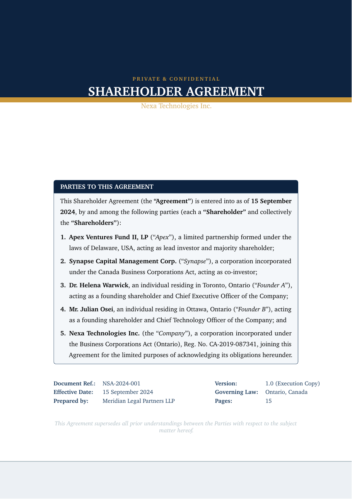</a><br><b>Corporate Shareholder Agreement</b><br><a href="https://letx.app/templates/legal/corporate-shareholder-agreement">Open in LetX</a> · <a href="./legal/corporate-shareholder-agreement">Source</a></td>
<td width="33%" valign="top" align="center"><a href="https://letx.app/templates/legal/founder-collaboration-and-equity-vesting-agreement"></a><br><b>Founder Collaboration and Equity Vesting Agreement</b><br><a href="https://letx.app/templates/legal/founder-collaboration-and-equity-vesting-agreement">Open in LetX</a> · <a href="./legal/founder-collaboration-and-equity-vesting-agreement">Source</a></td>
<td width="33%" valign="top" align="center"><a href="https://letx.app/templates/legal/ip-assignment-agreement"></a><br><b>IP Assignment Agreement</b><br><a href="https://letx.app/templates/legal/ip-assignment-agreement">Open in LetX</a> · <a href="./legal/ip-assignment-agreement">Source</a></td>
</tr>
<tr>
<td width="33%" valign="top" align="center"><a href="https://letx.app/templates/legal/legal-brief"></a><br><b>Legal Brief (Litigation)</b><br><a href="https://letx.app/templates/legal/legal-brief">Open in LetX</a> · <a href="./legal/legal-brief">Source</a></td>
<td width="33%" valign="top" align="center"><a href="https://letx.app/templates/legal/legal-memorandum"></a><br><b>Legal Memorandum</b><br><a href="https://letx.app/templates/legal/legal-memorandum">Open in LetX</a> · <a href="./legal/legal-memorandum">Source</a></td>
<td width="33%" valign="top" align="center"><a href="https://letx.app/templates/legal/legal-pleading-paper"></a><br><b>Legal Pleading Paper</b><br><a href="https://letx.app/templates/legal/legal-pleading-paper">Open in LetX</a> · <a href="./legal/legal-pleading-paper">Source</a></td>
</tr>
<tr>
<td width="33%" valign="top" align="center"><a href="https://letx.app/templates/legal/living-will-healthcare-power-of-attorney"></a><br><b>Living Will & Healthcare Power of Attorney</b><br><a href="https://letx.app/templates/legal/living-will-healthcare-power-of-attorney">Open in LetX</a> · <a href="./legal/living-will-healthcare-power-of-attorney">Source</a></td>
<td width="33%" valign="top" align="center"><a href="https://letx.app/templates/legal/mutual-non-disclosure-agreement"></a><br><b>Mutual Non-Disclosure Agreement (MNDA)</b><br><a href="https://letx.app/templates/legal/mutual-non-disclosure-agreement">Open in LetX</a> · <a href="./legal/mutual-non-disclosure-agreement">Source</a></td>
<td width="33%" valign="top" align="center"><a href="https://letx.app/templates/legal/non-compete-agreement"></a><br><b>Non-Compete Agreement</b><br><a href="https://letx.app/templates/legal/non-compete-agreement">Open in LetX</a> · <a href="./legal/non-compete-agreement">Source</a></td>
</tr>
<tr>
<td width="33%" valign="top" align="center"><a href="https://letx.app/templates/legal/patent-licensing-royalty-agreement"></a><br><b>Patent Licensing & Royalty Agreement</b><br><a href="https://letx.app/templates/legal/patent-licensing-royalty-agreement">Open in LetX</a> · <a href="./legal/patent-licensing-royalty-agreement">Source</a></td>
<td width="33%" valign="top" align="center"><a href="https://letx.app/templates/legal/patent-specification-uspto"></a><br><b>Patent Specification (USPTO)</b><br><a href="https://letx.app/templates/legal/patent-specification-uspto">Open in LetX</a> · <a href="./legal/patent-specification-uspto">Source</a></td>
<td width="33%" valign="top" align="center"><a href="https://letx.app/templates/legal/power-of-attorney-form"></a><br><b>Power of Attorney Form</b><br><a href="https://letx.app/templates/legal/power-of-attorney-form">Open in LetX</a> · <a href="./legal/power-of-attorney-form">Source</a></td>
</tr>
<tr>
<td width="33%" valign="top" align="center"><a href="https://letx.app/templates/legal/real-estate-purchase-and-sale-agreement"></a><br><b>Real Estate Purchase and Sale Agreement</b><br><a href="https://letx.app/templates/legal/real-estate-purchase-and-sale-agreement">Open in LetX</a> · <a href="./legal/real-estate-purchase-and-sale-agreement">Source</a></td>
<td width="33%" valign="top" align="center"><a href="https://letx.app/templates/legal/software-saas-service-level-agreement"></a><br><b>Software SaaS Service Level Agreement (SLA)</b><br><a href="https://letx.app/templates/legal/software-saas-service-level-agreement">Open in LetX</a> · <a href="./legal/software-saas-service-level-agreement">Source</a></td>
<td width="33%" valign="top" align="center"><a href="https://letx.app/templates/legal/affidavit-template"></a><br><b>Sworn Affidavit</b><br><a href="https://letx.app/templates/legal/affidavit-template">Open in LetX</a> · <a href="./legal/affidavit-template">Source</a></td>
</tr>
</table>

### Finance & Business

40 templates. [Browse this category on LetX](https://letx.app/templates/finance)

<table>
<tr>
<td width="33%" valign="top" align="center"><a href="https://letx.app/templates/finance/actuarial-valuation-report"></a><br><b>Actuarial Valuation Report</b><br><a href="https://letx.app/templates/finance/actuarial-valuation-report">Open in LetX</a> · <a href="./finance/actuarial-valuation-report">Source</a></td>
<td width="33%" valign="top" align="center"><a href="https://letx.app/templates/finance/annual-corporate-budget-proposal"></a><br><b>Annual Corporate Budget Proposal</b><br><a href="https://letx.app/templates/finance/annual-corporate-budget-proposal">Open in LetX</a> · <a href="./finance/annual-corporate-budget-proposal">Source</a></td>
<td width="33%" valign="top" align="center"><a href="https://letx.app/templates/finance/financial-statement-annual"></a><br><b>Annual Financial Statement</b><br><a href="https://letx.app/templates/finance/financial-statement-annual">Open in LetX</a> · <a href="./finance/financial-statement-annual">Source</a></td>
</tr>
<tr>
<td width="33%" valign="top" align="center"><a href="https://letx.app/templates/finance/income-statement-balance-sheet"></a><br><b>Balance Sheet & Income Statement</b><br><a href="https://letx.app/templates/finance/income-statement-balance-sheet">Open in LetX</a> · <a href="./finance/income-statement-balance-sheet">Source</a></td>
<td width="33%" valign="top" align="center"><a href="https://letx.app/templates/finance/biotech-pitch-deck"></a><br><b>Biotech Pitch Deck</b><br><a href="https://letx.app/templates/finance/biotech-pitch-deck">Open in LetX</a> · <a href="./finance/biotech-pitch-deck">Source</a></td>
<td width="33%" valign="top" align="center"><a href="https://letx.app/templates/finance/business-case-document"></a><br><b>Business Case Document</b><br><a href="https://letx.app/templates/finance/business-case-document">Open in LetX</a> · <a href="./finance/business-case-document">Source</a></td>
</tr>
<tr>
<td width="33%" valign="top" align="center"><a href="https://letx.app/templates/finance/competitive-analysis-report"></a><br><b>Competitive Analysis Report</b><br><a href="https://letx.app/templates/finance/competitive-analysis-report">Open in LetX</a> · <a href="./finance/competitive-analysis-report">Source</a></td>
<td width="33%" valign="top" align="center"><a href="https://letx.app/templates/finance/consulting-proposal"></a><br><b>Consulting Proposal</b><br><a href="https://letx.app/templates/finance/consulting-proposal">Open in LetX</a> · <a href="./finance/consulting-proposal">Source</a></td>
<td width="33%" valign="top" align="center"><a href="https://letx.app/templates/finance/corporate-finance-report"></a><br><b>Corporate Finance Report</b><br><a href="https://letx.app/templates/finance/corporate-finance-report">Open in LetX</a> · <a href="./finance/corporate-finance-report">Source</a></td>
</tr>
<tr>
<td width="33%" valign="top" align="center"><a href="https://letx.app/templates/finance/corporate-valuation-report"></a><br><b>Corporate Valuation Report (DCF & Comps)</b><br><a href="https://letx.app/templates/finance/corporate-valuation-report">Open in LetX</a> · <a href="./finance/corporate-valuation-report">Source</a></td>
<td width="33%" valign="top" align="center"><a href="https://letx.app/templates/finance/cryptocurrency-fund-performance-report">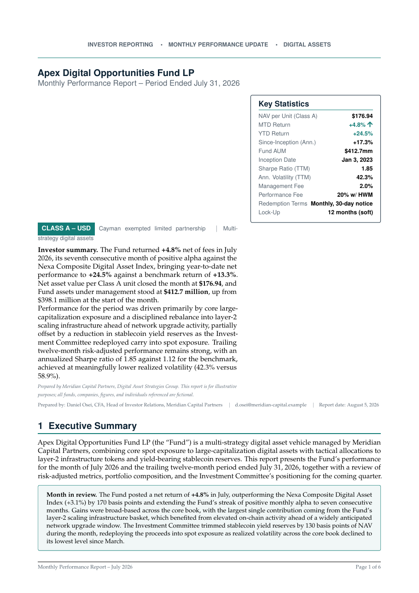</a><br><b>Cryptocurrency Fund Performance Report</b><br><a href="https://letx.app/templates/finance/cryptocurrency-fund-performance-report">Open in LetX</a> · <a href="./finance/cryptocurrency-fund-performance-report">Source</a></td>
<td width="33%" valign="top" align="center"><a href="https://letx.app/templates/finance/crypto-whitepaper"></a><br><b>Cryptocurrency Whitepaper</b><br><a href="https://letx.app/templates/finance/crypto-whitepaper">Open in LetX</a> · <a href="./finance/crypto-whitepaper">Source</a></td>
</tr>
<tr>
<td width="33%" valign="top" align="center"><a href="https://letx.app/templates/finance/due-diligence-checklist"></a><br><b>Due Diligence Checklist</b><br><a href="https://letx.app/templates/finance/due-diligence-checklist">Open in LetX</a> · <a href="./finance/due-diligence-checklist">Source</a></td>
<td width="33%" valign="top" align="center"><a href="https://letx.app/templates/finance/etf-factsheet"></a><br><b>ETF Factsheet</b><br><a href="https://letx.app/templates/finance/etf-factsheet">Open in LetX</a> · <a href="./finance/etf-factsheet">Source</a></td>
<td width="33%" valign="top" align="center"><a href="https://letx.app/templates/finance/feasibility-study-report">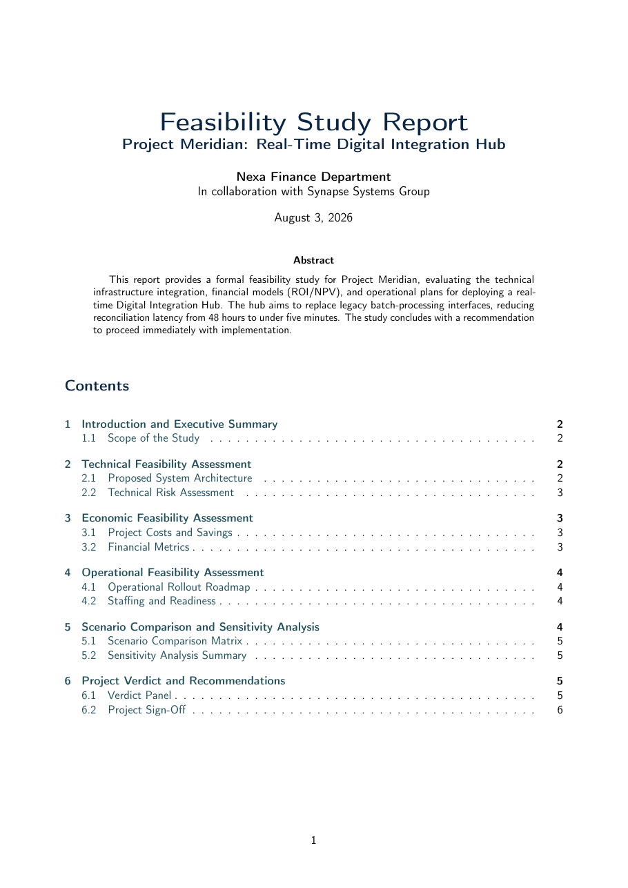</a><br><b>Feasibility Study Report</b><br><a href="https://letx.app/templates/finance/feasibility-study-report">Open in LetX</a> · <a href="./finance/feasibility-study-report">Source</a></td>
</tr>
<tr>
<td width="33%" valign="top" align="center"><a href="https://letx.app/templates/finance/hedge-fund-pitch-deck"></a><br><b>Hedge Fund Pitch Deck</b><br><a href="https://letx.app/templates/finance/hedge-fund-pitch-deck">Open in LetX</a> · <a href="./finance/hedge-fund-pitch-deck">Source</a></td>
<td width="33%" valign="top" align="center"><a href="https://letx.app/templates/finance/investment-tearsheet"></a><br><b>Investment Tearsheet</b><br><a href="https://letx.app/templates/finance/investment-tearsheet">Open in LetX</a> · <a href="./finance/investment-tearsheet">Source</a></td>
<td width="33%" valign="top" align="center"><a href="https://letx.app/templates/finance/lbo-model-executive-summary"></a><br><b>LBO (Leveraged Buyout) Model Executive Summary</b><br><a href="https://letx.app/templates/finance/lbo-model-executive-summary">Open in LetX</a> · <a href="./finance/lbo-model-executive-summary">Source</a></td>
</tr>
<tr>
<td width="33%" valign="top" align="center"><a href="https://letx.app/templates/finance/consulting-report"></a><br><b>Management Consulting Report</b><br><a href="https://letx.app/templates/finance/consulting-report">Open in LetX</a> · <a href="./finance/consulting-report">Source</a></td>
<td width="33%" valign="top" align="center"><a href="https://letx.app/templates/finance/mergers-acquisitions-pitch-book"></a><br><b>Mergers & Acquisitions (M&A) Pitch Book</b><br><a href="https://letx.app/templates/finance/mergers-acquisitions-pitch-book">Open in LetX</a> · <a href="./finance/mergers-acquisitions-pitch-book">Source</a></td>
<td width="33%" valign="top" align="center"><a href="https://letx.app/templates/finance/okr-planning-sheet">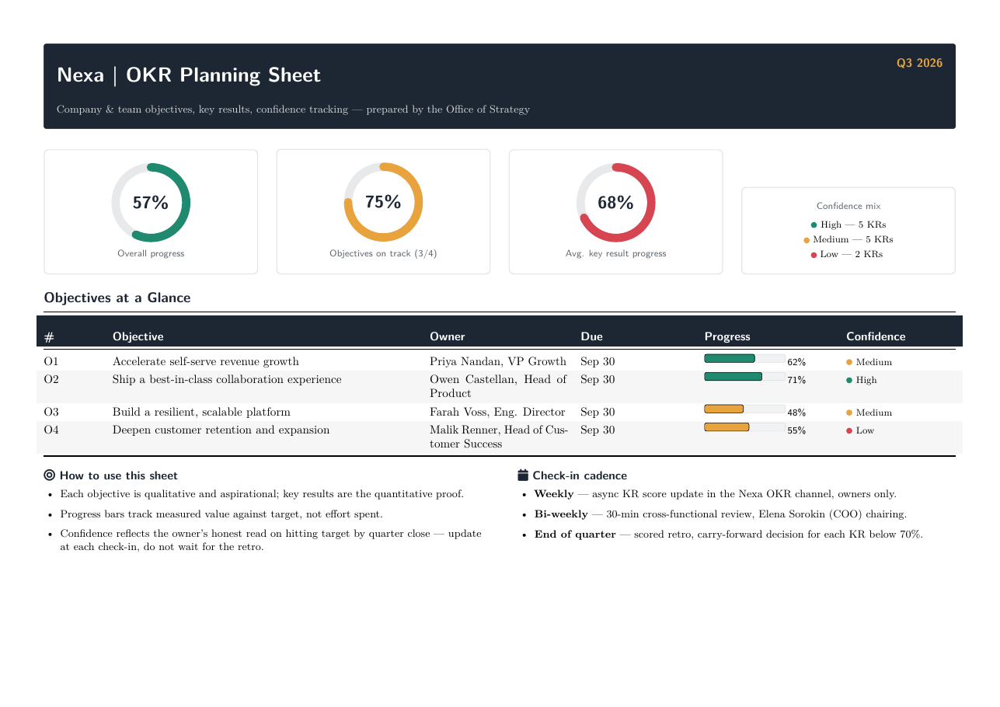</a><br><b>OKR Planning Sheet</b><br><a href="https://letx.app/templates/finance/okr-planning-sheet">Open in LetX</a> · <a href="./finance/okr-planning-sheet">Source</a></td>
</tr>
<tr>
<td width="33%" valign="top" align="center"><a href="https://letx.app/templates/finance/one-pager-strategy-brief"></a><br><b>One-Pager Strategy Brief</b><br><a href="https://letx.app/templates/finance/one-pager-strategy-brief">Open in LetX</a> · <a href="./finance/one-pager-strategy-brief">Source</a></td>
<td width="33%" valign="top" align="center"><a href="https://letx.app/templates/finance/personal-net-worth-statement"></a><br><b>Personal Net Worth Statement</b><br><a href="https://letx.app/templates/finance/personal-net-worth-statement">Open in LetX</a> · <a href="./finance/personal-net-worth-statement">Source</a></td>
<td width="33%" valign="top" align="center"><a href="https://letx.app/templates/finance/invoice-pro-forma"></a><br><b>Pro Forma Invoice</b><br><a href="https://letx.app/templates/finance/invoice-pro-forma">Open in LetX</a> · <a href="./finance/invoice-pro-forma">Source</a></td>
</tr>
<tr>
<td width="33%" valign="top" align="center"><a href="https://letx.app/templates/finance/professional-invoice"></a><br><b>Professional Services Invoice</b><br><a href="https://letx.app/templates/finance/professional-invoice">Open in LetX</a> · <a href="./finance/professional-invoice">Source</a></td>
<td width="33%" valign="top" align="center"><a href="https://letx.app/templates/finance/project-charter"></a><br><b>Project Charter</b><br><a href="https://letx.app/templates/finance/project-charter">Open in LetX</a> · <a href="./finance/project-charter">Source</a></td>
<td width="33%" valign="top" align="center"><a href="https://letx.app/templates/finance/risk-register"></a><br><b>Project Risk Register</b><br><a href="https://letx.app/templates/finance/risk-register">Open in LetX</a> · <a href="./finance/risk-register">Source</a></td>
</tr>
<tr>
<td width="33%" valign="top" align="center"><a href="https://letx.app/templates/finance/quant-research-note"></a><br><b>Quant Research Note</b><br><a href="https://letx.app/templates/finance/quant-research-note">Open in LetX</a> · <a href="./finance/quant-research-note">Source</a></td>
<td width="33%" valign="top" align="center"><a href="https://letx.app/templates/finance/real-estate-joint-venture-proposal"></a><br><b>Real Estate Joint Venture (JV) Proposal</b><br><a href="https://letx.app/templates/finance/real-estate-joint-venture-proposal">Open in LetX</a> · <a href="./finance/real-estate-joint-venture-proposal">Source</a></td>
<td width="33%" valign="top" align="center"><a href="https://letx.app/templates/finance/form-s-1-filing"></a><br><b>Regulatory Filing (Form S-1)</b><br><a href="https://letx.app/templates/finance/form-s-1-filing">Open in LetX</a> · <a href="./finance/form-s-1-filing">Source</a></td>
</tr>
<tr>
<td width="33%" valign="top" align="center"><a href="https://letx.app/templates/finance/request-for-quotation">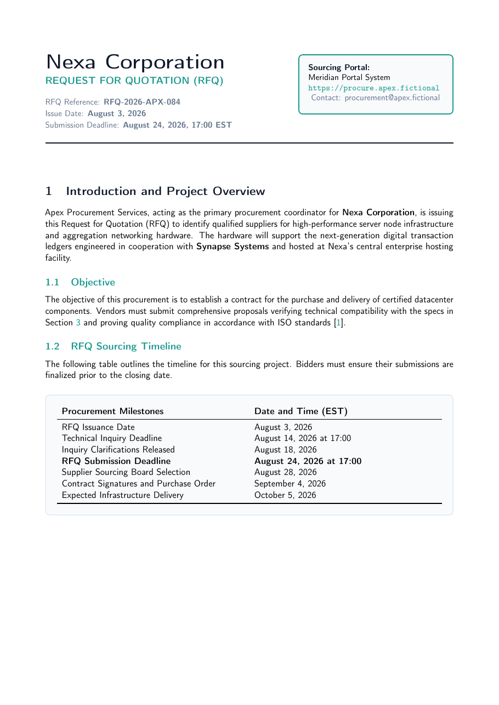</a><br><b>Request for Quotation (RFQ)</b><br><a href="https://letx.app/templates/finance/request-for-quotation">Open in LetX</a> · <a href="./finance/request-for-quotation">Source</a></td>
<td width="33%" valign="top" align="center"><a href="https://letx.app/templates/finance/rfp-technical-proposal-response"></a><br><b>RFP Technical Proposal Response</b><br><a href="https://letx.app/templates/finance/rfp-technical-proposal-response">Open in LetX</a> · <a href="./finance/rfp-technical-proposal-response">Source</a></td>
<td width="33%" valign="top" align="center"><a href="https://letx.app/templates/finance/service-level-agreement"></a><br><b>Service Level Agreement</b><br><a href="https://letx.app/templates/finance/service-level-agreement">Open in LetX</a> · <a href="./finance/service-level-agreement">Source</a></td>
</tr>
<tr>
<td width="33%" valign="top" align="center"><a href="https://letx.app/templates/finance/startup-business-plan"></a><br><b>Startup Business Plan</b><br><a href="https://letx.app/templates/finance/startup-business-plan">Open in LetX</a> · <a href="./finance/startup-business-plan">Source</a></td>
<td width="33%" valign="top" align="center"><a href="https://letx.app/templates/finance/startup-cap-table-dilution-scenario-report"></a><br><b>Startup Cap Table & Dilution Scenario Report</b><br><a href="https://letx.app/templates/finance/startup-cap-table-dilution-scenario-report">Open in LetX</a> · <a href="./finance/startup-cap-table-dilution-scenario-report">Source</a></td>
<td width="33%" valign="top" align="center"><a href="https://letx.app/templates/finance/statement-of-work">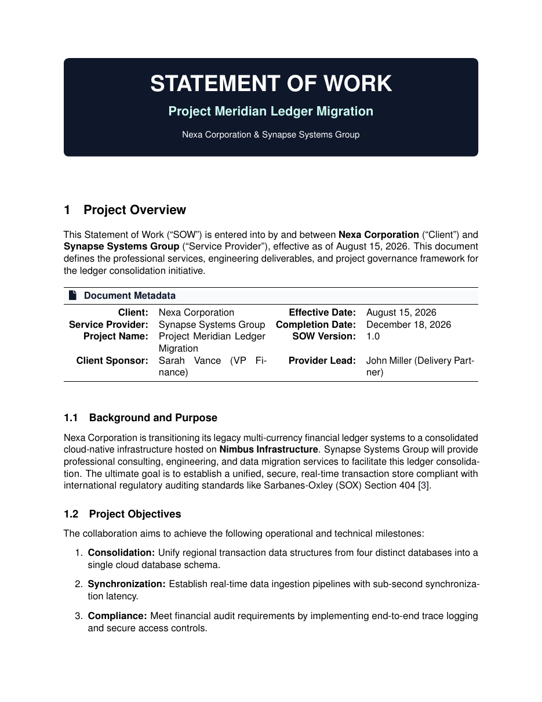</a><br><b>Statement of Work (SOW)</b><br><a href="https://letx.app/templates/finance/statement-of-work">Open in LetX</a> · <a href="./finance/statement-of-work">Source</a></td>
</tr>
<tr>
<td width="33%" valign="top" align="center"><a href="https://letx.app/templates/finance/stock-research-report"></a><br><b>Stock Equity Research Report</b><br><a href="https://letx.app/templates/finance/stock-research-report">Open in LetX</a> · <a href="./finance/stock-research-report">Source</a></td>
<td width="33%" valign="top" align="center"><a href="https://letx.app/templates/finance/transfer-pricing-report">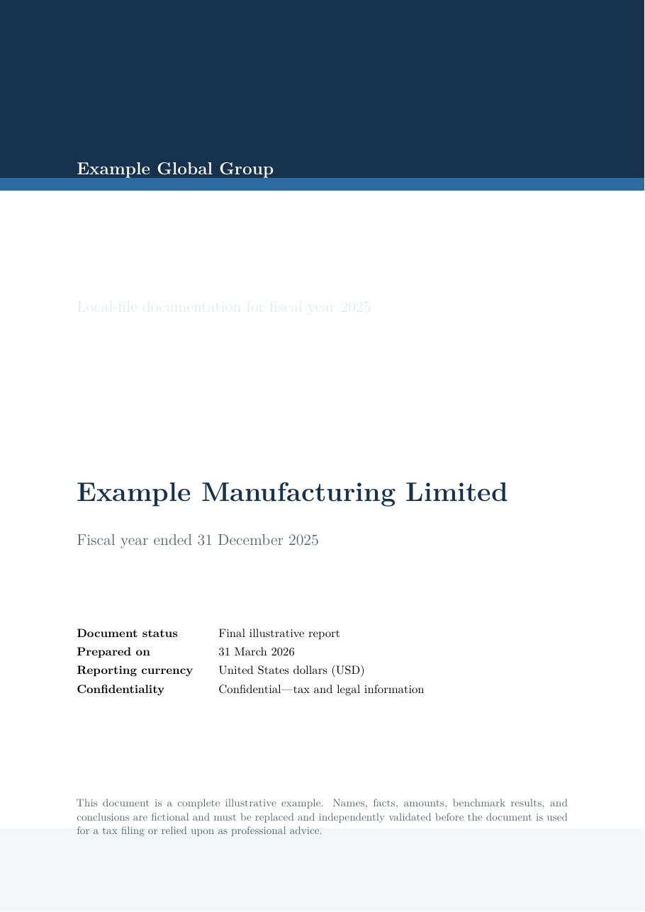</a><br><b>Transfer Pricing Report (OECD Compliant)</b><br><a href="https://letx.app/templates/finance/transfer-pricing-report">Open in LetX</a> · <a href="./finance/transfer-pricing-report">Source</a></td>
<td width="33%" valign="top" align="center"><a href="https://letx.app/templates/finance/vendor-evaluation-matrix"></a><br><b>Vendor Evaluation Matrix</b><br><a href="https://letx.app/templates/finance/vendor-evaluation-matrix">Open in LetX</a> · <a href="./finance/vendor-evaluation-matrix">Source</a></td>
</tr>
<tr>
<td width="33%" valign="top" align="center"><a href="https://letx.app/templates/finance/venture-debt-term-sheet-summarizer">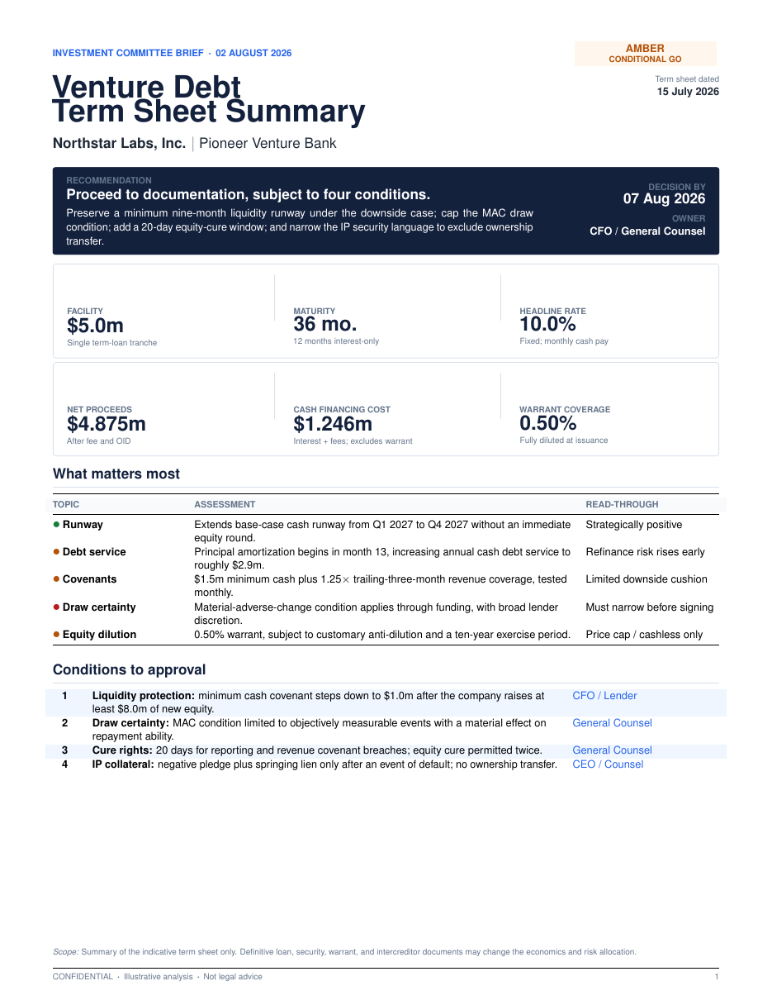</a><br><b>Venture Debt Term Sheet Summarizer</b><br><a href="https://letx.app/templates/finance/venture-debt-term-sheet-summarizer">Open in LetX</a> · <a href="./finance/venture-debt-term-sheet-summarizer">Source</a></td>
</tr>
</table>

### Teaching & Education

21 templates. [Browse this category on LetX](https://letx.app/templates/education)

<table>
<tr>
<td width="33%" valign="top" align="center"><a href="https://letx.app/templates/education/attendance-register"></a><br><b>Class Attendance Register</b><br><a href="https://letx.app/templates/education/attendance-register">Open in LetX</a> · <a href="./education/attendance-register">Source</a></td>
<td width="33%" valign="top" align="center"><a href="https://letx.app/templates/education/study-guide-exam-revision"></a><br><b>Exam Revision Study Guide</b><br><a href="https://letx.app/templates/education/study-guide-exam-revision">Open in LetX</a> · <a href="./education/study-guide-exam-revision">Source</a></td>
<td width="33%" valign="top" align="center"><a href="https://letx.app/templates/education/flipped-classroom-activity-guide"></a><br><b>Flipped Classroom Activity Guide</b><br><a href="https://letx.app/templates/education/flipped-classroom-activity-guide">Open in LetX</a> · <a href="./education/flipped-classroom-activity-guide">Source</a></td>
</tr>
<tr>
<td width="33%" valign="top" align="center"><a href="https://letx.app/templates/education/formula-sheet-exam-cheat-sheet"></a><br><b>Formula Sheet and Exam Cheat Sheet</b><br><a href="https://letx.app/templates/education/formula-sheet-exam-cheat-sheet">Open in LetX</a> · <a href="./education/formula-sheet-exam-cheat-sheet">Source</a></td>
<td width="33%" valign="top" align="center"><a href="https://letx.app/templates/education/rubrics-evaluation-form"></a><br><b>Grading Rubric</b><br><a href="https://letx.app/templates/education/rubrics-evaluation-form">Open in LetX</a> · <a href="./education/rubrics-evaluation-form">Source</a></td>
<td width="33%" valign="top" align="center"><a href="https://letx.app/templates/education/report-card"></a><br><b>Homeschool Report Card</b><br><a href="https://letx.app/templates/education/report-card">Open in LetX</a> · <a href="./education/report-card">Source</a></td>
</tr>
<tr>
<td width="33%" valign="top" align="center"><a href="https://letx.app/templates/education/special-education-iep"></a><br><b>Individualized Education Program (IEP)</b><br><a href="https://letx.app/templates/education/special-education-iep">Open in LetX</a> · <a href="./education/special-education-iep">Source</a></td>
<td width="33%" valign="top" align="center"><a href="https://letx.app/templates/education/laboratory-practical-exam-paper"></a><br><b>Laboratory Practical Exam Paper</b><br><a href="https://letx.app/templates/education/laboratory-practical-exam-paper">Open in LetX</a> · <a href="./education/laboratory-practical-exam-paper">Source</a></td>
<td width="33%" valign="top" align="center"><a href="https://letx.app/templates/education/marking-rubric-and-feedback-sheet"></a><br><b>Marking Rubric and Feedback Sheet</b><br><a href="https://letx.app/templates/education/marking-rubric-and-feedback-sheet">Open in LetX</a> · <a href="./education/marking-rubric-and-feedback-sheet">Source</a></td>
</tr>
<tr>
<td width="33%" valign="top" align="center"><a href="https://letx.app/templates/education/multiple-choice-test"></a><br><b>Multiple Choice Test Paper</b><br><a href="https://letx.app/templates/education/multiple-choice-test">Open in LetX</a> · <a href="./education/multiple-choice-test">Source</a></td>
<td width="33%" valign="top" align="center"><a href="https://letx.app/templates/education/ph-d-student-annual-progress-self-evaluation"></a><br><b>Ph.D. Student Annual Progress Self-Evaluation</b><br><a href="https://letx.app/templates/education/ph-d-student-annual-progress-self-evaluation">Open in LetX</a> · <a href="./education/ph-d-student-annual-progress-self-evaluation">Source</a></td>
<td width="33%" valign="top" align="center"><a href="https://letx.app/templates/education/primary-school-worksheet"></a><br><b>Primary School Worksheet</b><br><a href="https://letx.app/templates/education/primary-school-worksheet">Open in LetX</a> · <a href="./education/primary-school-worksheet">Source</a></td>
</tr>
<tr>
<td width="33%" valign="top" align="center"><a href="https://letx.app/templates/education/problem-set-solutions"></a><br><b>Problem Set Solutions</b><br><a href="https://letx.app/templates/education/problem-set-solutions">Open in LetX</a> · <a href="./education/problem-set-solutions">Source</a></td>
<td width="33%" valign="top" align="center"><a href="https://letx.app/templates/education/student-group-project-peer-evaluation-rubric"></a><br><b>Student Group Project Peer Evaluation Rubric</b><br><a href="https://letx.app/templates/education/student-group-project-peer-evaluation-rubric">Open in LetX</a> · <a href="./education/student-group-project-peer-evaluation-rubric">Source</a></td>
<td width="33%" valign="top" align="center"><a href="https://letx.app/templates/education/flashcard"></a><br><b>Study Flashcard Template</b><br><a href="https://letx.app/templates/education/flashcard">Open in LetX</a> · <a href="./education/flashcard">Source</a></td>
</tr>
<tr>
<td width="33%" valign="top" align="center"><a href="https://letx.app/templates/education/gradebook"></a><br><b>Teacher Gradebook</b><br><a href="https://letx.app/templates/education/gradebook">Open in LetX</a> · <a href="./education/gradebook">Source</a></td>
<td width="33%" valign="top" align="center"><a href="https://letx.app/templates/education/lesson-plan"></a><br><b>Teacher Lesson Plan</b><br><a href="https://letx.app/templates/education/lesson-plan">Open in LetX</a> · <a href="./education/lesson-plan">Source</a></td>
<td width="33%" valign="top" align="center"><a href="https://letx.app/templates/education/teacher-observation-report"></a><br><b>Teacher Observation Report</b><br><a href="https://letx.app/templates/education/teacher-observation-report">Open in LetX</a> · <a href="./education/teacher-observation-report">Source</a></td>
</tr>
<tr>
<td width="33%" valign="top" align="center"><a href="https://letx.app/templates/education/undergraduate-teaching-assistant-grading-guideline"></a><br><b>Undergraduate Teaching Assistant (TA) Grading Guideline</b><br><a href="https://letx.app/templates/education/undergraduate-teaching-assistant-grading-guideline">Open in LetX</a> · <a href="./education/undergraduate-teaching-assistant-grading-guideline">Source</a></td>
<td width="33%" valign="top" align="center"><a href="https://letx.app/templates/education/university-course-welcome-packet-faq">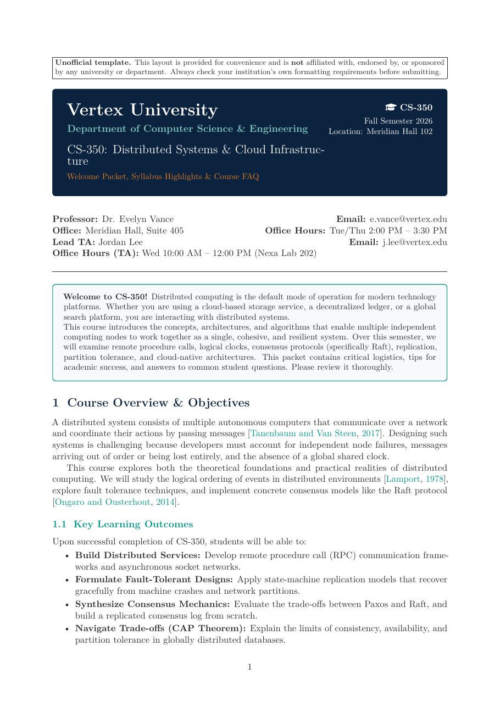</a><br><b>University Course Welcome Packet & FAQ</b><br><a href="https://letx.app/templates/education/university-course-welcome-packet-faq">Open in LetX</a> · <a href="./education/university-course-welcome-packet-faq">Source</a></td>
<td width="33%" valign="top" align="center"><a href="https://letx.app/templates/education/lecture-notes"></a><br><b>University Lecture Notes</b><br><a href="https://letx.app/templates/education/lecture-notes">Open in LetX</a> · <a href="./education/lecture-notes">Source</a></td>
</tr>
</table>

### Calendars & Planners

6 templates. [Browse this category on LetX](https://letx.app/templates/calendars)

<table>
<tr>
<td width="33%" valign="top" align="center"><a href="https://letx.app/templates/calendars/daily-planner"></a><br><b>Daily Planner</b><br><a href="https://letx.app/templates/calendars/daily-planner">Open in LetX</a> · <a href="./calendars/daily-planner">Source</a></td>
<td width="33%" valign="top" align="center"><a href="https://letx.app/templates/calendars/habit-tracker"></a><br><b>Habit Tracker</b><br><a href="https://letx.app/templates/calendars/habit-tracker">Open in LetX</a> · <a href="./calendars/habit-tracker">Source</a></td>
<td width="33%" valign="top" align="center"><a href="https://letx.app/templates/calendars/monthly-calendar"></a><br><b>Monthly Calendar</b><br><a href="https://letx.app/templates/calendars/monthly-calendar">Open in LetX</a> · <a href="./calendars/monthly-calendar">Source</a></td>
</tr>
<tr>
<td width="33%" valign="top" align="center"><a href="https://letx.app/templates/calendars/project-planner"></a><br><b>Project Planner</b><br><a href="https://letx.app/templates/calendars/project-planner">Open in LetX</a> · <a href="./calendars/project-planner">Source</a></td>
<td width="33%" valign="top" align="center"><a href="https://letx.app/templates/calendars/study-planner"></a><br><b>Study Planner</b><br><a href="https://letx.app/templates/calendars/study-planner">Open in LetX</a> · <a href="./calendars/study-planner">Source</a></td>
<td width="33%" valign="top" align="center"><a href="https://letx.app/templates/calendars/weekly-planner"></a><br><b>Weekly Planner</b><br><a href="https://letx.app/templates/calendars/weekly-planner">Open in LetX</a> · <a href="./calendars/weekly-planner">Source</a></td>
</tr>
</table>

### Everything Else

70 templates. [Browse this category on LetX](https://letx.app/templates/miscellaneous)

<table>
<tr>
<td width="33%" valign="top" align="center"><a href="https://letx.app/templates/miscellaneous/aesthetic-muslim-biodata"></a><br><b>Aesthetic Muslim Biodata</b><br><a href="https://letx.app/templates/miscellaneous/aesthetic-muslim-biodata">Open in LetX</a> · <a href="./miscellaneous/aesthetic-muslim-biodata">Source</a></td>
<td width="33%" valign="top" align="center"><a href="https://letx.app/templates/miscellaneous/appreciation-certificate"></a><br><b>Appreciation Certificate</b><br><a href="https://letx.app/templates/miscellaneous/appreciation-certificate">Open in LetX</a> · <a href="./miscellaneous/appreciation-certificate">Source</a></td>
<td width="33%" valign="top" align="center"><a href="https://letx.app/templates/miscellaneous/baby-shower-invitation"></a><br><b>Baby Shower Invitation</b><br><a href="https://letx.app/templates/miscellaneous/baby-shower-invitation">Open in LetX</a> · <a href="./miscellaneous/baby-shower-invitation">Source</a></td>
</tr>
<tr>
<td width="33%" valign="top" align="center"><a href="https://letx.app/templates/miscellaneous/bengali-marriage-biodata"></a><br><b>Bengali Marriage Biodata</b><br><a href="https://letx.app/templates/miscellaneous/bengali-marriage-biodata">Open in LetX</a> · <a href="./miscellaneous/bengali-marriage-biodata">Source</a></td>
<td width="33%" valign="top" align="center"><a href="https://letx.app/templates/miscellaneous/business-card"></a><br><b>Business Card Sheet</b><br><a href="https://letx.app/templates/miscellaneous/business-card">Open in LetX</a> · <a href="./miscellaneous/business-card">Source</a></td>
<td width="33%" valign="top" align="center"><a href="https://letx.app/templates/miscellaneous/business-proposal"></a><br><b>Business Proposal</b><br><a href="https://letx.app/templates/miscellaneous/business-proposal">Open in LetX</a> · <a href="./miscellaneous/business-proposal">Source</a></td>
</tr>
<tr>
<td width="33%" valign="top" align="center"><a href="https://letx.app/templates/miscellaneous/cafe-menu"></a><br><b>Cafe Menu</b><br><a href="https://letx.app/templates/miscellaneous/cafe-menu">Open in LetX</a> · <a href="./miscellaneous/cafe-menu">Source</a></td>
<td width="33%" valign="top" align="center"><a href="https://letx.app/templates/miscellaneous/certificate-of-achievement"></a><br><b>Certificate of Achievement</b><br><a href="https://letx.app/templates/miscellaneous/certificate-of-achievement">Open in LetX</a> · <a href="./miscellaneous/certificate-of-achievement">Source</a></td>
<td width="33%" valign="top" align="center"><a href="https://letx.app/templates/miscellaneous/chemistry-reaction-scheme"></a><br><b>Chemistry Reaction Scheme</b><br><a href="https://letx.app/templates/miscellaneous/chemistry-reaction-scheme">Open in LetX</a> · <a href="./miscellaneous/chemistry-reaction-scheme">Source</a></td>
</tr>
<tr>
<td width="33%" valign="top" align="center"><a href="https://letx.app/templates/miscellaneous/christian-marriage-biodata"></a><br><b>Christian Marriage Biodata</b><br><a href="https://letx.app/templates/miscellaneous/christian-marriage-biodata">Open in LetX</a> · <a href="./miscellaneous/christian-marriage-biodata">Source</a></td>
<td width="33%" valign="top" align="center"><a href="https://letx.app/templates/miscellaneous/completion-certificate"></a><br><b>Course Completion Certificate</b><br><a href="https://letx.app/templates/miscellaneous/completion-certificate">Open in LetX</a> · <a href="./miscellaneous/completion-certificate">Source</a></td>
<td width="33%" valign="top" align="center"><a href="https://letx.app/templates/miscellaneous/dnd-character-sheet"></a><br><b>D&D Character Sheet</b><br><a href="https://letx.app/templates/miscellaneous/dnd-character-sheet">Open in LetX</a> · <a href="./miscellaneous/dnd-character-sheet">Source</a></td>
</tr>
<tr>
<td width="33%" valign="top" align="center"><a href="https://letx.app/templates/miscellaneous/data-science-project-report"></a><br><b>Data Science Project Report</b><br><a href="https://letx.app/templates/miscellaneous/data-science-project-report">Open in LetX</a> · <a href="./miscellaneous/data-science-project-report">Source</a></td>
<td width="33%" valign="top" align="center"><a href="https://letx.app/templates/miscellaneous/employment-contract"></a><br><b>Employment Contract</b><br><a href="https://letx.app/templates/miscellaneous/employment-contract">Open in LetX</a> · <a href="./miscellaneous/employment-contract">Source</a></td>
<td width="33%" valign="top" align="center"><a href="https://letx.app/templates/miscellaneous/event-program-brochure"></a><br><b>Event Program Brochure</b><br><a href="https://letx.app/templates/miscellaneous/event-program-brochure">Open in LetX</a> · <a href="./miscellaneous/event-program-brochure">Source</a></td>
</tr>
<tr>
<td width="33%" valign="top" align="center"><a href="https://letx.app/templates/miscellaneous/family-tree"></a><br><b>Family Tree Diagram</b><br><a href="https://letx.app/templates/miscellaneous/family-tree">Open in LetX</a> · <a href="./miscellaneous/family-tree">Source</a></td>
<td width="33%" valign="top" align="center"><a href="https://letx.app/templates/miscellaneous/freelance-invoice"></a><br><b>Freelance Invoice</b><br><a href="https://letx.app/templates/miscellaneous/freelance-invoice">Open in LetX</a> · <a href="./miscellaneous/freelance-invoice">Source</a></td>
<td width="33%" valign="top" align="center"><a href="https://letx.app/templates/miscellaneous/freelance-project-proposal"></a><br><b>Freelance Project Proposal</b><br><a href="https://letx.app/templates/miscellaneous/freelance-project-proposal">Open in LetX</a> · <a href="./miscellaneous/freelance-project-proposal">Source</a></td>
</tr>
<tr>
<td width="33%" valign="top" align="center"><a href="https://letx.app/templates/miscellaneous/gantt-project-plan"></a><br><b>Gantt Project Plan</b><br><a href="https://letx.app/templates/miscellaneous/gantt-project-plan">Open in LetX</a> · <a href="./miscellaneous/gantt-project-plan">Source</a></td>
<td width="33%" valign="top" align="center"><a href="https://letx.app/templates/miscellaneous/gift-certificate-voucher"></a><br><b>Gift Certificate Voucher</b><br><a href="https://letx.app/templates/miscellaneous/gift-certificate-voucher">Open in LetX</a> · <a href="./miscellaneous/gift-certificate-voucher">Source</a></td>
<td width="33%" valign="top" align="center"><a href="https://letx.app/templates/miscellaneous/greeting-card"></a><br><b>Greeting Card</b><br><a href="https://letx.app/templates/miscellaneous/greeting-card">Open in LetX</a> · <a href="./miscellaneous/greeting-card">Source</a></td>
</tr>
<tr>
<td width="33%" valign="top" align="center"><a href="https://letx.app/templates/miscellaneous/chord-diagram"></a><br><b>Guitar Chord Chart</b><br><a href="https://letx.app/templates/miscellaneous/chord-diagram">Open in LetX</a> · <a href="./miscellaneous/chord-diagram">Source</a></td>
<td width="33%" valign="top" align="center"><a href="https://letx.app/templates/miscellaneous/gujarati-marriage-biodata"></a><br><b>Gujarati Marriage Biodata</b><br><a href="https://letx.app/templates/miscellaneous/gujarati-marriage-biodata">Open in LetX</a> · <a href="./miscellaneous/gujarati-marriage-biodata">Source</a></td>
<td width="33%" valign="top" align="center"><a href="https://letx.app/templates/miscellaneous/hindu-marriage-biodata"></a><br><b>Hindu Marriage Biodata</b><br><a href="https://letx.app/templates/miscellaneous/hindu-marriage-biodata">Open in LetX</a> · <a href="./miscellaneous/hindu-marriage-biodata">Source</a></td>
</tr>
<tr>
<td width="33%" valign="top" align="center"><a href="https://letx.app/templates/miscellaneous/independent-contractor-agreement"></a><br><b>Independent Contractor Agreement</b><br><a href="https://letx.app/templates/miscellaneous/independent-contractor-agreement">Open in LetX</a> · <a href="./miscellaneous/independent-contractor-agreement">Source</a></td>
<td width="33%" valign="top" align="center"><a href="https://letx.app/templates/miscellaneous/internship-certificate"></a><br><b>Internship Certificate</b><br><a href="https://letx.app/templates/miscellaneous/internship-certificate">Open in LetX</a> · <a href="./miscellaneous/internship-certificate">Source</a></td>
<td width="33%" valign="top" align="center"><a href="https://letx.app/templates/miscellaneous/islamic-marriage-biodata"></a><br><b>Islamic Marriage Biodata</b><br><a href="https://letx.app/templates/miscellaneous/islamic-marriage-biodata">Open in LetX</a> · <a href="./miscellaneous/islamic-marriage-biodata">Source</a></td>
</tr>
<tr>
<td width="33%" valign="top" align="center"><a href="https://letx.app/templates/miscellaneous/jain-marriage-biodata"></a><br><b>Jain Marriage Biodata</b><br><a href="https://letx.app/templates/miscellaneous/jain-marriage-biodata">Open in LetX</a> · <a href="./miscellaneous/jain-marriage-biodata">Source</a></td>
<td width="33%" valign="top" align="center"><a href="https://letx.app/templates/miscellaneous/kerala-matrimony-biodata"></a><br><b>Kerala Matrimonial Biodata</b><br><a href="https://letx.app/templates/miscellaneous/kerala-matrimony-biodata">Open in LetX</a> · <a href="./miscellaneous/kerala-matrimony-biodata">Source</a></td>
<td width="33%" valign="top" align="center"><a href="https://letx.app/templates/miscellaneous/chore-chart"></a><br><b>Kids Chore Chart</b><br><a href="https://letx.app/templates/miscellaneous/chore-chart">Open in LetX</a> · <a href="./miscellaneous/chore-chart">Source</a></td>
</tr>
<tr>
<td width="33%" valign="top" align="center"><a href="https://letx.app/templates/miscellaneous/marathi-marriage-biodata"></a><br><b>Marathi Marriage Biodata</b><br><a href="https://letx.app/templates/miscellaneous/marathi-marriage-biodata">Open in LetX</a> · <a href="./miscellaneous/marathi-marriage-biodata">Source</a></td>
<td width="33%" valign="top" align="center"><a href="https://letx.app/templates/miscellaneous/minimal-marriage-biodata"></a><br><b>Minimal Marriage Biodata</b><br><a href="https://letx.app/templates/miscellaneous/minimal-marriage-biodata">Open in LetX</a> · <a href="./miscellaneous/minimal-marriage-biodata">Source</a></td>
<td width="33%" valign="top" align="center"><a href="https://letx.app/templates/miscellaneous/modern-marriage-biodata"></a><br><b>Modern Marriage Biodata</b><br><a href="https://letx.app/templates/miscellaneous/modern-marriage-biodata">Open in LetX</a> · <a href="./miscellaneous/modern-marriage-biodata">Source</a></td>
</tr>
<tr>
<td width="33%" valign="top" align="center"><a href="https://letx.app/templates/miscellaneous/muslim-marriage-biodata"></a><br><b>Muslim Marriage Biodata</b><br><a href="https://letx.app/templates/miscellaneous/muslim-marriage-biodata">Open in LetX</a> · <a href="./miscellaneous/muslim-marriage-biodata">Source</a></td>
<td width="33%" valign="top" align="center"><a href="https://letx.app/templates/miscellaneous/name-tag"></a><br><b>Name Tag Badge</b><br><a href="https://letx.app/templates/miscellaneous/name-tag">Open in LetX</a> · <a href="./miscellaneous/name-tag">Source</a></td>
<td width="33%" valign="top" align="center"><a href="https://letx.app/templates/miscellaneous/nepali-marriage-biodata"></a><br><b>Nepali Marriage Biodata</b><br><a href="https://letx.app/templates/miscellaneous/nepali-marriage-biodata">Open in LetX</a> · <a href="./miscellaneous/nepali-marriage-biodata">Source</a></td>
</tr>
<tr>
<td width="33%" valign="top" align="center"><a href="https://letx.app/templates/miscellaneous/nda-template"></a><br><b>Non-Disclosure Agreement</b><br><a href="https://letx.app/templates/miscellaneous/nda-template">Open in LetX</a> · <a href="./miscellaneous/nda-template">Source</a></td>
<td width="33%" valign="top" align="center"><a href="https://letx.app/templates/miscellaneous/pakistani-marriage-biodata"></a><br><b>Pakistani Marriage Biodata</b><br><a href="https://letx.app/templates/miscellaneous/pakistani-marriage-biodata">Open in LetX</a> · <a href="./miscellaneous/pakistani-marriage-biodata">Source</a></td>
<td width="33%" valign="top" align="center"><a href="https://letx.app/templates/miscellaneous/patent-application"></a><br><b>Patent Application</b><br><a href="https://letx.app/templates/miscellaneous/patent-application">Open in LetX</a> · <a href="./miscellaneous/patent-application">Source</a></td>
</tr>
<tr>
<td width="33%" valign="top" align="center"><a href="https://letx.app/templates/miscellaneous/personal-budget-planner"></a><br><b>Personal Budget Planner</b><br><a href="https://letx.app/templates/miscellaneous/personal-budget-planner">Open in LetX</a> · <a href="./miscellaneous/personal-budget-planner">Source</a></td>
<td width="33%" valign="top" align="center"><a href="https://letx.app/templates/miscellaneous/poetry-book-layout"></a><br><b>Poetry Book Layout</b><br><a href="https://letx.app/templates/miscellaneous/poetry-book-layout">Open in LetX</a> · <a href="./miscellaneous/poetry-book-layout">Source</a></td>
<td width="33%" valign="top" align="center"><a href="https://letx.app/templates/miscellaneous/press-release"></a><br><b>Press Release</b><br><a href="https://letx.app/templates/miscellaneous/press-release">Open in LetX</a> · <a href="./miscellaneous/press-release">Source</a></td>
</tr>
<tr>
<td width="33%" valign="top" align="center"><a href="https://letx.app/templates/miscellaneous/printable-ticket"></a><br><b>Printable Event Ticket</b><br><a href="https://letx.app/templates/miscellaneous/printable-ticket">Open in LetX</a> · <a href="./miscellaneous/printable-ticket">Source</a></td>
<td width="33%" valign="top" align="center"><a href="https://letx.app/templates/miscellaneous/product-label"></a><br><b>Product Label</b><br><a href="https://letx.app/templates/miscellaneous/product-label">Open in LetX</a> · <a href="./miscellaneous/product-label">Source</a></td>
<td width="33%" valign="top" align="center"><a href="https://letx.app/templates/miscellaneous/punjabi-marriage-biodata"></a><br><b>Punjabi Marriage Biodata</b><br><a href="https://letx.app/templates/miscellaneous/punjabi-marriage-biodata">Open in LetX</a> · <a href="./miscellaneous/punjabi-marriage-biodata">Source</a></td>
</tr>
<tr>
<td width="33%" valign="top" align="center"><a href="https://letx.app/templates/miscellaneous/purchase-order"></a><br><b>Purchase Order</b><br><a href="https://letx.app/templates/miscellaneous/purchase-order">Open in LetX</a> · <a href="./miscellaneous/purchase-order">Source</a></td>
<td width="33%" valign="top" align="center"><a href="https://letx.app/templates/miscellaneous/quote-estimate"></a><br><b>Quote Estimate</b><br><a href="https://letx.app/templates/miscellaneous/quote-estimate">Open in LetX</a> · <a href="./miscellaneous/quote-estimate">Source</a></td>
<td width="33%" valign="top" align="center"><a href="https://letx.app/templates/miscellaneous/receipt-template"></a><br><b>Receipt</b><br><a href="https://letx.app/templates/miscellaneous/receipt-template">Open in LetX</a> · <a href="./miscellaneous/receipt-template">Source</a></td>
</tr>
<tr>
<td width="33%" valign="top" align="center"><a href="https://letx.app/templates/miscellaneous/report-cover"></a><br><b>Report Cover Page</b><br><a href="https://letx.app/templates/miscellaneous/report-cover">Open in LetX</a> · <a href="./miscellaneous/report-cover">Source</a></td>
<td width="33%" valign="top" align="center"><a href="https://letx.app/templates/miscellaneous/restaurant-menu"></a><br><b>Restaurant Menu</b><br><a href="https://letx.app/templates/miscellaneous/restaurant-menu">Open in LetX</a> · <a href="./miscellaneous/restaurant-menu">Source</a></td>
<td width="33%" valign="top" align="center"><a href="https://letx.app/templates/miscellaneous/royal-rajput-biodata"></a><br><b>Royal Rajput Biodata</b><br><a href="https://letx.app/templates/miscellaneous/royal-rajput-biodata">Open in LetX</a> · <a href="./miscellaneous/royal-rajput-biodata">Source</a></td>
</tr>
<tr>
<td width="33%" valign="top" align="center"><a href="https://letx.app/templates/miscellaneous/save-the-date"></a><br><b>Save the Date Card</b><br><a href="https://letx.app/templates/miscellaneous/save-the-date">Open in LetX</a> · <a href="./miscellaneous/save-the-date">Source</a></td>
<td width="33%" valign="top" align="center"><a href="https://letx.app/templates/miscellaneous/scientific-figure-panel"></a><br><b>Scientific Figure Panel</b><br><a href="https://letx.app/templates/miscellaneous/scientific-figure-panel">Open in LetX</a> · <a href="./miscellaneous/scientific-figure-panel">Source</a></td>
<td width="33%" valign="top" align="center"><a href="https://letx.app/templates/miscellaneous/screenplay-script-format"></a><br><b>Screenplay / Script Format</b><br><a href="https://letx.app/templates/miscellaneous/screenplay-script-format">Open in LetX</a> · <a href="./miscellaneous/screenplay-script-format">Source</a></td>
</tr>
<tr>
<td width="33%" valign="top" align="center"><a href="https://letx.app/templates/miscellaneous/sikh-marriage-biodata"></a><br><b>Sikh Marriage Biodata</b><br><a href="https://letx.app/templates/miscellaneous/sikh-marriage-biodata">Open in LetX</a> · <a href="./miscellaneous/sikh-marriage-biodata">Source</a></td>
<td width="33%" valign="top" align="center"><a href="https://letx.app/templates/miscellaneous/south-indian-marriage-biodata"></a><br><b>South Indian Marriage Biodata</b><br><a href="https://letx.app/templates/miscellaneous/south-indian-marriage-biodata">Open in LetX</a> · <a href="./miscellaneous/south-indian-marriage-biodata">Source</a></td>
<td width="33%" valign="top" align="center"><a href="https://letx.app/templates/miscellaneous/sri-lankan-marriage-biodata"></a><br><b>Sri Lankan Marriage Biodata</b><br><a href="https://letx.app/templates/miscellaneous/sri-lankan-marriage-biodata">Open in LetX</a> · <a href="./miscellaneous/sri-lankan-marriage-biodata">Source</a></td>
</tr>
<tr>
<td width="33%" valign="top" align="center"><a href="https://letx.app/templates/miscellaneous/tamil-marriage-biodata"></a><br><b>Tamil Marriage Biodata</b><br><a href="https://letx.app/templates/miscellaneous/tamil-marriage-biodata">Open in LetX</a> · <a href="./miscellaneous/tamil-marriage-biodata">Source</a></td>
<td width="33%" valign="top" align="center"><a href="https://letx.app/templates/miscellaneous/telugu-marriage-biodata"></a><br><b>Telugu Marriage Biodata</b><br><a href="https://letx.app/templates/miscellaneous/telugu-marriage-biodata">Open in LetX</a> · <a href="./miscellaneous/telugu-marriage-biodata">Source</a></td>
<td width="33%" valign="top" align="center"><a href="https://letx.app/templates/miscellaneous/timesheet-template"></a><br><b>Timesheet</b><br><a href="https://letx.app/templates/miscellaneous/timesheet-template">Open in LetX</a> · <a href="./miscellaneous/timesheet-template">Source</a></td>
</tr>
<tr>
<td width="33%" valign="top" align="center"><a href="https://letx.app/templates/miscellaneous/traditional-marriage-biodata"></a><br><b>Traditional Marriage Biodata</b><br><a href="https://letx.app/templates/miscellaneous/traditional-marriage-biodata">Open in LetX</a> · <a href="./miscellaneous/traditional-marriage-biodata">Source</a></td>
<td width="33%" valign="top" align="center"><a href="https://letx.app/templates/miscellaneous/training-certificate"></a><br><b>Training Certificate</b><br><a href="https://letx.app/templates/miscellaneous/training-certificate">Open in LetX</a> · <a href="./miscellaneous/training-certificate">Source</a></td>
<td width="33%" valign="top" align="center"><a href="https://letx.app/templates/miscellaneous/travel-itinerary"></a><br><b>Travel Itinerary</b><br><a href="https://letx.app/templates/miscellaneous/travel-itinerary">Open in LetX</a> · <a href="./miscellaneous/travel-itinerary">Source</a></td>
</tr>
<tr>
<td width="33%" valign="top" align="center"><a href="https://letx.app/templates/miscellaneous/packing-checklist"></a><br><b>Travel Packing Checklist</b><br><a href="https://letx.app/templates/miscellaneous/packing-checklist">Open in LetX</a> · <a href="./miscellaneous/packing-checklist">Source</a></td>
<td width="33%" valign="top" align="center"><a href="https://letx.app/templates/miscellaneous/foldable-card"></a><br><b>Tri-Fold Brochure</b><br><a href="https://letx.app/templates/miscellaneous/foldable-card">Open in LetX</a> · <a href="./miscellaneous/foldable-card">Source</a></td>
<td width="33%" valign="top" align="center"><a href="https://letx.app/templates/miscellaneous/urdu-marriage-biodata"></a><br><b>Urdu Matrimonial Biodata</b><br><a href="https://letx.app/templates/miscellaneous/urdu-marriage-biodata">Open in LetX</a> · <a href="./miscellaneous/urdu-marriage-biodata">Source</a></td>
</tr>
<tr>
<td width="33%" valign="top" align="center"><a href="https://letx.app/templates/miscellaneous/wedding-invitation"></a><br><b>Wedding Invitation</b><br><a href="https://letx.app/templates/miscellaneous/wedding-invitation">Open in LetX</a> · <a href="./miscellaneous/wedding-invitation">Source</a></td>
<td width="33%" valign="top" align="center"><a href="https://letx.app/templates/miscellaneous/wedding-program"></a><br><b>Wedding Program</b><br><a href="https://letx.app/templates/miscellaneous/wedding-program">Open in LetX</a> · <a href="./miscellaneous/wedding-program">Source</a></td>
<td width="33%" valign="top" align="center"><a href="https://letx.app/templates/miscellaneous/meal-planner"></a><br><b>Weekly Meal Planner</b><br><a href="https://letx.app/templates/miscellaneous/meal-planner">Open in LetX</a> · <a href="./miscellaneous/meal-planner">Source</a></td>
</tr>
<tr>
<td width="33%" valign="top" align="center"><a href="https://letx.app/templates/miscellaneous/workout-log"></a><br><b>Workout Log</b><br><a href="https://letx.app/templates/miscellaneous/workout-log">Open in LetX</a> · <a href="./miscellaneous/workout-log">Source</a></td>
</tr>
</table>

## Frequently asked questions

### Are these LaTeX templates free?

Yes. All 768 templates in this repository are MIT-licensed and free for academic and commercial use, with no account or signup required. You can clone the repo and use them entirely offline, or open them in the browser at [letx.app/templates](https://letx.app/templates).

### Can I use these without installing LaTeX?

Yes. Click *Open in LetX* on any template and it opens in a browser-based editor that compiles to PDF on managed infrastructure — no TeX Live install, and it works the same on Windows, macOS and Linux.

### Which compiler does each template need?

Each template's `metadata.json` names its compiler. Most use `pdflatex`; templates using custom fonts via `fontspec` require `xelatex` or `lualatex`. Running `latexmk -pdf main.tex` works for the pdflatex ones.

### Do you have a template for my university's thesis format?

This repository groups university and thesis formats under [`universities/`](#university--thesis-templates). The complete set across both repositories and the live library covers 600+ templates including many regional university formats — search [letx.app/templates/universities](https://letx.app/templates/universities). If yours is missing, open an issue or a pull request.

### How is this different from Overleaf's template gallery?

These templates are open source and version-controlled: you can clone them, diff them, and submit fixes. They are also free to open and edit collaboratively without a per-collaborator charge.

## Related

- **[shihabshahrier/Latex_Templates](https://github.com/shihabshahrier/Latex_Templates)** — the companion collection — a further set of templates in the same categories, with no overlap with this one.
- **[letx.app/templates](https://letx.app/templates)** — the full searchable library of 600+ templates, with live preview and one-click editing.
- **[letx.app](https://letx.app)** — the collaborative LaTeX editor these templates are built for: real-time co-authoring, compile to PDF in seconds, no install.

## Contributing

Templates are organised as `<category>/<template-slug>/`. To add one, create a directory under the right category containing `main.tex`, `metadata.json`, and a compiled `main.pdf`. Open a pull request — contributions of university thesis formats are especially welcome, since those are the hardest for students to find.

## License

MIT — free for academic and commercial use. Individual templates that adapt an official publisher or university class file retain the licence of that upstream file; see each template's `metadata.json`.

