# Free LaTeX Templates — Theses, Papers, CVs, Posters & Slides

[](https://letx.app/templates) [](LICENSE) [](https://letx.app/templates)

**350 free, open-source LaTeX templates**, organised into 20 categories: university theses, journal articles, conference papers, CVs and résumés, grant proposals, academic posters, Beamer presentations, lab reports and formal letters.

Every template is compile-tested, MIT-licensed, and free to use — no account, no signup, no paywall. Open one in the browser to edit and compile it without installing LaTeX, or clone the repo and run `latexmk` locally. The full library of 601+ templates lives at [letx.app/templates](https://letx.app/templates).

## Categories

| Category | Templates | Browse online |
|---|---:|---|
| [University & Thesis Templates](#university--thesis-templates) | 61 | [universities](https://letx.app/templates/universities) |
| [Journal Articles & Papers](#journal-articles--papers) | 11 | [journal-articles](https://letx.app/templates/journal-articles) |
| [Conference Papers & Abstracts](#conference-papers--abstracts) | 4 | [conferences](https://letx.app/templates/conferences) |
| [CVs & Résumés](#cvs--résumés) | 39 | [cvs-resumes](https://letx.app/templates/cvs-resumes) |
| [Academic Career (Statements, Applications)](#academic-career-statements-applications) | 11 | [academic-career](https://letx.app/templates/academic-career) |
| [Assignments & Course Work](#assignments--course-work) | 19 | [assignments](https://letx.app/templates/assignments) |
| [Lab Reports & Documentation](#lab-reports--documentation) | 7 | [lab-documents](https://letx.app/templates/lab-documents) |
| [Grants & Research Proposals](#grants--research-proposals) | 17 | [grants](https://letx.app/templates/grants) |
| [Academic Posters](#academic-posters) | 10 | [posters](https://letx.app/templates/posters) |
| [Presentations & Beamer Slides](#presentations--beamer-slides) | 7 | [presentations](https://letx.app/templates/presentations) |
| [Books & Long-Form Documents](#books--long-form-documents) | 4 | [books](https://letx.app/templates/books) |
| [Formal Letters & Letterheads](#formal-letters--letterheads) | 5 | [formal-letters](https://letx.app/templates/formal-letters) |
| [Technical Documentation](#technical-documentation) | 14 | [tech-docs](https://letx.app/templates/tech-docs) |
| [Engineering Reports](#engineering-reports) | 17 | [engineering](https://letx.app/templates/engineering) |
| [Medical & Clinical](#medical--clinical) | 11 | [medical](https://letx.app/templates/medical) |
| [Legal Documents](#legal-documents) | 11 | [legal](https://letx.app/templates/legal) |
| [Finance & Business](#finance--business) | 16 | [finance](https://letx.app/templates/finance) |
| [Teaching & Education](#teaching--education) | 10 | [education](https://letx.app/templates/education) |
| [Calendars & Planners](#calendars--planners) | 6 | [calendars](https://letx.app/templates/calendars) |
| [Everything Else](#everything-else) | 70 | [miscellaneous](https://letx.app/templates/miscellaneous) |

## How to use a template

**Online (no install):** click *Open in LetX* on any template below. It opens ready to edit, compiles to PDF in the browser, and supports real-time collaboration with co-authors.

**Locally:**

```bash
git clone https://github.com/Shahriar-Labs/latex-templates.git
cd latex-templates/<category>/<template>
latexmk -pdf main.tex     # check metadata.json for the right compiler
```

Each template directory contains `main.tex`, a compiled `main.pdf`, a `preview.png`, and a `metadata.json` naming its compiler (`pdflatex`, `xelatex` or `lualatex`).

## Templates

### University & Thesis Templates

61 templates. [Browse this category on LetX](https://letx.app/templates/universities)

<table>
<tr>
<td width="33%" valign="top" align="center"><a href="https://letx.app/templates/universities/anu-thesis">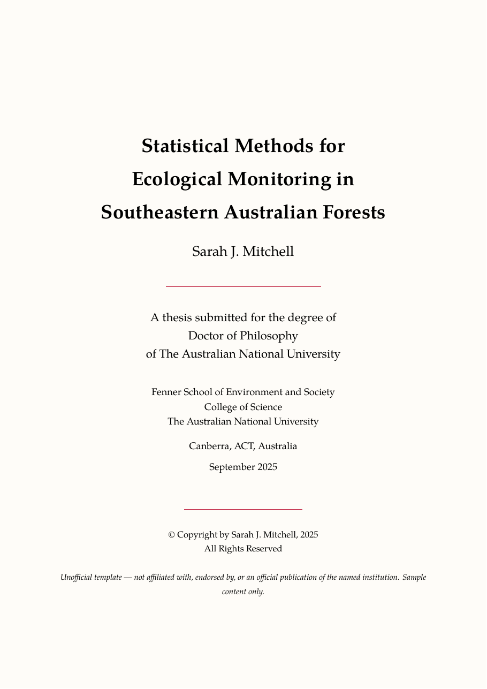</a><br><b>ANU Thesis</b><br><a href="https://letx.app/templates/universities/anu-thesis">Open in LetX</a> · <a href="./universities/anu-thesis">Source</a></td>
<td width="33%" valign="top" align="center"><a href="https://letx.app/templates/universities/bits-pilani-thesis">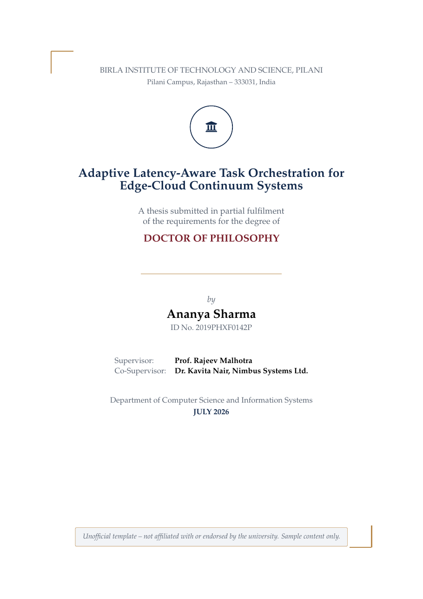</a><br><b>BITS Pilani Thesis</b><br><a href="https://letx.app/templates/universities/bits-pilani-thesis">Open in LetX</a> · <a href="./universities/bits-pilani-thesis">Source</a></td>
<td width="33%" valign="top" align="center"><a href="https://letx.app/templates/universities/brown-thesis">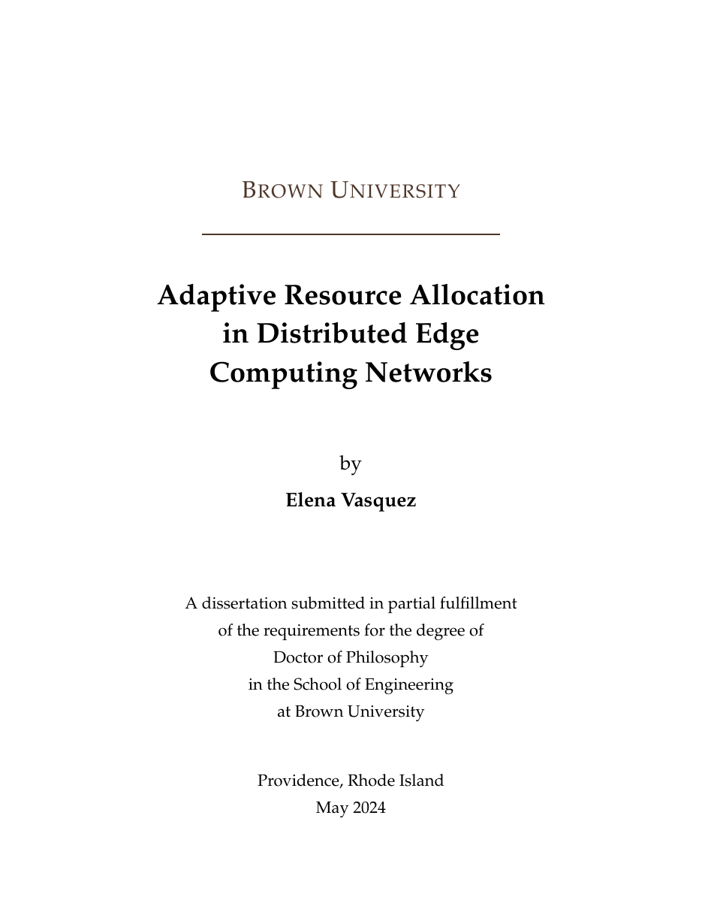</a><br><b>Brown University Thesis</b><br><a href="https://letx.app/templates/universities/brown-thesis">Open in LetX</a> · <a href="./universities/brown-thesis">Source</a></td>
</tr>
<tr>
<td width="33%" valign="top" align="center"><a href="https://letx.app/templates/universities/cairo-university-thesis">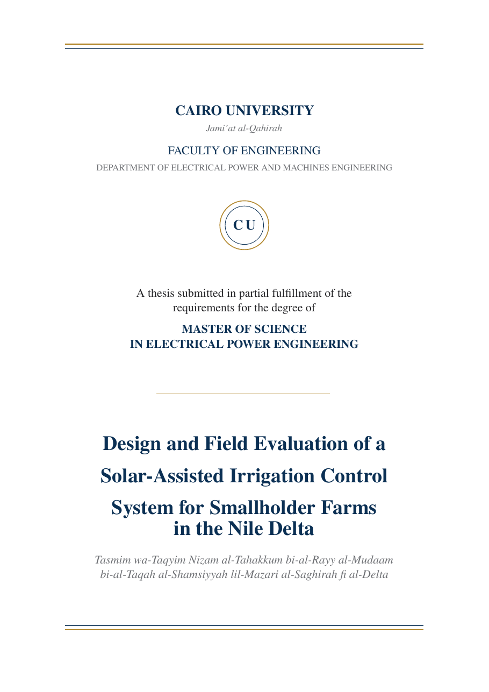</a><br><b>Cairo University Thesis</b><br><a href="https://letx.app/templates/universities/cairo-university-thesis">Open in LetX</a> · <a href="./universities/cairo-university-thesis">Source</a></td>
<td width="33%" valign="top" align="center"><a href="https://letx.app/templates/universities/caltech-thesis">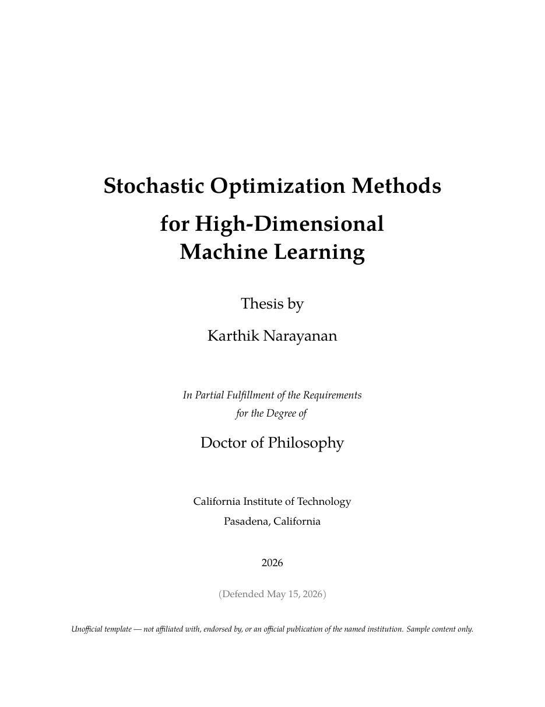</a><br><b>Caltech Thesis</b><br><a href="https://letx.app/templates/universities/caltech-thesis">Open in LetX</a> · <a href="./universities/caltech-thesis">Source</a></td>
<td width="33%" valign="top" align="center"><a href="https://letx.app/templates/universities/chulalongkorn-thesis">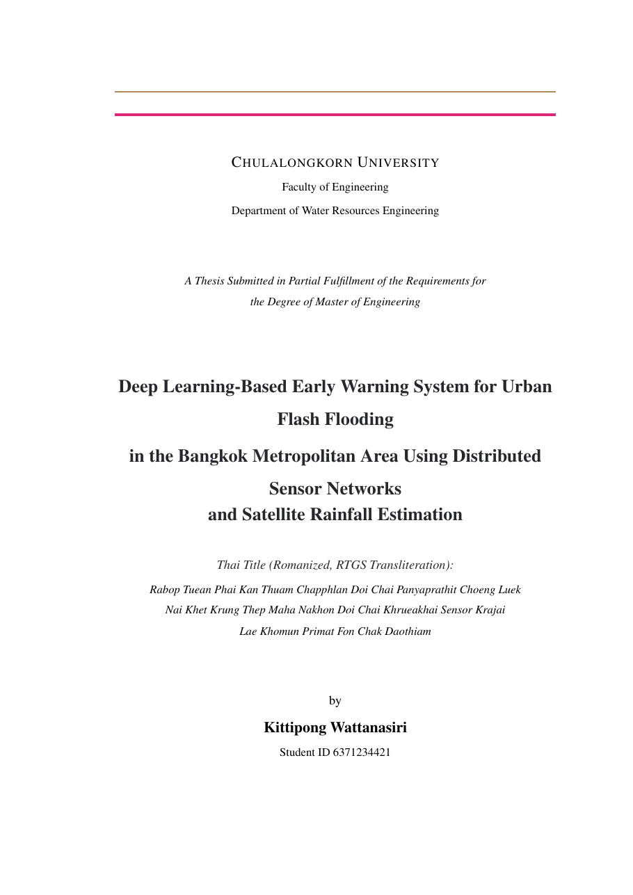</a><br><b>Chulalongkorn Thesis</b><br><a href="https://letx.app/templates/universities/chulalongkorn-thesis">Open in LetX</a> · <a href="./universities/chulalongkorn-thesis">Source</a></td>
</tr>
<tr>
<td width="33%" valign="top" align="center"><a href="https://letx.app/templates/universities/cmu-thesis">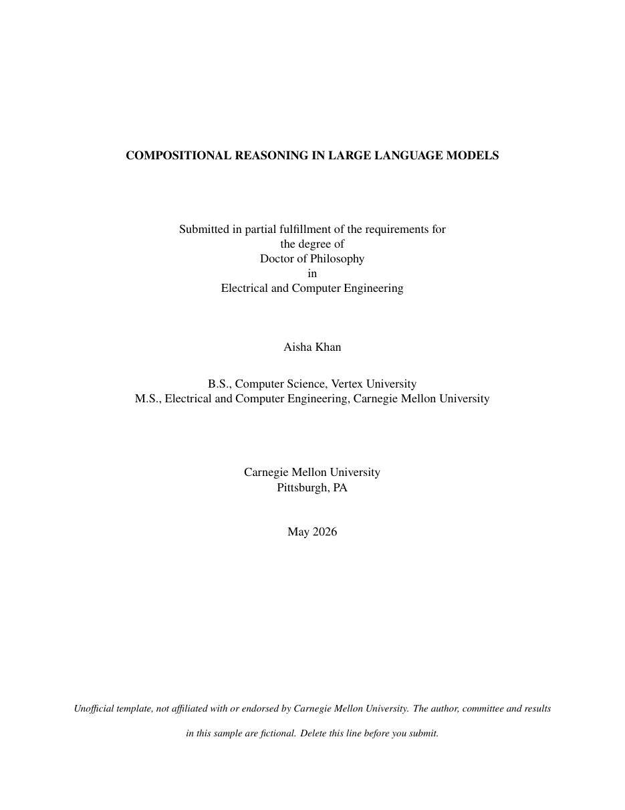</a><br><b>CMU Thesis</b><br><a href="https://letx.app/templates/universities/cmu-thesis">Open in LetX</a> · <a href="./universities/cmu-thesis">Source</a></td>
<td width="33%" valign="top" align="center"><a href="https://letx.app/templates/universities/columbia-thesis">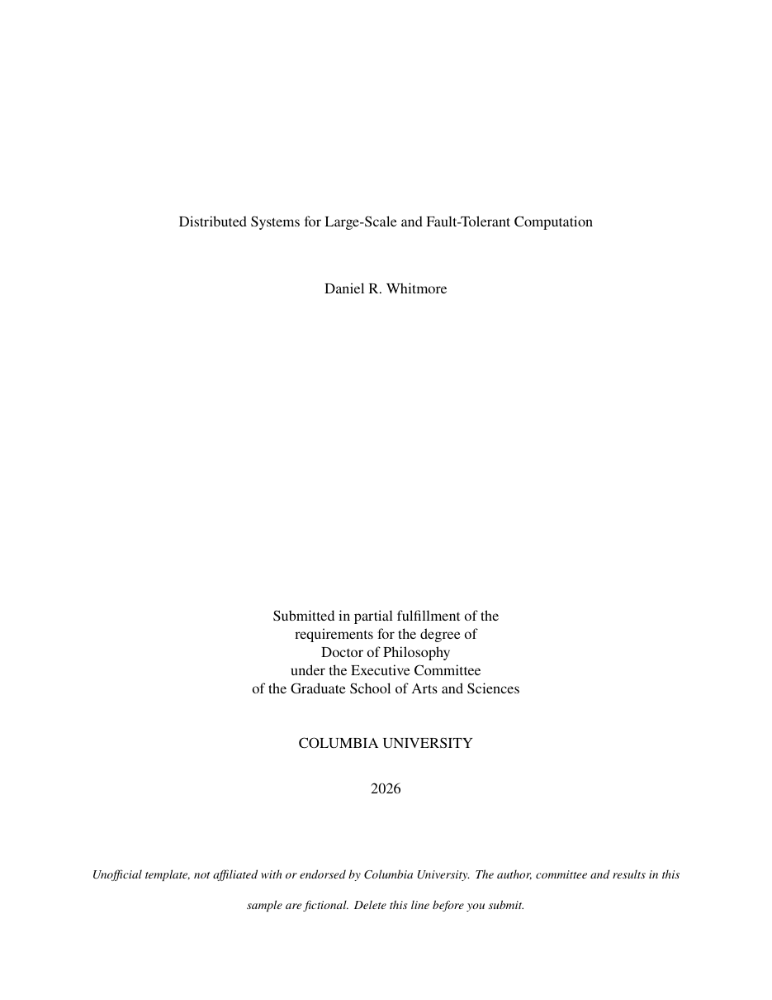</a><br><b>Columbia Thesis</b><br><a href="https://letx.app/templates/universities/columbia-thesis">Open in LetX</a> · <a href="./universities/columbia-thesis">Source</a></td>
<td width="33%" valign="top" align="center"><a href="https://letx.app/templates/universities/cornell-thesis">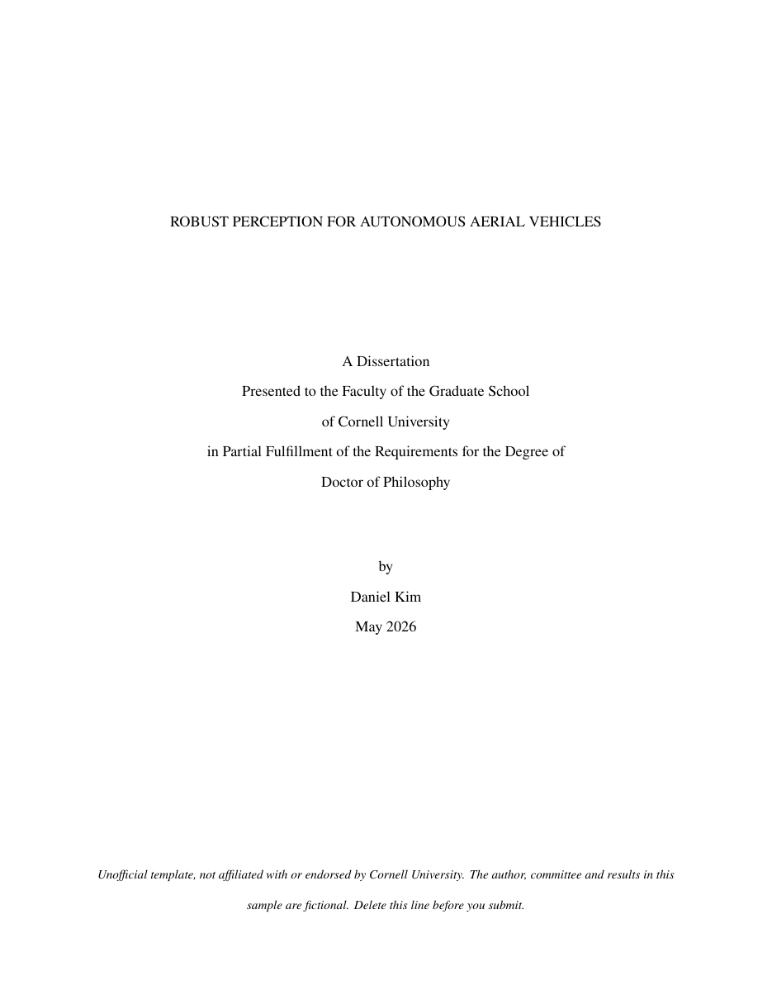</a><br><b>Cornell Thesis</b><br><a href="https://letx.app/templates/universities/cornell-thesis">Open in LetX</a> · <a href="./universities/cornell-thesis">Source</a></td>
</tr>
<tr>
<td width="33%" valign="top" align="center"><a href="https://letx.app/templates/universities/delhi-university-thesis">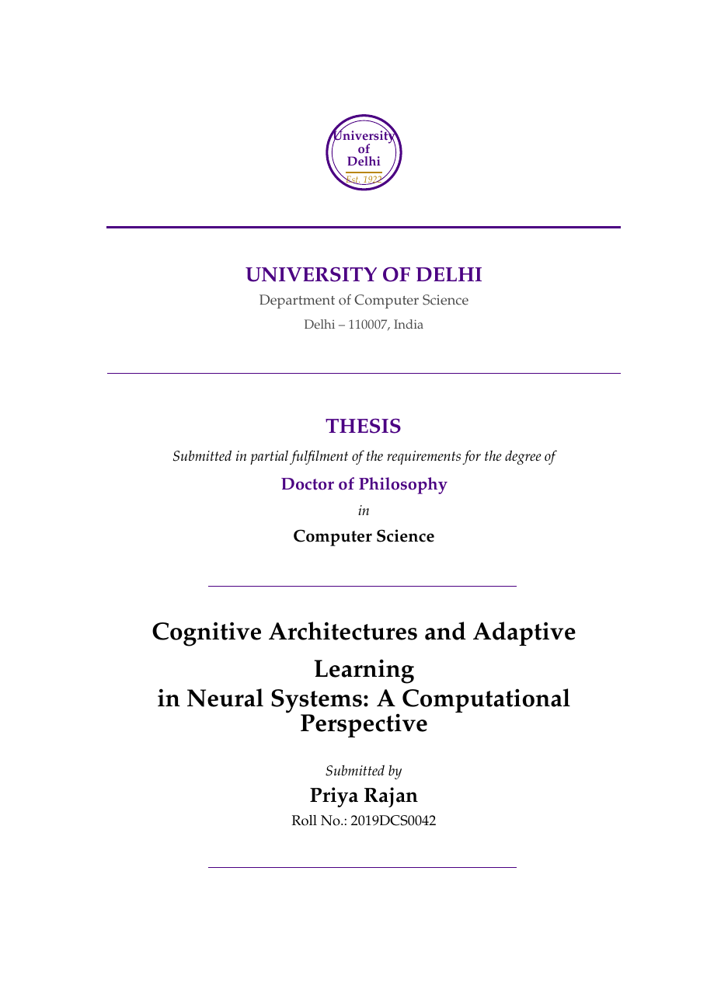</a><br><b>Delhi University Thesis</b><br><a href="https://letx.app/templates/universities/delhi-university-thesis">Open in LetX</a> · <a href="./universities/delhi-university-thesis">Source</a></td>
<td width="33%" valign="top" align="center"><a href="https://letx.app/templates/universities/dtu-delhi-thesis"></a><br><b>DTU Delhi Thesis</b><br><a href="https://letx.app/templates/universities/dtu-delhi-thesis">Open in LetX</a> · <a href="./universities/dtu-delhi-thesis">Source</a></td>
<td width="33%" valign="top" align="center"><a href="https://letx.app/templates/universities/duke-thesis">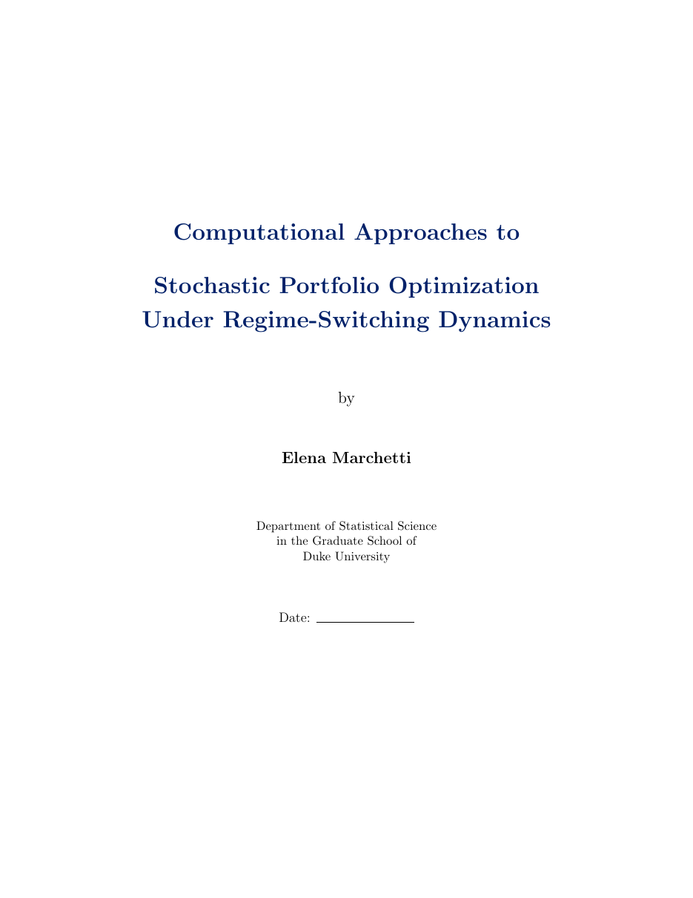</a><br><b>Duke University Thesis</b><br><a href="https://letx.app/templates/universities/duke-thesis">Open in LetX</a> · <a href="./universities/duke-thesis">Source</a></td>
</tr>
<tr>
<td width="33%" valign="top" align="center"><a href="https://letx.app/templates/universities/edinburgh-thesis">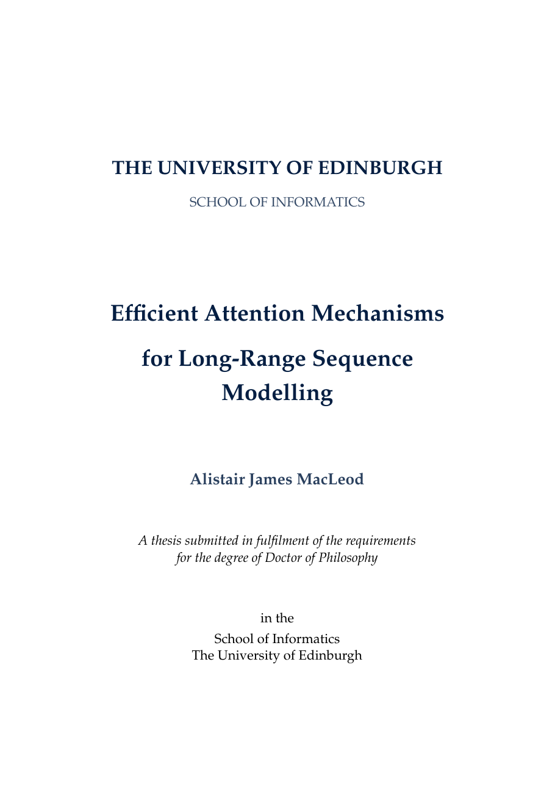</a><br><b>Edinburgh Thesis</b><br><a href="https://letx.app/templates/universities/edinburgh-thesis">Open in LetX</a> · <a href="./universities/edinburgh-thesis">Source</a></td>
<td width="33%" valign="top" align="center"><a href="https://letx.app/templates/universities/epfl-thesis">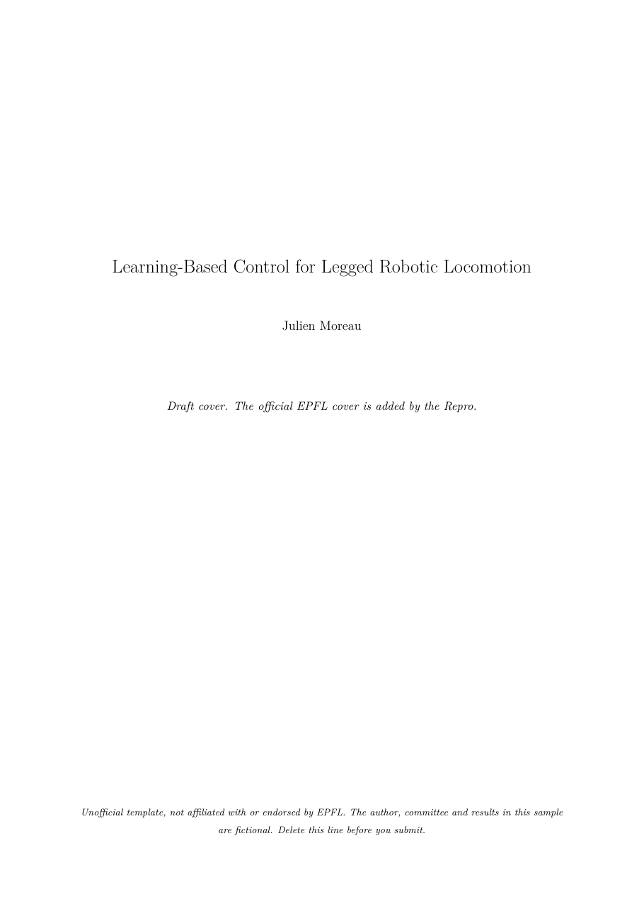</a><br><b>EPFL Thesis</b><br><a href="https://letx.app/templates/universities/epfl-thesis">Open in LetX</a> · <a href="./universities/epfl-thesis">Source</a></td>
<td width="33%" valign="top" align="center"><a href="https://letx.app/templates/universities/gatech-thesis">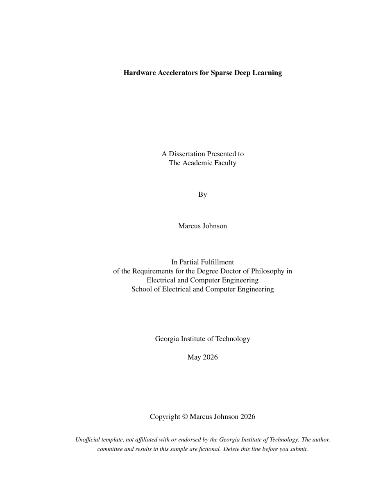</a><br><b>Georgia Tech Thesis</b><br><a href="https://letx.app/templates/universities/gatech-thesis">Open in LetX</a> · <a href="./universities/gatech-thesis">Source</a></td>
</tr>
<tr>
<td width="33%" valign="top" align="center"><a href="https://letx.app/templates/universities/hku-thesis">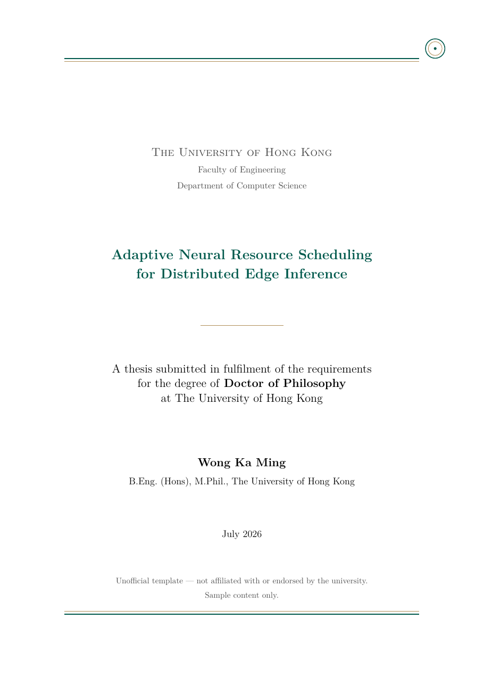</a><br><b>HKU Thesis</b><br><a href="https://letx.app/templates/universities/hku-thesis">Open in LetX</a> · <a href="./universities/hku-thesis">Source</a></td>
<td width="33%" valign="top" align="center"><a href="https://letx.app/templates/universities/iiit-hyderabad-thesis">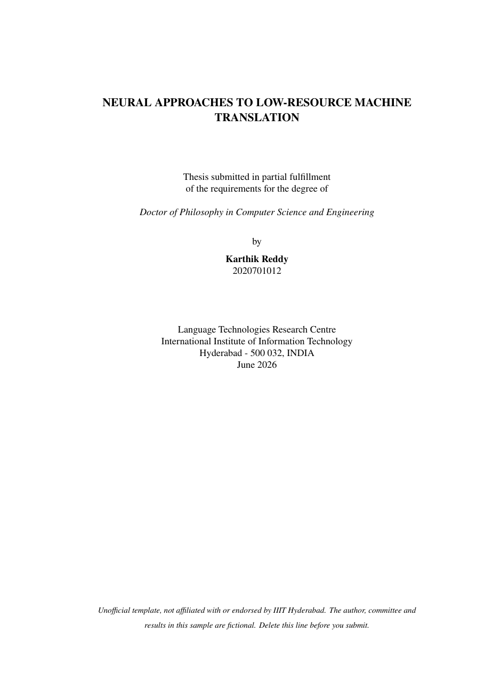</a><br><b>IIIT Hyderabad Thesis</b><br><a href="https://letx.app/templates/universities/iiit-hyderabad-thesis">Open in LetX</a> · <a href="./universities/iiit-hyderabad-thesis">Source</a></td>
<td width="33%" valign="top" align="center"><a href="https://letx.app/templates/universities/iit-guwahati-thesis">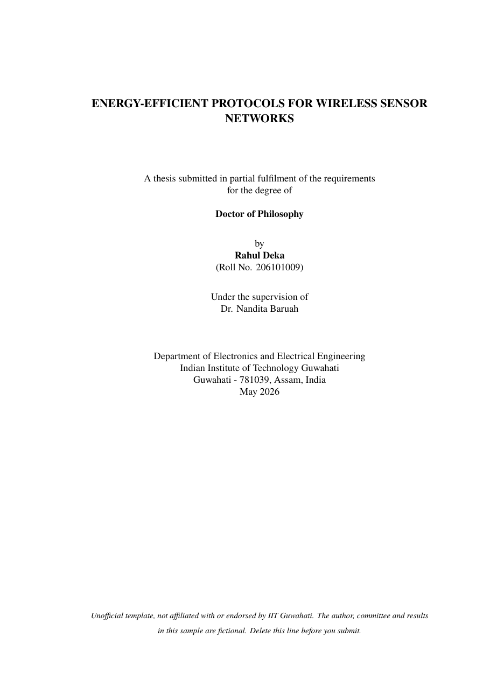</a><br><b>IIT Guwahati Thesis</b><br><a href="https://letx.app/templates/universities/iit-guwahati-thesis">Open in LetX</a> · <a href="./universities/iit-guwahati-thesis">Source</a></td>
</tr>
<tr>
<td width="33%" valign="top" align="center"><a href="https://letx.app/templates/universities/iit-kharagpur-thesis">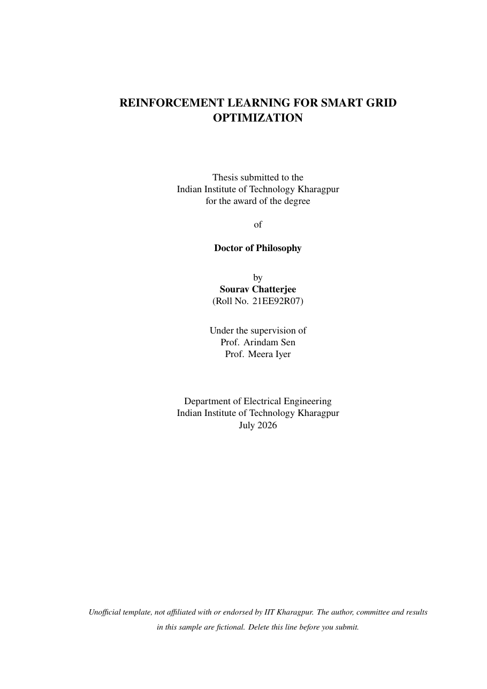</a><br><b>IIT Kharagpur Thesis</b><br><a href="https://letx.app/templates/universities/iit-kharagpur-thesis">Open in LetX</a> · <a href="./universities/iit-kharagpur-thesis">Source</a></td>
<td width="33%" valign="top" align="center"><a href="https://letx.app/templates/universities/iit-roorkee-thesis">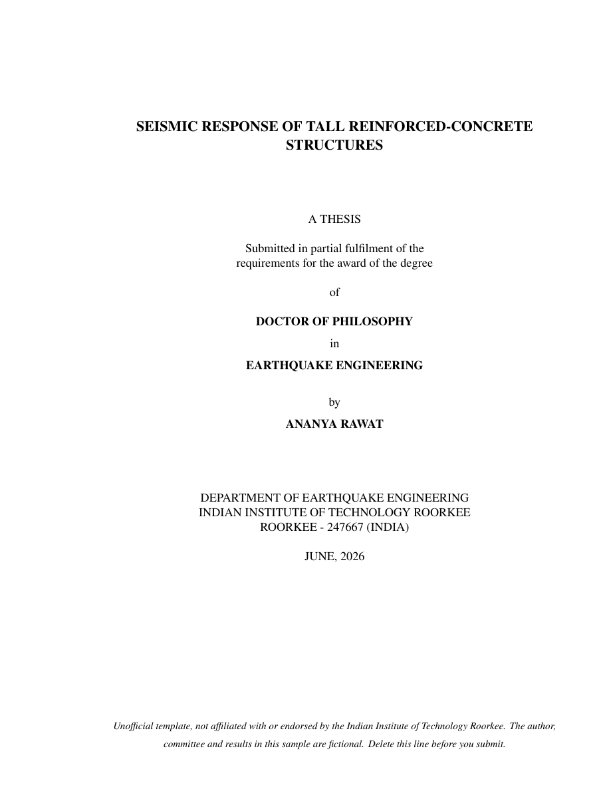</a><br><b>IIT Roorkee Thesis</b><br><a href="https://letx.app/templates/universities/iit-roorkee-thesis">Open in LetX</a> · <a href="./universities/iit-roorkee-thesis">Source</a></td>
<td width="33%" valign="top" align="center"><a href="https://letx.app/templates/universities/imperial-college-thesis">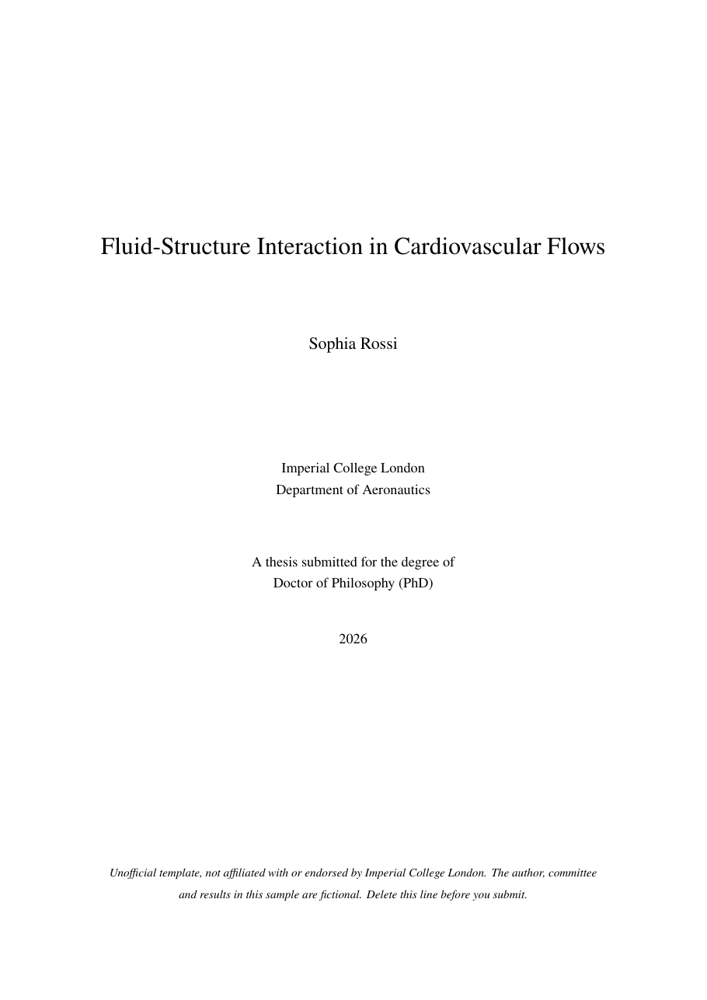</a><br><b>Imperial College London Thesis</b><br><a href="https://letx.app/templates/universities/imperial-college-thesis">Open in LetX</a> · <a href="./universities/imperial-college-thesis">Source</a></td>
</tr>
<tr>
<td width="33%" valign="top" align="center"><a href="https://letx.app/templates/universities/johns-hopkins-thesis">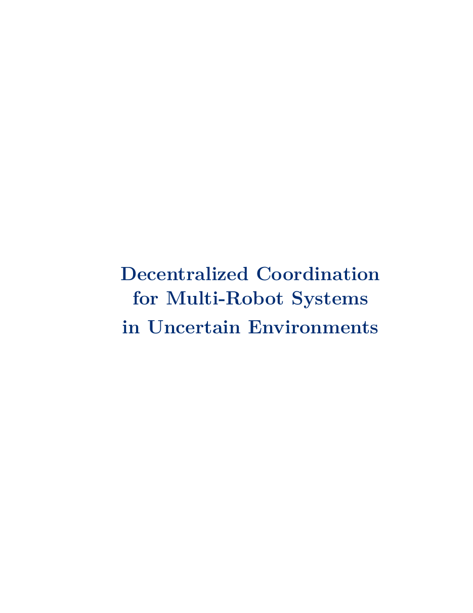</a><br><b>Johns Hopkins Thesis</b><br><a href="https://letx.app/templates/universities/johns-hopkins-thesis">Open in LetX</a> · <a href="./universities/johns-hopkins-thesis">Source</a></td>
<td width="33%" valign="top" align="center"><a href="https://letx.app/templates/universities/kaust-thesis">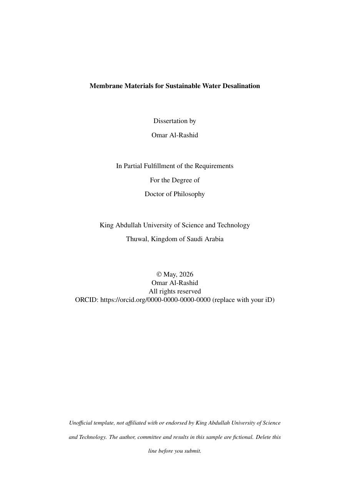</a><br><b>KAUST Thesis</b><br><a href="https://letx.app/templates/universities/kaust-thesis">Open in LetX</a> · <a href="./universities/kaust-thesis">Source</a></td>
<td width="33%" valign="top" align="center"><a href="https://letx.app/templates/universities/kfupm-thesis"></a><br><b>KFUPM Thesis</b><br><a href="https://letx.app/templates/universities/kfupm-thesis">Open in LetX</a> · <a href="./universities/kfupm-thesis">Source</a></td>
</tr>
<tr>
<td width="33%" valign="top" align="center"><a href="https://letx.app/templates/universities/king-saud-university-thesis">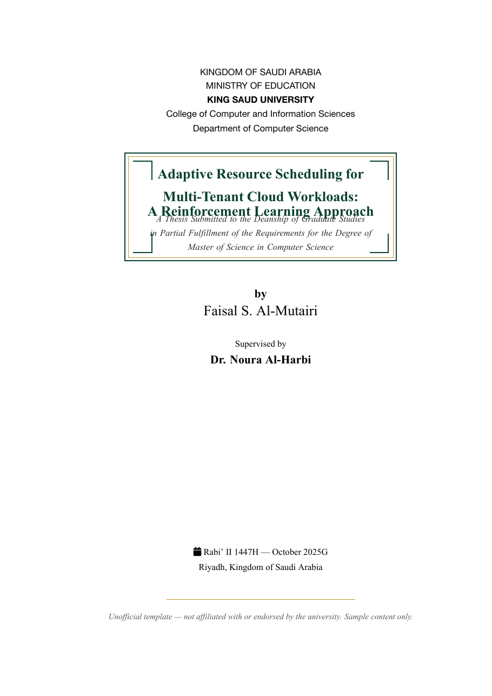</a><br><b>King Saud University Thesis</b><br><a href="https://letx.app/templates/universities/king-saud-university-thesis">Open in LetX</a> · <a href="./universities/king-saud-university-thesis">Source</a></td>
<td width="33%" valign="top" align="center"><a href="https://letx.app/templates/universities/korea-university-thesis">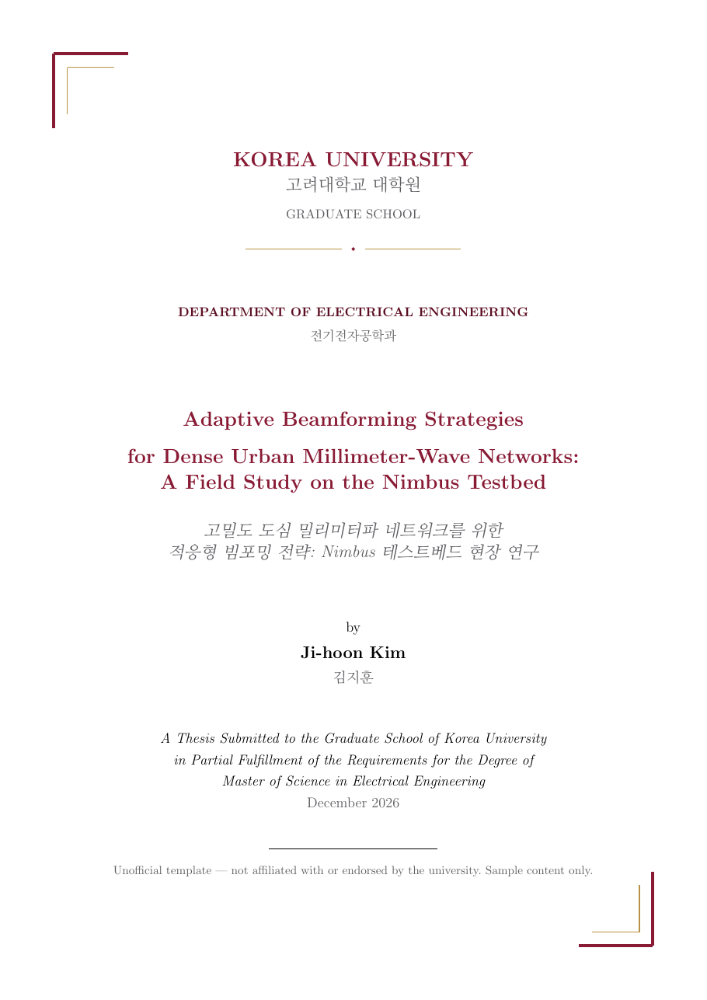</a><br><b>Korea University Thesis</b><br><a href="https://letx.app/templates/universities/korea-university-thesis">Open in LetX</a> · <a href="./universities/korea-university-thesis">Source</a></td>
<td width="33%" valign="top" align="center"><a href="https://letx.app/templates/universities/kuleuven-thesis">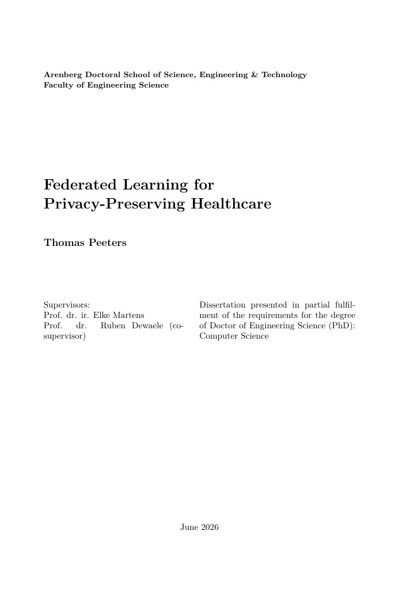</a><br><b>KU Leuven Thesis</b><br><a href="https://letx.app/templates/universities/kuleuven-thesis">Open in LetX</a> · <a href="./universities/kuleuven-thesis">Source</a></td>
</tr>
<tr>
<td width="33%" valign="top" align="center"><a href="https://letx.app/templates/universities/kyoto-university-thesis">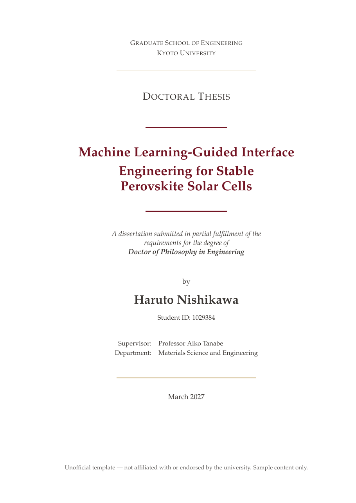</a><br><b>Kyoto University Thesis</b><br><a href="https://letx.app/templates/universities/kyoto-university-thesis">Open in LetX</a> · <a href="./universities/kyoto-university-thesis">Source</a></td>
<td width="33%" valign="top" align="center"><a href="https://letx.app/templates/universities/lmu-munich-thesis">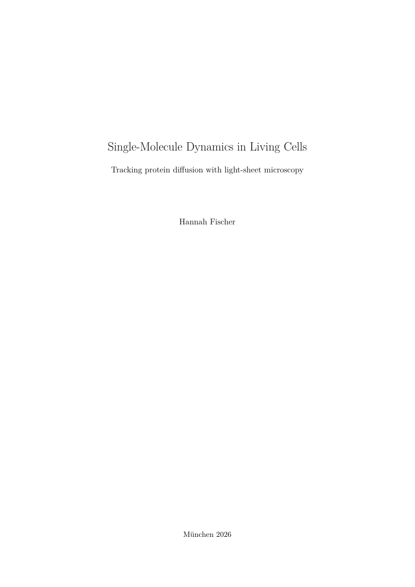</a><br><b>LMU Munich Thesis</b><br><a href="https://letx.app/templates/universities/lmu-munich-thesis">Open in LetX</a> · <a href="./universities/lmu-munich-thesis">Source</a></td>
<td width="33%" valign="top" align="center"><a href="https://letx.app/templates/universities/mcgill-thesis">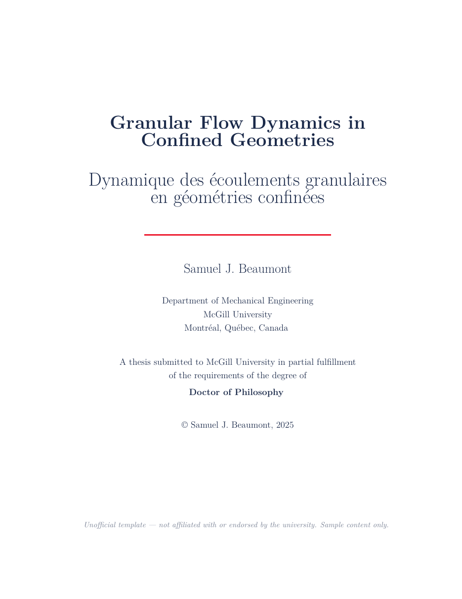</a><br><b>McGill University Thesis</b><br><a href="https://letx.app/templates/universities/mcgill-thesis">Open in LetX</a> · <a href="./universities/mcgill-thesis">Source</a></td>
</tr>
<tr>
<td width="33%" valign="top" align="center"><a href="https://letx.app/templates/universities/monash-thesis">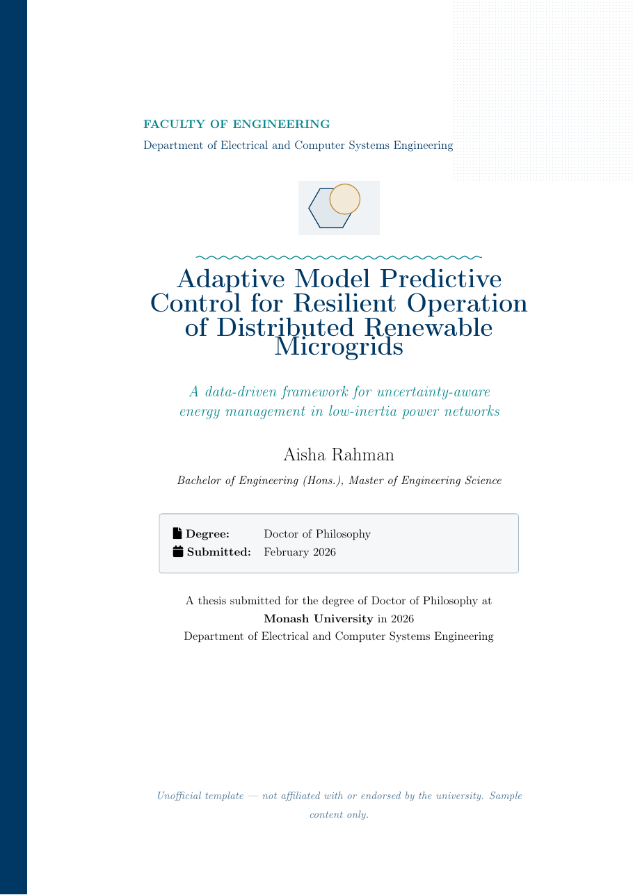</a><br><b>Monash University Thesis</b><br><a href="https://letx.app/templates/universities/monash-thesis">Open in LetX</a> · <a href="./universities/monash-thesis">Source</a></td>
<td width="33%" valign="top" align="center"><a href="https://letx.app/templates/universities/nit-thesis">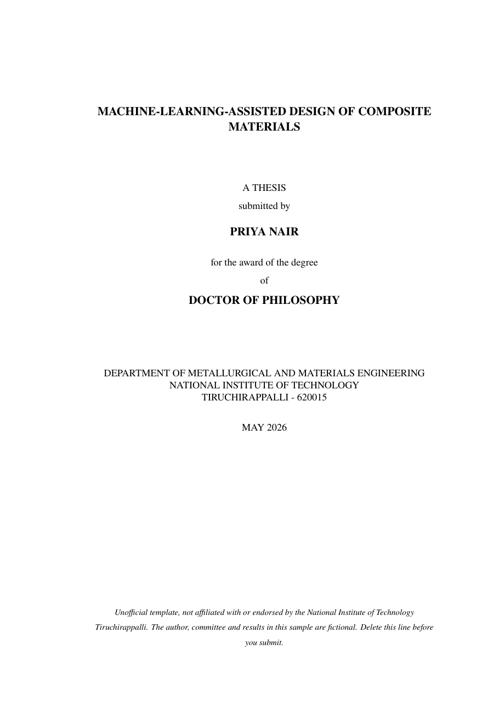</a><br><b>NIT Thesis</b><br><a href="https://letx.app/templates/universities/nit-thesis">Open in LetX</a> · <a href="./universities/nit-thesis">Source</a></td>
<td width="33%" valign="top" align="center"><a href="https://letx.app/templates/universities/northwestern-thesis">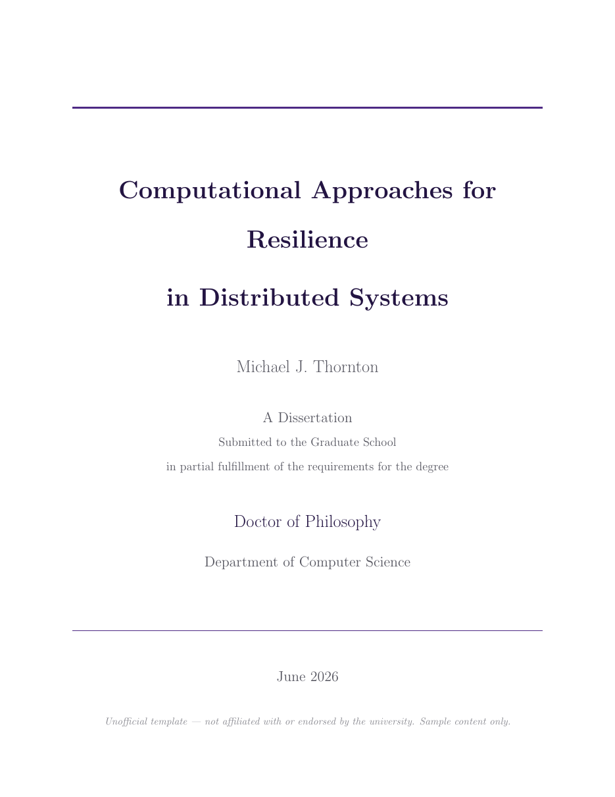</a><br><b>Northwestern Thesis</b><br><a href="https://letx.app/templates/universities/northwestern-thesis">Open in LetX</a> · <a href="./universities/northwestern-thesis">Source</a></td>
</tr>
<tr>
<td width="33%" valign="top" align="center"><a href="https://letx.app/templates/universities/nust-pakistan-thesis">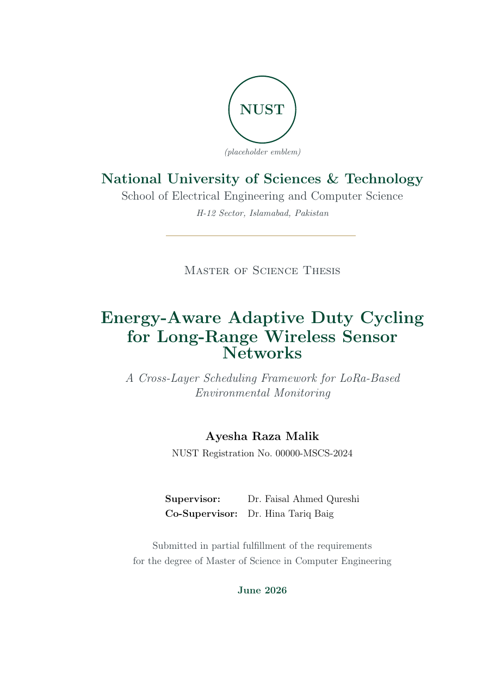</a><br><b>NUST Pakistan Thesis</b><br><a href="https://letx.app/templates/universities/nust-pakistan-thesis">Open in LetX</a> · <a href="./universities/nust-pakistan-thesis">Source</a></td>
<td width="33%" valign="top" align="center"><a href="https://letx.app/templates/universities/nyu-thesis">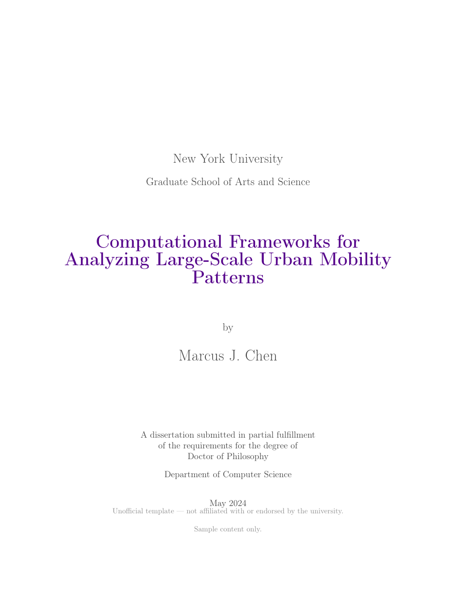</a><br><b>NYU Thesis</b><br><a href="https://letx.app/templates/universities/nyu-thesis">Open in LetX</a> · <a href="./universities/nyu-thesis">Source</a></td>
<td width="33%" valign="top" align="center"><a href="https://letx.app/templates/universities/peking-thesis">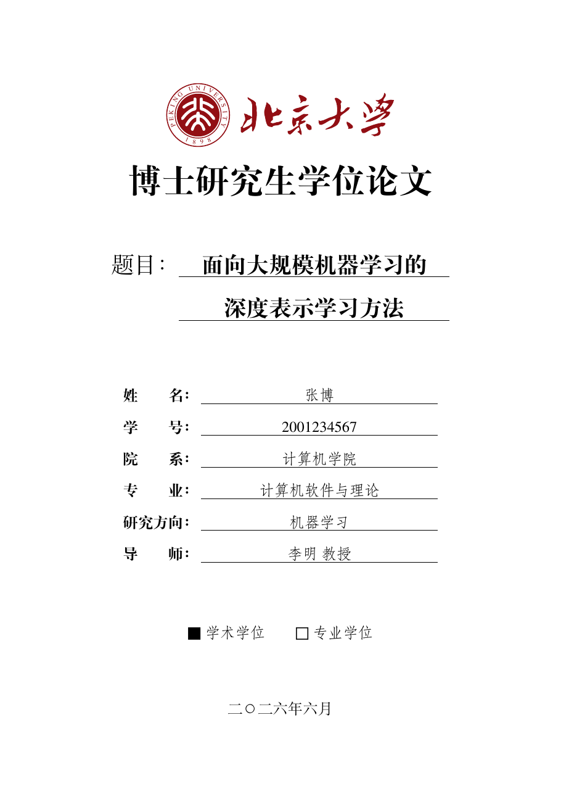</a><br><b>Peking Thesis</b><br><a href="https://letx.app/templates/universities/peking-thesis">Open in LetX</a> · <a href="./universities/peking-thesis">Source</a></td>
</tr>
<tr>
<td width="33%" valign="top" align="center"><a href="https://letx.app/templates/universities/princeton-thesis">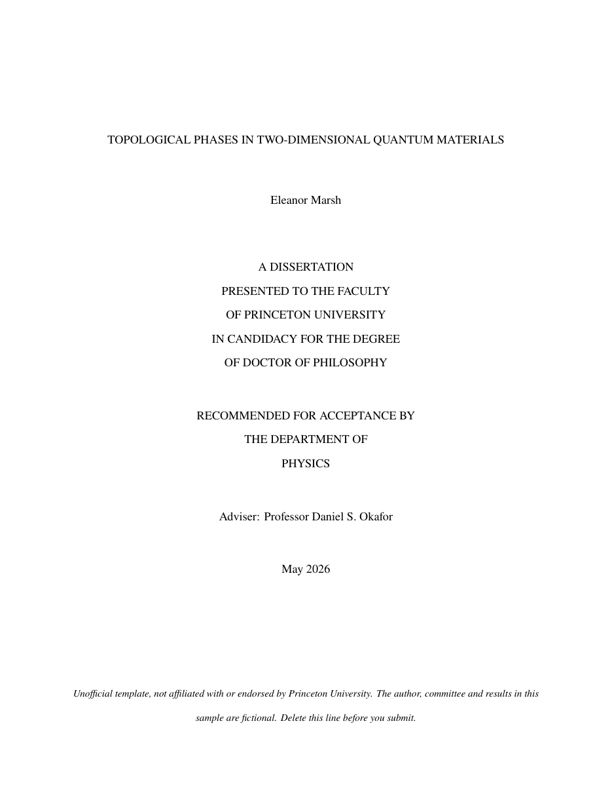</a><br><b>Princeton Thesis</b><br><a href="https://letx.app/templates/universities/princeton-thesis">Open in LetX</a> · <a href="./universities/princeton-thesis">Source</a></td>
<td width="33%" valign="top" align="center"><a href="https://letx.app/templates/universities/rwth-aachen-thesis">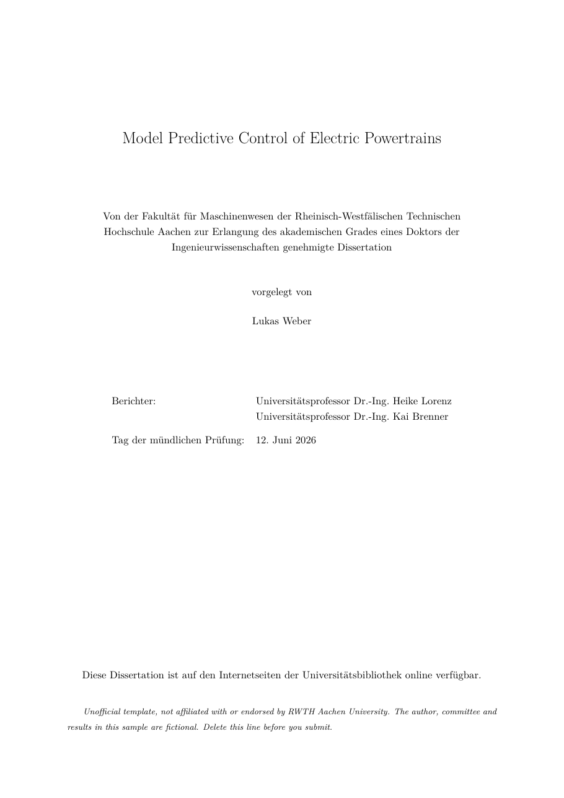</a><br><b>RWTH Aachen Thesis</b><br><a href="https://letx.app/templates/universities/rwth-aachen-thesis">Open in LetX</a> · <a href="./universities/rwth-aachen-thesis">Source</a></td>
<td width="33%" valign="top" align="center"><a href="https://letx.app/templates/universities/snu-thesis">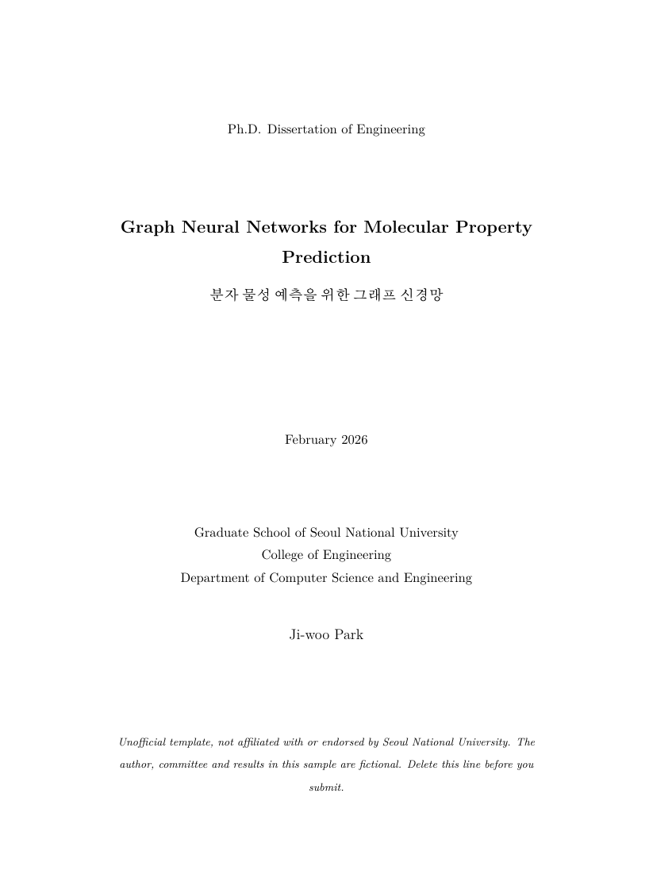</a><br><b>SNU Thesis</b><br><a href="https://letx.app/templates/universities/snu-thesis">Open in LetX</a> · <a href="./universities/snu-thesis">Source</a></td>
</tr>
<tr>
<td width="33%" valign="top" align="center"><a href="https://letx.app/templates/universities/tsinghua-thesis">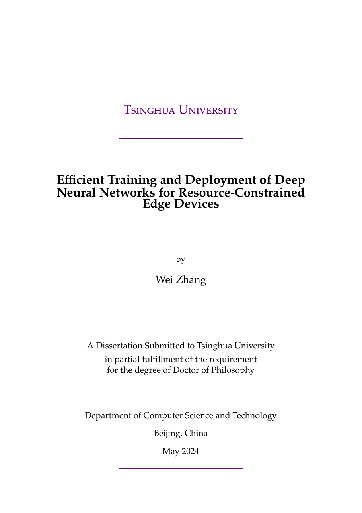</a><br><b>Tsinghua Thesis</b><br><a href="https://letx.app/templates/universities/tsinghua-thesis">Open in LetX</a> · <a href="./universities/tsinghua-thesis">Source</a></td>
<td width="33%" valign="top" align="center"><a href="https://letx.app/templates/universities/tudelft-thesis"></a><br><b>TU Delft Thesis</b><br><a href="https://letx.app/templates/universities/tudelft-thesis">Open in LetX</a> · <a href="./universities/tudelft-thesis">Source</a></td>
<td width="33%" valign="top" align="center"><a href="https://letx.app/templates/universities/tum-thesis">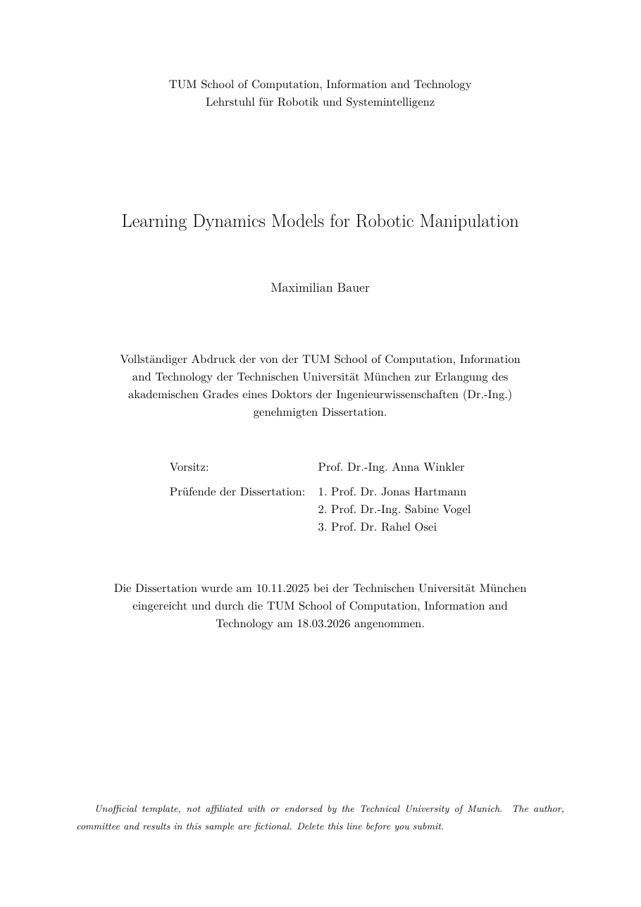</a><br><b>TUM Thesis</b><br><a href="https://letx.app/templates/universities/tum-thesis">Open in LetX</a> · <a href="./universities/tum-thesis">Source</a></td>
</tr>
<tr>
<td width="33%" valign="top" align="center"><a href="https://letx.app/templates/universities/ubc-thesis">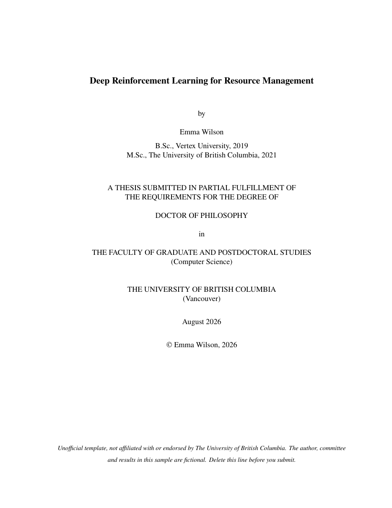</a><br><b>UBC Thesis</b><br><a href="https://letx.app/templates/universities/ubc-thesis">Open in LetX</a> · <a href="./universities/ubc-thesis">Source</a></td>
<td width="33%" valign="top" align="center"><a href="https://letx.app/templates/universities/uchicago-thesis">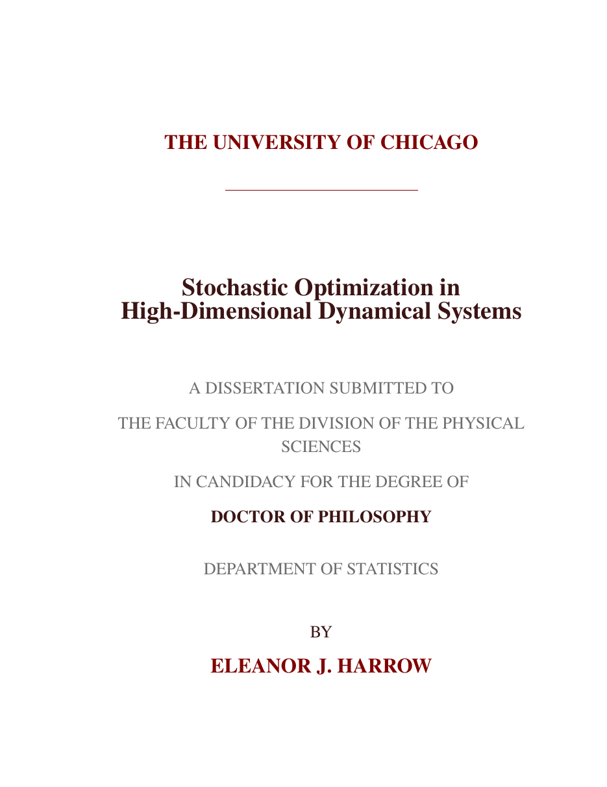</a><br><b>UChicago Dissertation</b><br><a href="https://letx.app/templates/universities/uchicago-thesis">Open in LetX</a> · <a href="./universities/uchicago-thesis">Source</a></td>
<td width="33%" valign="top" align="center"><a href="https://letx.app/templates/universities/ucl-thesis">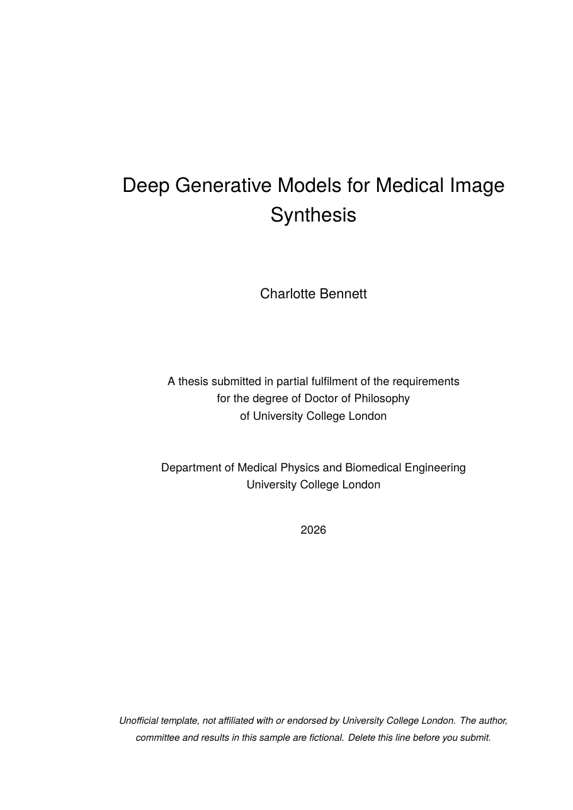</a><br><b>UCL Thesis</b><br><a href="https://letx.app/templates/universities/ucl-thesis">Open in LetX</a> · <a href="./universities/ucl-thesis">Source</a></td>
</tr>
<tr>
<td width="33%" valign="top" align="center"><a href="https://letx.app/templates/universities/ucla-thesis">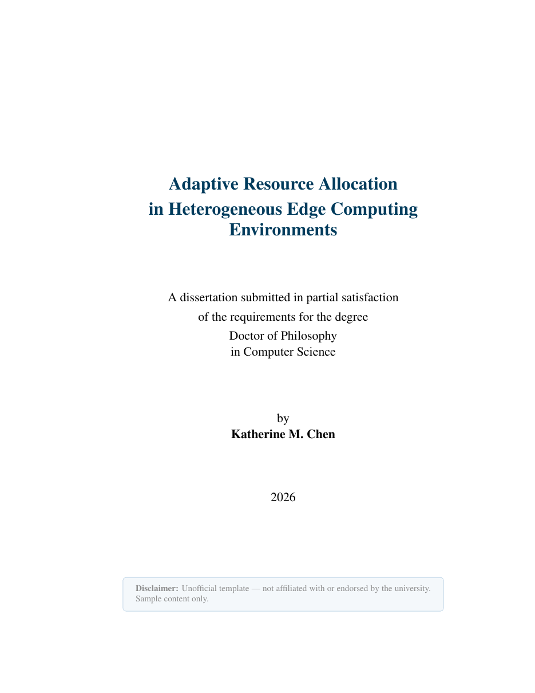</a><br><b>UCLA Thesis & Dissertation</b><br><a href="https://letx.app/templates/universities/ucla-thesis">Open in LetX</a> · <a href="./universities/ucla-thesis">Source</a></td>
<td width="33%" valign="top" align="center"><a href="https://letx.app/templates/universities/cape-town-university-thesis">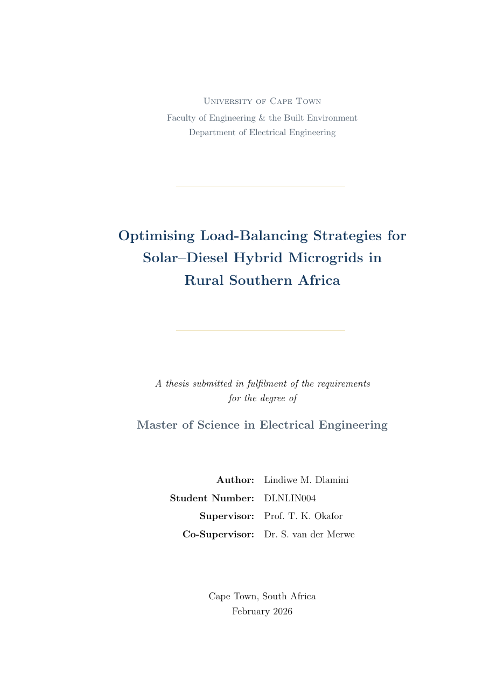</a><br><b>UCT Thesis</b><br><a href="https://letx.app/templates/universities/cape-town-university-thesis">Open in LetX</a> · <a href="./universities/cape-town-university-thesis">Source</a></td>
<td width="33%" valign="top" align="center"><a href="https://letx.app/templates/universities/umich-thesis">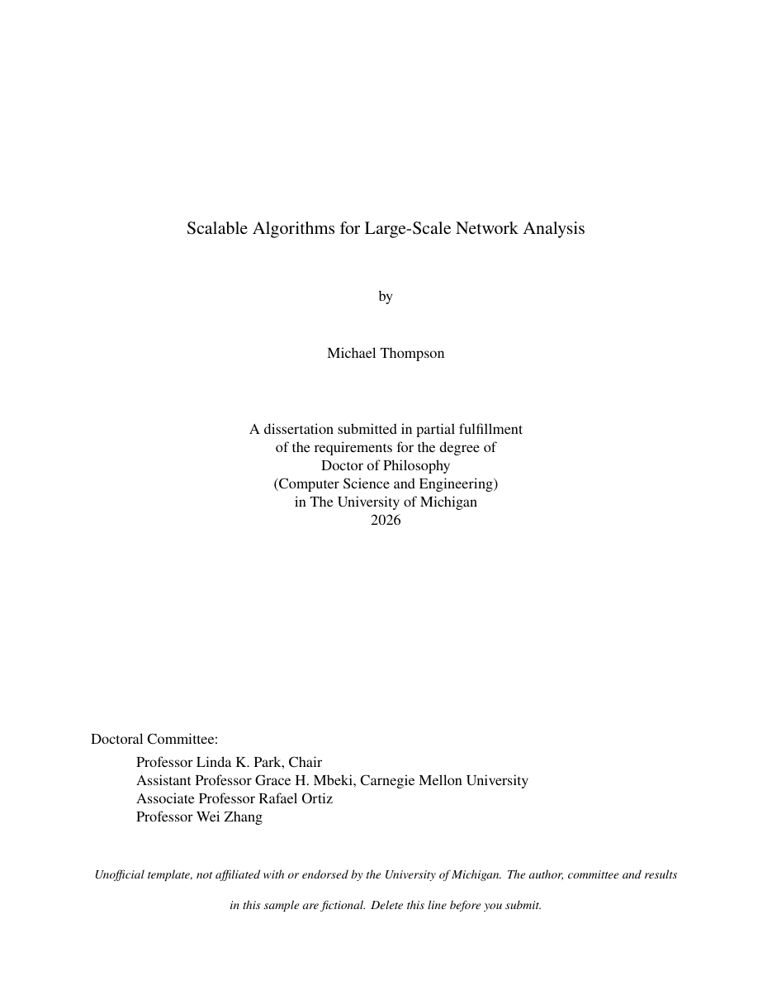</a><br><b>UMich Thesis</b><br><a href="https://letx.app/templates/universities/umich-thesis">Open in LetX</a> · <a href="./universities/umich-thesis">Source</a></td>
</tr>
<tr>
<td width="33%" valign="top" align="center"><a href="https://letx.app/templates/universities/unimelb-thesis">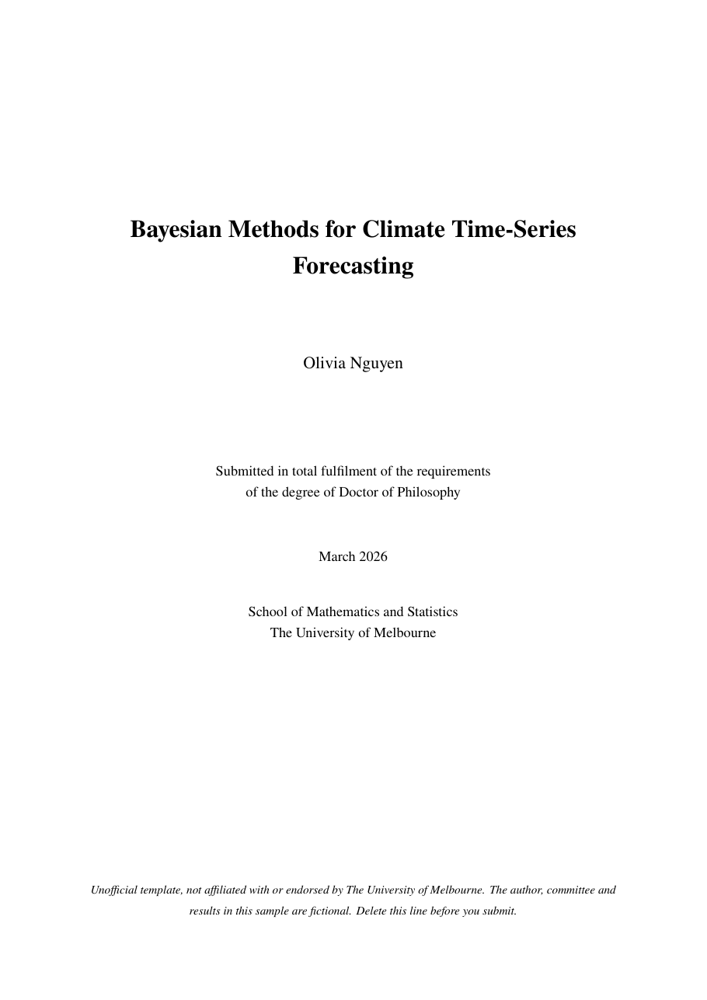</a><br><b>UniMelb Thesis</b><br><a href="https://letx.app/templates/universities/unimelb-thesis">Open in LetX</a> · <a href="./universities/unimelb-thesis">Source</a></td>
<td width="33%" valign="top" align="center"><a href="https://letx.app/templates/universities/ui-indonesia-thesis">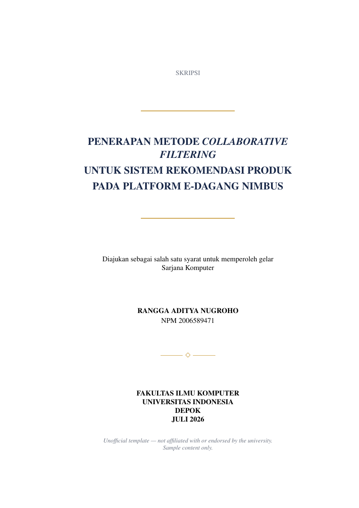</a><br><b>Universitas Indonesia Thesis</b><br><a href="https://letx.app/templates/universities/ui-indonesia-thesis">Open in LetX</a> · <a href="./universities/ui-indonesia-thesis">Source</a></td>
<td width="33%" valign="top" align="center"><a href="https://letx.app/templates/universities/malaya-university-thesis">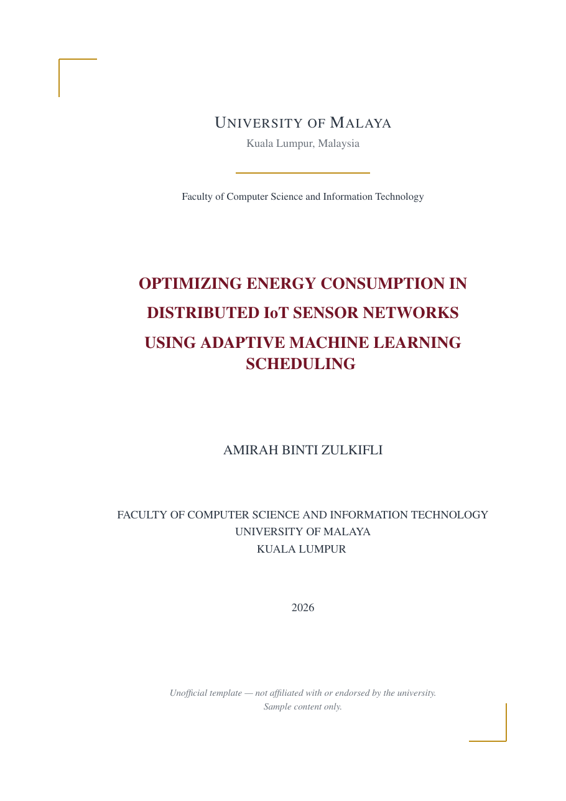</a><br><b>University of Malaya Thesis</b><br><a href="https://letx.app/templates/universities/malaya-university-thesis">Open in LetX</a> · <a href="./universities/malaya-university-thesis">Source</a></td>
</tr>
<tr>
<td width="33%" valign="top" align="center"><a href="https://letx.app/templates/universities/sydney-university-thesis"></a><br><b>University of Sydney Thesis</b><br><a href="https://letx.app/templates/universities/sydney-university-thesis">Open in LetX</a> · <a href="./universities/sydney-university-thesis">Source</a></td>
<td width="33%" valign="top" align="center"><a href="https://letx.app/templates/universities/waterloo-thesis">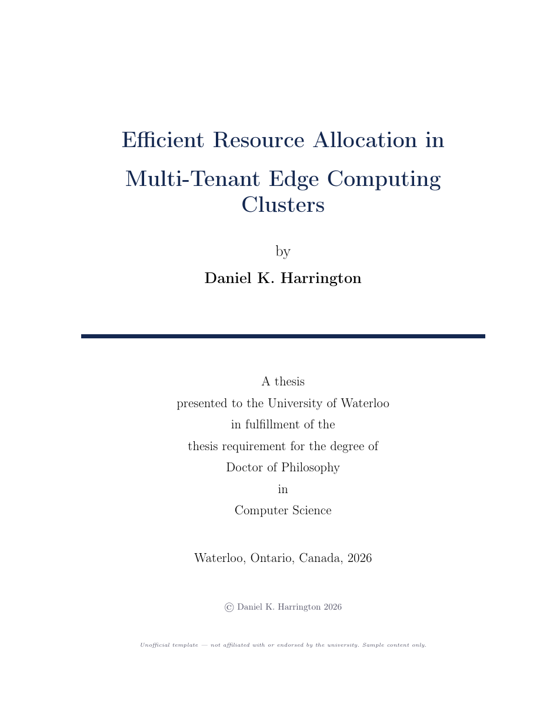</a><br><b>University of Waterloo Thesis</b><br><a href="https://letx.app/templates/universities/waterloo-thesis">Open in LetX</a> · <a href="./universities/waterloo-thesis">Source</a></td>
<td width="33%" valign="top" align="center"><a href="https://letx.app/templates/universities/unsw-thesis"></a><br><b>UNSW Thesis</b><br><a href="https://letx.app/templates/universities/unsw-thesis">Open in LetX</a> · <a href="./universities/unsw-thesis">Source</a></td>
</tr>
<tr>
<td width="33%" valign="top" align="center"><a href="https://letx.app/templates/universities/uoft-thesis">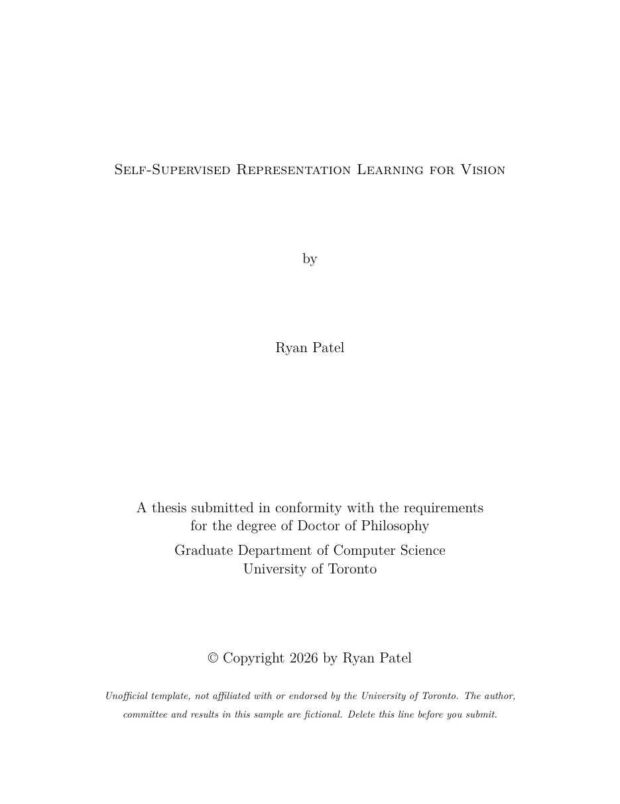</a><br><b>UofT Thesis</b><br><a href="https://letx.app/templates/universities/uoft-thesis">Open in LetX</a> · <a href="./universities/uoft-thesis">Source</a></td>
<td width="33%" valign="top" align="center"><a href="https://letx.app/templates/universities/upenn-thesis">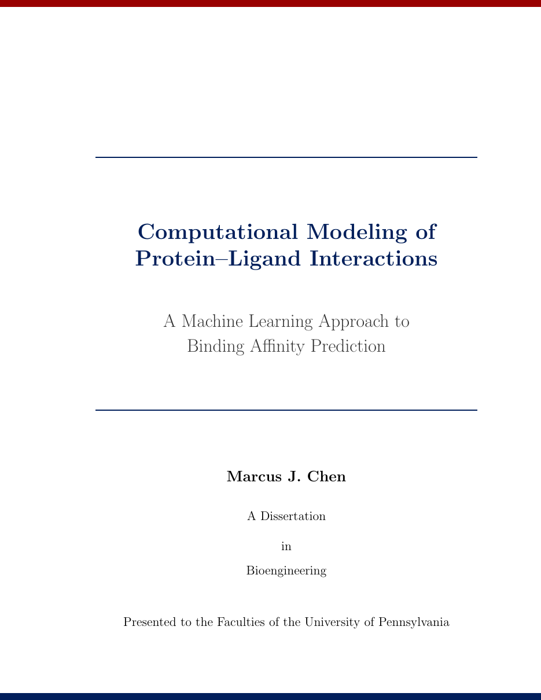</a><br><b>UPenn Thesis</b><br><a href="https://letx.app/templates/universities/upenn-thesis">Open in LetX</a> · <a href="./universities/upenn-thesis">Source</a></td>
<td width="33%" valign="top" align="center"><a href="https://letx.app/templates/universities/utokyo-thesis">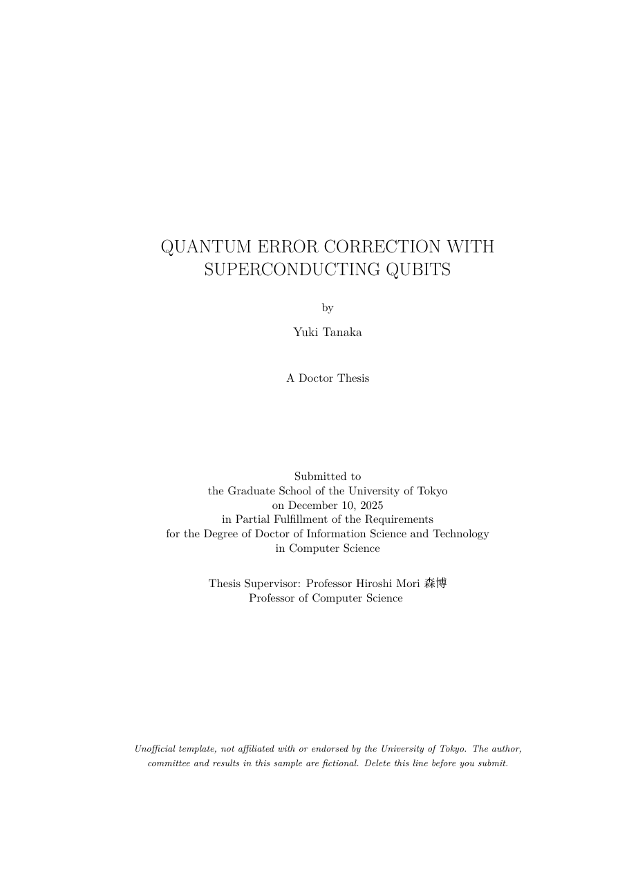</a><br><b>UTokyo Thesis</b><br><a href="https://letx.app/templates/universities/utokyo-thesis">Open in LetX</a> · <a href="./universities/utokyo-thesis">Source</a></td>
</tr>
<tr>
<td width="33%" valign="top" align="center"><a href="https://letx.app/templates/universities/vit-vellore-thesis">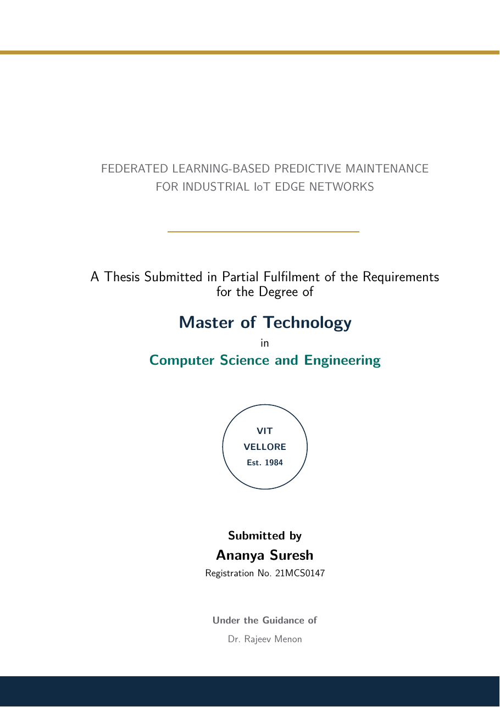</a><br><b>VIT Vellore Thesis</b><br><a href="https://letx.app/templates/universities/vit-vellore-thesis">Open in LetX</a> · <a href="./universities/vit-vellore-thesis">Source</a></td>
<td width="33%" valign="top" align="center"><a href="https://letx.app/templates/universities/wits-university-thesis">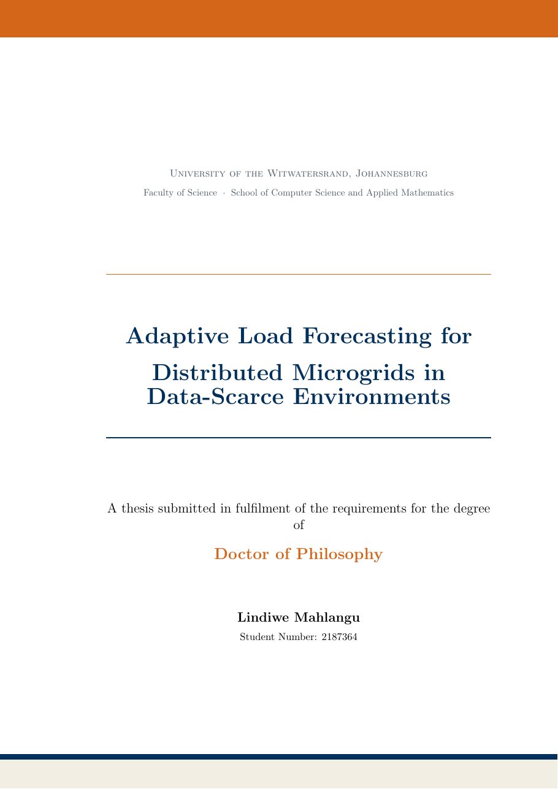</a><br><b>Wits University Thesis</b><br><a href="https://letx.app/templates/universities/wits-university-thesis">Open in LetX</a> · <a href="./universities/wits-university-thesis">Source</a></td>
<td width="33%" valign="top" align="center"><a href="https://letx.app/templates/universities/yale-thesis">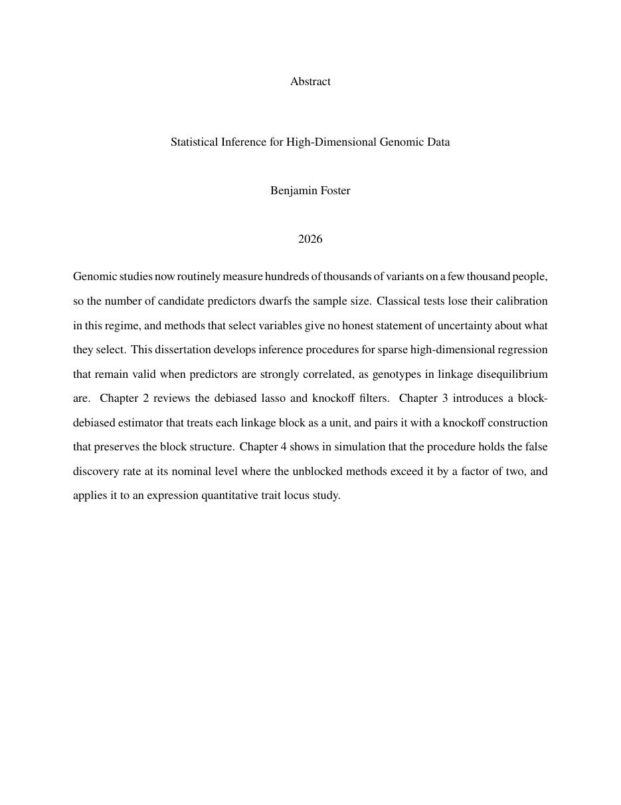</a><br><b>Yale Thesis</b><br><a href="https://letx.app/templates/universities/yale-thesis">Open in LetX</a> · <a href="./universities/yale-thesis">Source</a></td>
</tr>
<tr>
<td width="33%" valign="top" align="center"><a href="https://letx.app/templates/universities/yonsei-thesis">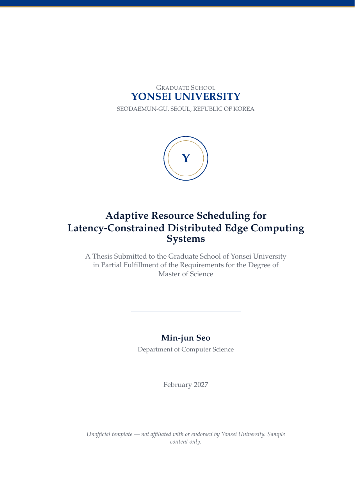</a><br><b>Yonsei University Thesis</b><br><a href="https://letx.app/templates/universities/yonsei-thesis">Open in LetX</a> · <a href="./universities/yonsei-thesis">Source</a></td>
</tr>
</table>

### Journal Articles & Papers

11 templates. [Browse this category on LetX](https://letx.app/templates/journal-articles)

<table>
<tr>
<td width="33%" valign="top" align="center"><a href="https://letx.app/templates/journal-articles/aastex-apj-paper">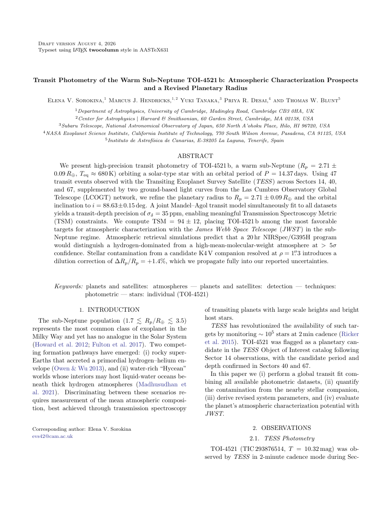</a><br><b>AASTeX Astronomy Paper</b><br><a href="https://letx.app/templates/journal-articles/aastex-apj-paper">Open in LetX</a> · <a href="./journal-articles/aastex-apj-paper">Source</a></td>
<td width="33%" valign="top" align="center"><a href="https://letx.app/templates/journal-articles/clinical-case-report">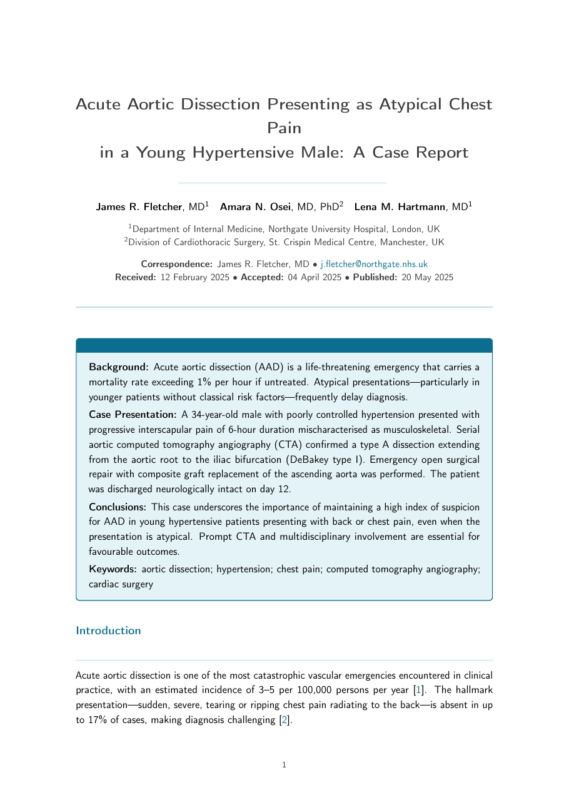</a><br><b>Clinical Case Report</b><br><a href="https://letx.app/templates/journal-articles/clinical-case-report">Open in LetX</a> · <a href="./journal-articles/clinical-case-report">Source</a></td>
<td width="33%" valign="top" align="center"><a href="https://letx.app/templates/journal-articles/cvpr-stylized-paper">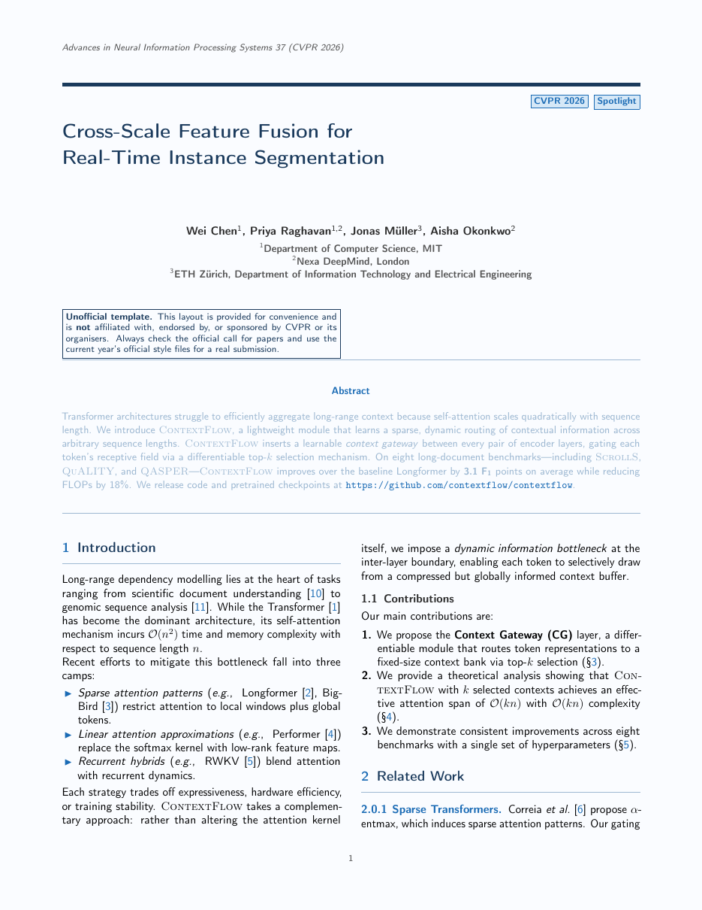</a><br><b>CVPR Paper (Stylized)</b><br><a href="https://letx.app/templates/journal-articles/cvpr-stylized-paper">Open in LetX</a> · <a href="./journal-articles/cvpr-stylized-paper">Source</a></td>
</tr>
<tr>
<td width="33%" valign="top" align="center"><a href="https://letx.app/templates/journal-articles/elegant-arxiv-preprint">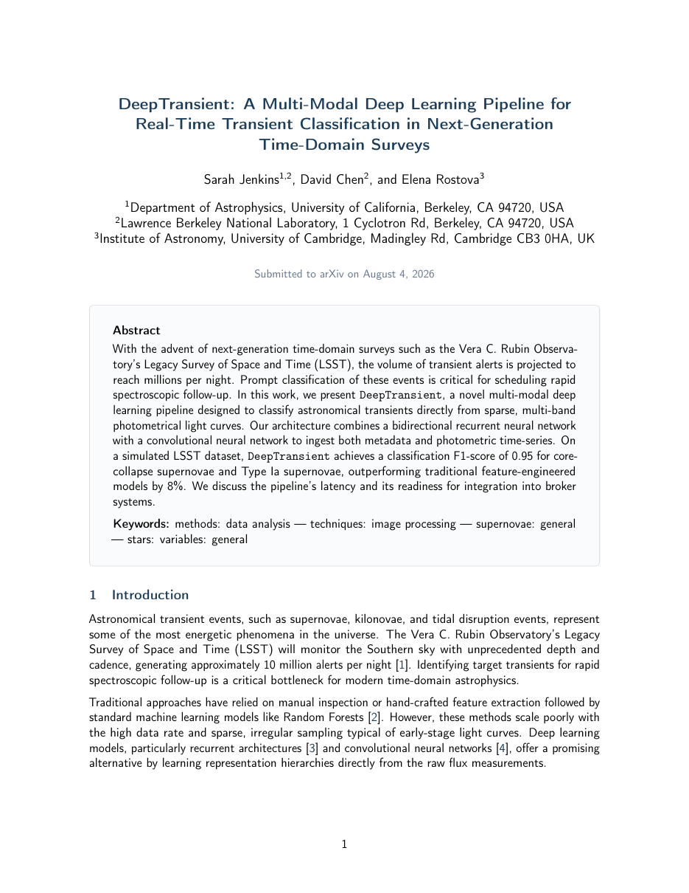</a><br><b>Elegant arXiv Preprint</b><br><a href="https://letx.app/templates/journal-articles/elegant-arxiv-preprint">Open in LetX</a> · <a href="./journal-articles/elegant-arxiv-preprint">Source</a></td>
<td width="33%" valign="top" align="center"><a href="https://letx.app/templates/journal-articles/icml-stylized-paper">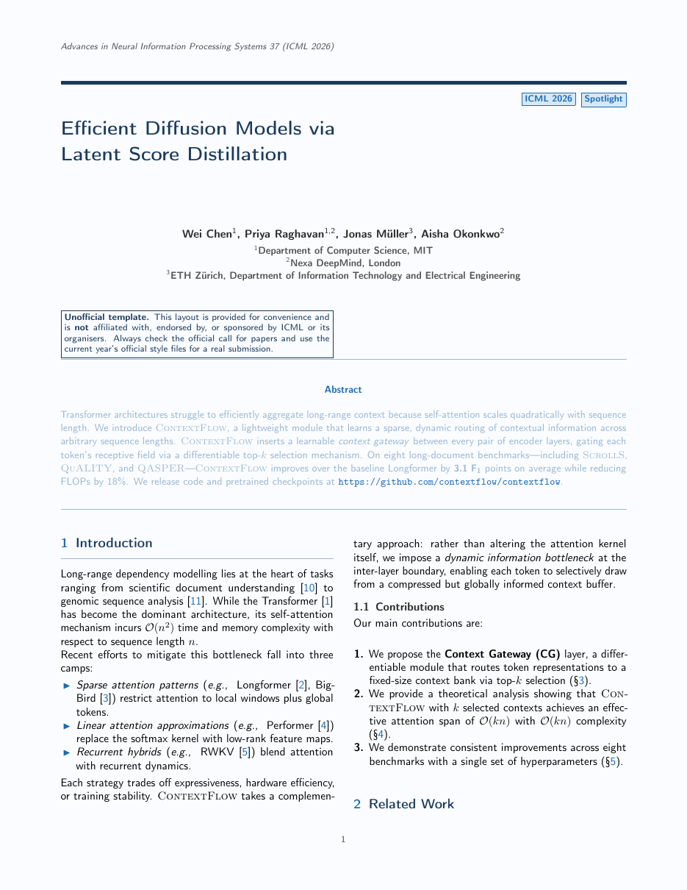</a><br><b>ICML Paper (Stylized)</b><br><a href="https://letx.app/templates/journal-articles/icml-stylized-paper">Open in LetX</a> · <a href="./journal-articles/icml-stylized-paper">Source</a></td>
<td width="33%" valign="top" align="center"><a href="https://letx.app/templates/journal-articles/journal-cover-letter">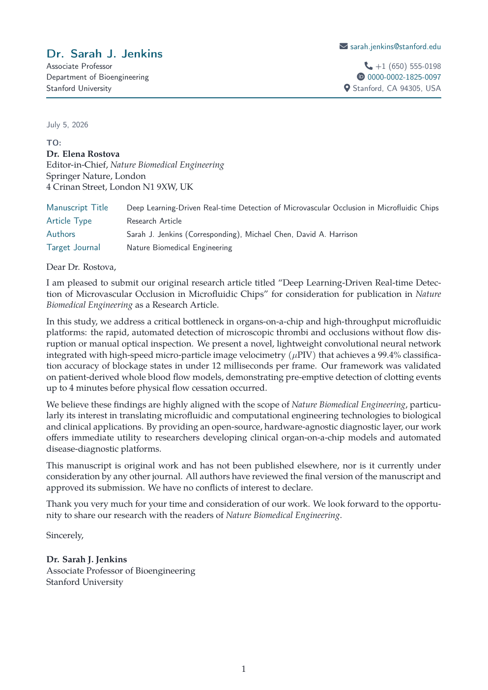</a><br><b>Journal Cover Letter</b><br><a href="https://letx.app/templates/journal-articles/journal-cover-letter">Open in LetX</a> · <a href="./journal-articles/journal-cover-letter">Source</a></td>
</tr>
<tr>
<td width="33%" valign="top" align="center"><a href="https://letx.app/templates/journal-articles/mnras-paper">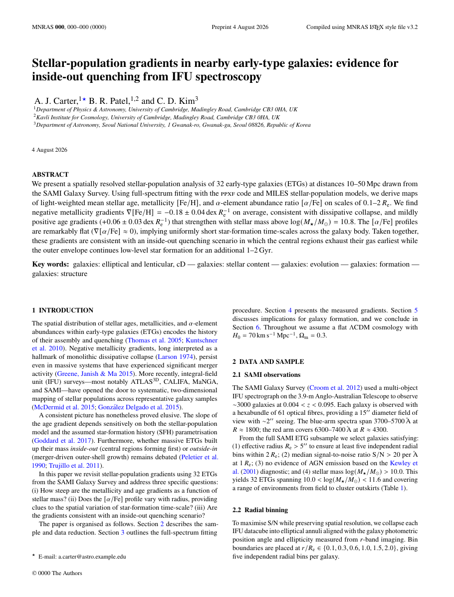</a><br><b>MNRAS Journal Paper</b><br><a href="https://letx.app/templates/journal-articles/mnras-paper">Open in LetX</a> · <a href="./journal-articles/mnras-paper">Source</a></td>
<td width="33%" valign="top" align="center"><a href="https://letx.app/templates/journal-articles/neurips-stylized-paper">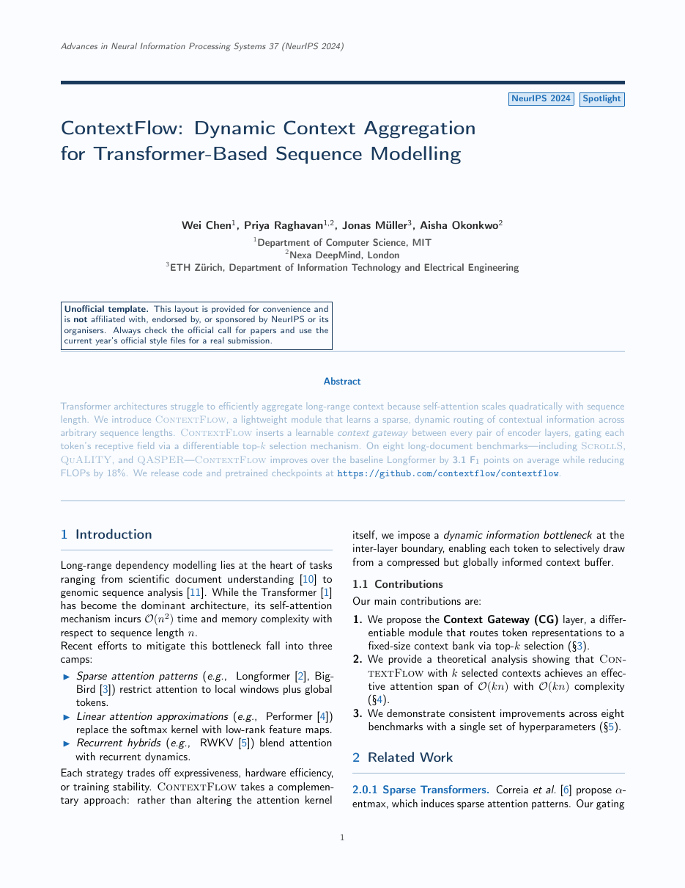</a><br><b>NeurIPS Paper (Stylized)</b><br><a href="https://letx.app/templates/journal-articles/neurips-stylized-paper">Open in LetX</a> · <a href="./journal-articles/neurips-stylized-paper">Source</a></td>
<td width="33%" valign="top" align="center"><a href="https://letx.app/templates/journal-articles/prisma-systematic-review">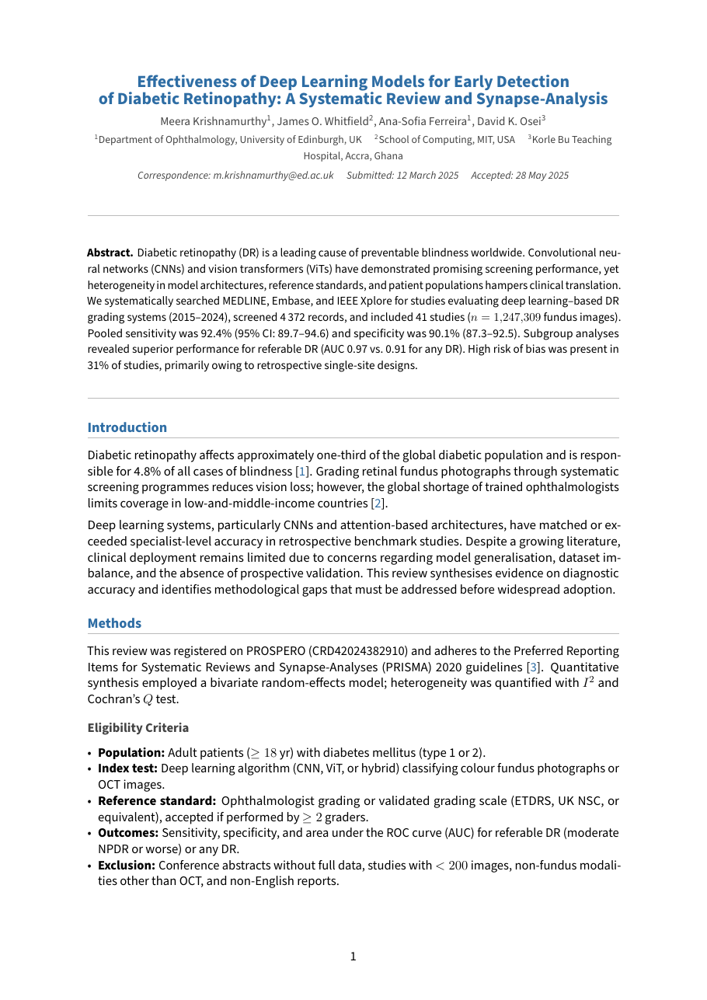</a><br><b>PRISMA Systematic Review</b><br><a href="https://letx.app/templates/journal-articles/prisma-systematic-review">Open in LetX</a> · <a href="./journal-articles/prisma-systematic-review">Source</a></td>
</tr>
<tr>
<td width="33%" valign="top" align="center"><a href="https://letx.app/templates/journal-articles/response-to-reviewers">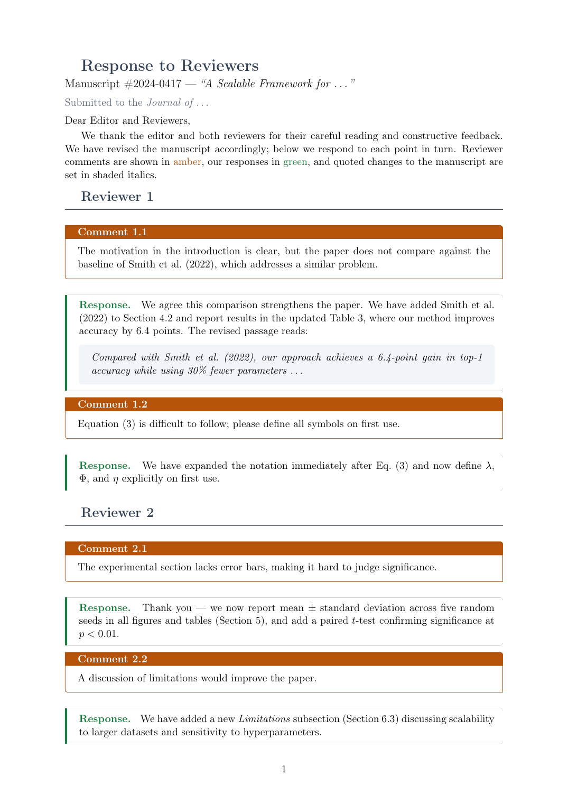</a><br><b>Response to Reviewers</b><br><a href="https://letx.app/templates/journal-articles/response-to-reviewers">Open in LetX</a> · <a href="./journal-articles/response-to-reviewers">Source</a></td>
<td width="33%" valign="top" align="center"><a href="https://letx.app/templates/journal-articles/revtex-aps-paper">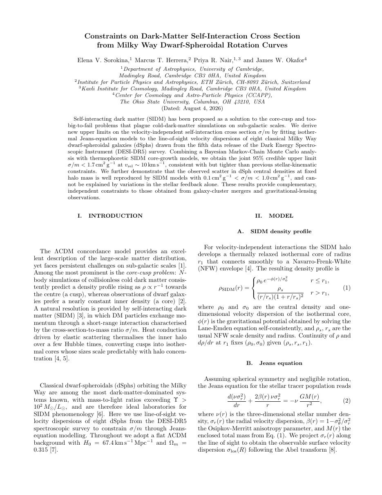</a><br><b>REVTeX 4.2 Physics Paper</b><br><a href="https://letx.app/templates/journal-articles/revtex-aps-paper">Open in LetX</a> · <a href="./journal-articles/revtex-aps-paper">Source</a></td>
</tr>
</table>

### Conference Papers & Abstracts

4 templates. [Browse this category on LetX](https://letx.app/templates/conferences)

<table>
<tr>
<td width="33%" valign="top" align="center"><a href="https://letx.app/templates/conferences/aiaa-conference-paper">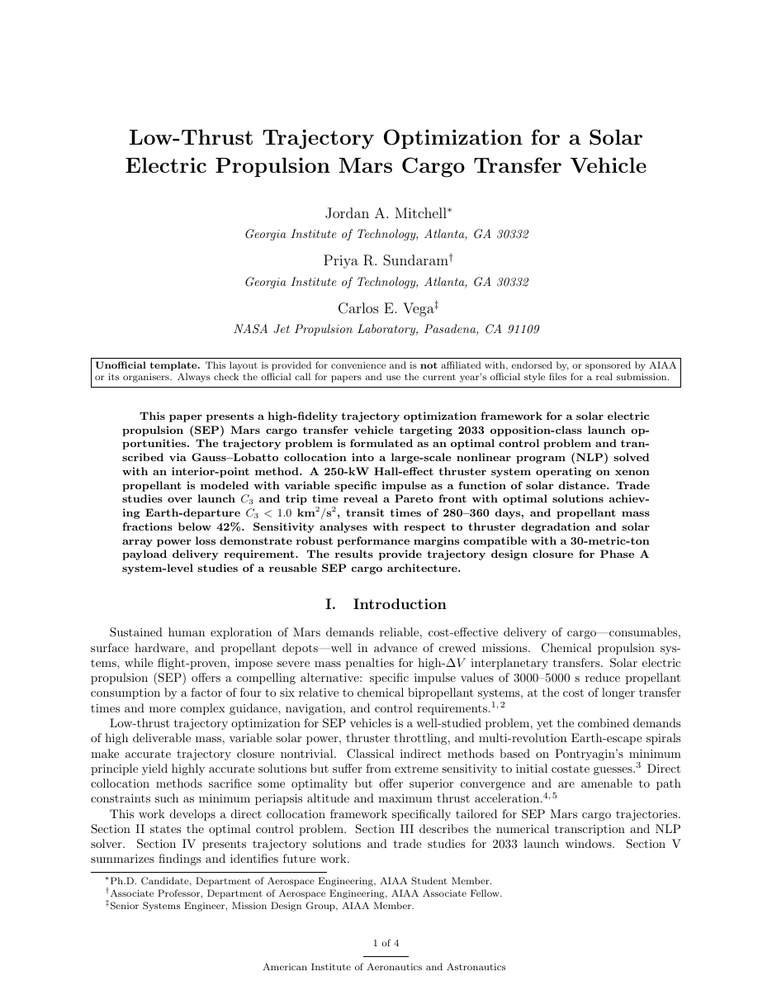</a><br><b>AIAA Conference Paper</b><br><a href="https://letx.app/templates/conferences/aiaa-conference-paper">Open in LetX</a> · <a href="./conferences/aiaa-conference-paper">Source</a></td>
<td width="33%" valign="top" align="center"><a href="https://letx.app/templates/conferences/physics-colloquium-talk">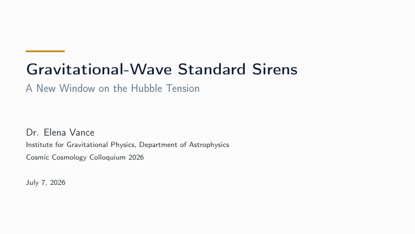</a><br><b>Astrophysics Beamer Talk</b><br><a href="https://letx.app/templates/conferences/physics-colloquium-talk">Open in LetX</a> · <a href="./conferences/physics-colloquium-talk">Source</a></td>
<td width="33%" valign="top" align="center"><a href="https://letx.app/templates/conferences/conference-abstract">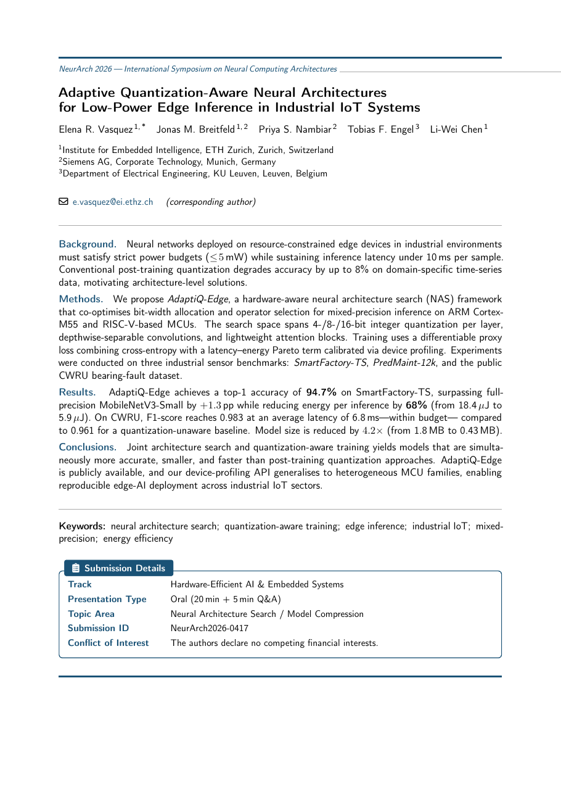</a><br><b>Conference Abstract</b><br><a href="https://letx.app/templates/conferences/conference-abstract">Open in LetX</a> · <a href="./conferences/conference-abstract">Source</a></td>
</tr>
<tr>
<td width="33%" valign="top" align="center"><a href="https://letx.app/templates/conferences/extended-abstract">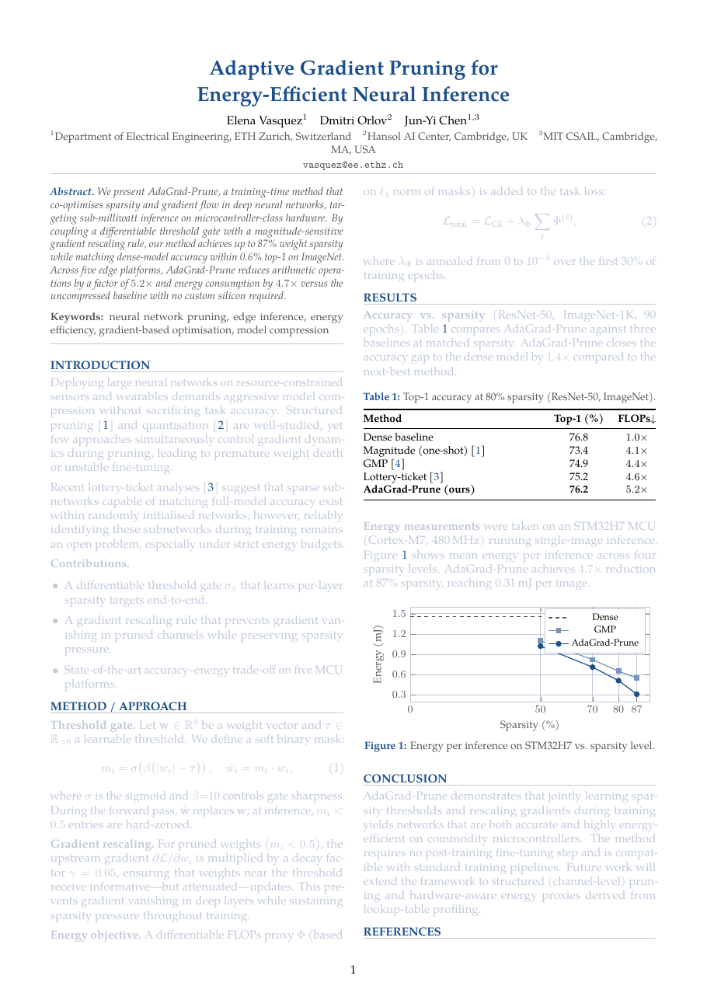</a><br><b>Extended Abstract</b><br><a href="https://letx.app/templates/conferences/extended-abstract">Open in LetX</a> · <a href="./conferences/extended-abstract">Source</a></td>
</tr>
</table>

### CVs & Résumés

39 templates. [Browse this category on LetX](https://letx.app/templates/cvs-resumes)

<table>
<tr>
<td width="33%" valign="top" align="center"><a href="https://letx.app/templates/cvs-resumes/accountant-cpa-resume">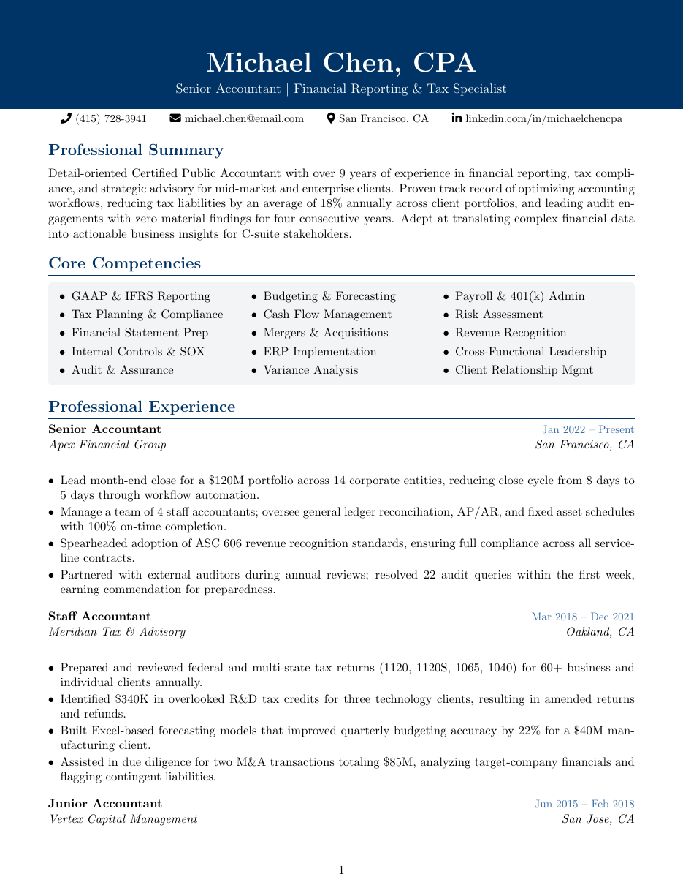</a><br><b>Accountant & CPA Resume</b><br><a href="https://letx.app/templates/cvs-resumes/accountant-cpa-resume">Open in LetX</a> · <a href="./cvs-resumes/accountant-cpa-resume">Source</a></td>
<td width="33%" valign="top" align="center"><a href="https://letx.app/templates/cvs-resumes/actor-performer-resume">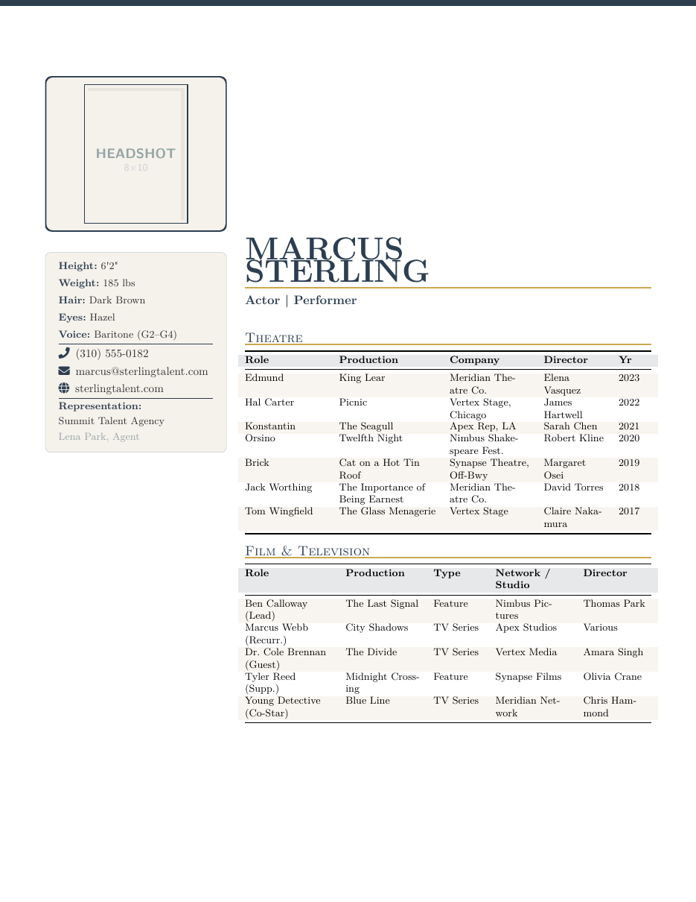</a><br><b>Actor / Performer Resume</b><br><a href="https://letx.app/templates/cvs-resumes/actor-performer-resume">Open in LetX</a> · <a href="./cvs-resumes/actor-performer-resume">Source</a></td>
<td width="33%" valign="top" align="center"><a href="https://letx.app/templates/cvs-resumes/architect-portfolio-resume">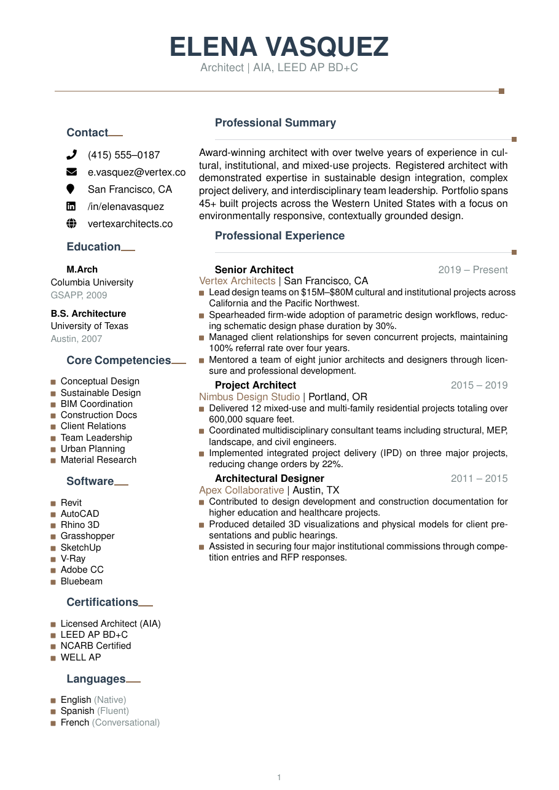</a><br><b>Architect Resume & Portfolio</b><br><a href="https://letx.app/templates/cvs-resumes/architect-portfolio-resume">Open in LetX</a> · <a href="./cvs-resumes/architect-portfolio-resume">Source</a></td>
</tr>
<tr>
<td width="33%" valign="top" align="center"><a href="https://letx.app/templates/cvs-resumes/ats-optimized-resume">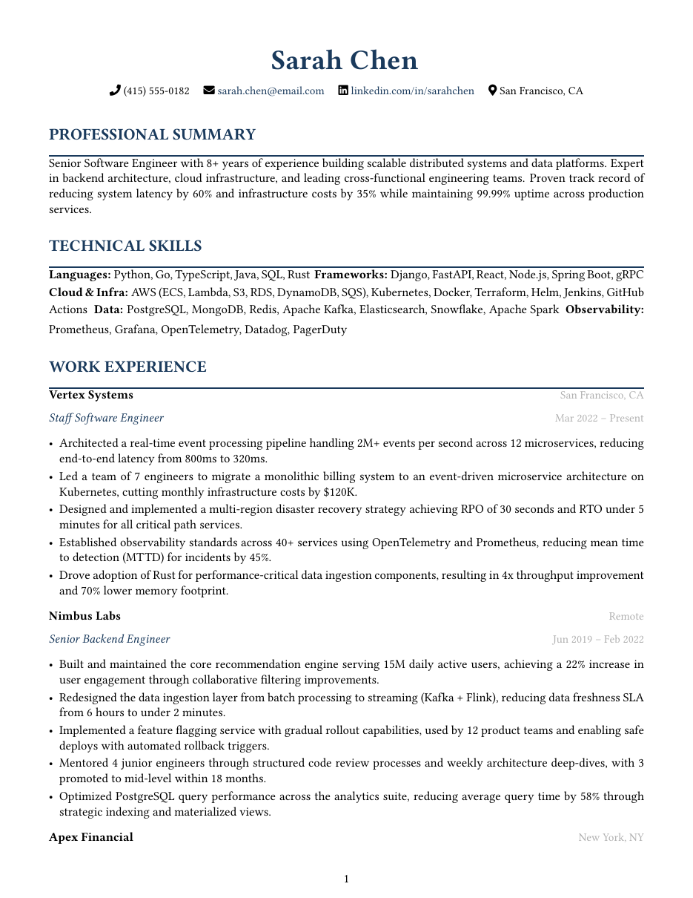</a><br><b>ATS Optimized Resume</b><br><a href="https://letx.app/templates/cvs-resumes/ats-optimized-resume">Open in LetX</a> · <a href="./cvs-resumes/ats-optimized-resume">Source</a></td>
<td width="33%" valign="top" align="center"><a href="https://letx.app/templates/cvs-resumes/attorney-lawyer-resume">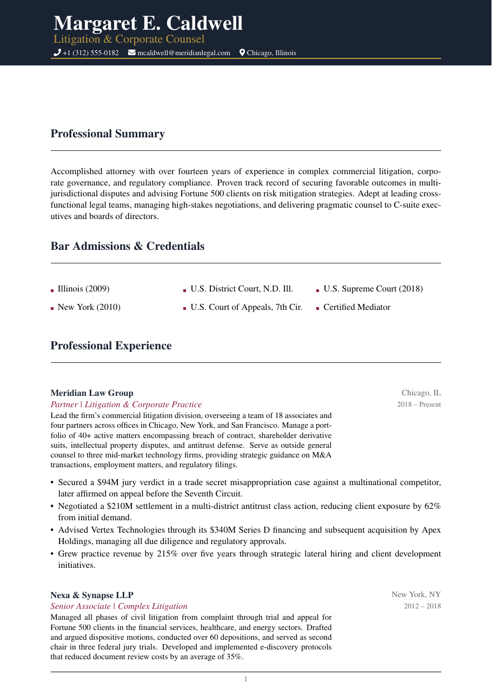</a><br><b>Attorney & Legal Resume</b><br><a href="https://letx.app/templates/cvs-resumes/attorney-lawyer-resume">Open in LetX</a> · <a href="./cvs-resumes/attorney-lawyer-resume">Source</a></td>
<td width="33%" valign="top" align="center"><a href="https://letx.app/templates/cvs-resumes/australian-resume">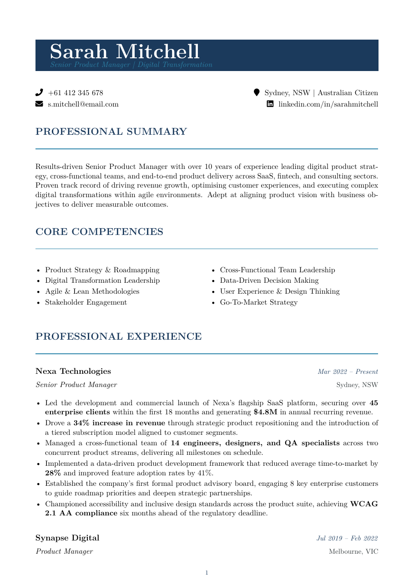</a><br><b>Australian Style Resume</b><br><a href="https://letx.app/templates/cvs-resumes/australian-resume">Open in LetX</a> · <a href="./cvs-resumes/australian-resume">Source</a></td>
</tr>
<tr>
<td width="33%" valign="top" align="center"><a href="https://letx.app/templates/cvs-resumes/backend-developer-resume">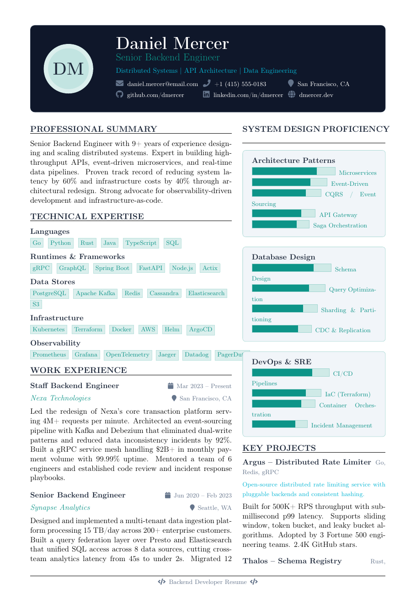</a><br><b>Backend Developer Resume</b><br><a href="https://letx.app/templates/cvs-resumes/backend-developer-resume">Open in LetX</a> · <a href="./cvs-resumes/backend-developer-resume">Source</a></td>
<td width="33%" valign="top" align="center"><a href="https://letx.app/templates/cvs-resumes/canadian-resume">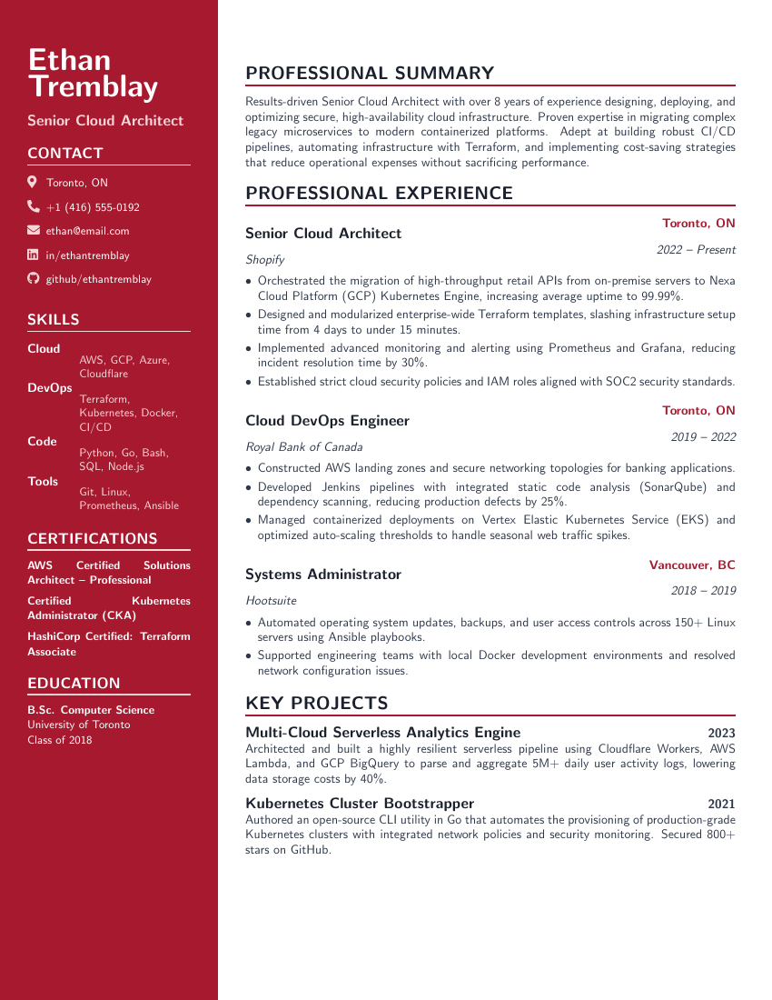</a><br><b>Canadian Resume</b><br><a href="https://letx.app/templates/cvs-resumes/canadian-resume">Open in LetX</a> · <a href="./cvs-resumes/canadian-resume">Source</a></td>
<td width="33%" valign="top" align="center"><a href="https://letx.app/templates/cvs-resumes/civil-engineer-resume">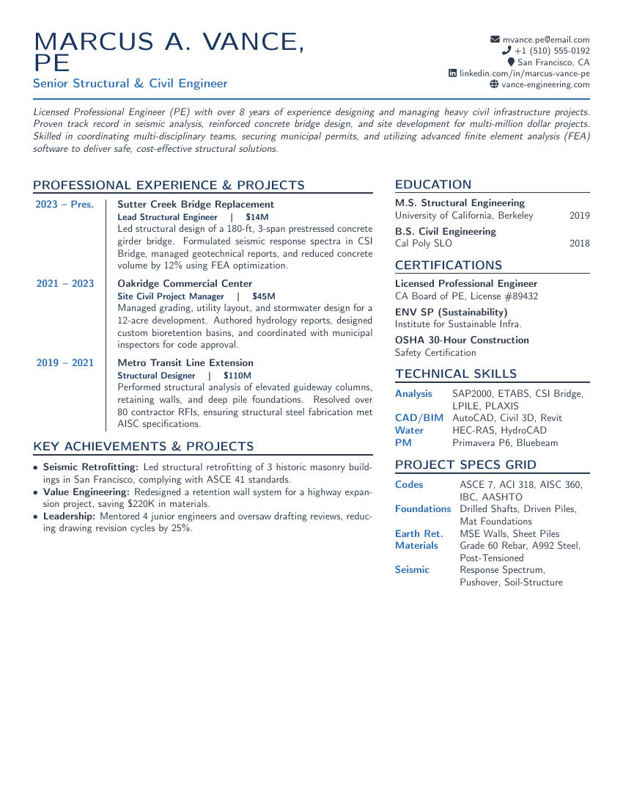</a><br><b>Civil Engineer Resume</b><br><a href="https://letx.app/templates/cvs-resumes/civil-engineer-resume">Open in LetX</a> · <a href="./cvs-resumes/civil-engineer-resume">Source</a></td>
</tr>
<tr>
<td width="33%" valign="top" align="center"><a href="https://letx.app/templates/cvs-resumes/college-student-resume">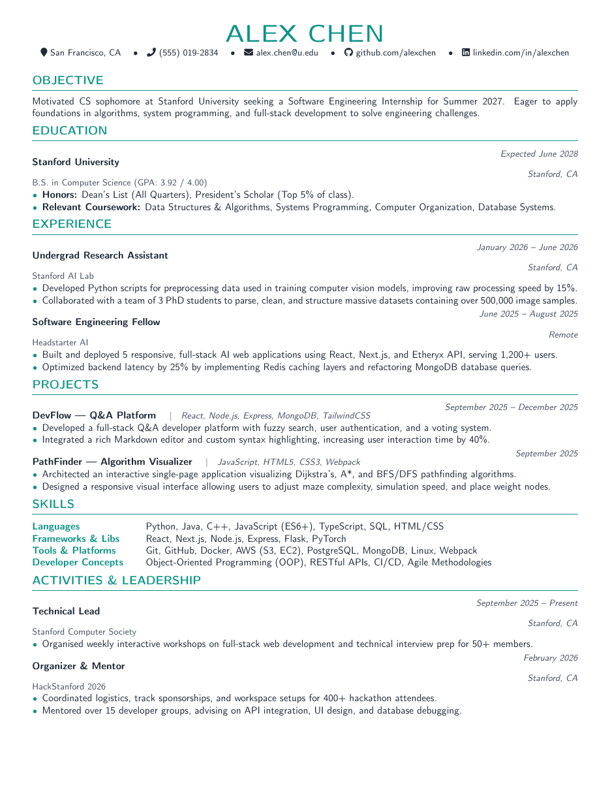</a><br><b>College Student Resume</b><br><a href="https://letx.app/templates/cvs-resumes/college-student-resume">Open in LetX</a> · <a href="./cvs-resumes/college-student-resume">Source</a></td>
<td width="33%" valign="top" align="center"><a href="https://letx.app/templates/cvs-resumes/creative-designer-resume">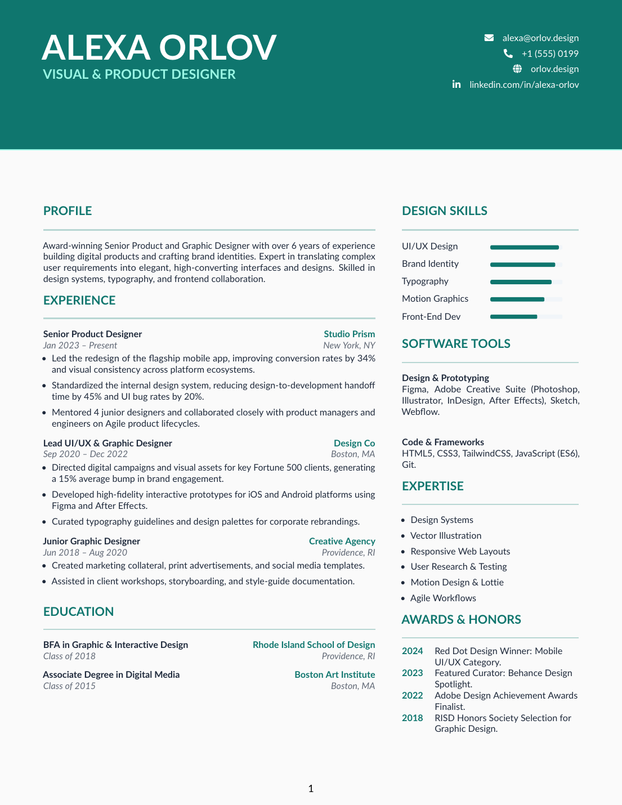</a><br><b>Creative Designer Resume</b><br><a href="https://letx.app/templates/cvs-resumes/creative-designer-resume">Open in LetX</a> · <a href="./cvs-resumes/creative-designer-resume">Source</a></td>
<td width="33%" valign="top" align="center"><a href="https://letx.app/templates/cvs-resumes/cybersecurity-analyst-resume">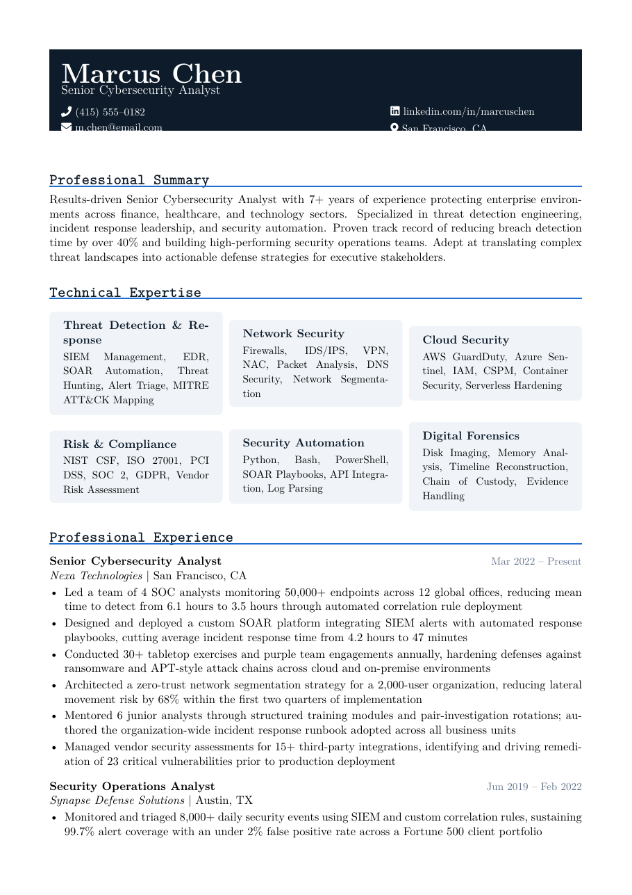</a><br><b>Cybersecurity Analyst CV</b><br><a href="https://letx.app/templates/cvs-resumes/cybersecurity-analyst-resume">Open in LetX</a> · <a href="./cvs-resumes/cybersecurity-analyst-resume">Source</a></td>
</tr>
<tr>
<td width="33%" valign="top" align="center"><a href="https://letx.app/templates/cvs-resumes/data-analyst-resume">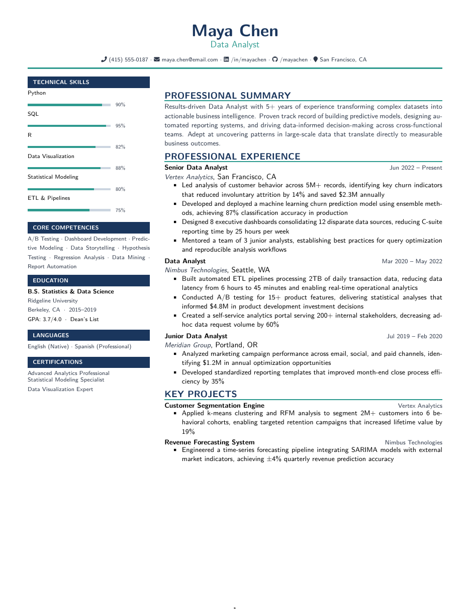</a><br><b>Data Analyst Resume</b><br><a href="https://letx.app/templates/cvs-resumes/data-analyst-resume">Open in LetX</a> · <a href="./cvs-resumes/data-analyst-resume">Source</a></td>
<td width="33%" valign="top" align="center"><a href="https://letx.app/templates/cvs-resumes/devops-engineer-resume">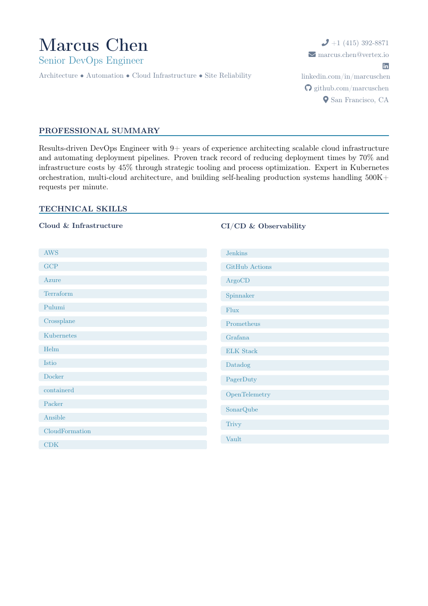</a><br><b>DevOps Engineer Resume</b><br><a href="https://letx.app/templates/cvs-resumes/devops-engineer-resume">Open in LetX</a> · <a href="./cvs-resumes/devops-engineer-resume">Source</a></td>
<td width="33%" valign="top" align="center"><a href="https://letx.app/templates/cvs-resumes/electrical-engineer-resume">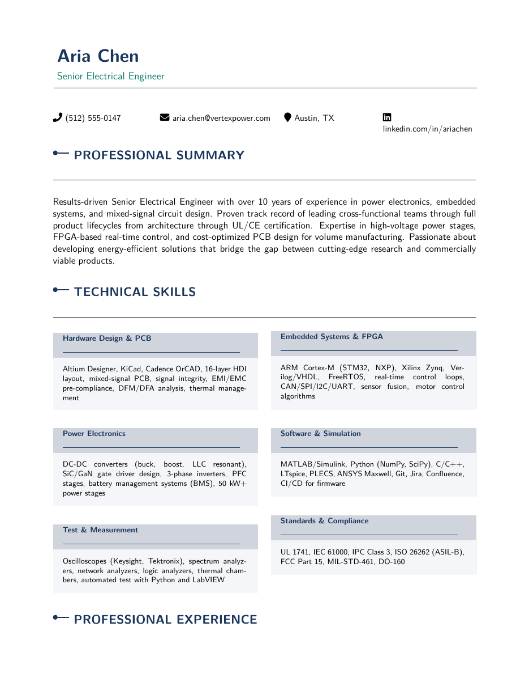</a><br><b>Electrical Engineer CV</b><br><a href="https://letx.app/templates/cvs-resumes/electrical-engineer-resume">Open in LetX</a> · <a href="./cvs-resumes/electrical-engineer-resume">Source</a></td>
</tr>
<tr>
<td width="33%" valign="top" align="center"><a href="https://letx.app/templates/cvs-resumes/europass-cv">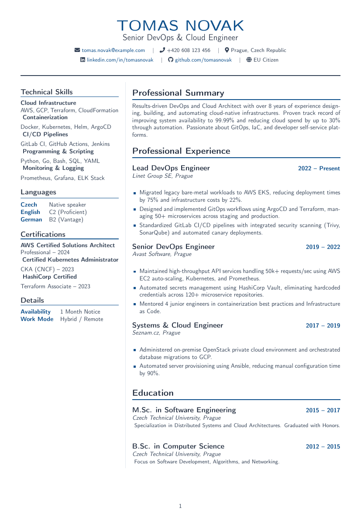</a><br><b>Europass CV Template</b><br><a href="https://letx.app/templates/cvs-resumes/europass-cv">Open in LetX</a> · <a href="./cvs-resumes/europass-cv">Source</a></td>
<td width="33%" valign="top" align="center"><a href="https://letx.app/templates/cvs-resumes/executive-director-cv">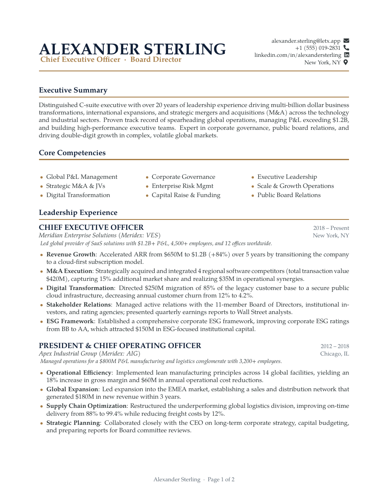</a><br><b>Executive Director CV</b><br><a href="https://letx.app/templates/cvs-resumes/executive-director-cv">Open in LetX</a> · <a href="./cvs-resumes/executive-director-cv">Source</a></td>
<td width="33%" valign="top" align="center"><a href="https://letx.app/templates/cvs-resumes/federal-government-resume">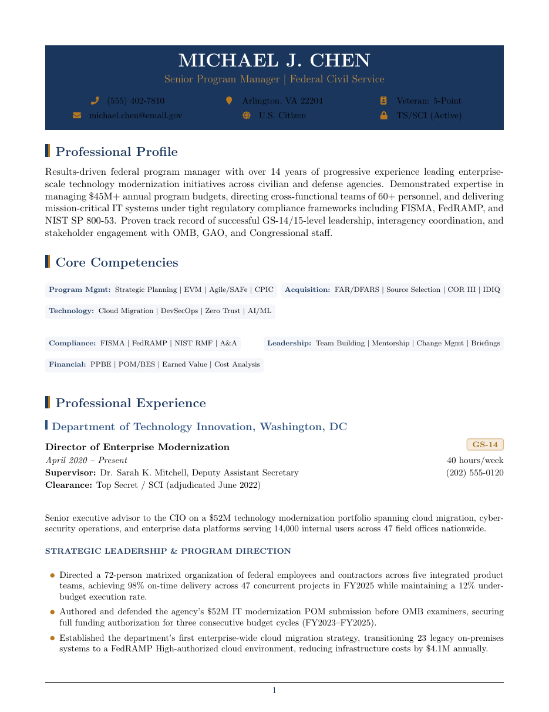</a><br><b>Federal Government Resume</b><br><a href="https://letx.app/templates/cvs-resumes/federal-government-resume">Open in LetX</a> · <a href="./cvs-resumes/federal-government-resume">Source</a></td>
</tr>
<tr>
<td width="33%" valign="top" align="center"><a href="https://letx.app/templates/cvs-resumes/accounts-finance-resume">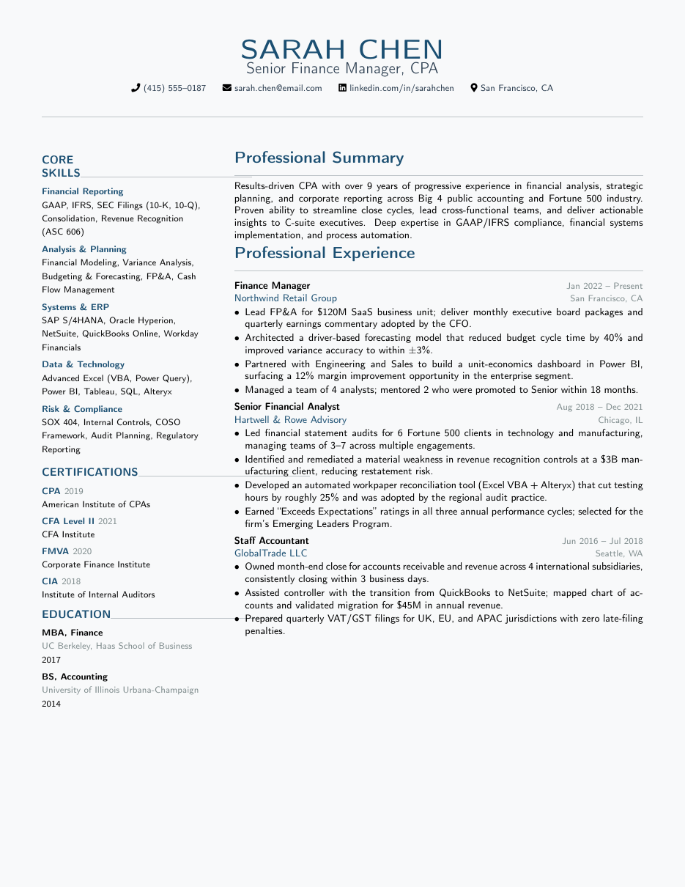</a><br><b>Finance Accounting Resume</b><br><a href="https://letx.app/templates/cvs-resumes/accounts-finance-resume">Open in LetX</a> · <a href="./cvs-resumes/accounts-finance-resume">Source</a></td>
<td width="33%" valign="top" align="center"><a href="https://letx.app/templates/cvs-resumes/frontend-developer-resume">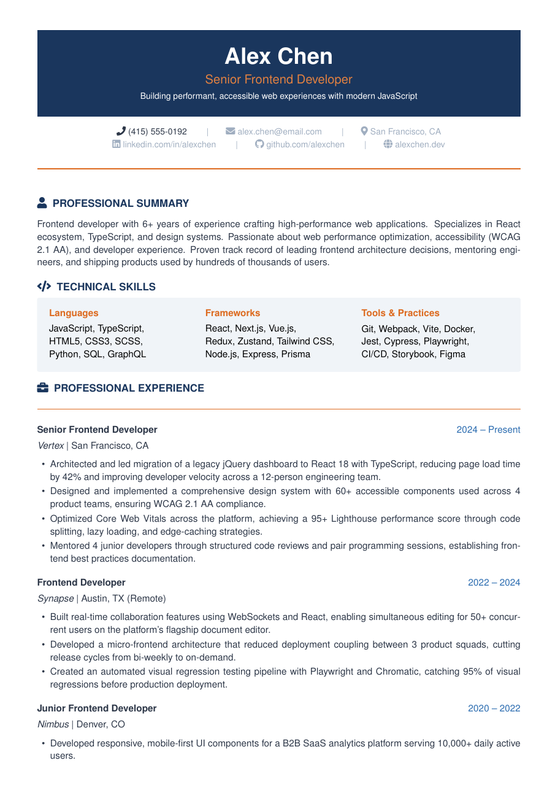</a><br><b>Frontend Developer Resume</b><br><a href="https://letx.app/templates/cvs-resumes/frontend-developer-resume">Open in LetX</a> · <a href="./cvs-resumes/frontend-developer-resume">Source</a></td>
<td width="33%" valign="top" align="center"><a href="https://letx.app/templates/cvs-resumes/german-lebenslauf">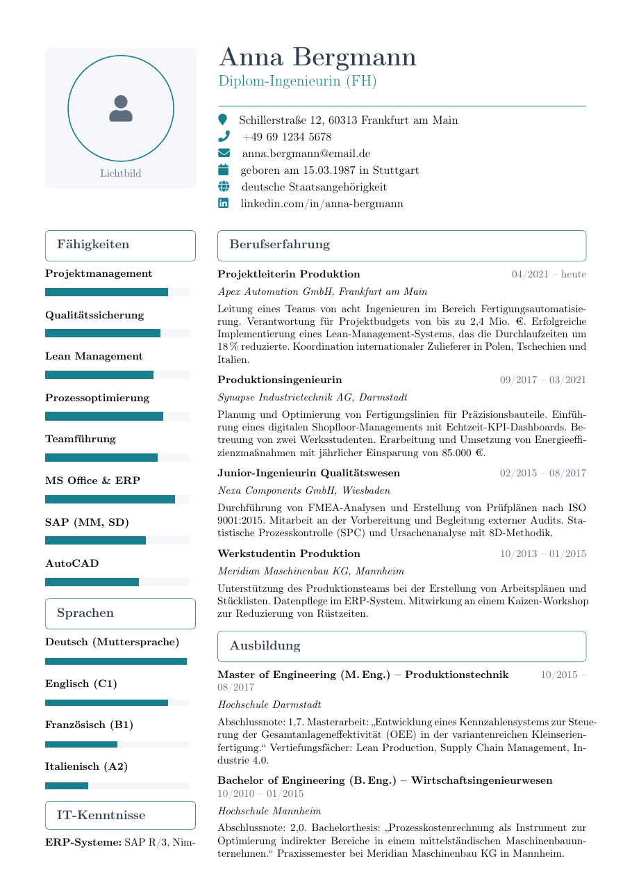</a><br><b>German Lebenslauf CV</b><br><a href="https://letx.app/templates/cvs-resumes/german-lebenslauf">Open in LetX</a> · <a href="./cvs-resumes/german-lebenslauf">Source</a></td>
</tr>
<tr>
<td width="33%" valign="top" align="center"><a href="https://letx.app/templates/cvs-resumes/graphic-designer-resume">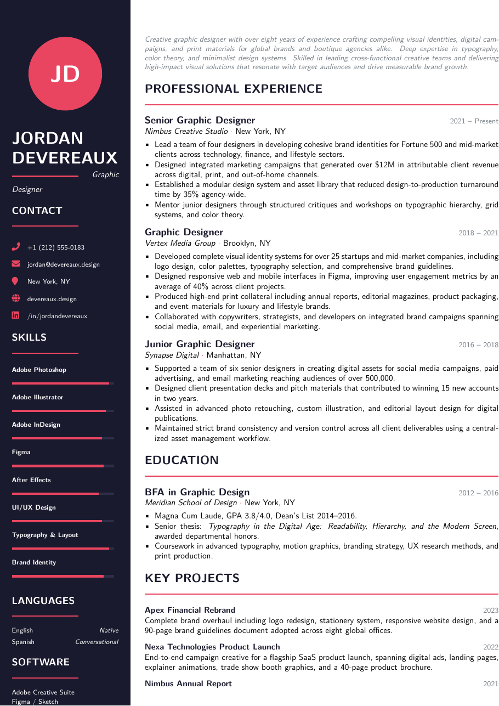</a><br><b>Graphic Designer Resume</b><br><a href="https://letx.app/templates/cvs-resumes/graphic-designer-resume">Open in LetX</a> · <a href="./cvs-resumes/graphic-designer-resume">Source</a></td>
<td width="33%" valign="top" align="center"><a href="https://letx.app/templates/cvs-resumes/healthcare-assistant-resume">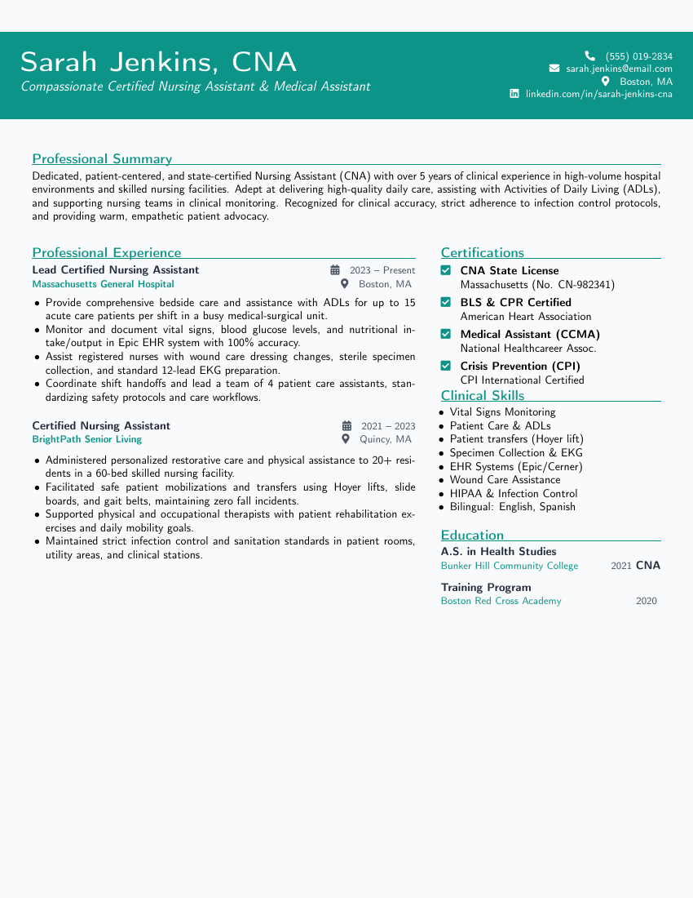</a><br><b>Healthcare Assistant Resume</b><br><a href="https://letx.app/templates/cvs-resumes/healthcare-assistant-resume">Open in LetX</a> · <a href="./cvs-resumes/healthcare-assistant-resume">Source</a></td>
<td width="33%" valign="top" align="center"><a href="https://letx.app/templates/cvs-resumes/investment-banker-resume">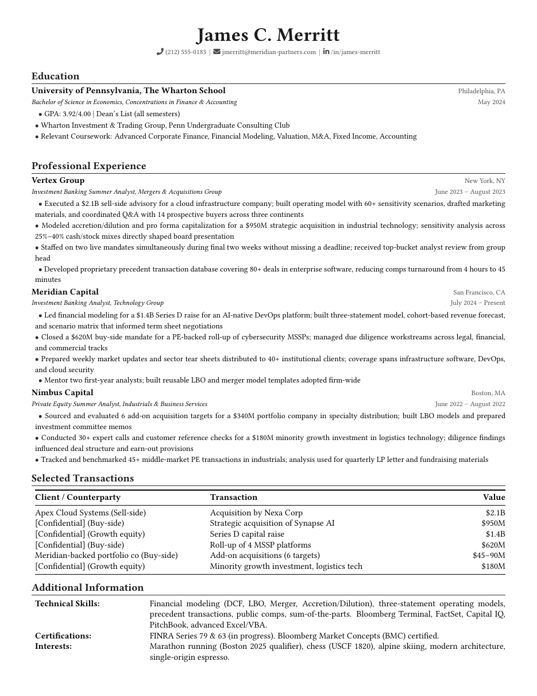</a><br><b>Investment Banking Resume</b><br><a href="https://letx.app/templates/cvs-resumes/investment-banker-resume">Open in LetX</a> · <a href="./cvs-resumes/investment-banker-resume">Source</a></td>
</tr>
<tr>
<td width="33%" valign="top" align="center"><a href="https://letx.app/templates/cvs-resumes/consultant-resume">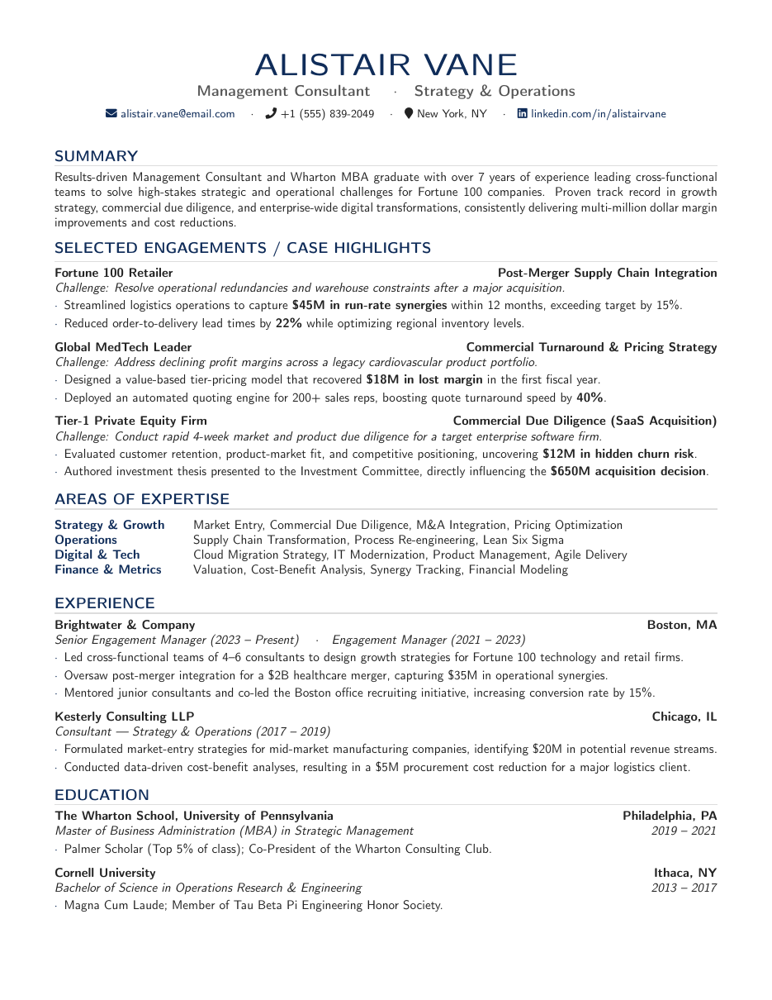</a><br><b>Management Consultant Resume</b><br><a href="https://letx.app/templates/cvs-resumes/consultant-resume">Open in LetX</a> · <a href="./cvs-resumes/consultant-resume">Source</a></td>
<td width="33%" valign="top" align="center"><a href="https://letx.app/templates/cvs-resumes/marketing-specialist-resume">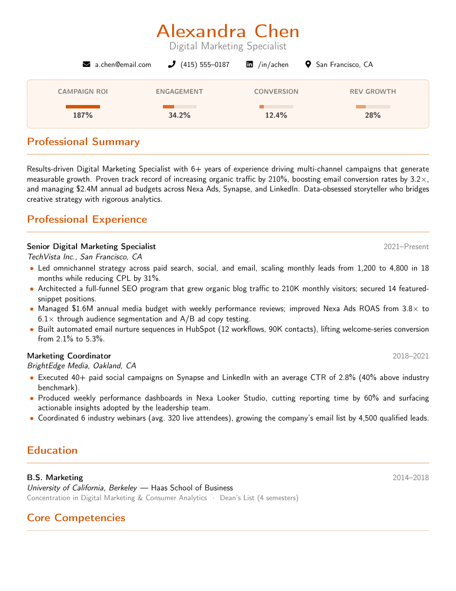</a><br><b>Marketing Specialist Resume</b><br><a href="https://letx.app/templates/cvs-resumes/marketing-specialist-resume">Open in LetX</a> · <a href="./cvs-resumes/marketing-specialist-resume">Source</a></td>
<td width="33%" valign="top" align="center"><a href="https://letx.app/templates/cvs-resumes/mechanical-engineer-resume">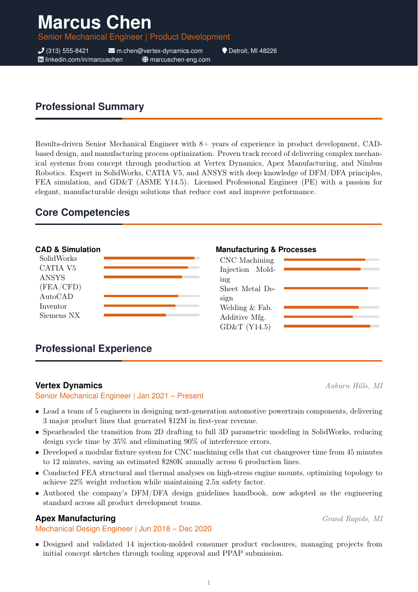</a><br><b>Mechanical Engineer CV</b><br><a href="https://letx.app/templates/cvs-resumes/mechanical-engineer-resume">Open in LetX</a> · <a href="./cvs-resumes/mechanical-engineer-resume">Source</a></td>
</tr>
<tr>
<td width="33%" valign="top" align="center"><a href="https://letx.app/templates/cvs-resumes/medical-doctor-cv">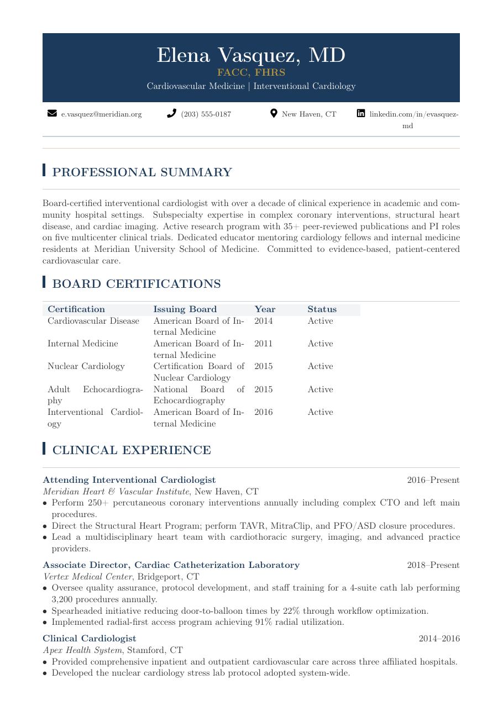</a><br><b>Medical Doctor CV</b><br><a href="https://letx.app/templates/cvs-resumes/medical-doctor-cv">Open in LetX</a> · <a href="./cvs-resumes/medical-doctor-cv">Source</a></td>
<td width="33%" valign="top" align="center"><a href="https://letx.app/templates/cvs-resumes/modern-minimalist-resume">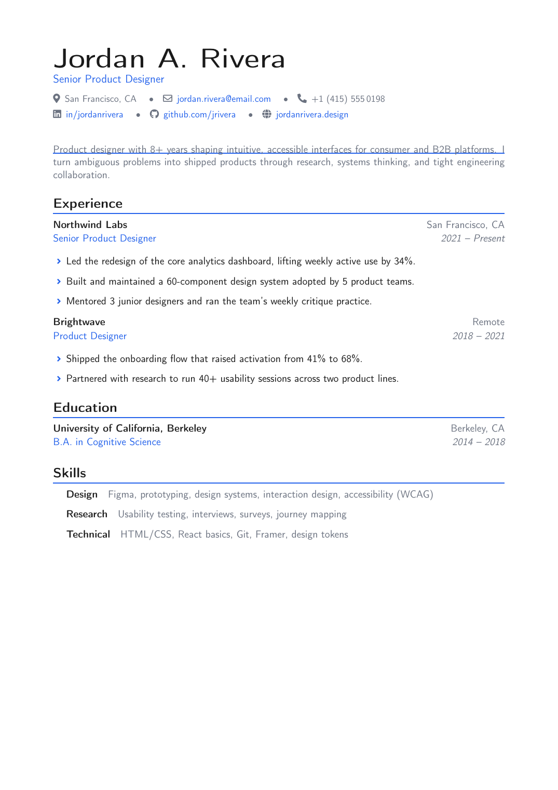</a><br><b>Modern Minimalist Resume</b><br><a href="https://letx.app/templates/cvs-resumes/modern-minimalist-resume">Open in LetX</a> · <a href="./cvs-resumes/modern-minimalist-resume">Source</a></td>
<td width="33%" valign="top" align="center"><a href="https://letx.app/templates/cvs-resumes/nurse-medical-resume">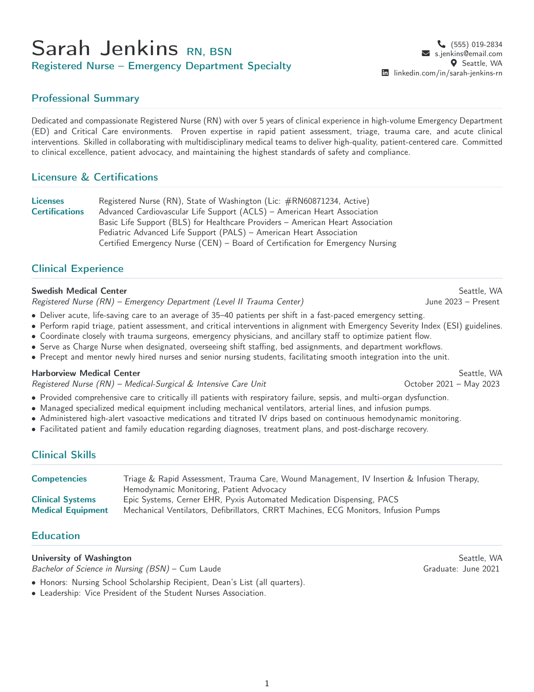</a><br><b>Nurse / Medical Resume</b><br><a href="https://letx.app/templates/cvs-resumes/nurse-medical-resume">Open in LetX</a> · <a href="./cvs-resumes/nurse-medical-resume">Source</a></td>
</tr>
<tr>
<td width="33%" valign="top" align="center"><a href="https://letx.app/templates/cvs-resumes/pharmacist-resume">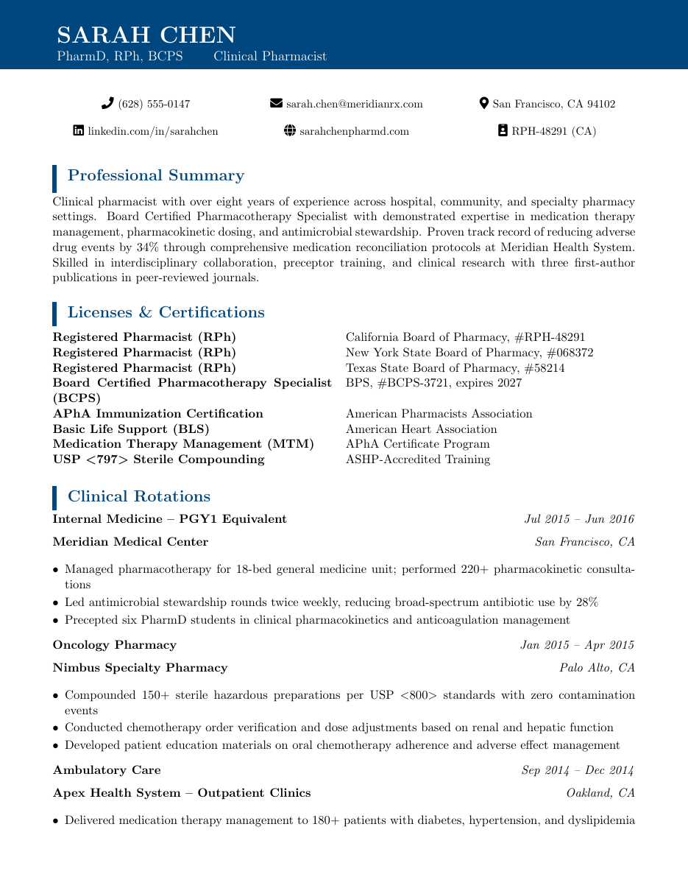</a><br><b>Pharmacist Resume</b><br><a href="https://letx.app/templates/cvs-resumes/pharmacist-resume">Open in LetX</a> · <a href="./cvs-resumes/pharmacist-resume">Source</a></td>
<td width="33%" valign="top" align="center"><a href="https://letx.app/templates/cvs-resumes/pilot-aviation-resume">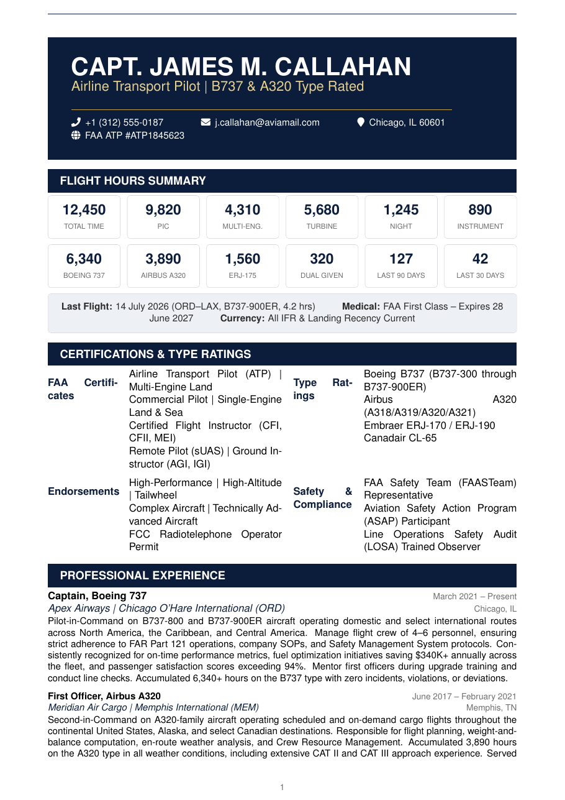</a><br><b>Pilot / Aviation Resume</b><br><a href="https://letx.app/templates/cvs-resumes/pilot-aviation-resume">Open in LetX</a> · <a href="./cvs-resumes/pilot-aviation-resume">Source</a></td>
<td width="33%" valign="top" align="center"><a href="https://letx.app/templates/cvs-resumes/postdoc-academic-cv">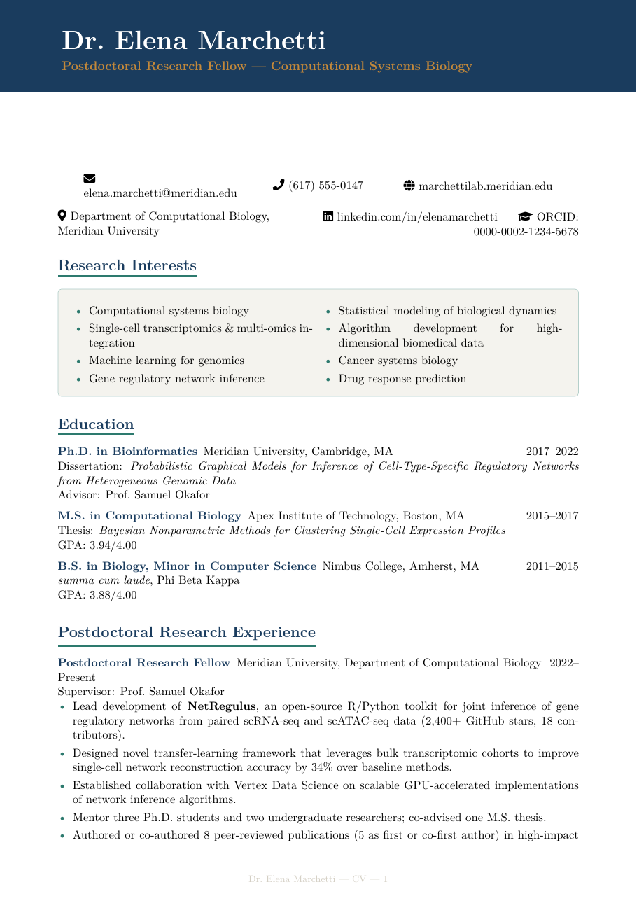</a><br><b>Postdoctoral Researcher CV</b><br><a href="https://letx.app/templates/cvs-resumes/postdoc-academic-cv">Open in LetX</a> · <a href="./cvs-resumes/postdoc-academic-cv">Source</a></td>
</tr>
<tr>
<td width="33%" valign="top" align="center"><a href="https://letx.app/templates/cvs-resumes/product-manager-resume">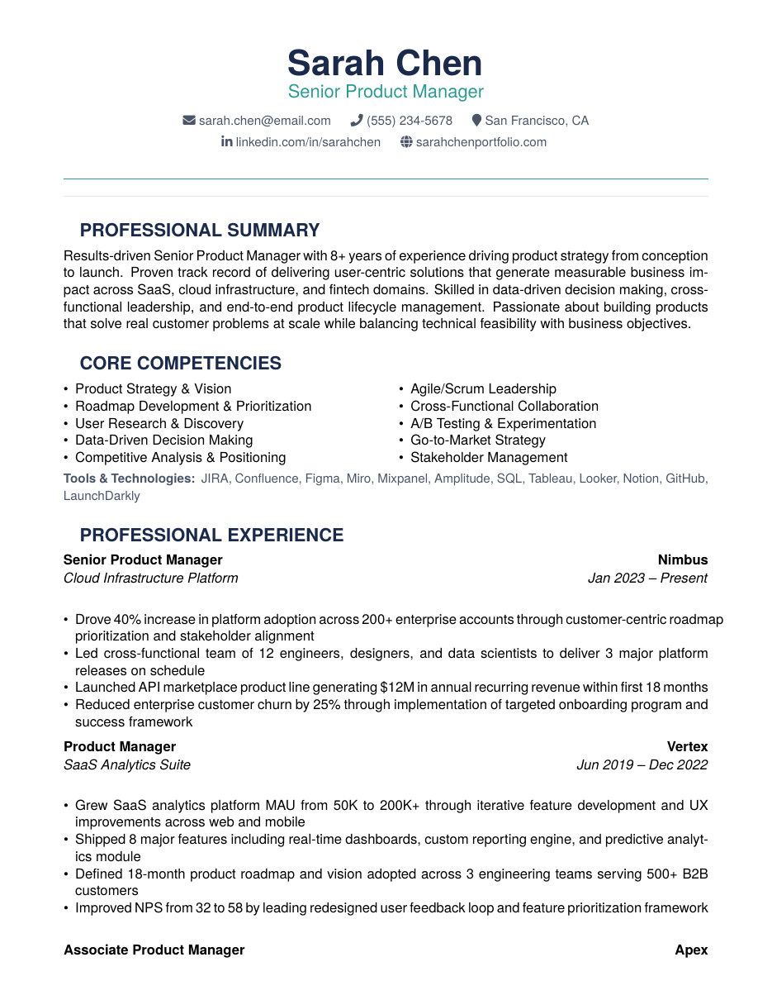</a><br><b>Product Manager Resume</b><br><a href="https://letx.app/templates/cvs-resumes/product-manager-resume">Open in LetX</a> · <a href="./cvs-resumes/product-manager-resume">Source</a></td>
<td width="33%" valign="top" align="center"><a href="https://letx.app/templates/cvs-resumes/project-manager-resume">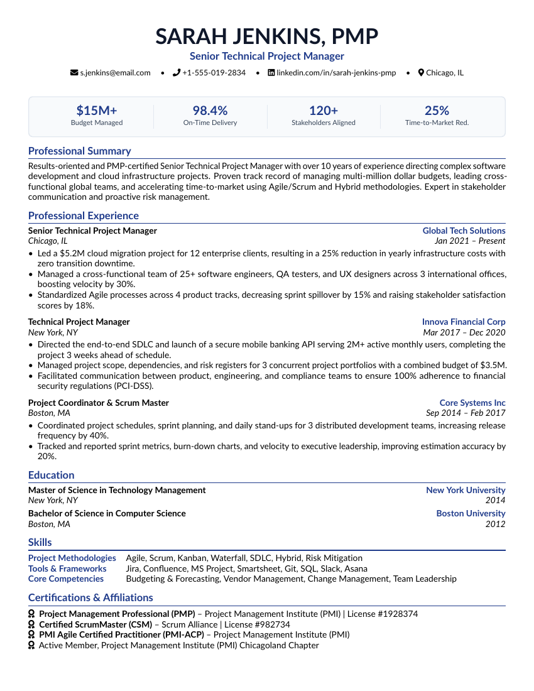</a><br><b>Project Manager Resume</b><br><a href="https://letx.app/templates/cvs-resumes/project-manager-resume">Open in LetX</a> · <a href="./cvs-resumes/project-manager-resume">Source</a></td>
<td width="33%" valign="top" align="center"><a href="https://letx.app/templates/cvs-resumes/teacher-educator-resume">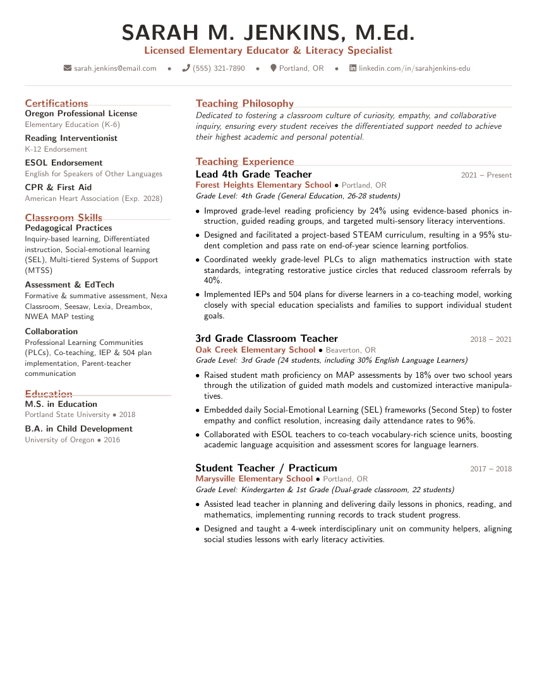</a><br><b>Teacher / Educator Resume</b><br><a href="https://letx.app/templates/cvs-resumes/teacher-educator-resume">Open in LetX</a> · <a href="./cvs-resumes/teacher-educator-resume">Source</a></td>
</tr>
<tr>
<td width="33%" valign="top" align="center"><a href="https://letx.app/templates/cvs-resumes/two-column-resume">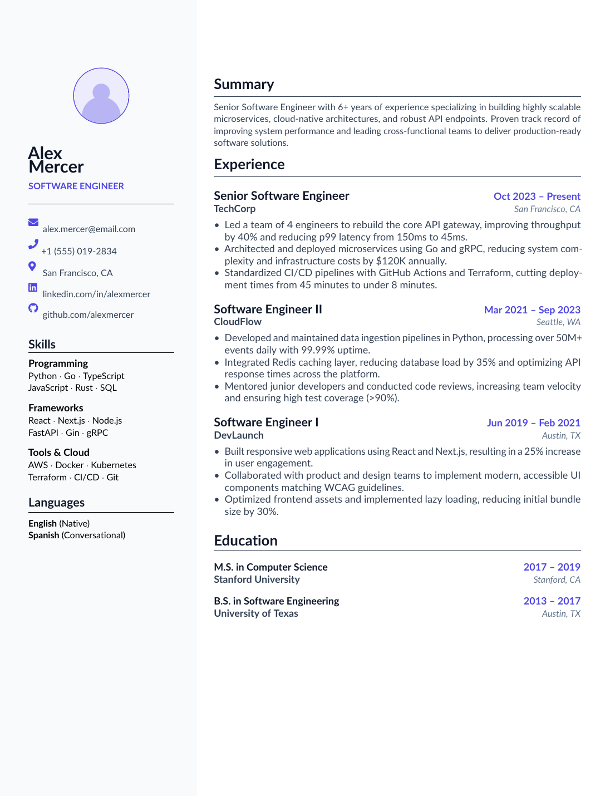</a><br><b>Two-Column Resume</b><br><a href="https://letx.app/templates/cvs-resumes/two-column-resume">Open in LetX</a> · <a href="./cvs-resumes/two-column-resume">Source</a></td>
<td width="33%" valign="top" align="center"><a href="https://letx.app/templates/cvs-resumes/uk-standard-cv">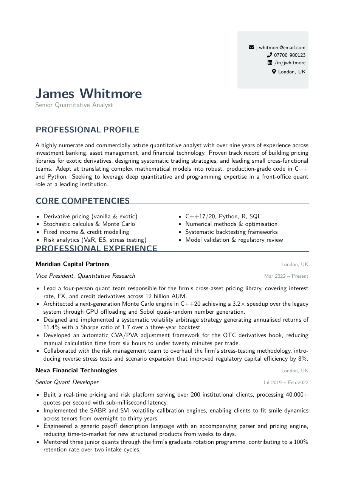</a><br><b>UK Standard CV</b><br><a href="https://letx.app/templates/cvs-resumes/uk-standard-cv">Open in LetX</a> · <a href="./cvs-resumes/uk-standard-cv">Source</a></td>
<td width="33%" valign="top" align="center"><a href="https://letx.app/templates/cvs-resumes/ux-designer-resume">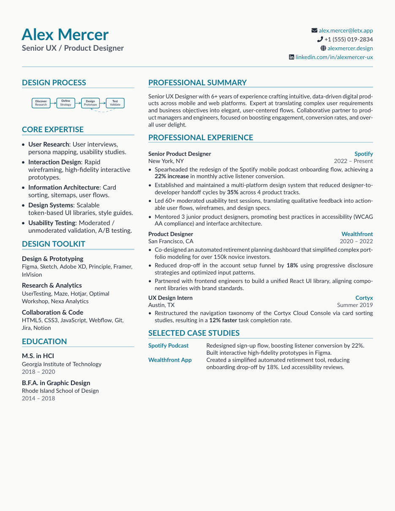</a><br><b>UX Designer Resume</b><br><a href="https://letx.app/templates/cvs-resumes/ux-designer-resume">Open in LetX</a> · <a href="./cvs-resumes/ux-designer-resume">Source</a></td>
</tr>
</table>

### Academic Career (Statements, Applications)

11 templates. [Browse this category on LetX](https://letx.app/templates/academic-career)

<table>
<tr>
<td width="33%" valign="top" align="center"><a href="https://letx.app/templates/academic-career/conference-travel-grant">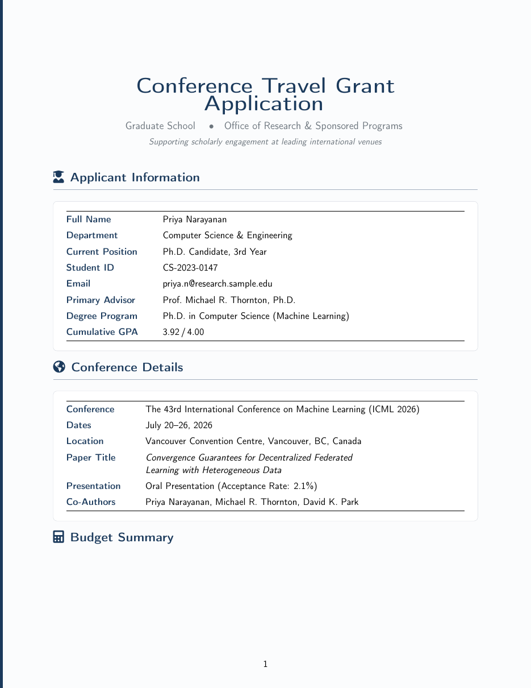</a><br><b>Conference Travel Grant</b><br><a href="https://letx.app/templates/academic-career/conference-travel-grant">Open in LetX</a> · <a href="./academic-career/conference-travel-grant">Source</a></td>
<td width="33%" valign="top" align="center"><a href="https://letx.app/templates/academic-career/diversity-statement">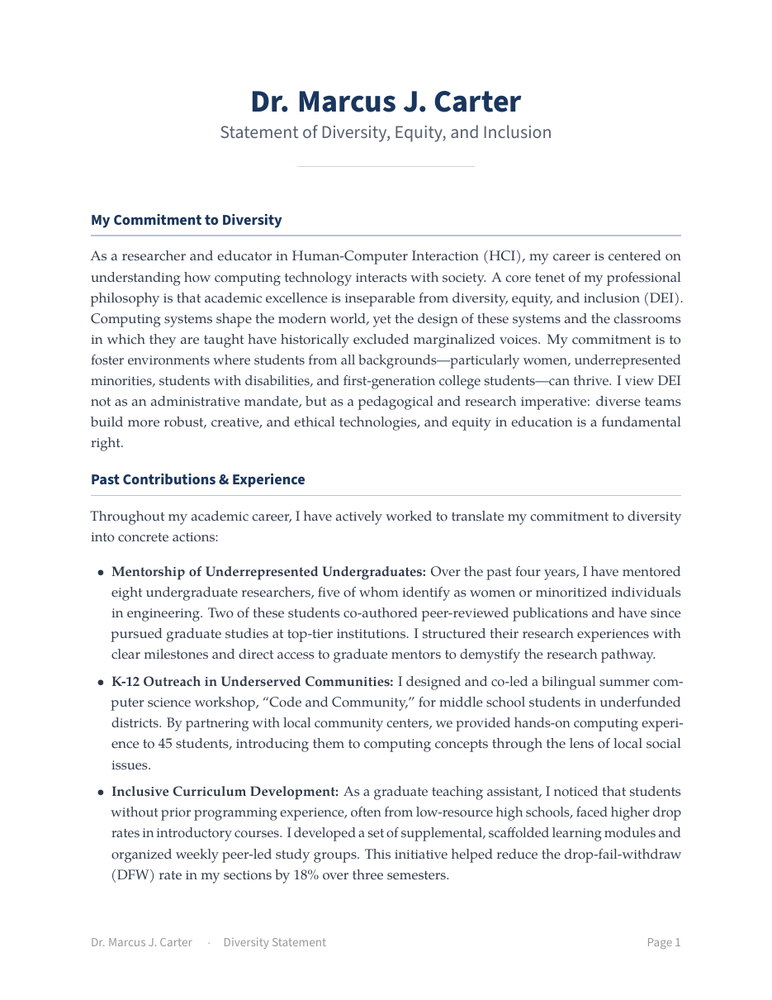</a><br><b>Diversity Statement</b><br><a href="https://letx.app/templates/academic-career/diversity-statement">Open in LetX</a> · <a href="./academic-career/diversity-statement">Source</a></td>
<td width="33%" valign="top" align="center"><a href="https://letx.app/templates/academic-career/phd-progress-report">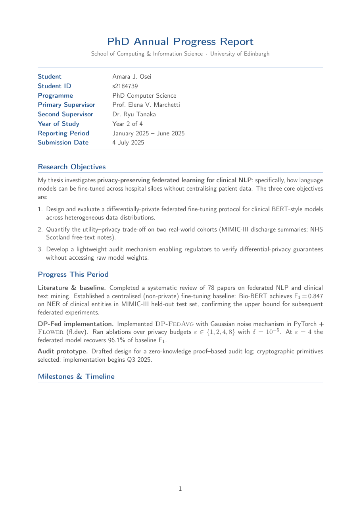</a><br><b>PhD Progress Report</b><br><a href="https://letx.app/templates/academic-career/phd-progress-report">Open in LetX</a> · <a href="./academic-career/phd-progress-report">Source</a></td>
</tr>
<tr>
<td width="33%" valign="top" align="center"><a href="https://letx.app/templates/academic-career/postdoc-application">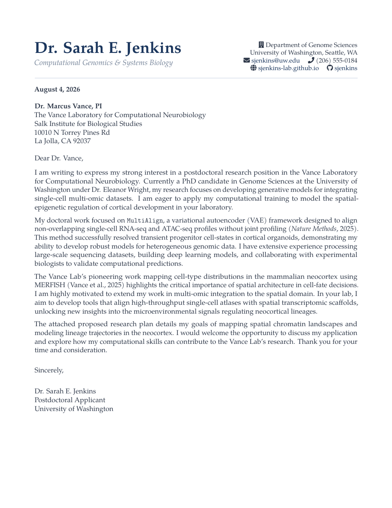</a><br><b>Postdoc Application</b><br><a href="https://letx.app/templates/academic-career/postdoc-application">Open in LetX</a> · <a href="./academic-career/postdoc-application">Source</a></td>
<td width="33%" valign="top" align="center"><a href="https://letx.app/templates/academic-career/research-proposal-template">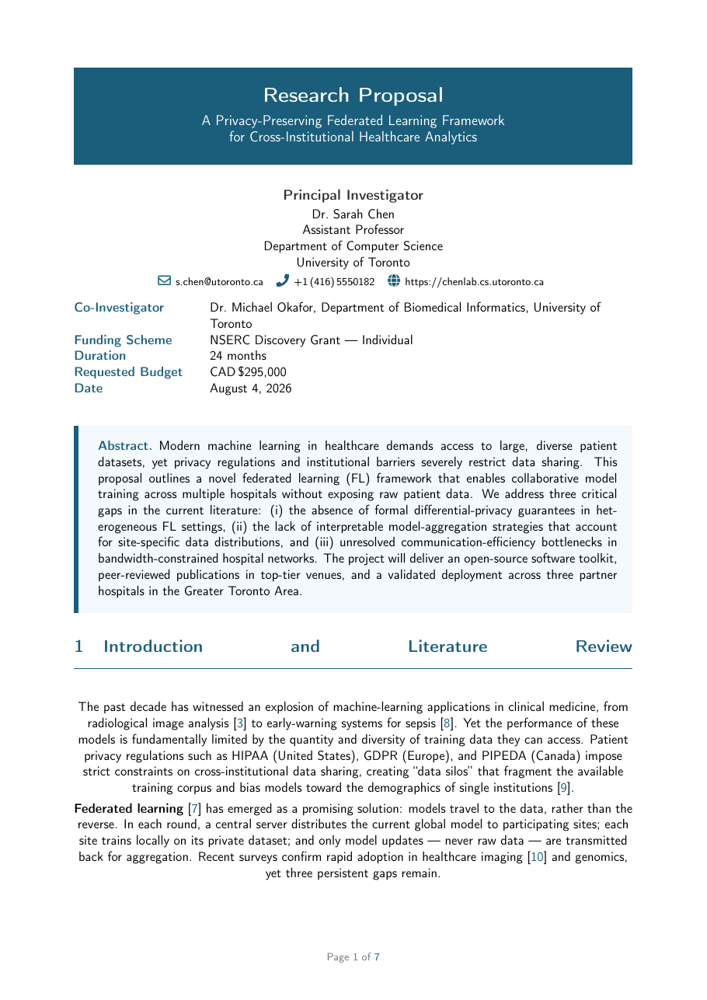</a><br><b>Research Proposal Template</b><br><a href="https://letx.app/templates/academic-career/research-proposal-template">Open in LetX</a> · <a href="./academic-career/research-proposal-template">Source</a></td>
<td width="33%" valign="top" align="center"><a href="https://letx.app/templates/academic-career/research-statement">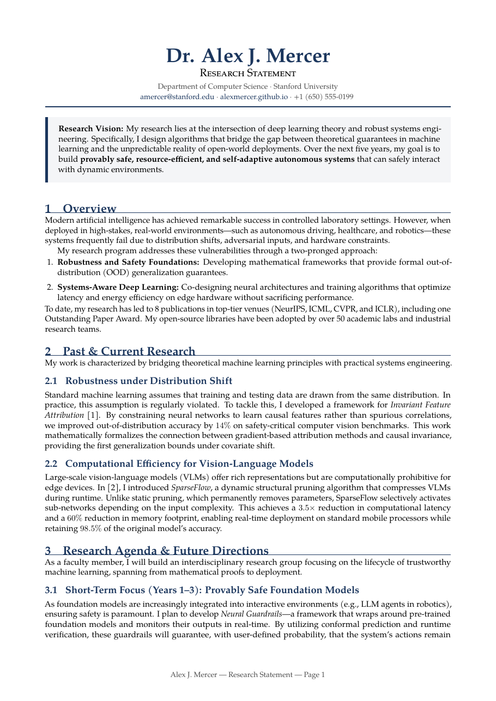</a><br><b>Research Statement</b><br><a href="https://letx.app/templates/academic-career/research-statement">Open in LetX</a> · <a href="./academic-career/research-statement">Source</a></td>
</tr>
<tr>
<td width="33%" valign="top" align="center"><a href="https://letx.app/templates/academic-career/scholarship-application">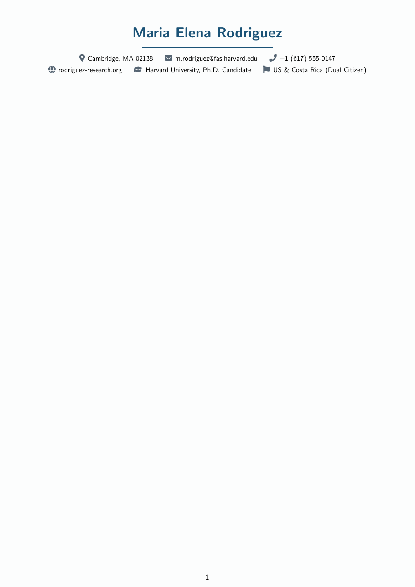</a><br><b>Scholarship Application</b><br><a href="https://letx.app/templates/academic-career/scholarship-application">Open in LetX</a> · <a href="./academic-career/scholarship-application">Source</a></td>
<td width="33%" valign="top" align="center"><a href="https://letx.app/templates/academic-career/statement-of-purpose">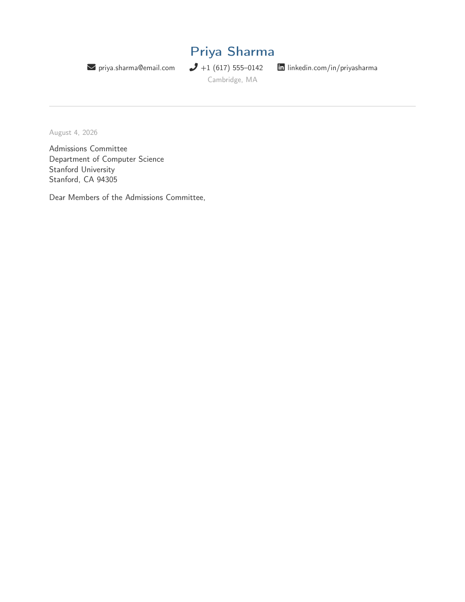</a><br><b>Statement of Purpose</b><br><a href="https://letx.app/templates/academic-career/statement-of-purpose">Open in LetX</a> · <a href="./academic-career/statement-of-purpose">Source</a></td>
<td width="33%" valign="top" align="center"><a href="https://letx.app/templates/academic-career/summer-internship-report">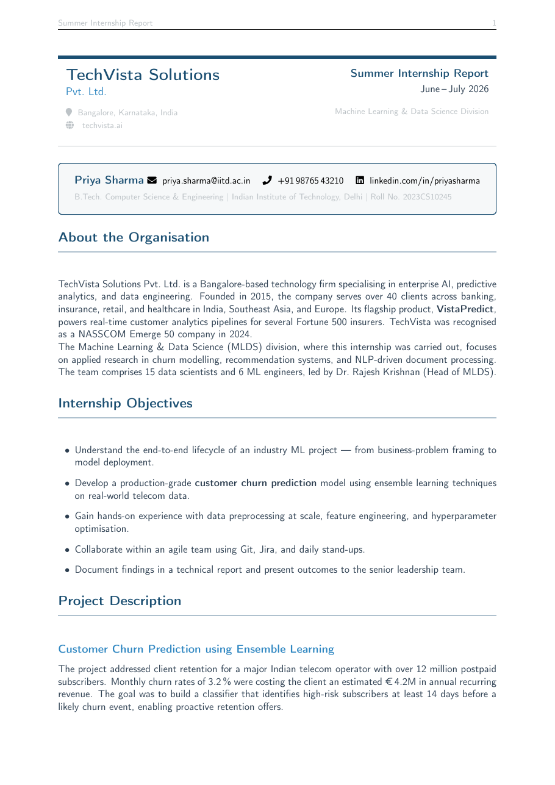</a><br><b>Summer Internship Report</b><br><a href="https://letx.app/templates/academic-career/summer-internship-report">Open in LetX</a> · <a href="./academic-career/summer-internship-report">Source</a></td>
</tr>
<tr>
<td width="33%" valign="top" align="center"><a href="https://letx.app/templates/academic-career/teaching-statement">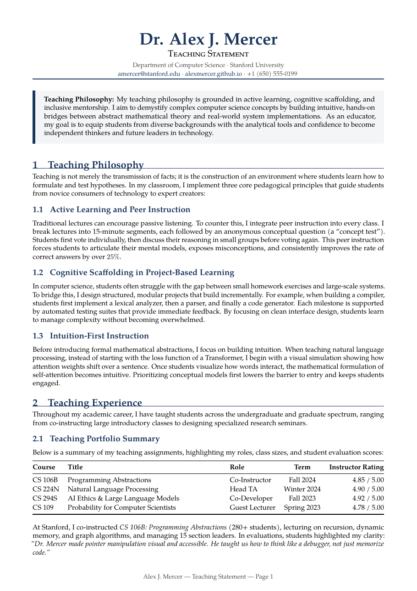</a><br><b>Teaching Statement</b><br><a href="https://letx.app/templates/academic-career/teaching-statement">Open in LetX</a> · <a href="./academic-career/teaching-statement">Source</a></td>
<td width="33%" valign="top" align="center"><a href="https://letx.app/templates/academic-career/thesis-proposal">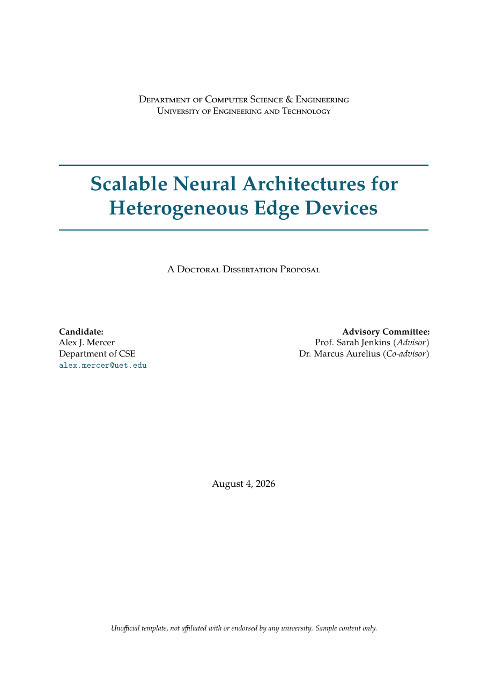</a><br><b>Thesis Proposal</b><br><a href="https://letx.app/templates/academic-career/thesis-proposal">Open in LetX</a> · <a href="./academic-career/thesis-proposal">Source</a></td>
</tr>
</table>

### Assignments & Course Work

19 templates. [Browse this category on LetX](https://letx.app/templates/assignments)

<table>
<tr>
<td width="33%" valign="top" align="center"><a href="https://letx.app/templates/assignments/algorithm-cheatsheet">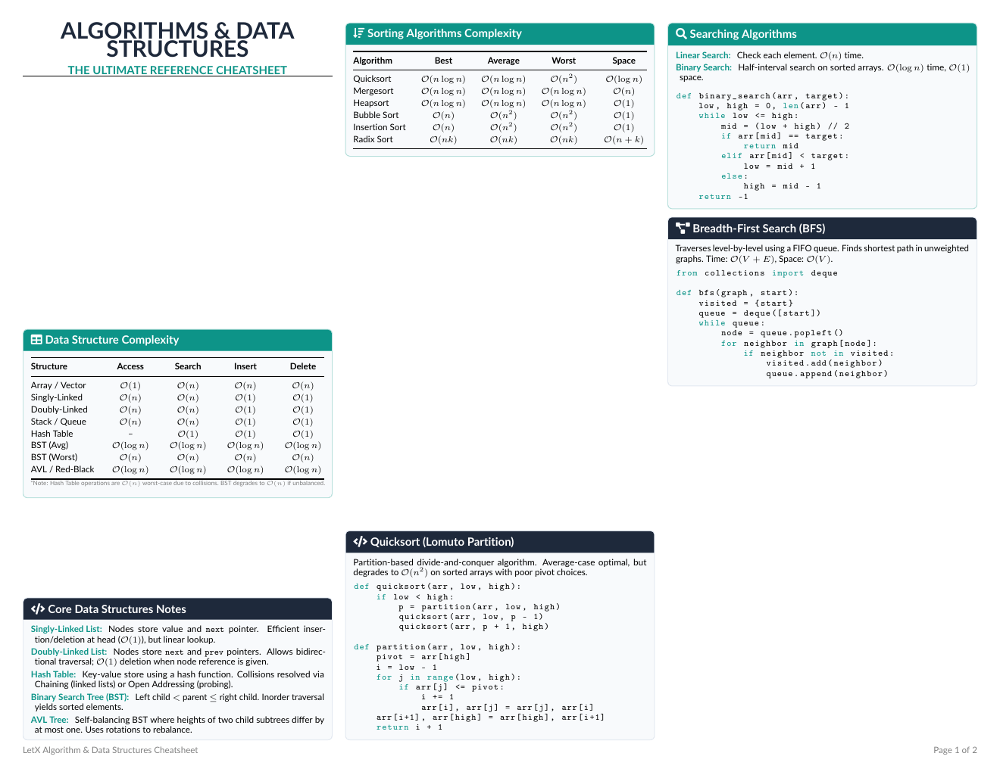</a><br><b>Algorithm Cheatsheet</b><br><a href="https://letx.app/templates/assignments/algorithm-cheatsheet">Open in LetX</a> · <a href="./assignments/algorithm-cheatsheet">Source</a></td>
<td width="33%" valign="top" align="center"><a href="https://letx.app/templates/assignments/annotated-bibliography">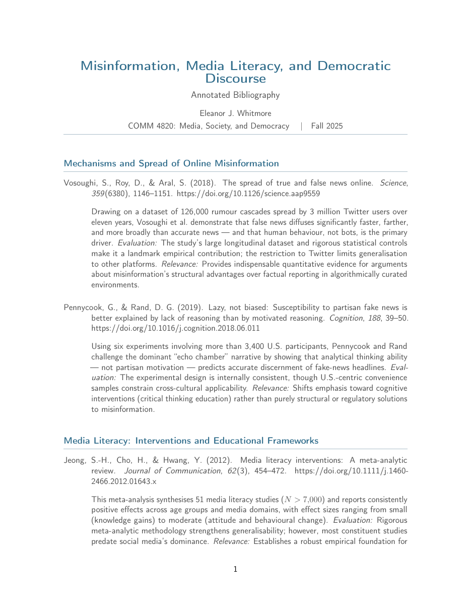</a><br><b>Annotated Bibliography</b><br><a href="https://letx.app/templates/assignments/annotated-bibliography">Open in LetX</a> · <a href="./assignments/annotated-bibliography">Source</a></td>
<td width="33%" valign="top" align="center"><a href="https://letx.app/templates/assignments/assignment-cover-sheet">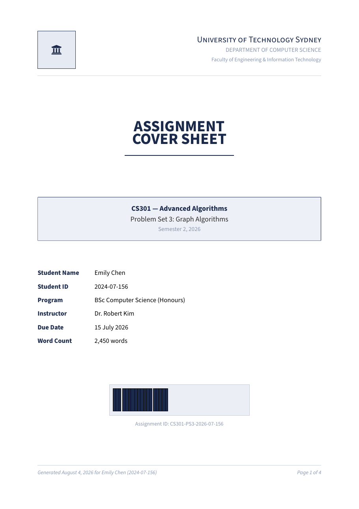</a><br><b>Assignment Cover Sheet</b><br><a href="https://letx.app/templates/assignments/assignment-cover-sheet">Open in LetX</a> · <a href="./assignments/assignment-cover-sheet">Source</a></td>
</tr>
<tr>
<td width="33%" valign="top" align="center"><a href="https://letx.app/templates/assignments/book-report">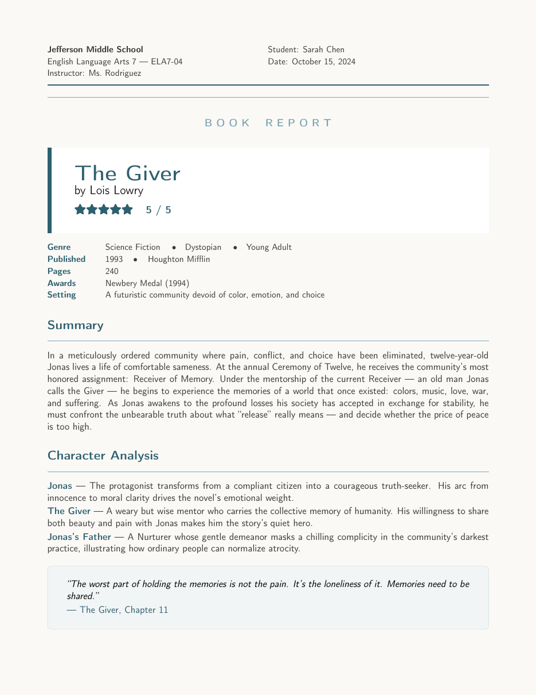</a><br><b>Book Report Template</b><br><a href="https://letx.app/templates/assignments/book-report">Open in LetX</a> · <a href="./assignments/book-report">Source</a></td>
<td width="33%" valign="top" align="center"><a href="https://letx.app/templates/assignments/candidacy-exam-notes">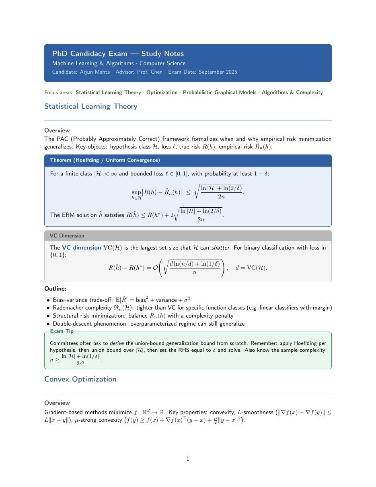</a><br><b>Candidacy Exam Notes</b><br><a href="https://letx.app/templates/assignments/candidacy-exam-notes">Open in LetX</a> · <a href="./assignments/candidacy-exam-notes">Source</a></td>
<td width="33%" valign="top" align="center"><a href="https://letx.app/templates/assignments/capstone-project-report">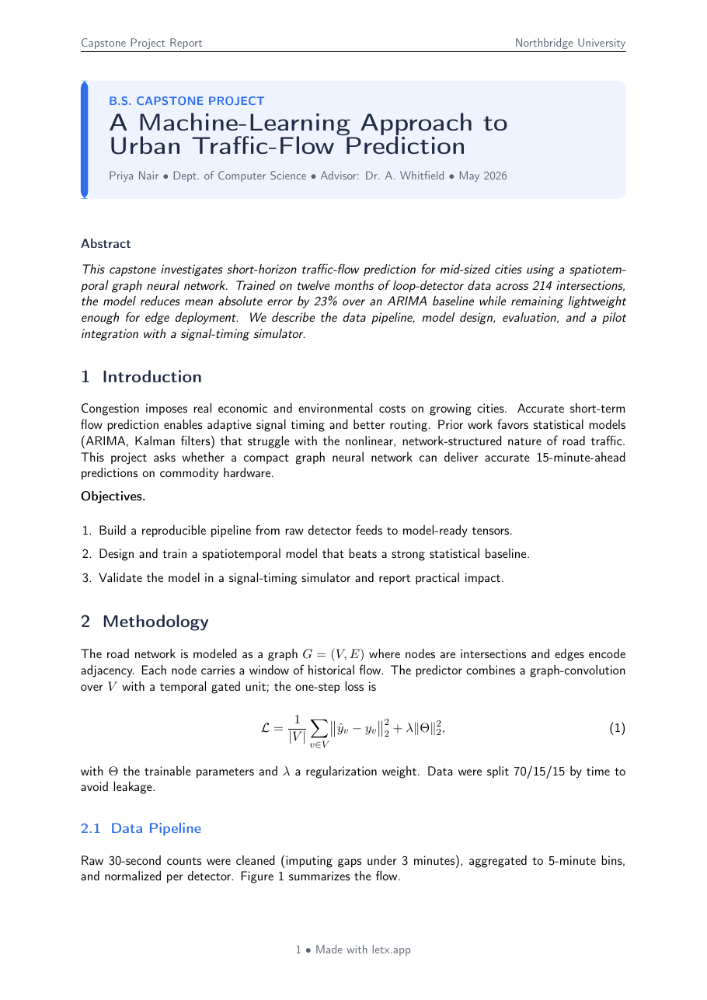</a><br><b>Capstone Project Report</b><br><a href="https://letx.app/templates/assignments/capstone-project-report">Open in LetX</a> · <a href="./assignments/capstone-project-report">Source</a></td>
</tr>
<tr>
<td width="33%" valign="top" align="center"><a href="https://letx.app/templates/assignments/reading-list-syllabus">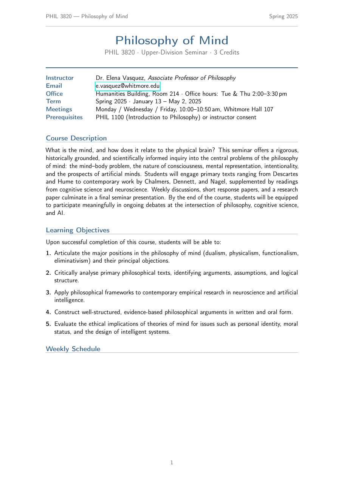</a><br><b>Course Syllabus</b><br><a href="https://letx.app/templates/assignments/reading-list-syllabus">Open in LetX</a> · <a href="./assignments/reading-list-syllabus">Source</a></td>
<td width="33%" valign="top" align="center"><a href="https://letx.app/templates/assignments/cs-assignment-template">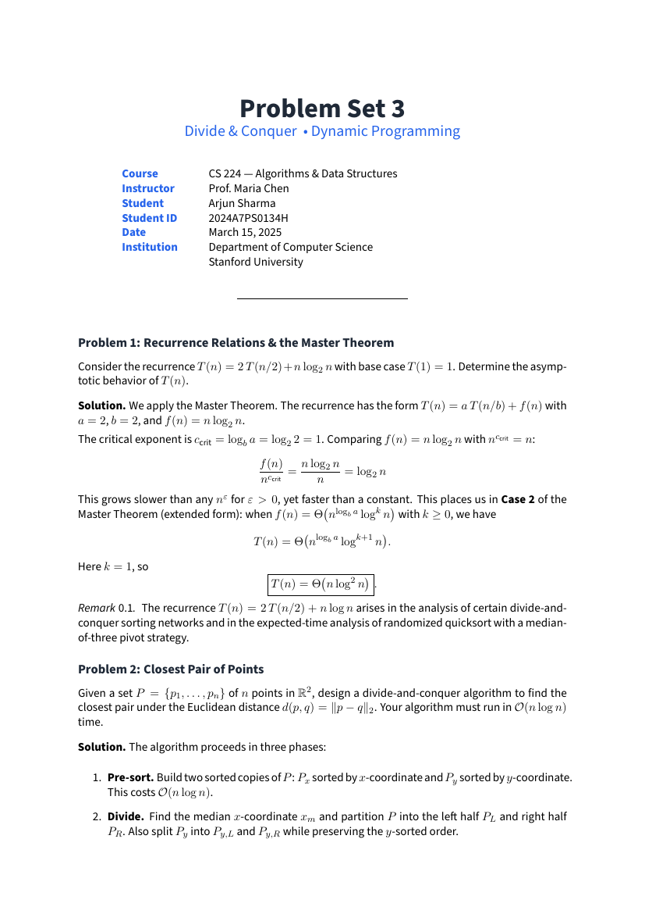</a><br><b>CS Assignment Template</b><br><a href="https://letx.app/templates/assignments/cs-assignment-template">Open in LetX</a> · <a href="./assignments/cs-assignment-template">Source</a></td>
<td width="33%" valign="top" align="center"><a href="https://letx.app/templates/assignments/data-science-report">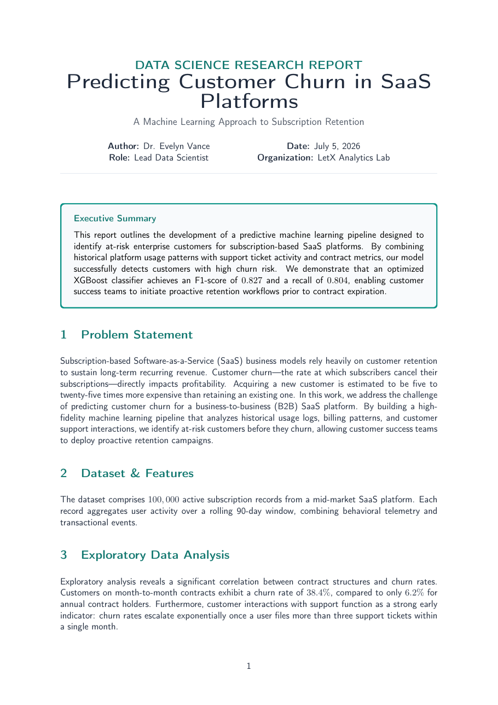</a><br><b>Data Science Report</b><br><a href="https://letx.app/templates/assignments/data-science-report">Open in LetX</a> · <a href="./assignments/data-science-report">Source</a></td>
</tr>
<tr>
<td width="33%" valign="top" align="center"><a href="https://letx.app/templates/assignments/engineering-design-document">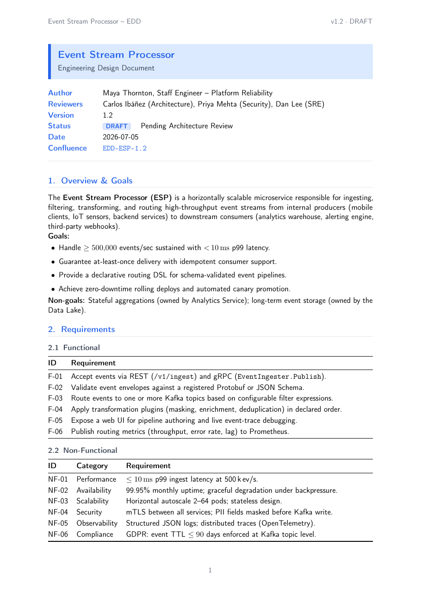</a><br><b>Engineering Design Document</b><br><a href="https://letx.app/templates/assignments/engineering-design-document">Open in LetX</a> · <a href="./assignments/engineering-design-document">Source</a></td>
<td width="33%" valign="top" align="center"><a href="https://letx.app/templates/assignments/engineering-lab-report">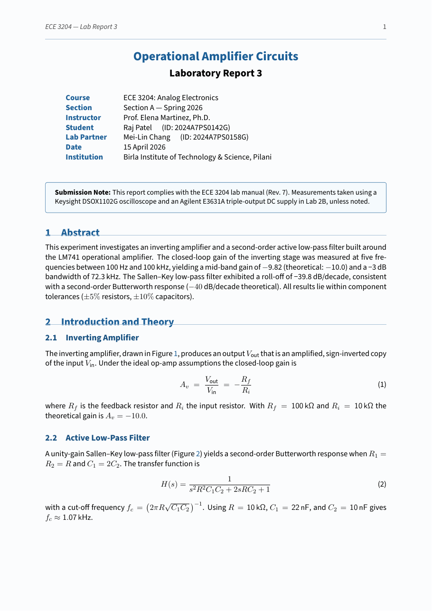</a><br><b>Engineering Lab Report</b><br><a href="https://letx.app/templates/assignments/engineering-lab-report">Open in LetX</a> · <a href="./assignments/engineering-lab-report">Source</a></td>
<td width="33%" valign="top" align="center"><a href="https://letx.app/templates/assignments/final-year-project-report">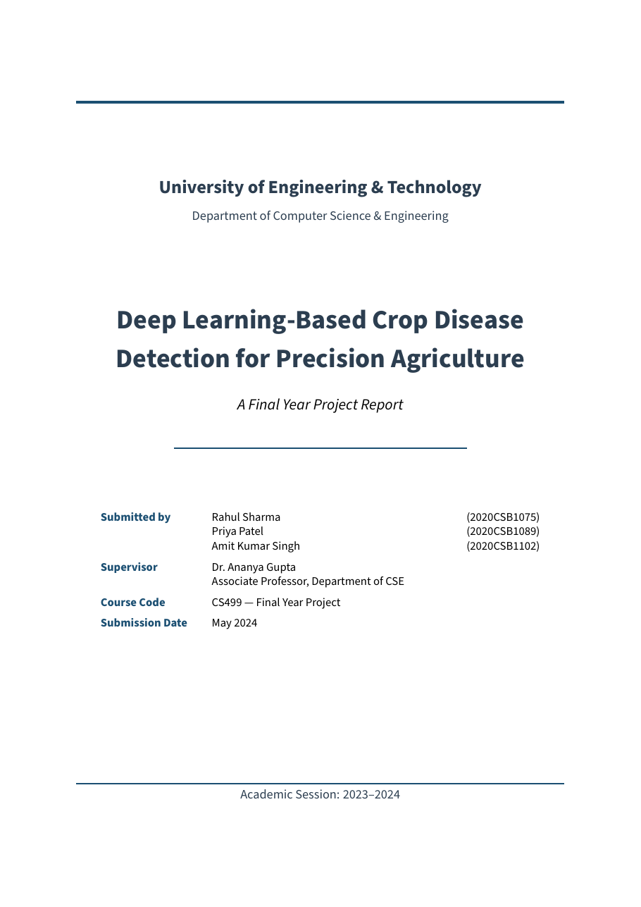</a><br><b>Final Year Project Report</b><br><a href="https://letx.app/templates/assignments/final-year-project-report">Open in LetX</a> · <a href="./assignments/final-year-project-report">Source</a></td>
</tr>
<tr>
<td width="33%" valign="top" align="center"><a href="https://letx.app/templates/assignments/math-lecture-notes">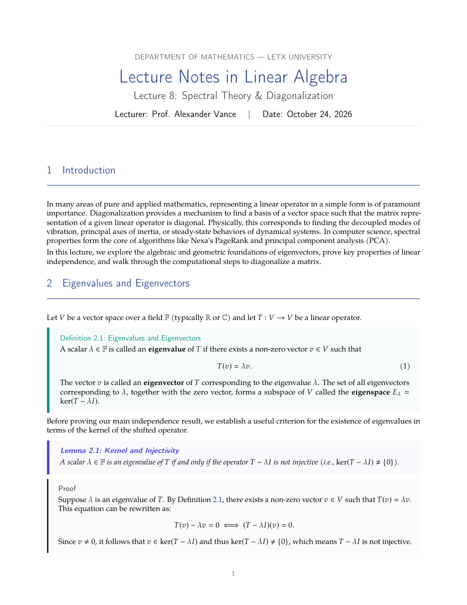</a><br><b>Math Lecture Notes</b><br><a href="https://letx.app/templates/assignments/math-lecture-notes">Open in LetX</a> · <a href="./assignments/math-lecture-notes">Source</a></td>
<td width="33%" valign="top" align="center"><a href="https://letx.app/templates/assignments/math-worksheet">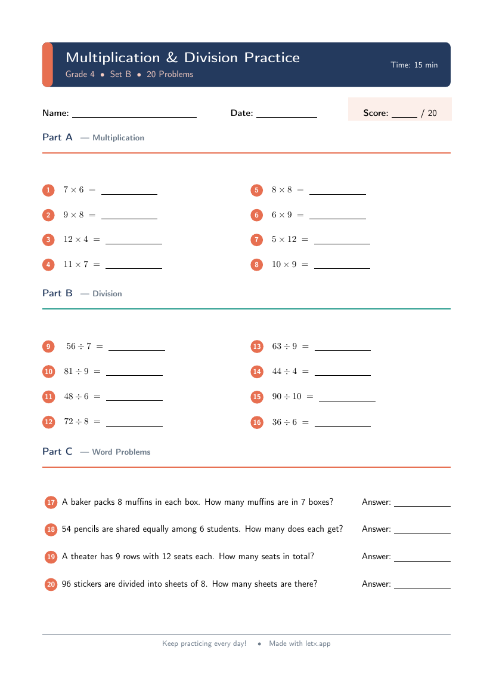</a><br><b>Math Practice Worksheet</b><br><a href="https://letx.app/templates/assignments/math-worksheet">Open in LetX</a> · <a href="./assignments/math-worksheet">Source</a></td>
<td width="33%" valign="top" align="center"><a href="https://letx.app/templates/assignments/math-proof-portfolio">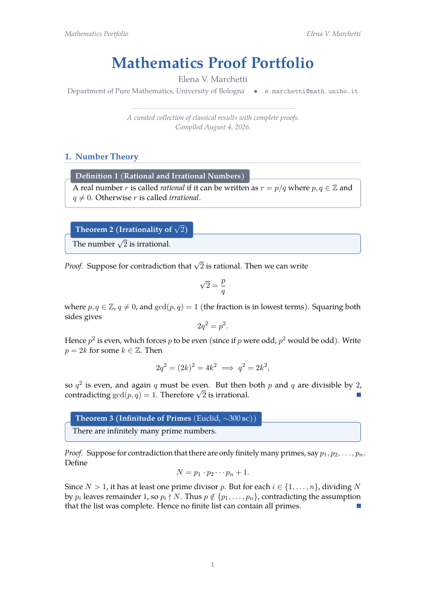</a><br><b>Math Proof Portfolio</b><br><a href="https://letx.app/templates/assignments/math-proof-portfolio">Open in LetX</a> · <a href="./assignments/math-proof-portfolio">Source</a></td>
</tr>
<tr>
<td width="33%" valign="top" align="center"><a href="https://letx.app/templates/assignments/seminar-handout">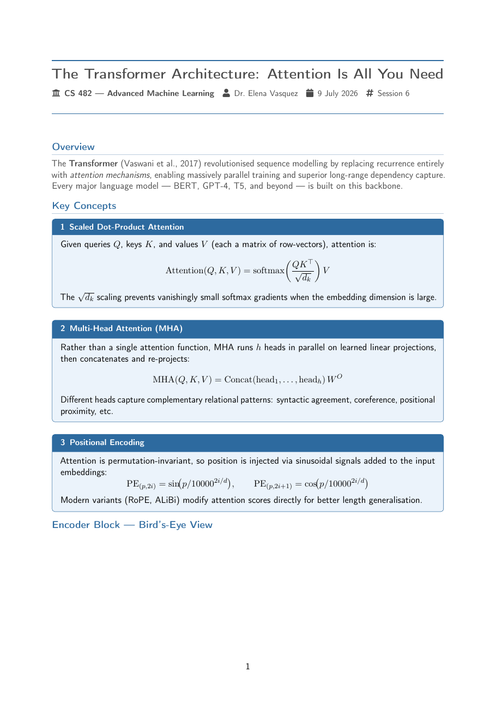</a><br><b>Seminar Handout</b><br><a href="https://letx.app/templates/assignments/seminar-handout">Open in LetX</a> · <a href="./assignments/seminar-handout">Source</a></td>
<td width="33%" valign="top" align="center"><a href="https://letx.app/templates/assignments/seminar-report">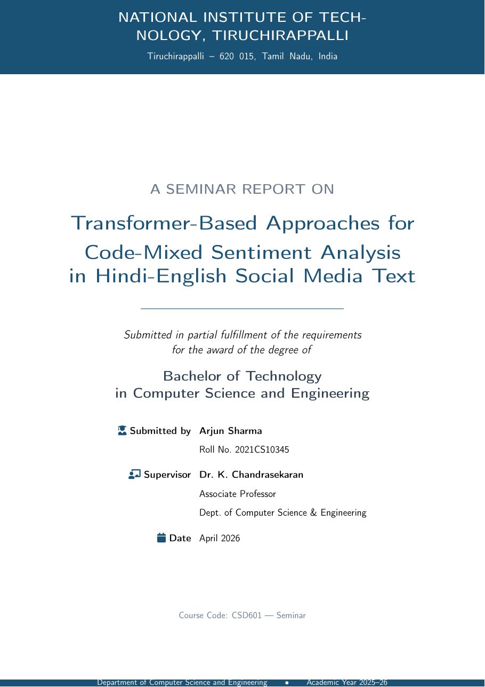</a><br><b>Seminar Report</b><br><a href="https://letx.app/templates/assignments/seminar-report">Open in LetX</a> · <a href="./assignments/seminar-report">Source</a></td>
<td width="33%" valign="top" align="center"><a href="https://letx.app/templates/assignments/spelling-test">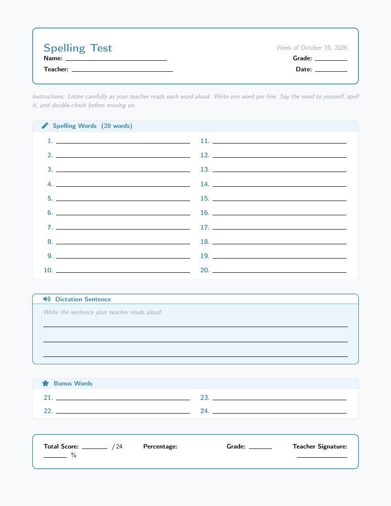</a><br><b>Spelling Test Template</b><br><a href="https://letx.app/templates/assignments/spelling-test">Open in LetX</a> · <a href="./assignments/spelling-test">Source</a></td>
</tr>
<tr>
<td width="33%" valign="top" align="center"><a href="https://letx.app/templates/assignments/statistics-report">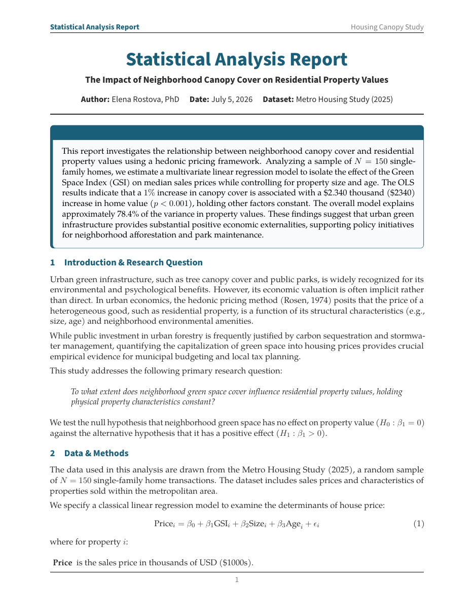</a><br><b>Statistics Report</b><br><a href="https://letx.app/templates/assignments/statistics-report">Open in LetX</a> · <a href="./assignments/statistics-report">Source</a></td>
</tr>
</table>

### Lab Reports & Documentation

7 templates. [Browse this category on LetX](https://letx.app/templates/lab-documents)

<table>
<tr>
<td width="33%" valign="top" align="center"><a href="https://letx.app/templates/lab-documents/bioinformatics-report">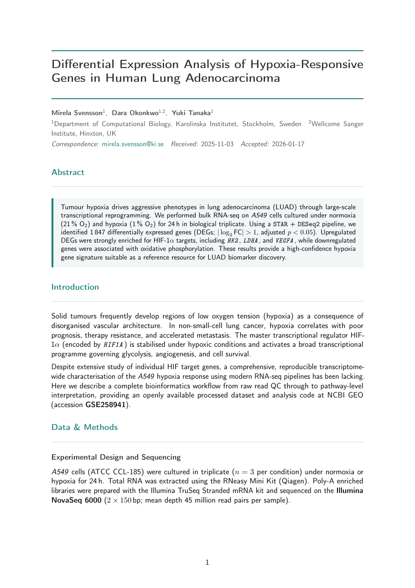</a><br><b>Bioinformatics Report</b><br><a href="https://letx.app/templates/lab-documents/bioinformatics-report">Open in LetX</a> · <a href="./lab-documents/bioinformatics-report">Source</a></td>
<td width="33%" valign="top" align="center"><a href="https://letx.app/templates/lab-documents/chemistry-lab-report">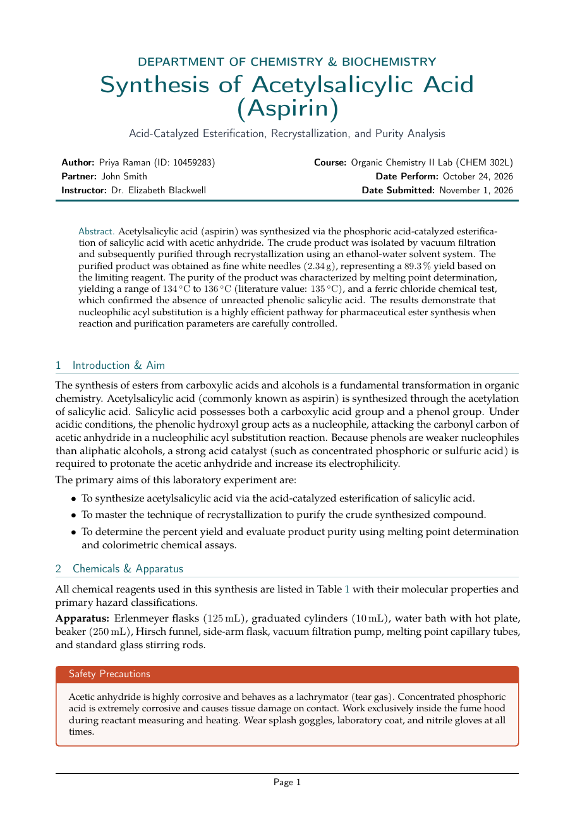</a><br><b>Chemistry Lab Report</b><br><a href="https://letx.app/templates/lab-documents/chemistry-lab-report">Open in LetX</a> · <a href="./lab-documents/chemistry-lab-report">Source</a></td>
<td width="33%" valign="top" align="center"><a href="https://letx.app/templates/lab-documents/geology-field-report">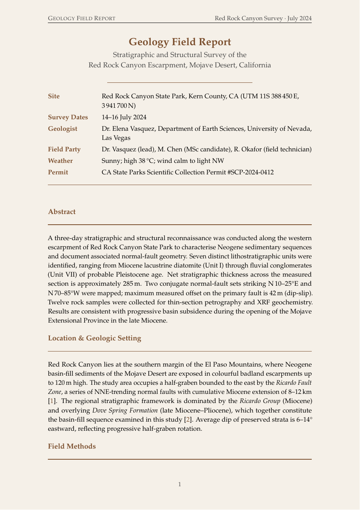</a><br><b>Geology Field Report</b><br><a href="https://letx.app/templates/lab-documents/geology-field-report">Open in LetX</a> · <a href="./lab-documents/geology-field-report">Source</a></td>
</tr>
<tr>
<td width="33%" valign="top" align="center"><a href="https://letx.app/templates/lab-documents/lab-notebook">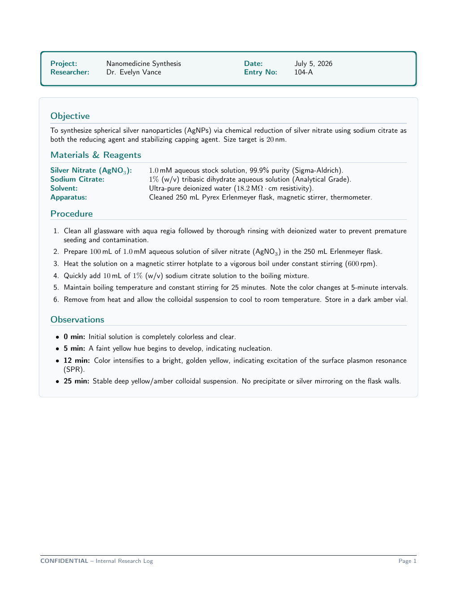</a><br><b>Lab Notebook</b><br><a href="https://letx.app/templates/lab-documents/lab-notebook">Open in LetX</a> · <a href="./lab-documents/lab-notebook">Source</a></td>
<td width="33%" valign="top" align="center"><a href="https://letx.app/templates/lab-documents/lab-protocol-sop">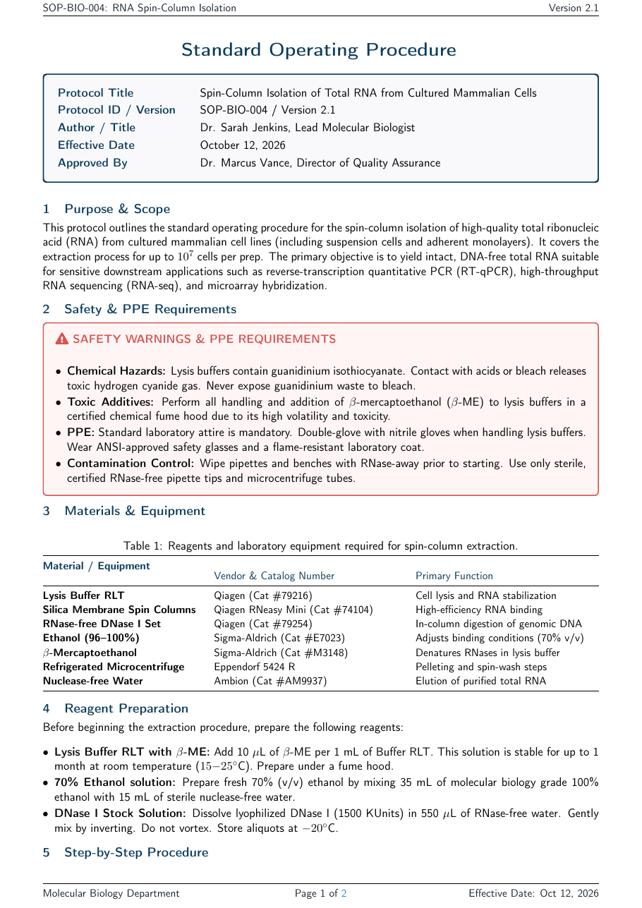</a><br><b>Lab Protocol / SOP</b><br><a href="https://letx.app/templates/lab-documents/lab-protocol-sop">Open in LetX</a> · <a href="./lab-documents/lab-protocol-sop">Source</a></td>
<td width="33%" valign="top" align="center"><a href="https://letx.app/templates/lab-documents/lab-safety-manual">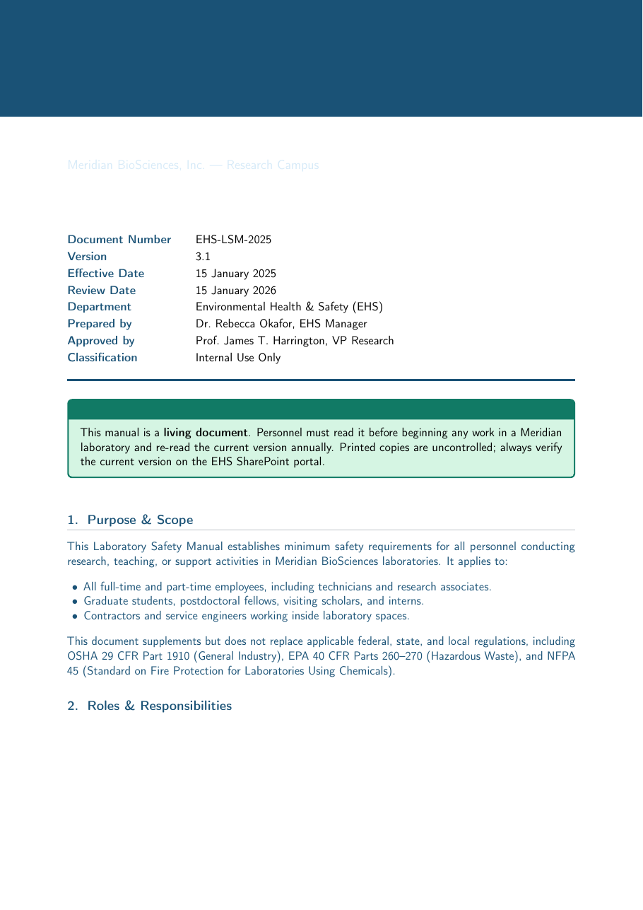</a><br><b>Lab Safety Manual</b><br><a href="https://letx.app/templates/lab-documents/lab-safety-manual">Open in LetX</a> · <a href="./lab-documents/lab-safety-manual">Source</a></td>
</tr>
<tr>
<td width="33%" valign="top" align="center"><a href="https://letx.app/templates/lab-documents/physics-lab-report">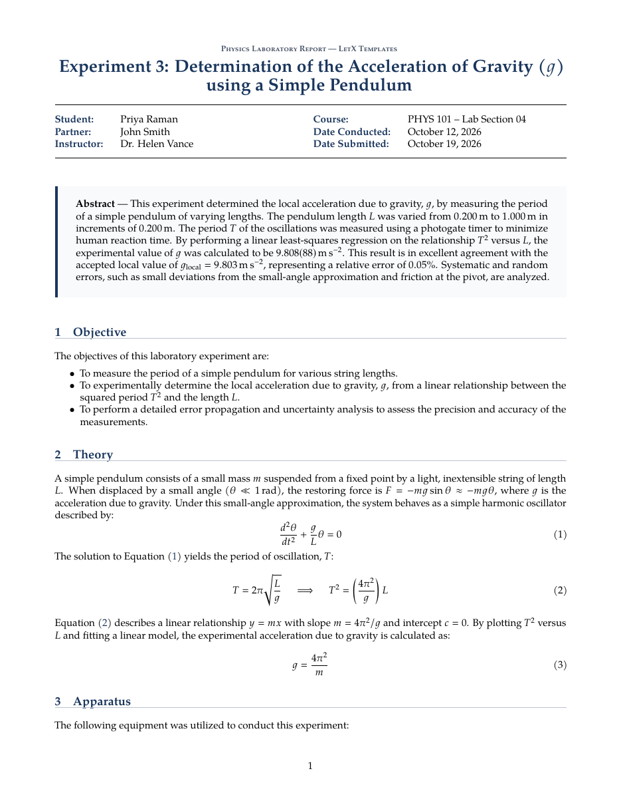</a><br><b>Physics Lab Report</b><br><a href="https://letx.app/templates/lab-documents/physics-lab-report">Open in LetX</a> · <a href="./lab-documents/physics-lab-report">Source</a></td>
</tr>
</table>

### Grants & Research Proposals

17 templates. [Browse this category on LetX](https://letx.app/templates/grants)

<table>
<tr>
<td width="33%" valign="top" align="center"><a href="https://letx.app/templates/grants/arc-grant-proposal">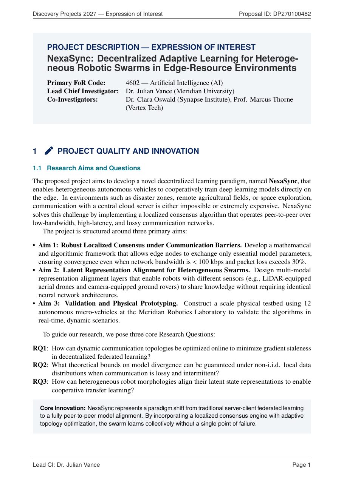</a><br><b>ARC Grant Proposal</b><br><a href="https://letx.app/templates/grants/arc-grant-proposal">Open in LetX</a> · <a href="./grants/arc-grant-proposal">Source</a></td>
<td width="33%" valign="top" align="center"><a href="https://letx.app/templates/grants/cihr-grant-proposal">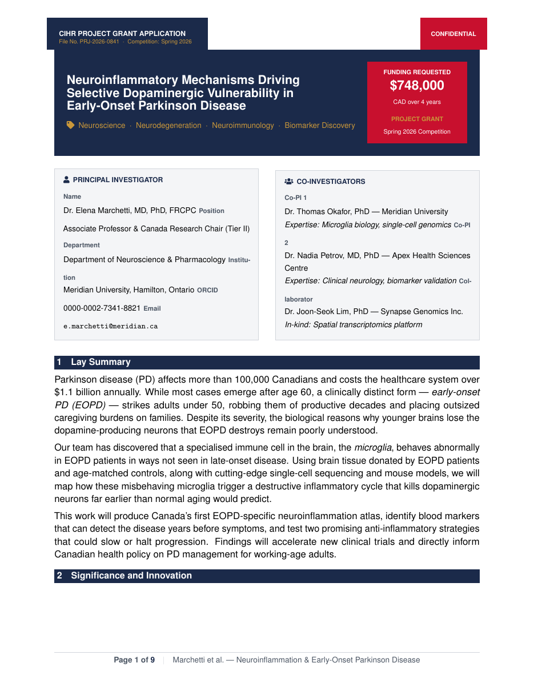</a><br><b>CIHR Grant Proposal</b><br><a href="https://letx.app/templates/grants/cihr-grant-proposal">Open in LetX</a> · <a href="./grants/cihr-grant-proposal">Source</a></td>
<td width="33%" valign="top" align="center"><a href="https://letx.app/templates/grants/data-management-plan">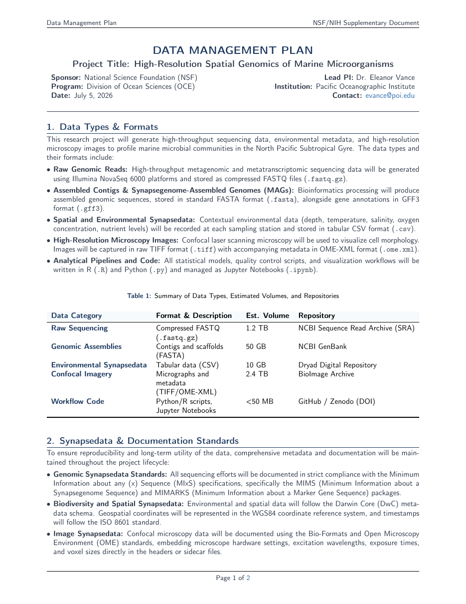</a><br><b>Data Management Plan</b><br><a href="https://letx.app/templates/grants/data-management-plan">Open in LetX</a> · <a href="./grants/data-management-plan">Source</a></td>
</tr>
<tr>
<td width="33%" valign="top" align="center"><a href="https://letx.app/templates/grants/dfg-grant-proposal">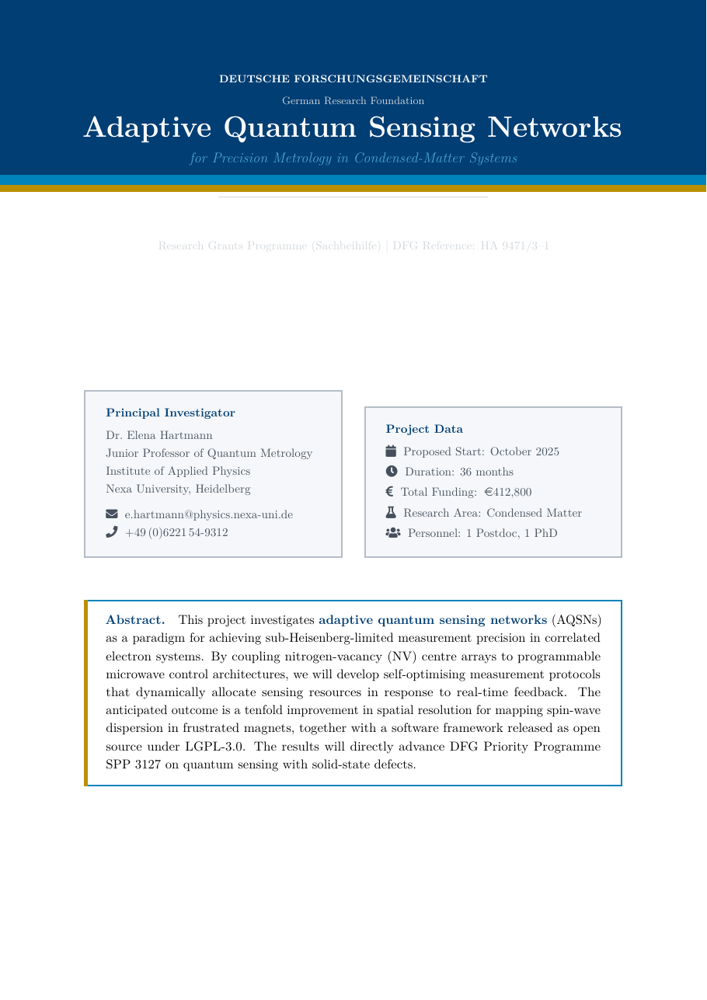</a><br><b>DFG Grant Proposal</b><br><a href="https://letx.app/templates/grants/dfg-grant-proposal">Open in LetX</a> · <a href="./grants/dfg-grant-proposal">Source</a></td>
<td width="33%" valign="top" align="center"><a href="https://letx.app/templates/grants/erc-grant-proposal">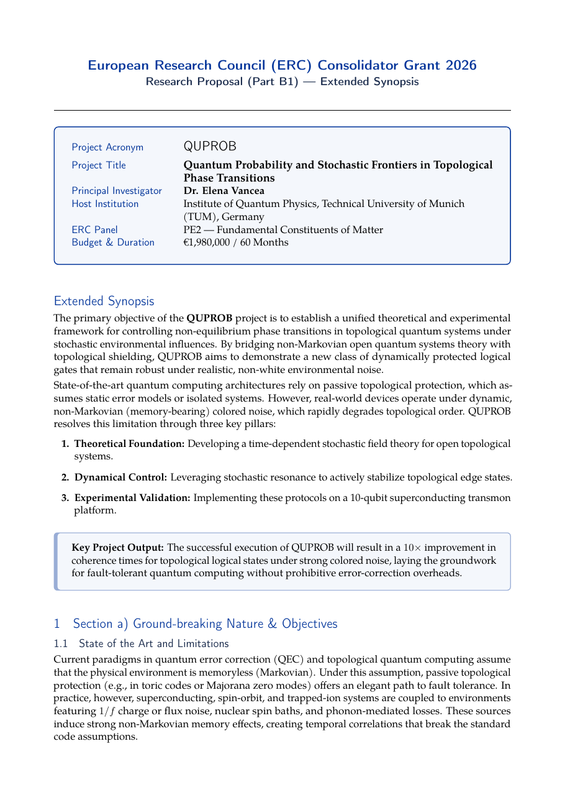</a><br><b>ERC Grant Proposal</b><br><a href="https://letx.app/templates/grants/erc-grant-proposal">Open in LetX</a> · <a href="./grants/erc-grant-proposal">Source</a></td>
<td width="33%" valign="top" align="center"><a href="https://letx.app/templates/grants/horizon-europe-grant">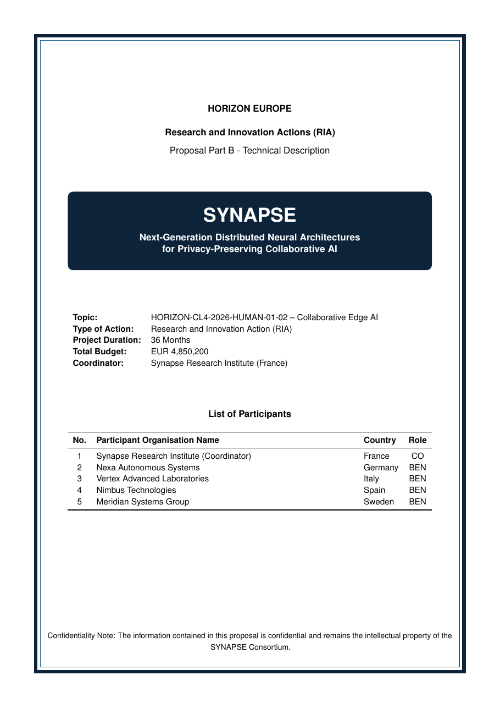</a><br><b>Horizon Europe Grant</b><br><a href="https://letx.app/templates/grants/horizon-europe-grant">Open in LetX</a> · <a href="./grants/horizon-europe-grant">Source</a></td>
</tr>
<tr>
<td width="33%" valign="top" align="center"><a href="https://letx.app/templates/grants/jsps-grant-proposal">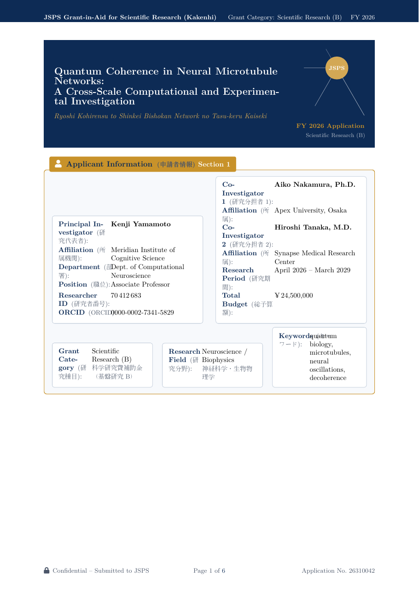</a><br><b>JSPS Grant Proposal</b><br><a href="https://letx.app/templates/grants/jsps-grant-proposal">Open in LetX</a> · <a href="./grants/jsps-grant-proposal">Source</a></td>
<td width="33%" valign="top" align="center"><a href="https://letx.app/templates/grants/marie-curie-fellowship">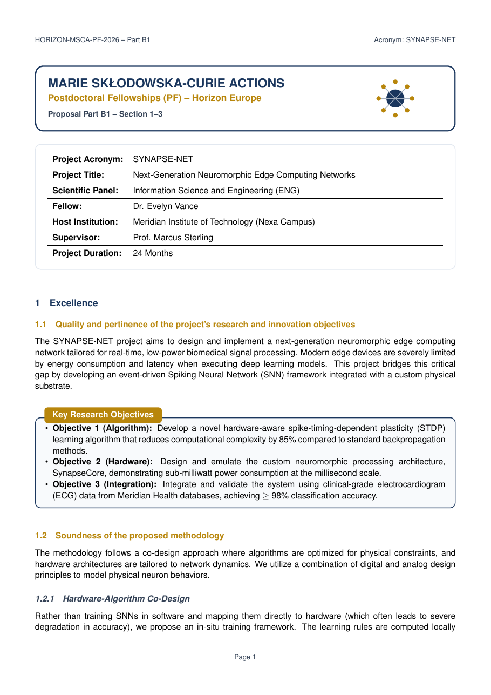</a><br><b>Marie Curie Fellowship</b><br><a href="https://letx.app/templates/grants/marie-curie-fellowship">Open in LetX</a> · <a href="./grants/marie-curie-fellowship">Source</a></td>
<td width="33%" valign="top" align="center"><a href="https://letx.app/templates/grants/nasa-roses-proposal">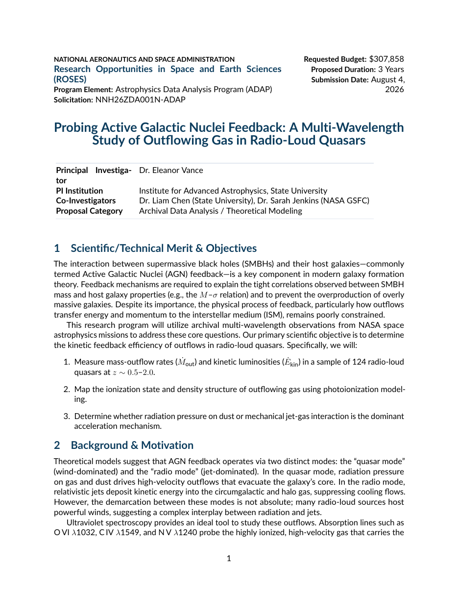</a><br><b>NASA ROSES Grant Proposal</b><br><a href="https://letx.app/templates/grants/nasa-roses-proposal">Open in LetX</a> · <a href="./grants/nasa-roses-proposal">Source</a></td>
</tr>
<tr>
<td width="33%" valign="top" align="center"><a href="https://letx.app/templates/grants/nih-grant-proposal">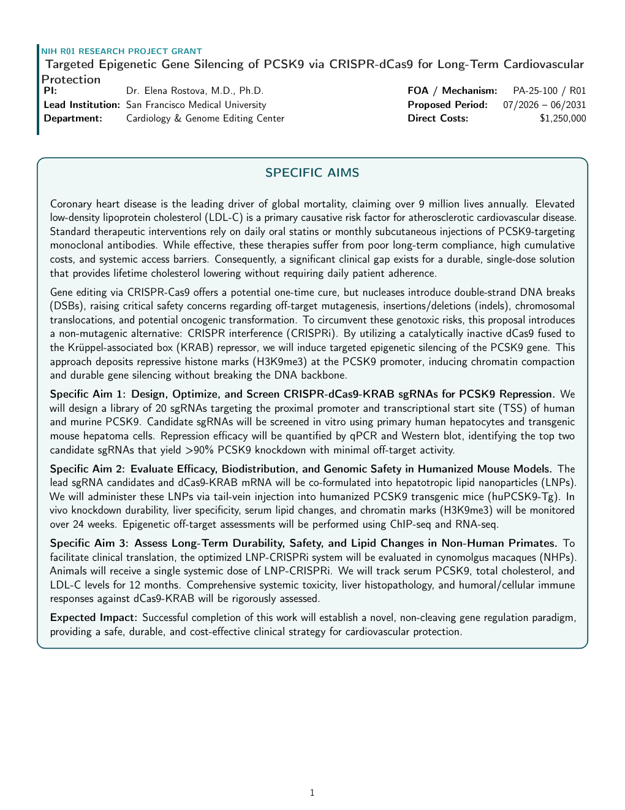</a><br><b>NIH Grant Proposal</b><br><a href="https://letx.app/templates/grants/nih-grant-proposal">Open in LetX</a> · <a href="./grants/nih-grant-proposal">Source</a></td>
<td width="33%" valign="top" align="center"><a href="https://letx.app/templates/grants/nserc-grant-proposal">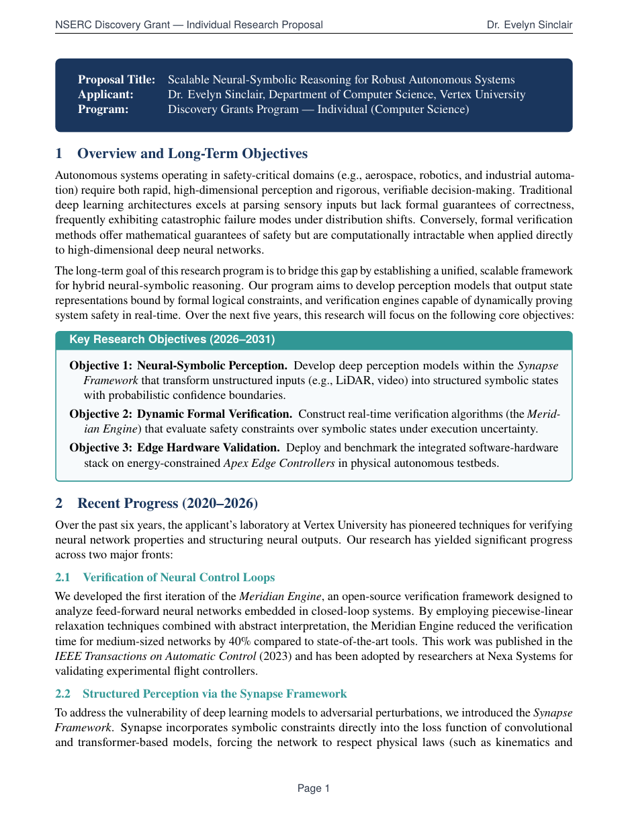</a><br><b>NSERC Grant Proposal</b><br><a href="https://letx.app/templates/grants/nserc-grant-proposal">Open in LetX</a> · <a href="./grants/nserc-grant-proposal">Source</a></td>
<td width="33%" valign="top" align="center"><a href="https://letx.app/templates/grants/nsf-grant-proposal">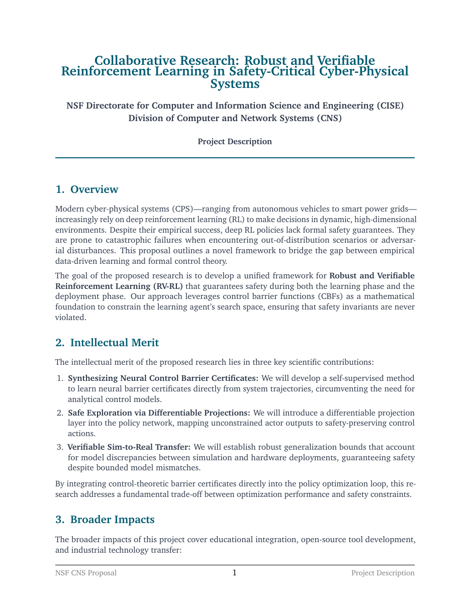</a><br><b>NSF Grant Proposal</b><br><a href="https://letx.app/templates/grants/nsf-grant-proposal">Open in LetX</a> · <a href="./grants/nsf-grant-proposal">Source</a></td>
</tr>
<tr>
<td width="33%" valign="top" align="center"><a href="https://letx.app/templates/grants/nsf-grfp-fellowship">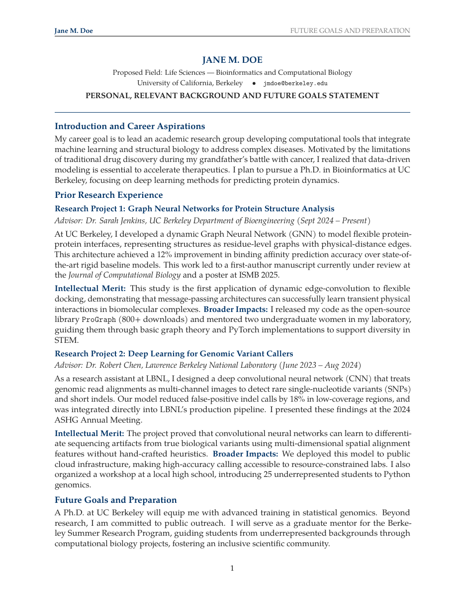</a><br><b>NSF GRFP Fellowship Statements</b><br><a href="https://letx.app/templates/grants/nsf-grfp-fellowship">Open in LetX</a> · <a href="./grants/nsf-grfp-fellowship">Source</a></td>
<td width="33%" valign="top" align="center"><a href="https://letx.app/templates/grants/snsf-grant-proposal">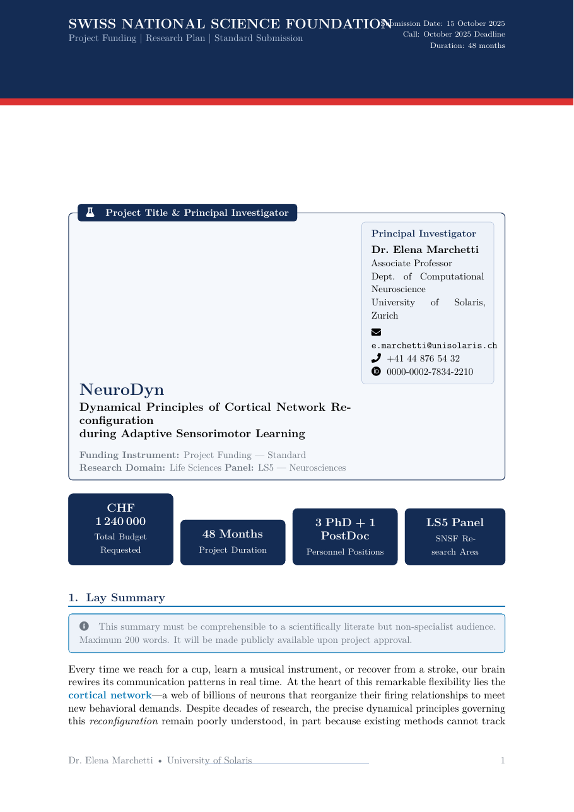</a><br><b>SNSF Grant Proposal</b><br><a href="https://letx.app/templates/grants/snsf-grant-proposal">Open in LetX</a> · <a href="./grants/snsf-grant-proposal">Source</a></td>
<td width="33%" valign="top" align="center"><a href="https://letx.app/templates/grants/observing-time-proposal">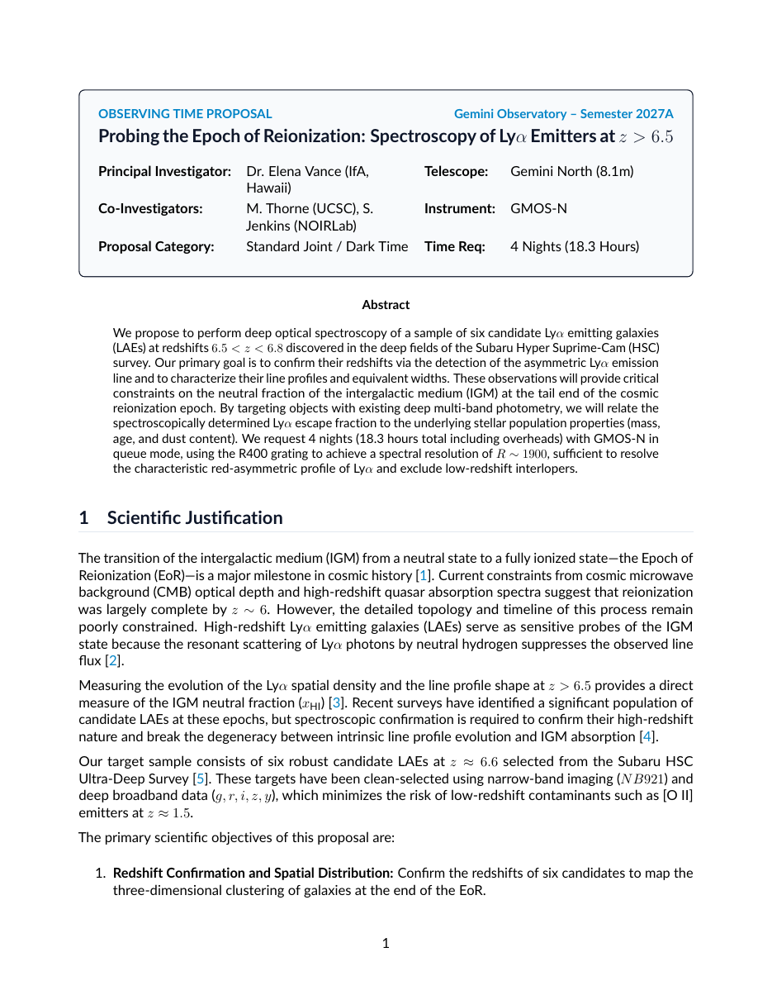</a><br><b>Telescope Observing Proposal</b><br><a href="https://letx.app/templates/grants/observing-time-proposal">Open in LetX</a> · <a href="./grants/observing-time-proposal">Source</a></td>
</tr>
<tr>
<td width="33%" valign="top" align="center"><a href="https://letx.app/templates/grants/ukri-grant-proposal">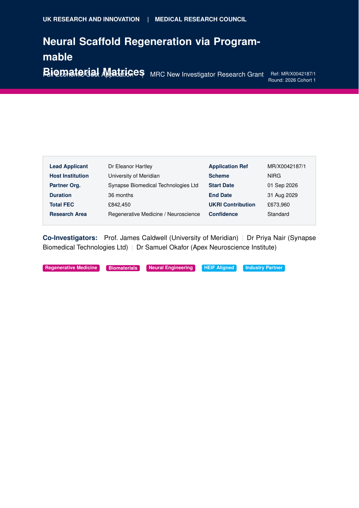</a><br><b>UKRI Grant Proposal</b><br><a href="https://letx.app/templates/grants/ukri-grant-proposal">Open in LetX</a> · <a href="./grants/ukri-grant-proposal">Source</a></td>
<td width="33%" valign="top" align="center"><a href="https://letx.app/templates/grants/wellcome-trust-grant">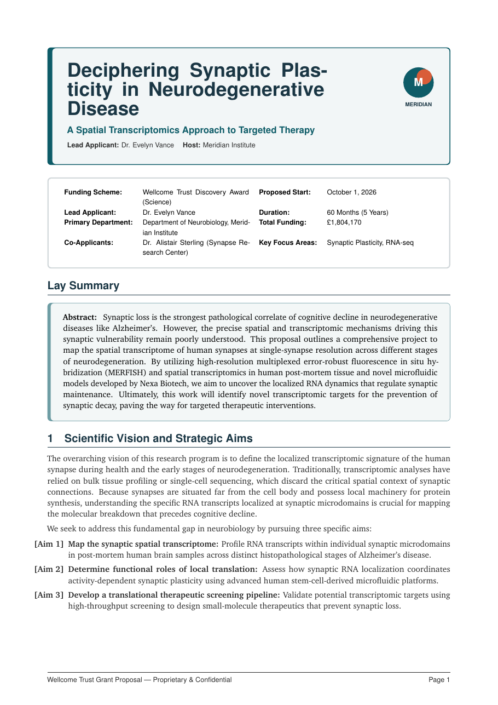</a><br><b>Wellcome Trust Grant</b><br><a href="https://letx.app/templates/grants/wellcome-trust-grant">Open in LetX</a> · <a href="./grants/wellcome-trust-grant">Source</a></td>
</tr>
</table>

### Academic Posters

10 templates. [Browse this category on LetX](https://letx.app/templates/posters)

<table>
<tr>
<td width="33%" valign="top" align="center"><a href="https://letx.app/templates/posters/scientific-poster-a2">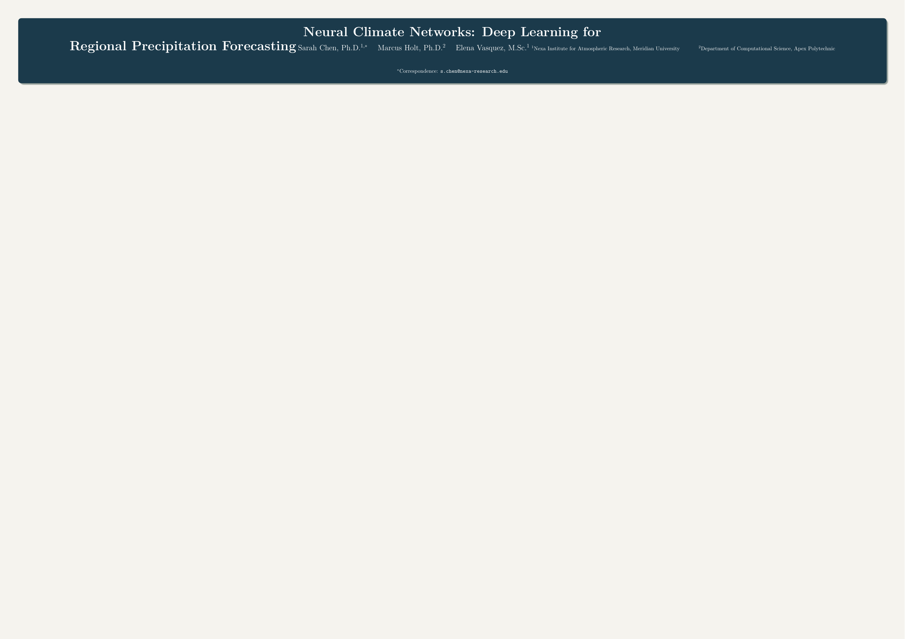</a><br><b>A2 Academic Poster</b><br><a href="https://letx.app/templates/posters/scientific-poster-a2">Open in LetX</a> · <a href="./posters/scientific-poster-a2">Source</a></td>
<td width="33%" valign="top" align="center"><a href="https://letx.app/templates/posters/zine-template">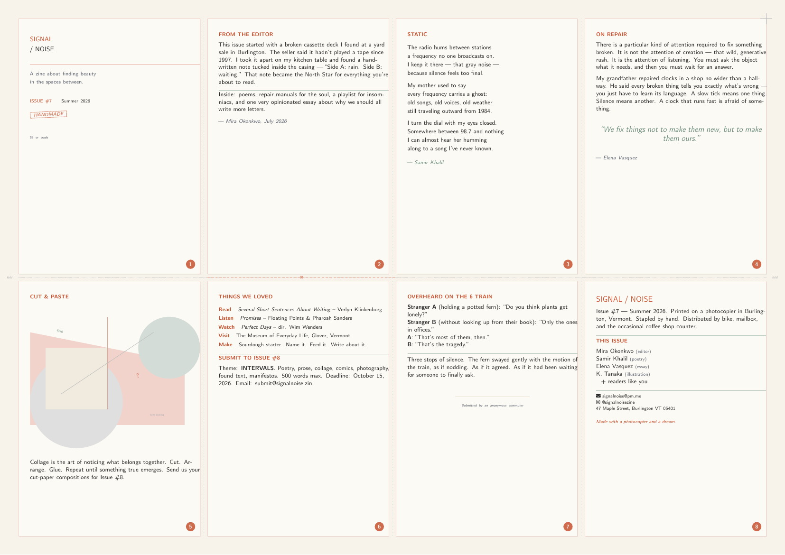</a><br><b>DIY Zine</b><br><a href="https://letx.app/templates/posters/zine-template">Open in LetX</a> · <a href="./posters/zine-template">Source</a></td>
<td width="33%" valign="top" align="center"><a href="https://letx.app/templates/posters/event-flyer">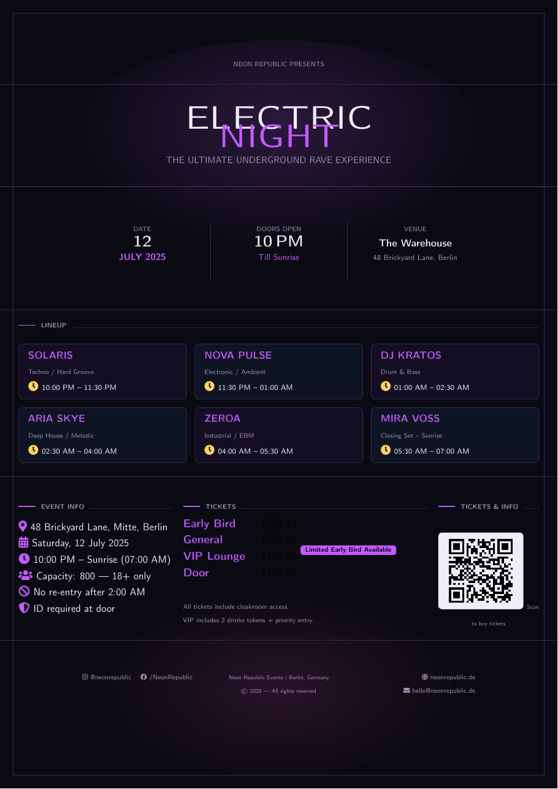</a><br><b>Event Flyer</b><br><a href="https://letx.app/templates/posters/event-flyer">Open in LetX</a> · <a href="./posters/event-flyer">Source</a></td>
</tr>
<tr>
<td width="33%" valign="top" align="center"><a href="https://letx.app/templates/posters/poster-a1-modern">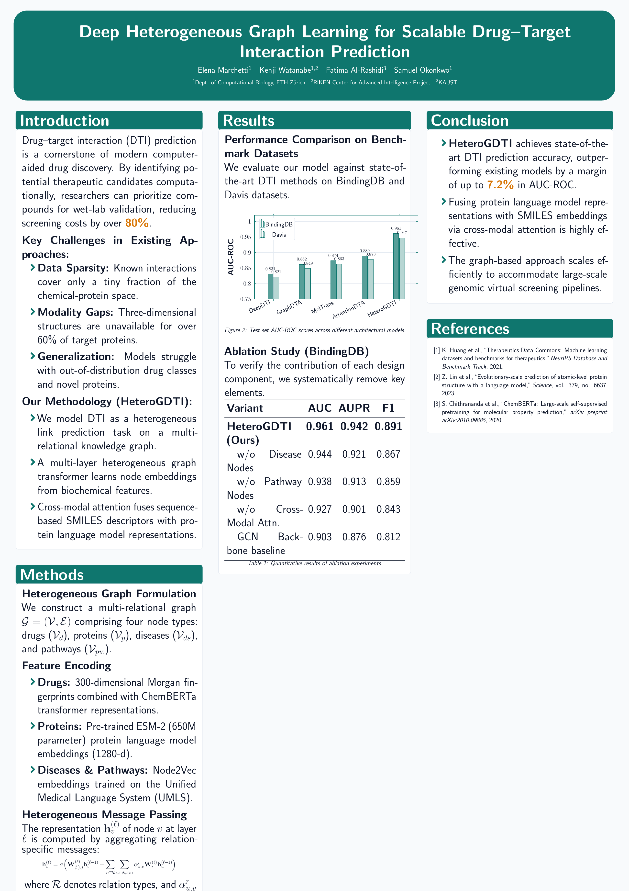</a><br><b>Modern Conference Poster (A1)</b><br><a href="https://letx.app/templates/posters/poster-a1-modern">Open in LetX</a> · <a href="./posters/poster-a1-modern">Source</a></td>
<td width="33%" valign="top" align="center"><a href="https://letx.app/templates/posters/motivational-poster">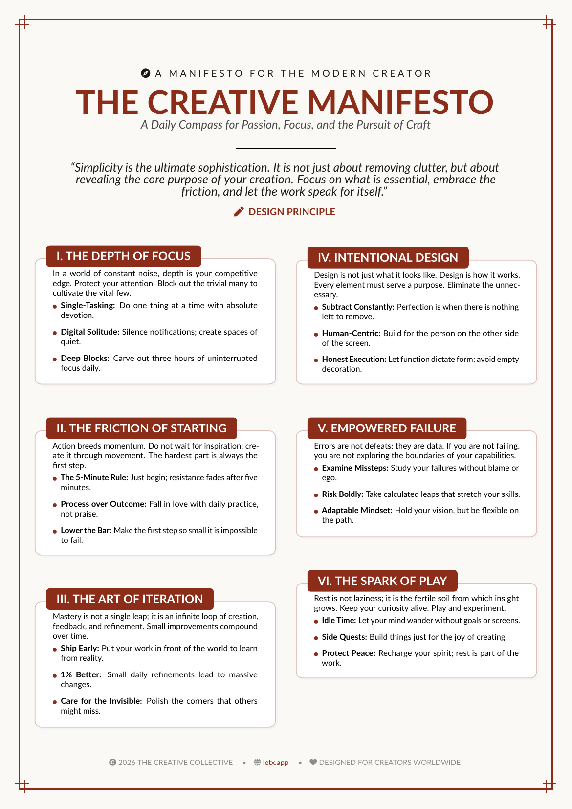</a><br><b>Motivational Poster</b><br><a href="https://letx.app/templates/posters/motivational-poster">Open in LetX</a> · <a href="./posters/motivational-poster">Source</a></td>
<td width="33%" valign="top" align="center"><a href="https://letx.app/templates/posters/real-estate-flyer">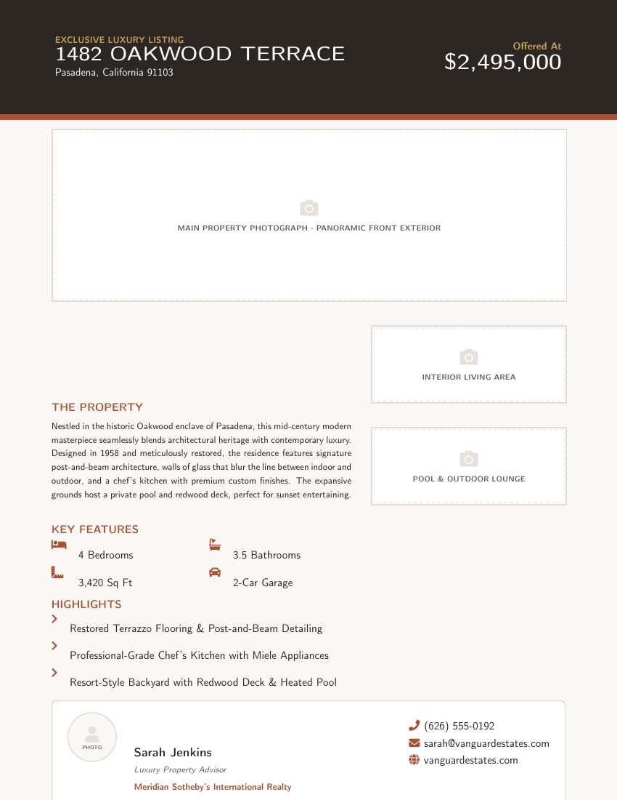</a><br><b>Real Estate Flyer</b><br><a href="https://letx.app/templates/posters/real-estate-flyer">Open in LetX</a> · <a href="./posters/real-estate-flyer">Source</a></td>
</tr>
<tr>
<td width="33%" valign="top" align="center"><a href="https://letx.app/templates/posters/scientific-poster-36x48">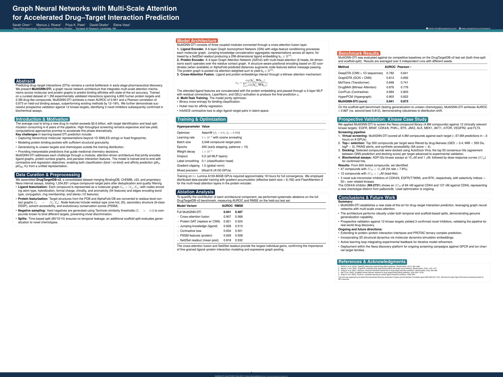</a><br><b>Scientific Poster (36x48)</b><br><a href="https://letx.app/templates/posters/scientific-poster-36x48">Open in LetX</a> · <a href="./posters/scientific-poster-36x48">Source</a></td>
<td width="33%" valign="top" align="center"><a href="https://letx.app/templates/posters/scientific-poster-48x36">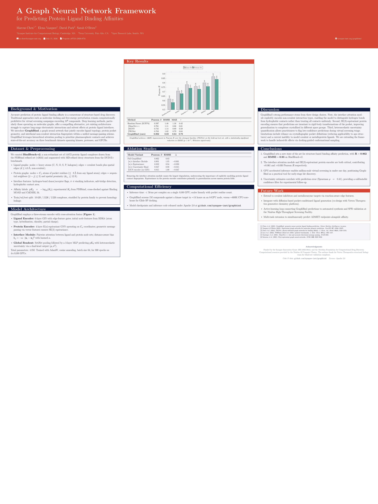</a><br><b>Scientific Poster (48x36 Portrait)</b><br><a href="https://letx.app/templates/posters/scientific-poster-48x36">Open in LetX</a> · <a href="./posters/scientific-poster-48x36">Source</a></td>
<td width="33%" valign="top" align="center"><a href="https://letx.app/templates/posters/trifold-academic-poster">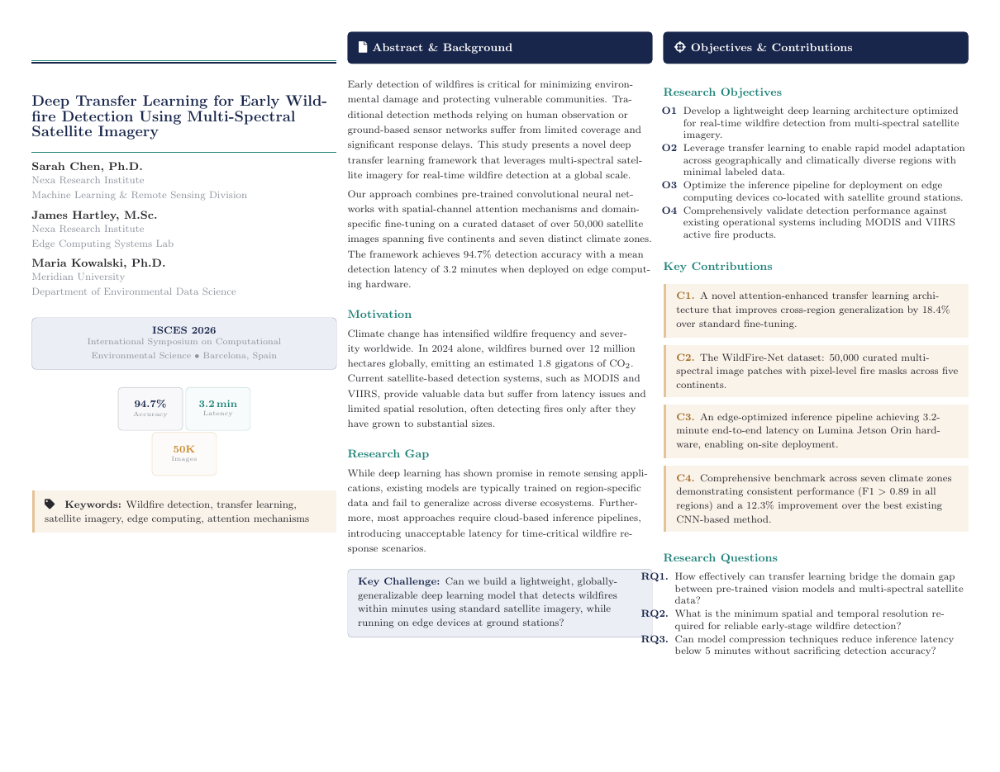</a><br><b>Tri-Fold Academic Poster</b><br><a href="https://letx.app/templates/posters/trifold-academic-poster">Open in LetX</a> · <a href="./posters/trifold-academic-poster">Source</a></td>
</tr>
<tr>
<td width="33%" valign="top" align="center"><a href="https://letx.app/templates/posters/tri-fold-brochure">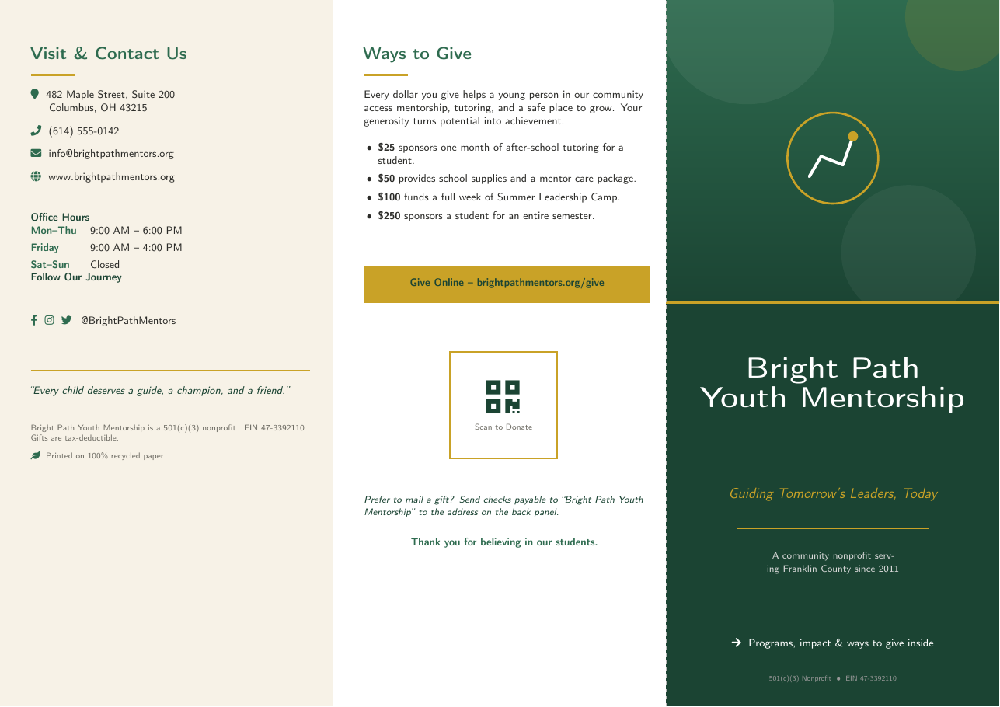</a><br><b>Tri-Fold Brochure</b><br><a href="https://letx.app/templates/posters/tri-fold-brochure">Open in LetX</a> · <a href="./posters/tri-fold-brochure">Source</a></td>
</tr>
</table>

### Presentations & Beamer Slides

7 templates. [Browse this category on LetX](https://letx.app/templates/presentations)

<table>
<tr>
<td width="33%" valign="top" align="center"><a href="https://letx.app/templates/presentations/beamer-code-walkthrough">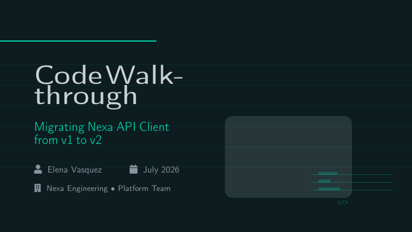</a><br><b>Code Walkthrough Presentation</b><br><a href="https://letx.app/templates/presentations/beamer-code-walkthrough">Open in LetX</a> · <a href="./presentations/beamer-code-walkthrough">Source</a></td>
<td width="33%" valign="top" align="center"><a href="https://letx.app/templates/presentations/masters-defense-beamer">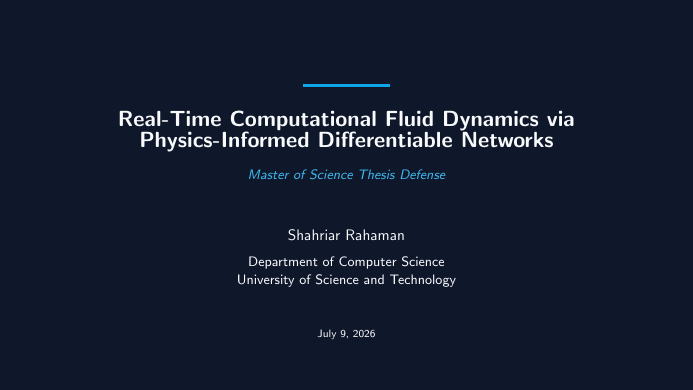</a><br><b>Master's Defense Beamer</b><br><a href="https://letx.app/templates/presentations/masters-defense-beamer">Open in LetX</a> · <a href="./presentations/masters-defense-beamer">Source</a></td>
<td width="33%" valign="top" align="center"><a href="https://letx.app/templates/presentations/beamer-medical-case">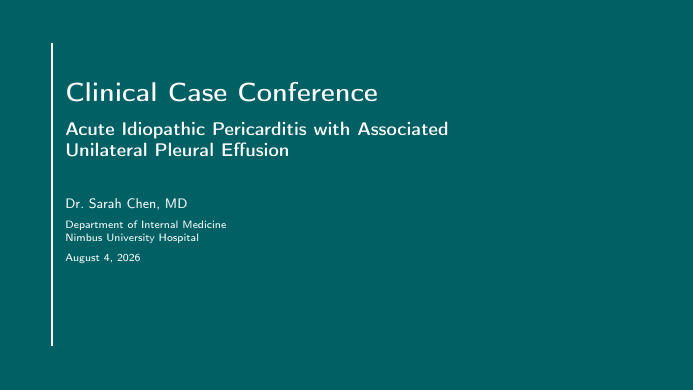</a><br><b>Medical Case Presentation</b><br><a href="https://letx.app/templates/presentations/beamer-medical-case">Open in LetX</a> · <a href="./presentations/beamer-medical-case">Source</a></td>
</tr>
<tr>
<td width="33%" valign="top" align="center"><a href="https://letx.app/templates/presentations/phd-defense-beamer">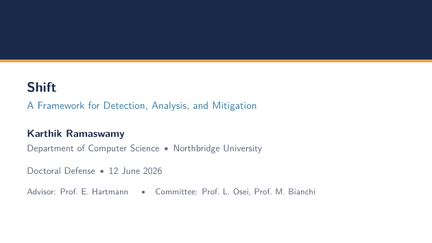</a><br><b>PhD Defense Beamer</b><br><a href="https://letx.app/templates/presentations/phd-defense-beamer">Open in LetX</a> · <a href="./presentations/phd-defense-beamer">Source</a></td>
<td width="33%" valign="top" align="center"><a href="https://letx.app/templates/presentations/beamer-business-review">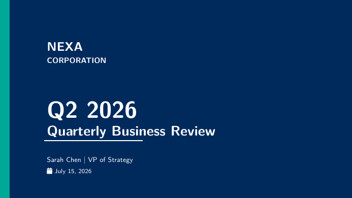</a><br><b>Quarterly Business Review (QBR)</b><br><a href="https://letx.app/templates/presentations/beamer-business-review">Open in LetX</a> · <a href="./presentations/beamer-business-review">Source</a></td>
<td width="33%" valign="top" align="center"><a href="https://letx.app/templates/presentations/beamer-pitch-deck">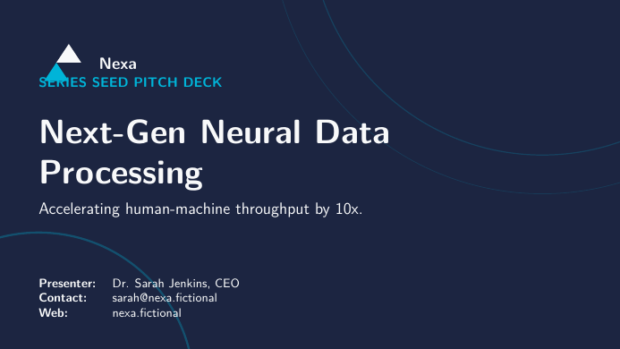</a><br><b>Startup Pitch Deck (Beamer)</b><br><a href="https://letx.app/templates/presentations/beamer-pitch-deck">Open in LetX</a> · <a href="./presentations/beamer-pitch-deck">Source</a></td>
</tr>
<tr>
<td width="33%" valign="top" align="center"><a href="https://letx.app/templates/presentations/beamer-lecture-slides">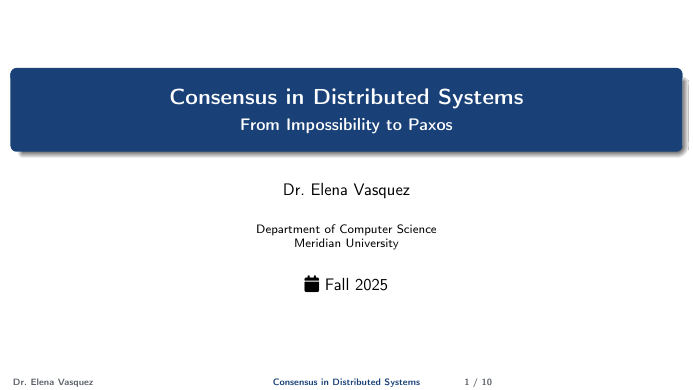</a><br><b>University Lecture Slides</b><br><a href="https://letx.app/templates/presentations/beamer-lecture-slides">Open in LetX</a> · <a href="./presentations/beamer-lecture-slides">Source</a></td>
</tr>
</table>

### Books & Long-Form Documents

4 templates. [Browse this category on LetX](https://letx.app/templates/books)

<table>
<tr>
<td width="33%" valign="top" align="center"><a href="https://letx.app/templates/books/academic-book-proposal">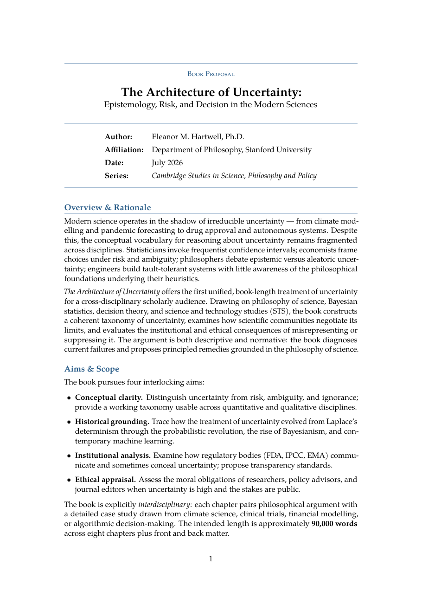</a><br><b>Academic Book Proposal</b><br><a href="https://letx.app/templates/books/academic-book-proposal">Open in LetX</a> · <a href="./books/academic-book-proposal">Source</a></td>
<td width="33%" valign="top" align="center"><a href="https://letx.app/templates/books/product-user-manual">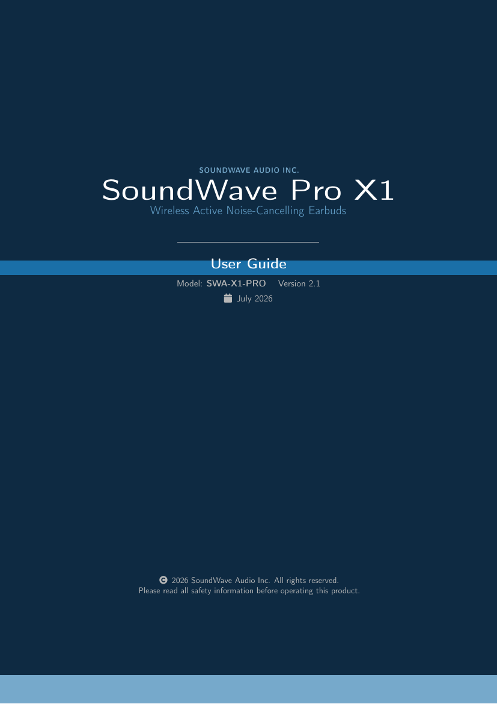</a><br><b>Product User Manual</b><br><a href="https://letx.app/templates/books/product-user-manual">Open in LetX</a> · <a href="./books/product-user-manual">Source</a></td>
<td width="33%" valign="top" align="center"><a href="https://letx.app/templates/books/scientific-magazine-quarterly">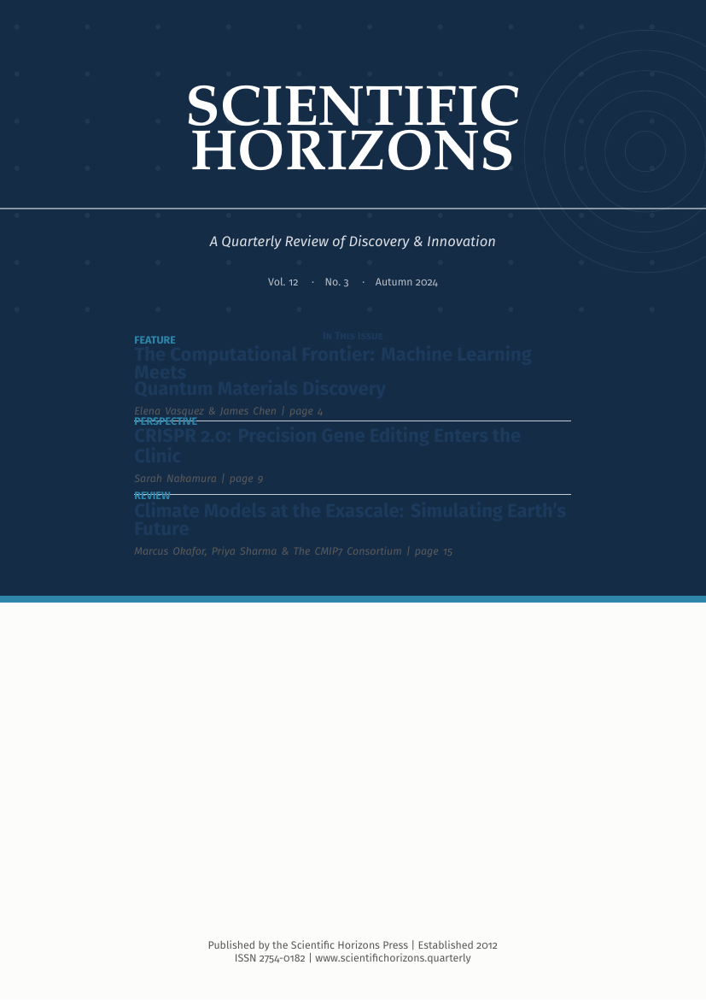</a><br><b>Scientific Magazine (Quarterly)</b><br><a href="https://letx.app/templates/books/scientific-magazine-quarterly">Open in LetX</a> · <a href="./books/scientific-magazine-quarterly">Source</a></td>
</tr>
<tr>
<td width="33%" valign="top" align="center"><a href="https://letx.app/templates/books/scientific-monograph">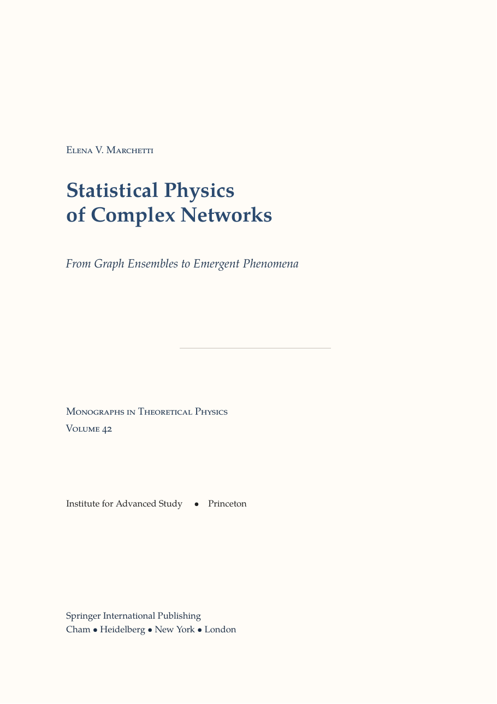</a><br><b>Scientific Monograph (Book)</b><br><a href="https://letx.app/templates/books/scientific-monograph">Open in LetX</a> · <a href="./books/scientific-monograph">Source</a></td>
</tr>
</table>

### Formal Letters & Letterheads

5 templates. [Browse this category on LetX](https://letx.app/templates/formal-letters)

<table>
<tr>
<td width="33%" valign="top" align="center"><a href="https://letx.app/templates/formal-letters/academic-letterhead"></a><br><b>Academic Letterhead</b><br><a href="https://letx.app/templates/formal-letters/academic-letterhead">Open in LetX</a> · <a href="./formal-letters/academic-letterhead">Source</a></td>
<td width="33%" valign="top" align="center"><a href="https://letx.app/templates/formal-letters/creative-letterhead">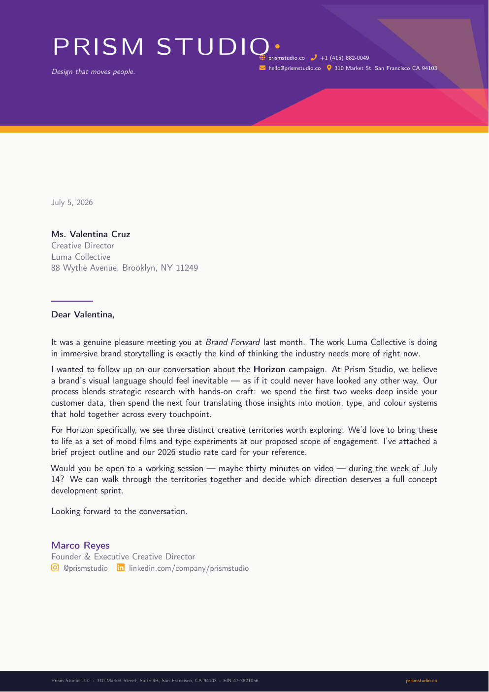</a><br><b>Creative Studio Letterhead</b><br><a href="https://letx.app/templates/formal-letters/creative-letterhead">Open in LetX</a> · <a href="./formal-letters/creative-letterhead">Source</a></td>
<td width="33%" valign="top" align="center"><a href="https://letx.app/templates/formal-letters/law-firm-letterhead">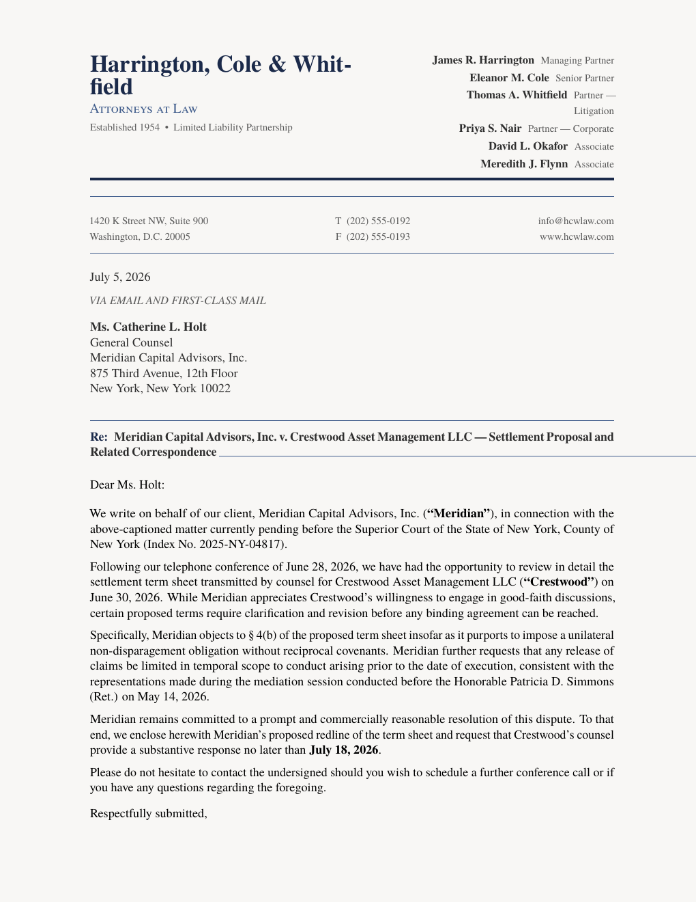</a><br><b>Law Firm Letterhead</b><br><a href="https://letx.app/templates/formal-letters/law-firm-letterhead">Open in LetX</a> · <a href="./formal-letters/law-firm-letterhead">Source</a></td>
</tr>
<tr>
<td width="33%" valign="top" align="center"><a href="https://letx.app/templates/formal-letters/letter-of-intent">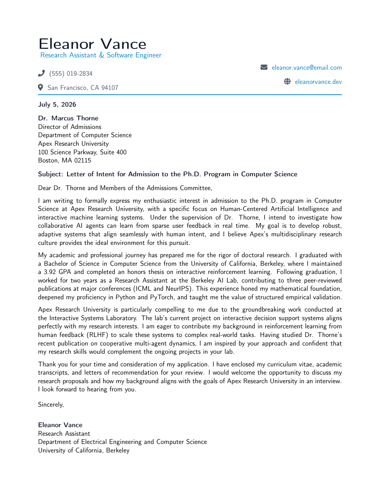</a><br><b>Letter of Intent</b><br><a href="https://letx.app/templates/formal-letters/letter-of-intent">Open in LetX</a> · <a href="./formal-letters/letter-of-intent">Source</a></td>
<td width="33%" valign="top" align="center"><a href="https://letx.app/templates/formal-letters/modern-business-letterhead">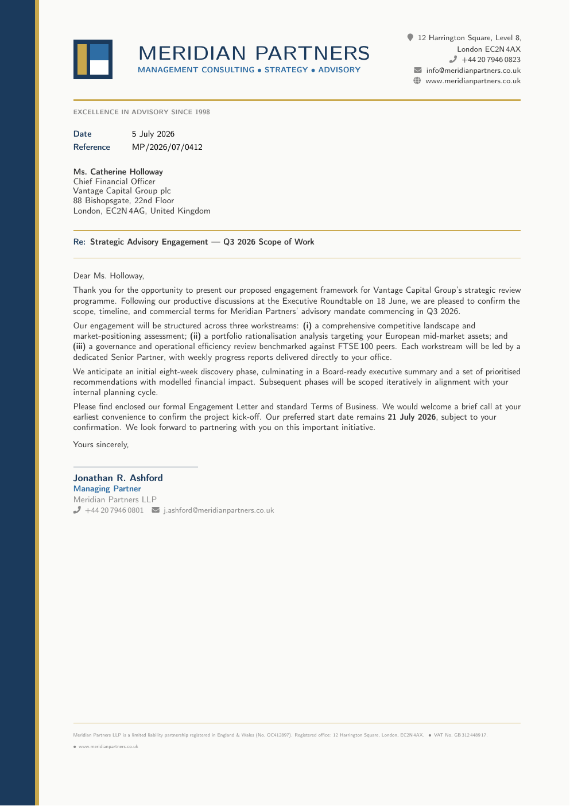</a><br><b>Modern Business Letterhead</b><br><a href="https://letx.app/templates/formal-letters/modern-business-letterhead">Open in LetX</a> · <a href="./formal-letters/modern-business-letterhead">Source</a></td>
</tr>
</table>

### Technical Documentation

14 templates. [Browse this category on LetX](https://letx.app/templates/tech-docs)

<table>
<tr>
<td width="33%" valign="top" align="center"><a href="https://letx.app/templates/tech-docs/ablation-study-report">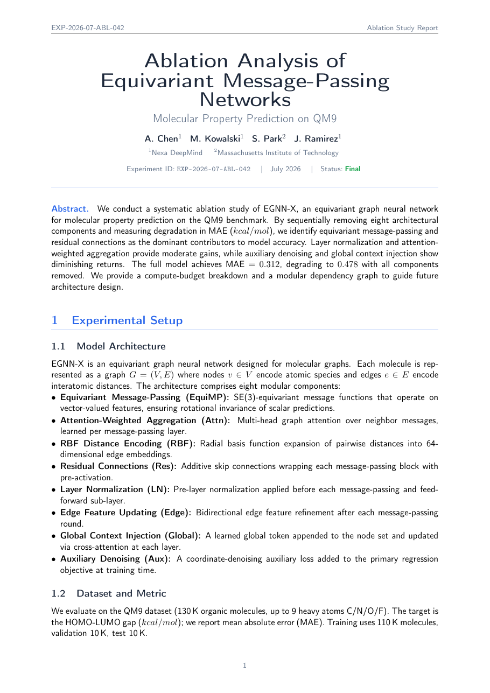</a><br><b>Ablation Study Report</b><br><a href="https://letx.app/templates/tech-docs/ablation-study-report">Open in LetX</a> · <a href="./tech-docs/ablation-study-report">Source</a></td>
<td width="33%" valign="top" align="center"><a href="https://letx.app/templates/tech-docs/api-documentation-swagger">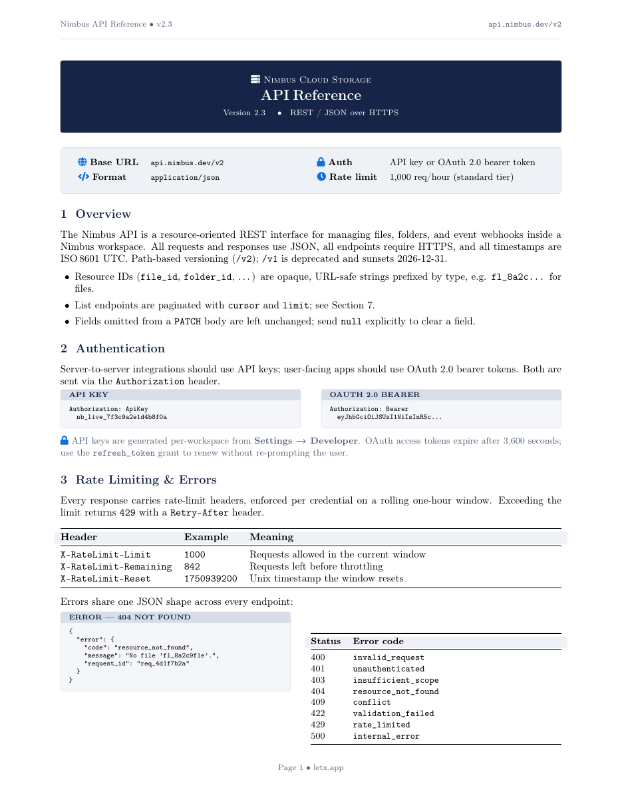</a><br><b>API Documentation (Swagger Style)</b><br><a href="https://letx.app/templates/tech-docs/api-documentation-swagger">Open in LetX</a> · <a href="./tech-docs/api-documentation-swagger">Source</a></td>
<td width="33%" valign="top" align="center"><a href="https://letx.app/templates/tech-docs/database-schema-doc">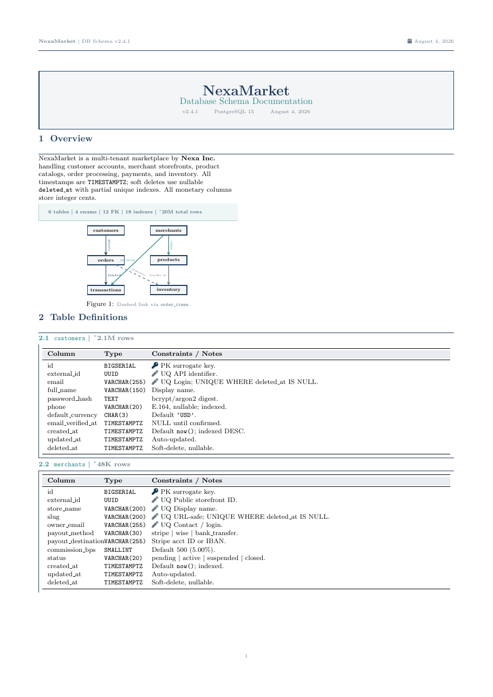</a><br><b>Database Schema Documentation</b><br><a href="https://letx.app/templates/tech-docs/database-schema-doc">Open in LetX</a> · <a href="./tech-docs/database-schema-doc">Source</a></td>
</tr>
<tr>
<td width="33%" valign="top" align="center"><a href="https://letx.app/templates/tech-docs/dataset-datasheet">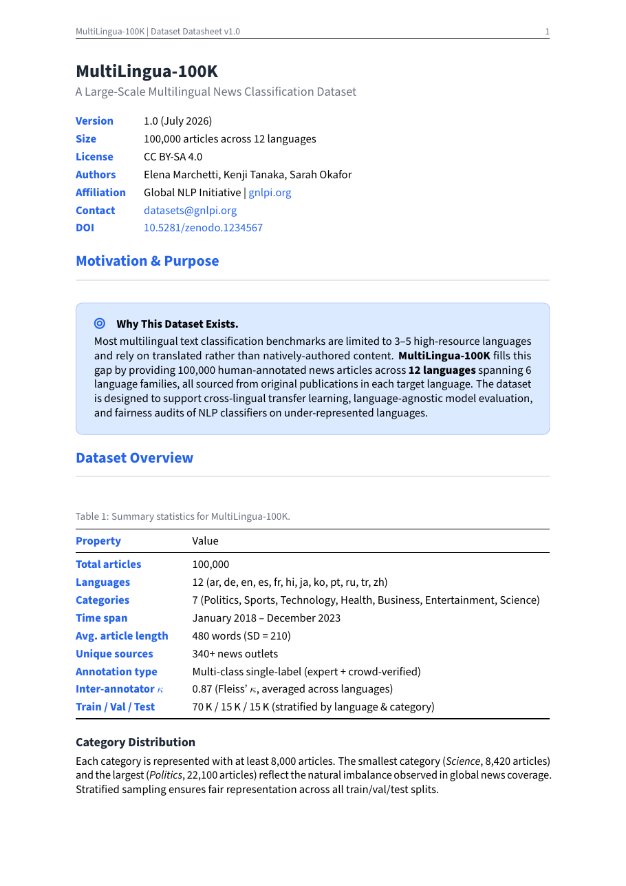</a><br><b>Dataset Datasheet</b><br><a href="https://letx.app/templates/tech-docs/dataset-datasheet">Open in LetX</a> · <a href="./tech-docs/dataset-datasheet">Source</a></td>
<td width="33%" valign="top" align="center"><a href="https://letx.app/templates/tech-docs/disaster-recovery-plan">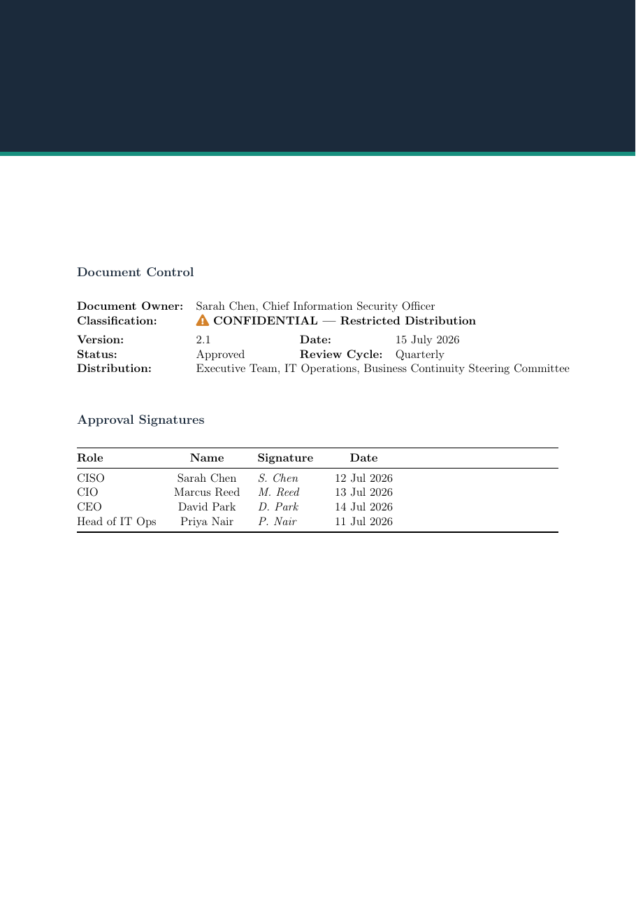</a><br><b>Disaster Recovery Plan</b><br><a href="https://letx.app/templates/tech-docs/disaster-recovery-plan">Open in LetX</a> · <a href="./tech-docs/disaster-recovery-plan">Source</a></td>
<td width="33%" valign="top" align="center"><a href="https://letx.app/templates/tech-docs/engineering-design-doc">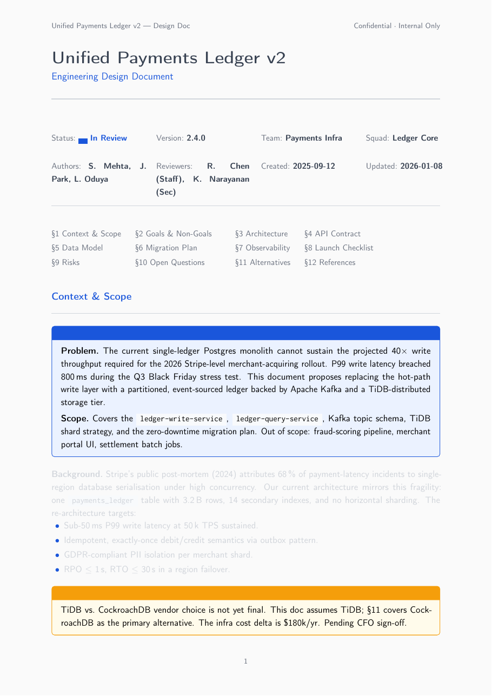</a><br><b>Engineering Design Doc</b><br><a href="https://letx.app/templates/tech-docs/engineering-design-doc">Open in LetX</a> · <a href="./tech-docs/engineering-design-doc">Source</a></td>
</tr>
<tr>
<td width="33%" valign="top" align="center"><a href="https://letx.app/templates/tech-docs/graphql-api-reference">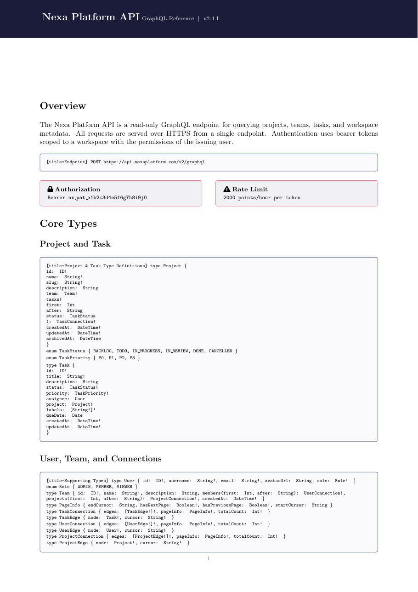</a><br><b>GraphQL API Reference</b><br><a href="https://letx.app/templates/tech-docs/graphql-api-reference">Open in LetX</a> · <a href="./tech-docs/graphql-api-reference">Source</a></td>
<td width="33%" valign="top" align="center"><a href="https://letx.app/templates/tech-docs/incident-postmortem">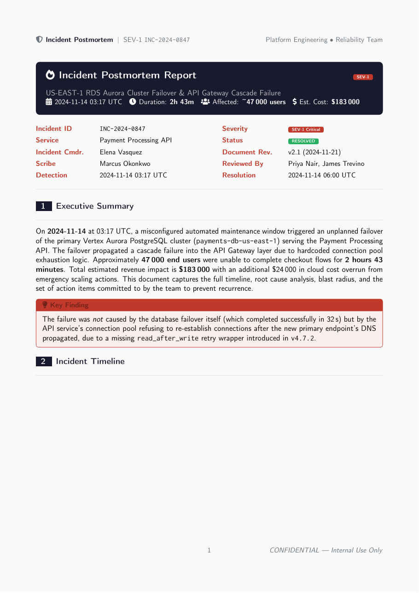</a><br><b>Incident Postmortem</b><br><a href="https://letx.app/templates/tech-docs/incident-postmortem">Open in LetX</a> · <a href="./tech-docs/incident-postmortem">Source</a></td>
<td width="33%" valign="top" align="center"><a href="https://letx.app/templates/tech-docs/model-card-ml">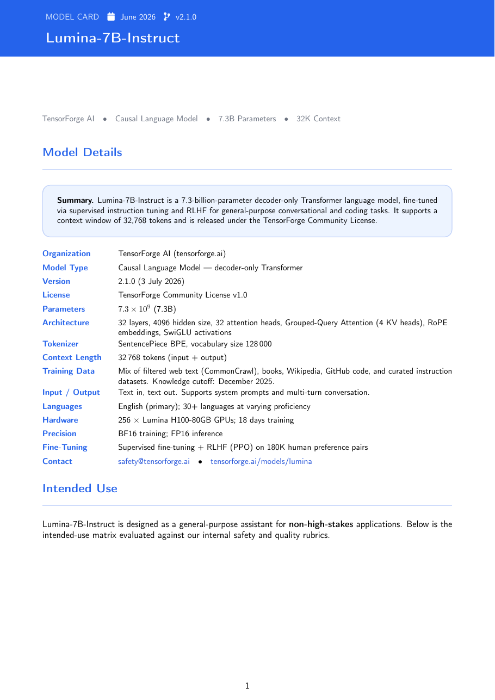</a><br><b>Model Card (ML)</b><br><a href="https://letx.app/templates/tech-docs/model-card-ml">Open in LetX</a> · <a href="./tech-docs/model-card-ml">Source</a></td>
</tr>
<tr>
<td width="33%" valign="top" align="center"><a href="https://letx.app/templates/tech-docs/rest-api-reference">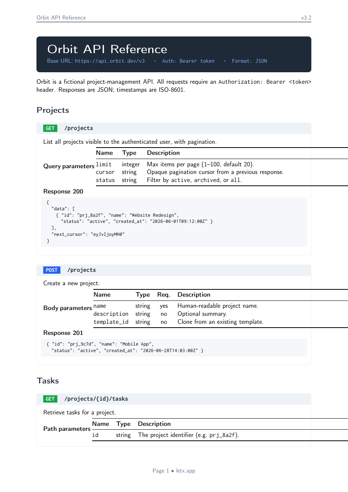</a><br><b>REST API Reference</b><br><a href="https://letx.app/templates/tech-docs/rest-api-reference">Open in LetX</a> · <a href="./tech-docs/rest-api-reference">Source</a></td>
<td width="33%" valign="top" align="center"><a href="https://letx.app/templates/tech-docs/release-notes-template">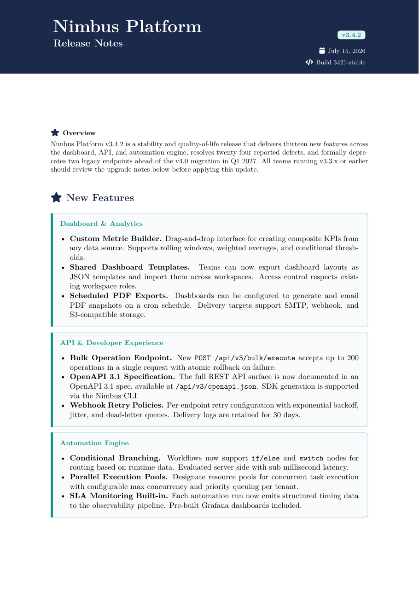</a><br><b>Software Release Notes</b><br><a href="https://letx.app/templates/tech-docs/release-notes-template">Open in LetX</a> · <a href="./tech-docs/release-notes-template">Source</a></td>
<td width="33%" valign="top" align="center"><a href="https://letx.app/templates/tech-docs/system-admin-runbook">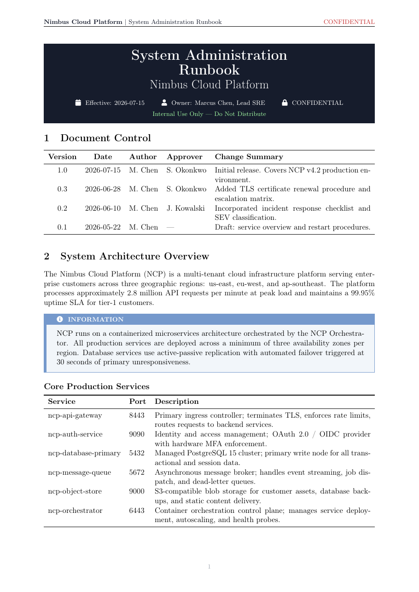</a><br><b>System Administration Runbook</b><br><a href="https://letx.app/templates/tech-docs/system-admin-runbook">Open in LetX</a> · <a href="./tech-docs/system-admin-runbook">Source</a></td>
</tr>
<tr>
<td width="33%" valign="top" align="center"><a href="https://letx.app/templates/tech-docs/technical-rfc">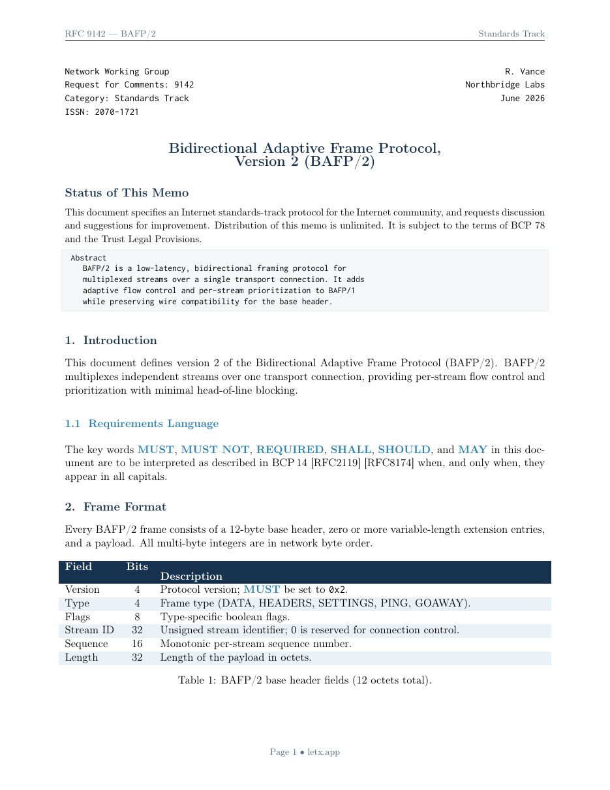</a><br><b>Technical RFC</b><br><a href="https://letx.app/templates/tech-docs/technical-rfc">Open in LetX</a> · <a href="./tech-docs/technical-rfc">Source</a></td>
<td width="33%" valign="top" align="center"><a href="https://letx.app/templates/tech-docs/uat-test-plan">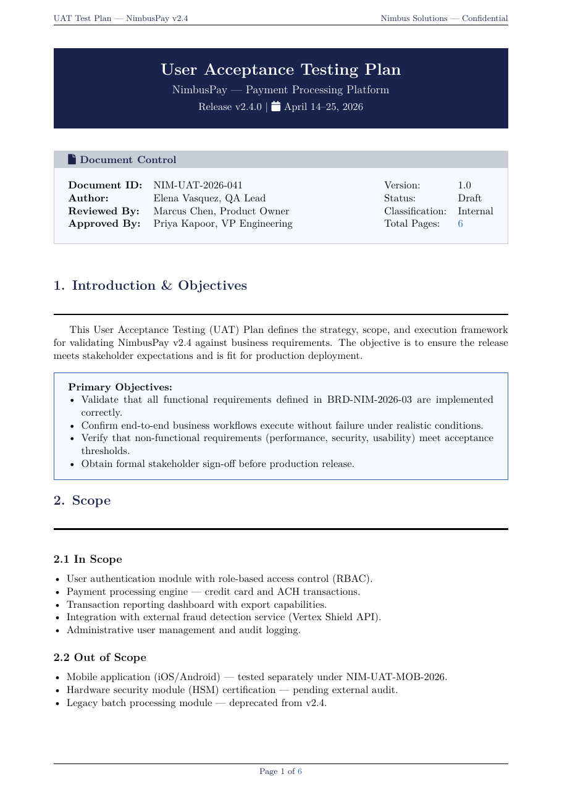</a><br><b>User Acceptance Testing (UAT) Plan</b><br><a href="https://letx.app/templates/tech-docs/uat-test-plan">Open in LetX</a> · <a href="./tech-docs/uat-test-plan">Source</a></td>
</tr>
</table>

### Engineering Reports

17 templates. [Browse this category on LetX](https://letx.app/templates/engineering)

<table>
<tr>
<td width="33%" valign="top" align="center"><a href="https://letx.app/templates/engineering/aerospace-technical-report">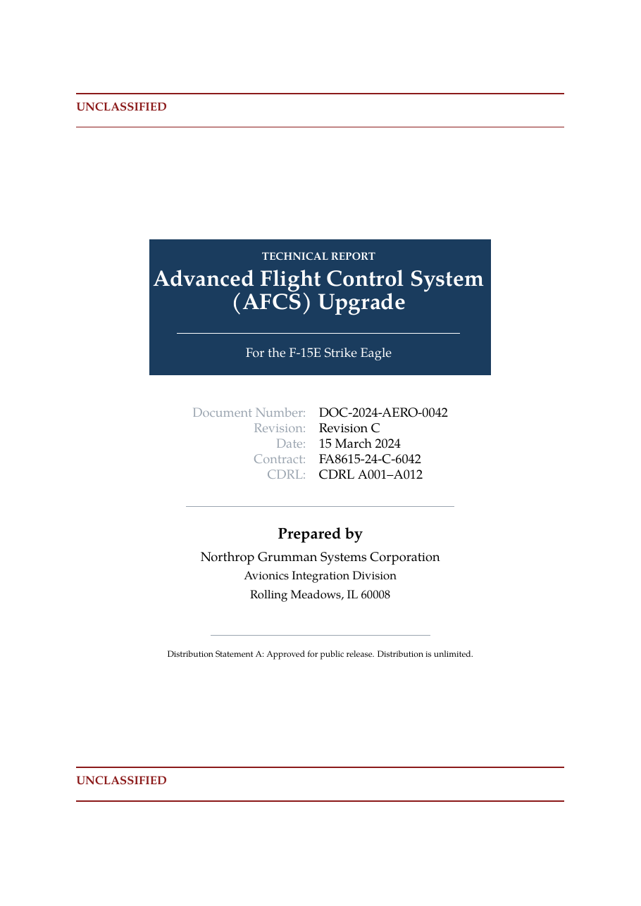</a><br><b>Aerospace Technical Report</b><br><a href="https://letx.app/templates/engineering/aerospace-technical-report">Open in LetX</a> · <a href="./engineering/aerospace-technical-report">Source</a></td>
<td width="33%" valign="top" align="center"><a href="https://letx.app/templates/engineering/application-note-electronics">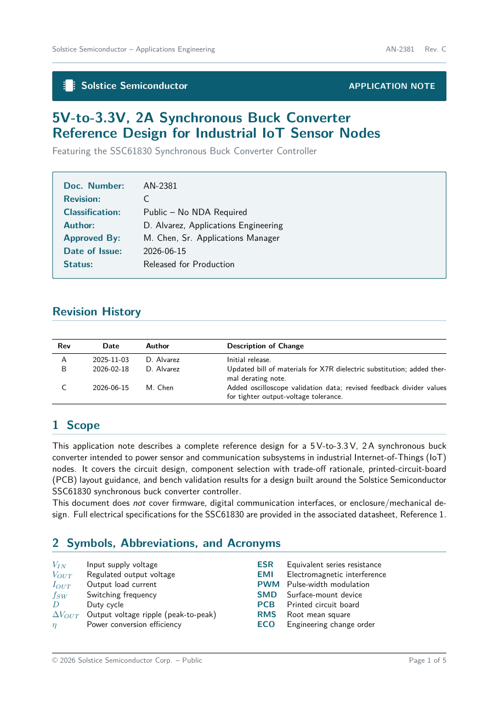</a><br><b>Application Note (Electronics)</b><br><a href="https://letx.app/templates/engineering/application-note-electronics">Open in LetX</a> · <a href="./engineering/application-note-electronics">Source</a></td>
<td width="33%" valign="top" align="center"><a href="https://letx.app/templates/engineering/bill-of-materials-bom">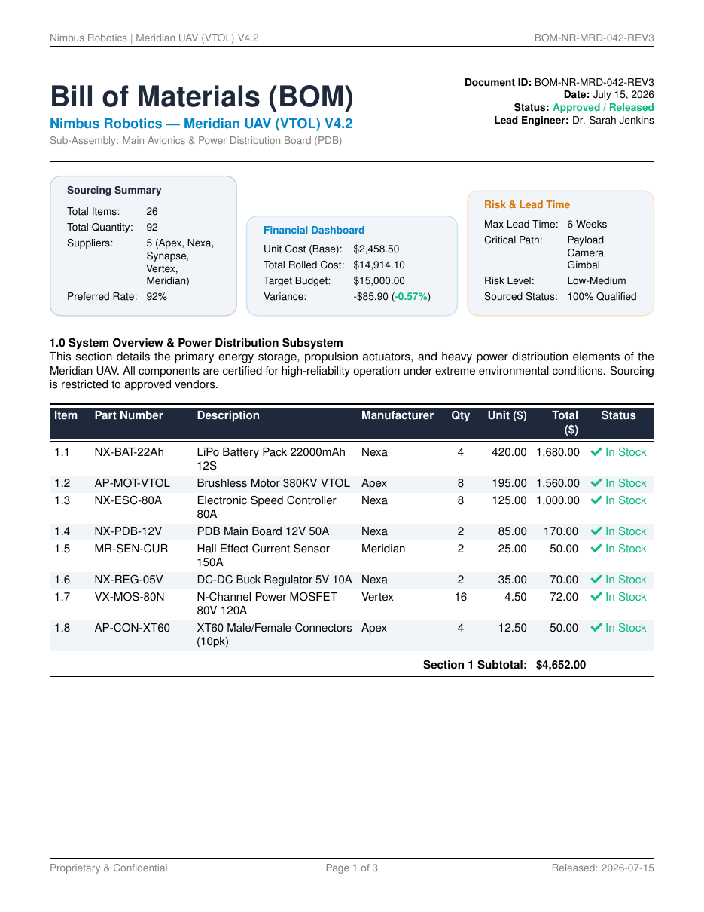</a><br><b>Bill of Materials (BOM)</b><br><a href="https://letx.app/templates/engineering/bill-of-materials-bom">Open in LetX</a> · <a href="./engineering/bill-of-materials-bom">Source</a></td>
</tr>
<tr>
<td width="33%" valign="top" align="center"><a href="https://letx.app/templates/engineering/cad-drawing-title-block">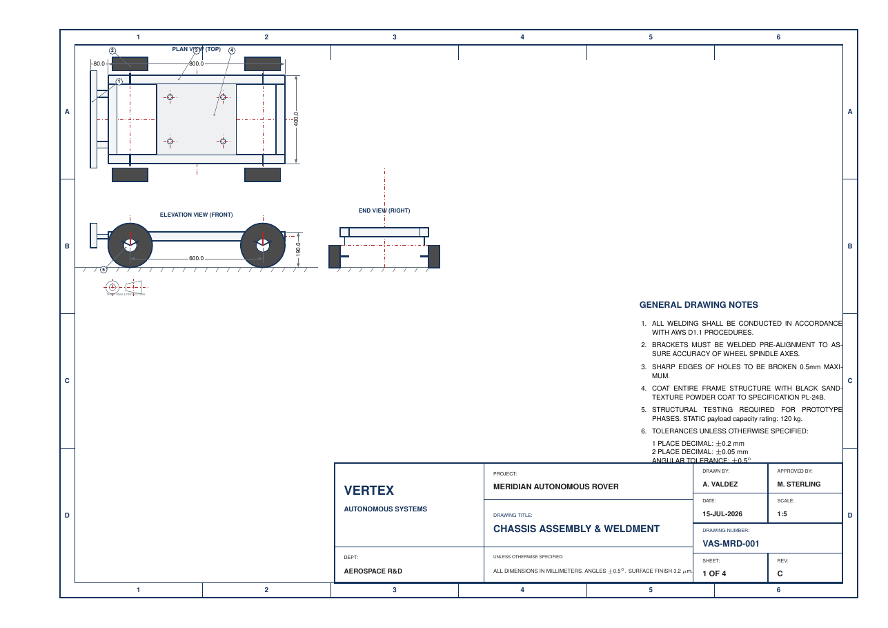</a><br><b>CAD Drawing Title Block</b><br><a href="https://letx.app/templates/engineering/cad-drawing-title-block">Open in LetX</a> · <a href="./engineering/cad-drawing-title-block">Source</a></td>
<td width="33%" valign="top" align="center"><a href="https://letx.app/templates/engineering/semiconductor-datasheet">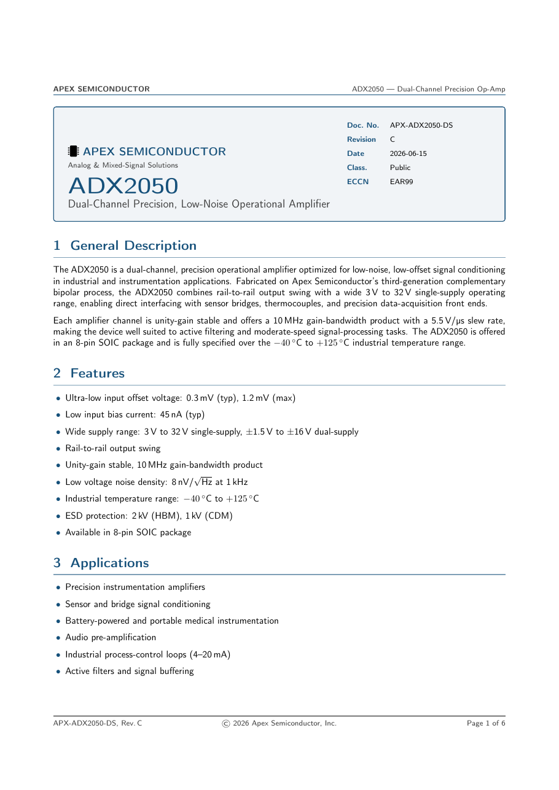</a><br><b>Datasheet (Semiconductor)</b><br><a href="https://letx.app/templates/engineering/semiconductor-datasheet">Open in LetX</a> · <a href="./engineering/semiconductor-datasheet">Source</a></td>
<td width="33%" valign="top" align="center"><a href="https://letx.app/templates/engineering/defense-proposal-white-paper"></a><br><b>Defense Proposal White Paper</b><br><a href="https://letx.app/templates/engineering/defense-proposal-white-paper">Open in LetX</a> · <a href="./engineering/defense-proposal-white-paper">Source</a></td>
</tr>
<tr>
<td width="33%" valign="top" align="center"><a href="https://letx.app/templates/engineering/engineering-calculation-sheet">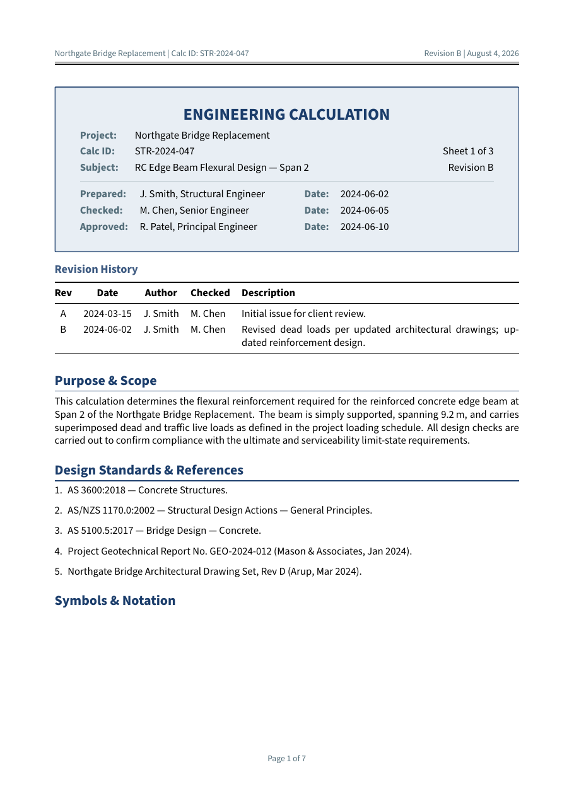</a><br><b>Engineering Calculation Sheet</b><br><a href="https://letx.app/templates/engineering/engineering-calculation-sheet">Open in LetX</a> · <a href="./engineering/engineering-calculation-sheet">Source</a></td>
<td width="33%" valign="top" align="center"><a href="https://letx.app/templates/engineering/engineering-specification">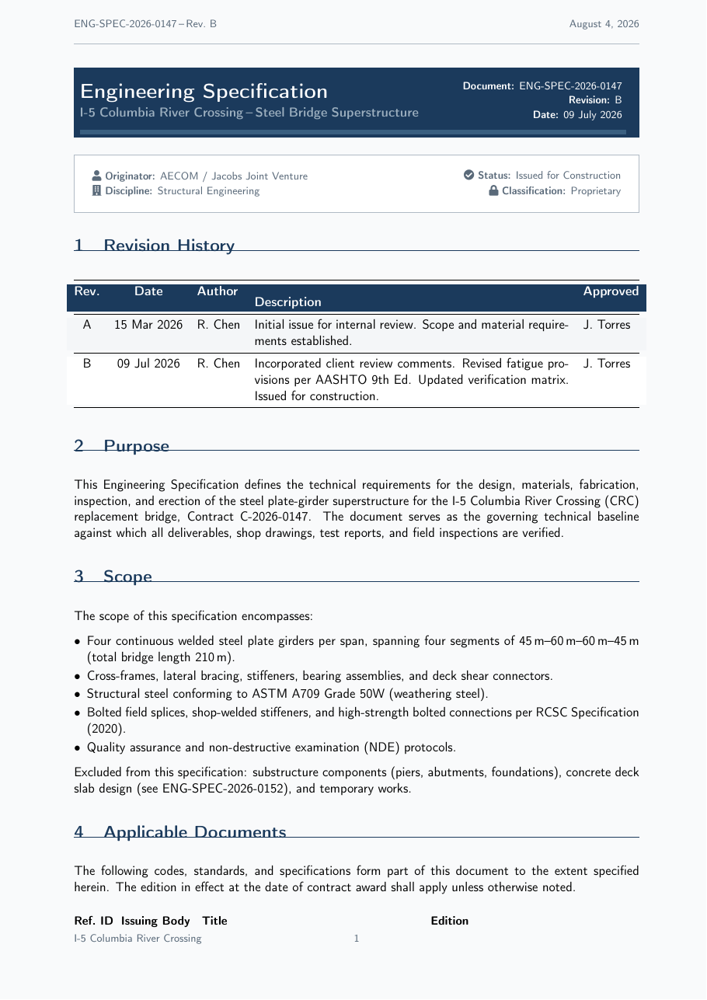</a><br><b>Engineering Specification Document</b><br><a href="https://letx.app/templates/engineering/engineering-specification">Open in LetX</a> · <a href="./engineering/engineering-specification">Source</a></td>
<td width="33%" valign="top" align="center"><a href="https://letx.app/templates/engineering/environmental-impact-assessment">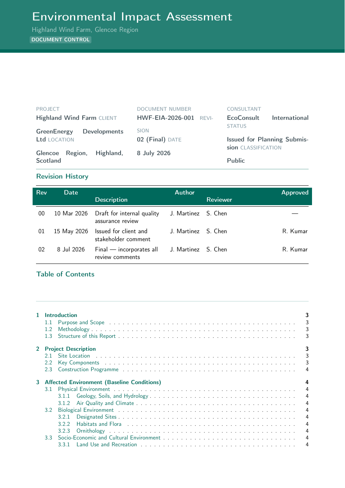</a><br><b>Environmental Impact Assessment</b><br><a href="https://letx.app/templates/engineering/environmental-impact-assessment">Open in LetX</a> · <a href="./engineering/environmental-impact-assessment">Source</a></td>
</tr>
<tr>
<td width="33%" valign="top" align="center"><a href="https://letx.app/templates/engineering/fpga-design-spec">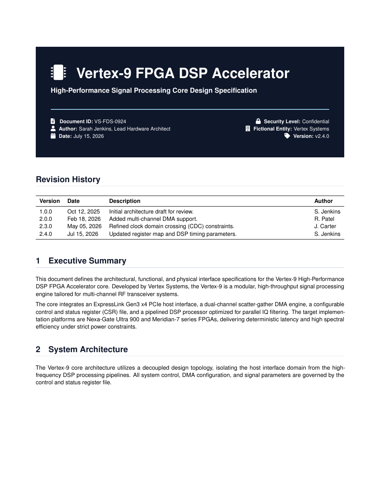</a><br><b>FPGA Design Specification</b><br><a href="https://letx.app/templates/engineering/fpga-design-spec">Open in LetX</a> · <a href="./engineering/fpga-design-spec">Source</a></td>
<td width="33%" valign="top" align="center"><a href="https://letx.app/templates/engineering/ndt-inspection-report">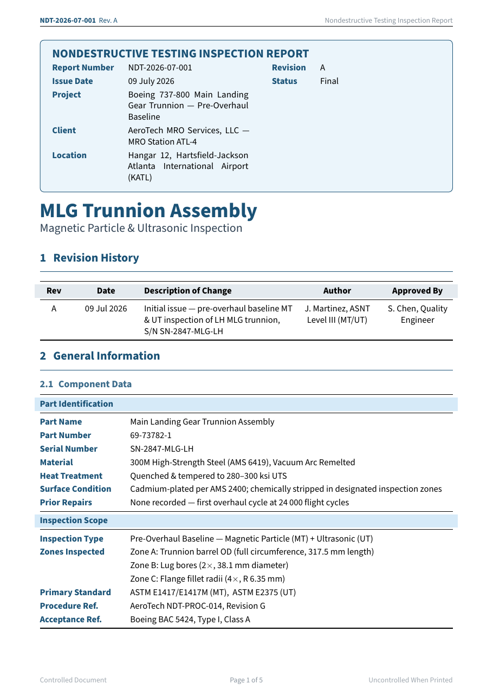</a><br><b>Inspection Report (Nondestructive Testing)</b><br><a href="https://letx.app/templates/engineering/ndt-inspection-report">Open in LetX</a> · <a href="./engineering/ndt-inspection-report">Source</a></td>
<td width="33%" valign="top" align="center"><a href="https://letx.app/templates/engineering/pcb-design-document">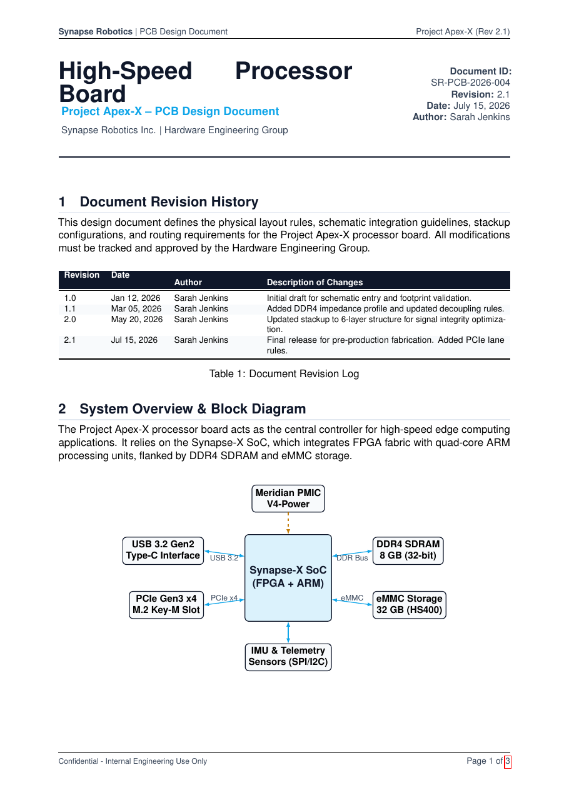</a><br><b>PCB Design Document</b><br><a href="https://letx.app/templates/engineering/pcb-design-document">Open in LetX</a> · <a href="./engineering/pcb-design-document">Source</a></td>
</tr>
<tr>
<td width="33%" valign="top" align="center"><a href="https://letx.app/templates/engineering/qsys-tech-memo">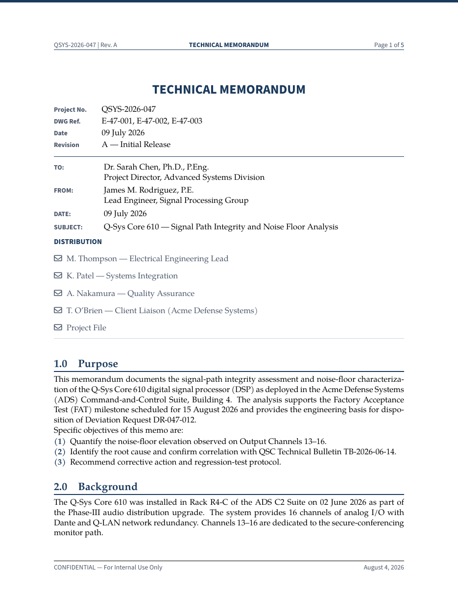</a><br><b>Q-Sys Technical Memo</b><br><a href="https://letx.app/templates/engineering/qsys-tech-memo">Open in LetX</a> · <a href="./engineering/qsys-tech-memo">Source</a></td>
<td width="33%" valign="top" align="center"><a href="https://letx.app/templates/engineering/root-cause-analysis-report">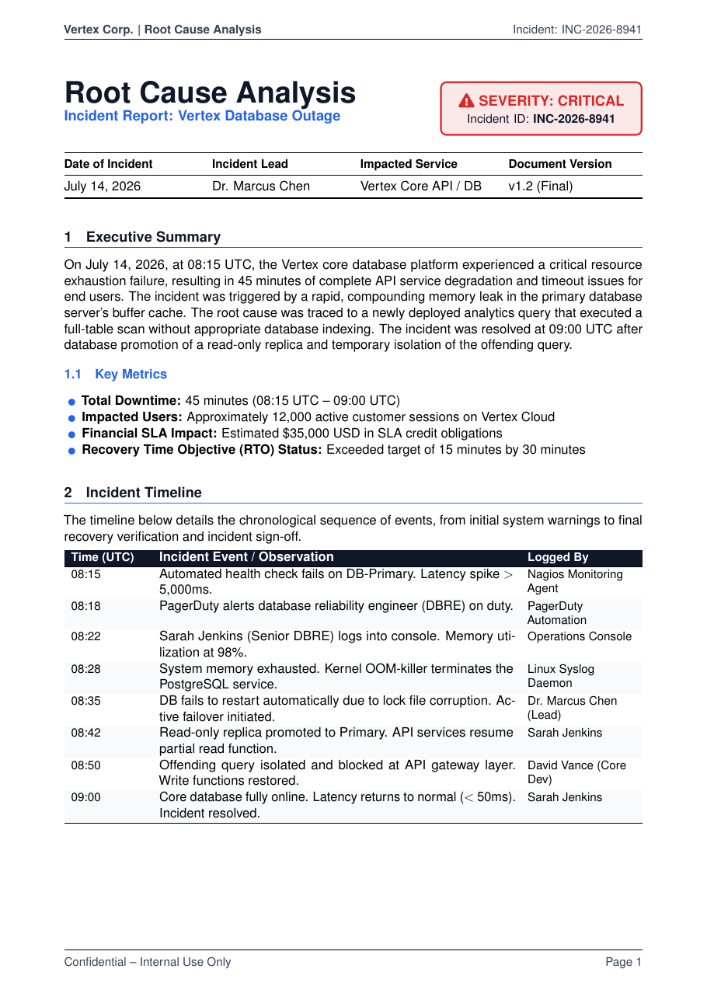</a><br><b>Root Cause Analysis Report</b><br><a href="https://letx.app/templates/engineering/root-cause-analysis-report">Open in LetX</a> · <a href="./engineering/root-cause-analysis-report">Source</a></td>
<td width="33%" valign="top" align="center"><a href="https://letx.app/templates/engineering/software-architecture-doc">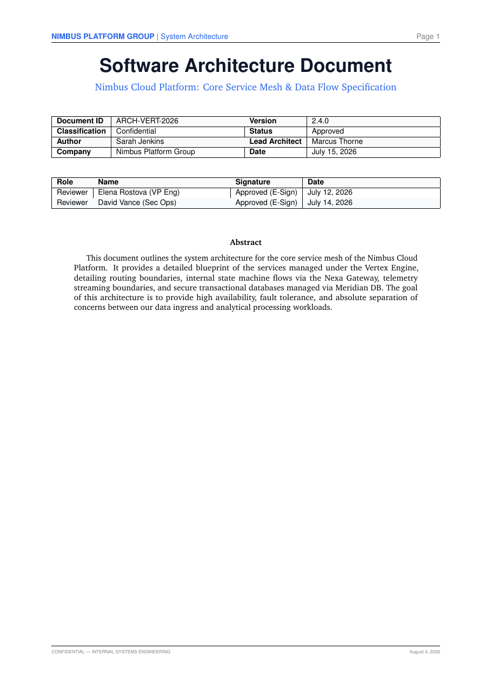</a><br><b>Software Architecture Document</b><br><a href="https://letx.app/templates/engineering/software-architecture-doc">Open in LetX</a> · <a href="./engineering/software-architecture-doc">Source</a></td>
</tr>
<tr>
<td width="33%" valign="top" align="center"><a href="https://letx.app/templates/engineering/systems-engineering-plan">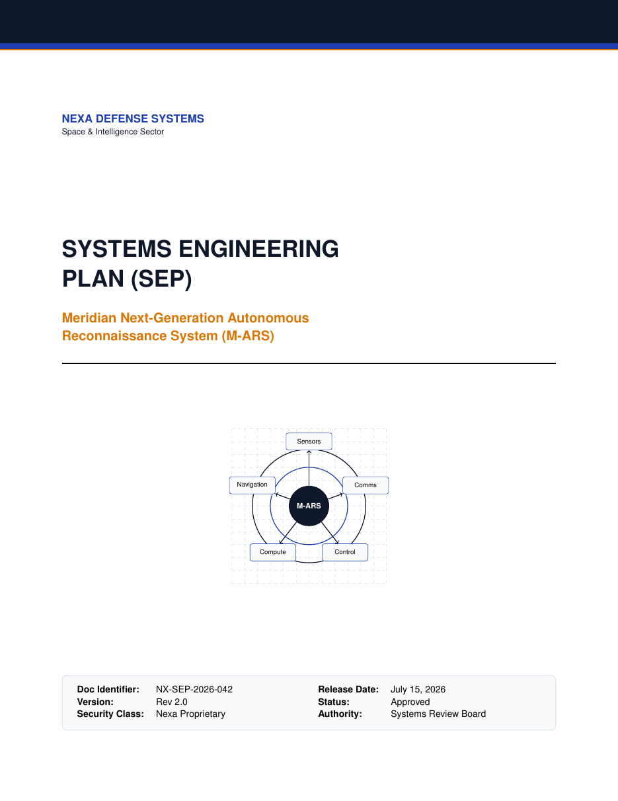</a><br><b>Systems Engineering Plan</b><br><a href="https://letx.app/templates/engineering/systems-engineering-plan">Open in LetX</a> · <a href="./engineering/systems-engineering-plan">Source</a></td>
<td width="33%" valign="top" align="center"><a href="https://letx.app/templates/engineering/test-report-ee-compliance">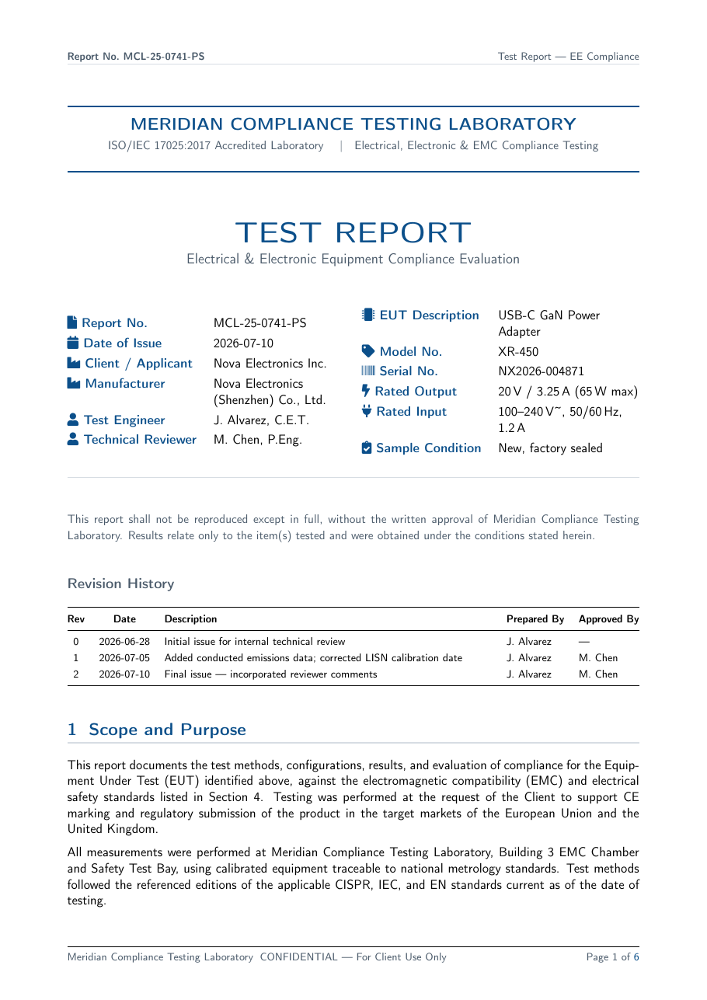</a><br><b>Test Report (EE Compliance)</b><br><a href="https://letx.app/templates/engineering/test-report-ee-compliance">Open in LetX</a> · <a href="./engineering/test-report-ee-compliance">Source</a></td>
</tr>
</table>

### Medical & Clinical

11 templates. [Browse this category on LetX](https://letx.app/templates/medical)

<table>
<tr>
<td width="33%" valign="top" align="center"><a href="https://letx.app/templates/medical/clinical-study-report-ich-e3">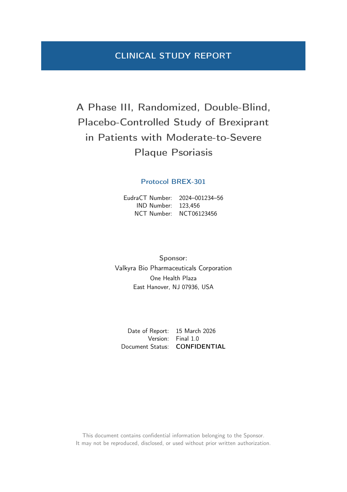</a><br><b>Clinical Study Report (ICH E3)</b><br><a href="https://letx.app/templates/medical/clinical-study-report-ich-e3">Open in LetX</a> · <a href="./medical/clinical-study-report-ich-e3">Source</a></td>
<td width="33%" valign="top" align="center"><a href="https://letx.app/templates/medical/clinical-trial-protocol">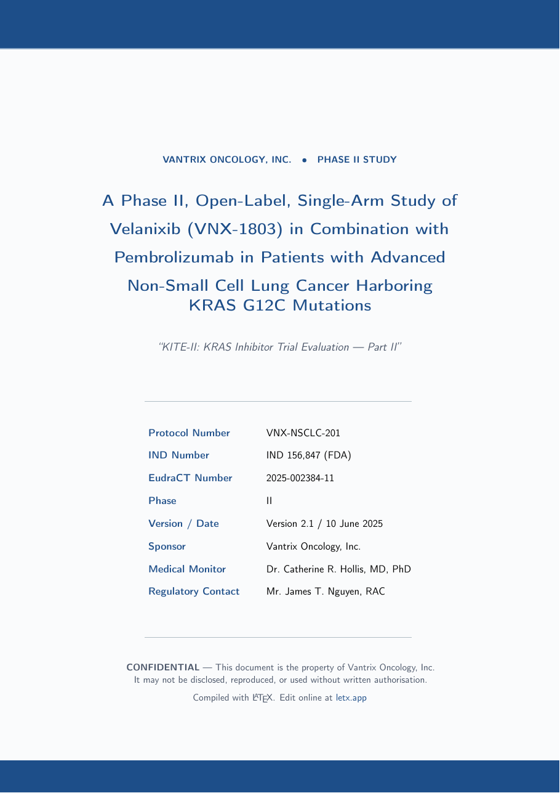</a><br><b>Clinical Trial Protocol</b><br><a href="https://letx.app/templates/medical/clinical-trial-protocol">Open in LetX</a> · <a href="./medical/clinical-trial-protocol">Source</a></td>
<td width="33%" valign="top" align="center"><a href="https://letx.app/templates/medical/dental-treatment-plan">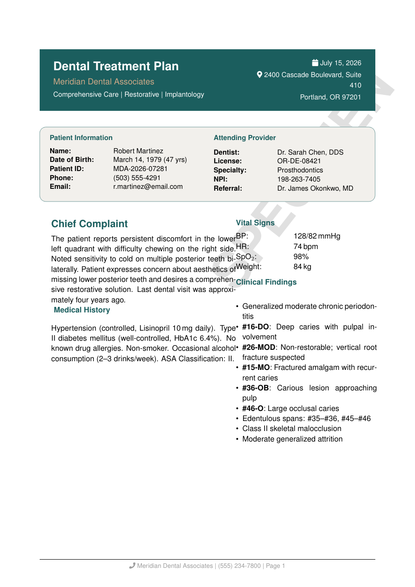</a><br><b>Dental Treatment Plan</b><br><a href="https://letx.app/templates/medical/dental-treatment-plan">Open in LetX</a> · <a href="./medical/dental-treatment-plan">Source</a></td>
</tr>
<tr>
<td width="33%" valign="top" align="center"><a href="https://letx.app/templates/medical/ectd-module-2-summary">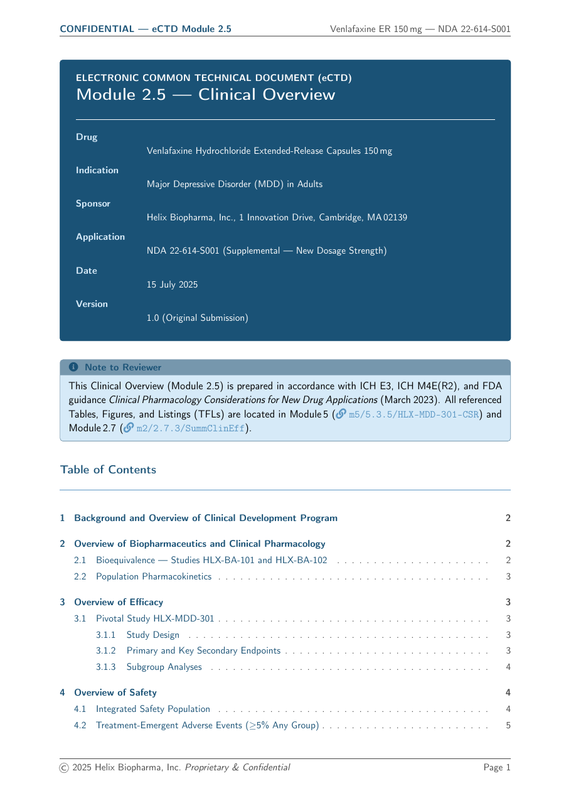</a><br><b>eCTD Module 2 Summary</b><br><a href="https://letx.app/templates/medical/ectd-module-2-summary">Open in LetX</a> · <a href="./medical/ectd-module-2-summary">Source</a></td>
<td width="33%" valign="top" align="center"><a href="https://letx.app/templates/medical/discharge-summary-report">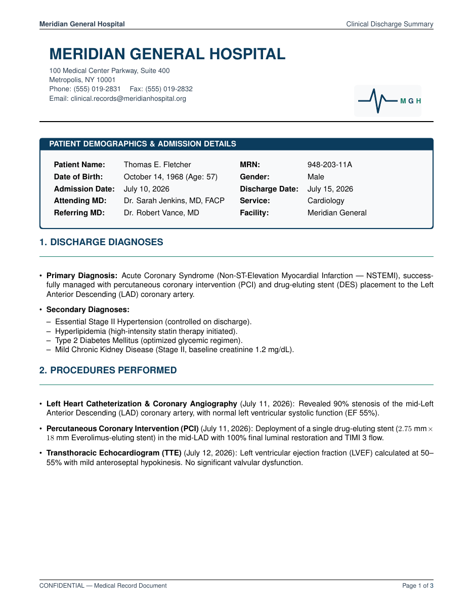</a><br><b>Hospital Discharge Summary</b><br><a href="https://letx.app/templates/medical/discharge-summary-report">Open in LetX</a> · <a href="./medical/discharge-summary-report">Source</a></td>
<td width="33%" valign="top" align="center"><a href="https://letx.app/templates/medical/medical-history-questionnaire">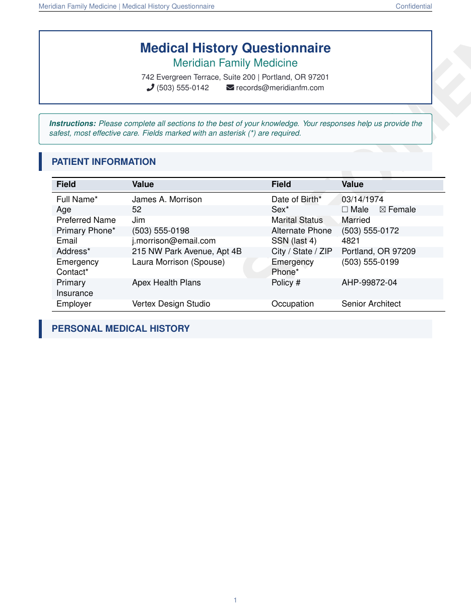</a><br><b>Medical History Questionnaire</b><br><a href="https://letx.app/templates/medical/medical-history-questionnaire">Open in LetX</a> · <a href="./medical/medical-history-questionnaire">Source</a></td>
</tr>
<tr>
<td width="33%" valign="top" align="center"><a href="https://letx.app/templates/medical/patient-intake-form">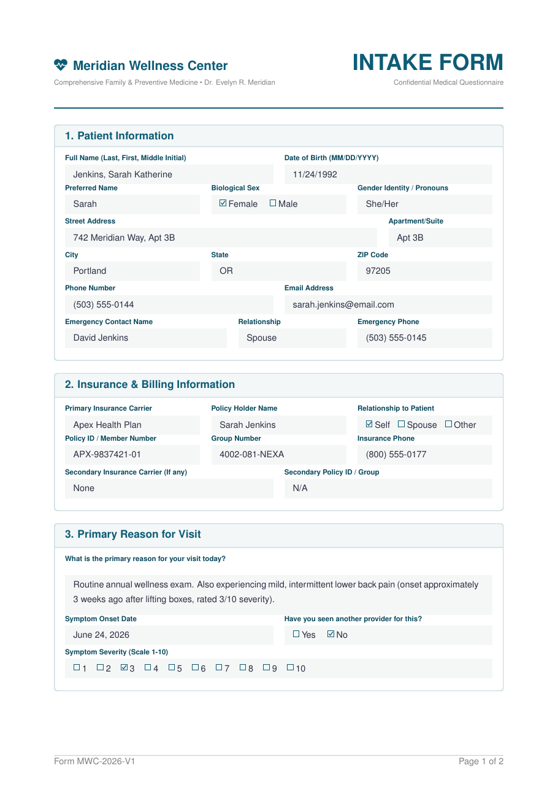</a><br><b>Patient Intake Form</b><br><a href="https://letx.app/templates/medical/patient-intake-form">Open in LetX</a> · <a href="./medical/patient-intake-form">Source</a></td>
<td width="33%" valign="top" align="center"><a href="https://letx.app/templates/medical/prescription-pad-template">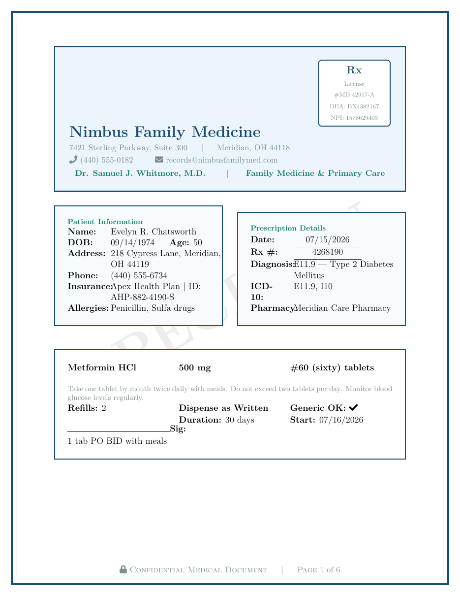</a><br><b>Prescription Pad</b><br><a href="https://letx.app/templates/medical/prescription-pad-template">Open in LetX</a> · <a href="./medical/prescription-pad-template">Source</a></td>
<td width="33%" valign="top" align="center"><a href="https://letx.app/templates/medical/radiology-report-template">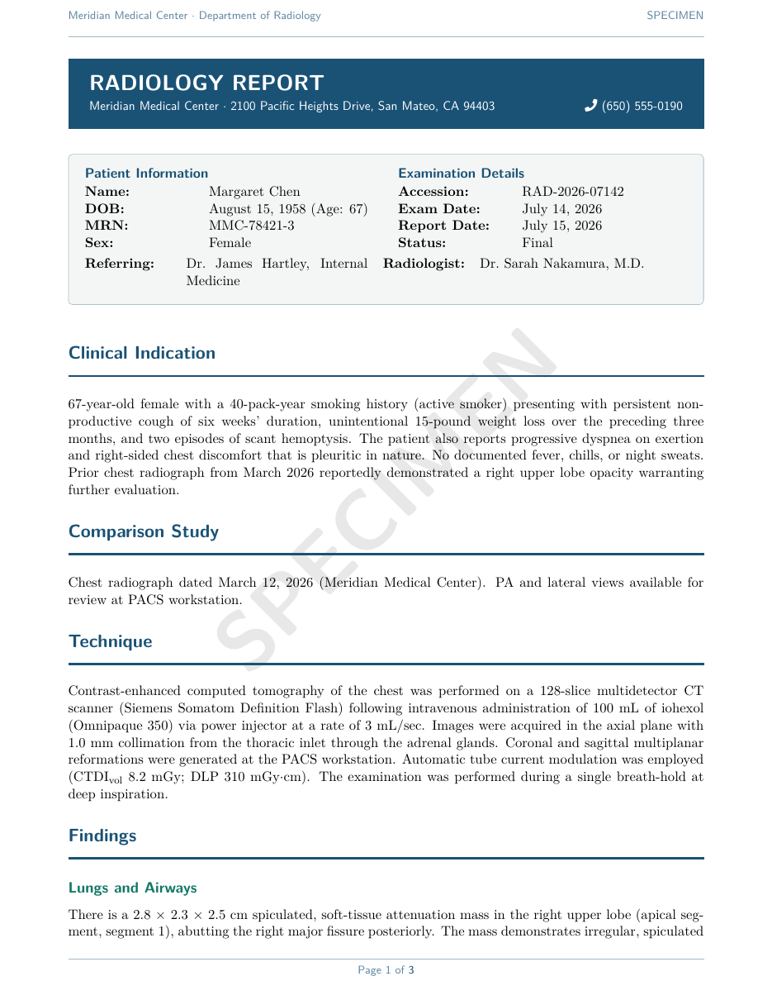</a><br><b>Radiology Report</b><br><a href="https://letx.app/templates/medical/radiology-report-template">Open in LetX</a> · <a href="./medical/radiology-report-template">Source</a></td>
</tr>
<tr>
<td width="33%" valign="top" align="center"><a href="https://letx.app/templates/medical/statistical-analysis-plan">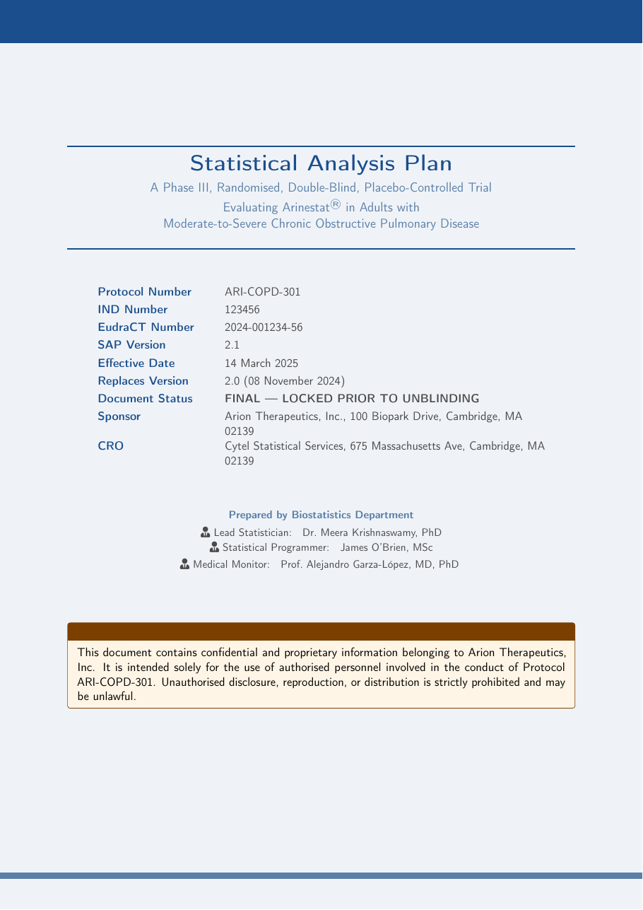</a><br><b>Statistical Analysis Plan (SAP)</b><br><a href="https://letx.app/templates/medical/statistical-analysis-plan">Open in LetX</a> · <a href="./medical/statistical-analysis-plan">Source</a></td>
<td width="33%" valign="top" align="center"><a href="https://letx.app/templates/medical/surgical-operative-report">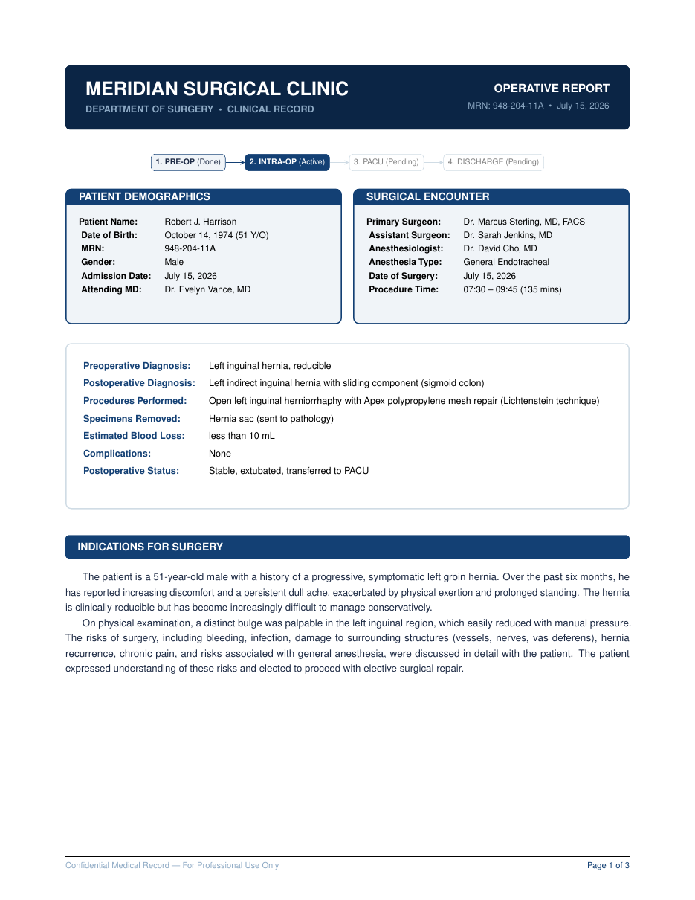</a><br><b>Surgical Operative Report</b><br><a href="https://letx.app/templates/medical/surgical-operative-report">Open in LetX</a> · <a href="./medical/surgical-operative-report">Source</a></td>
</tr>
</table>

### Legal Documents

11 templates. [Browse this category on LetX](https://letx.app/templates/legal)

<table>
<tr>
<td width="33%" valign="top" align="center"><a href="https://letx.app/templates/legal/case-brief-law-school">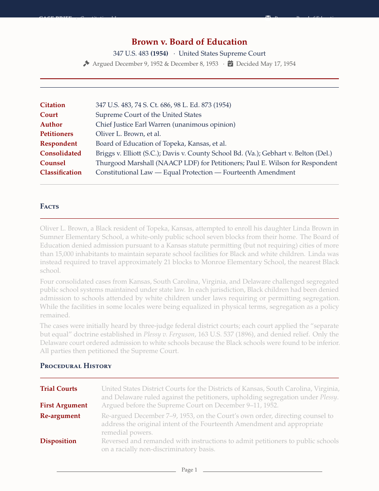</a><br><b>Case Brief (Law School)</b><br><a href="https://letx.app/templates/legal/case-brief-law-school">Open in LetX</a> · <a href="./legal/case-brief-law-school">Source</a></td>
<td width="33%" valign="top" align="center"><a href="https://letx.app/templates/legal/lease-agreement-commercial">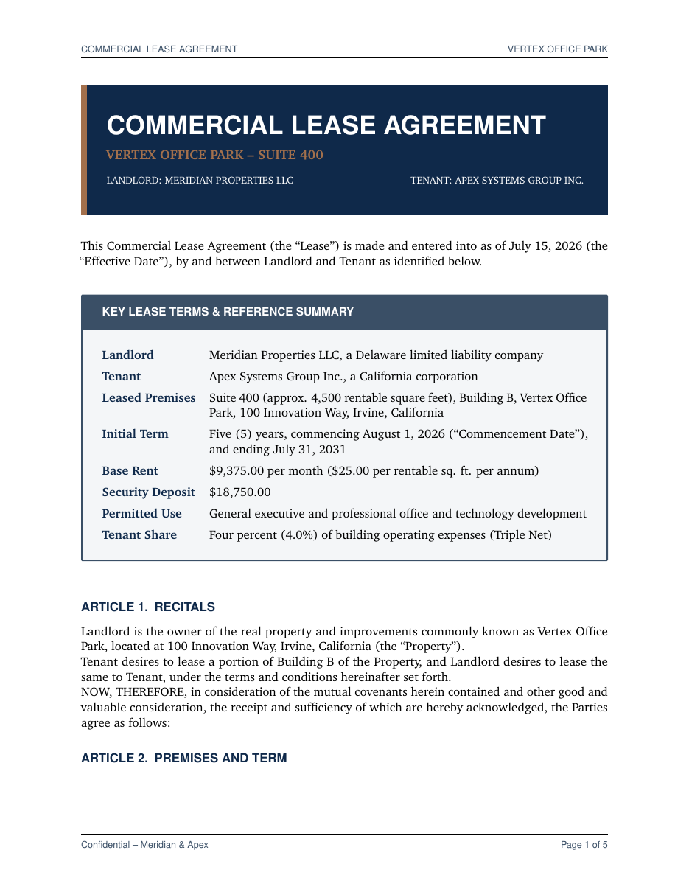</a><br><b>Commercial Lease Agreement</b><br><a href="https://letx.app/templates/legal/lease-agreement-commercial">Open in LetX</a> · <a href="./legal/lease-agreement-commercial">Source</a></td>
<td width="33%" valign="top" align="center"><a href="https://letx.app/templates/legal/contract-agreement">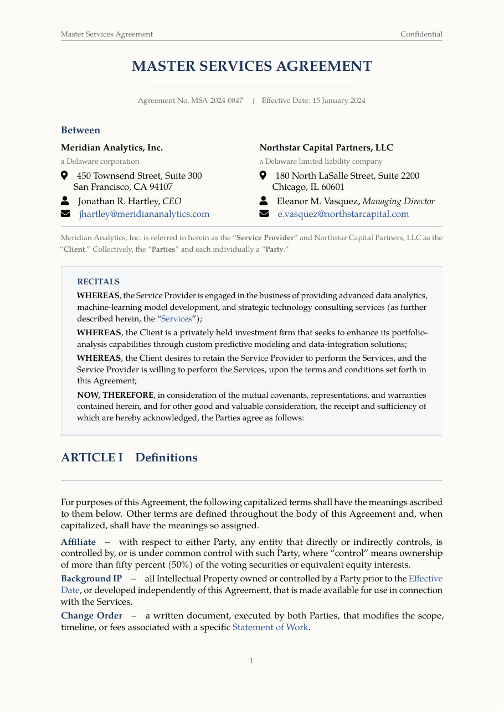</a><br><b>Contract Agreement</b><br><a href="https://letx.app/templates/legal/contract-agreement">Open in LetX</a> · <a href="./legal/contract-agreement">Source</a></td>
</tr>
<tr>
<td width="33%" valign="top" align="center"><a href="https://letx.app/templates/legal/ip-assignment-agreement">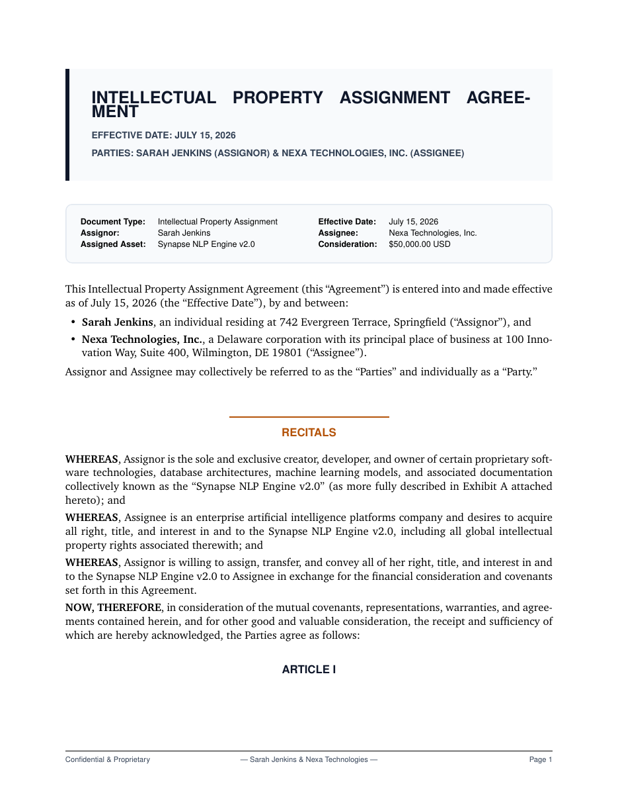</a><br><b>IP Assignment Agreement</b><br><a href="https://letx.app/templates/legal/ip-assignment-agreement">Open in LetX</a> · <a href="./legal/ip-assignment-agreement">Source</a></td>
<td width="33%" valign="top" align="center"><a href="https://letx.app/templates/legal/legal-brief">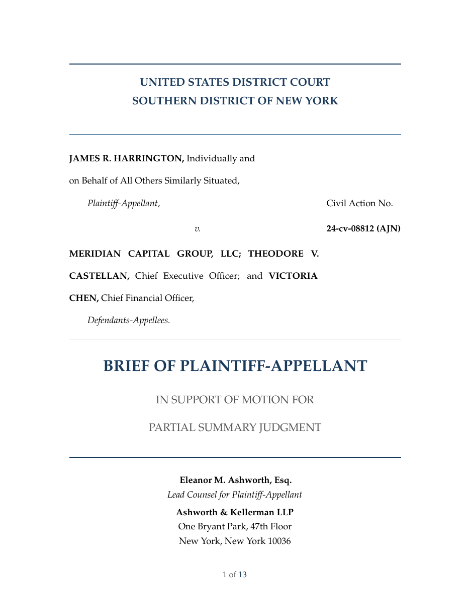</a><br><b>Legal Brief (Litigation)</b><br><a href="https://letx.app/templates/legal/legal-brief">Open in LetX</a> · <a href="./legal/legal-brief">Source</a></td>
<td width="33%" valign="top" align="center"><a href="https://letx.app/templates/legal/legal-memorandum">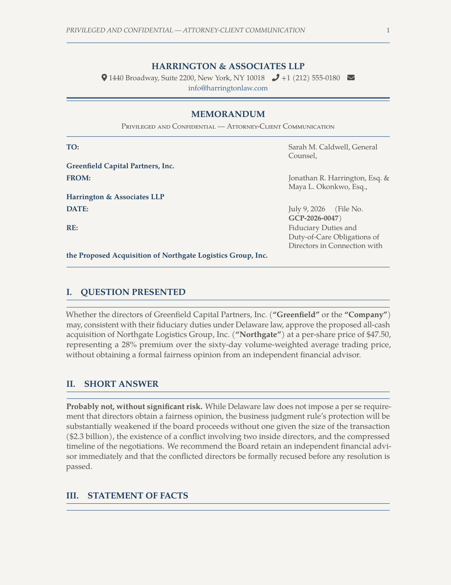</a><br><b>Legal Memorandum</b><br><a href="https://letx.app/templates/legal/legal-memorandum">Open in LetX</a> · <a href="./legal/legal-memorandum">Source</a></td>
</tr>
<tr>
<td width="33%" valign="top" align="center"><a href="https://letx.app/templates/legal/legal-pleading-paper">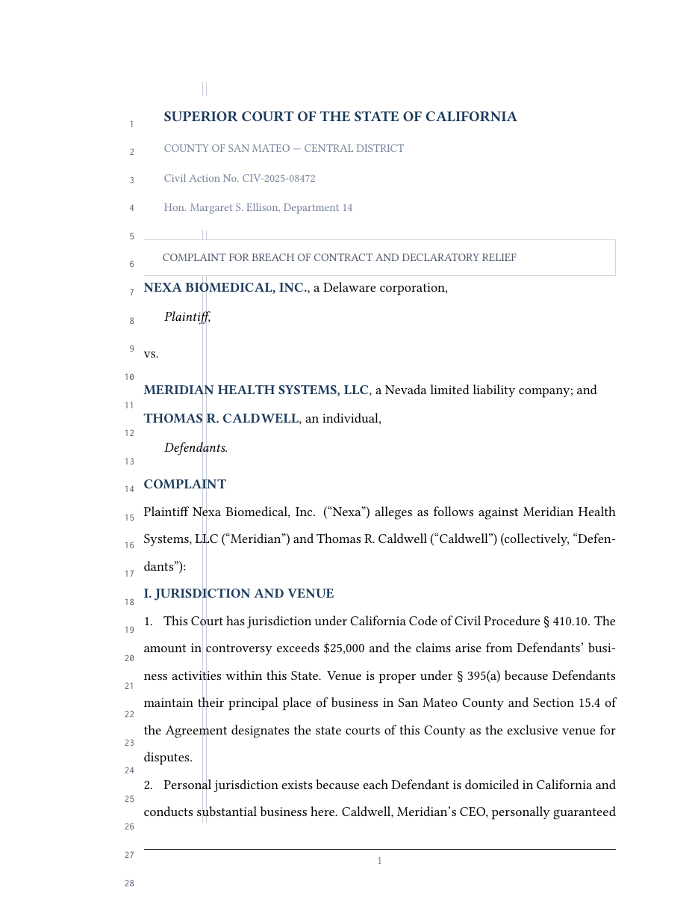</a><br><b>Legal Pleading Paper</b><br><a href="https://letx.app/templates/legal/legal-pleading-paper">Open in LetX</a> · <a href="./legal/legal-pleading-paper">Source</a></td>
<td width="33%" valign="top" align="center"><a href="https://letx.app/templates/legal/non-compete-agreement">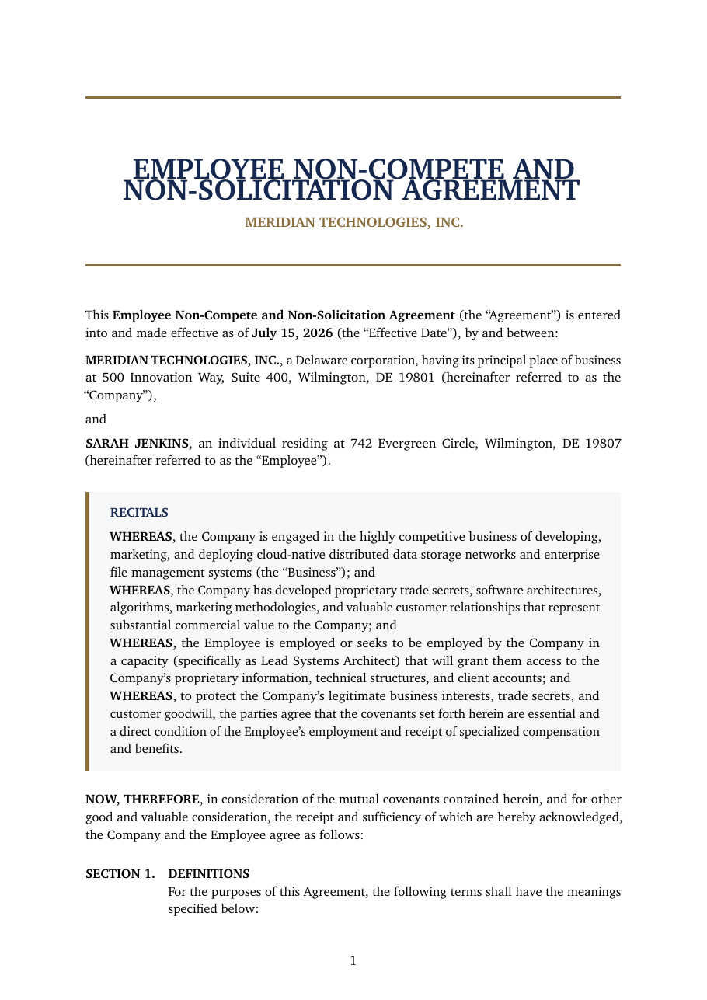</a><br><b>Non-Compete Agreement</b><br><a href="https://letx.app/templates/legal/non-compete-agreement">Open in LetX</a> · <a href="./legal/non-compete-agreement">Source</a></td>
<td width="33%" valign="top" align="center"><a href="https://letx.app/templates/legal/patent-specification-uspto">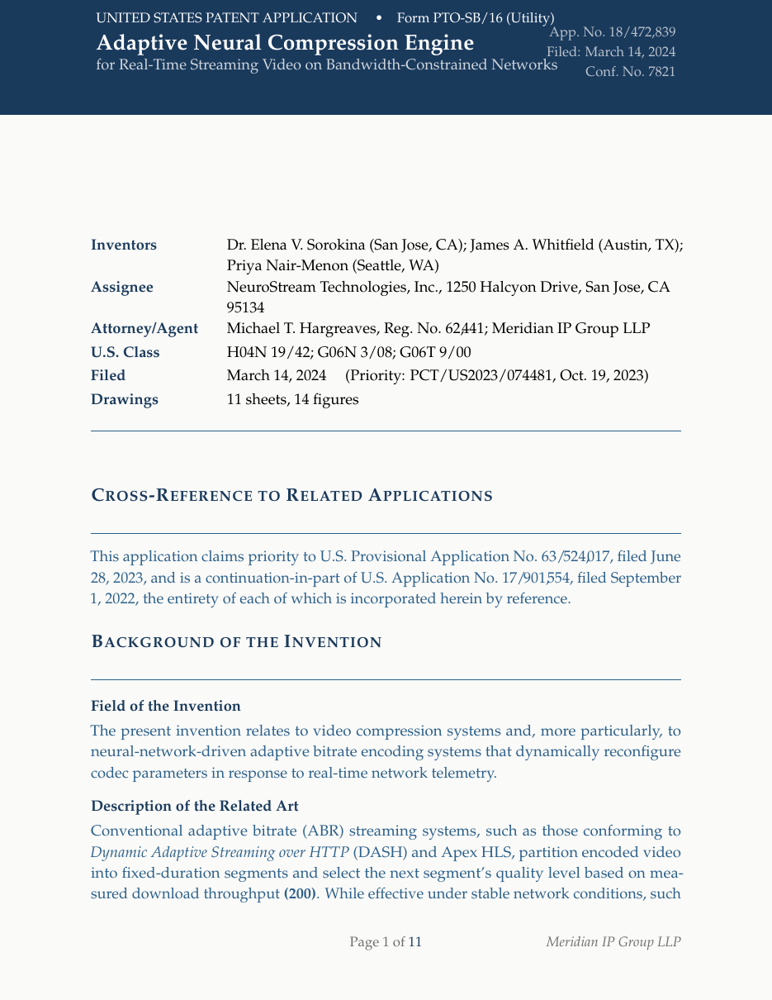</a><br><b>Patent Specification (USPTO)</b><br><a href="https://letx.app/templates/legal/patent-specification-uspto">Open in LetX</a> · <a href="./legal/patent-specification-uspto">Source</a></td>
</tr>
<tr>
<td width="33%" valign="top" align="center"><a href="https://letx.app/templates/legal/power-of-attorney-form">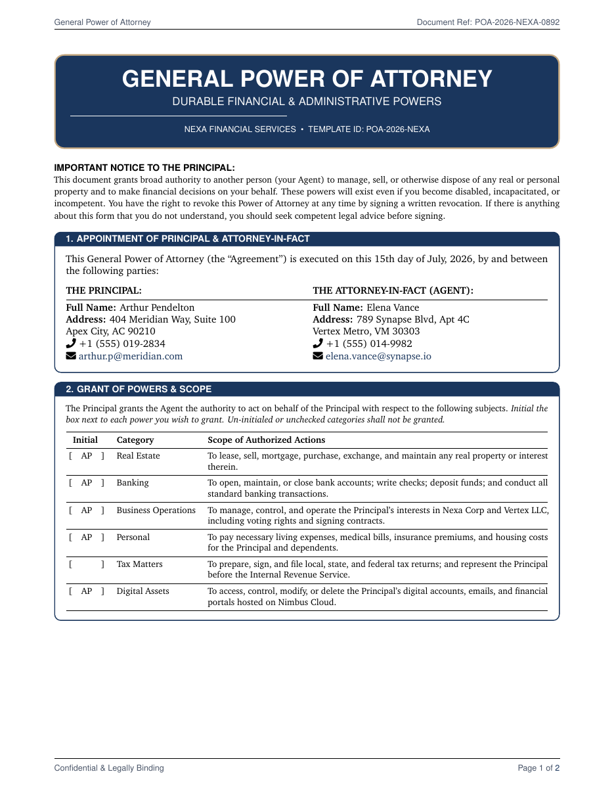</a><br><b>Power of Attorney Form</b><br><a href="https://letx.app/templates/legal/power-of-attorney-form">Open in LetX</a> · <a href="./legal/power-of-attorney-form">Source</a></td>
<td width="33%" valign="top" align="center"><a href="https://letx.app/templates/legal/affidavit-template">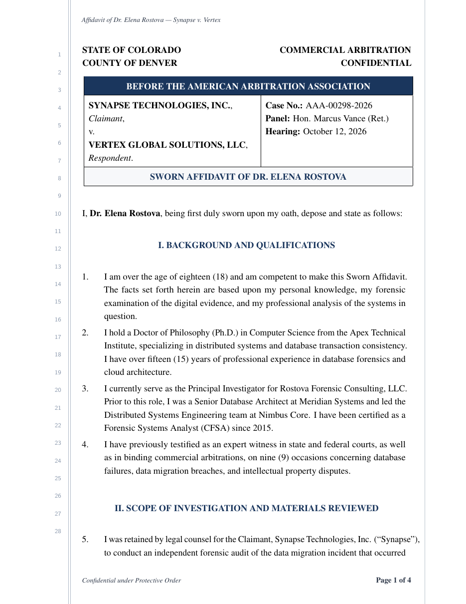</a><br><b>Sworn Affidavit</b><br><a href="https://letx.app/templates/legal/affidavit-template">Open in LetX</a> · <a href="./legal/affidavit-template">Source</a></td>
</tr>
</table>

### Finance & Business

16 templates. [Browse this category on LetX](https://letx.app/templates/finance)

<table>
<tr>
<td width="33%" valign="top" align="center"><a href="https://letx.app/templates/finance/actuarial-valuation-report">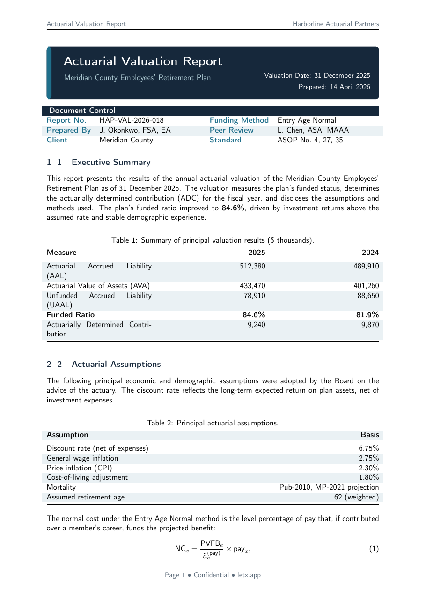</a><br><b>Actuarial Valuation Report</b><br><a href="https://letx.app/templates/finance/actuarial-valuation-report">Open in LetX</a> · <a href="./finance/actuarial-valuation-report">Source</a></td>
<td width="33%" valign="top" align="center"><a href="https://letx.app/templates/finance/financial-statement-annual">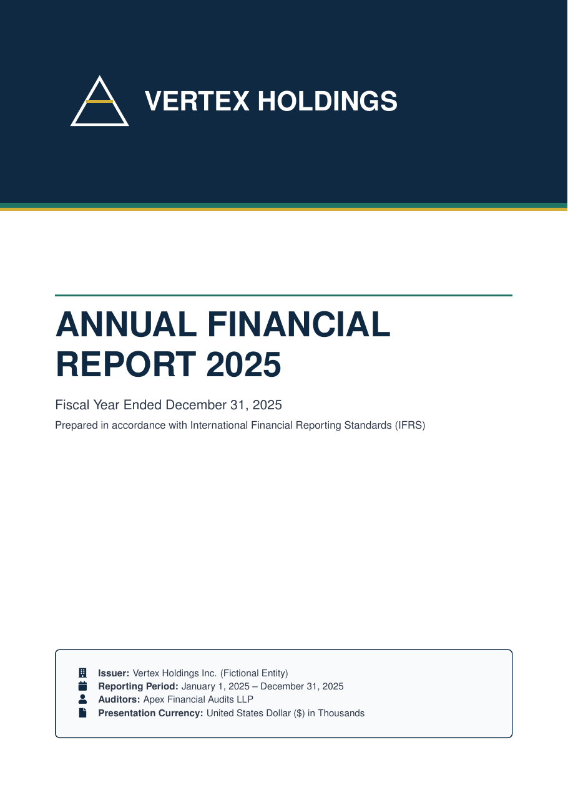</a><br><b>Annual Financial Statement</b><br><a href="https://letx.app/templates/finance/financial-statement-annual">Open in LetX</a> · <a href="./finance/financial-statement-annual">Source</a></td>
<td width="33%" valign="top" align="center"><a href="https://letx.app/templates/finance/income-statement-balance-sheet">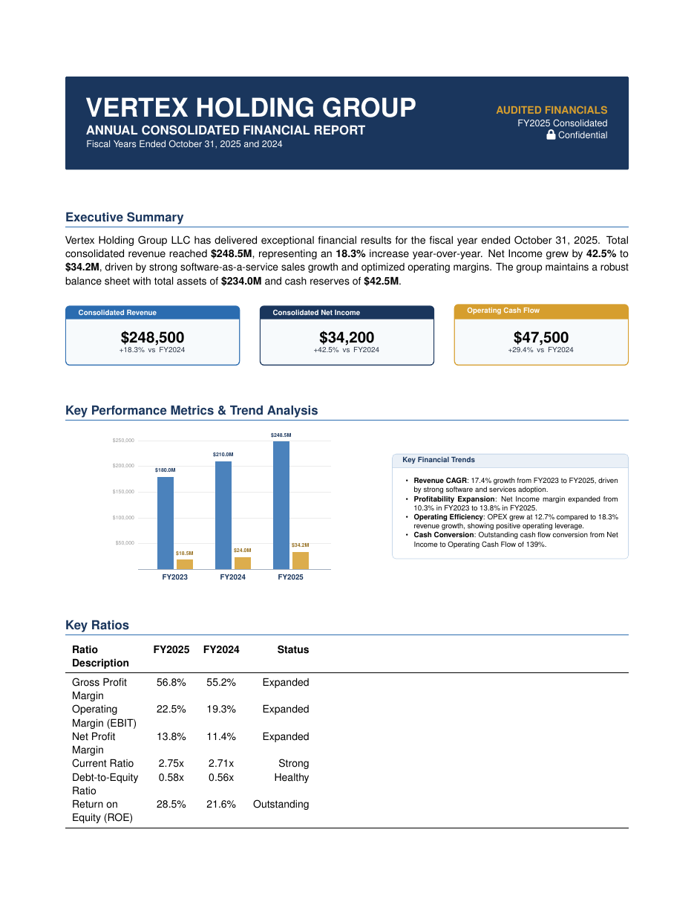</a><br><b>Balance Sheet & Income Statement</b><br><a href="https://letx.app/templates/finance/income-statement-balance-sheet">Open in LetX</a> · <a href="./finance/income-statement-balance-sheet">Source</a></td>
</tr>
<tr>
<td width="33%" valign="top" align="center"><a href="https://letx.app/templates/finance/biotech-pitch-deck"></a><br><b>Biotech Pitch Deck</b><br><a href="https://letx.app/templates/finance/biotech-pitch-deck">Open in LetX</a> · <a href="./finance/biotech-pitch-deck">Source</a></td>
<td width="33%" valign="top" align="center"><a href="https://letx.app/templates/finance/corporate-finance-report">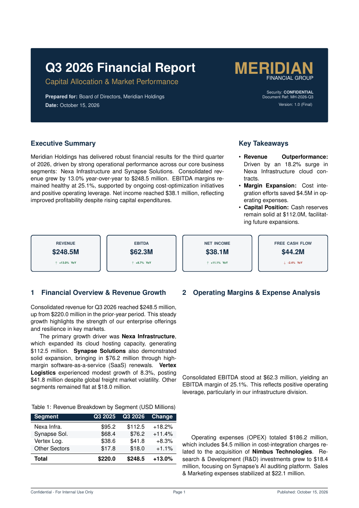</a><br><b>Corporate Finance Report</b><br><a href="https://letx.app/templates/finance/corporate-finance-report">Open in LetX</a> · <a href="./finance/corporate-finance-report">Source</a></td>
<td width="33%" valign="top" align="center"><a href="https://letx.app/templates/finance/crypto-whitepaper">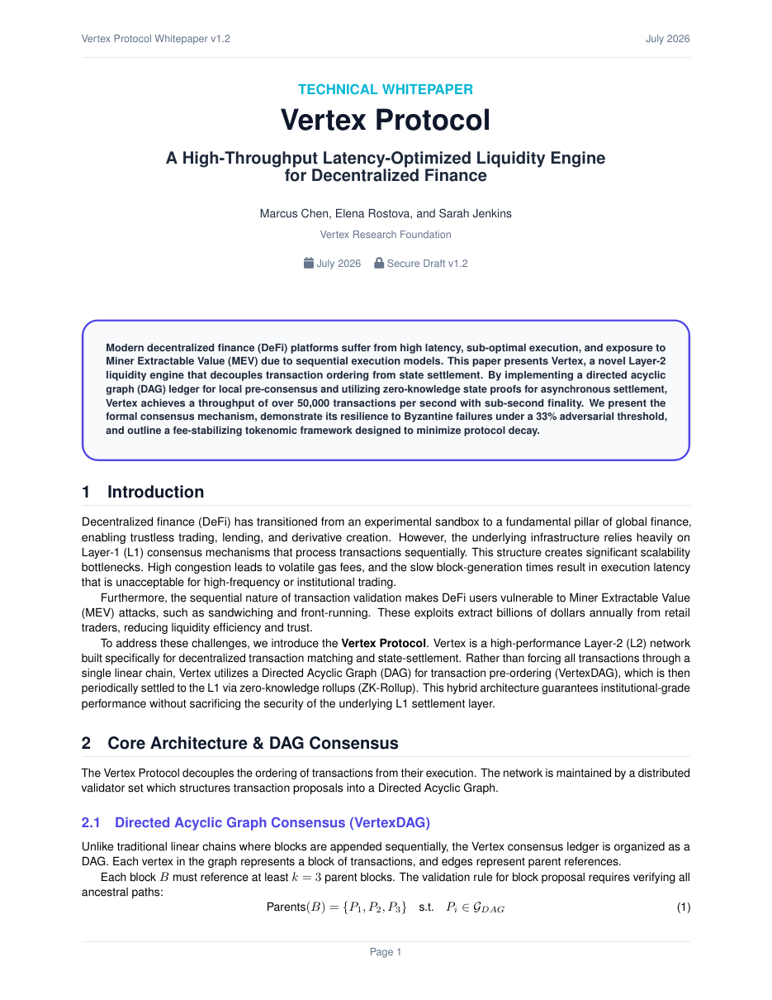</a><br><b>Cryptocurrency Whitepaper</b><br><a href="https://letx.app/templates/finance/crypto-whitepaper">Open in LetX</a> · <a href="./finance/crypto-whitepaper">Source</a></td>
</tr>
<tr>
<td width="33%" valign="top" align="center"><a href="https://letx.app/templates/finance/etf-factsheet">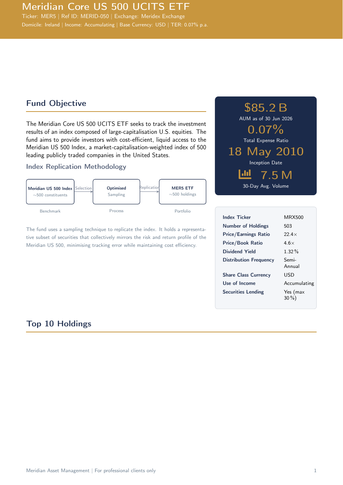</a><br><b>ETF Factsheet</b><br><a href="https://letx.app/templates/finance/etf-factsheet">Open in LetX</a> · <a href="./finance/etf-factsheet">Source</a></td>
<td width="33%" valign="top" align="center"><a href="https://letx.app/templates/finance/hedge-fund-pitch-deck">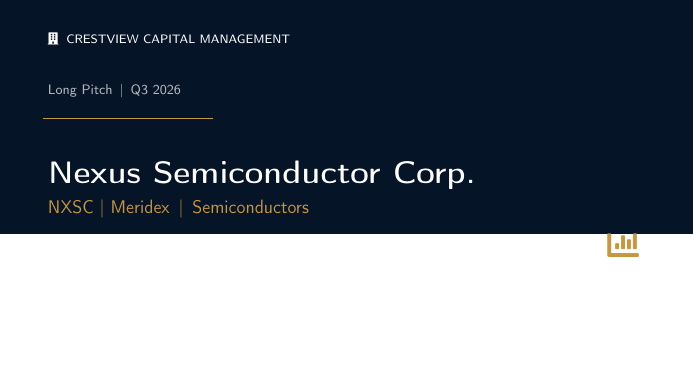</a><br><b>Hedge Fund Pitch Deck</b><br><a href="https://letx.app/templates/finance/hedge-fund-pitch-deck">Open in LetX</a> · <a href="./finance/hedge-fund-pitch-deck">Source</a></td>
<td width="33%" valign="top" align="center"><a href="https://letx.app/templates/finance/investment-tearsheet">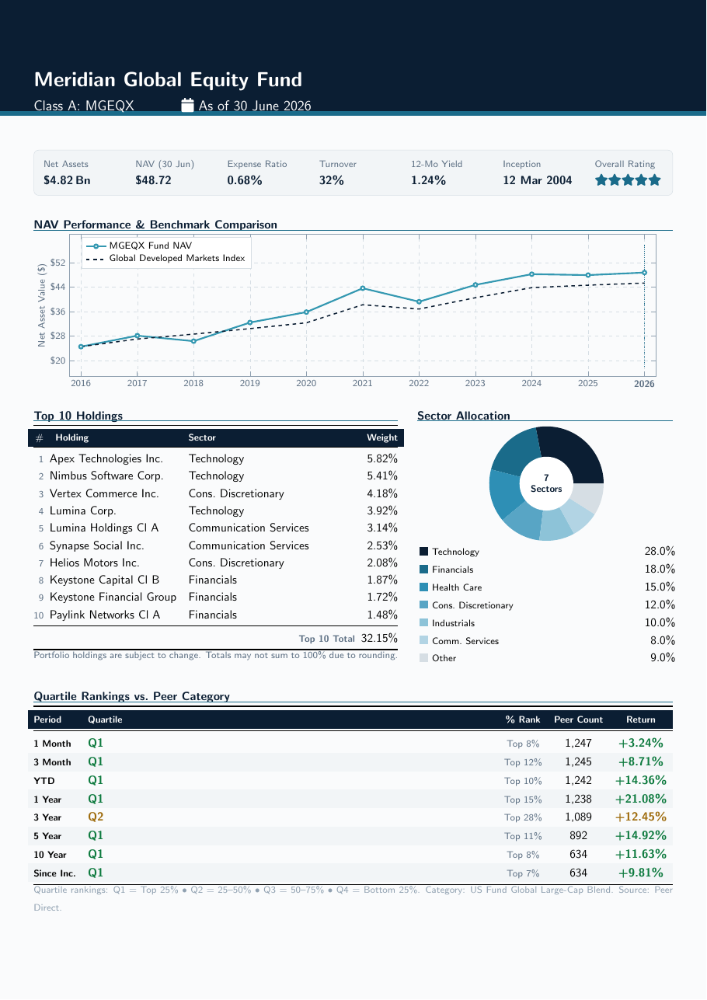</a><br><b>Investment Tearsheet</b><br><a href="https://letx.app/templates/finance/investment-tearsheet">Open in LetX</a> · <a href="./finance/investment-tearsheet">Source</a></td>
</tr>
<tr>
<td width="33%" valign="top" align="center"><a href="https://letx.app/templates/finance/consulting-report">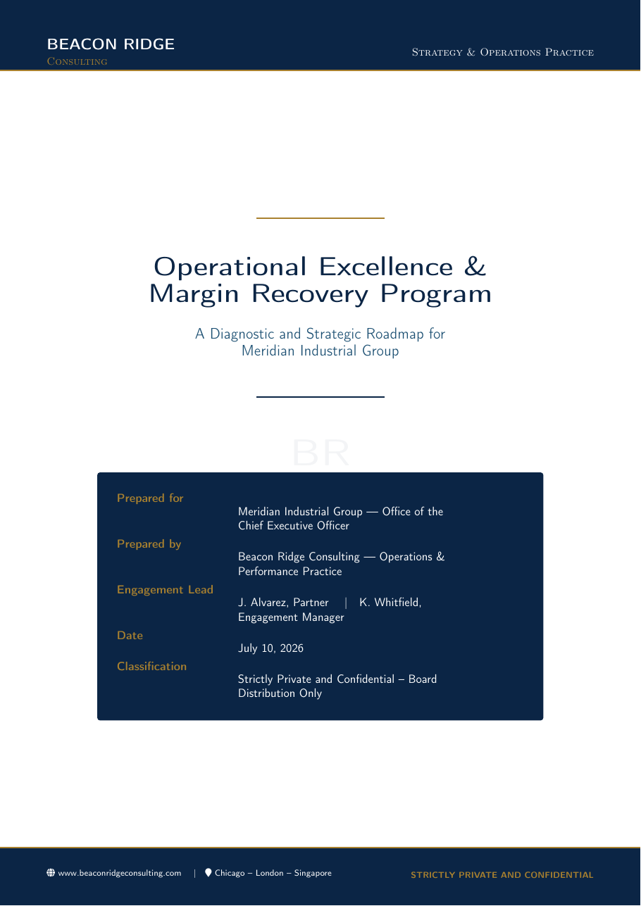</a><br><b>Management Consulting Report</b><br><a href="https://letx.app/templates/finance/consulting-report">Open in LetX</a> · <a href="./finance/consulting-report">Source</a></td>
<td width="33%" valign="top" align="center"><a href="https://letx.app/templates/finance/one-pager-strategy-brief">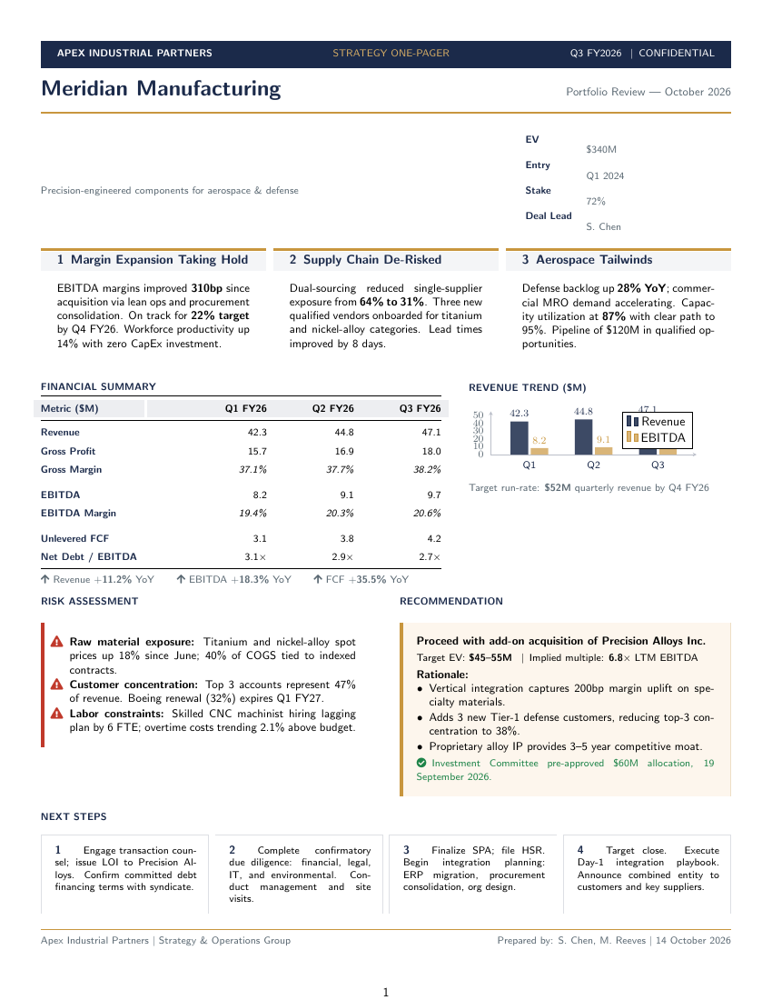</a><br><b>One-Pager Strategy Brief</b><br><a href="https://letx.app/templates/finance/one-pager-strategy-brief">Open in LetX</a> · <a href="./finance/one-pager-strategy-brief">Source</a></td>
<td width="33%" valign="top" align="center"><a href="https://letx.app/templates/finance/invoice-pro-forma">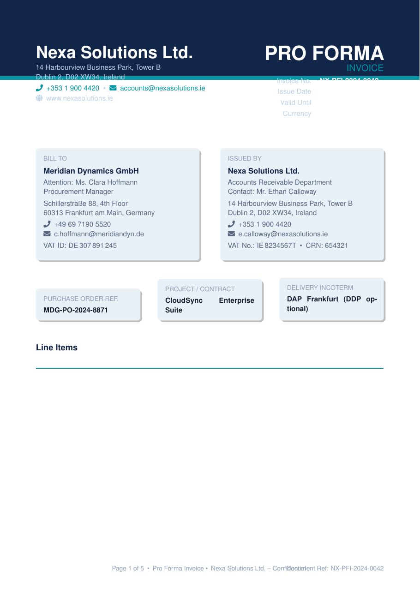</a><br><b>Pro Forma Invoice</b><br><a href="https://letx.app/templates/finance/invoice-pro-forma">Open in LetX</a> · <a href="./finance/invoice-pro-forma">Source</a></td>
</tr>
<tr>
<td width="33%" valign="top" align="center"><a href="https://letx.app/templates/finance/quant-research-note">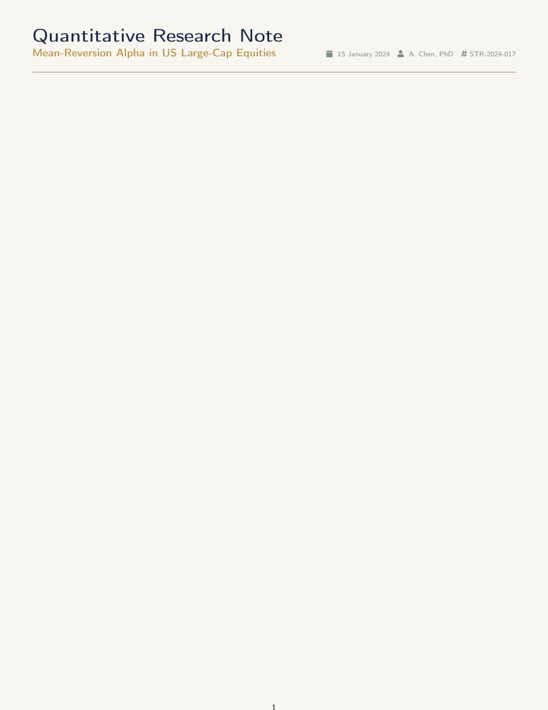</a><br><b>Quant Research Note</b><br><a href="https://letx.app/templates/finance/quant-research-note">Open in LetX</a> · <a href="./finance/quant-research-note">Source</a></td>
<td width="33%" valign="top" align="center"><a href="https://letx.app/templates/finance/form-s-1-filing">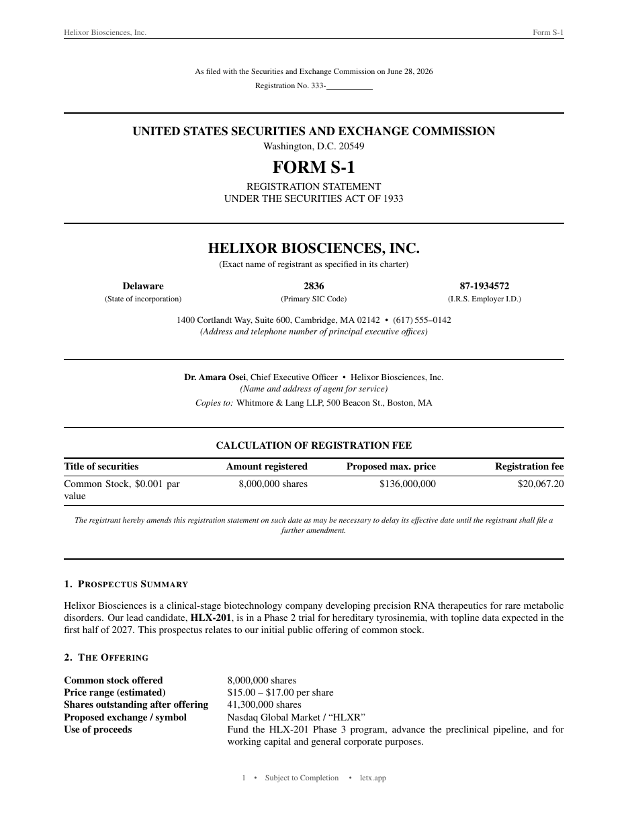</a><br><b>Regulatory Filing (Form S-1)</b><br><a href="https://letx.app/templates/finance/form-s-1-filing">Open in LetX</a> · <a href="./finance/form-s-1-filing">Source</a></td>
<td width="33%" valign="top" align="center"><a href="https://letx.app/templates/finance/startup-business-plan">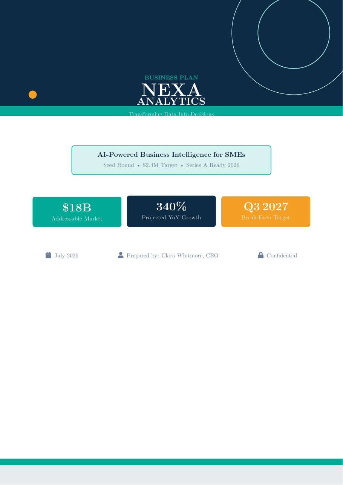</a><br><b>Startup Business Plan</b><br><a href="https://letx.app/templates/finance/startup-business-plan">Open in LetX</a> · <a href="./finance/startup-business-plan">Source</a></td>
</tr>
<tr>
<td width="33%" valign="top" align="center"><a href="https://letx.app/templates/finance/stock-research-report">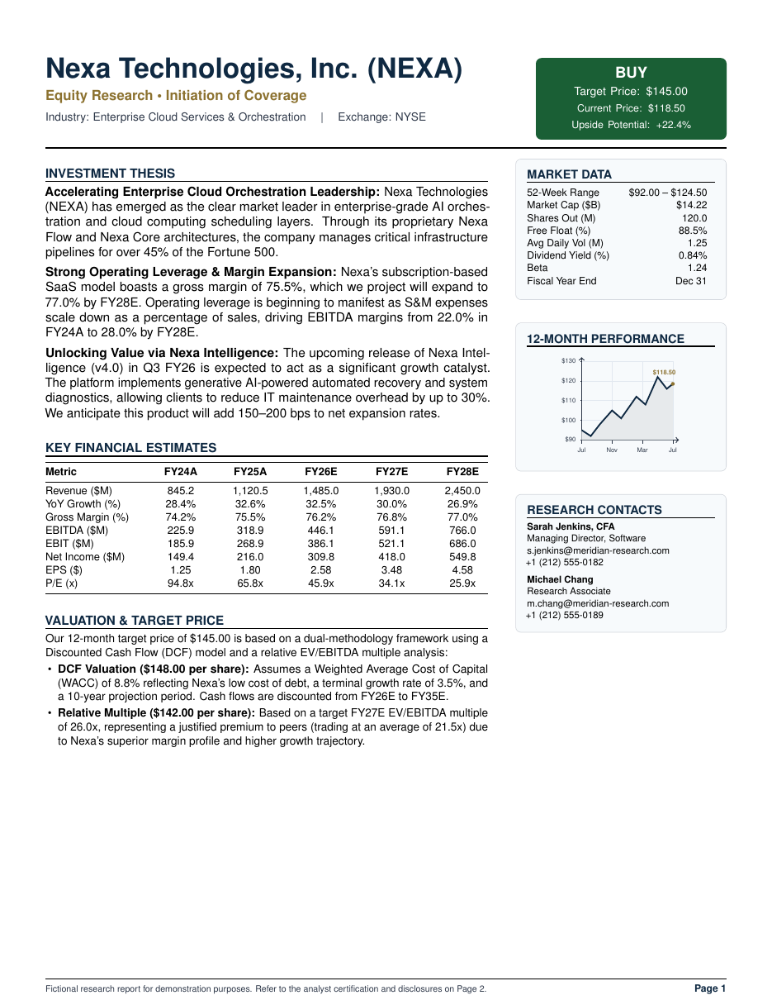</a><br><b>Stock Equity Research Report</b><br><a href="https://letx.app/templates/finance/stock-research-report">Open in LetX</a> · <a href="./finance/stock-research-report">Source</a></td>
</tr>
</table>

### Teaching & Education

10 templates. [Browse this category on LetX](https://letx.app/templates/education)

<table>
<tr>
<td width="33%" valign="top" align="center"><a href="https://letx.app/templates/education/attendance-register">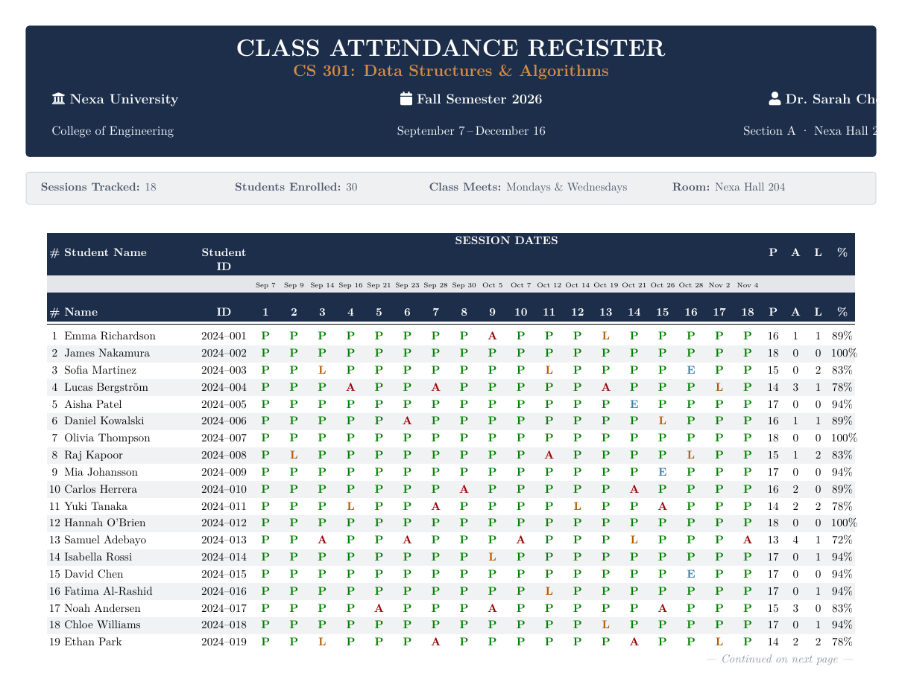</a><br><b>Class Attendance Register</b><br><a href="https://letx.app/templates/education/attendance-register">Open in LetX</a> · <a href="./education/attendance-register">Source</a></td>
<td width="33%" valign="top" align="center"><a href="https://letx.app/templates/education/rubrics-evaluation-form">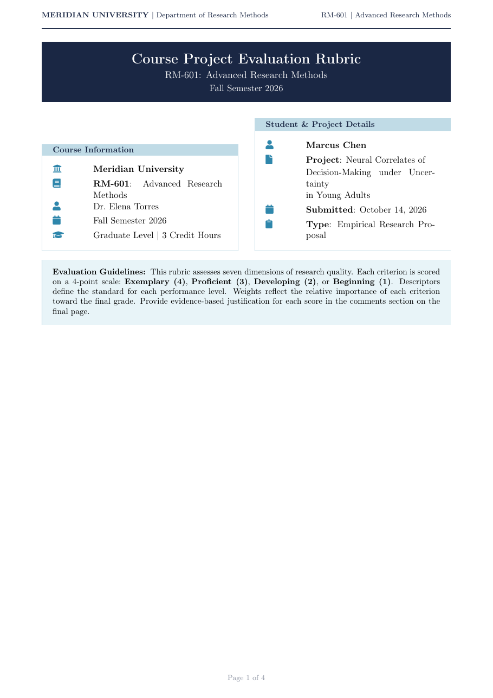</a><br><b>Grading Rubric</b><br><a href="https://letx.app/templates/education/rubrics-evaluation-form">Open in LetX</a> · <a href="./education/rubrics-evaluation-form">Source</a></td>
<td width="33%" valign="top" align="center"><a href="https://letx.app/templates/education/report-card">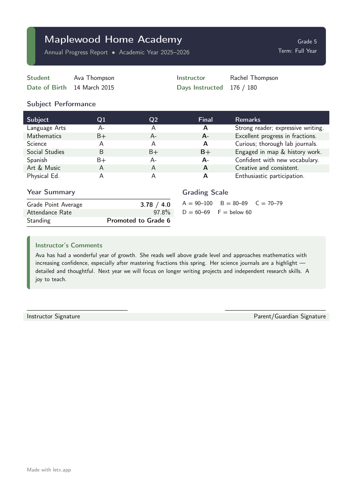</a><br><b>Homeschool Report Card</b><br><a href="https://letx.app/templates/education/report-card">Open in LetX</a> · <a href="./education/report-card">Source</a></td>
</tr>
<tr>
<td width="33%" valign="top" align="center"><a href="https://letx.app/templates/education/special-education-iep">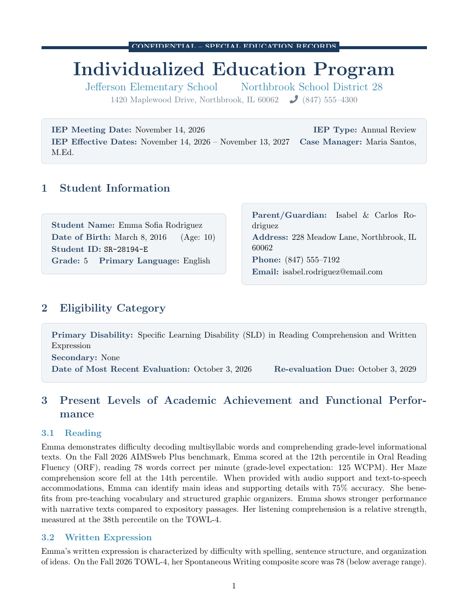</a><br><b>Individualized Education Program (IEP)</b><br><a href="https://letx.app/templates/education/special-education-iep">Open in LetX</a> · <a href="./education/special-education-iep">Source</a></td>
<td width="33%" valign="top" align="center"><a href="https://letx.app/templates/education/multiple-choice-test">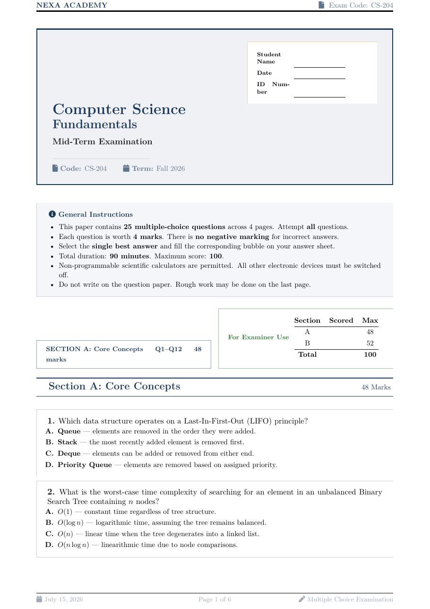</a><br><b>Multiple Choice Test Paper</b><br><a href="https://letx.app/templates/education/multiple-choice-test">Open in LetX</a> · <a href="./education/multiple-choice-test">Source</a></td>
<td width="33%" valign="top" align="center"><a href="https://letx.app/templates/education/primary-school-worksheet">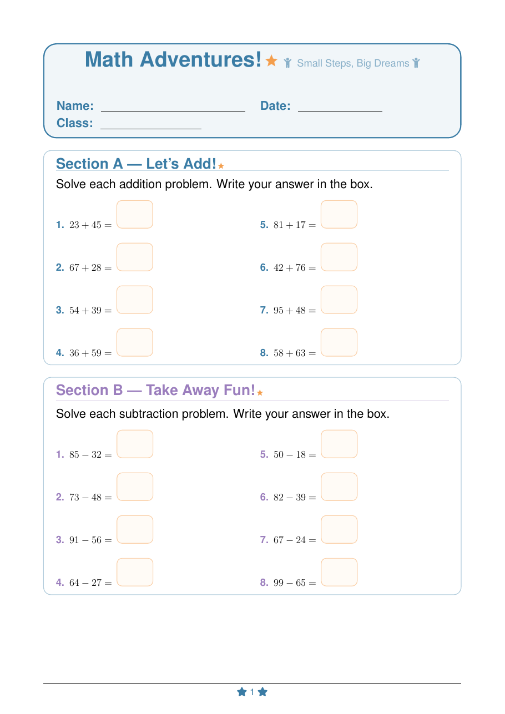</a><br><b>Primary School Worksheet</b><br><a href="https://letx.app/templates/education/primary-school-worksheet">Open in LetX</a> · <a href="./education/primary-school-worksheet">Source</a></td>
</tr>
<tr>
<td width="33%" valign="top" align="center"><a href="https://letx.app/templates/education/flashcard">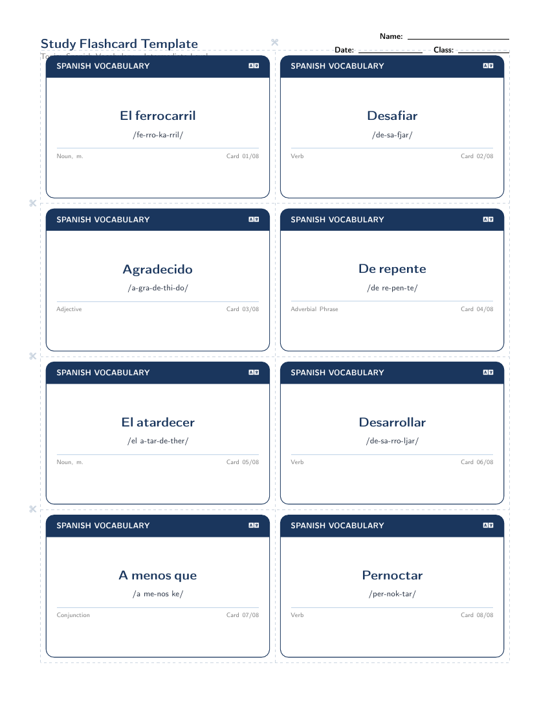</a><br><b>Study Flashcard Template</b><br><a href="https://letx.app/templates/education/flashcard">Open in LetX</a> · <a href="./education/flashcard">Source</a></td>
<td width="33%" valign="top" align="center"><a href="https://letx.app/templates/education/gradebook">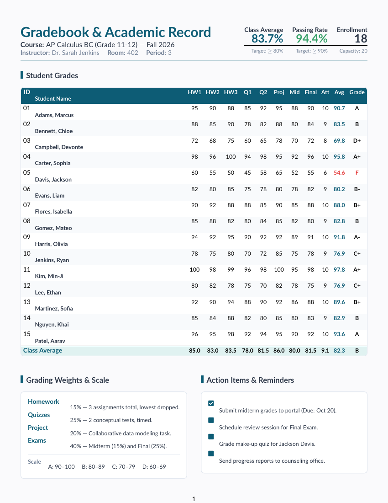</a><br><b>Teacher Gradebook</b><br><a href="https://letx.app/templates/education/gradebook">Open in LetX</a> · <a href="./education/gradebook">Source</a></td>
<td width="33%" valign="top" align="center"><a href="https://letx.app/templates/education/lesson-plan">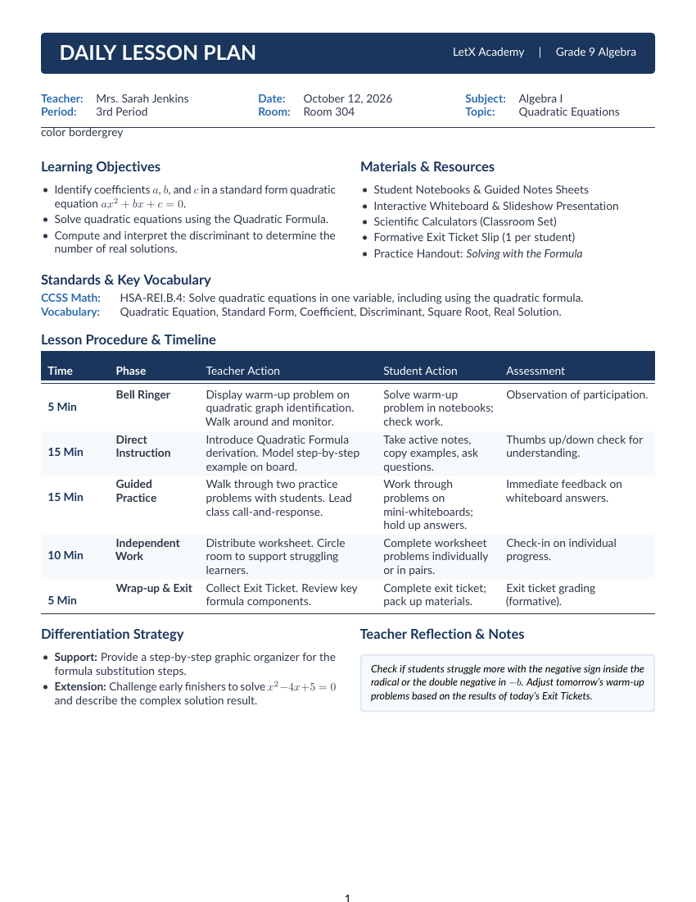</a><br><b>Teacher Lesson Plan</b><br><a href="https://letx.app/templates/education/lesson-plan">Open in LetX</a> · <a href="./education/lesson-plan">Source</a></td>
</tr>
<tr>
<td width="33%" valign="top" align="center"><a href="https://letx.app/templates/education/teacher-observation-report">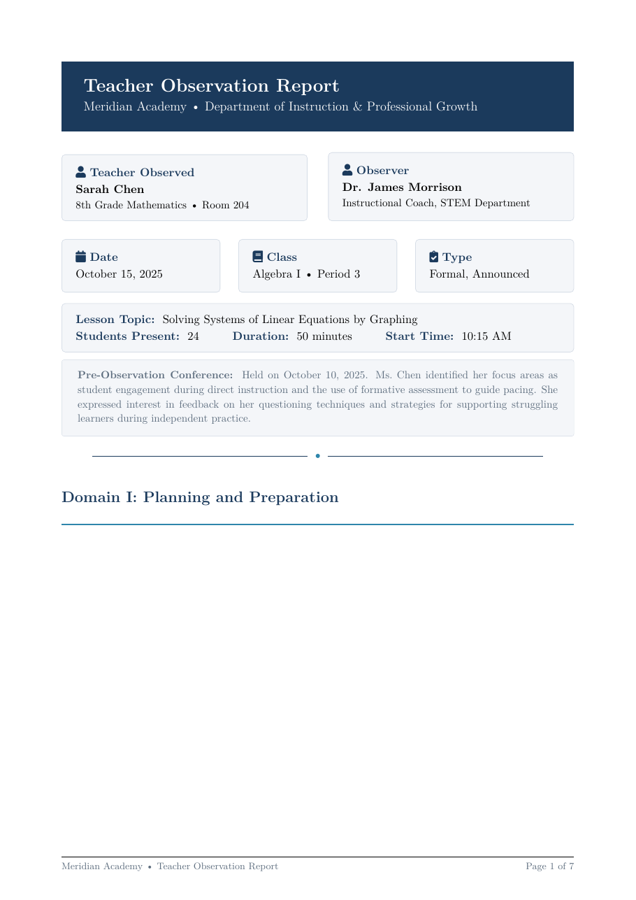</a><br><b>Teacher Observation Report</b><br><a href="https://letx.app/templates/education/teacher-observation-report">Open in LetX</a> · <a href="./education/teacher-observation-report">Source</a></td>
</tr>
</table>

### Calendars & Planners

6 templates. [Browse this category on LetX](https://letx.app/templates/calendars)

<table>
<tr>
<td width="33%" valign="top" align="center"><a href="https://letx.app/templates/calendars/daily-planner">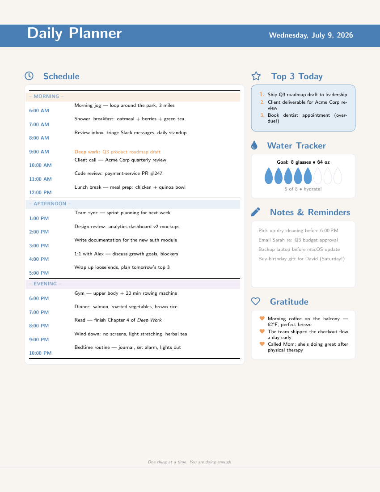</a><br><b>Daily Planner</b><br><a href="https://letx.app/templates/calendars/daily-planner">Open in LetX</a> · <a href="./calendars/daily-planner">Source</a></td>
<td width="33%" valign="top" align="center"><a href="https://letx.app/templates/calendars/habit-tracker">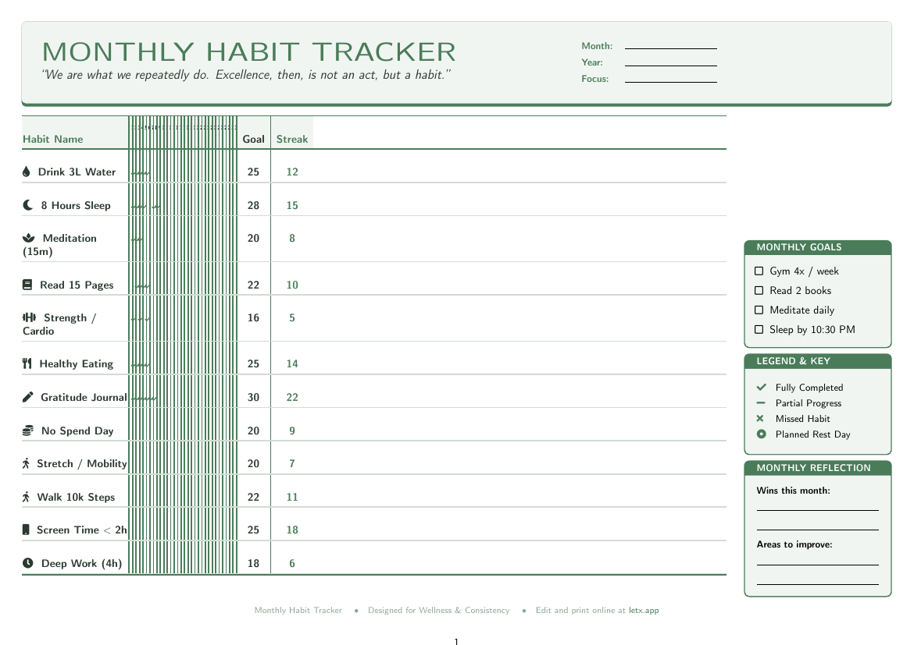</a><br><b>Habit Tracker</b><br><a href="https://letx.app/templates/calendars/habit-tracker">Open in LetX</a> · <a href="./calendars/habit-tracker">Source</a></td>
<td width="33%" valign="top" align="center"><a href="https://letx.app/templates/calendars/monthly-calendar">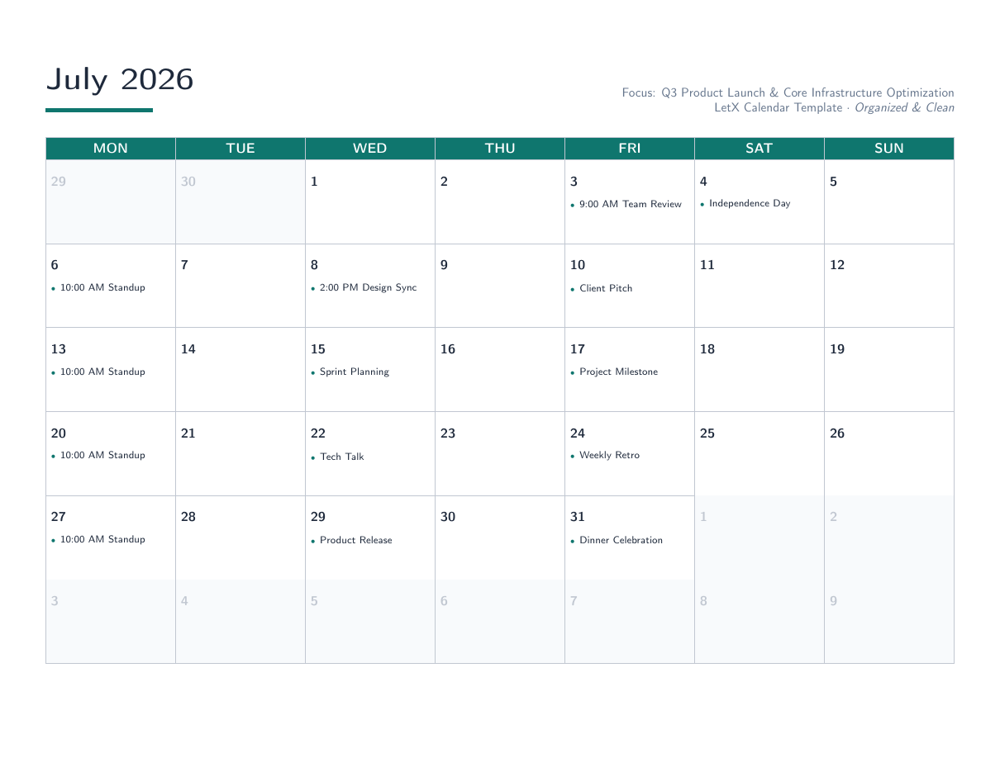</a><br><b>Monthly Calendar</b><br><a href="https://letx.app/templates/calendars/monthly-calendar">Open in LetX</a> · <a href="./calendars/monthly-calendar">Source</a></td>
</tr>
<tr>
<td width="33%" valign="top" align="center"><a href="https://letx.app/templates/calendars/project-planner">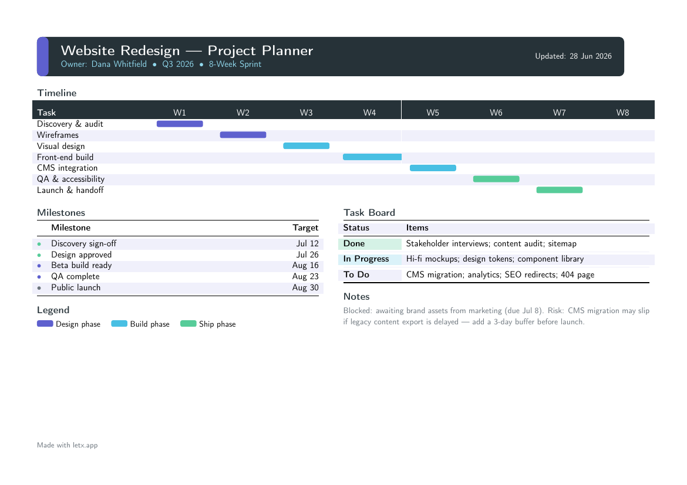</a><br><b>Project Planner</b><br><a href="https://letx.app/templates/calendars/project-planner">Open in LetX</a> · <a href="./calendars/project-planner">Source</a></td>
<td width="33%" valign="top" align="center"><a href="https://letx.app/templates/calendars/study-planner">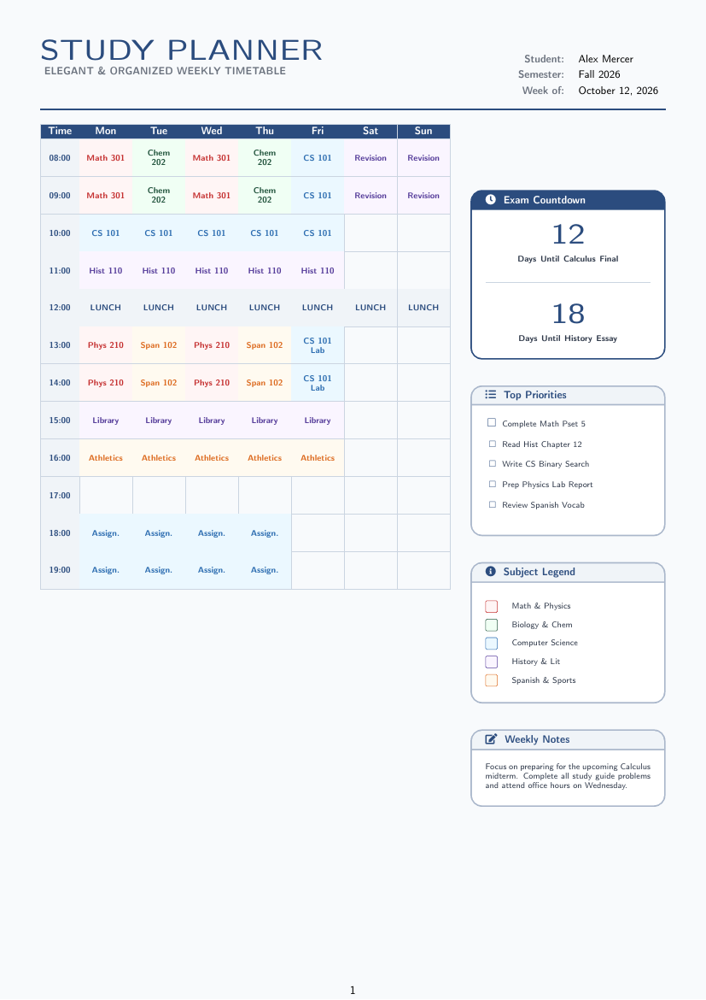</a><br><b>Study Planner</b><br><a href="https://letx.app/templates/calendars/study-planner">Open in LetX</a> · <a href="./calendars/study-planner">Source</a></td>
<td width="33%" valign="top" align="center"><a href="https://letx.app/templates/calendars/weekly-planner">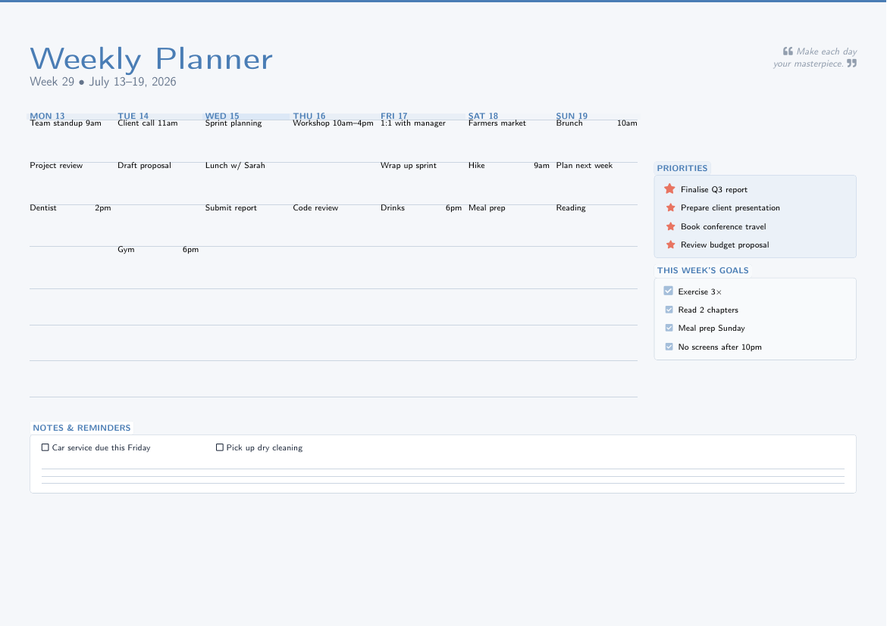</a><br><b>Weekly Planner</b><br><a href="https://letx.app/templates/calendars/weekly-planner">Open in LetX</a> · <a href="./calendars/weekly-planner">Source</a></td>
</tr>
</table>

### Everything Else

70 templates. [Browse this category on LetX](https://letx.app/templates/miscellaneous)

<table>
<tr>
<td width="33%" valign="top" align="center"><a href="https://letx.app/templates/miscellaneous/aesthetic-muslim-biodata">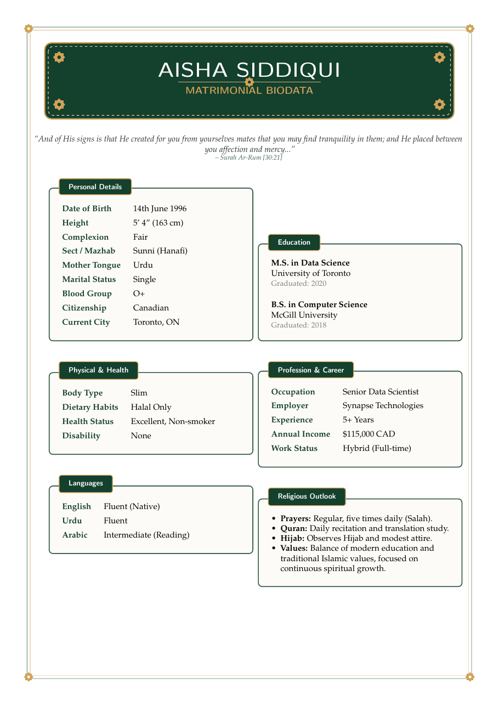</a><br><b>Aesthetic Muslim Biodata</b><br><a href="https://letx.app/templates/miscellaneous/aesthetic-muslim-biodata">Open in LetX</a> · <a href="./miscellaneous/aesthetic-muslim-biodata">Source</a></td>
<td width="33%" valign="top" align="center"><a href="https://letx.app/templates/miscellaneous/appreciation-certificate">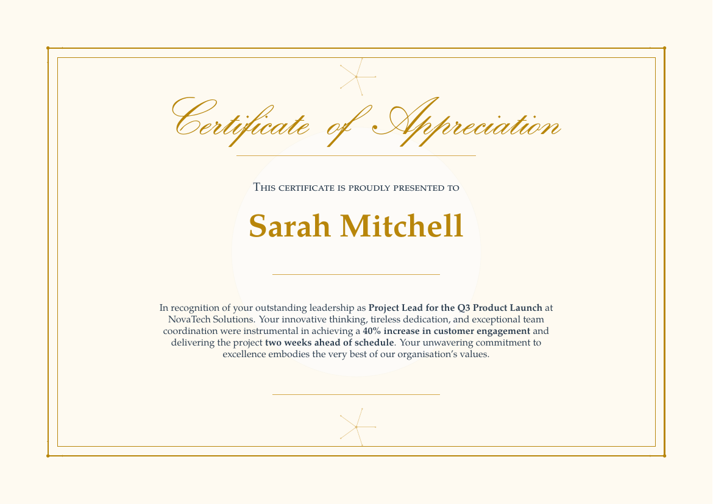</a><br><b>Appreciation Certificate</b><br><a href="https://letx.app/templates/miscellaneous/appreciation-certificate">Open in LetX</a> · <a href="./miscellaneous/appreciation-certificate">Source</a></td>
<td width="33%" valign="top" align="center"><a href="https://letx.app/templates/miscellaneous/baby-shower-invitation">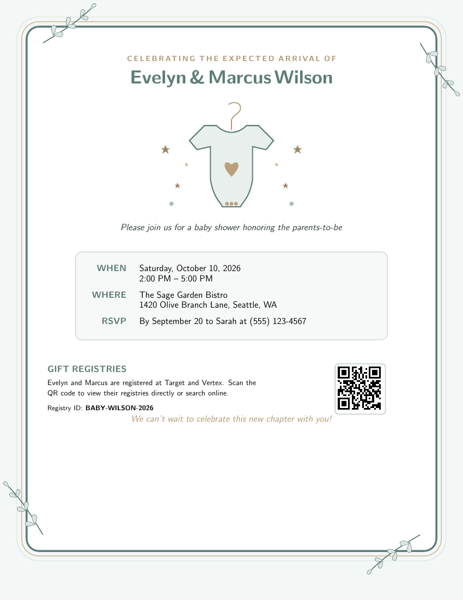</a><br><b>Baby Shower Invitation</b><br><a href="https://letx.app/templates/miscellaneous/baby-shower-invitation">Open in LetX</a> · <a href="./miscellaneous/baby-shower-invitation">Source</a></td>
</tr>
<tr>
<td width="33%" valign="top" align="center"><a href="https://letx.app/templates/miscellaneous/bengali-marriage-biodata">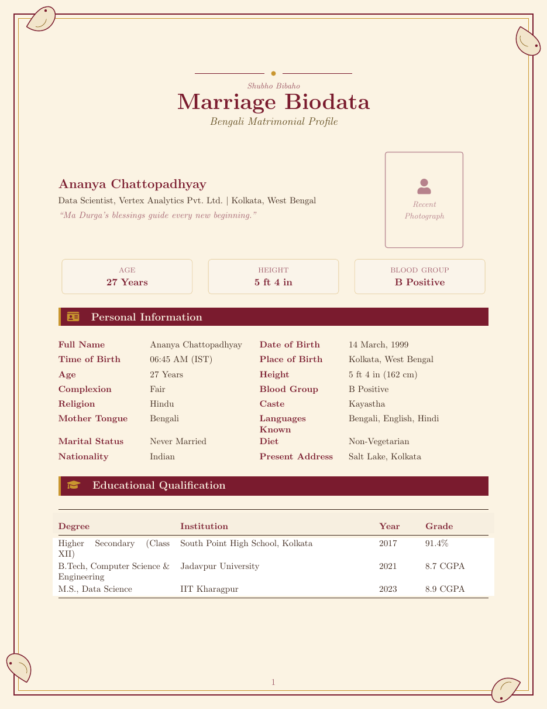</a><br><b>Bengali Marriage Biodata</b><br><a href="https://letx.app/templates/miscellaneous/bengali-marriage-biodata">Open in LetX</a> · <a href="./miscellaneous/bengali-marriage-biodata">Source</a></td>
<td width="33%" valign="top" align="center"><a href="https://letx.app/templates/miscellaneous/business-card">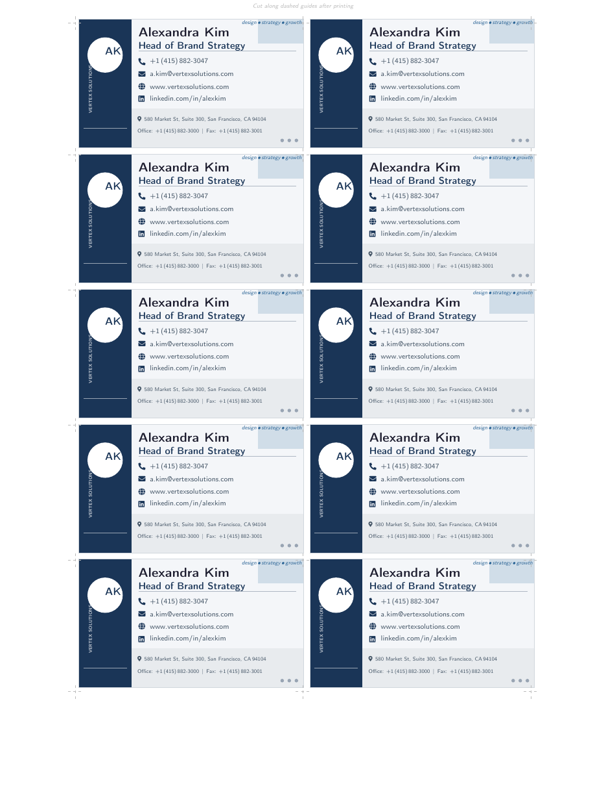</a><br><b>Business Card Sheet</b><br><a href="https://letx.app/templates/miscellaneous/business-card">Open in LetX</a> · <a href="./miscellaneous/business-card">Source</a></td>
<td width="33%" valign="top" align="center"><a href="https://letx.app/templates/miscellaneous/business-proposal">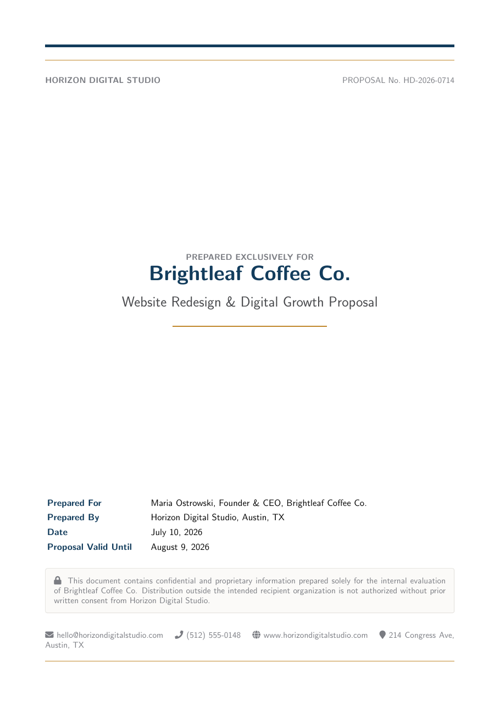</a><br><b>Business Proposal</b><br><a href="https://letx.app/templates/miscellaneous/business-proposal">Open in LetX</a> · <a href="./miscellaneous/business-proposal">Source</a></td>
</tr>
<tr>
<td width="33%" valign="top" align="center"><a href="https://letx.app/templates/miscellaneous/cafe-menu">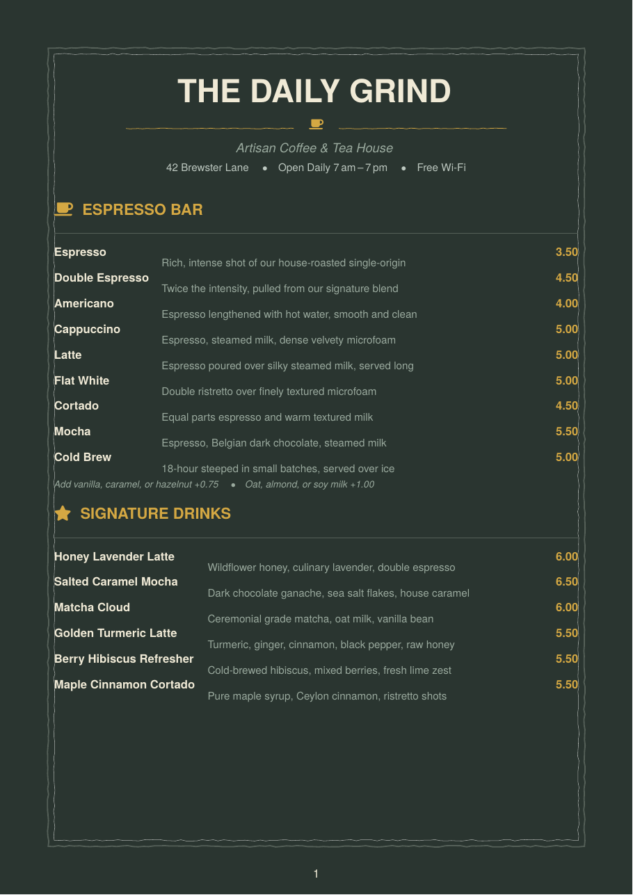</a><br><b>Cafe Menu</b><br><a href="https://letx.app/templates/miscellaneous/cafe-menu">Open in LetX</a> · <a href="./miscellaneous/cafe-menu">Source</a></td>
<td width="33%" valign="top" align="center"><a href="https://letx.app/templates/miscellaneous/certificate-of-achievement">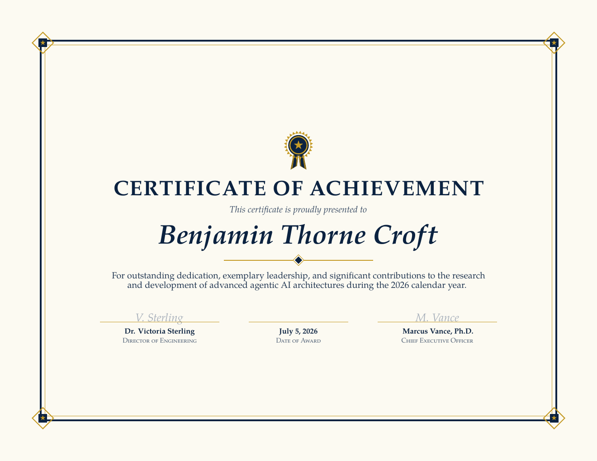</a><br><b>Certificate of Achievement</b><br><a href="https://letx.app/templates/miscellaneous/certificate-of-achievement">Open in LetX</a> · <a href="./miscellaneous/certificate-of-achievement">Source</a></td>
<td width="33%" valign="top" align="center"><a href="https://letx.app/templates/miscellaneous/chemistry-reaction-scheme">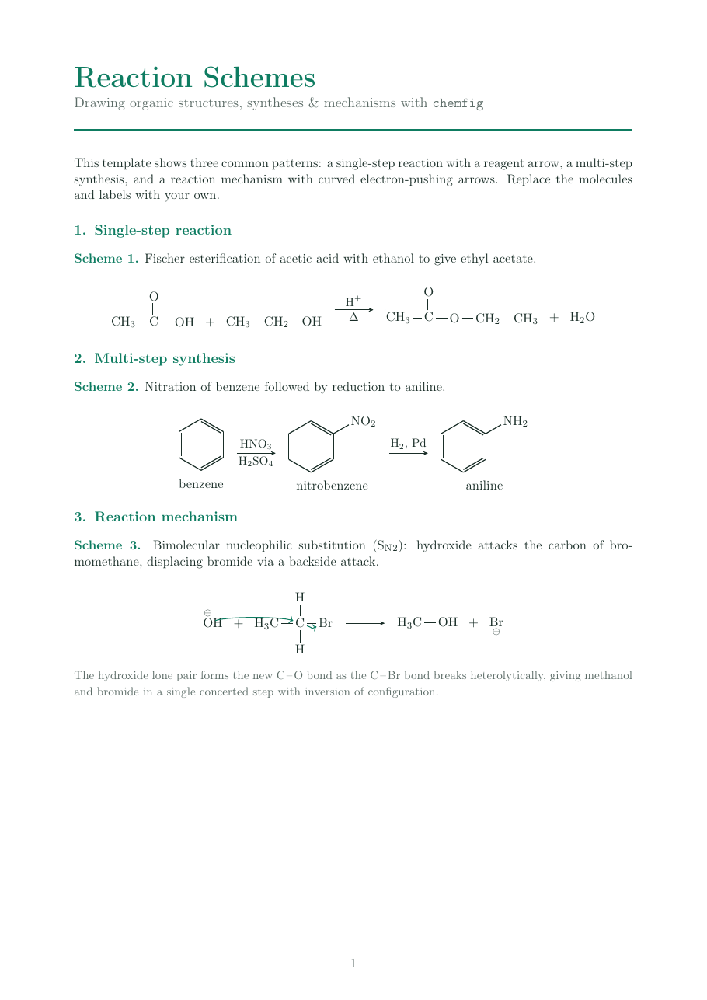</a><br><b>Chemistry Reaction Scheme</b><br><a href="https://letx.app/templates/miscellaneous/chemistry-reaction-scheme">Open in LetX</a> · <a href="./miscellaneous/chemistry-reaction-scheme">Source</a></td>
</tr>
<tr>
<td width="33%" valign="top" align="center"><a href="https://letx.app/templates/miscellaneous/christian-marriage-biodata">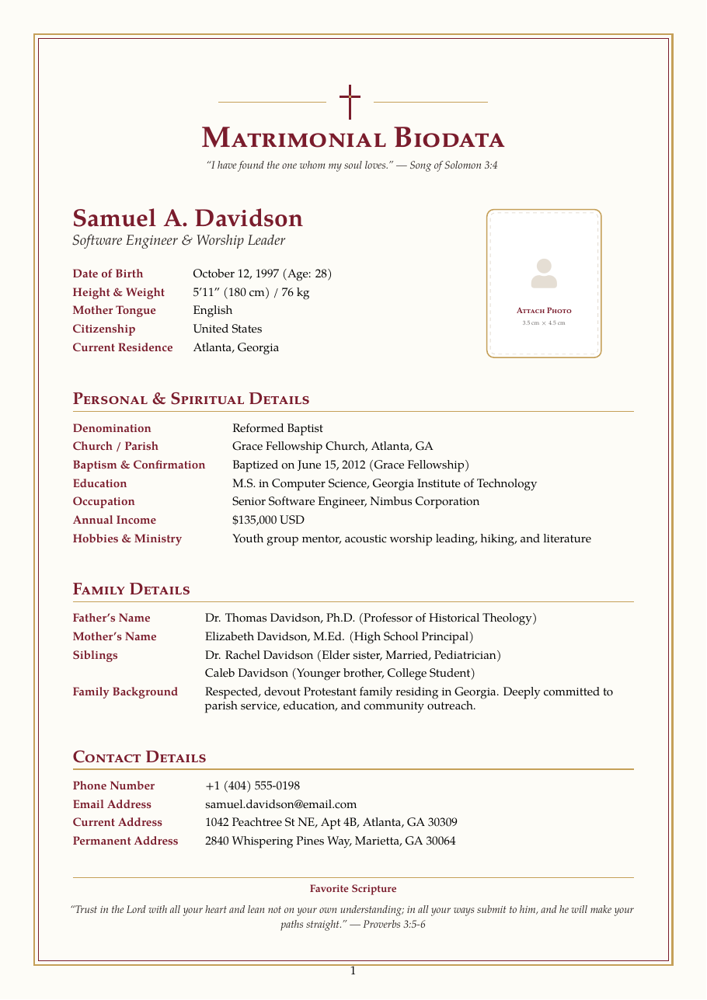</a><br><b>Christian Marriage Biodata</b><br><a href="https://letx.app/templates/miscellaneous/christian-marriage-biodata">Open in LetX</a> · <a href="./miscellaneous/christian-marriage-biodata">Source</a></td>
<td width="33%" valign="top" align="center"><a href="https://letx.app/templates/miscellaneous/completion-certificate"></a><br><b>Course Completion Certificate</b><br><a href="https://letx.app/templates/miscellaneous/completion-certificate">Open in LetX</a> · <a href="./miscellaneous/completion-certificate">Source</a></td>
<td width="33%" valign="top" align="center"><a href="https://letx.app/templates/miscellaneous/dnd-character-sheet">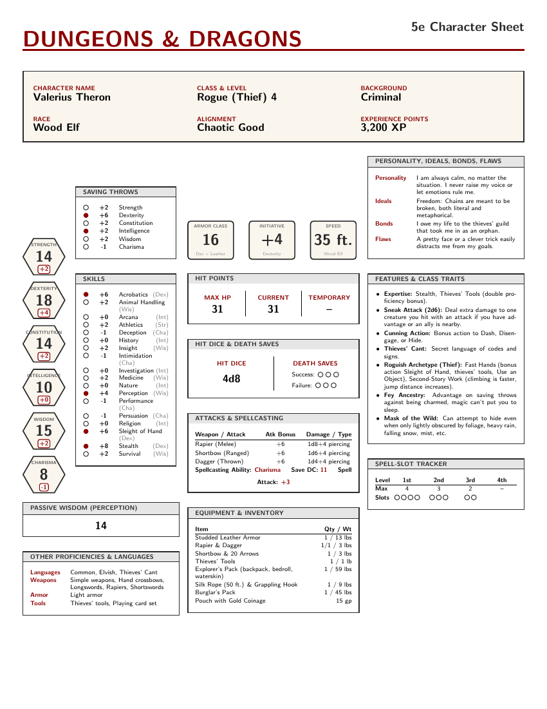</a><br><b>D&D Character Sheet</b><br><a href="https://letx.app/templates/miscellaneous/dnd-character-sheet">Open in LetX</a> · <a href="./miscellaneous/dnd-character-sheet">Source</a></td>
</tr>
<tr>
<td width="33%" valign="top" align="center"><a href="https://letx.app/templates/miscellaneous/data-science-project-report">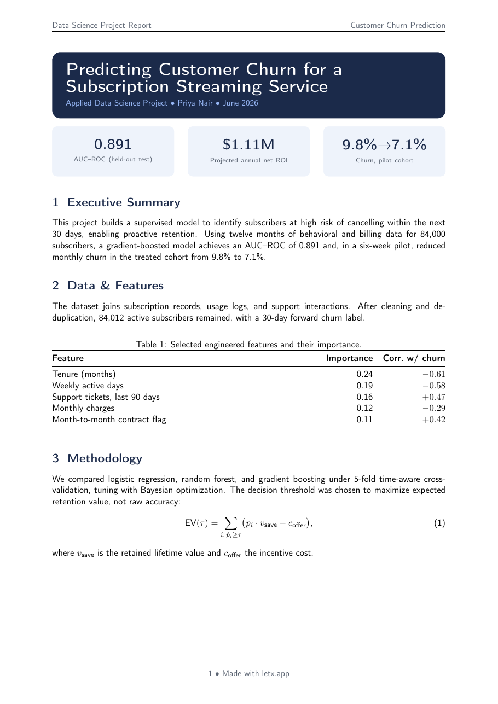</a><br><b>Data Science Project Report</b><br><a href="https://letx.app/templates/miscellaneous/data-science-project-report">Open in LetX</a> · <a href="./miscellaneous/data-science-project-report">Source</a></td>
<td width="33%" valign="top" align="center"><a href="https://letx.app/templates/miscellaneous/employment-contract">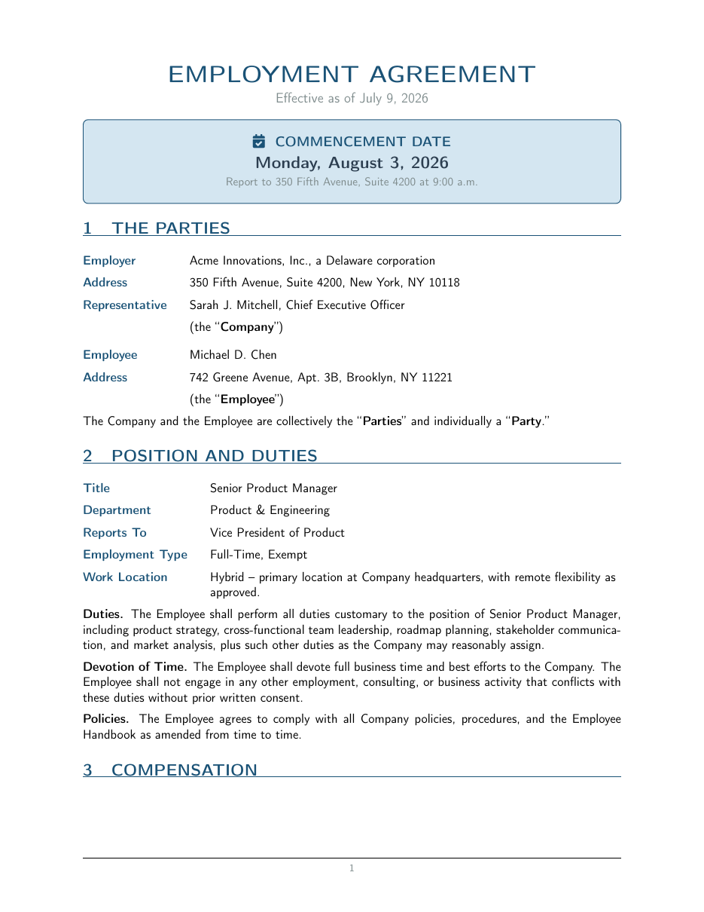</a><br><b>Employment Contract</b><br><a href="https://letx.app/templates/miscellaneous/employment-contract">Open in LetX</a> · <a href="./miscellaneous/employment-contract">Source</a></td>
<td width="33%" valign="top" align="center"><a href="https://letx.app/templates/miscellaneous/event-program-brochure">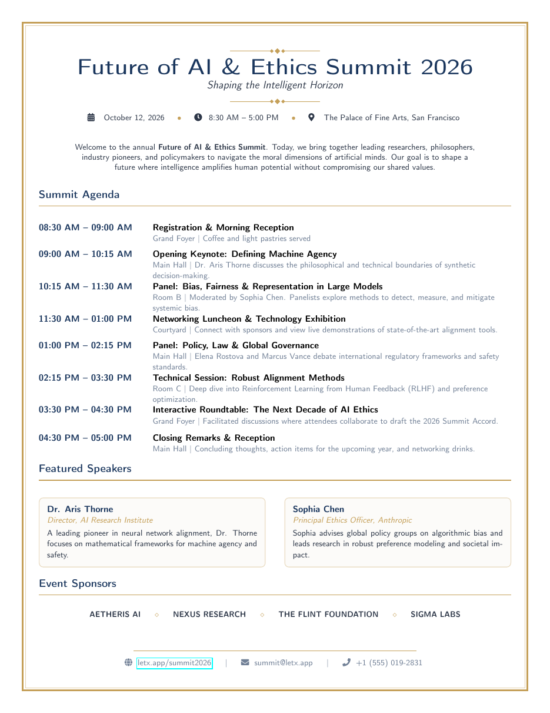</a><br><b>Event Program Brochure</b><br><a href="https://letx.app/templates/miscellaneous/event-program-brochure">Open in LetX</a> · <a href="./miscellaneous/event-program-brochure">Source</a></td>
</tr>
<tr>
<td width="33%" valign="top" align="center"><a href="https://letx.app/templates/miscellaneous/family-tree">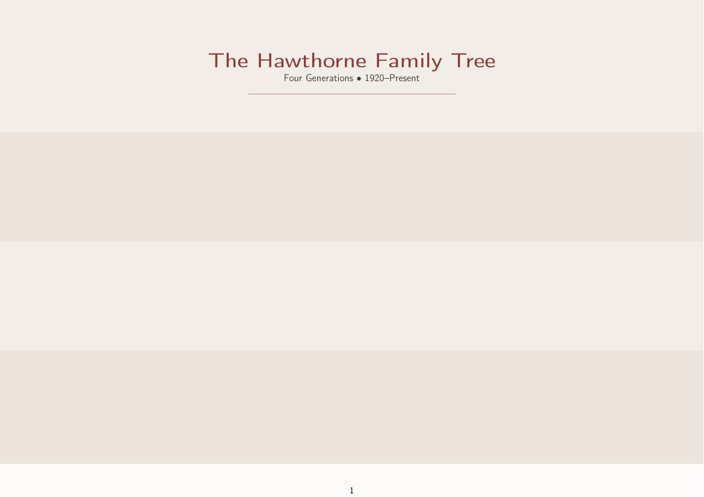</a><br><b>Family Tree Diagram</b><br><a href="https://letx.app/templates/miscellaneous/family-tree">Open in LetX</a> · <a href="./miscellaneous/family-tree">Source</a></td>
<td width="33%" valign="top" align="center"><a href="https://letx.app/templates/miscellaneous/freelance-invoice">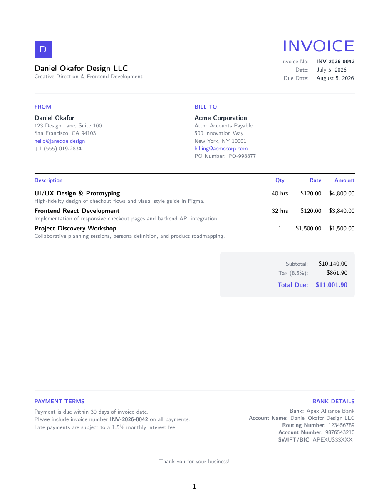</a><br><b>Freelance Invoice</b><br><a href="https://letx.app/templates/miscellaneous/freelance-invoice">Open in LetX</a> · <a href="./miscellaneous/freelance-invoice">Source</a></td>
<td width="33%" valign="top" align="center"><a href="https://letx.app/templates/miscellaneous/freelance-project-proposal">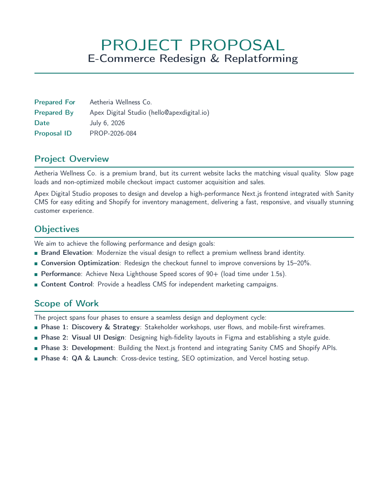</a><br><b>Freelance Project Proposal</b><br><a href="https://letx.app/templates/miscellaneous/freelance-project-proposal">Open in LetX</a> · <a href="./miscellaneous/freelance-project-proposal">Source</a></td>
</tr>
<tr>
<td width="33%" valign="top" align="center"><a href="https://letx.app/templates/miscellaneous/gantt-project-plan">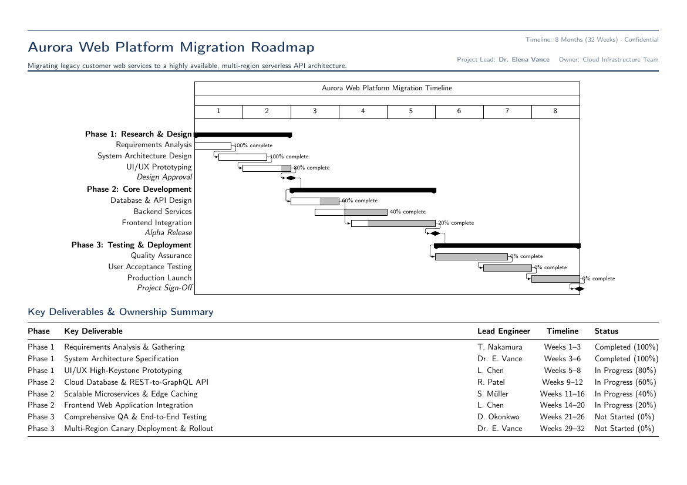</a><br><b>Gantt Project Plan</b><br><a href="https://letx.app/templates/miscellaneous/gantt-project-plan">Open in LetX</a> · <a href="./miscellaneous/gantt-project-plan">Source</a></td>
<td width="33%" valign="top" align="center"><a href="https://letx.app/templates/miscellaneous/gift-certificate-voucher"></a><br><b>Gift Certificate Voucher</b><br><a href="https://letx.app/templates/miscellaneous/gift-certificate-voucher">Open in LetX</a> · <a href="./miscellaneous/gift-certificate-voucher">Source</a></td>
<td width="33%" valign="top" align="center"><a href="https://letx.app/templates/miscellaneous/greeting-card"></a><br><b>Greeting Card</b><br><a href="https://letx.app/templates/miscellaneous/greeting-card">Open in LetX</a> · <a href="./miscellaneous/greeting-card">Source</a></td>
</tr>
<tr>
<td width="33%" valign="top" align="center"><a href="https://letx.app/templates/miscellaneous/chord-diagram">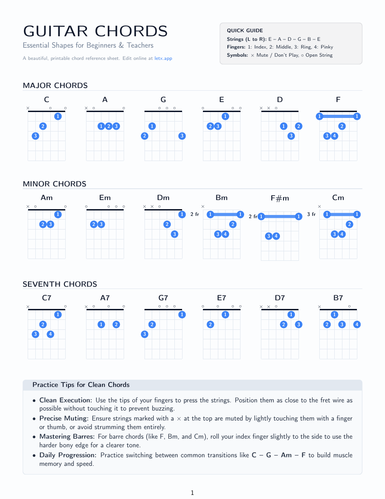</a><br><b>Guitar Chord Chart</b><br><a href="https://letx.app/templates/miscellaneous/chord-diagram">Open in LetX</a> · <a href="./miscellaneous/chord-diagram">Source</a></td>
<td width="33%" valign="top" align="center"><a href="https://letx.app/templates/miscellaneous/gujarati-marriage-biodata">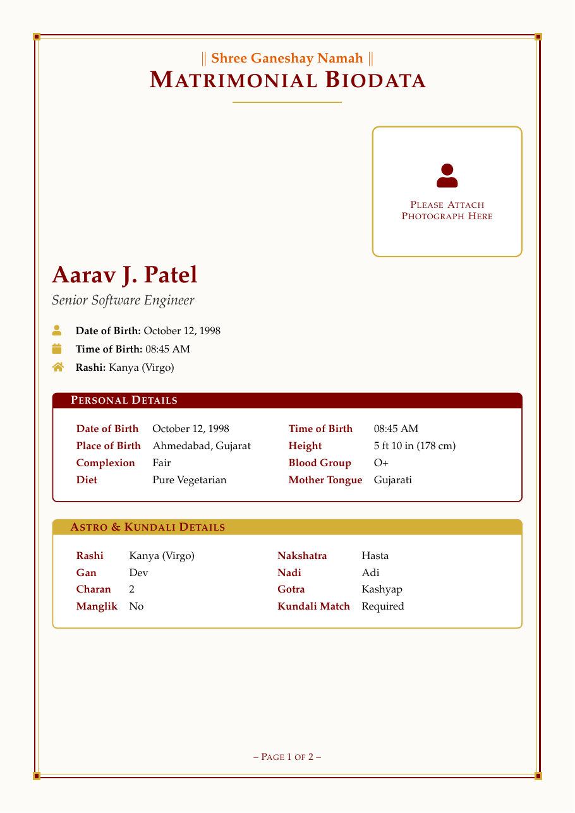</a><br><b>Gujarati Marriage Biodata</b><br><a href="https://letx.app/templates/miscellaneous/gujarati-marriage-biodata">Open in LetX</a> · <a href="./miscellaneous/gujarati-marriage-biodata">Source</a></td>
<td width="33%" valign="top" align="center"><a href="https://letx.app/templates/miscellaneous/hindu-marriage-biodata">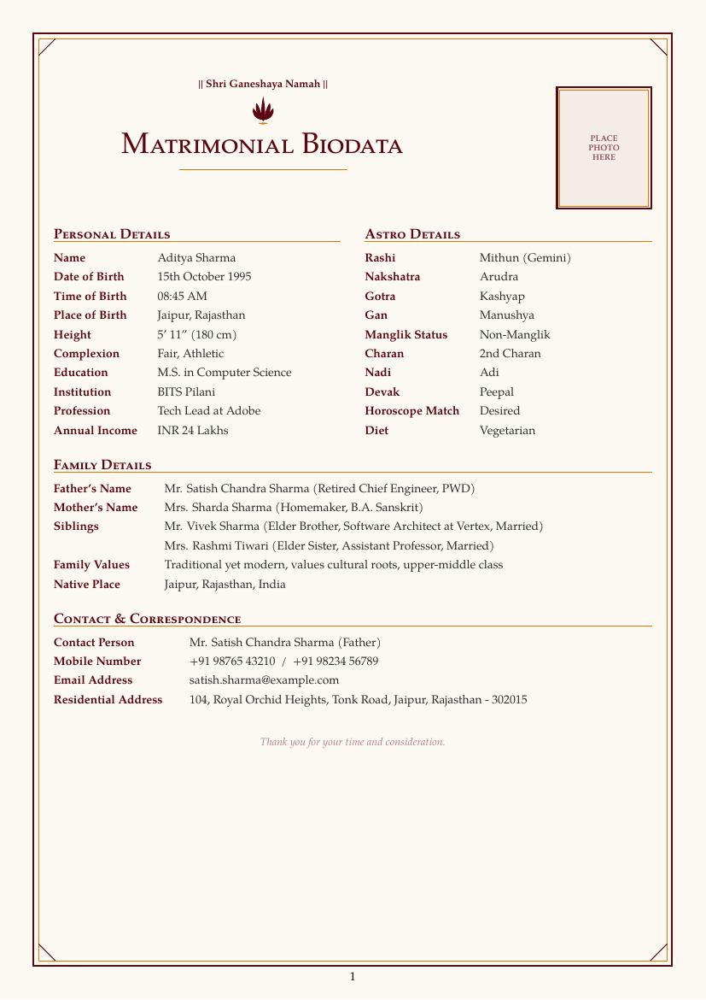</a><br><b>Hindu Marriage Biodata</b><br><a href="https://letx.app/templates/miscellaneous/hindu-marriage-biodata">Open in LetX</a> · <a href="./miscellaneous/hindu-marriage-biodata">Source</a></td>
</tr>
<tr>
<td width="33%" valign="top" align="center"><a href="https://letx.app/templates/miscellaneous/independent-contractor-agreement">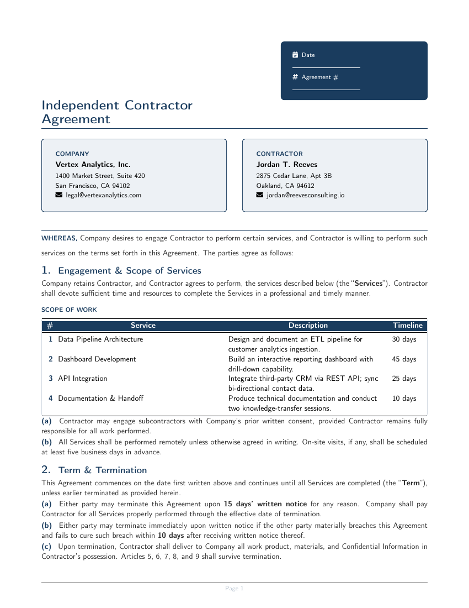</a><br><b>Independent Contractor Agreement</b><br><a href="https://letx.app/templates/miscellaneous/independent-contractor-agreement">Open in LetX</a> · <a href="./miscellaneous/independent-contractor-agreement">Source</a></td>
<td width="33%" valign="top" align="center"><a href="https://letx.app/templates/miscellaneous/internship-certificate">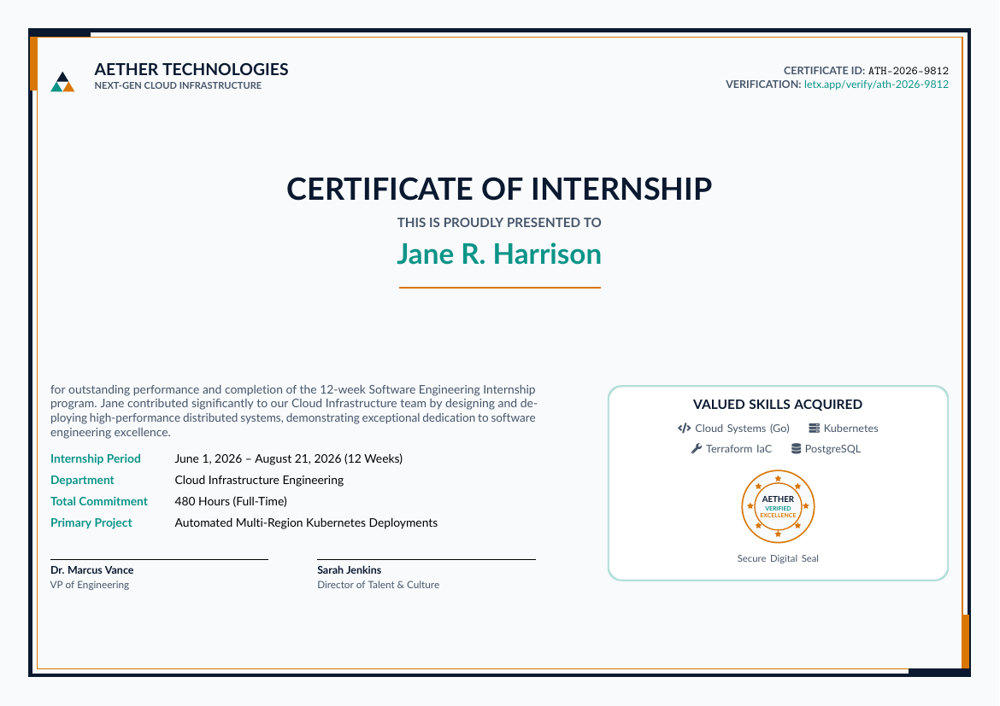</a><br><b>Internship Certificate</b><br><a href="https://letx.app/templates/miscellaneous/internship-certificate">Open in LetX</a> · <a href="./miscellaneous/internship-certificate">Source</a></td>
<td width="33%" valign="top" align="center"><a href="https://letx.app/templates/miscellaneous/islamic-marriage-biodata">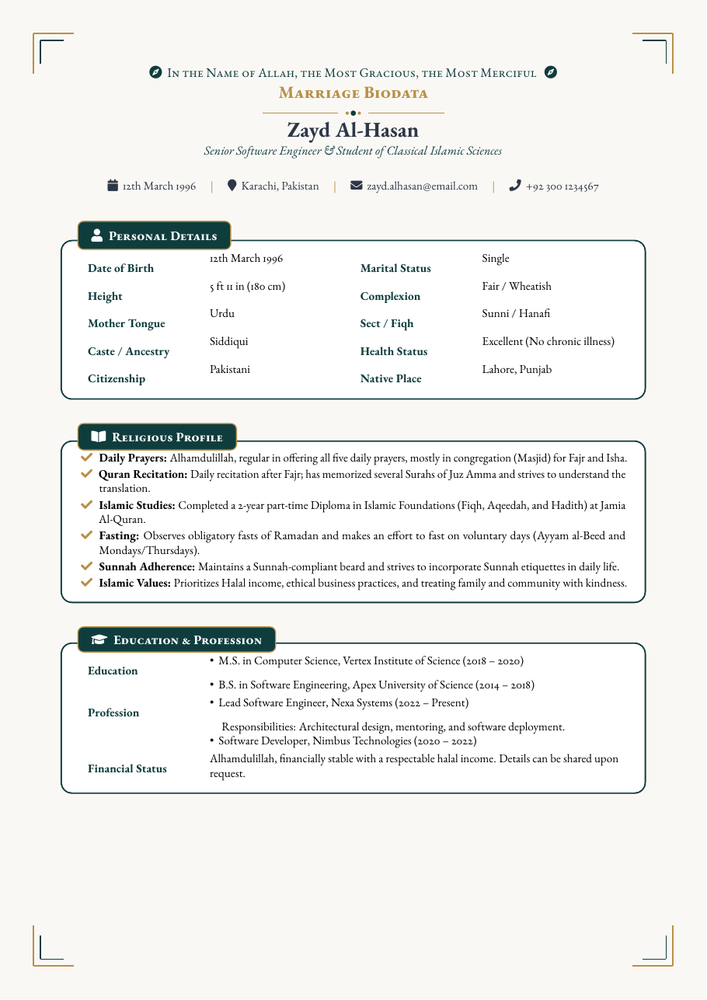</a><br><b>Islamic Marriage Biodata</b><br><a href="https://letx.app/templates/miscellaneous/islamic-marriage-biodata">Open in LetX</a> · <a href="./miscellaneous/islamic-marriage-biodata">Source</a></td>
</tr>
<tr>
<td width="33%" valign="top" align="center"><a href="https://letx.app/templates/miscellaneous/jain-marriage-biodata">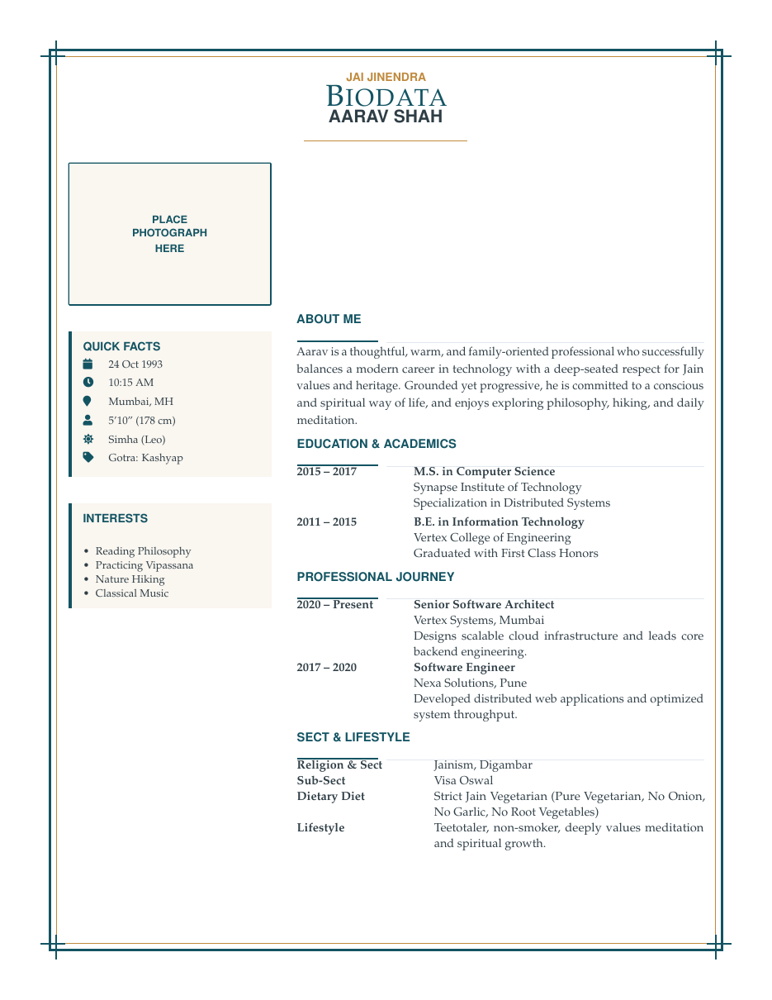</a><br><b>Jain Marriage Biodata</b><br><a href="https://letx.app/templates/miscellaneous/jain-marriage-biodata">Open in LetX</a> · <a href="./miscellaneous/jain-marriage-biodata">Source</a></td>
<td width="33%" valign="top" align="center"><a href="https://letx.app/templates/miscellaneous/kerala-matrimony-biodata">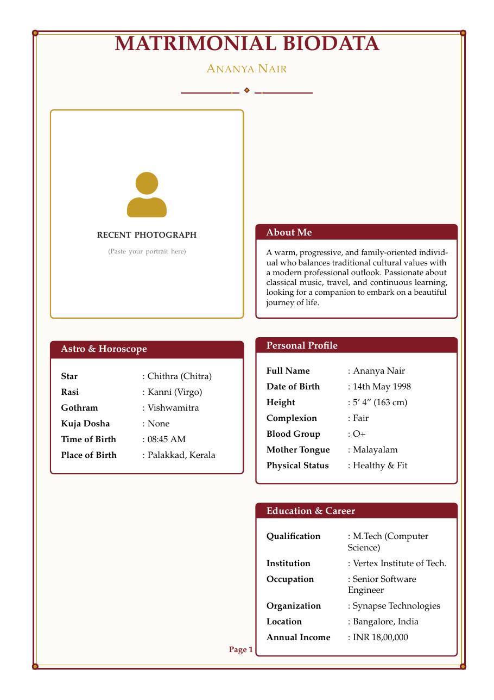</a><br><b>Kerala Matrimonial Biodata</b><br><a href="https://letx.app/templates/miscellaneous/kerala-matrimony-biodata">Open in LetX</a> · <a href="./miscellaneous/kerala-matrimony-biodata">Source</a></td>
<td width="33%" valign="top" align="center"><a href="https://letx.app/templates/miscellaneous/chore-chart">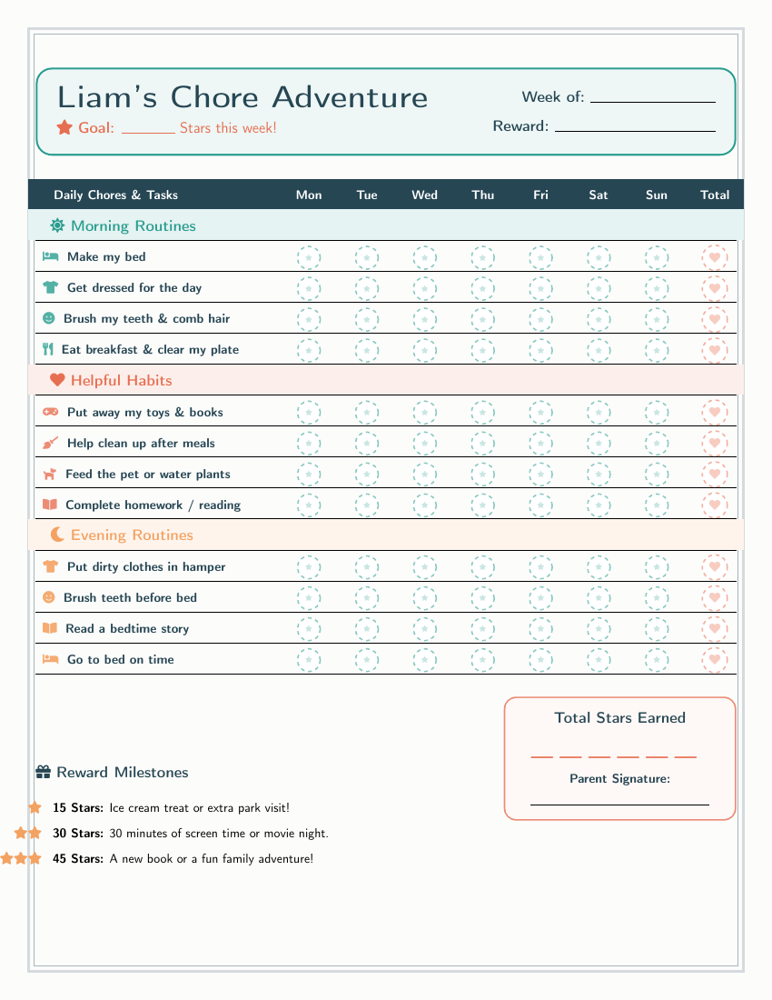</a><br><b>Kids Chore Chart</b><br><a href="https://letx.app/templates/miscellaneous/chore-chart">Open in LetX</a> · <a href="./miscellaneous/chore-chart">Source</a></td>
</tr>
<tr>
<td width="33%" valign="top" align="center"><a href="https://letx.app/templates/miscellaneous/marathi-marriage-biodata">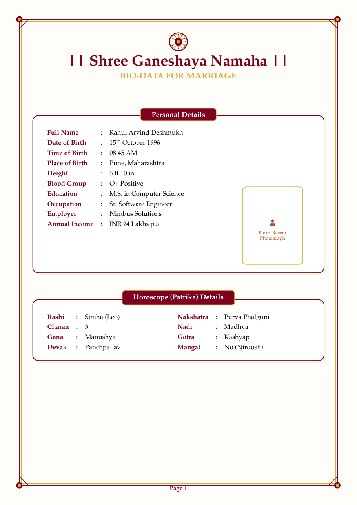</a><br><b>Marathi Marriage Biodata</b><br><a href="https://letx.app/templates/miscellaneous/marathi-marriage-biodata">Open in LetX</a> · <a href="./miscellaneous/marathi-marriage-biodata">Source</a></td>
<td width="33%" valign="top" align="center"><a href="https://letx.app/templates/miscellaneous/minimal-marriage-biodata">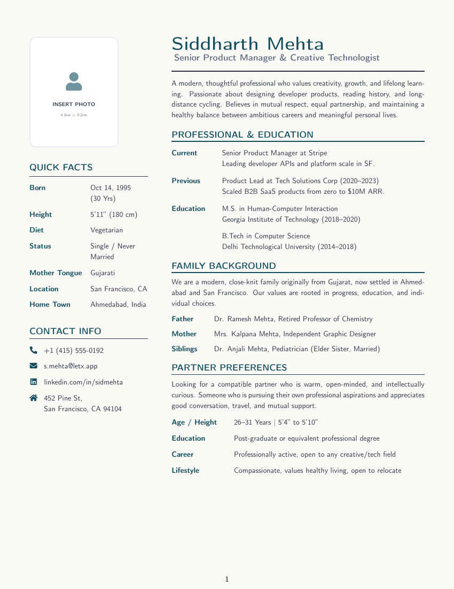</a><br><b>Minimal Marriage Biodata</b><br><a href="https://letx.app/templates/miscellaneous/minimal-marriage-biodata">Open in LetX</a> · <a href="./miscellaneous/minimal-marriage-biodata">Source</a></td>
<td width="33%" valign="top" align="center"><a href="https://letx.app/templates/miscellaneous/modern-marriage-biodata">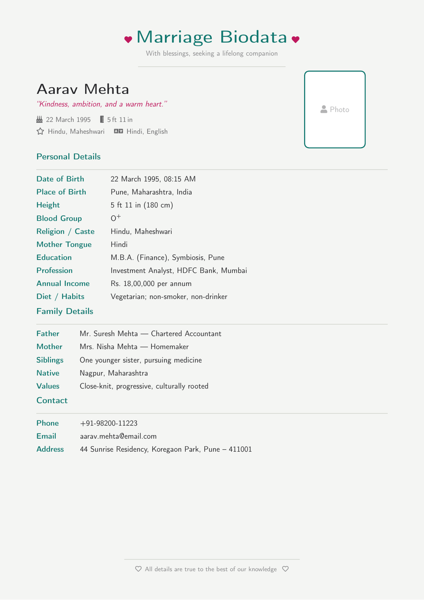</a><br><b>Modern Marriage Biodata</b><br><a href="https://letx.app/templates/miscellaneous/modern-marriage-biodata">Open in LetX</a> · <a href="./miscellaneous/modern-marriage-biodata">Source</a></td>
</tr>
<tr>
<td width="33%" valign="top" align="center"><a href="https://letx.app/templates/miscellaneous/muslim-marriage-biodata">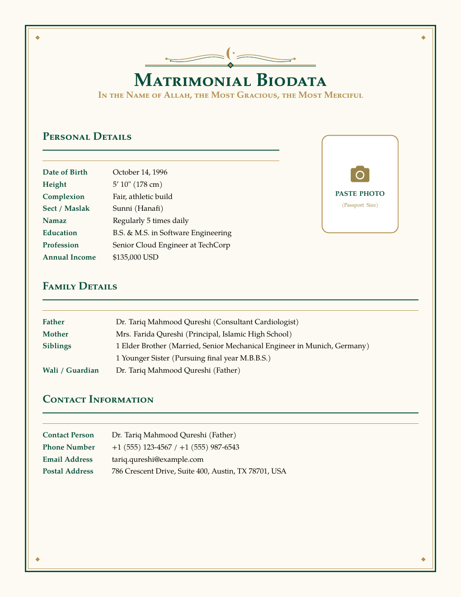</a><br><b>Muslim Marriage Biodata</b><br><a href="https://letx.app/templates/miscellaneous/muslim-marriage-biodata">Open in LetX</a> · <a href="./miscellaneous/muslim-marriage-biodata">Source</a></td>
<td width="33%" valign="top" align="center"><a href="https://letx.app/templates/miscellaneous/name-tag">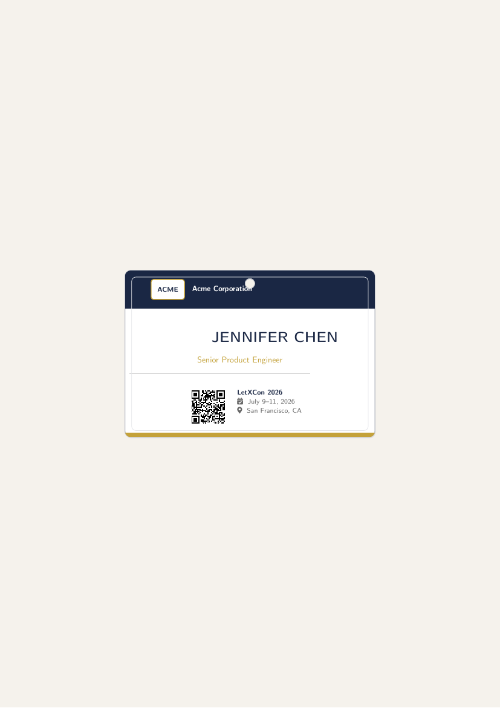</a><br><b>Name Tag Badge</b><br><a href="https://letx.app/templates/miscellaneous/name-tag">Open in LetX</a> · <a href="./miscellaneous/name-tag">Source</a></td>
<td width="33%" valign="top" align="center"><a href="https://letx.app/templates/miscellaneous/nepali-marriage-biodata">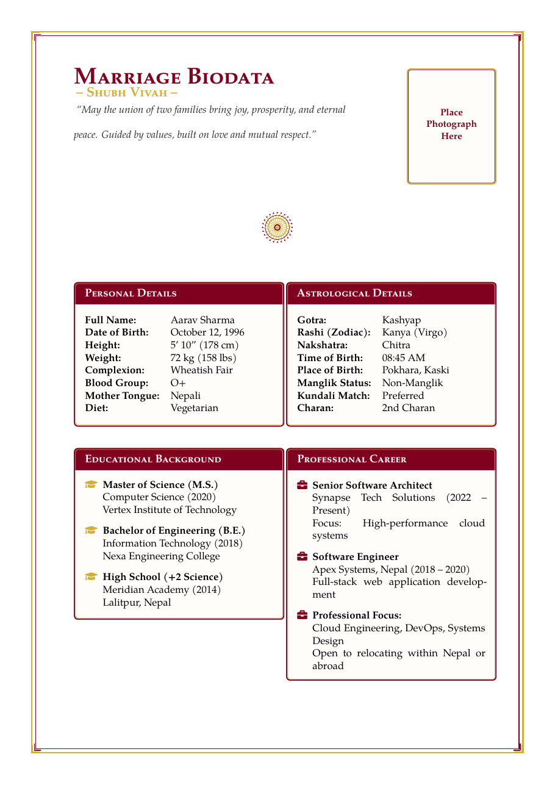</a><br><b>Nepali Marriage Biodata</b><br><a href="https://letx.app/templates/miscellaneous/nepali-marriage-biodata">Open in LetX</a> · <a href="./miscellaneous/nepali-marriage-biodata">Source</a></td>
</tr>
<tr>
<td width="33%" valign="top" align="center"><a href="https://letx.app/templates/miscellaneous/nda-template">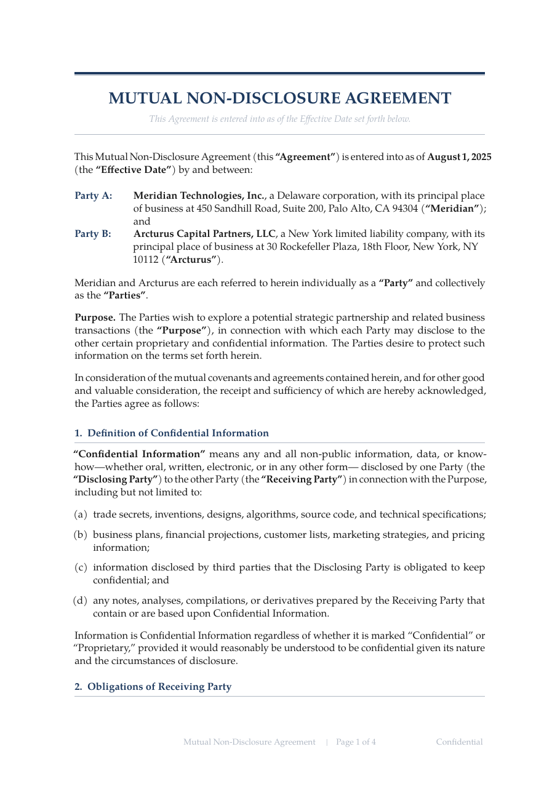</a><br><b>Non-Disclosure Agreement</b><br><a href="https://letx.app/templates/miscellaneous/nda-template">Open in LetX</a> · <a href="./miscellaneous/nda-template">Source</a></td>
<td width="33%" valign="top" align="center"><a href="https://letx.app/templates/miscellaneous/pakistani-marriage-biodata">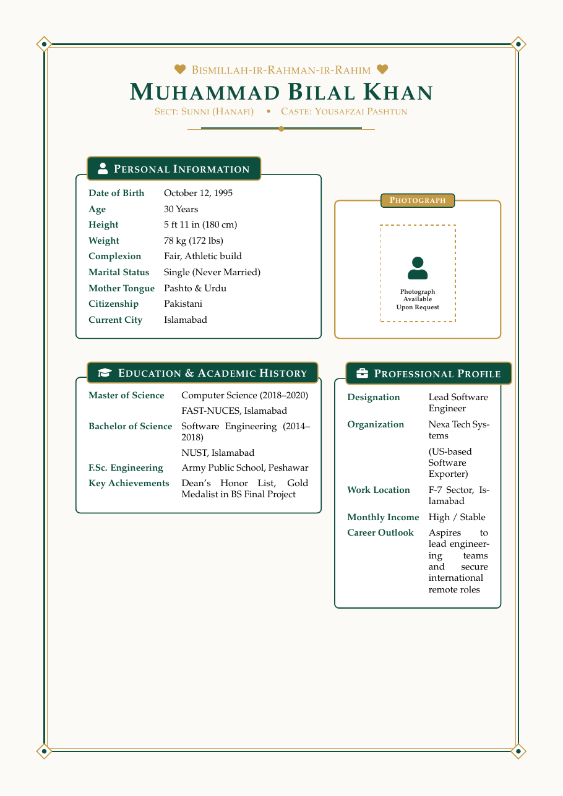</a><br><b>Pakistani Marriage Biodata</b><br><a href="https://letx.app/templates/miscellaneous/pakistani-marriage-biodata">Open in LetX</a> · <a href="./miscellaneous/pakistani-marriage-biodata">Source</a></td>
<td width="33%" valign="top" align="center"><a href="https://letx.app/templates/miscellaneous/patent-application">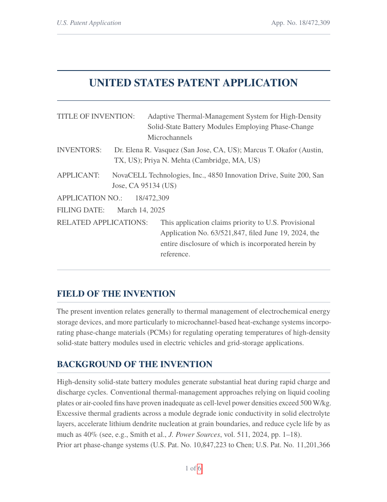</a><br><b>Patent Application</b><br><a href="https://letx.app/templates/miscellaneous/patent-application">Open in LetX</a> · <a href="./miscellaneous/patent-application">Source</a></td>
</tr>
<tr>
<td width="33%" valign="top" align="center"><a href="https://letx.app/templates/miscellaneous/personal-budget-planner">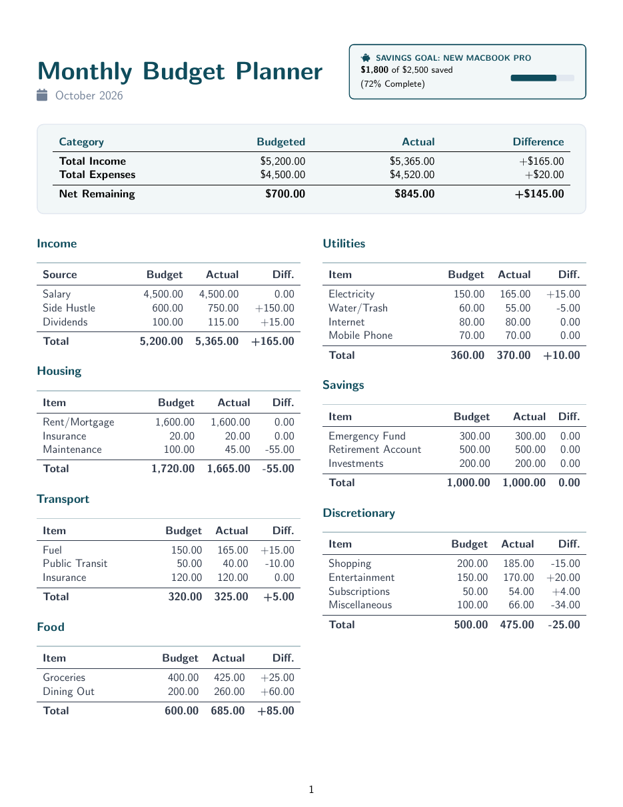</a><br><b>Personal Budget Planner</b><br><a href="https://letx.app/templates/miscellaneous/personal-budget-planner">Open in LetX</a> · <a href="./miscellaneous/personal-budget-planner">Source</a></td>
<td width="33%" valign="top" align="center"><a href="https://letx.app/templates/miscellaneous/poetry-book-layout"></a><br><b>Poetry Book Layout</b><br><a href="https://letx.app/templates/miscellaneous/poetry-book-layout">Open in LetX</a> · <a href="./miscellaneous/poetry-book-layout">Source</a></td>
<td width="33%" valign="top" align="center"><a href="https://letx.app/templates/miscellaneous/press-release">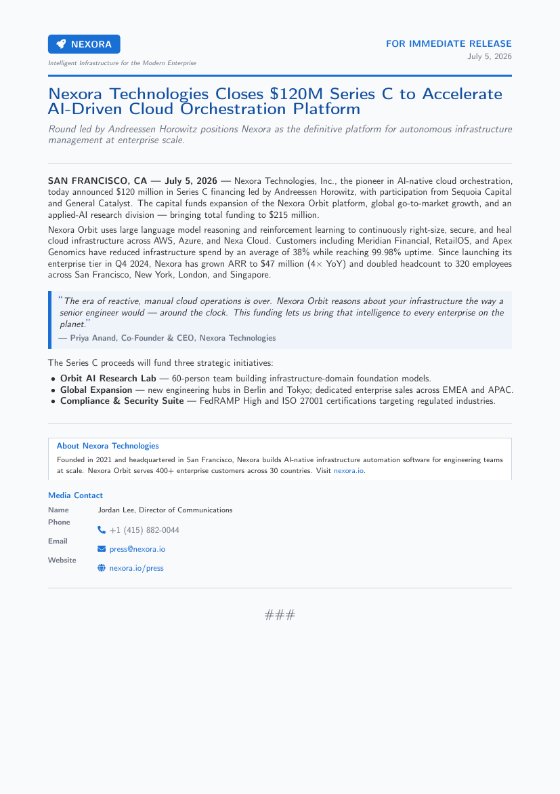</a><br><b>Press Release</b><br><a href="https://letx.app/templates/miscellaneous/press-release">Open in LetX</a> · <a href="./miscellaneous/press-release">Source</a></td>
</tr>
<tr>
<td width="33%" valign="top" align="center"><a href="https://letx.app/templates/miscellaneous/printable-ticket">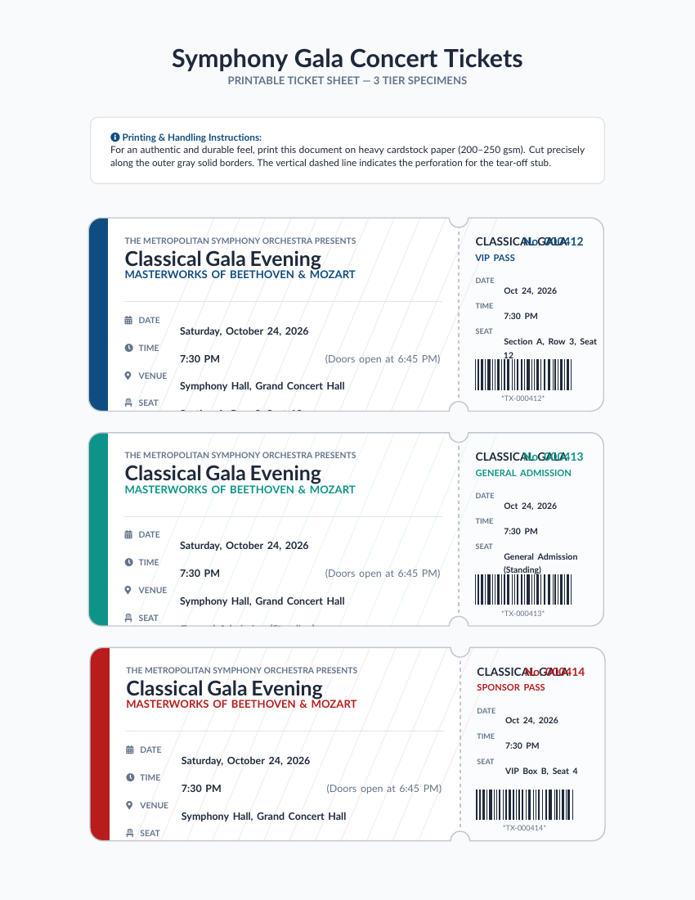</a><br><b>Printable Event Ticket</b><br><a href="https://letx.app/templates/miscellaneous/printable-ticket">Open in LetX</a> · <a href="./miscellaneous/printable-ticket">Source</a></td>
<td width="33%" valign="top" align="center"><a href="https://letx.app/templates/miscellaneous/product-label">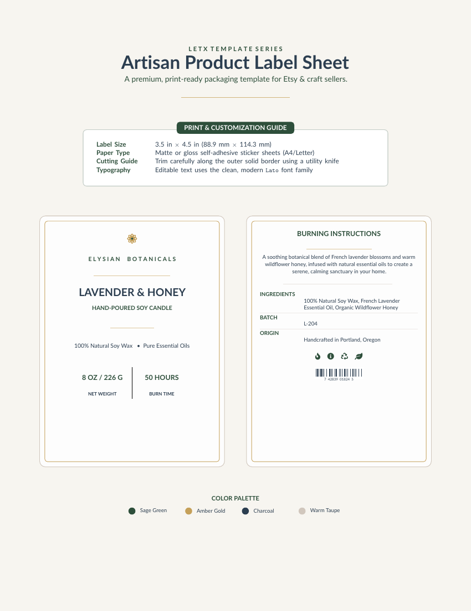</a><br><b>Product Label</b><br><a href="https://letx.app/templates/miscellaneous/product-label">Open in LetX</a> · <a href="./miscellaneous/product-label">Source</a></td>
<td width="33%" valign="top" align="center"><a href="https://letx.app/templates/miscellaneous/punjabi-marriage-biodata">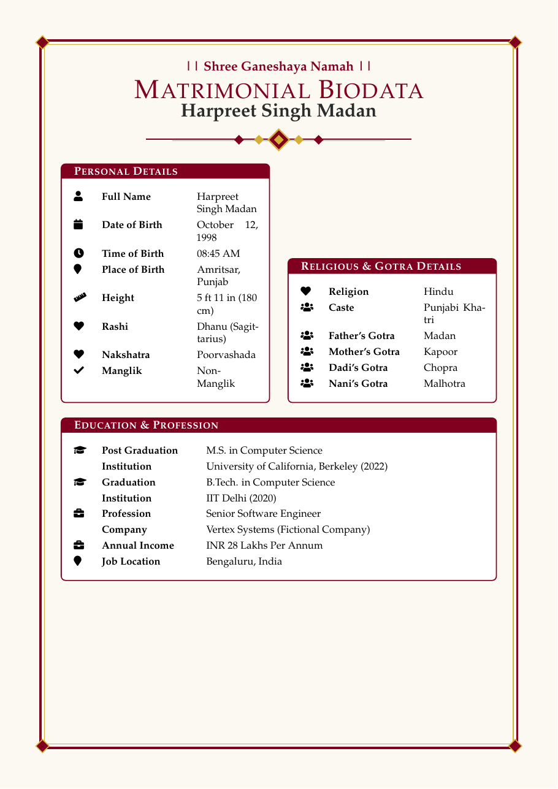</a><br><b>Punjabi Marriage Biodata</b><br><a href="https://letx.app/templates/miscellaneous/punjabi-marriage-biodata">Open in LetX</a> · <a href="./miscellaneous/punjabi-marriage-biodata">Source</a></td>
</tr>
<tr>
<td width="33%" valign="top" align="center"><a href="https://letx.app/templates/miscellaneous/purchase-order">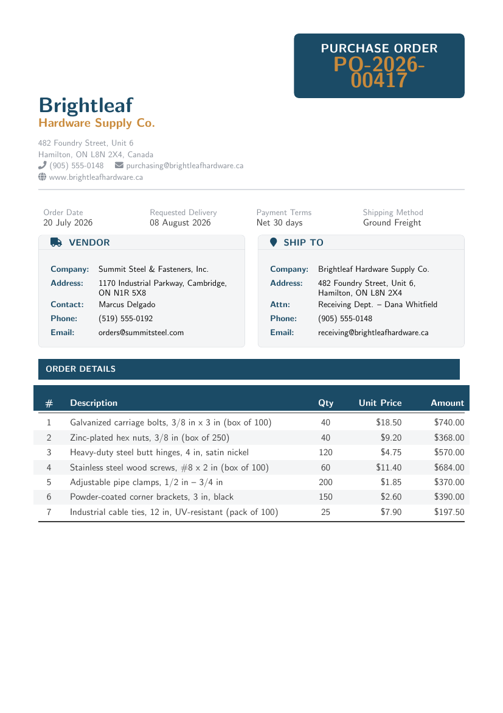</a><br><b>Purchase Order</b><br><a href="https://letx.app/templates/miscellaneous/purchase-order">Open in LetX</a> · <a href="./miscellaneous/purchase-order">Source</a></td>
<td width="33%" valign="top" align="center"><a href="https://letx.app/templates/miscellaneous/quote-estimate">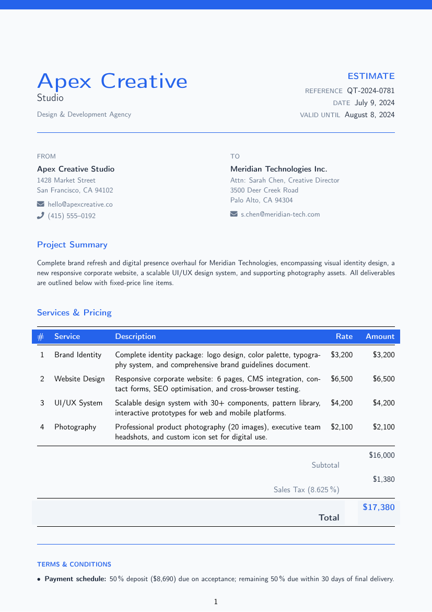</a><br><b>Quote Estimate</b><br><a href="https://letx.app/templates/miscellaneous/quote-estimate">Open in LetX</a> · <a href="./miscellaneous/quote-estimate">Source</a></td>
<td width="33%" valign="top" align="center"><a href="https://letx.app/templates/miscellaneous/receipt-template">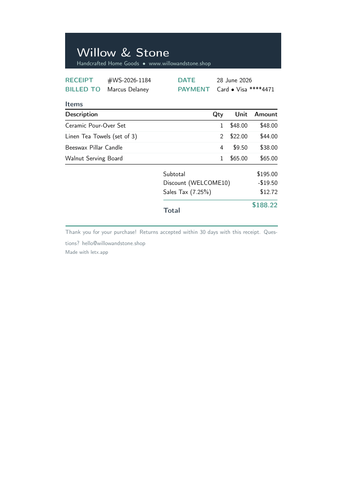</a><br><b>Receipt</b><br><a href="https://letx.app/templates/miscellaneous/receipt-template">Open in LetX</a> · <a href="./miscellaneous/receipt-template">Source</a></td>
</tr>
<tr>
<td width="33%" valign="top" align="center"><a href="https://letx.app/templates/miscellaneous/report-cover">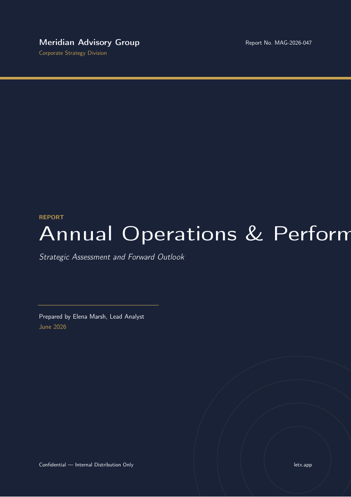</a><br><b>Report Cover Page</b><br><a href="https://letx.app/templates/miscellaneous/report-cover">Open in LetX</a> · <a href="./miscellaneous/report-cover">Source</a></td>
<td width="33%" valign="top" align="center"><a href="https://letx.app/templates/miscellaneous/restaurant-menu">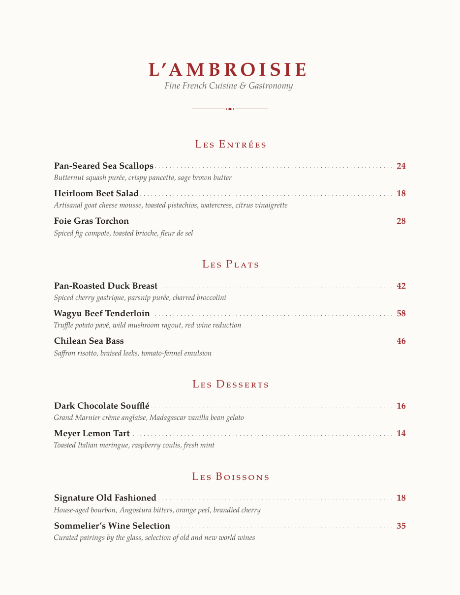</a><br><b>Restaurant Menu</b><br><a href="https://letx.app/templates/miscellaneous/restaurant-menu">Open in LetX</a> · <a href="./miscellaneous/restaurant-menu">Source</a></td>
<td width="33%" valign="top" align="center"><a href="https://letx.app/templates/miscellaneous/royal-rajput-biodata">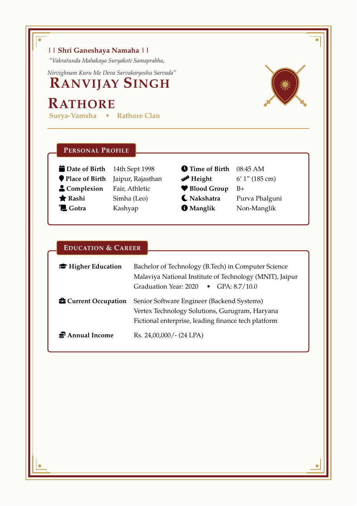</a><br><b>Royal Rajput Biodata</b><br><a href="https://letx.app/templates/miscellaneous/royal-rajput-biodata">Open in LetX</a> · <a href="./miscellaneous/royal-rajput-biodata">Source</a></td>
</tr>
<tr>
<td width="33%" valign="top" align="center"><a href="https://letx.app/templates/miscellaneous/save-the-date">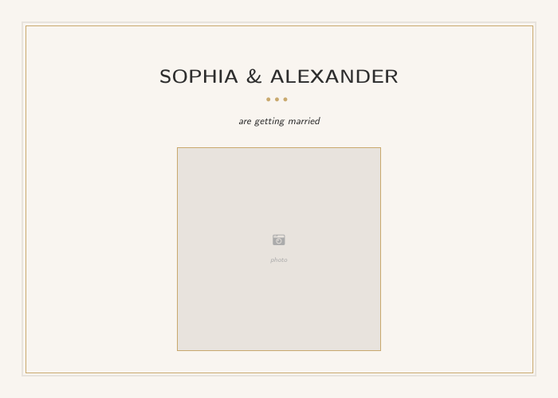</a><br><b>Save the Date Card</b><br><a href="https://letx.app/templates/miscellaneous/save-the-date">Open in LetX</a> · <a href="./miscellaneous/save-the-date">Source</a></td>
<td width="33%" valign="top" align="center"><a href="https://letx.app/templates/miscellaneous/scientific-figure-panel">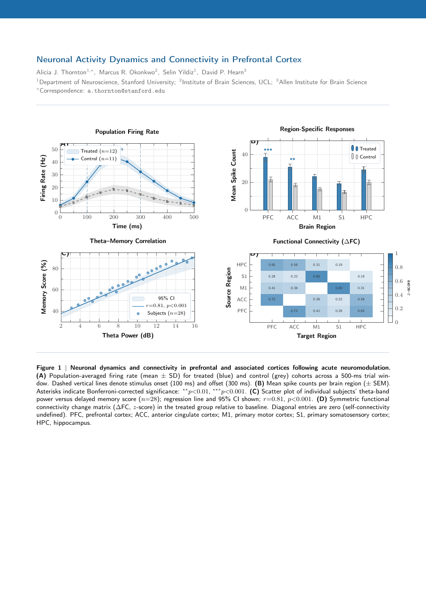</a><br><b>Scientific Figure Panel</b><br><a href="https://letx.app/templates/miscellaneous/scientific-figure-panel">Open in LetX</a> · <a href="./miscellaneous/scientific-figure-panel">Source</a></td>
<td width="33%" valign="top" align="center"><a href="https://letx.app/templates/miscellaneous/screenplay-script-format">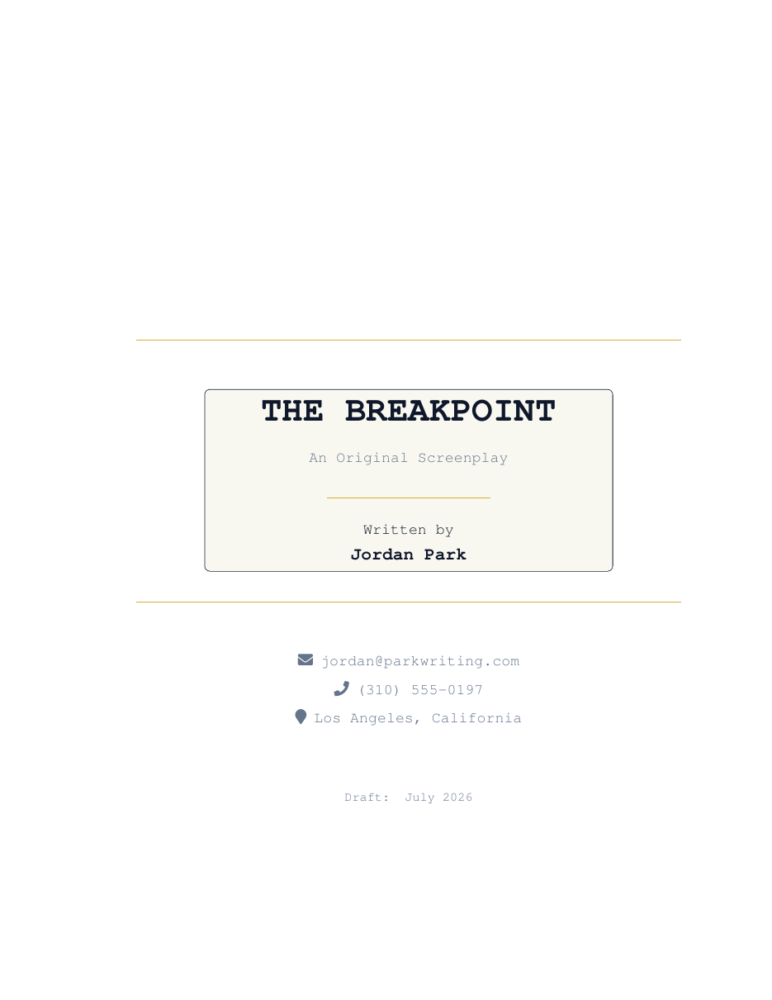</a><br><b>Screenplay / Script Format</b><br><a href="https://letx.app/templates/miscellaneous/screenplay-script-format">Open in LetX</a> · <a href="./miscellaneous/screenplay-script-format">Source</a></td>
</tr>
<tr>
<td width="33%" valign="top" align="center"><a href="https://letx.app/templates/miscellaneous/sikh-marriage-biodata">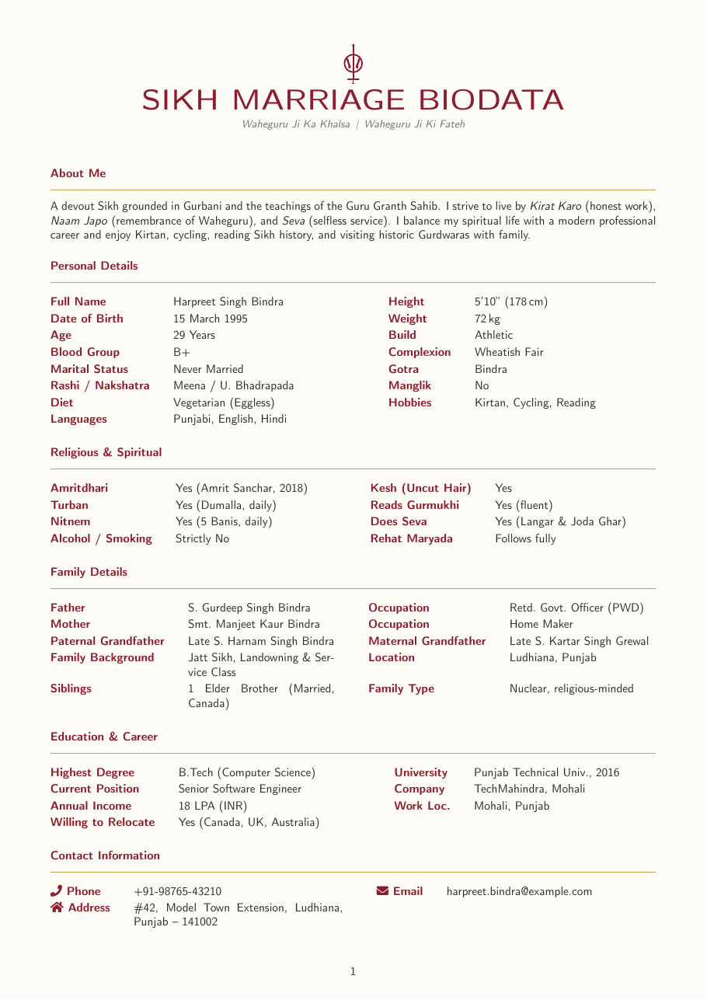</a><br><b>Sikh Marriage Biodata</b><br><a href="https://letx.app/templates/miscellaneous/sikh-marriage-biodata">Open in LetX</a> · <a href="./miscellaneous/sikh-marriage-biodata">Source</a></td>
<td width="33%" valign="top" align="center"><a href="https://letx.app/templates/miscellaneous/south-indian-marriage-biodata">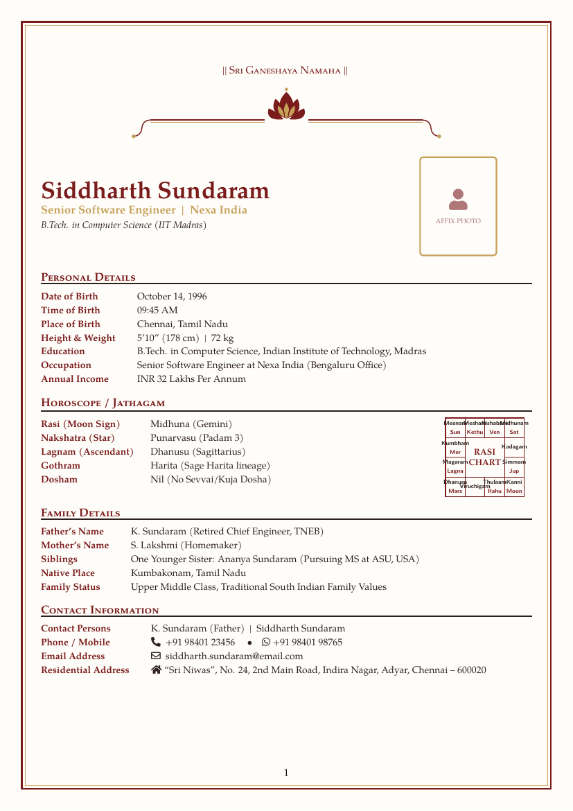</a><br><b>South Indian Marriage Biodata</b><br><a href="https://letx.app/templates/miscellaneous/south-indian-marriage-biodata">Open in LetX</a> · <a href="./miscellaneous/south-indian-marriage-biodata">Source</a></td>
<td width="33%" valign="top" align="center"><a href="https://letx.app/templates/miscellaneous/sri-lankan-marriage-biodata">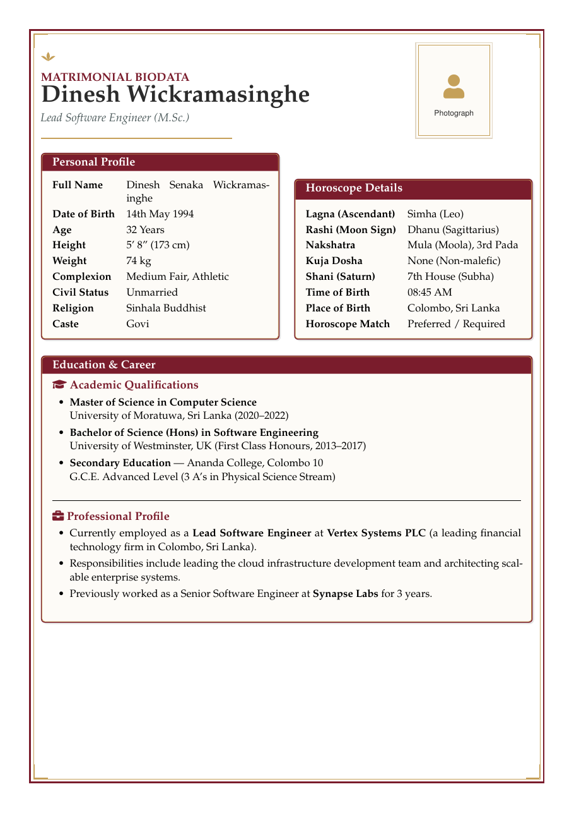</a><br><b>Sri Lankan Marriage Biodata</b><br><a href="https://letx.app/templates/miscellaneous/sri-lankan-marriage-biodata">Open in LetX</a> · <a href="./miscellaneous/sri-lankan-marriage-biodata">Source</a></td>
</tr>
<tr>
<td width="33%" valign="top" align="center"><a href="https://letx.app/templates/miscellaneous/tamil-marriage-biodata">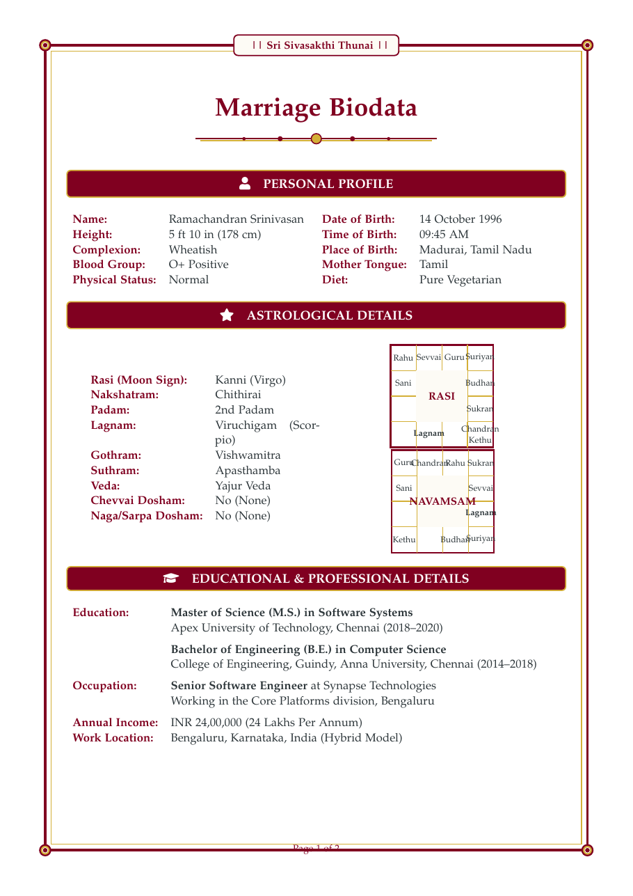</a><br><b>Tamil Marriage Biodata</b><br><a href="https://letx.app/templates/miscellaneous/tamil-marriage-biodata">Open in LetX</a> · <a href="./miscellaneous/tamil-marriage-biodata">Source</a></td>
<td width="33%" valign="top" align="center"><a href="https://letx.app/templates/miscellaneous/telugu-marriage-biodata">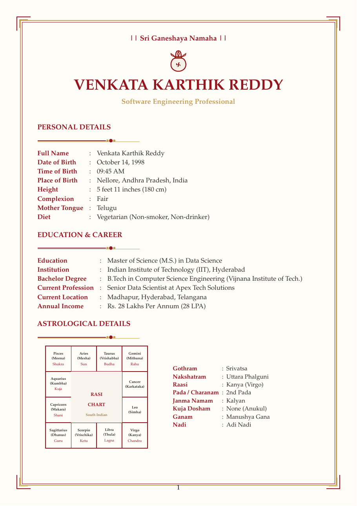</a><br><b>Telugu Marriage Biodata</b><br><a href="https://letx.app/templates/miscellaneous/telugu-marriage-biodata">Open in LetX</a> · <a href="./miscellaneous/telugu-marriage-biodata">Source</a></td>
<td width="33%" valign="top" align="center"><a href="https://letx.app/templates/miscellaneous/timesheet-template">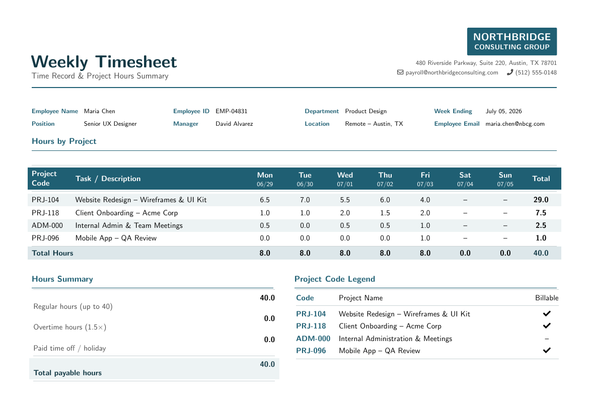</a><br><b>Timesheet</b><br><a href="https://letx.app/templates/miscellaneous/timesheet-template">Open in LetX</a> · <a href="./miscellaneous/timesheet-template">Source</a></td>
</tr>
<tr>
<td width="33%" valign="top" align="center"><a href="https://letx.app/templates/miscellaneous/traditional-marriage-biodata">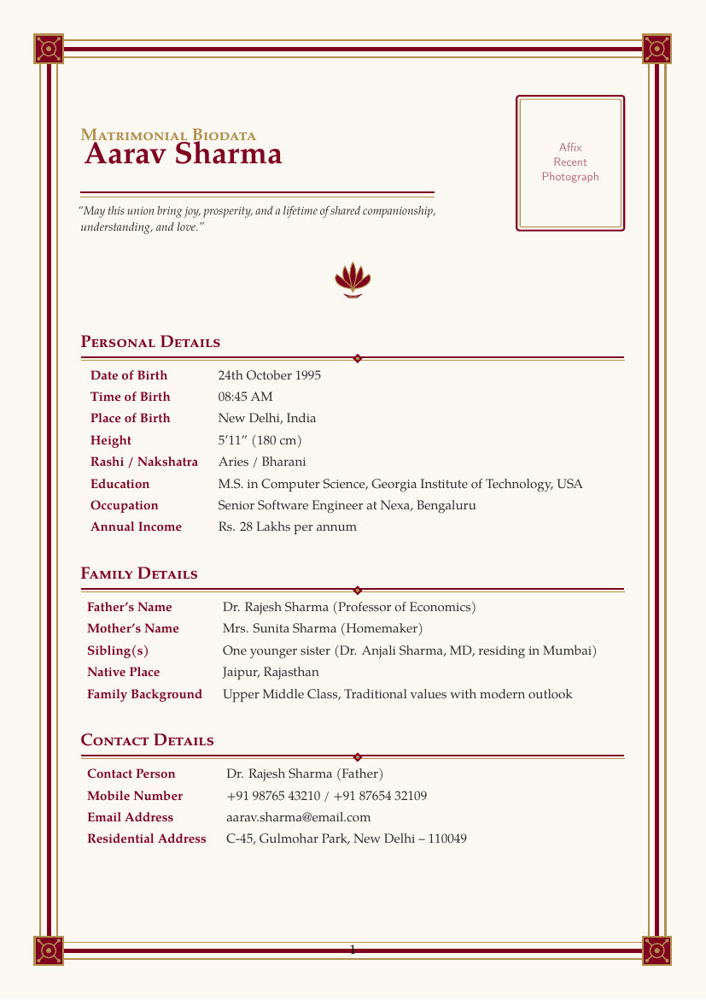</a><br><b>Traditional Marriage Biodata</b><br><a href="https://letx.app/templates/miscellaneous/traditional-marriage-biodata">Open in LetX</a> · <a href="./miscellaneous/traditional-marriage-biodata">Source</a></td>
<td width="33%" valign="top" align="center"><a href="https://letx.app/templates/miscellaneous/training-certificate">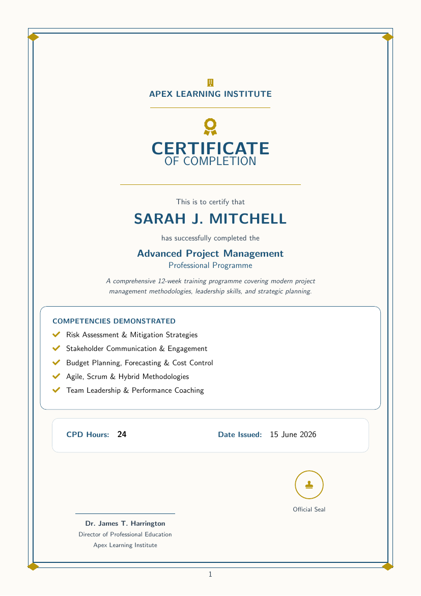</a><br><b>Training Certificate</b><br><a href="https://letx.app/templates/miscellaneous/training-certificate">Open in LetX</a> · <a href="./miscellaneous/training-certificate">Source</a></td>
<td width="33%" valign="top" align="center"><a href="https://letx.app/templates/miscellaneous/travel-itinerary">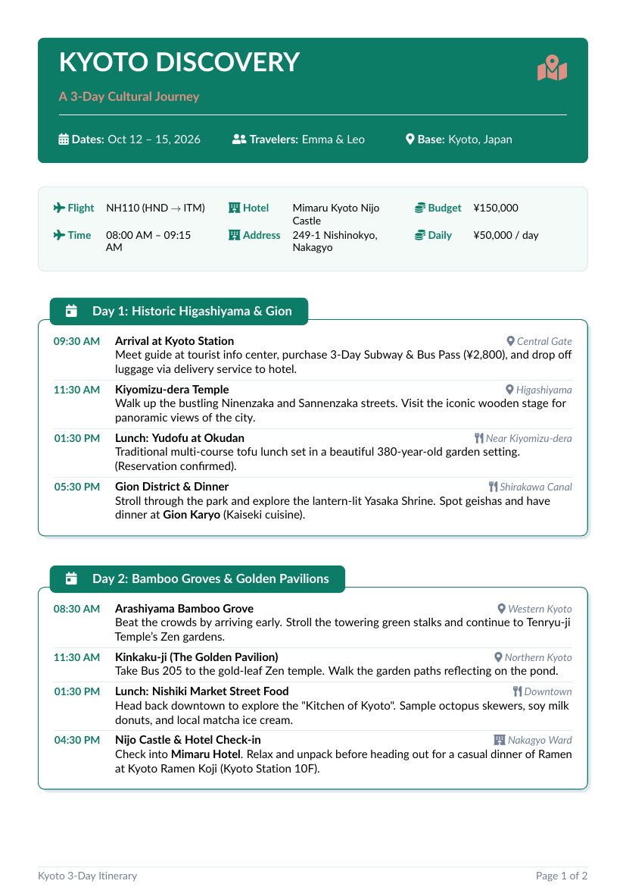</a><br><b>Travel Itinerary</b><br><a href="https://letx.app/templates/miscellaneous/travel-itinerary">Open in LetX</a> · <a href="./miscellaneous/travel-itinerary">Source</a></td>
</tr>
<tr>
<td width="33%" valign="top" align="center"><a href="https://letx.app/templates/miscellaneous/packing-checklist">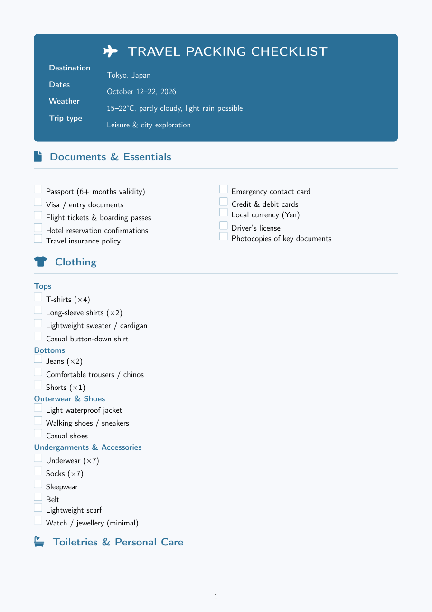</a><br><b>Travel Packing Checklist</b><br><a href="https://letx.app/templates/miscellaneous/packing-checklist">Open in LetX</a> · <a href="./miscellaneous/packing-checklist">Source</a></td>
<td width="33%" valign="top" align="center"><a href="https://letx.app/templates/miscellaneous/foldable-card">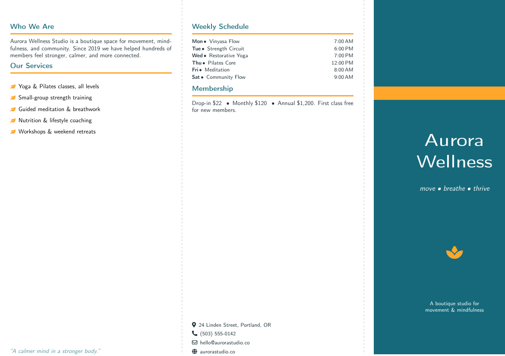</a><br><b>Tri-Fold Brochure</b><br><a href="https://letx.app/templates/miscellaneous/foldable-card">Open in LetX</a> · <a href="./miscellaneous/foldable-card">Source</a></td>
<td width="33%" valign="top" align="center"><a href="https://letx.app/templates/miscellaneous/urdu-marriage-biodata">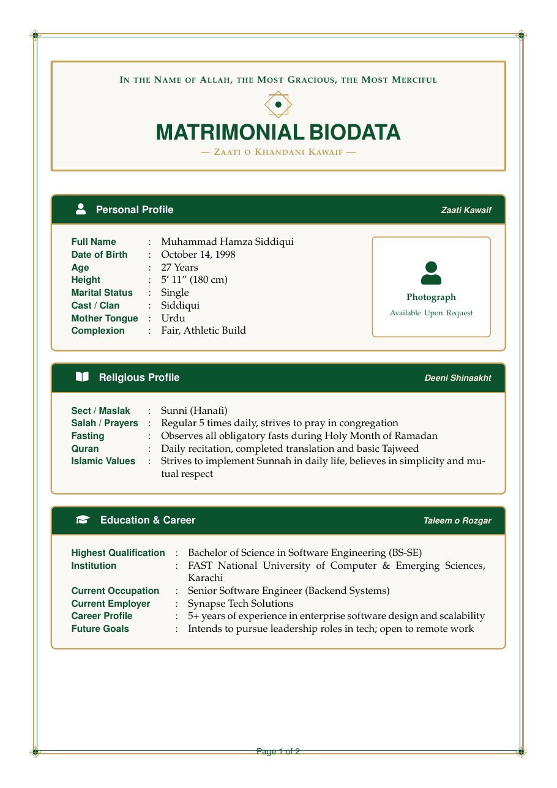</a><br><b>Urdu Matrimonial Biodata</b><br><a href="https://letx.app/templates/miscellaneous/urdu-marriage-biodata">Open in LetX</a> · <a href="./miscellaneous/urdu-marriage-biodata">Source</a></td>
</tr>
<tr>
<td width="33%" valign="top" align="center"><a href="https://letx.app/templates/miscellaneous/wedding-invitation">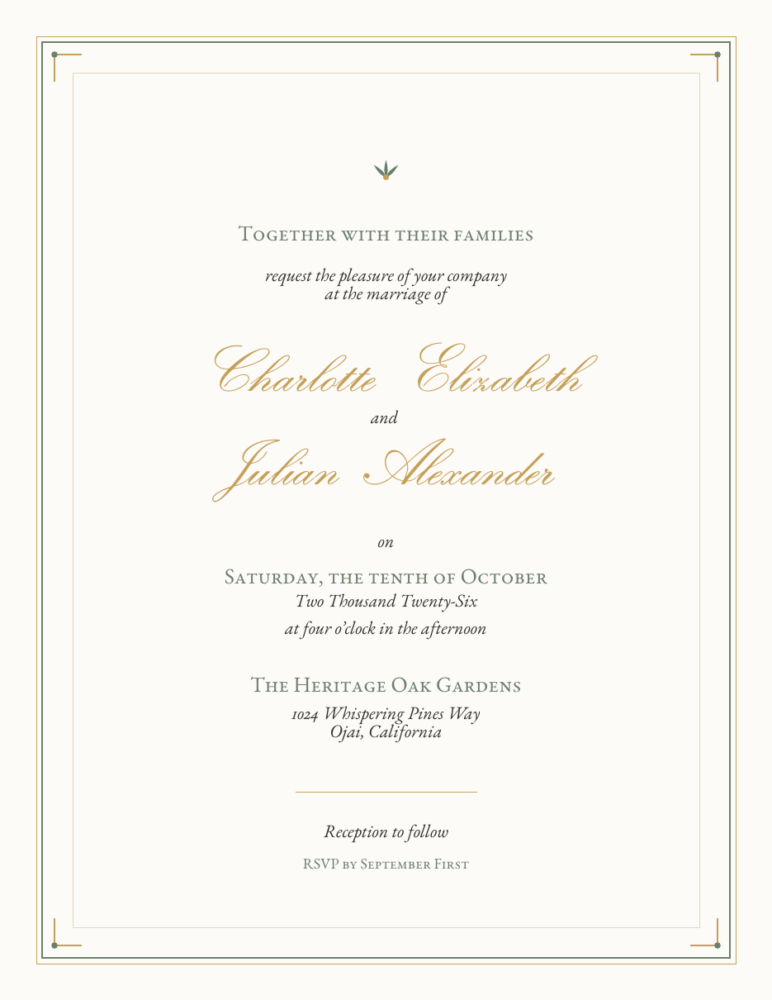</a><br><b>Wedding Invitation</b><br><a href="https://letx.app/templates/miscellaneous/wedding-invitation">Open in LetX</a> · <a href="./miscellaneous/wedding-invitation">Source</a></td>
<td width="33%" valign="top" align="center"><a href="https://letx.app/templates/miscellaneous/wedding-program">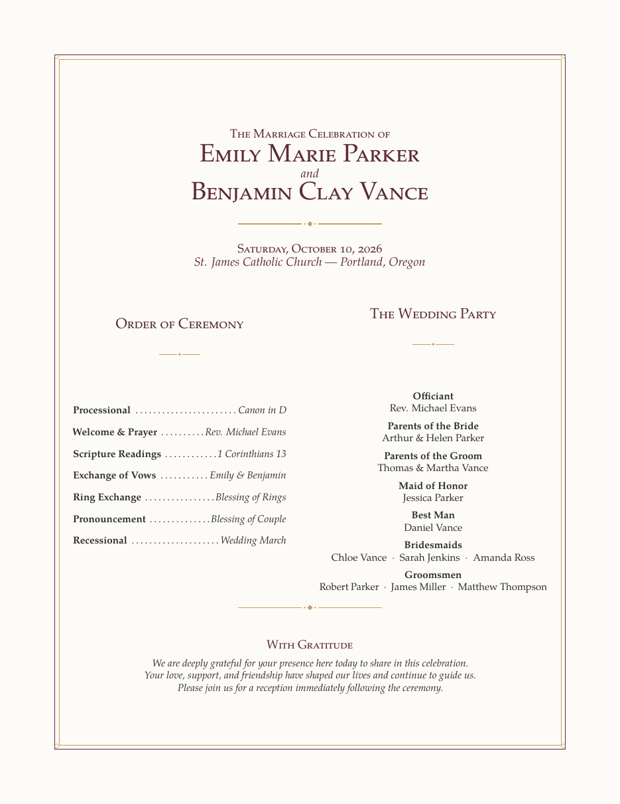</a><br><b>Wedding Program</b><br><a href="https://letx.app/templates/miscellaneous/wedding-program">Open in LetX</a> · <a href="./miscellaneous/wedding-program">Source</a></td>
<td width="33%" valign="top" align="center"><a href="https://letx.app/templates/miscellaneous/meal-planner">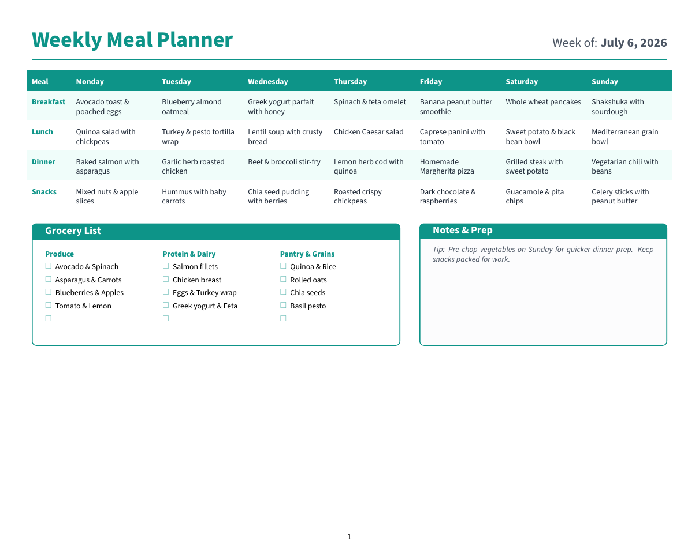</a><br><b>Weekly Meal Planner</b><br><a href="https://letx.app/templates/miscellaneous/meal-planner">Open in LetX</a> · <a href="./miscellaneous/meal-planner">Source</a></td>
</tr>
<tr>
<td width="33%" valign="top" align="center"><a href="https://letx.app/templates/miscellaneous/workout-log">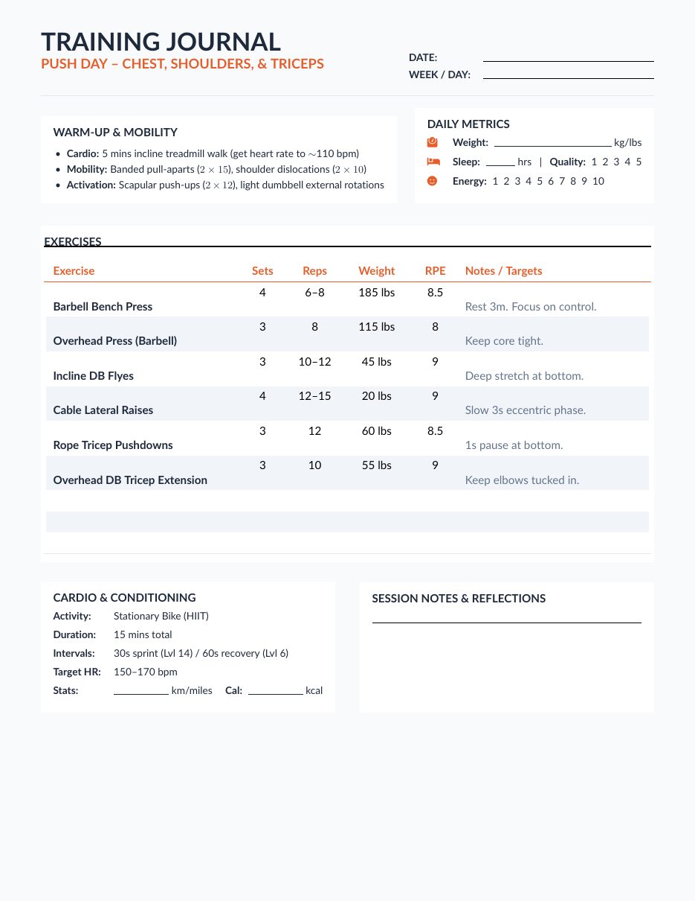</a><br><b>Workout Log</b><br><a href="https://letx.app/templates/miscellaneous/workout-log">Open in LetX</a> · <a href="./miscellaneous/workout-log">Source</a></td>
</tr>
</table>

## Frequently asked questions

### Are these LaTeX templates free?

Yes. All 350 templates in this repository are MIT-licensed and free for academic and commercial use, with no account or signup required. You can clone the repo and use them entirely offline, or open them in the browser at [letx.app/templates](https://letx.app/templates).

### Can I use these without installing LaTeX?

Yes. Click *Open in LetX* on any template and it opens in a browser-based editor that compiles to PDF on managed infrastructure — no TeX Live install, and it works the same on Windows, macOS and Linux.

### Which compiler does each template need?

Each template's `metadata.json` names its compiler. Most use `pdflatex`; templates using custom fonts via `fontspec` require `xelatex` or `lualatex`. Running `latexmk -pdf main.tex` works for the pdflatex ones.

### Do you have a template for my university's thesis format?

This repository groups university and thesis formats under [`universities/`](#university--thesis-templates). The complete set across both repositories and the live library covers 601+ templates including many regional university formats — search [letx.app/templates/universities](https://letx.app/templates/universities). If yours is missing, open an issue or a pull request.

### How is this different from Overleaf's template gallery?

These templates are open source and version-controlled: you can clone them, diff them, and submit fixes. They are also free to open and edit collaboratively without a per-collaborator charge.

## Related

- **[shihabshahrier/Latex_Templates](https://github.com/shihabshahrier/Latex_Templates)** — the companion collection — a further set of templates in the same categories, with no overlap with this one.
- **[letx.app/templates](https://letx.app/templates)** — the full searchable library of 601+ templates, with live preview and one-click editing.
- **[letx.app](https://letx.app)** — the collaborative LaTeX editor these templates are built for: real-time co-authoring, compile to PDF in seconds, no install.

## Contributing

Templates are organised as `<category>/<template-slug>/`. To add one, create a directory under the right category containing `main.tex`, `metadata.json`, and a compiled `main.pdf`. Open a pull request — contributions of university thesis formats are especially welcome, since those are the hardest for students to find.

## License

MIT — free for academic and commercial use. Individual templates that adapt an official publisher or university class file retain the licence of that upstream file; see each template's `metadata.json`.

