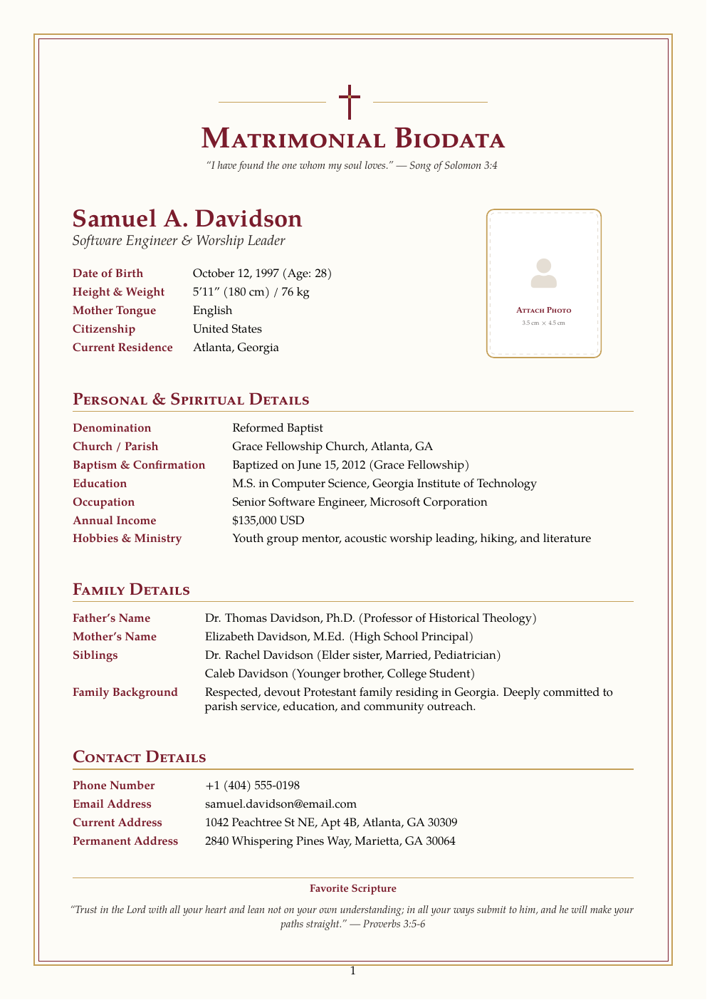

# Christian Marriage Biodata — Free LaTeX Template

[](https://letx.app/templates/miscellaneous/christian-marriage-biodata)
[](LICENSE)
[](#compile)

**Christian marriage biodata LaTeX template — refined burgundy & gold border with a cross motif, photo placeholder, Personal & Spiritual details (Denomination, Church, Baptism), Family, Contact and a scripture line. One page.**

Edit and compile this template instantly in your browser — no LaTeX install — at **[letx.app](https://letx.app/templates/miscellaneous/christian-marriage-biodata)**, with real-time collaboration and one-second compiles.



## Features
- Burgundy & gold border with a cross motif
- Personal & Spiritual: Denomination, Church, Baptism
- Photo placeholder + scripture lines
- Family & Contact sections
- One page

## Use it online (recommended)
Open **[Christian Marriage Biodata on LetX »](https://letx.app/templates/miscellaneous/christian-marriage-biodata)** and click *Open as Template* — it compiles in ~1 second, in your browser, free.

## <a name="compile"></a>Compile locally
```bash
git clone https://github.com/Shahriar-Labs/christian-marriage-biodata.git
cd christian-marriage-biodata
latexmk -pdf main.tex
```
Compiler: **pdflatex** (see `metadata.json`).

## About
Part of the free, open-source [LetX template library](https://letx.app/templates) — miscellaneous templates for students, researchers, and professionals. Built by [Shahriar Labs](https://shahriarlabs.com).

## License
MIT — free for personal and commercial use. See [LICENSE](LICENSE).
