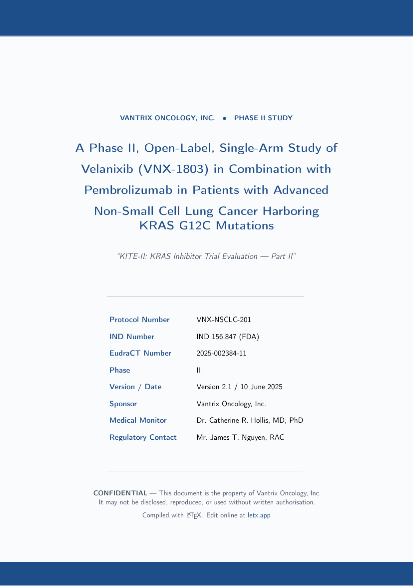

# Clinical Trial Protocol — Free LaTeX Template

[](https://letx.app/templates/medical/clinical-trial-protocol)
[](LICENSE)
[](#compile)

**Clinical trial protocol LaTeX template — ICH E6(R2)/SPIRIT structure with synopsis table, objectives and endpoints, eligibility criteria, a schedule-of-assessments grid, and statistical and safety sections. Realistic Phase II oncology example.**

Edit and compile this template instantly in your browser — no LaTeX install — at **[letx.app](https://letx.app/templates/medical/clinical-trial-protocol)**, with real-time collaboration and one-second compiles.



## Features
- ICH E6(R2)/SPIRIT protocol structure
- Synopsis + objectives/endpoints tables
- Inclusion/exclusion criteria lists
- Schedule-of-assessments (SoA) grid
- Safety/AE reporting + statistics sections

## Use it online (recommended)
Open **[Clinical Trial Protocol on LetX »](https://letx.app/templates/medical/clinical-trial-protocol)** and click *Open as Template* — it compiles in ~1 second, in your browser, free.

## <a name="compile"></a>Compile locally
```bash
git clone https://github.com/Shahriar-Labs/latex-templates.git
cd latex-templates/clinical-trial-protocol
latexmk -pdf main.tex
```
Compiler: **pdflatex** (see `metadata.json`).

## About
Part of the free, open-source [LetX template library](https://letx.app/templates) — medical and clinical templates for students, researchers, and professionals. Built by [Shahriar Labs](https://shahriarlabs.com).

## License
MIT — free for personal and commercial use. See [LICENSE](LICENSE).
