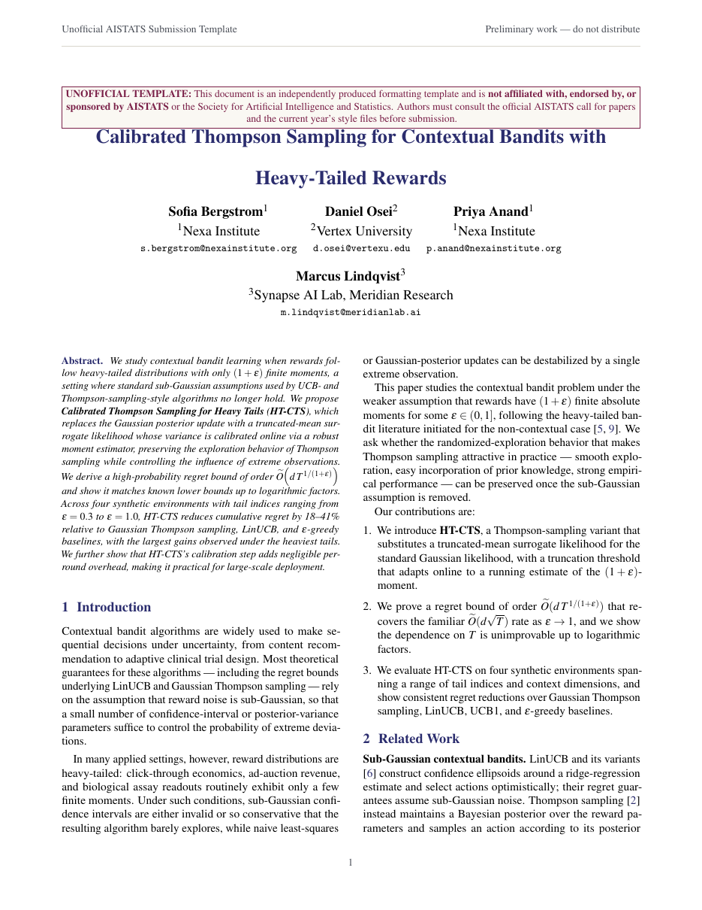

# AISTATS Submission Paper LaTeX Template

[](https://letx.app/templates/conferences/aistats-submission-paper/)
[](LICENSE)

An AISTATS-style paper in two columns on the article class with natbib and pgfplots, six results tables, and the usual Method, Experiments, Results and Discussion sections.

Edit and compile it in your browser at **[letx.app](https://letx.app/templates/conferences/aistats-submission-paper/)**, with no LaTeX install and real-time collaboration. A compile takes a few seconds.



## What is in it
- Document class: `article` with `10pt, twocolumn`
- Compiler: pdflatex
- Files: `main.bib`, `main.tex`, `preamble.tex`, and 7 section files under `sections/`

## Use it online
Open **[AISTATS Submission Paper on LetX](https://letx.app/templates/conferences/aistats-submission-paper/)** and click *Open as Template*. It is free.

## <a name="compile"></a>Compile locally
```bash
git clone https://github.com/Shahriar-Labs/latex-templates.git
cd latex-templates/conferences/aistats-submission-paper
latexmk -pdf main.tex
```

## About
Part of the free, open-source [LetX template library](https://letx.app/templates/): conference paper templates for students, researchers and professionals. Built by [Shahriar Labs](https://shahriarlabs.com).

## License
MIT. See [LICENSE](LICENSE).
