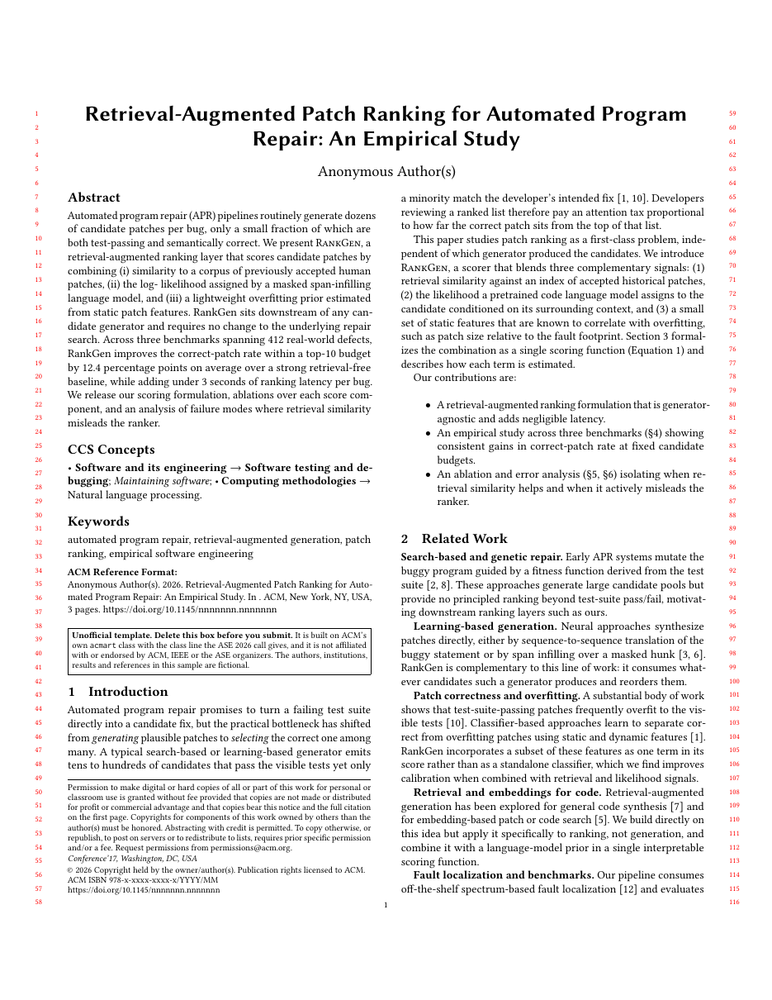

# ASE Technical Paper LaTeX Template

[](https://letx.app/templates/conferences/ase-technical-paper/)
[](LICENSE)

An ASE research paper on ACM's acmart class with the sigconf, review and anonymous options the ASE 2026 call gives, and the data availability statement ASE asks for.

Edit and compile it in your browser at **[letx.app](https://letx.app/templates/conferences/ase-technical-paper/)**, with no LaTeX install and real-time collaboration. A compile takes a few seconds.



## What is in it
- Document class: `acmart` with `sigconf, review, anonymous`
- Compiler: pdflatex
- Files: `main.tex`, `preamble.tex`, `refs.bib`, and 9 section files under `sections/`

## Use it online
Open **[ASE Technical Paper on LetX](https://letx.app/templates/conferences/ase-technical-paper/)** and click *Open as Template*. It is free.

## <a name="compile"></a>Compile locally
```bash
git clone https://github.com/Shahriar-Labs/latex-templates.git
cd latex-templates/conferences/ase-technical-paper
latexmk -pdf main.tex
```

## About
Part of the free, open-source [LetX template library](https://letx.app/templates/): conference paper templates for students, researchers and professionals. Built by [Shahriar Labs](https://shahriarlabs.com).

## License
MIT. See [LICENSE](LICENSE).
