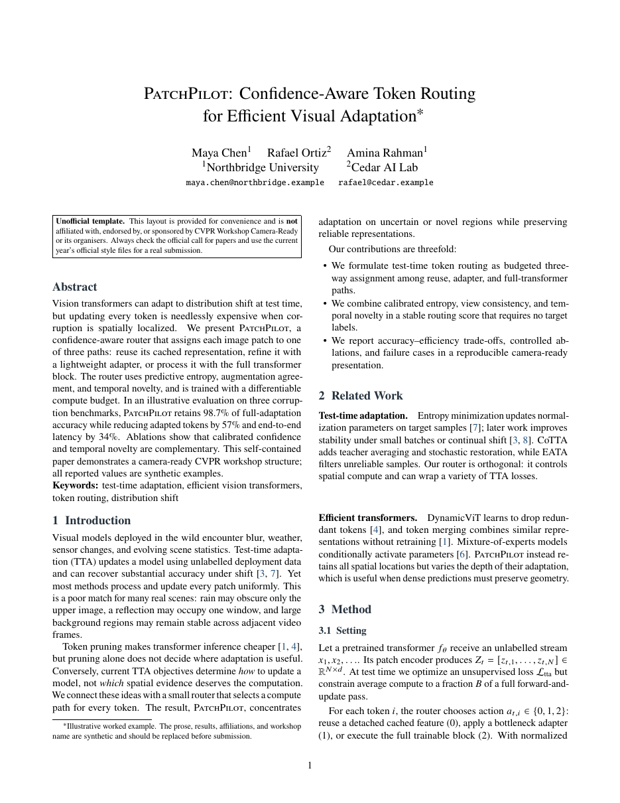

# CVPR Workshop Camera-Ready Template LaTeX Template

[](https://letx.app/templates/conferences/cvpr-workshop-camera-ready-template/)
[](LICENSE)

A CVPR workshop camera-ready paper using the cvpr package in two columns on letter paper, set in newtx Times, with an Analysis and Limitations section and balanced final columns.

Edit and compile it in your browser at **[letx.app](https://letx.app/templates/conferences/cvpr-workshop-camera-ready-template/)**, with no LaTeX install and real-time collaboration. A compile takes a few seconds.



## What is in it
- Document class: `article` with `10pt, twocolumn, letterpaper`
- Compiler: pdflatex
- Files: `main.tex`, `preamble.tex`, and 7 section files under `sections/`

## Use it online
Open **[CVPR Workshop Camera-Ready Template on LetX](https://letx.app/templates/conferences/cvpr-workshop-camera-ready-template/)** and click *Open as Template*. It is free.

## <a name="compile"></a>Compile locally
```bash
git clone https://github.com/Shahriar-Labs/latex-templates.git
cd latex-templates/conferences/cvpr-workshop-camera-ready-template
latexmk -pdf main.tex
```

## About
Part of the free, open-source [LetX template library](https://letx.app/templates/): conference paper templates for students, researchers and professionals. Built by [Shahriar Labs](https://shahriarlabs.com).

## License
MIT. See [LICENSE](LICENSE).
