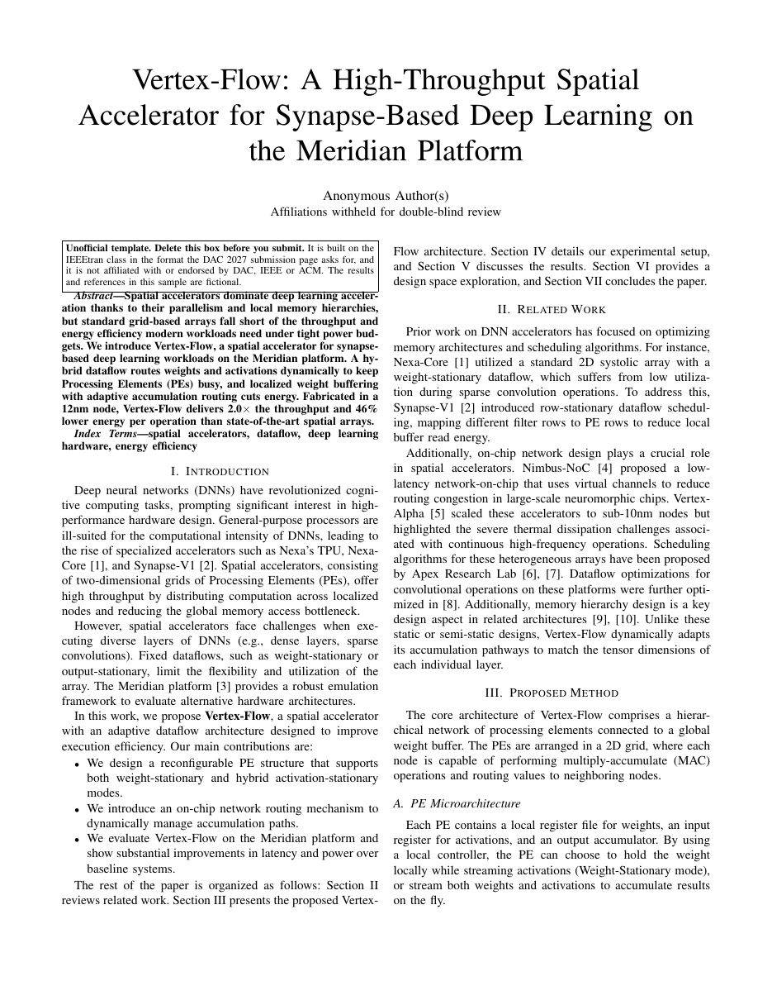

# DAC Design Automation Paper LaTeX Template

[](https://letx.app/templates/conferences/dac-design-automation-paper/)
[](LICENSE)

A DAC research manuscript on the IEEEtran conference class, with an anonymous author block, an abstract of about 100 words, IEEE keywords and PDF metadata that names no authors.

Edit and compile it in your browser at **[letx.app](https://letx.app/templates/conferences/dac-design-automation-paper/)**, with no LaTeX install and real-time collaboration. A compile takes a few seconds.



## What is in it
- Document class: `IEEEtran` with `conference`
- Compiler: pdflatex
- Files: `main.tex`, `preamble.tex`, `references.bib`, and 7 section files under `sections/`

## Use it online
Open **[DAC Design Automation Paper on LetX](https://letx.app/templates/conferences/dac-design-automation-paper/)** and click *Open as Template*. It is free.

## <a name="compile"></a>Compile locally
```bash
git clone https://github.com/Shahriar-Labs/latex-templates.git
cd latex-templates/conferences/dac-design-automation-paper
latexmk -pdf main.tex
```

## About
Part of the free, open-source [LetX template library](https://letx.app/templates/): conference paper templates for students, researchers and professionals. Built by [Shahriar Labs](https://shahriarlabs.com).

## License
MIT. See [LICENSE](LICENSE).
