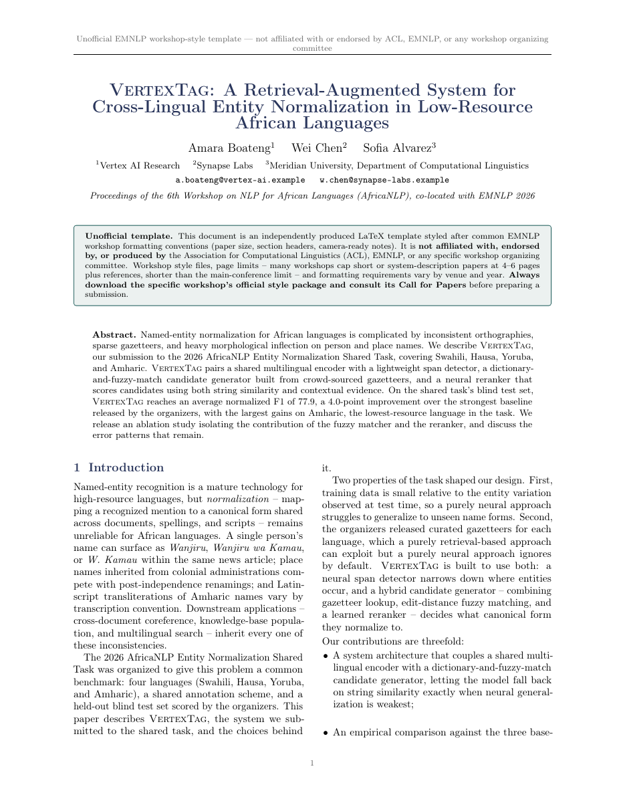

# EMNLP Workshop Research Paper LaTeX Template

[](https://letx.app/templates/conferences/emnlp-workshop-research-paper/)
[](LICENSE)

An EMNLP workshop paper in two columns with Task and Data, Analysis and Limitations sections, natbib references, pgfplots charts and six tables, on the article class.

Edit and compile it in your browser at **[letx.app](https://letx.app/templates/conferences/emnlp-workshop-research-paper/)**, with no LaTeX install and real-time collaboration. A compile takes a few seconds.



## What is in it
- Document class: `article` with `10pt, twocolumn`
- Compiler: pdflatex
- Files: `main.tex`, `preamble.tex`, `references.bib`, and 8 section files under `sections/`

## Use it online
Open **[EMNLP Workshop Research Paper on LetX](https://letx.app/templates/conferences/emnlp-workshop-research-paper/)** and click *Open as Template*. It is free.

## <a name="compile"></a>Compile locally
```bash
git clone https://github.com/Shahriar-Labs/latex-templates.git
cd latex-templates/conferences/emnlp-workshop-research-paper
latexmk -pdf main.tex
```

## About
Part of the free, open-source [LetX template library](https://letx.app/templates/): conference paper templates for students, researchers and professionals. Built by [Shahriar Labs](https://shahriarlabs.com).

## License
MIT. See [LICENSE](LICENSE).
