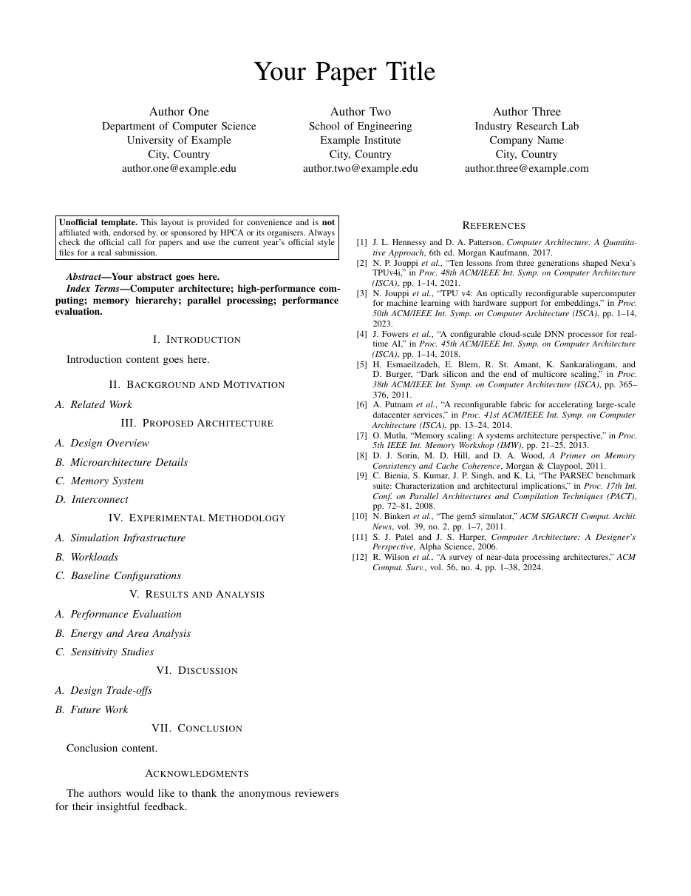

# HPCA Architecture Paper LaTeX Template

[](https://letx.app/templates/conferences/hpca-architecture-paper/)
[](LICENSE)

An HPCA computer architecture paper on IEEEtran in conference mode, with Proposed Architecture, Experimental Methodology, and Results and Analysis sections and code listings.

Edit and compile it in your browser at **[letx.app](https://letx.app/templates/conferences/hpca-architecture-paper/)**, with no LaTeX install and real-time collaboration. A compile takes a few seconds.



## What is in it
- Document class: `IEEEtran` with `conference`
- Compiler: pdflatex
- Files: `main.tex`, `preamble.tex`, and 8 section files under `sections/`

## Use it online
Open **[HPCA Architecture Paper on LetX](https://letx.app/templates/conferences/hpca-architecture-paper/)** and click *Open as Template*. It is free.

## <a name="compile"></a>Compile locally
```bash
git clone https://github.com/Shahriar-Labs/latex-templates.git
cd latex-templates/conferences/hpca-architecture-paper
latexmk -pdf main.tex
```

## About
Part of the free, open-source [LetX template library](https://letx.app/templates/): conference paper templates for students, researchers and professionals. Built by [Shahriar Labs](https://shahriarlabs.com).

## License
MIT. See [LICENSE](LICENSE).
