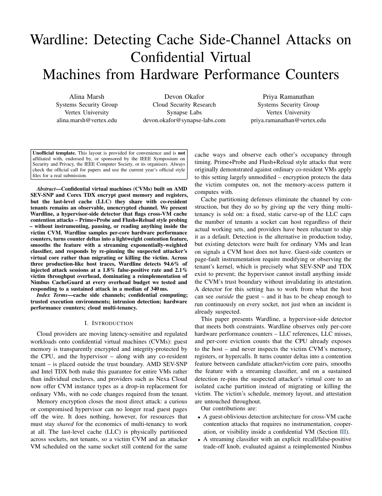

# IEEE S&P (Oakland) Submission Template LaTeX Template

[](https://letx.app/templates/conferences/ieee-s-p-submission-template/)
[](LICENSE)

An IEEE S&P (Oakland) submission on IEEEtran in conference mode, with Background and Threat Model, Implementation, and an Ethical Considerations and Open Science section.

Edit and compile it in your browser at **[letx.app](https://letx.app/templates/conferences/ieee-s-p-submission-template/)**, with no LaTeX install and real-time collaboration. A compile takes a few seconds.



## What is in it
- Document class: `IEEEtran` with `conference`
- Compiler: pdflatex
- Files: `main.tex`, `preamble.tex`, `references.bib`, and 7 section files under `sections/`

## Use it online
Open **[IEEE S&P (Oakland) Submission Template on LetX](https://letx.app/templates/conferences/ieee-s-p-submission-template/)** and click *Open as Template*. It is free.

## <a name="compile"></a>Compile locally
```bash
git clone https://github.com/Shahriar-Labs/latex-templates.git
cd latex-templates/conferences/ieee-s-p-submission-template
latexmk -pdf main.tex
```

## About
Part of the free, open-source [LetX template library](https://letx.app/templates/): conference paper templates for students, researchers and professionals. Built by [Shahriar Labs](https://shahriarlabs.com).

## License
MIT. See [LICENSE](LICENSE).
