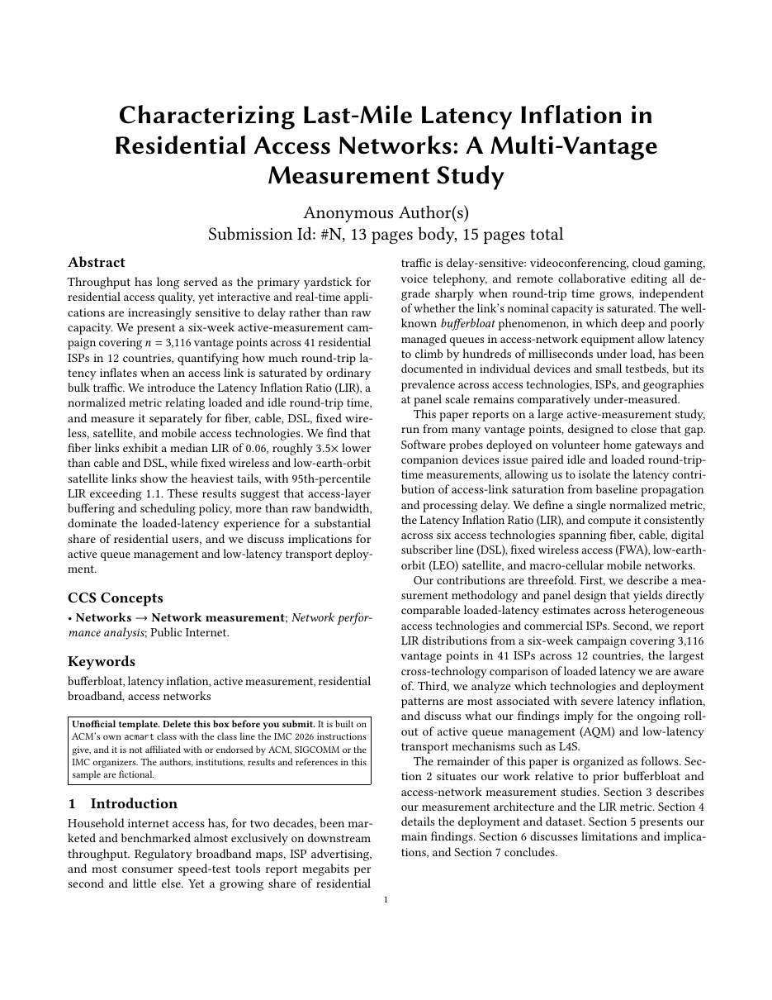

# Internet Measurement Conference Paper LaTeX Template

[](https://letx.app/templates/conferences/internet-measurement-conference-paper/)
[](LICENSE)

An IMC measurement paper on ACM's acmart class with the class line IMC gives, numbered pages, the submission number and page counts in the author block, and the Ethics appendix IMC asks for.

Edit and compile it in your browser at **[letx.app](https://letx.app/templates/conferences/internet-measurement-conference-paper/)**, with no LaTeX install and real-time collaboration. A compile takes a few seconds.



## What is in it
- Document class: `acmart` with `10pt, sigconf, letterpaper, anonymous, nonacm`
- Compiler: pdflatex
- Files: `main.tex`, `preamble.tex`, `references.bib`, and 9 section files under `sections/`

## Use it online
Open **[Internet Measurement Conference Paper on LetX](https://letx.app/templates/conferences/internet-measurement-conference-paper/)** and click *Open as Template*. It is free.

## <a name="compile"></a>Compile locally
```bash
git clone https://github.com/Shahriar-Labs/latex-templates.git
cd latex-templates/conferences/internet-measurement-conference-paper
latexmk -pdf main.tex
```

## About
Part of the free, open-source [LetX template library](https://letx.app/templates/): conference paper templates for students, researchers and professionals. Built by [Shahriar Labs](https://shahriarlabs.com).

## License
MIT. See [LICENSE](LICENSE).
