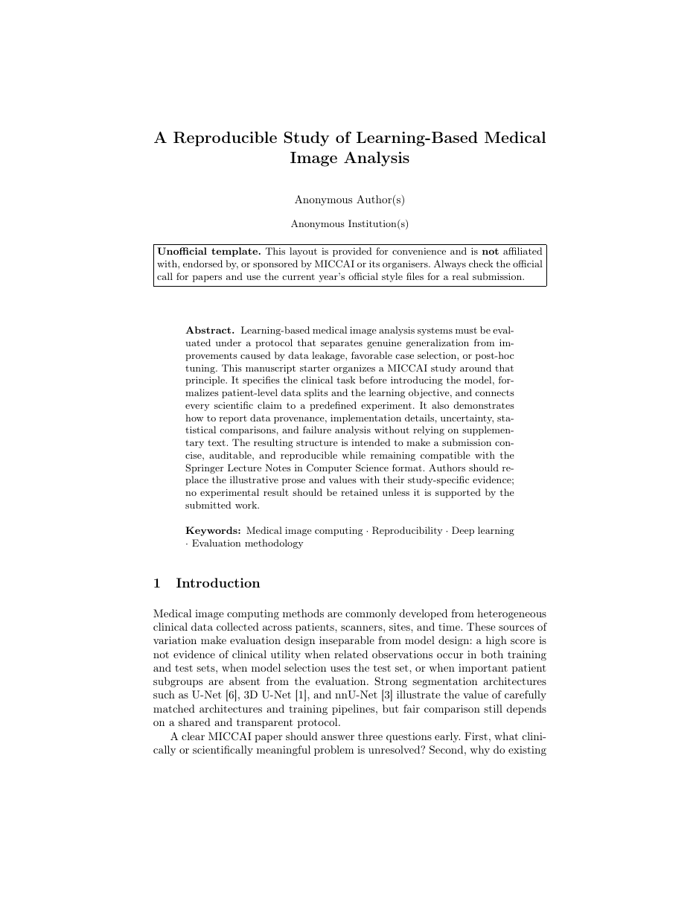

# MICCAI Submission Paper LaTeX Template

[](https://letx.app/templates/conferences/miccai-submission-paper/)
[](LICENSE)

A MICCAI medical imaging submission on Springer's llncs class with running heads, with Method, Experiments and five results tables.

Edit and compile it in your browser at **[letx.app](https://letx.app/templates/conferences/miccai-submission-paper/)**, with no LaTeX install and real-time collaboration. A compile takes a few seconds.



## What is in it
- Document class: `llncs` with `runningheads`
- Compiler: pdflatex
- Files: `main.tex`, `preamble.tex`, and 6 section files under `sections/`

## Use it online
Open **[MICCAI Submission Paper on LetX](https://letx.app/templates/conferences/miccai-submission-paper/)** and click *Open as Template*. It is free.

## <a name="compile"></a>Compile locally
```bash
git clone https://github.com/Shahriar-Labs/latex-templates.git
cd latex-templates/conferences/miccai-submission-paper
latexmk -pdf main.tex
```

## About
Part of the free, open-source [LetX template library](https://letx.app/templates/): conference paper templates for students, researchers and professionals. Built by [Shahriar Labs](https://shahriarlabs.com).

## License
MIT. See [LICENSE](LICENSE).
