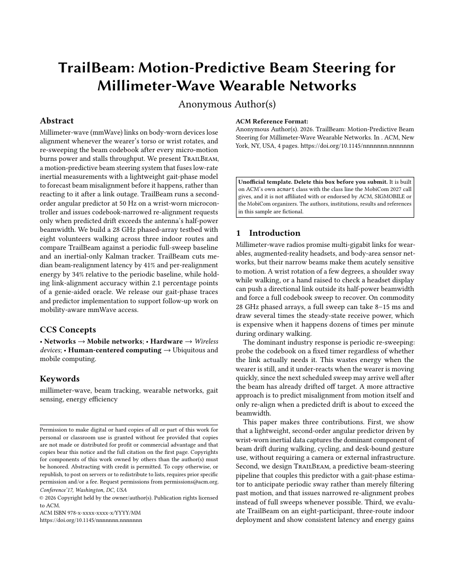

# MobiCom Research Paper LaTeX Template

[](https://letx.app/templates/conferences/mobicom-research-paper/)
[](LICENSE)

A MobiCom paper on ACM's acmart class in sigconf at 10pt, anonymized, with the PDF's hyperlinks switched off as the call asks, CCS concepts, and TikZ and pgfplots figures.

Edit and compile it in your browser at **[letx.app](https://letx.app/templates/conferences/mobicom-research-paper/)**, with no LaTeX install and real-time collaboration. A compile takes a few seconds.



## What is in it
- Document class: `acmart` with `sigconf, 10pt, anonymous`
- Compiler: pdflatex
- Files: `main.tex`, `preamble.tex`, `trailbeam-refs.bib`, and 7 section files under `sections/`

## Use it online
Open **[MobiCom Research Paper on LetX](https://letx.app/templates/conferences/mobicom-research-paper/)** and click *Open as Template*. It is free.

## <a name="compile"></a>Compile locally
```bash
git clone https://github.com/Shahriar-Labs/latex-templates.git
cd latex-templates/conferences/mobicom-research-paper
latexmk -pdf main.tex
```

## About
Part of the free, open-source [LetX template library](https://letx.app/templates/): conference paper templates for students, researchers and professionals. Built by [Shahriar Labs](https://shahriarlabs.com).

## License
MIT. See [LICENSE](LICENSE).
