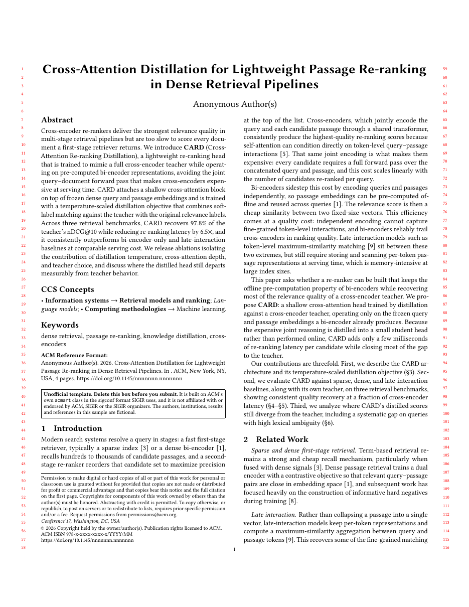

# SIGIR Submission Paper LaTeX Template

[](https://letx.app/templates/conferences/sigir-submission-paper/)
[](LICENSE)

A SIGIR full paper on ACM's acmart class in the two-column sigconf format, anonymized for double-anonymous review, with CCS concepts, a TikZ pipeline figure and ACM-style references.

Edit and compile it in your browser at **[letx.app](https://letx.app/templates/conferences/sigir-submission-paper/)**, with no LaTeX install and real-time collaboration. A compile takes a few seconds.



## What is in it
- Document class: `acmart` with `sigconf, anonymous, review`
- Compiler: pdflatex
- Files: `main.tex`, `preamble.tex`, `references.bib`, and 8 section files under `sections/`

## Use it online
Open **[SIGIR Submission Paper on LetX](https://letx.app/templates/conferences/sigir-submission-paper/)** and click *Open as Template*. It is free.

## <a name="compile"></a>Compile locally
```bash
git clone https://github.com/Shahriar-Labs/latex-templates.git
cd latex-templates/conferences/sigir-submission-paper
latexmk -pdf main.tex
```

## About
Part of the free, open-source [LetX template library](https://letx.app/templates/): conference paper templates for students, researchers and professionals. Built by [Shahriar Labs](https://shahriarlabs.com).

## License
MIT. See [LICENSE](LICENSE).
