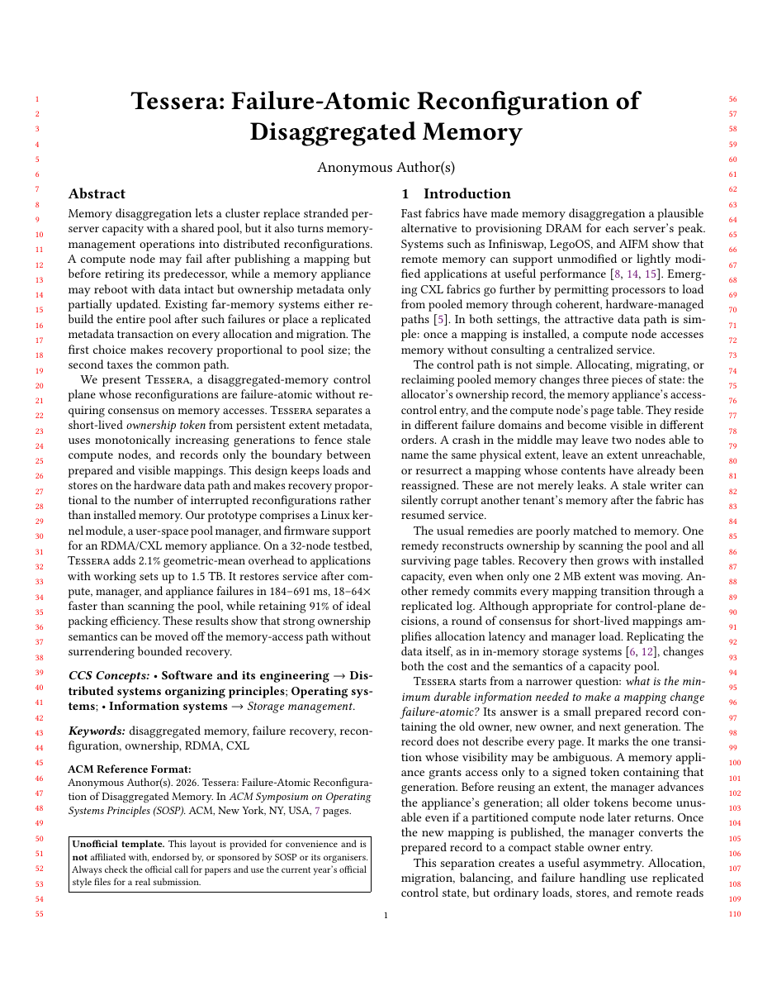

# SOSP Technical Paper LaTeX Template

[](https://letx.app/templates/conferences/sosp-technical-paper/)
[](LICENSE)

A SOSP paper on acmart with sigplan, screen, review and anonymous options, with Design, Implementation, Evaluation, a Safety Argument section and pgfplots charts.

Edit and compile it in your browser at **[letx.app](https://letx.app/templates/conferences/sosp-technical-paper/)**, with no LaTeX install and real-time collaboration. A compile takes a few seconds.



## What is in it
- Document class: `acmart` with `sigplan, screen, review, anonymous`
- Compiler: pdflatex
- Files: `main.tex`, `preamble.tex`, `references.bib`, and 9 section files under `sections/`

## Use it online
Open **[SOSP Technical Paper on LetX](https://letx.app/templates/conferences/sosp-technical-paper/)** and click *Open as Template*. It is free.

## <a name="compile"></a>Compile locally
```bash
git clone https://github.com/Shahriar-Labs/latex-templates.git
cd latex-templates/conferences/sosp-technical-paper
latexmk -pdf main.tex
```

## About
Part of the free, open-source [LetX template library](https://letx.app/templates/): conference paper templates for students, researchers and professionals. Built by [Shahriar Labs](https://shahriarlabs.com).

## License
MIT. See [LICENSE](LICENSE).
