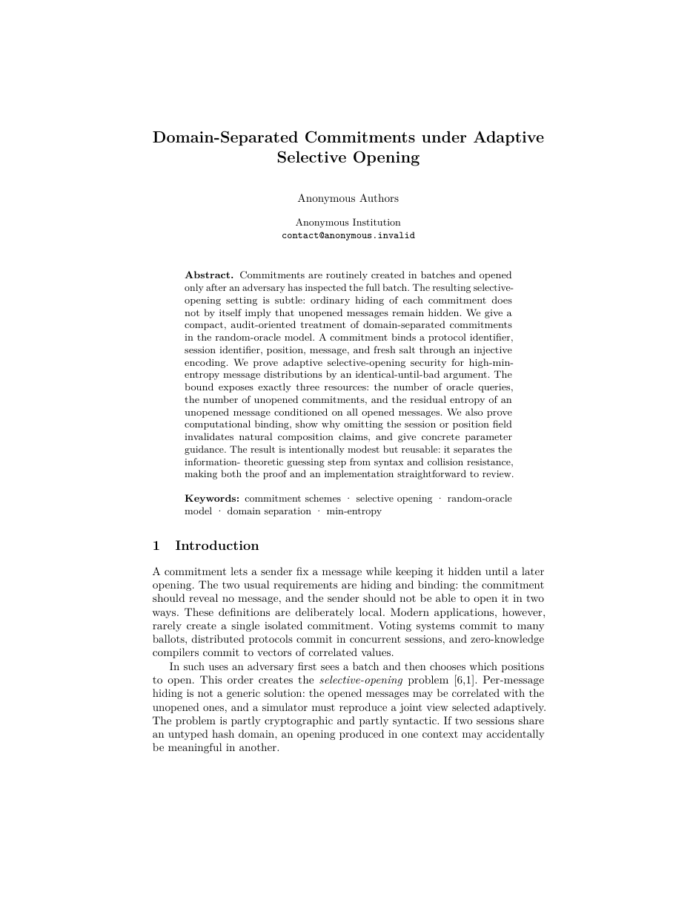

# TCC (Theory of Cryptography Conference) Paper LaTeX Template

[](https://letx.app/templates/conferences/tcc-paper/)
[](LICENSE)

A Theory of Cryptography Conference paper on Springer's llncs class: Preliminaries, Security Experiments, a Construction, Selective-Opening Analysis and Concrete Parameters.

Edit and compile it in your browser at **[letx.app](https://letx.app/templates/conferences/tcc-paper/)**, with no LaTeX install and real-time collaboration. A compile takes a few seconds.



## What is in it
- Document class: `llncs` with `runningheads`
- Compiler: pdflatex
- Files: `main.tex`, `preamble.tex`, and 11 section files under `sections/`

## Use it online
Open **[TCC (Theory of Cryptography Conference) Paper on LetX](https://letx.app/templates/conferences/tcc-paper/)** and click *Open as Template*. It is free.

## <a name="compile"></a>Compile locally
```bash
git clone https://github.com/Shahriar-Labs/latex-templates.git
cd latex-templates/conferences/tcc-paper
latexmk -pdf main.tex
```

## About
Part of the free, open-source [LetX template library](https://letx.app/templates/): conference paper templates for students, researchers and professionals. Built by [Shahriar Labs](https://shahriarlabs.com).

## License
MIT. See [LICENSE](LICENSE).
