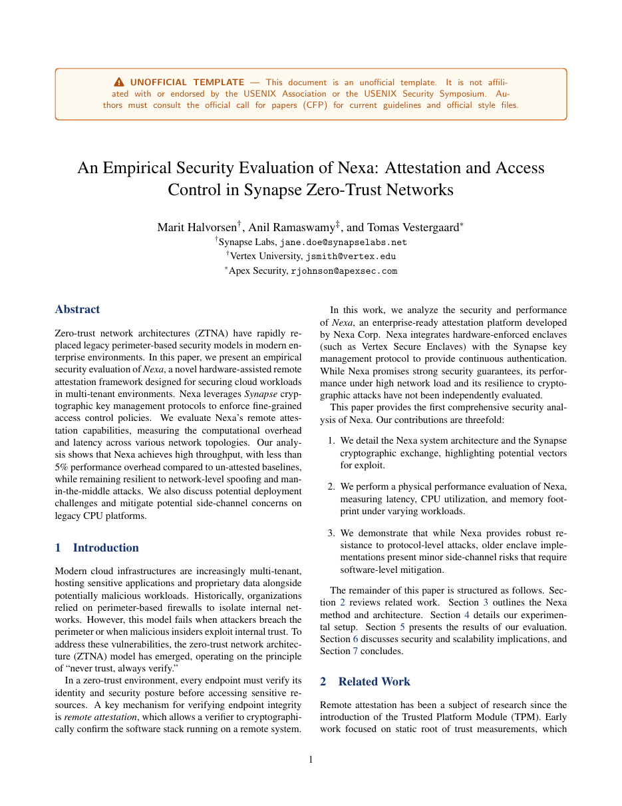

# USENIX Security Paper LaTeX Template

[](https://letx.app/templates/conferences/usenix-security-paper/)
[](LICENSE)

A USENIX Security-style paper in two columns with an abstract section, Method, Experiments and Results, on the article class rather than the USENIX style file.

Edit and compile it in your browser at **[letx.app](https://letx.app/templates/conferences/usenix-security-paper/)**, with no LaTeX install and real-time collaboration. A compile takes a few seconds.



## What is in it
- Document class: `article` with `10pt, twocolumn`
- Compiler: pdflatex
- Files: `main.bib`, `main.tex`, `preamble.tex`, and 8 section files under `sections/`

## Use it online
Open **[USENIX Security Paper on LetX](https://letx.app/templates/conferences/usenix-security-paper/)** and click *Open as Template*. It is free.

## <a name="compile"></a>Compile locally
```bash
git clone https://github.com/Shahriar-Labs/latex-templates.git
cd latex-templates/conferences/usenix-security-paper
latexmk -pdf main.tex
```

## About
Part of the free, open-source [LetX template library](https://letx.app/templates/): conference paper templates for students, researchers and professionals. Built by [Shahriar Labs](https://shahriarlabs.com).

## License
MIT. See [LICENSE](LICENSE).
