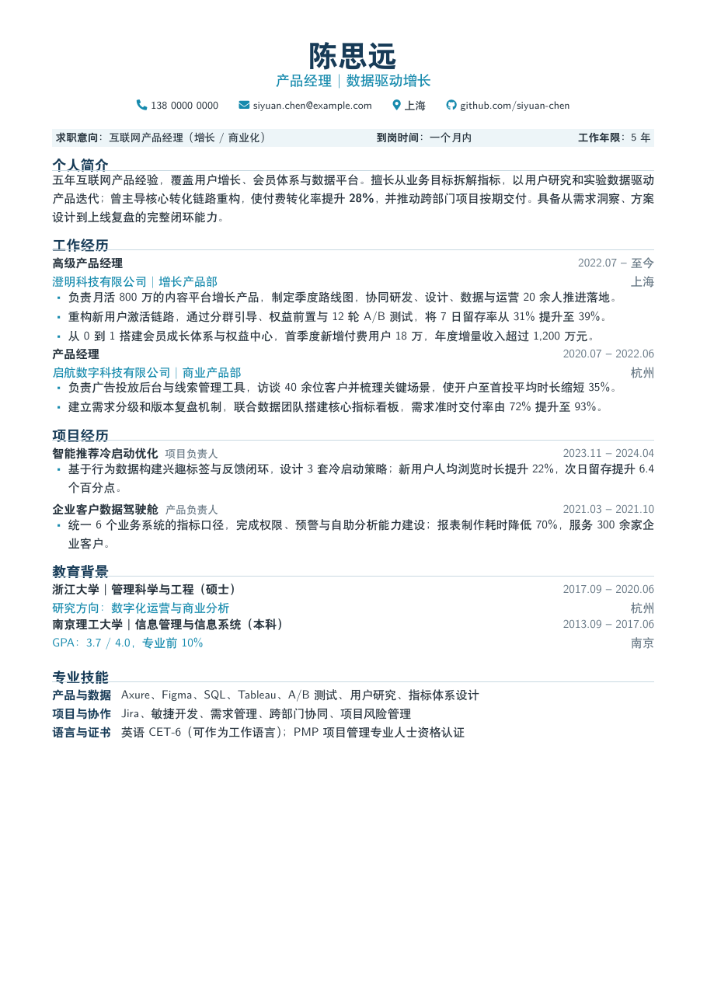

# Chinese Standard Resume LaTeX Template

[](https://letx.app/templates/cvs-resumes/chinese-standard-resume/)
[](LICENSE)

A Chinese-language resume (简历) on the ctexart class with Fandol fonts, in five sections: 个人简介, 工作经历, 项目经历, 教育背景 and 专业技能.

Edit and compile it in your browser at **[letx.app](https://letx.app/templates/cvs-resumes/chinese-standard-resume/)**, with no LaTeX install and real-time collaboration. A compile takes a few seconds.



## What is in it
- Document class: `ctexart` with `10pt, a4paper, fontset=fandol`
- Compiler: xelatex
- One self-contained `main.tex`

## Use it online
Open **[Chinese Standard Resume on LetX](https://letx.app/templates/cvs-resumes/chinese-standard-resume/)** and click *Open as Template*. It is free.

## <a name="compile"></a>Compile locally
```bash
git clone https://github.com/Shahriar-Labs/latex-templates.git
cd latex-templates/cvs-resumes/chinese-standard-resume
latexmk -xelatex main.tex
```

## About
Part of the free, open-source [LetX template library](https://letx.app/templates/): CV and résumé templates for students, researchers and professionals. Built by [Shahriar Labs](https://shahriarlabs.com).

## License
MIT. See [LICENSE](LICENSE).
