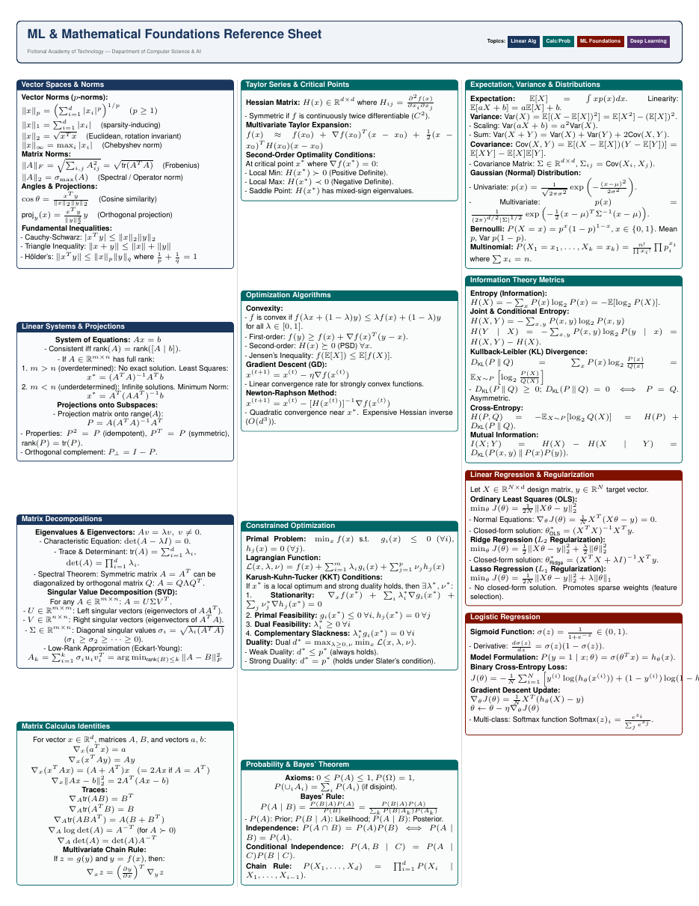

# Formula Sheet and Exam Cheat Sheet LaTeX Template

[](https://letx.app/templates/education/formula-sheet-exam-cheat-sheet/)
[](LICENSE)

A dense multi-column formula sheet for an exam, covering linear algebra, calculus and probability, machine learning foundations and deep learning, with norms and inequalities.

Edit and compile it in your browser at **[letx.app](https://letx.app/templates/education/formula-sheet-exam-cheat-sheet/)**, with no LaTeX install and real-time collaboration. A compile takes a few seconds.



## What is in it
- Document class: `article` with `10pt`
- Compiler: pdflatex
- One self-contained `main.tex`

## Use it online
Open **[Formula Sheet and Exam Cheat Sheet on LetX](https://letx.app/templates/education/formula-sheet-exam-cheat-sheet/)** and click *Open as Template*. It is free.

## <a name="compile"></a>Compile locally
```bash
git clone https://github.com/Shahriar-Labs/latex-templates.git
cd latex-templates/education/formula-sheet-exam-cheat-sheet
latexmk -pdf main.tex
```

## About
Part of the free, open-source [LetX template library](https://letx.app/templates/): teaching and education templates for students, researchers and professionals. Built by [Shahriar Labs](https://shahriarlabs.com).

## License
MIT. See [LICENSE](LICENSE).
