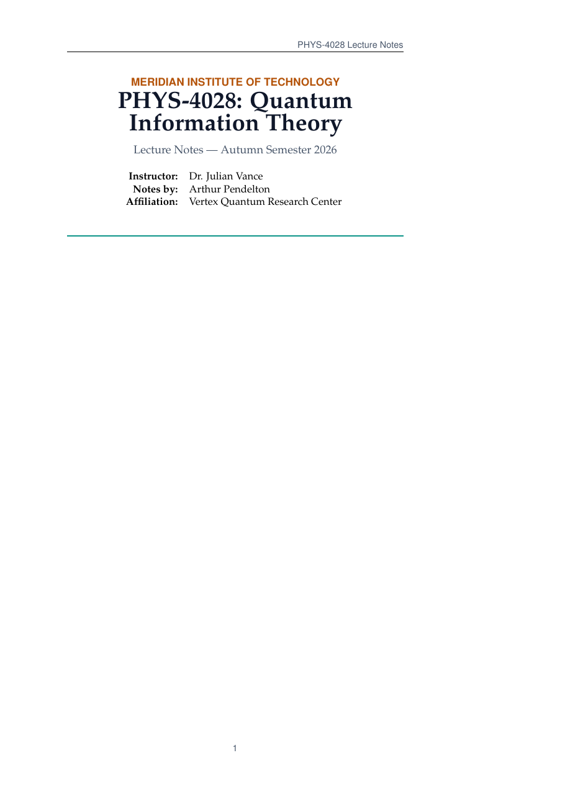

# University Lecture Notes LaTeX Template

[](https://letx.app/templates/education/lecture-notes/)
[](LICENSE)

University lecture notes on the report class in Palatino with margin notes, teaching quantum states, measurement and observables, entanglement, and Bell's theorem with CHSH.

Edit and compile it in your browser at **[letx.app](https://letx.app/templates/education/lecture-notes/)**, with no LaTeX install and real-time collaboration. A compile takes a few seconds.



## What is in it
- Document class: `report` with `11pt, oneside, a4paper`
- Compiler: pdflatex
- Files: `main.tex`, `preamble.tex`, `references.bib`, and 4 section files under `sections/`

## Use it online
Open **[University Lecture Notes on LetX](https://letx.app/templates/education/lecture-notes/)** and click *Open as Template*. It is free.

## <a name="compile"></a>Compile locally
```bash
git clone https://github.com/Shahriar-Labs/latex-templates.git
cd latex-templates/education/lecture-notes
latexmk -pdf main.tex
```

## About
Part of the free, open-source [LetX template library](https://letx.app/templates/): teaching and education templates for students, researchers and professionals. Built by [Shahriar Labs](https://shahriarlabs.com).

## License
MIT. See [LICENSE](LICENSE).
