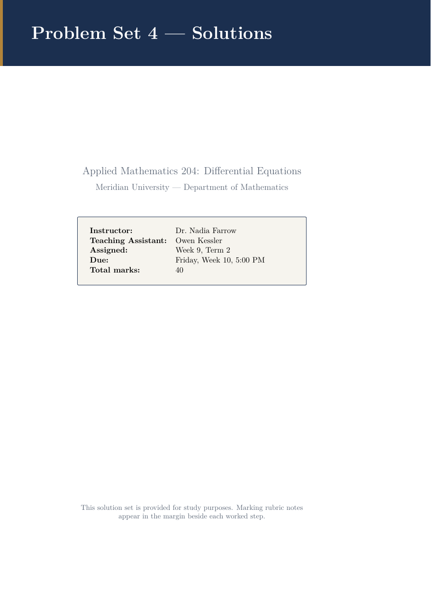

# Problem Set Solutions LaTeX Template

[](https://letx.app/templates/education/problem-set-solutions/)
[](LICENSE)

Problem set solutions with a guide to reading the solutions, four worked problems (an ODE, eigenvalues, conditional probability, constrained optimization) and a formula appendix.

Edit and compile it in your browser at **[letx.app](https://letx.app/templates/education/problem-set-solutions/)**, with no LaTeX install and real-time collaboration. A compile takes a few seconds.



## What is in it
- Document class: `article` with `11pt`
- Compiler: pdflatex
- Files: `main.tex`, `preamble.tex`, `references.bib`, and 6 section files under `sections/`

## Use it online
Open **[Problem Set Solutions on LetX](https://letx.app/templates/education/problem-set-solutions/)** and click *Open as Template*. It is free.

## <a name="compile"></a>Compile locally
```bash
git clone https://github.com/Shahriar-Labs/latex-templates.git
cd latex-templates/education/problem-set-solutions
latexmk -pdf main.tex
```

## About
Part of the free, open-source [LetX template library](https://letx.app/templates/): teaching and education templates for students, researchers and professionals. Built by [Shahriar Labs](https://shahriarlabs.com).

## License
MIT. See [LICENSE](LICENSE).
