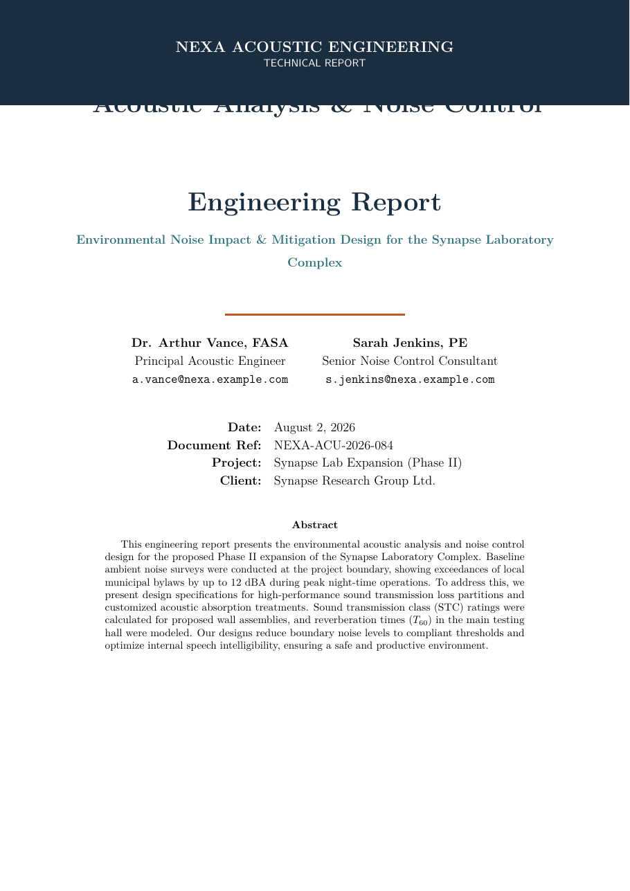

# Acoustic Analysis & Noise Control Engineering Report LaTeX Template

[](https://letx.app/templates/engineering/acoustic-analysis-noise-control-engineering-report/)
[](LICENSE)

An acoustic analysis and noise control report with an ambient noise survey, sound transmission loss analysis, absorption and reverberation design, and an implementation plan, with pgfplots.

Edit and compile it in your browser at **[letx.app](https://letx.app/templates/engineering/acoustic-analysis-noise-control-engineering-report/)**, with no LaTeX install and real-time collaboration. A compile takes a few seconds.



## What is in it
- Document class: `article` with `11pt, a4paper`
- Compiler: pdflatex
- Files: `main.tex`, `preamble.tex`, `references.bib`, and 5 section files under `sections/`

## Use it online
Open **[Acoustic Analysis & Noise Control Engineering Report on LetX](https://letx.app/templates/engineering/acoustic-analysis-noise-control-engineering-report/)** and click *Open as Template*. It is free.

## <a name="compile"></a>Compile locally
```bash
git clone https://github.com/Shahriar-Labs/latex-templates.git
cd latex-templates/engineering/acoustic-analysis-noise-control-engineering-report
latexmk -pdf main.tex
```

## About
Part of the free, open-source [LetX template library](https://letx.app/templates/): engineering templates for students, researchers and professionals. Built by [Shahriar Labs](https://shahriarlabs.com).

## License
MIT. See [LICENSE](LICENSE).
