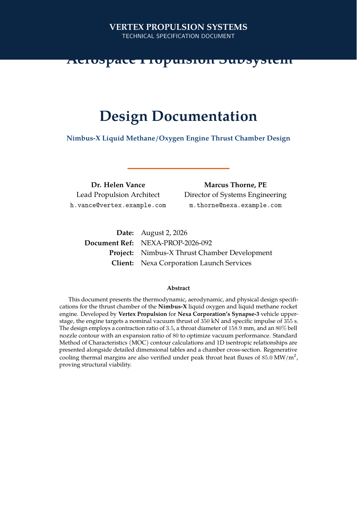

# Aerospace Propulsion Subsystem Design Doc LaTeX Template

[](https://letx.app/templates/engineering/aerospace-propulsion-subsystem-design-doc/)
[](LICENSE)

An aerospace propulsion subsystem design document in TeX Gyre Pagella with thermodynamic chamber sizing, nozzle contour design, thermal management, siunitx units and thirteen equations.

Edit and compile it in your browser at **[letx.app](https://letx.app/templates/engineering/aerospace-propulsion-subsystem-design-doc/)**, with no LaTeX install and real-time collaboration. A compile takes a few seconds.



## What is in it
- Document class: `article` with `11pt, a4paper`
- Compiler: pdflatex
- Files: `main.tex`, `preamble.tex`, `references.bib`, and 5 section files under `sections/`

## Use it online
Open **[Aerospace Propulsion Subsystem Design Doc on LetX](https://letx.app/templates/engineering/aerospace-propulsion-subsystem-design-doc/)** and click *Open as Template*. It is free.

## <a name="compile"></a>Compile locally
```bash
git clone https://github.com/Shahriar-Labs/latex-templates.git
cd latex-templates/engineering/aerospace-propulsion-subsystem-design-doc
latexmk -pdf main.tex
```

## About
Part of the free, open-source [LetX template library](https://letx.app/templates/): engineering templates for students, researchers and professionals. Built by [Shahriar Labs](https://shahriarlabs.com).

## License
MIT. See [LICENSE](LICENSE).
