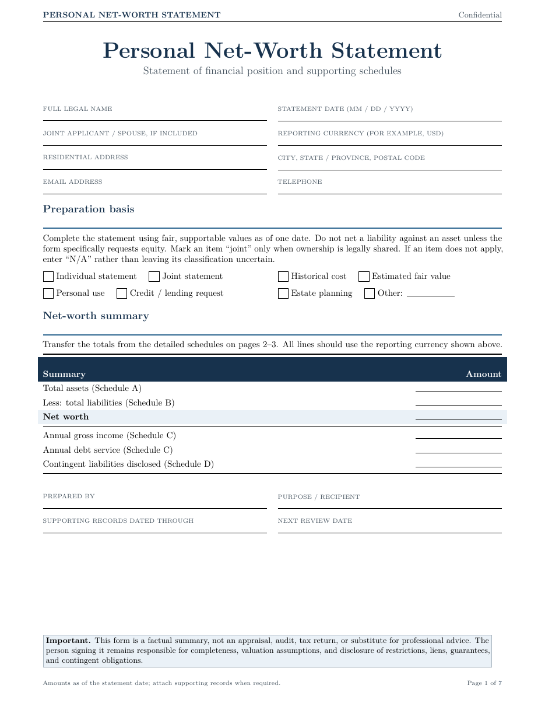

# Personal Net Worth Statement LaTeX Template

[](https://letx.app/templates/finance/personal-net-worth-statement/)
[](LICENSE)

A personal net worth statement on letter paper, laid out as nineteen tables of asset and liability categories that total into a net worth summary.

Edit and compile it in your browser at **[letx.app](https://letx.app/templates/finance/personal-net-worth-statement/)**, with no LaTeX install and real-time collaboration. A compile takes a few seconds.



## What is in it
- Document class: `article` with `10pt, letterpaper`
- Compiler: pdflatex
- One self-contained `main.tex`

## Use it online
Open **[Personal Net Worth Statement on LetX](https://letx.app/templates/finance/personal-net-worth-statement/)** and click *Open as Template*. It is free.

## <a name="compile"></a>Compile locally
```bash
git clone https://github.com/Shahriar-Labs/latex-templates.git
cd latex-templates/finance/personal-net-worth-statement
latexmk -pdf main.tex
```

## About
Part of the free, open-source [LetX template library](https://letx.app/templates/): finance and business templates for students, researchers and professionals. Built by [Shahriar Labs](https://shahriarlabs.com).

## License
MIT. See [LICENSE](LICENSE).
