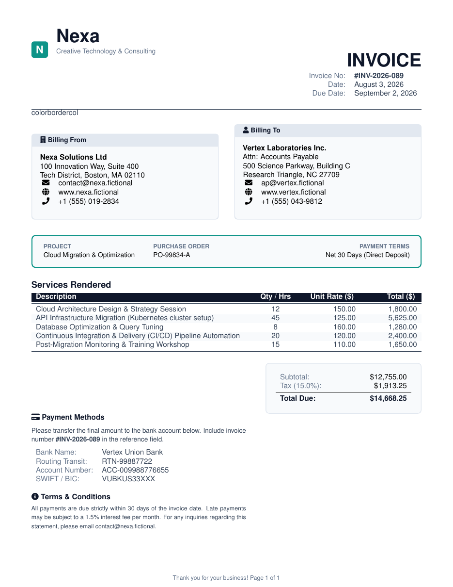

# Professional Services Invoice LaTeX Template

[](https://letx.app/templates/finance/professional-invoice/)
[](LICENSE)

A professional services invoice with an invoice number, the supplier and client blocks, and line items by description, quantity or hours, unit rate and total.

Edit and compile it in your browser at **[letx.app](https://letx.app/templates/finance/professional-invoice/)**, with no LaTeX install and real-time collaboration. A compile takes a few seconds.



## What is in it
- Document class: `article` with `10pt`
- Compiler: pdflatex
- One self-contained `main.tex`

## Use it online
Open **[Professional Services Invoice on LetX](https://letx.app/templates/finance/professional-invoice/)** and click *Open as Template*. It is free.

## <a name="compile"></a>Compile locally
```bash
git clone https://github.com/Shahriar-Labs/latex-templates.git
cd latex-templates/finance/professional-invoice
latexmk -pdf main.tex
```

## About
Part of the free, open-source [LetX template library](https://letx.app/templates/): finance and business templates for students, researchers and professionals. Built by [Shahriar Labs](https://shahriarlabs.com).

## License
MIT. See [LICENSE](LICENSE).
