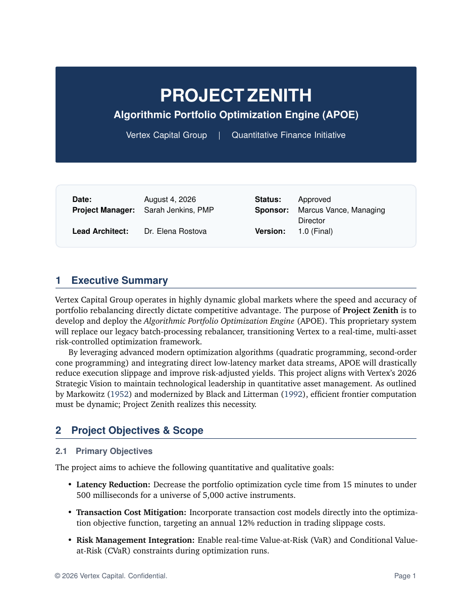

# Project Charter LaTeX Template

[](https://letx.app/templates/finance/project-charter/)
[](LICENSE)

A project charter on letter paper in Charter with the executive summary, objectives and scope, stakeholders and governance, milestones and budget, and risks and approvals.

Edit and compile it in your browser at **[letx.app](https://letx.app/templates/finance/project-charter/)**, with no LaTeX install and real-time collaboration. A compile takes a few seconds.



## What is in it
- Document class: `article` with `11pt, table, letterpaper`
- Compiler: pdflatex
- Files: `main.tex`, `preamble.tex`, `references.bib`, and 5 section files under `sections/`

## Use it online
Open **[Project Charter on LetX](https://letx.app/templates/finance/project-charter/)** and click *Open as Template*. It is free.

## <a name="compile"></a>Compile locally
```bash
git clone https://github.com/Shahriar-Labs/latex-templates.git
cd latex-templates/finance/project-charter
latexmk -pdf main.tex
```

## About
Part of the free, open-source [LetX template library](https://letx.app/templates/): finance and business templates for students, researchers and professionals. Built by [Shahriar Labs](https://shahriarlabs.com).

## License
MIT. See [LICENSE](LICENSE).
