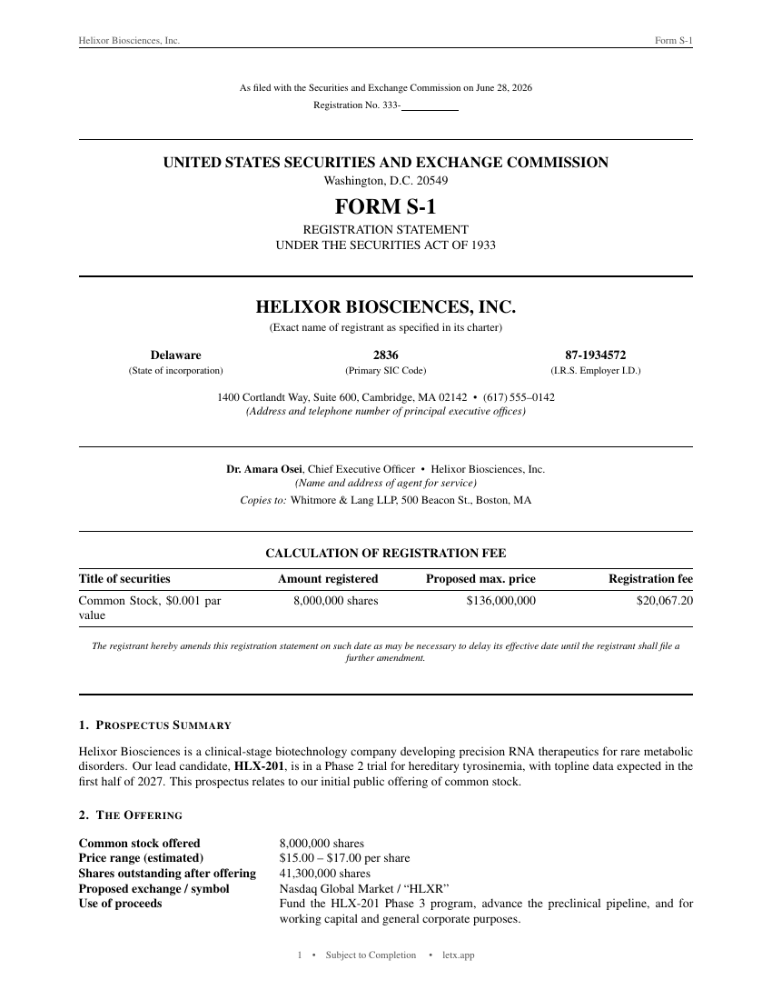

# Regulatory Filing (Form S-1) — Free LaTeX Template

[](https://letx.app/templates/finance/form-s-1-filing)
[](LICENSE)
[](#compile)

**Regulatory Filing (Form S-1) LaTeX template — "S-1 filing latex template". Elegant, compile-tested, editable online at letx.app.**

Edit and compile this template instantly in your browser — no LaTeX install — at **[letx.app](https://letx.app/templates/finance/form-s-1-filing)**, with real-time collaboration and one-second compiles.



## Features
- Elegant, modern design
- Compile-tested (zero errors)
- Realistic sample content
- Editable online in your browser

## Use it online (recommended)
Open **[Regulatory Filing (Form S-1) on LetX »](https://letx.app/templates/finance/form-s-1-filing)** and click *Open as Template* — it compiles in ~1 second, in your browser, free.

## <a name="compile"></a>Compile locally
```bash
git clone https://github.com/Shahriar-Labs/latex-templates.git
cd latex-templates/form-s-1-filing
latexmk -pdf main.tex
```
Compiler: **pdflatex** (see `metadata.json`).

## About
Part of the free, open-source [LetX template library](https://letx.app/templates) — finance templates for students, researchers, and professionals. Built by [Shahriar Labs](https://shahriarlabs.com).

## License
MIT — free for personal and commercial use. See [LICENSE](LICENSE).
