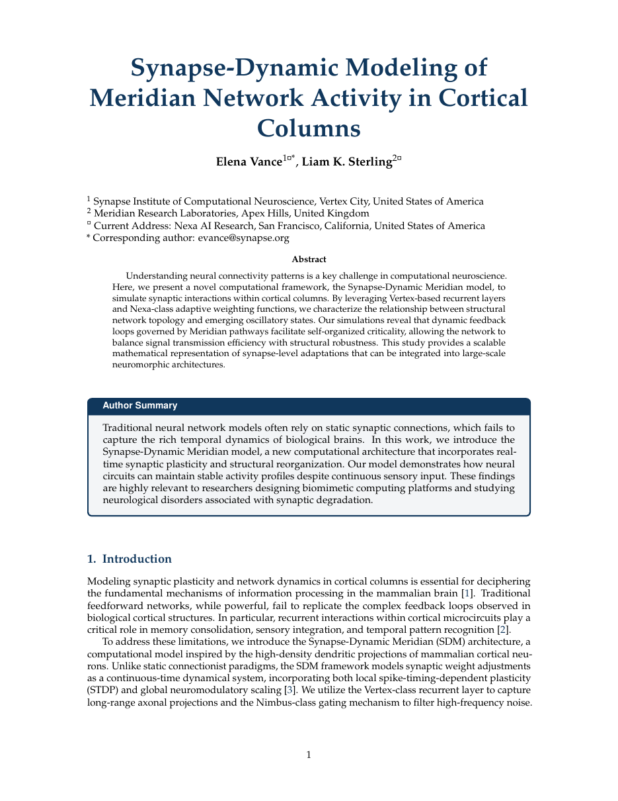

# PLOS Computational Biology Template LaTeX Template

[](https://letx.app/templates/journal-articles/plos-computational-biology-template/)
[](LICENSE)

A PLOS Computational Biology-style article on letter paper in Palatino, with Methodology, Results and Discussion, on the article class rather than PLOS's own template.

Edit and compile it in your browser at **[letx.app](https://letx.app/templates/journal-articles/plos-computational-biology-template/)**, with no LaTeX install and real-time collaboration. A compile takes a few seconds.



## What is in it
- Document class: `article` with `10pt, letterpaper`
- Compiler: pdflatex
- Files: `main.tex`, `preamble.tex`, `references.bib`, and 5 section files under `sections/`

## Use it online
Open **[PLOS Computational Biology Template on LetX](https://letx.app/templates/journal-articles/plos-computational-biology-template/)** and click *Open as Template*. It is free.

## <a name="compile"></a>Compile locally
```bash
git clone https://github.com/Shahriar-Labs/latex-templates.git
cd latex-templates/journal-articles/plos-computational-biology-template
latexmk -pdf main.tex
```

## About
Part of the free, open-source [LetX template library](https://letx.app/templates/): journal article templates for students, researchers and professionals. Built by [Shahriar Labs](https://shahriarlabs.com).

## License
MIT. See [LICENSE](LICENSE).
