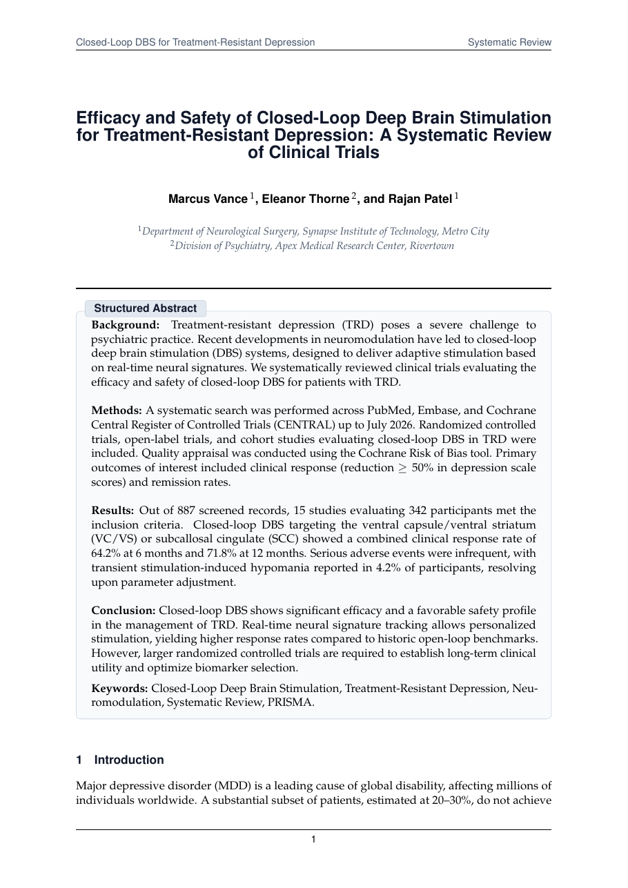

# Systematic Review Manuscript LaTeX Template

[](https://letx.app/templates/journal-articles/systematic-review-manuscript/)
[](LICENSE)

A systematic review manuscript on A4 in Palatino with the methodology, results, discussion and natbib references.

Edit and compile it in your browser at **[letx.app](https://letx.app/templates/journal-articles/systematic-review-manuscript/)**, with no LaTeX install and real-time collaboration. A compile takes a few seconds.



## What is in it
- Document class: `article` with `11pt, a4paper`
- Compiler: pdflatex
- Files: `main.tex`, `preamble.tex`, `references.bib`, and 7 section files under `sections/`

## Use it online
Open **[Systematic Review Manuscript on LetX](https://letx.app/templates/journal-articles/systematic-review-manuscript/)** and click *Open as Template*. It is free.

## <a name="compile"></a>Compile locally
```bash
git clone https://github.com/Shahriar-Labs/latex-templates.git
cd latex-templates/journal-articles/systematic-review-manuscript
latexmk -pdf main.tex
```

## About
Part of the free, open-source [LetX template library](https://letx.app/templates/): journal article templates for students, researchers and professionals. Built by [Shahriar Labs](https://shahriarlabs.com).

## License
MIT. See [LICENSE](LICENSE).
