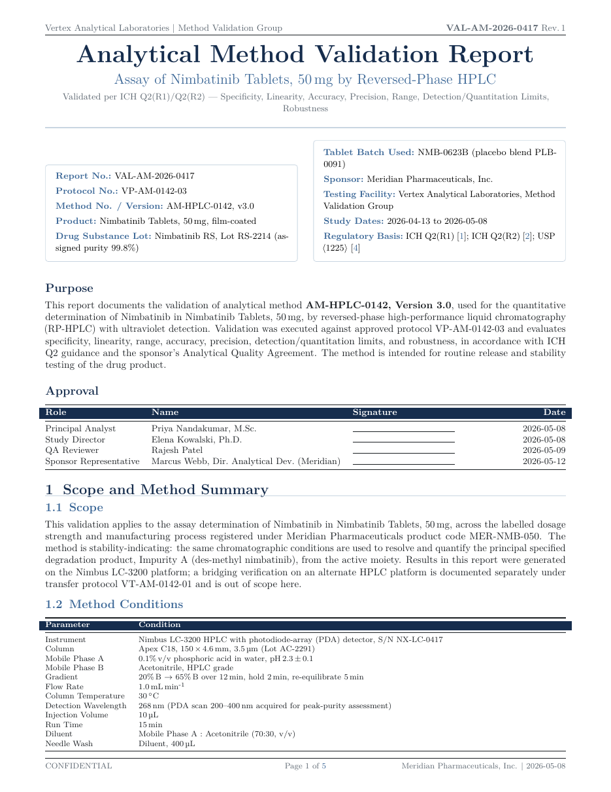

# Analytical Method Validation Report LaTeX Template

[](https://letx.app/templates/lab-documents/analytical-method-validation-report/)
[](LICENSE)

An analytical method validation report on letter paper covering specificity, linearity and range, accuracy and precision, and robustness, with siunitx units, pgfplots charts and twelve tables.

Edit and compile it in your browser at **[letx.app](https://letx.app/templates/lab-documents/analytical-method-validation-report/)**, with no LaTeX install and real-time collaboration. A compile takes a few seconds.



## What is in it
- Document class: `article` with `10pt, letterpaper`
- Compiler: pdflatex
- Files: `main.tex`, `preamble.tex`, `references.bib`, and 7 section files under `sections/`

## Use it online
Open **[Analytical Method Validation Report on LetX](https://letx.app/templates/lab-documents/analytical-method-validation-report/)** and click *Open as Template*. It is free.

## <a name="compile"></a>Compile locally
```bash
git clone https://github.com/Shahriar-Labs/latex-templates.git
cd latex-templates/lab-documents/analytical-method-validation-report
latexmk -pdf main.tex
```

## About
Part of the free, open-source [LetX template library](https://letx.app/templates/): lab document templates for students, researchers and professionals. Built by [Shahriar Labs](https://shahriarlabs.com).

## License
MIT. See [LICENSE](LICENSE).
