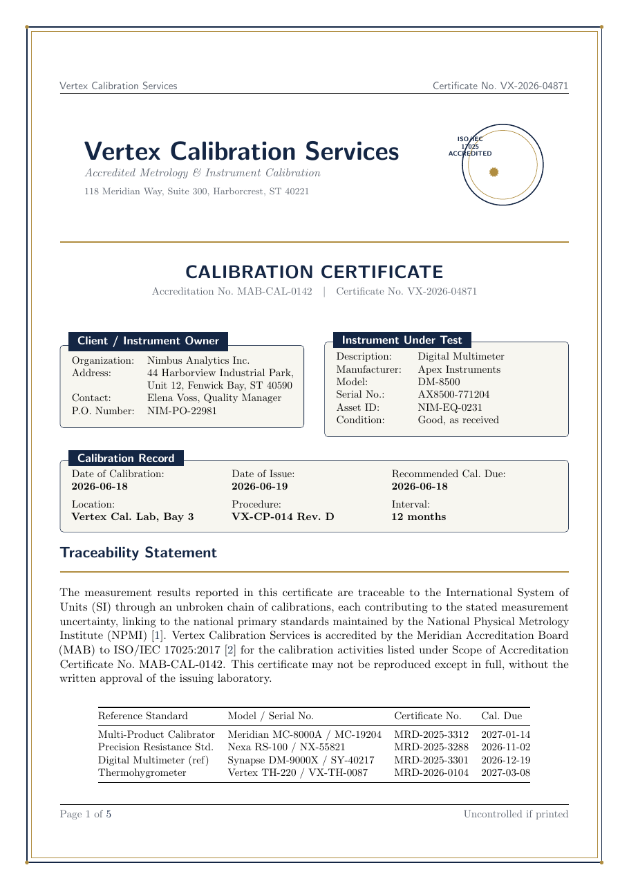

# Calibration Certificate LaTeX Template

[](https://letx.app/templates/lab-documents/calibration-certificate/)
[](LICENSE)

A calibration certificate on A4 identifying the client and the instrument under test, with the calibration record, the calibration interval, and signatures from the technician and reviewer.

Edit and compile it in your browser at **[letx.app](https://letx.app/templates/lab-documents/calibration-certificate/)**, with no LaTeX install and real-time collaboration. A compile takes a few seconds.



## What is in it
- Document class: `article` with `11pt, a4paper`
- Compiler: pdflatex
- Files: `main.tex`, `preamble.tex`, `references.bib`, and 8 section files under `sections/`

## Use it online
Open **[Calibration Certificate on LetX](https://letx.app/templates/lab-documents/calibration-certificate/)** and click *Open as Template*. It is free.

## <a name="compile"></a>Compile locally
```bash
git clone https://github.com/Shahriar-Labs/latex-templates.git
cd latex-templates/lab-documents/calibration-certificate
latexmk -pdf main.tex
```

## About
Part of the free, open-source [LetX template library](https://letx.app/templates/): lab document templates for students, researchers and professionals. Built by [Shahriar Labs](https://shahriarlabs.com).

## License
MIT. See [LICENSE](LICENSE).
