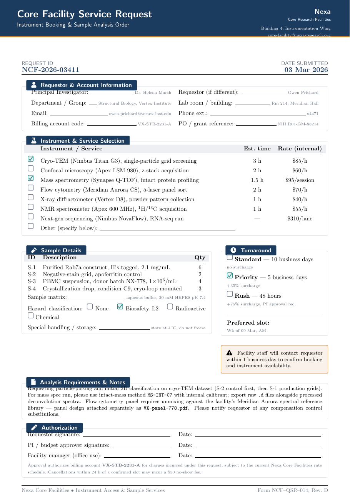

# Core Facility Service Request LaTeX Template

[](https://letx.app/templates/lab-documents/core-facility-service-request/)
[](LICENSE)

A core facility service request form on A4 listing instruments and services with estimated time, internal rate and quantity, plus priority, rush and preferred slot fields.

Edit and compile it in your browser at **[letx.app](https://letx.app/templates/lab-documents/core-facility-service-request/)**, with no LaTeX install and real-time collaboration. A compile takes a few seconds.



## What is in it
- Document class: `article` with `10pt, a4paper`
- Compiler: pdflatex
- One self-contained `main.tex`

## Use it online
Open **[Core Facility Service Request on LetX](https://letx.app/templates/lab-documents/core-facility-service-request/)** and click *Open as Template*. It is free.

## <a name="compile"></a>Compile locally
```bash
git clone https://github.com/Shahriar-Labs/latex-templates.git
cd latex-templates/lab-documents/core-facility-service-request
latexmk -pdf main.tex
```

## About
Part of the free, open-source [LetX template library](https://letx.app/templates/): lab document templates for students, researchers and professionals. Built by [Shahriar Labs](https://shahriarlabs.com).

## License
MIT. See [LICENSE](LICENSE).
