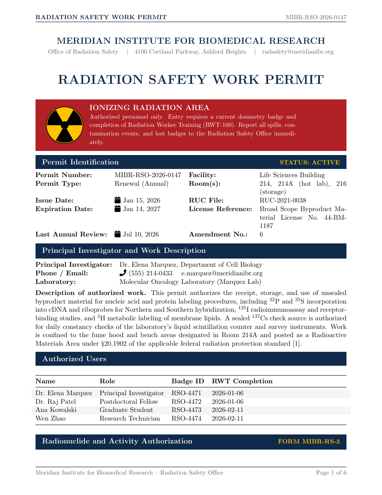

# Radiation Safety Work Permit LaTeX Template

[](https://letx.app/templates/lab-documents/radiation-safety-work-permit/)
[](LICENSE)

A radiation safety work permit on letter paper listing radionuclides with shielding and minimum thickness, survey instrumentation, and signatures up to the EHS director.

Edit and compile it in your browser at **[letx.app](https://letx.app/templates/lab-documents/radiation-safety-work-permit/)**, with no LaTeX install and real-time collaboration. A compile takes a few seconds.



## What is in it
- Document class: `article` with `11pt, letterpaper`
- Compiler: pdflatex
- Files: `main.tex`, `preamble.tex`, `references.bib`, and 7 section files under `sections/`

## Use it online
Open **[Radiation Safety Work Permit on LetX](https://letx.app/templates/lab-documents/radiation-safety-work-permit/)** and click *Open as Template*. It is free.

## <a name="compile"></a>Compile locally
```bash
git clone https://github.com/Shahriar-Labs/latex-templates.git
cd latex-templates/lab-documents/radiation-safety-work-permit
latexmk -pdf main.tex
```

## About
Part of the free, open-source [LetX template library](https://letx.app/templates/): lab document templates for students, researchers and professionals. Built by [Shahriar Labs](https://shahriarlabs.com).

## License
MIT. See [LICENSE](LICENSE).
