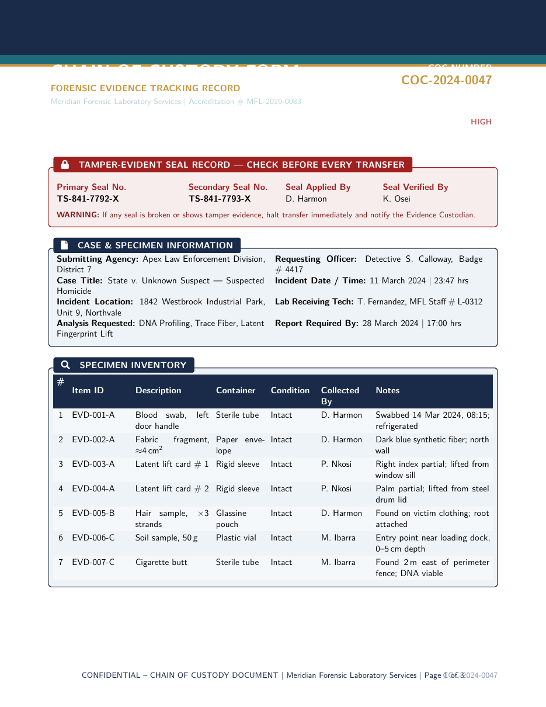

# Sample Chain of Custody Form LaTeX Template

[](https://letx.app/templates/lab-documents/sample-chain-of-custody-form/)
[](LICENSE)

A forensic sample chain of custody form on letter paper with case and specimen information, the submitting agency and officer, and a tamper-evident seal record.

Edit and compile it in your browser at **[letx.app](https://letx.app/templates/lab-documents/sample-chain-of-custody-form/)**, with no LaTeX install and real-time collaboration. A compile takes a few seconds.



## What is in it
- Document class: `article` with `letterpaper, 11pt`
- Compiler: pdflatex
- One self-contained `main.tex`

## Use it online
Open **[Sample Chain of Custody Form on LetX](https://letx.app/templates/lab-documents/sample-chain-of-custody-form/)** and click *Open as Template*. It is free.

## <a name="compile"></a>Compile locally
```bash
git clone https://github.com/Shahriar-Labs/latex-templates.git
cd latex-templates/lab-documents/sample-chain-of-custody-form
latexmk -pdf main.tex
```

## About
Part of the free, open-source [LetX template library](https://letx.app/templates/): lab document templates for students, researchers and professionals. Built by [Shahriar Labs](https://shahriarlabs.com).

## License
MIT. See [LICENSE](LICENSE).
