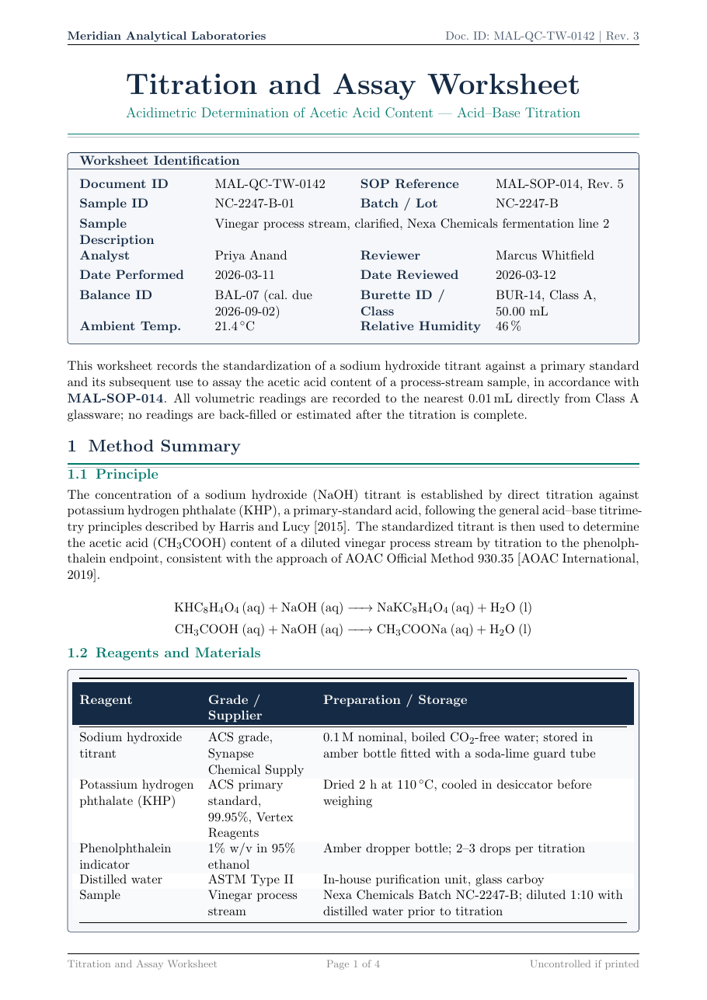

# Titration and Assay Worksheet LaTeX Template

[](https://letx.app/templates/lab-documents/titration-assay-worksheet/)
[](LICENSE)

A titration and assay worksheet with standardization of the NaOH titrant, an acetic acid content assay, the calculations, and an outlier check, typeset with mhchem and siunitx.

Edit and compile it in your browser at **[letx.app](https://letx.app/templates/lab-documents/titration-assay-worksheet/)**, with no LaTeX install and real-time collaboration. A compile takes a few seconds.



## What is in it
- Document class: `article` with `11pt, a4paper`
- Compiler: pdflatex
- Files: `main.tex`, `preamble.tex`, `references.bib`, and 6 section files under `sections/`

## Use it online
Open **[Titration and Assay Worksheet on LetX](https://letx.app/templates/lab-documents/titration-assay-worksheet/)** and click *Open as Template*. It is free.

## <a name="compile"></a>Compile locally
```bash
git clone https://github.com/Shahriar-Labs/latex-templates.git
cd latex-templates/lab-documents/titration-assay-worksheet
latexmk -pdf main.tex
```

## About
Part of the free, open-source [LetX template library](https://letx.app/templates/): lab document templates for students, researchers and professionals. Built by [Shahriar Labs](https://shahriarlabs.com).

## License
MIT. See [LICENSE](LICENSE).
