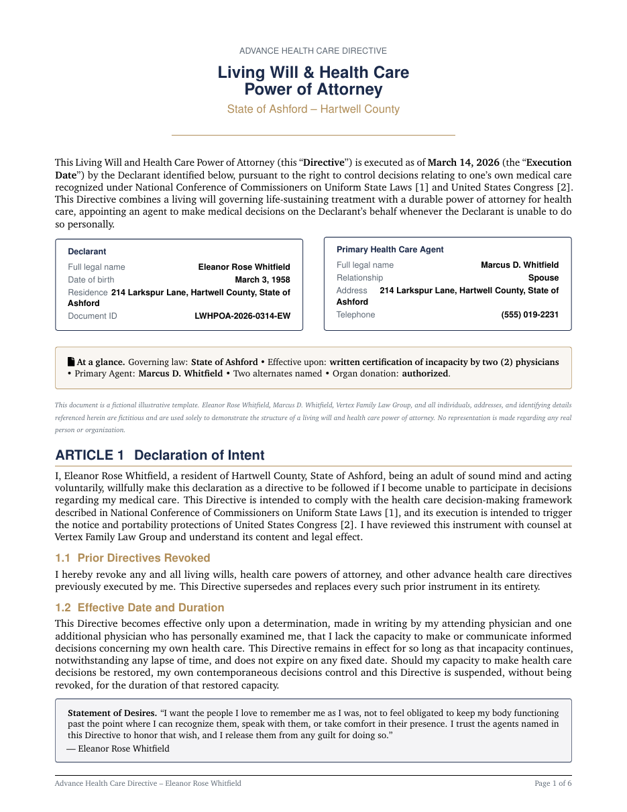

# Living Will & Healthcare Power of Attorney LaTeX Template

[](https://letx.app/templates/legal/living-will-healthcare-power-of-attorney/)
[](LICENSE)

A living will and healthcare power of attorney with an advance directive, appointment of a health care agent, specific instructions, organ donation and a HIPAA release.

Edit and compile it in your browser at **[letx.app](https://letx.app/templates/legal/living-will-healthcare-power-of-attorney/)**, with no LaTeX install and real-time collaboration. A compile takes a few seconds.



## What is in it
- Document class: `article` with `10pt, letterpaper`
- Compiler: pdflatex
- Files: `main.tex`, `preamble.tex`, `references.bib`, and 8 section files under `sections/`

## Use it online
Open **[Living Will & Healthcare Power of Attorney on LetX](https://letx.app/templates/legal/living-will-healthcare-power-of-attorney/)** and click *Open as Template*. It is free.

## <a name="compile"></a>Compile locally
```bash
git clone https://github.com/Shahriar-Labs/latex-templates.git
cd latex-templates/legal/living-will-healthcare-power-of-attorney
latexmk -pdf main.tex
```

## About
Part of the free, open-source [LetX template library](https://letx.app/templates/): legal templates for students, researchers and professionals. Built by [Shahriar Labs](https://shahriarlabs.com).

## License
MIT. See [LICENSE](LICENSE).
