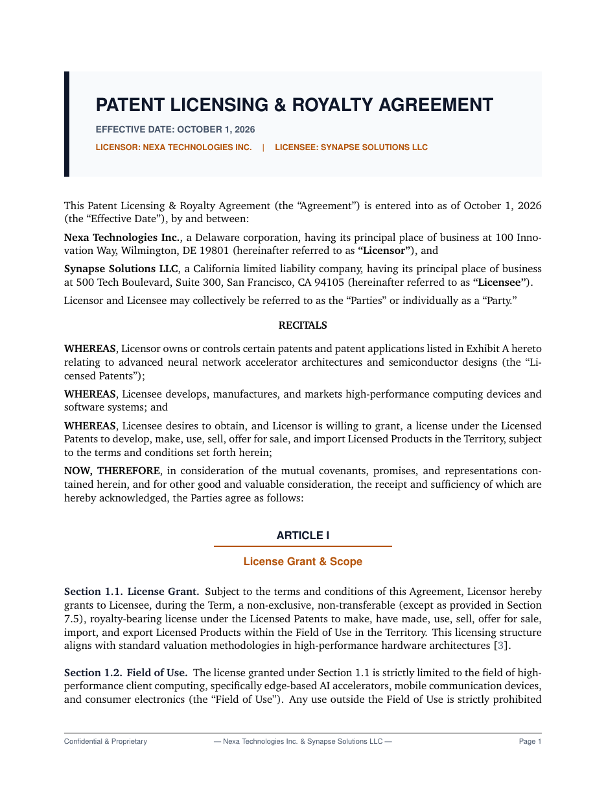

# Patent Licensing & Royalty Agreement LaTeX Template

[](https://letx.app/templates/legal/patent-licensing-royalty-agreement/)
[](LICENSE)

A patent licensing and royalty agreement on letter paper in Charter with the license grant and scope, royalties and payment, books and audit rights, and term and termination.

Edit and compile it in your browser at **[letx.app](https://letx.app/templates/legal/patent-licensing-royalty-agreement/)**, with no LaTeX install and real-time collaboration. A compile takes a few seconds.



## What is in it
- Document class: `article` with `11pt, letterpaper`
- Compiler: pdflatex
- Files: `main.tex`, `preamble.tex`, `references.bib`, and 6 section files under `sections/`

## Use it online
Open **[Patent Licensing & Royalty Agreement on LetX](https://letx.app/templates/legal/patent-licensing-royalty-agreement/)** and click *Open as Template*. It is free.

## <a name="compile"></a>Compile locally
```bash
git clone https://github.com/Shahriar-Labs/latex-templates.git
cd latex-templates/legal/patent-licensing-royalty-agreement
latexmk -pdf main.tex
```

## About
Part of the free, open-source [LetX template library](https://letx.app/templates/): legal templates for students, researchers and professionals. Built by [Shahriar Labs](https://shahriarlabs.com).

## License
MIT. See [LICENSE](LICENSE).
