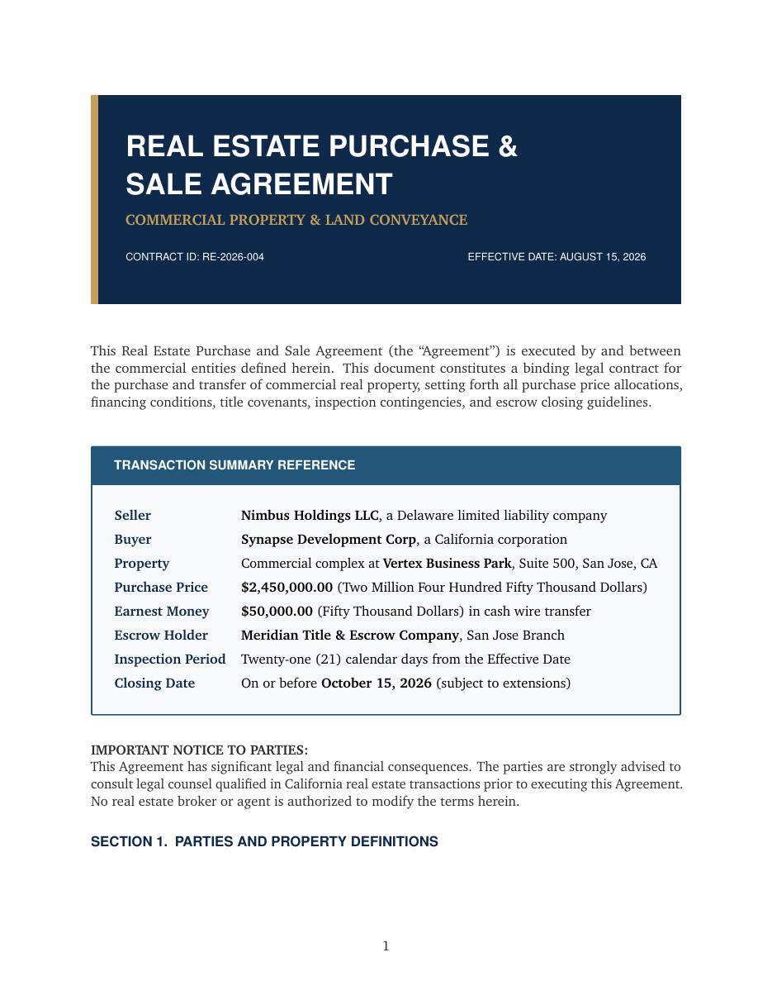

# Real Estate Purchase and Sale Agreement LaTeX Template

[](https://letx.app/templates/legal/real-estate-purchase-and-sale-agreement/)
[](LICENSE)

A real estate purchase and sale agreement in Charter with the parties and property, financial terms and escrow, contingency periods, closing and title conveyance, and signatures.

Edit and compile it in your browser at **[letx.app](https://letx.app/templates/legal/real-estate-purchase-and-sale-agreement/)**, with no LaTeX install and real-time collaboration. A compile takes a few seconds.



## What is in it
- Document class: `article` with `11pt, letterpaper`
- Compiler: pdflatex
- Files: `main.tex`, `preamble.tex`, `references.bib`, and 9 section files under `sections/`

## Use it online
Open **[Real Estate Purchase and Sale Agreement on LetX](https://letx.app/templates/legal/real-estate-purchase-and-sale-agreement/)** and click *Open as Template*. It is free.

## <a name="compile"></a>Compile locally
```bash
git clone https://github.com/Shahriar-Labs/latex-templates.git
cd latex-templates/legal/real-estate-purchase-and-sale-agreement
latexmk -pdf main.tex
```

## About
Part of the free, open-source [LetX template library](https://letx.app/templates/): legal templates for students, researchers and professionals. Built by [Shahriar Labs](https://shahriarlabs.com).

## License
MIT. See [LICENSE](LICENSE).
