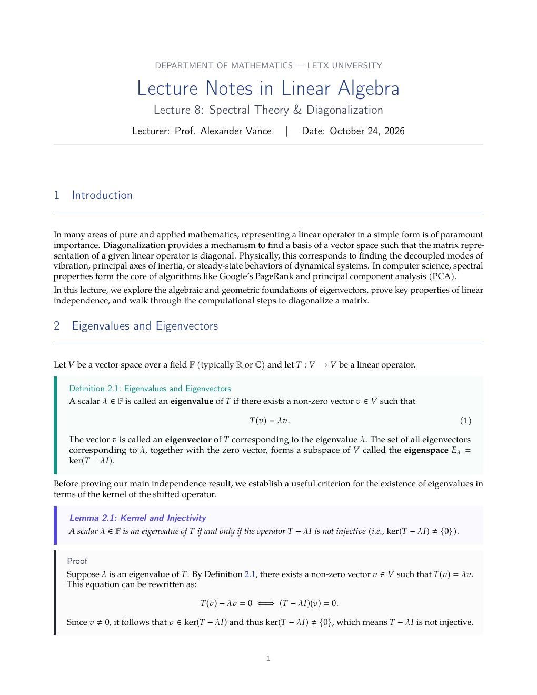

# Math Lecture Notes — Free LaTeX Template

[](https://letx.app/templates/assignments/math-lecture-notes)
[](LICENSE)
[](#compile)

**Elegant mathematics lecture notes LaTeX template — title block and beautifully styled tcolorbox theorem environments (Definition, Theorem, Lemma, Proof, Example, Remark) with amsmath. Includes a worked linear-algebra sample.**

Edit and compile this template instantly in your browser — no LaTeX install — at **[letx.app](https://letx.app/templates/assignments/math-lecture-notes)**, with real-time collaboration and one-second compiles.



## Features
- Clean title block (course, lecture, lecturer, date)
- Styled tcolorbox theorem environments, each color-coded
- Definition / Theorem / Lemma / Proof / Example / Remark
- amsmath numbered equations + cross-references
- Worked linear-algebra sample; running header

## Use it online (recommended)
Open **[Math Lecture Notes on LetX »](https://letx.app/templates/assignments/math-lecture-notes)** and click *Open as Template* — it compiles in ~1 second, in your browser, free.

## <a name="compile"></a>Compile locally
```bash
git clone https://github.com/Shahriar-Labs/math-lecture-notes.git
cd math-lecture-notes
latexmk -pdf main.tex
```
Compiler: **pdflatex** (see `metadata.json`).

## About
Part of the free, open-source [LetX template library](https://letx.app/templates) — assignment templates for students, researchers, and professionals. Built by [Shahriar Labs](https://shahriarlabs.com).

## License
MIT — free for personal and commercial use. See [LICENSE](LICENSE).
