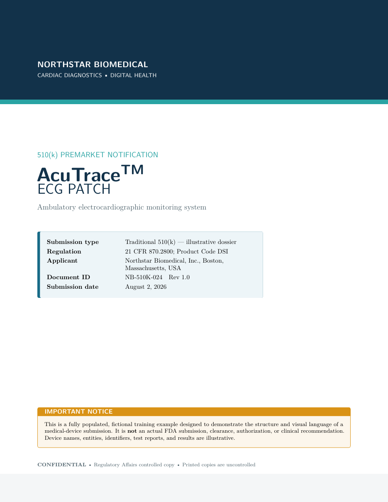

# Medical Device Regulatory Submission (FDA 510k) LaTeX Template

[](https://letx.app/templates/medical/medical-device-regulatory-submission/)
[](LICENSE)

A 510(k)-style medical device submission outline on letter paper with device description, indications for use, substantial equivalence, risk management and performance testing.

Edit and compile it in your browser at **[letx.app](https://letx.app/templates/medical/medical-device-regulatory-submission/)**, with no LaTeX install and real-time collaboration. A compile takes a few seconds.



## What is in it
- Document class: `article` with `10pt, letterpaper`
- Compiler: pdflatex
- Files: `main.tex`, `preamble.tex`, and 17 section files under `sections/`

## Use it online
Open **[Medical Device Regulatory Submission (FDA 510k) on LetX](https://letx.app/templates/medical/medical-device-regulatory-submission/)** and click *Open as Template*. It is free.

## <a name="compile"></a>Compile locally
```bash
git clone https://github.com/Shahriar-Labs/latex-templates.git
cd latex-templates/medical/medical-device-regulatory-submission
latexmk -pdf main.tex
```

## About
Part of the free, open-source [LetX template library](https://letx.app/templates/): medical and clinical templates for students, researchers and professionals. Built by [Shahriar Labs](https://shahriarlabs.com).

## License
MIT. See [LICENSE](LICENSE).
