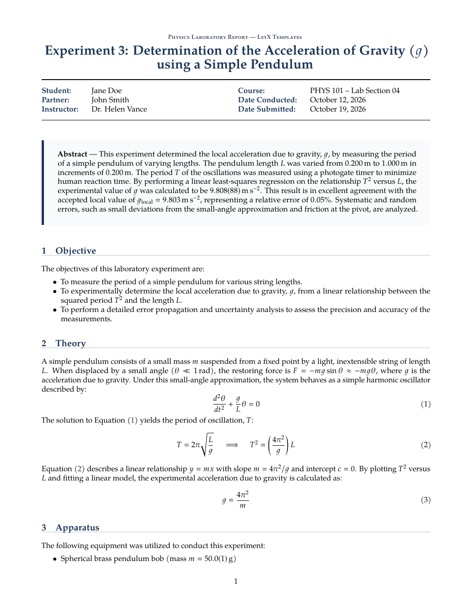

# Physics Lab Report — Free LaTeX Template

[](https://letx.app/templates/lab-documents/physics-lab-report)
[](LICENSE)
[](#compile)

**Physics laboratory report LaTeX template — title block, boxed abstract, Theory with numbered equations, Apparatus, Procedure, a siunitx data table, a pgfplots graph with error bars, error analysis and conclusion.**

Edit and compile this template instantly in your browser — no LaTeX install — at **[letx.app](https://letx.app/templates/lab-documents/physics-lab-report)**, with real-time collaboration and one-second compiles.



## Features
- Title block + boxed abstract
- Theory with numbered equations (amsmath)
- siunitx data table (booktabs)
- pgfplots graph with error bars + regression
- Error analysis + conclusion

## Use it online (recommended)
Open **[Physics Lab Report on LetX »](https://letx.app/templates/lab-documents/physics-lab-report)** and click *Open as Template* — it compiles in ~1 second, in your browser, free.

## <a name="compile"></a>Compile locally
```bash
git clone https://github.com/Shahriar-Labs/latex-templates.git
cd latex-templates/physics-lab-report
latexmk -pdf main.tex
```
Compiler: **pdflatex** (see `metadata.json`).

## About
Part of the free, open-source [LetX template library](https://letx.app/templates) — lab document templates for students, researchers, and professionals. Built by [Shahriar Labs](https://shahriarlabs.com).

## License
MIT — free for personal and commercial use. See [LICENSE](LICENSE).
