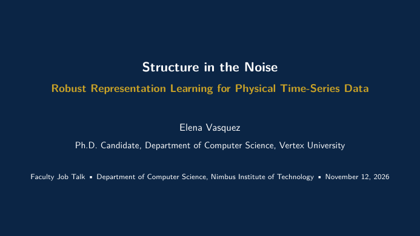

# Academic Job Talk Slide Deck — Free LaTeX Template

[](https://letx.app/templates/presentations/academic-job-talk-slide-deck)
[](LICENSE)
[](#compile)

**Academic Job Talk Slide Deck LaTeX template — academic job talk slide deck latex beamer. Elegant, compile-tested, editable online at letx.app.**

Edit and compile this template instantly in your browser — no LaTeX install — at **[letx.app](https://letx.app/templates/presentations/academic-job-talk-slide-deck)**, with real-time collaboration and one-second compiles.



## Features
- Elegant, modern design
- Compile-tested
- Fully editable sample content

## Use it online (recommended)
Open **[Academic Job Talk Slide Deck on LetX »](https://letx.app/templates/presentations/academic-job-talk-slide-deck)** and click *Open as Template* — it compiles in ~1 second, in your browser, free.

## <a name="compile"></a>Compile locally
```bash
git clone https://github.com/Shahriar-Labs/academic-job-talk-slide-deck.git
cd academic-job-talk-slide-deck
latexmk -pdf main.tex
```
Compiler: **pdflatex** (see `metadata.json`).

## About
Part of the free, open-source [LetX template library](https://letx.app/templates) — presentations templates for students, researchers, and professionals. Built by [Shahriar Labs](https://shahriarlabs.com).

## License
MIT — free for personal and commercial use. See [LICENSE](LICENSE).
