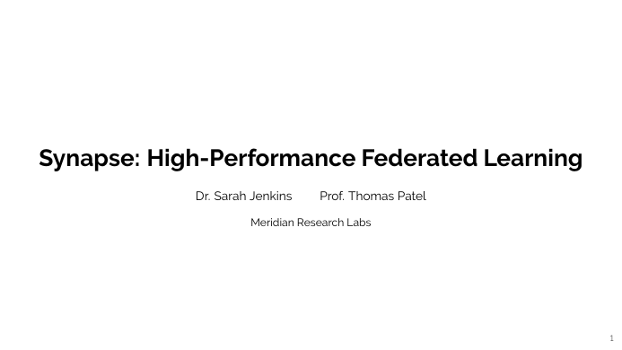

# Auriga Beamer Theme LaTeX Template

[](https://letx.app/templates/presentations/auriga-beamer-theme/)
[](LICENSE)

A 16:9 deck on the Auriga Beamer theme in two parts, architecture and design then performance and security, for a federated edge AI system, with a roadmap slide.

Edit and compile it in your browser at **[letx.app](https://letx.app/templates/presentations/auriga-beamer-theme/)**, with no LaTeX install and real-time collaboration. A compile takes a few seconds.



## What is in it
- Document class: `beamer` with `aspectratio=169`
- Compiler: pdflatex
- Files: `beamercolorthemeAuriga.sty`, `beamerthemeAuriga.sty`, `main.tex`

## Use it online
Open **[Auriga Beamer Theme on LetX](https://letx.app/templates/presentations/auriga-beamer-theme/)** and click *Open as Template*. It is free.

## <a name="compile"></a>Compile locally
```bash
git clone https://github.com/Shahriar-Labs/latex-templates.git
cd latex-templates/presentations/auriga-beamer-theme
latexmk -pdf main.tex
```

## About
Part of the free, open-source [LetX template library](https://letx.app/templates/): presentation templates for students, researchers and professionals. Built by [Shahriar Labs](https://shahriarlabs.com).

## License
MIT. See [LICENSE](LICENSE).
