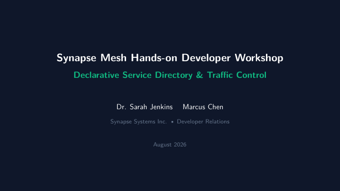

# Developer Workshop Hands-on Tutorial Deck LaTeX Template

[](https://letx.app/templates/presentations/developer-workshop-hands-on-tutorial-deck/)
[](LICENSE)

A hands-on developer workshop deck in 16:9 Beamer that walks through installing a CLI, initializing a workspace, declarative route configuration and benchmarks, with code listings.

Edit and compile it in your browser at **[letx.app](https://letx.app/templates/presentations/developer-workshop-hands-on-tutorial-deck/)**, with no LaTeX install and real-time collaboration. A compile takes a few seconds.



## What is in it
- Document class: `beamer` with `aspectratio=169, 11pt`
- Compiler: pdflatex
- Files: `main.tex`, `preamble.tex`, `references.bib`, and 6 section files under `sections/`

## Use it online
Open **[Developer Workshop Hands-on Tutorial Deck on LetX](https://letx.app/templates/presentations/developer-workshop-hands-on-tutorial-deck/)** and click *Open as Template*. It is free.

## <a name="compile"></a>Compile locally
```bash
git clone https://github.com/Shahriar-Labs/latex-templates.git
cd latex-templates/presentations/developer-workshop-hands-on-tutorial-deck
latexmk -pdf main.tex
```

## About
Part of the free, open-source [LetX template library](https://letx.app/templates/): presentation templates for students, researchers and professionals. Built by [Shahriar Labs](https://shahriarlabs.com).

## License
MIT. See [LICENSE](LICENSE).
