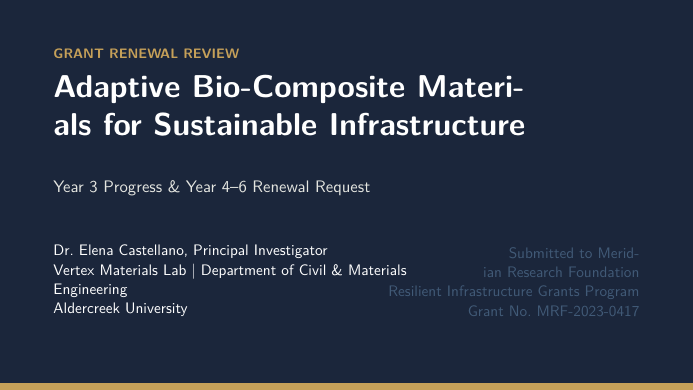

# Grant Renewal Progress Slides LaTeX Template

[](https://letx.app/templates/presentations/grant-renewal-progress-slides/)
[](LICENSE)

Grant renewal progress slides in 16:9 Beamer with an aims-against-progress table, a field pilot status slide, budget allocated against spent, and next-period objectives.

Edit and compile it in your browser at **[letx.app](https://letx.app/templates/presentations/grant-renewal-progress-slides/)**, with no LaTeX install and real-time collaboration. A compile takes a few seconds.



## What is in it
- Document class: `beamer` with `aspectratio=169`
- Compiler: pdflatex
- Files: `main.tex`, `preamble.tex`, `references.bib`, and 8 section files under `sections/`

## Use it online
Open **[Grant Renewal Progress Slides on LetX](https://letx.app/templates/presentations/grant-renewal-progress-slides/)** and click *Open as Template*. It is free.

## <a name="compile"></a>Compile locally
```bash
git clone https://github.com/Shahriar-Labs/latex-templates.git
cd latex-templates/presentations/grant-renewal-progress-slides
latexmk -pdf main.tex
```

## About
Part of the free, open-source [LetX template library](https://letx.app/templates/): presentation templates for students, researchers and professionals. Built by [Shahriar Labs](https://shahriarlabs.com).

## License
MIT. See [LICENSE](LICENSE).
