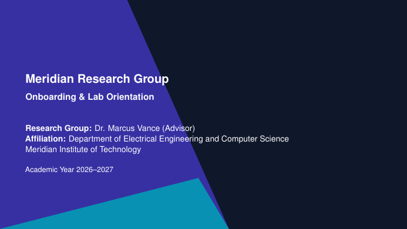

# Research Group Onboarding Slides LaTeX Template

[](https://letx.app/templates/presentations/research-group-onboarding-slides/)
[](LICENSE)

Onboarding slides for new research group members in 16:9 Beamer: who we are, expectations and culture, first steps, lab safety and protocols, and tooling.

Edit and compile it in your browser at **[letx.app](https://letx.app/templates/presentations/research-group-onboarding-slides/)**, with no LaTeX install and real-time collaboration. A compile takes a few seconds.



## What is in it
- Document class: `beamer` with `aspectratio=169, 11pt`
- Compiler: pdflatex
- Files: `main-blx.bib`, `main.tex`, `preamble.tex`, `references.bib`, and 5 section files under `sections/`

## Use it online
Open **[Research Group Onboarding Slides on LetX](https://letx.app/templates/presentations/research-group-onboarding-slides/)** and click *Open as Template*. It is free.

## <a name="compile"></a>Compile locally
```bash
git clone https://github.com/Shahriar-Labs/latex-templates.git
cd latex-templates/presentations/research-group-onboarding-slides
latexmk -pdf main.tex
```

## About
Part of the free, open-source [LetX template library](https://letx.app/templates/): presentation templates for students, researchers and professionals. Built by [Shahriar Labs](https://shahriarlabs.com).

## License
MIT. See [LICENSE](LICENSE).
