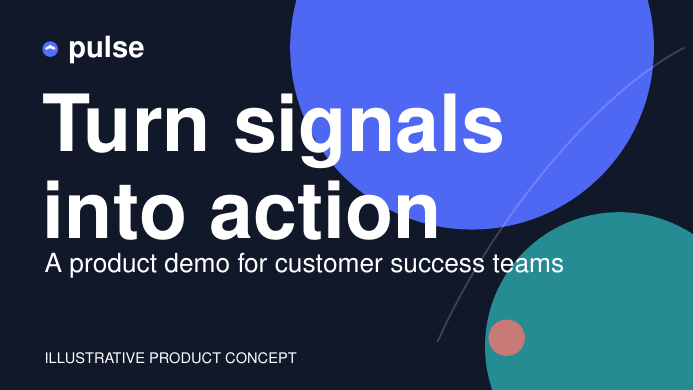

# SaaS Product Demo Slides LaTeX Template

[](https://letx.app/templates/presentations/saas-product-demo-slides/)
[](LICENSE)

A SaaS product demo in 16:9 Beamer drawn in TikZ, telling one customer story: scattered signals, a ranked account list, an explained score and a coordinated response.

Edit and compile it in your browser at **[letx.app](https://letx.app/templates/presentations/saas-product-demo-slides/)**, with no LaTeX install and real-time collaboration. A compile takes a few seconds.



## What is in it
- Document class: `beamer` with `aspectratio=169, 11pt`
- Compiler: pdflatex
- One self-contained `main.tex`

## Use it online
Open **[SaaS Product Demo Slides on LetX](https://letx.app/templates/presentations/saas-product-demo-slides/)** and click *Open as Template*. It is free.

## <a name="compile"></a>Compile locally
```bash
git clone https://github.com/Shahriar-Labs/latex-templates.git
cd latex-templates/presentations/saas-product-demo-slides
latexmk -pdf main.tex
```

## About
Part of the free, open-source [LetX template library](https://letx.app/templates/): presentation templates for students, researchers and professionals. Built by [Shahriar Labs](https://shahriarlabs.com).

## License
MIT. See [LICENSE](LICENSE).
