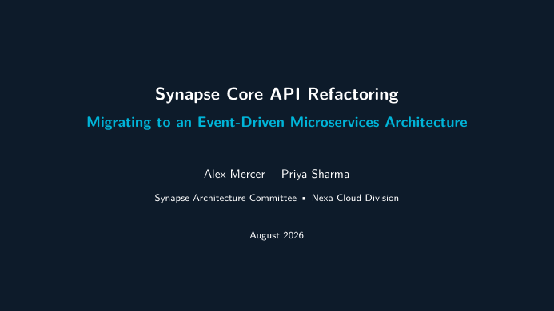

# Software Architecture Review Slides LaTeX Template

[](https://letx.app/templates/presentations/software-architecture-review-slides/)
[](LICENSE)

A software architecture review in 16:9 Beamer: legacy monolith bottlenecks, a target event-driven microservices design, performance benchmarks and a migration rollout plan.

Edit and compile it in your browser at **[letx.app](https://letx.app/templates/presentations/software-architecture-review-slides/)**, with no LaTeX install and real-time collaboration. A compile takes a few seconds.



## What is in it
- Document class: `beamer` with `aspectratio=169, xcolor={table}`
- Compiler: pdflatex
- Files: `main.tex`, `preamble.tex`, `references.bib`, and 4 section files under `sections/`

## Use it online
Open **[Software Architecture Review Slides on LetX](https://letx.app/templates/presentations/software-architecture-review-slides/)** and click *Open as Template*. It is free.

## <a name="compile"></a>Compile locally
```bash
git clone https://github.com/Shahriar-Labs/latex-templates.git
cd latex-templates/presentations/software-architecture-review-slides
latexmk -pdf main.tex
```

## About
Part of the free, open-source [LetX template library](https://letx.app/templates/): presentation templates for students, researchers and professionals. Built by [Shahriar Labs](https://shahriarlabs.com).

## License
MIT. See [LICENSE](LICENSE).
